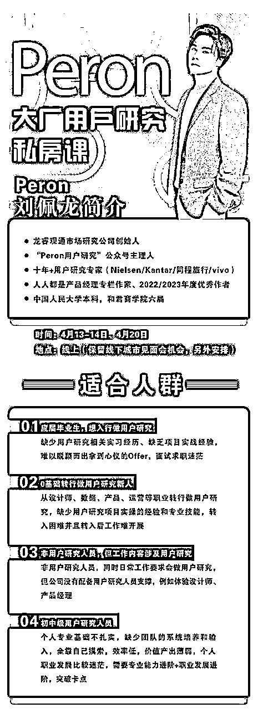
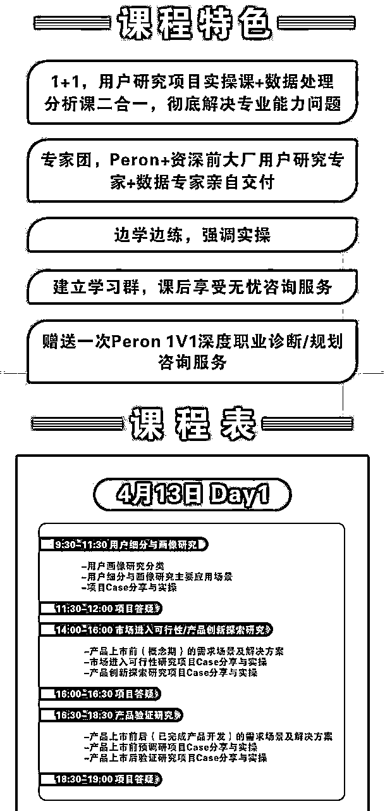
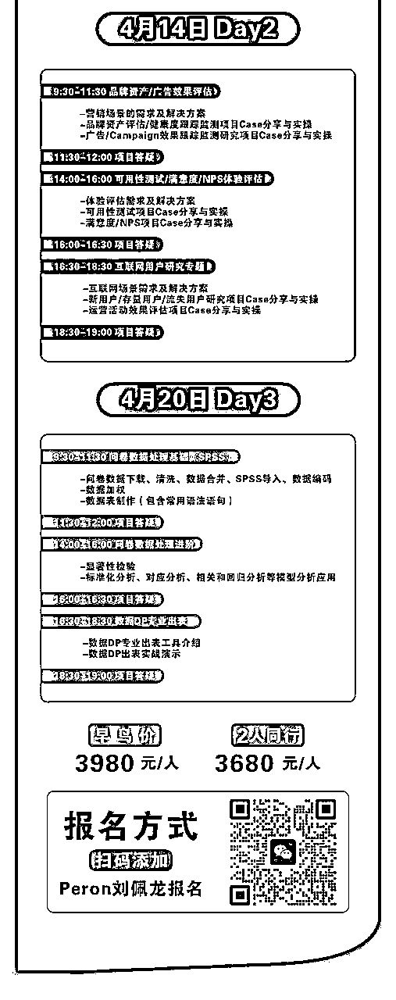
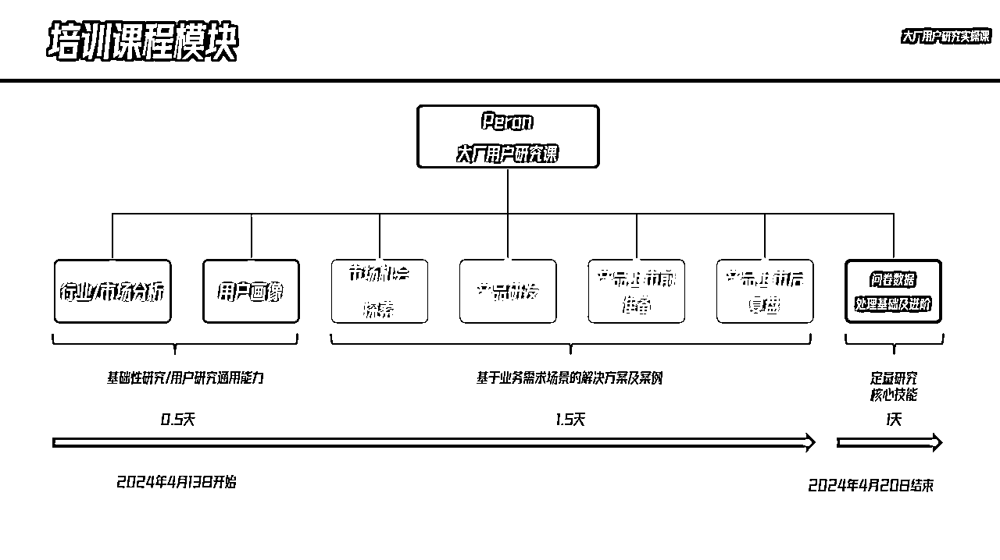
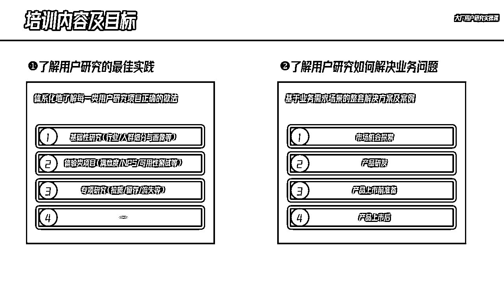
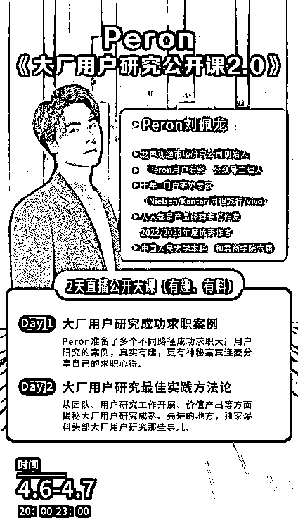

# 做垂直小众赛道知识付费第一个月，月收入15w+，我是如何做到的？

> 来源：[https://yzlfc64lat.feishu.cn/docx/W615dQ3HFoxb29xnpHDcAfs6nFc](https://yzlfc64lat.feishu.cn/docx/W615dQ3HFoxb29xnpHDcAfs6nFc)

大家好，我是佩龙Peron。

生财有术六期、七期会员，35岁，离开大厂创业不到一年，做市场调研（B端）和用户研究知识付费（C端）。

2023年，出于对职场的厌倦，也因为35岁中年危机，我从某大厂离职并决定彻底离开职场。

我原本打算放弃十余年的市场调研/用户研究工作经验，去探索新方向。然而阴差阳错，我发现我对这个社会的最大价值仍然来自于过去多年市场调研/用户研究的专业积累。

依靠以往在行业里的一点知名度和影响力（2018年开始在“人人都是产品经理”平台撰写专栏文章，2022年开始经营自己的公众号），有一些朋友在得知我离职后，主动找上门来希望我能帮助承接一些用户研究外包项目。

为了方便结算，我先是成立了自己的咨询工作室；随着需求的变多，我组建了团队，同时于2023年12月份把工作室升级成一般纳税人有限公司，正式把市场调研/用户研究作为自己的终身事业。

作为专业服务业，在没有什么客户资源积累的情况下，B端业务开展其实是比较难的，尤其是头两年，没有资质就意味着无法进入很多客户的供应商采购体系。

于是，从2024年3月下旬，我把B端业务的承接完全交给了团队，作为公司的创始人，我暂且把工作重心放到了C端知识付费业务开拓上。

我先是给自己设立了一个目标，做一个为期三天的课程，开课时间定在4月中旬，收费不能太便宜，毕竟这是一个小众专业垂直的赛道，最后定价3980/人，一期课程目标招收30名学员。

可以看出，从我设定目标到正式开课教学，中间我只有不到一个月的招生宣传时间，此外我还要留出一定备课时间。

坦诚来讲，对于这次能否成班开课我自己心里完全没有底，用户研究这个赛道客观来说就是比较小众，这是客观事实，我的客单价又很高（3980/人）。

我全网加上私域粉丝都不过万，我能凭借的只有我自己不到4500粉丝的公众号，以及不到1500粉丝的小红书账号，抖音、视频号等短视频渠道没有账号，积累为0。

但最后，我做到了，我不仅收满了30名学员，而且其中有1/4升级成我9999/年导师1对1服务的学员，也就是说我一个月GMV收入超过15万。

那么，我是如何做到的呢？

01

有信任的IP，精准的粉丝群体

在做这次课程发售前，我已经在互联网平台，断断续续就市场调研/用户研究这个领域输出了几十万字的内容，但因为这个赛道过于专业垂直，阅读量并不高，也没有什么物质回报。

如果换做一般人，早就放弃了。

但我做这件事一开始的初衷其实是很纯粹、很简单的，那就是：对自己日常用户研究工作做复盘总结，顺便也希望能给其他用户研究人一点启发和帮助。

靠着这份初心，我坚持了下来，写了很多自己对于用户研究职业的理解，以及用户研究专业知识、技能学习的一些心得。

然后慢慢的，我收获了最早的一批粉丝，虽然不多，但是很多铁粉。他们中不少加我微信对我表示感谢，并表示如果有付费课程、服务，愿意为我买单，这是我做知识付费最初的底气。

2023年8月，我决定把我的自媒体账号从工具人账号向IP号转型升级。因为现当下纯靠内容本身获取流量赚广告的钱生存是很难的，我曾尝试做过公众号流量主的项目，开了个小号，每天花一小时，出了几十篇十万+文章，每篇平均阅读量都好几万，但是总共也就赚了一万多广告费。

可见做自媒体内容的，尤其是专业垂直向的，靠成交（B端或者C端业务）赚钱养活自己是更加现实可行的方式，而成交有两个关键：一个是你的内容，专业度和质量；一个是你的人设，真实、真诚，这两个合起来才能构建起足够的信任成交。

所以除了写用户研究相关的垂直干货文章，我开始分享自己的成长经历、创业心路历程。我恢复了我公众号的更新，并且第一篇《快35岁大厂裸辞决定换一种活法》就破了2k阅读；第二篇《大厂离职4个月，我找到了一条适合大多数人的新出路》更是破了1万阅读（因为一些原因，中间有删除重发），要知道在此以前我写的用户研究专业内容阅读量都只有几百阅读。

2023年9月，我把我的公众号从“用研那些事儿”更名为“Peron用户研究”，同时开始运营我全网同名的小红书账号、知乎账号、人人都是产品经理账号，我首先要占据图文的高地，再图谋短视频、直播。

目前图文领域搜索用户研究基本都能在很靠前的位置找到我。

截至到2024年4月开课前，我在全网图文领域初步构建起我的IP矩阵，虽然粉丝不多，只有几千个，但大多都是精准粉丝。

美国知名学者凯文.凯利（K.K）有一个“1000个铁杆粉丝理论”： 一位创作者，例如艺术家、音乐家、摄影师、工匠、表演者、动画师、设计师、视频制作者或作家——换句话说，任何创作艺术作品的人——只需获得 1,000 名忠实粉丝即可谋生。

另外，凯文·凯利认为，“铁杆粉丝”指的是：无论你创造出什么作品，他们都愿意付费购买。

我不敢说我现在有1000位“铁杆粉丝”，但几千个里面找出几十个买我的课程应该还是可行的。

这就是我最后能拿到结果的关键原因。

关于垂直小众赛道的IP打造，我有几点心得分享给大家：

1.专业为本

在你的垂直赛道，你起码应该具备5年以上专业领域的知识&经验，达到平均线以上的专业水准，而且要能证明你在该专业领域拿到过结果，否则很难走得长远，知识付费最后一定拼的还是专业。

你可以凭借各种头衔蒙骗不懂行的人一时，但是最终一定会被反噬，例如李一舟。

2.流量时代，提供实用价值只是基础，提供情绪价值才是未来

我自我反思过，我目前主要提供的还是实用价值（各种知识干货内容输出），但人设有点过于正经、严肃、呆板，缺乏人格魅力。

这不仅是我，也是很多经历了高等教育、大厂系统培训后的人的通病，被统一格式化了，被很多条条框框禁锢，无法解放天性。

我最近才刷到一个叫做“听泉鉴宝”的IP，公益鉴宝赛道算小众吧？但这个IP却硬是把公益鉴宝这件事做出了6万人在线，全网千万粉丝，靠的就是有点不正经的人设，靠的就是知识干货中夹杂着搞笑内容的节目效果。

3.IP可以不完美，但要绝对真实、坦诚，成长大于完成

过于完美的人设让人产生距离，这对于知识付费来说其实不是一件好事，何况人无完人，完美的人设本身就让人产生怀疑。

为什么现在360老总周鸿祎做网红很成功，最关键的就是人家不端着、也不装逼，非常坦诚，实事求是，所以即便很多人讨厌360的广告弹窗，但也被他这个人设吸粉，包括我。

一个带有瑕疵但真诚、真实的IP更容易让人亲近、共情，更容易让人想要陪伴Ta一起走下去，从不完美到完美。

一个已完成的IP或许很耀眼，出道即颠峰；但一个成长型的IP更有生命力，能穿越更长的时间周期。

4.任何一个垂直赛道，做到头部都很赚钱，所以不要轻易抛弃自己的老本行去做割人韭菜的IP

基于自己多年的专业技能、经验来去做知识付费，我觉得没有什么丢人的，反而是有社会价值的；但那种自己没拿到什么大结果，没赚到什么钱，转而靠教别人赚钱而赚钱的，多少有点庞氏骗局那意思。

例如，我曾经亲眼见过一个很有名气的设计师，不教人设计转行去教别人做咨询师赚钱；还见过一个设计师不教人做设计，转而教设计师做小红书创业的；还见过一个做金融、投资的，在自己专业领域做得不怎么样转行做直播然后教人做直播赚钱的……

对于这些人，到底能走多远，我是要打一个大大的问号的。

当所有人都追逐热点，追求短期的利益，那么专业垂直赛道领域的知识付费反而会迎来机会。

02

打造符合用户需求的产品

为了做出一个符合用户需求的产品（课程），我做了以下几件事情：

一、1对1咨询

在此之前，收了一个服务周期为一年、1V1服务的学员，在辅导这位学员的过程中，让我对当下用户研究人员的痛点和需求有了非常直观的感受。

此外，我日常也接一些1V1的单次求职咨询。

说实话这些1V1咨询服务从投资-回报角度并不划算，但是我坚信1V1咨询能让我对用户的需求保持敏感，能让我更好地把握用户需求及其变化趋势。

二、社群问卷调研

为了做验证，我又在我的几个用户研究社群里发起了问卷调研，收集了上百位用户研究人员工作中的痛点和需求，发现大家的痛点和需求比较一致。

1.专业底子薄弱，项目经验欠缺，做用户研究靠“拍脑袋

“专业基础不够扎实或者缺少经验，这特别容易发生在中小企业的用户研究团队，以及中途转行、跨行过来的用户研究人员身上。

他们做用户研究，完全没有章法，怎么简单粗暴怎么来，同样一个类型的项目，做一百次可能能有一百种模样，完全没有标准和沉淀。

这并不是他们想这样，而是他们压根儿不知道类似的需求最佳解决方案、实践是怎样的，包括团队领导、老板。

2.因为缺乏沉淀和标准化，工作效率低下

我在辅导我学员的过程中，Ta跟我反馈的一大痛点就是做项目效率低下，因为基础不扎实，写一个研究方案、做一个问卷设计、写一份报告每次都要想很久、花很长的时间，最后还要推倒重来，这中间浪费了非常多的时间、精力，而且还影响工作产出和绩效。

于是我跟他反复灌输，要做项目的复盘和标准化沉淀，同时我也会提供给他很多参考模板和案例，然后他就去做了，效率和绩效都大大提升。

一个常规的项目，每一次都能当作新项目去做，每一次都需要耗费很多时间和心力去输出成果，这是走弯路。

正确的路是有人为你指引方向，为你提供参照模板，帮助你做复盘和标准化沉淀。

3.定量研究能力薄弱，数据处理分析是短板

我在乙方时是定量用户研究员的角色，虽说是做定量研究，实际上在数据处理分析这块并没有什么太多积累，因为乙方有数据DP的角色，数据处理、出表、建模分析都是他们在负责，以至于我到了甲方后一段时间内都不会SPSS出表。

到了甲方用户研究团队，我发现，不只是我不会做数据处理和高阶数据分析，很多人也都不会（统计学等理科专业出身的还好），哪怕是大厂团队，真正能专业出表+高阶数据分析的也寥寥无几。

但是我们都知道数据处理分析在甲方是硬性要求，甲方可没有什么专门的数据DP给你出表，所以很多人数据回收回来后处理数据出表能花巨多的时间，而且可能还是错的，很难想象这些错误的数据结果最后能产出什么结果。

再就是越来越多人开始意识到用户洞察的关键就是结合业务理解去挖掘分析数据，如果这块的能力是短板，那就只能产出Facts而不能给出Insights。

然而，不夸张地说，很多用户研究人员的数据分析挖掘能力是很弱的，只会简单的描述性分析、交叉分析。

三、课程开发及目标人群选择

基于以上需求调研，我设计了周末2天（4.13-4.14日）的用户研究项目实操课+周六1天（4.20日）的SPSS问卷数据处理实操课。

课程名叫《Peron大厂用户研究私房课》，这里面“Peron”是IP背书，“大厂用户研究”是钩子，帮助学员最终能够向大厂用户研究最佳实践看齐甚至帮助他们进入大厂做用户研究，这是我课程服务的目标。

我把我课程的目标用户群体锁定以下四类：

看得出我的目标用户以初阶的用户研究人员为主，这也符合知识付费行业的规律。

当然，这并不是说一个专业垂直赛道的中高阶用户就无法做知识付费。当然也能做，前提是要做出符合他们需求的产品：他们需要的不是纯知识产品。

我与和君商学合作开办的《和君商学·战略用户研究班》正在招生，就是主打这群人的，课程知识服务只是一方面，里面的人脉资源+导师背书才是关键。

需要说明的是，初阶和中高阶用户没有高低之分，只不过大家处于不同阶段，各自的需求不同，我们提供知识付费服务的应该一视同仁、做好交付，不要辜负学员的期望。

下面是最初的课程内容设计：

四、课程产品第一次调整

等课程出来后，有一些学员反馈时间问题，认为放在工作日晚上教学会更好，这个建议我打算采纳，但会在二期的课程付诸实施，一期当时因为已经宣传出去，有些学员已经付费，所以时间上不好再做调整。

有些学员反馈课程内容会不会太简单、基础，我立马对课程体系进行了升级，更加体系化。

并且明确了课程亮点：一方面带你了解最佳实践，把事情做正确；另一方面强调业务导向业务价值，做正确的事。

这次课程的调整，明显加快了学员招收的进度。

五、课程产品第二次调整

在招收学员的过程中，我发现一些学员反馈时间冲突，没时间上课，又或者说只能上部分课程。

还有一部分学员表示只想上其中一部分课程内容，能否分开售卖，例如只上两天的用户研究实操课。

于是我突然想到以前上线下的培训课可以免费参加线下复训这件事，于是我果断决定参加一期课程的学员可以免费参加二期的复训，这就能很好地解决时间冲突。

此外，我已决定把一期三天的课程拆分成独立的两个课程单独来售卖，每个课程定价为2980/人，加起来其实要6000元，这么一对比，一期的反而更划算，还可以参加复训，没有理由不买一期的课程。

有人说这会不会提前透支私域的购买力，会，所以二期的课程招生我会重点放在小红书、B站、抖音等公域流量获取上。

03

宣传：图文预热，直播成交转化

一、图文预热

我于3.24日才正式通过我的公众号发出来我的招生宣传文案《Peron大厂用户研究私房课/训练营一期报名，你确定不进来看看吗？》以及宣传海报，距离4.13日开课只有20天宣传招生时间。

这篇文案最终阅读只有五六百，我同步在我的朋友圈进行了转发，小红书也发了几篇帖子，但是没有溅起一点水花，一个来咨询课程的人都没有。

我按部就班，在公众号持续输出相关内容，并在文章底部推荐我的课程；在我的知识星球（当时只收费50元，目的在于筛选出我的付费用户），回答星友提问，顺便推荐我的课程；在朋友圈隔三岔五宣传一波。

过了两三天报名的只有2-3个人。

我和一个朋友逛公园时还自嘲说，这次能招到5名学员就不错了，满10个人就开班。

但是通过对头部知识付费机构的学习，我又清楚地知道，高客单价知识付费用户的决策周期比较长，密集成交集中在后半段时间，我还有机会。

二、直播公开课

就在这时，我意识到一个问题，纯靠图文内容输出很难带来足够的转化，我又来不及做短视频，我只能通过直播形式与我的目标用户直接对话，“当面成交”。

在知识付费领域有一个新的共识：做图文、短视频是存钱，获取曝光、流量、粉丝；直播是取钱，把流量、粉丝现场进行成交和转化。

想清楚了这件事，我立马决定在4.13日开课之前开几场直播。这个直播还不能是无内容、唠嗑拉家常式的，必须通过主题干货分享来吸引大家观看。

我想了下，决定先做两场《大厂用户研究公开课》主题的分享，一场是《大厂用户研究求职攻略(4.6日)》，一场是《大厂用户研究最佳实践(4.7日)》。

但实际上我直播经验基本为零，也不太擅长公众演讲，我只是清醒的知道我必须去做这件事，我就去做了。

我先是在3.27日发布了直播公开课的海报，然后同步开始搭建直播间、筹备直播分享内容。

我请了一个专业的团队来搭建直播间+采购设备，最终花了3万多，为什么这么做？

做一件事通常有两条路径：一条是先小投入，试跑，慢慢迭代并加大投入，这是比较稳妥的办法；一条是直接一步到位，与行业标杆水准对齐，然后赌一个未来，风险更大，但能让你有一个更靠前的起跑线。

这件事情上，我选择了后者，因为我相信直播这件事是需要我All in去做的事情，也是我变现的关键，所以我必须拿出专业的态度来。

为了第一场直播，我邀请了3个有大厂用户研究背景的朋友来连麦。

最后两场直播的效果远远超出我的预期：两场直播下来，我招收的学员超过了20个，我的直播间投资也立马收回了成本。

中间其实并不那么顺利，没有直播经验的我，又想为用户提供专业水准的直播体验，把能踩的坑都踩了：例如临近前一天开播才发现视频号不够500粉丝无法电脑开播；与嘉宾连麦时，有回音，嘉宾说话时我就只能闭麦；第二场直播刚开场麦克风没声音，大半个小时才解决重新开播；直播期间缺少与用户互动……

但我很坦然接受了，因为我知道自己必须要经历这样一个过程，总会进步成长的，所以我前面几场直播我都没有录播。

做完两场直播，离4.13日开课其实还有几天时间，我想着说再做一场直播再多成交几个学员，于是借着课程升级名头，又在4.12号晚做了一场开课前的课程安排说明及答疑，结果学员真就超过了25名，快接近30名目标了。

最终，4.13日开课时整整齐齐30名学员到场。

04

写在最后

通过这件事，对我自己的影响是深远的。

这个影响并不是金钱上的，一个月赚到十几万对我来说，真的没有太大感觉，因为这个钱对于很多大厂人来说是稀松平常的。

对我真正影响深远的是，通过这件事，我开始意识到很多事情并没有那么难。

我重新建立起了确定目标-正确的执行路径-执行力拉满-拿到结果这一逻辑的底层自信，让我对很多原本看似不可能达成的目标燃起了昂扬的斗志。

一个人会通过做成一件事而建立起自信，进而做成很多件事；这和一个人会通过一个点的优秀，走向全面优秀的逻辑一样，例如姚明。

例如，当我在4.20-4.21日和君商学六届学员十周年聚会上，得知和君商学正在联合学员开展合作办班教学，我立马就申请报名开办《和君商学·战略用户研究班》，同样不到一个月的招生时间，只要这件事有高价值，先不管能不能招到足够的学员，尽自己最大的努力去做就行，结果看淡。

这是什么精神，这是亮剑精神！