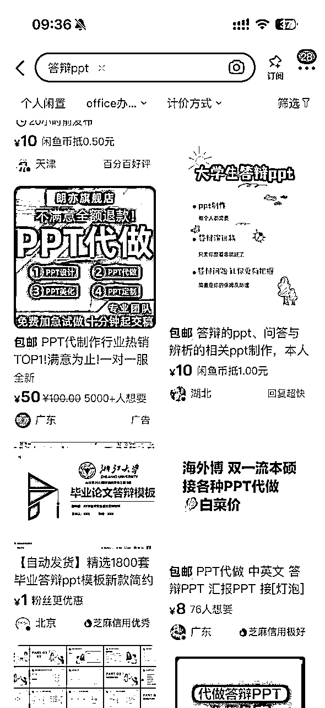
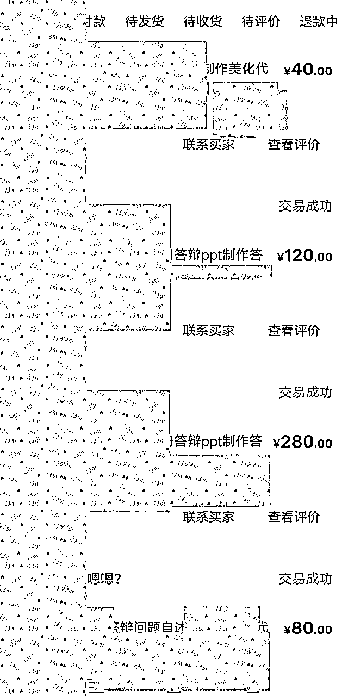
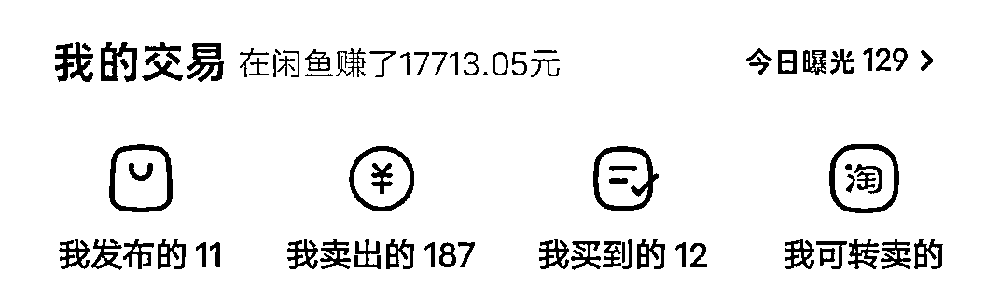
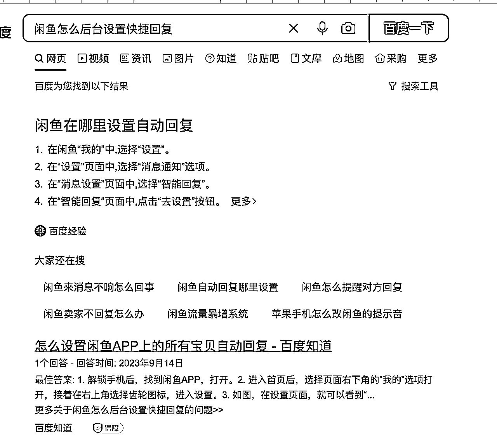
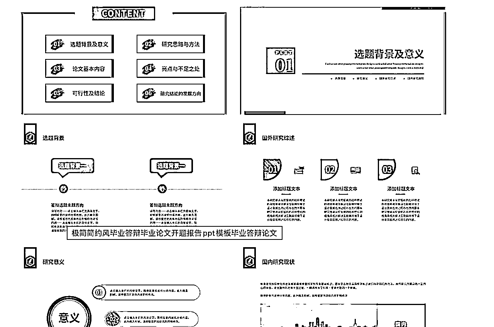
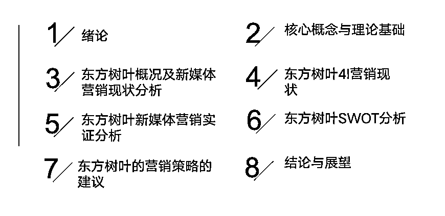
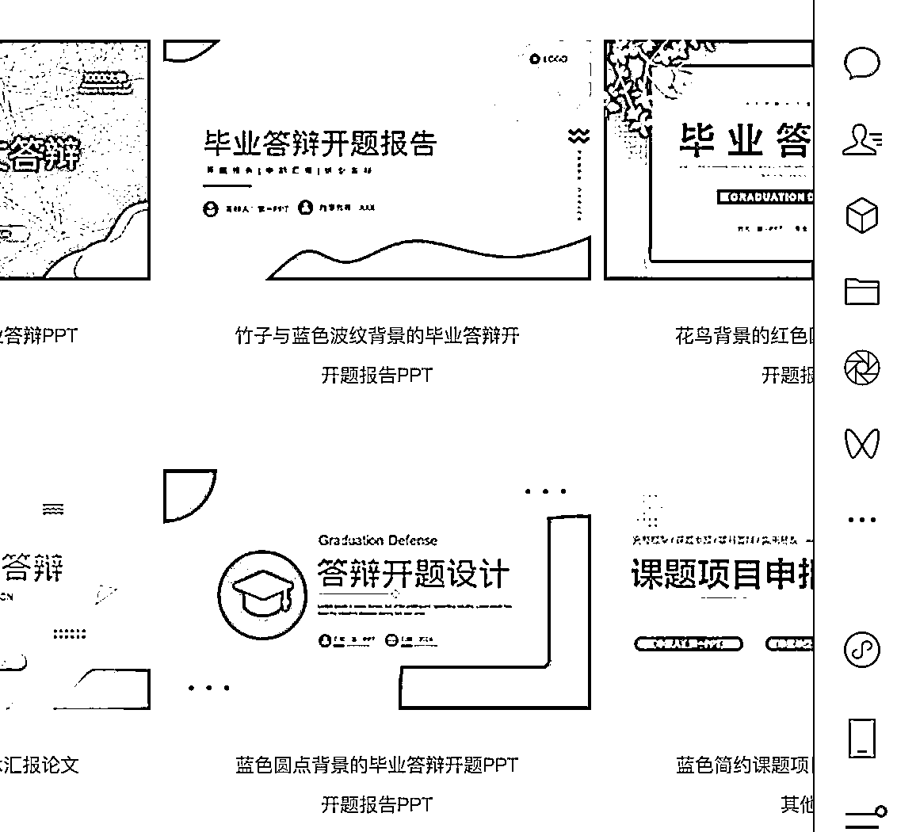
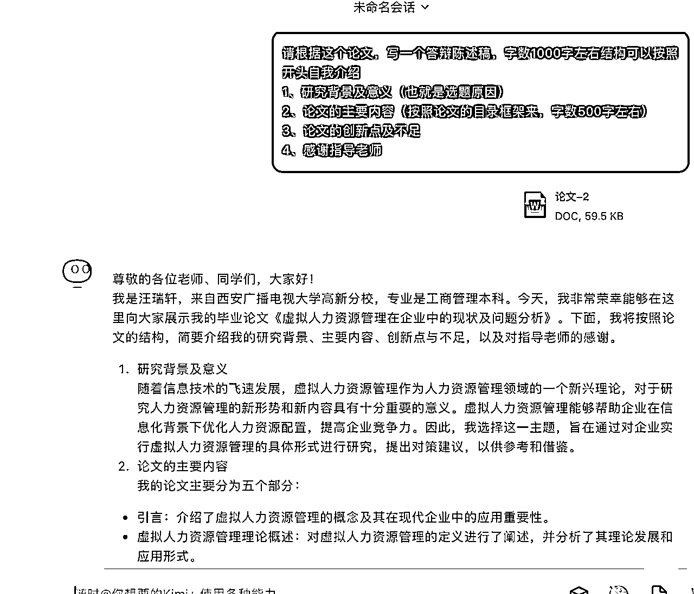
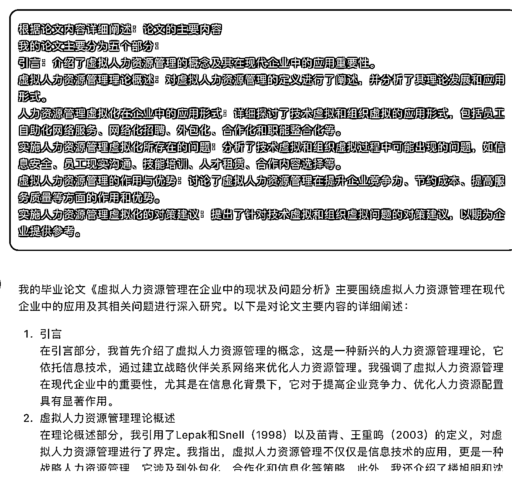
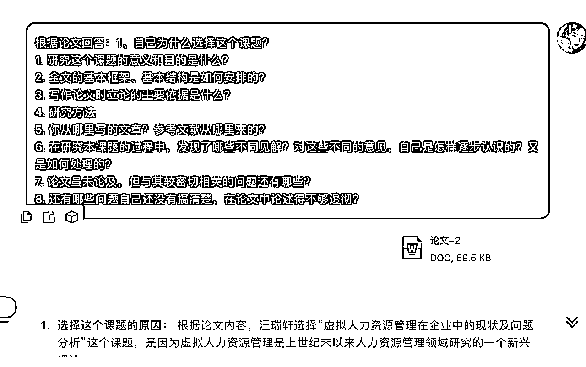

# 新手小白用ai做答辩Ppt月入过万（含完整实操）

> 来源：[https://wwnciidgzqc.feishu.cn/docx/WPqodaHrEomEXAx5gAWc7JJpnhb](https://wwnciidgzqc.feishu.cn/docx/WPqodaHrEomEXAx5gAWc7JJpnhb)

# 一、关于我的介绍

大家好我是苏苏。95后。

1、专注代写9年。大学毕业靠写作赚到人生第一个100w。

2、23年接触ai，用ai为工作室降本增效。

3、含泪怒➖30斤。

OK自我介绍到此结束。

哈哈，有机会再放这么多年的完整版人生经历。

废话不多说，下个部分。

# 二、关于ai做答辩ppt项目是啥和收益

## （一）答辩ppt是啥

### 1、全日制

每年全日制毕业生很多。主要集中在3-6月份。

这类学生需要答辩相关服务，例如答辩ppt，答辩陈述稿，答辩问题预测。

### 2、非全日制

一年2个批次，春季批次和全日制毕业时间差不多，集中在2-6月。

秋季批次集中在10-12月。

综上，需求非常大。

我这里说的是根据客户的论文制作ppt，主要是用ai来做，非常快。并非卖模板。

## （二）晒收益-数据说话

收益里包含了代写文案的，ppt大概成交了1万多，还没算微信的呢。

因为我还有我的代写业务，所以ppt业务就没有放大。

晒收益说明

1、项目确实是可以赚的到钱的。

2、小白确实是可以干的。

3、我实操过跑通完整闭环的。

# 三、什么人更适合做这个项目？

## （一）ppt设计师

原来你就懂ppt的话，掌握我这个方法，简直大杀四方了，家人们。

## （二）大学生

大学生才懂大学生，你周围同学的啊，我哭了，抓紧冲。

## （三）懂wps的小白

熟悉wps的基本操作即可。

我写的是更适合这个项目。

当然，如果你有耐心，有学习的态度。

其实，我觉得但凡会用电脑的，下场熟悉一下都没啥问题的。

# 四、项目闭环思路

总思路

接单-制作（自己做或找人做）-交稿

## （一）接单

可以闲鱼、小红书、朋友圈啥的都行。

还可以接淘宝商家的。但是我不建议，单价有点低。

不如自己整个闲鱼就行。

我感觉闲鱼成交比较快，来这上面肯定是买东西的。

所以我就做了闲鱼的赛道。

小红书我没发过，我没有发言权。

其实我今年比较想入局小红书。

因为小红书可以长尾流量。

闲鱼就是5分钟内不回复，客户可能就跑了。

## （二）制作

我这里主要是自己和办公室小伙伴制作的。

线上找了写手，但是质量堪忧。

沟通成本太大了。

所以本文主要讲自己咋用ai做。

其实很快，一个耗时半小时-2小时内。

通常1小时左右。

原谅我，我是重度强迫症，我做的比较慢哈哈。一般1小时。

## （三）交稿

给客户交稿。

基本上你做的好，他还会给你介绍好多小伙伴过来。

# 五、接单-闲鱼如何上架商品及话术

## （一）上架商品

这里我就不说的太啰嗦了。

很简单，找对标账号。

你搜答辩ppt。

看谁销量高。评价多。

你直接抄他的文案还有内容就行。

当然了，你别紧着一个人抄。

可以抄a的标题，b的文案。

当然了，自己稍微改动改动也行的。

但是！！千万不要自己纯写原创。

因为人家火是有原因的。。

里面检索词比较多。

## （二）主图

有能力的可以自己去【稿定设计】或者其他软件。自己设计一个图。

但是前期，家人们。

我是能懒则懒。

你做闲鱼平台，你就去小红书搜答辩ppt，用小红书卖家的主图。

或者去淘宝搜。

哈哈哈，我就是一个搬运工。

## （三）后台设置快捷回复

百度去。

## （四）基本的个人介绍还有头像啥的

这个还是找个对标账号。

同时给自己一个人设。

比如研究生在读制作ppt。

比如ppt设计师。

## （五）shua单

前期没有流量。

可以找朋友家人给自己刷。

尽量找买家号。就是他没有卖出宝贝那种。

### 1、shua单的步骤

1、模拟真实买家，搜关键词，找3家进去问，做答辩ppt吗，聊几句话。

2、找到你自己的店。进去游览商品，停留。

3、两个人开始对话，然后真实一点再下单。

4、第二天发货，做评价。

### 2、刷游览量的步骤

网上有卖游览量的还有想要的还有店铺粉丝量关注的。

这样大家看见这个商品觉得老卖家了哈哈。

这个有专门卖这个的。

## （六）接单话术

您的答辩ppt有什么要求？

ppt有固定的模板吗？没有的我这边就找一个简单大方的。

什么时候要？

需要多少页？

您预算多少？

解读

1、问ppt模板，客户有模板了，要按照模板做。

2、问时间，确认下是不是着急的，着急的可以加钱。

3、问页数，ppt一般10-20页，有的卖家按照页数收费。

也有的客户说不知道多少页，老师要求讲3-5分钟。

4、问预算的好处是，低价客户直接淘汰就好了。

# 六、接单价格

这个我还真不好说。

我一开始卖的40元左右也卖。

后来到300了。

我的建议是每个人水平不一样，你可以去闲鱼问其他家价格。

根据他们的价格总结出自己的价格。

另外一个小技巧。

报价的时候不要报价一个。

套路1:

120元包修改3次。

100元包修改1次。

如果简单交任务60元一个。

如果要求简单，预算更低。

套路2:

5年设计师 200元包修改

5年设计师 100元修改3次

3年设计师 150元包修改

大概这样也行

懂我意思吧，设置3个价格。

客户有钱就选择最贵的。

客户没钱也不至于流失。

最低的价格是你觉得，哎，我接了也可以的这种。

# 七、实操

我咋这么能写，我服了。

现在才到激动人心的实操环节哈哈哈。

我这个教程写的比较小白，都是大白话啊。

让大佬们见笑了。

话不多说，上车！！！

## （一）先来认识客户要求ppt

1、先看客户有没有特殊要求。

2、因为客户隐私问题，我就不放我做好的ppt作为示范了。

### 1、第一种：有固定结构

1、下面截图是客户的要求（图片）。这个属于有固定结构了。

2、但是需要你归纳总结，为啥？因为他的论文不是按照这个结构来的。

他的论文章节可能是

1、绪论

2、概念

3、问题

4、对策

客户要求解析：这种情况就是有固定的结构了，就要做成这种的。参考下面ppt:

### 2、第二种：没有固定结构

如果客户没给要求，就按照论文的结构来做。比如这种的。

就是根据他的文章来进行梳理就好了。

### 3、答辩陈述稿是啥？

就是根据论文答辩ppt，写一个对应的讲稿。

### 4、答辩问题是啥？

就是根据论文，回答常见的答辩问题。

## （二）模板去哪里找

### 1、免费PPT网站

https://www.1ppt.com

尽量用蓝色这种简洁大方的模板来做，注意要点我截图的这种，不要点付费的。

当然还有一些其他付费的网址也可以。

当然还可以直接用稻壳会员里面的模板。

### 2、稻壳会员网站

去淘宝，搜稻壳会员。

你可以买3个月的8.8元。

这个真的绝了，特别好用。

### 3、 ai协助网址

啥都可以，我是习惯用kimi了。

https://kimi.moonshot.cn/share/coboftsudu6f9brc2j0g

## （三）实操ppt和陈述稿

### 1、先看要求（前面说了）

### 2、找合适的模板（前面说了）

### 3、根据论文用ai归纳总结

百度下载了一个文章哈。

话术：

请根据这个论文，写一个答辩陈述稿，字数1000字左右结构可以按照

开头自我介绍

1、研究背景及意义（也就是选题原因）

2、论文的主要内容（按照论文的目录框架来，字数500字左右）

3、论文的创新点及不足

4、感谢指导老师

点击链接查看和 Kimi 智能助手的对话 https://kimi.moonshot.cn/share/cp2n622tnn0v5qd9jub0

但是一定要看和论文内容对应不对应啊啊啊

给话术

一般客户都喜欢内容部分详细一些

找个ppt模板套进去就行

### 4、稻壳咋用

有的时候分为5部分，但是模板没有5部分结构。

这个时候你用稻壳，智能图形。

最后再和你原来模板颜色调整一下。

具体看视频吧，特别简单。

## （四）实操答辩问题

就是根据论文，提出一些预测问题，如果客户给问题，就按照客户的来。

如果客户没给，可以把论文给ai，让他预测。

我这有一些常见的问题。

点击链接查看和 Kimi 智能助手的对话 https://kimi.moonshot.cn/share/cp2nd08fkflf2f7unreg

1、自己为什么选择这个课题？

1.  研究这个课题的意义和目的是什么？

1.  全文的基本框架、基本结构是如何安排的？

1.  写作论文时立论的主要依据是什么？

1.  研究方法

1.  你从哪里写的文章？参考文献从哪里来的？

1.  在研究本课题的过程中，发现了哪些不同见解？对这些不同的意见，自己是怎样逐步认识的？又是如何处理的？

1.  论文虽未论及，但与其较密切相关的问题还有哪些？

1.  还有哪些问题自己还没有搞清楚，在论文中论述得不够透彻？

# 八、项目卡点

到最后了，我感觉我真是啥都写。

其实这个项目一个月赚10万或者更多，我觉得都是OK的。

就是自己接，我觉得几千元，过万啥的都是比较轻松的。

但是为啥我没有放大呢。

# （一）接单

### 1、自己接不完，时间投入大

真的接不完，单子太多了。

而且咸鱼尽量5分钟内就得回复，不然他就跑掉了。

特别消耗人的时间，就是老得在手机面前盯着。

之前一天接4000元的时候，我们两个人基本上一直在回复。

### 2、找客服或者员工

说起这个我就心酸。

我可能一直在这块处理的不好，就是不知道该咋分钱。

办公室自己的员工弄的话。

他们本身手头还有代写的活。

如果来弄咸鱼做ppt就会出现以下问题。

1、原来手头代写的活没人做了，时间不够用。

2、分成的话，比如一个ppt分到50提成，那大家都会来做ppt，不做文案了。

3、门槛比较低，之前出现过他们私下接单自己开个账号的问题。

4、ppt有时候没弄好，需要晚上加班或者对接，员工不愿意下班以后处理，哪怕给钱加提成，不想一天全部都在弄单子。

5、再招聘临时工或者线上的客服，招1个肯定不太现实，没法全天盯着。咸鱼如果一直不成交，很影响流量。

# （二）做单

### 1、丢线上质量差

我们一开始都是丢给同行还有线上。

但是做的不错的人真的很少。

经常写手做的有问题。

客户发脾气，售后成本很大。

来回沟通太麻烦了。

再加上ppt是突然决定做的。

应该先招聘ppt的人员就好了，我们是一边接单一边招聘。

手忙脚乱的。

### 2、丢线上做不过来

大部分都是自己手动做。

做的速度就比较慢。

一天可能就能做1-2个。

教他们用ai啥的，需要时间培训一下。

这时候需要不断找写手。

沟通成本也是比较大的。

# （三）沟通

太重要了。

为啥我要把看客户要求放在最前面。

因为很多客户都是，我没要求，你看着做。

过两天突然说，学校要求xx要求了。

所以这个提前确定好一定很重要。

无穷无尽的售后真的很头疼。

# 九、项目的理想模式

## （一）写手这块

最好是先招聘会做ppt的人。

然后统一拉群培训。

但是这种的有的不爱培训，有的觉得免费的不珍惜。

有的就是想赚零花钱，时间不咋多比较忙。

其实最好是找到几个同频的人，一起干这个。

或者大批量招想赚钱的人。

类似航海。

这样培训出来的写手，价值观等同，做的又好又快。

我可能是太讨厌售后沟通了。

所以到最后我就办公室做ppt了。

做一个没问题。

线上做一个废一个哈哈哈。

## （二）客服这块

其实最好是从刚才的写手里面筛选。

因为自己做过。了解。

所以报价也好，要求也好。

能够对接清楚。

这样可以省去很多售后的麻烦。

## （三）流量这块

这个还好啦，可以从写手客服里面出，也可以单独。

基本就是这样，谢谢大家观看。

这个Ppt项目，是一开始为了增加点办公室收入的哈哈哈。

结果搞的大家都很累。

原来代写的没时间弄。

代写搞了9年。

目前遇到的卡点基本也和上面相同。

其实我还写了很多代写的教程。

有时间的话整理下都发出来。

包括ai代写。

我可能没那么多的指令。

就是看懂要求，化繁为简。

欢迎大家和我交流～

## （四）合作

可以找到靠谱的团队承接。

但是我目前还没找到。

# 十、项目的延伸

这个我目前还没有做。

但是我觉得加进来的客户也可以不浪费掉。

1、【卖模板】可以卖答辩ppt模板

2、【卖课程】可以教学生自己怎么做答辩ppt

# 如果大家觉得还不错。希望 帖子收到一个点赞哦。比心！

xiaosujx997