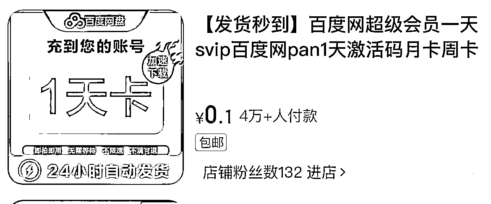
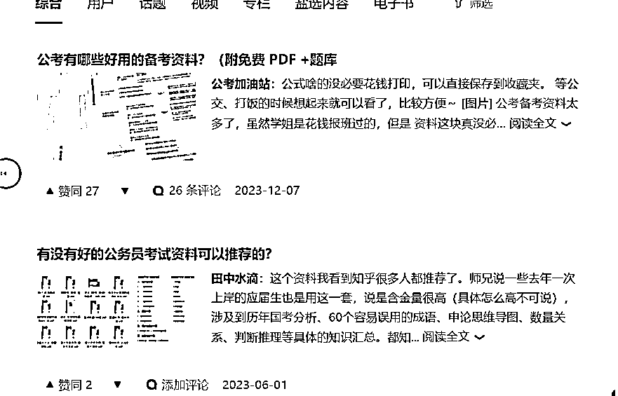
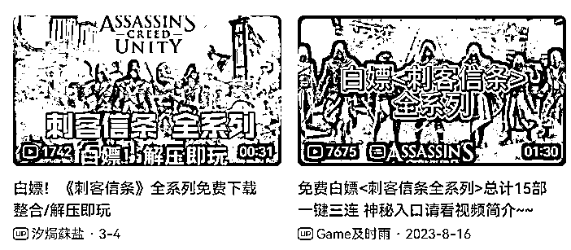
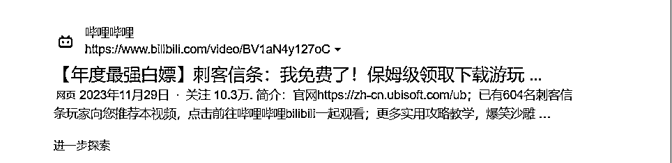
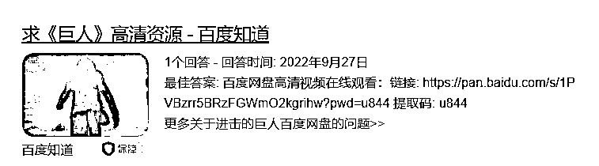
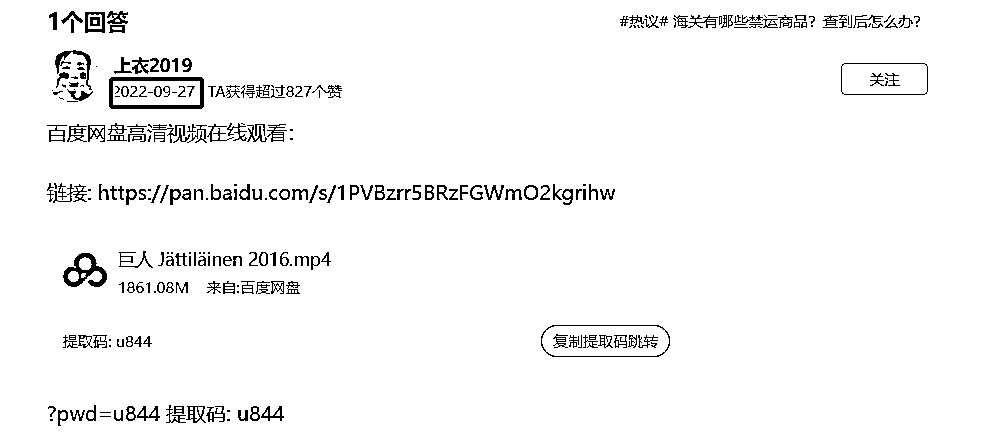
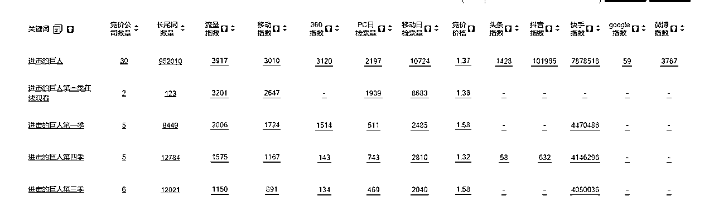
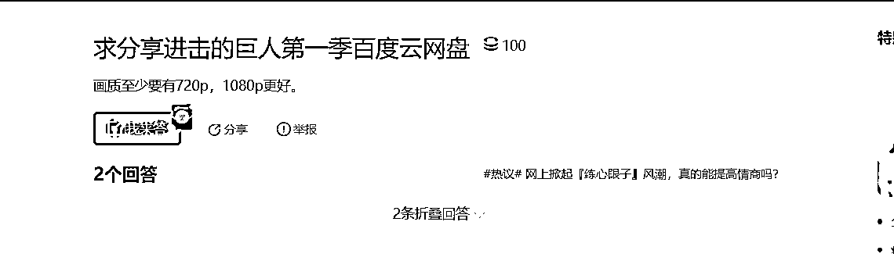
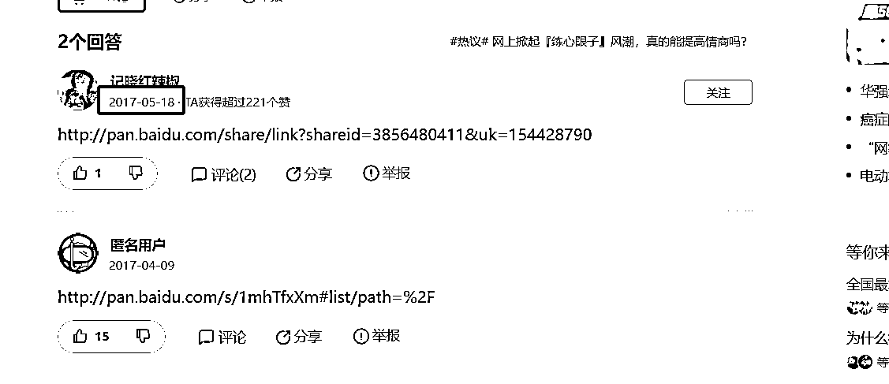

# 网盘拉新实现半自动化躺赚，2024年最适合新手的0成本创业项目

> 来源：[https://jj6w8w5cri.feishu.cn/docx/Y9WHd3DhJo4ddlxriQVcvjVnnhc](https://jj6w8w5cri.feishu.cn/docx/Y9WHd3DhJo4ddlxriQVcvjVnnhc)

大家好，我是阿杯，95后连续创业者。

不用投入，不用销售，打造半自动化赚钱机器，并且同时具备培训价值和分销价值，这是网盘拉新最诱人的地方。

## 一、为什么我推荐新手和培训团队选择网盘拉新

如果从项目本身考虑，那么网盘拉新我相信很多团队是看不上眼的，天花板低，不稳定，客单价低，由于不稳定导致难以扩大团队，由于人效低导致难以招募人才。

然而，对于学员培训而言，网盘拉新是一个很好的项目。因为我们需要给学员提供成本低、易上手、可复制的简单项目。固然现在短视频带货风起云涌，是个人都知道做ip才是长期主义，但对于不太懂赚钱的新人小白，真的能坚持下来，做变现周期这么久的短视频带货项目么？

答案我认为是否定的，就像某些微商团队做培训是以闲鱼无货源为基底一样，一个门槛低，易上手，快速变现的项目，才适合作为培训。对于新手小白而言，迅速赚到第一块钱，在实操中提高对商业的认知，并且赚回学费才是第一要务。

我从更大的角度，分析网盘在互联网流量江湖中的地位。

互联网流量变现效率最高的终点是电商与游戏，其余流量节点进行的无非是流量聚集和流量分发。网盘就是作为大厂的流量节点存在的。

显而易见，很多纯靠网盘盈利的产品都崩盘的，原因不仅是中国用户没有养成网盘会员购买习惯，在国外，网盘也是以谷歌网盘这种的免费网盘占据绝对主流。归根到底，网盘在大厂生态中是作为“流量入口”存在的，就跟打车软件作为流量入口一样，那么流量入口的业务，本身实现盈利很难，他们的定位就是低成本的为大厂导流，成为大厂其余产品的流量入口。

因此，网盘产品，只有大厂才有能力相互较量，并且在流量成本愈发高昂的今天，大厂也必须在网盘上下重注。只有某些垂直类网盘才能靠本身业务实现盈利，如对标dropbox的坚果云，是为企业协作服务的，还有为lsp服务的115网盘。

## 二、网盘拉新的主要钩子

1.盗版（电影、电视剧、游戏、短剧、软件、课程）

这块重点讲一下版权问题，一句话概括，国产的不要碰

国产的影视剧，软件，不但容易被封号，而且赚的稍微多一点法律风险很高，大家千万不要以身涉险。

美剧，国外软件可以选，虽然人人视频被抓了，但这也给我们提供一个案例，只有年变现千万以上的团队，才会被盯上，小打小闹作为入门是没有关系的

盗版课程也不建议去碰，主要是触及的利益太多了，真正组局的人在幕后

2.擦边（视频、游戏、音频）

擦边可以打，但不要去涉黄

比如写真站，没有色情内容的asmr，挂羊头卖狗肉的擦边游戏

毕竟男粉千千万，色粉占一半

3.资料（ppt模板、简历模板、教辅资料）

这一块是最安全的，ppt，简历，没有什么版权的说法，缺点是竞争大，打开淘宝看一看，霸屏的都是旗舰店，10万+销量了。教辅资料很适合在小红书卖，一鱼多吃，生财有很多文章说过小红书卖教辅项目了，不用我再赘述

4.骗（免费领会员）

比如电商平台这种1毛钱领百度网盘会员

实际是做快手极速版拉新

## 三、主要流量渠道的选择

我们选择流量渠道，不应该仅仅选择流量大的公域平台，更要选择引流路径短的

因为我们要想清楚一件事，拉新和引流不一样，拉新链路越短越好，引流需要先加到私域再养熟

所以我们最好选择可以放网盘链接的平台

1.可以放网盘链接

豆瓣，贴吧，b站，知乎

案例一：知乎

钩子：考研资料

流量属性：搜索流量

流量词：2024年考研资料，2024年国考，2024年公考......

进阶攻略：寻找细分蓝海词，如考研可以分为管理学，金融学，文学，数学.....文学又可以分为历史，中文，哲学

案例二：b站

钩子：破解游戏

流量属性：搜索流量

流量词：热门游戏，如刺客信条，战神....

进阶攻略：b站在百度权重很高，可以通过b站做百度seo，同时吃到站内和站外流量

2.不可以直接放网盘链接

小红书，抖音，快手

网盘拉新单用户价值极低，如果不能实现半自动化，需要废号引流和私域销售，那可能利润还不如人工成本和账号成本，因此，大流量的公域平台只适合公众号拉新，因为公众号能实现自动回复

但是有个比较巧的办法

因为网盘拉新可以开通“中文口令码”，所以可以把中文口令码放到评论区或者标题，让用户复制，任推邦那里有详细的教程，就不赘述了

## 四、百度搜索实操案例分析

分享一个实操干货 立马赚到钱那种

1.百度搜索“动漫名+网盘”

2.我们会搜到百度知道有人在求资源

3.查看原有资源的时间

4.把他的资源替换成自己的，因为百度知道的问答时间权重很高，所以你的回答10个有9个能排在前面

学会了吗？接下来我们深入研究

1.去5118搜索“进击的巨人”

2.找到长尾词，“进击的巨人第x季”

3.搜索进击的巨人第一季

4.我们发现这边是折叠回答

因为时间过久，并且只是简单的甩了个网盘链接

这种就算蓝海词，甚至近7年都没人挂新的资源，但搜索量一点都不比“进击的巨人”低

我们22年只做百度知道这一个流量渠道，每天公众号涨粉1000人，并且结合会员制+网盘拉新，同一批人赚两次钱。

## 五、如何寻找靠谱的渠道

目前市面上收益较高拉新的网盘有，阿里云盘，夸克云盘，uc云盘，也更推荐大家做这三家，其实都是阿里集团的。而在做拉新任务之前，我们需要对接渠道，渠道有三种：

1.官方直客

官方直客个体就不用想了，你没有这个体量，并且和官方合作有对赌指标，还需要垫资，还要对公司规模有要求

2.一手代理

一手代理你基本也对接不到的，哪怕对接的到，你也不可能一个个去对接各大网盘的一级代理商吧

3.聚合平台（n手代理）

既然前两者个体对接不到，那么只有聚合平台了，主要看两点，第一点是佣金结算周期，第二点是佣金率，其中佣金结算周期比佣金率重要得多，只有到手才是钱。聚合平台只推荐任推邦，需要推荐码的可以找我领取

## 六、收益及结语

Q：网盘拉新个人做多久能见效？

A：一天就能，网盘拉新的魅力就在当天见钱，无非是多是少。

Q：网盘拉新一个月能赚多少？

A：看怎么做，单纯做网盘拉新一个月8000就算多了；但如果你走代理+培训+招商，赚的是培训钱和下级的分佣，一年赚几百万的都有，但是要做到利润百万的量级，必须做渠道。

Q：网盘拉新适合做私域么？

A：不合适！从产品角度看，拉新是低客单+0复购，私域是高客单+高复购；从效率来看，拉新讲效率，私域讲留存；从成本来看，拉新不需要人工成本，私域需要微信账号成本+销售人工成本

Q：网盘拉新适合团队做么？

A：单纯赚拉新佣金不合适。走代理+培训+招商就合适。

Q：为什么你们不做这个项目了？

A：首先，拉新的项目收益会随时间下降（佣金减少，使用用户增多）；其次，拉新本质是公域引流，公域的流量方法论迭代很快，很多流量方法不具有可复制性，需要频繁迭代模板

Q：那网盘拉新还能做么？

A：网盘拉新不一定能做，但拉新能一直做，因为一直会有新的软件需要用户量，大厂获得用户量最有效的手段之一就是代理佣金制。但做项目一定不如卖项目赚钱，并且拉新极适合做聚合渠道，和mcn机构一个道理，既赚了培训费，又赚了佣金抽成。

Q：卖项目还是做项目？

A：先做项目，积累经验，再去卖项目，一定要自己跑通了再去卖；或者对接有现成项目的交付团队，直接转发朋友圈素材和项目代交付，你只需管流量就可以了。