# 《让各位老板收入翻倍的玩法，全网多平台直播秘籍》

> 来源：[https://tetizappan.feishu.cn/docx/YK5VdrD46ojmdIxoeJKcKfOqnPL](https://tetizappan.feishu.cn/docx/YK5VdrD46ojmdIxoeJKcKfOqnPL)

# 前言：

# 大家好，我是晨哥，今年刚加入生财有术。

先做个简单的自我介绍：

一、2015年-2020年玩的是淘宝客，以前做社群淘客+招商淘客，月入佣金20W+，现在这块业务躺平每个月也有几万的收入。

二、2021年开始入局抖音短视频+直播带货，目前公司20个主播，抖音月销售额超8000W+

三、2022年开始入局微信视频号，短视频+直播带货，采用矩阵打法，公司目前矩阵号50+，视频号月销售额超2000W+

四、2023年开始布局多平台直播，目前同时开播抖音、视频号、快手、小红书、淘宝等等众多平台，一个主播的工资赚多平台的收入（增收）。

# 正文：

从去年开始做直播开始我就发现直播带货开始越来越多人进入，甚至成为了热门行业以至于大盘的流量逐渐被瓜分了，想要一直保持一个庞大的流量确实是个难事（可能还是自身的实力不足，还想和各位生财的大佬多多学习讨论）目前我们搭建的直播间在抖音的话感觉还可以可是就好像达到了一个瓶颈一样始终无法突破。再一次吃饭和朋友说起这个是他来了一嘴“可不可以多平台同时开播”突然给了我灵感，于是我就带了两个人开始研究这个事。开始研究各个平台的的一个机制和底线，经历是不少的失败也熬废了n个号终于在最近这段时间测试出目前比较稳定的玩法了，今天就来到生财这个大家庭来和大家讲一讲。

憋了许久的多平台直播玩法，已经实操测试完成，今天终于落地了。这套打法非常适合正在单平台做直播的创业者老板们，去实现一个直播收益的增量。能够让你们的收入翻三番。如果觉得分享很干，记得点点赞。

目前我们正在同时开播的直播平台有：抖音、视频号、快手、小红书、淘宝、京东等等~当然如果你电脑跑的动还能继续增加平台。以上平台均已测试，并且有产出实际成果，所以今天算是简单分享一下，告知大家多平台同时开播这个事情可做，顺便也想做多平台直播玩法的第一人。

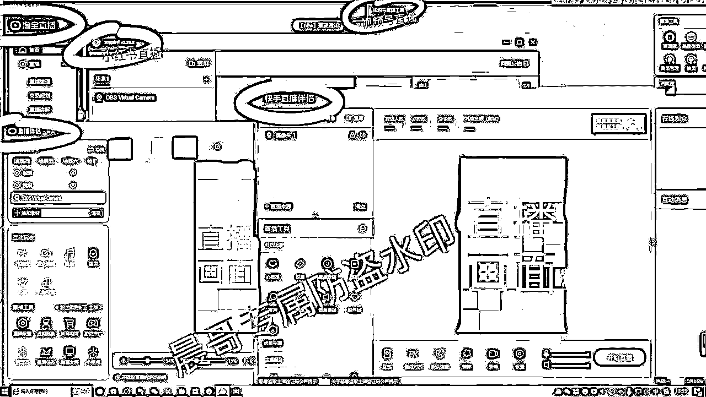

# 第一个平台：抖音

抖音电商是目前直播行业老板们不得不去攻克的第一线阵地，以至于目前的抖音大盘流量非常的大但是也是非常的卷，因为大盘流量大所以抖音直播是我们的重中之重，卷的话就是当你的直播间达到了一个流量瓶颈的时候无论是投流还是千川怎么样都无法有一个大的突破，但是我相信相信很多创业者进入直播行业选择的第一个平台也是抖音毕竟目前还是一个流量为王的时代。

抖音平台的玩法市面上已经很成熟了，网上各类教程一大堆，大家有能力的随便一搜就是大量大佬的课程网盘，生财上还是有非常多的直播大佬的分享帖也是非常实用的，当然如果如果你嫌麻烦不想去找你也可以联系我，我这里有我做抖音的一些实用的起号资料，如有需要的话联系我就好了。

今天主要讲多平台的玩法，这套玩法不太适合新手。因为这套玩法是用来给原来的直播间做增量的而不是用来起步的，所以相对来说不适合新手，新手的话我建议还是先老老实实先做好一个平台然后在做增量，当然也排除有小伙伴天赋异禀哈哈哈。

抖音的玩法基本是通过短视频打爆进而通过直播间转化实现一个双频乃至三频共震达到一个获取更多流量的一个打法，这套打法是需要配合付费投流的，才能做到更高的流量推荐，所以短视频拍摄能力以及直播间的人货场都是最重要的。

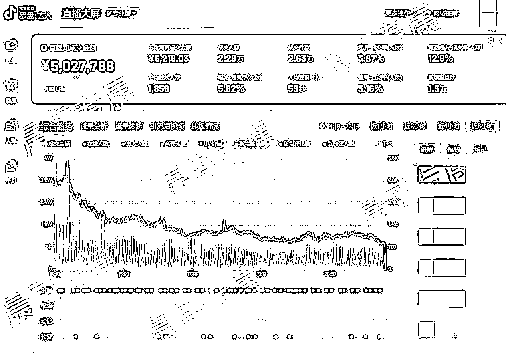

像我们是女装的直播间，采用的是相机直播，能够把衣服的细节展示到位，场景打造的是温馨的居家风，如下图可以参考：

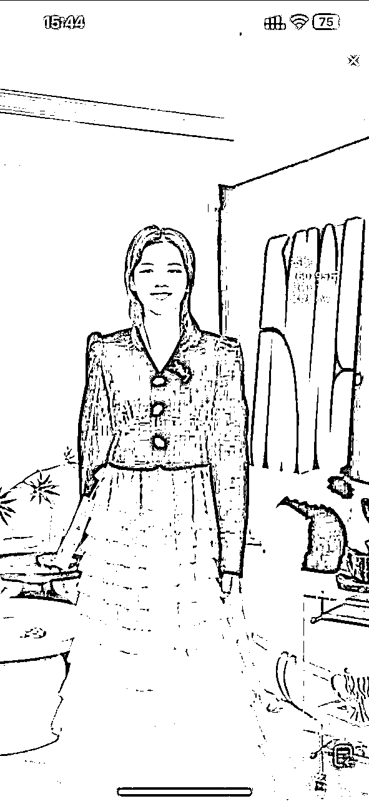

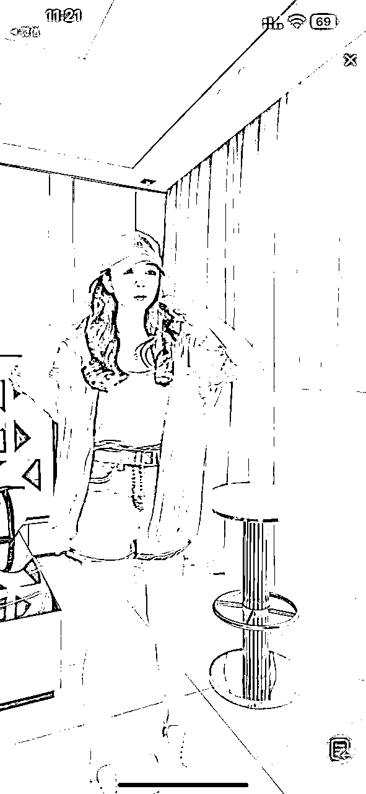

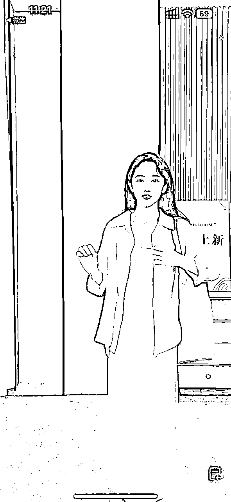

以上直播间的成本搭建大概在8-10W，平替方案也至少需要5-8W，所以可能不太适合小白，有直播间搭建问题的也可以私下找我沟通，毕竟每个品类的场景与配置都截然不同。

贴一下大致直播间搭建费用清单吧。

| 设备 | 数量 | 总价 | 备注 |
| 电脑I7+32G内存 | 2 | 10000 |  |
| 相机A7S3微单 | 1 | 23000 |  |
| 镜头24-70GM | 1 | 15000 |  |
| 直播间灯光金贝 | 3 | 6000 |  |
| LED显示屏 | 1 | 2000 |  |
| 装修直播间 | 1 | 20000 |  |
| 声卡麦克风 | 1 | 2000 |  |
| 采集卡 | 1 | 2000 |  |
| 其他小配件杂项 | *N | 1000 |  |
| 总计费用预估 |  | 81000 |  |

其他的就正常直播间的搭配，人员：主播、副播、中控三人为一组，如果有预算可以像我们配上：拍摄+剪辑+客服。

话术上，我觉得能抄同行卖的好的基本都可以抄到话术，多刷刷直播广场，然后根据自己的产品特色在做修改，最终设计出一套属于自己直播间的话术。

# 第二个平台：微信视频号

为什么把微信视频号放第二呢？因为从去年开始，特别是在去年视频号就是整个电商界的香饽饽，就和今年的小红书一样大佬和无数小白纷纷入场，当然视频号的直播在整个电商圈发力如此迅速，还是得益于微信的庞大流量接口和人们日积月累使用的一个微信生态，视频号日活去年3.6亿，今年要增长到6亿。所以我们也把视频号放在了一个重要的战略地位，也是因此我们视频号的直播销售额也是排第二，所以这里就先讲视频号。如下是我们昨天的战绩：

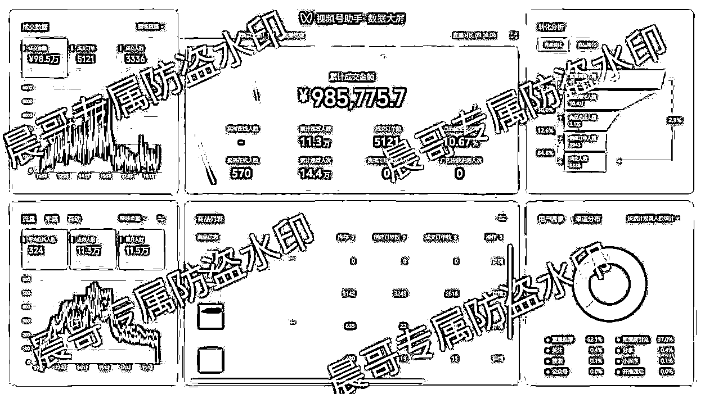

之前我在玩视频号无人直播的时候和很多朋友一样系统一下就会把你的账号判定录播，这个问题在去年迟迟无法解决，直到这次做这个多平台的时候我们把找到一个比较好的规避方法，目前我们测试的还没有出现过问题。

视频号目前是支持多平台直播的，但很多同学抖音+视频号直播经常被判定为录播，这一点是因为主播不跟视频号这边的用户互动，那如果像我们一样，以抖音为主的，那视频号这边基本就得安排一个客服来做弹幕的文字回复。这样就可以一定程度上规避掉判定录播的问题了。

当然现在无人我已经不做了，以传统的直播带货为主了，开始注重于直播间的人货场了。所以在直播中如果是主播两边都可以顾及到弹幕，做到主播回复，那整场下来得停留互动数据会做的很好，就像我Q了你，你听到自己的名字，肯定会停留下来。只要这个直播间的互动停留成交数据做得好，平台系统就会给你源源不断的推自然流进来。

视频号目前基本大家以自然流玩法为主，不过我们也是测试了红点跟ADQ的投流，红点的付费我们ROI能做到10以上，对于很多人来说完全可以放大，ADQ我们投下来ROI不高，才2.5左右，所以暂时也还是投红点居多。新手建议投流还是悠着点，毕竟这里面需要懂的逻辑比较多，如果这篇内容爆了，我下次单独来讲每个平台的投流玩法。

附上数据佐证：

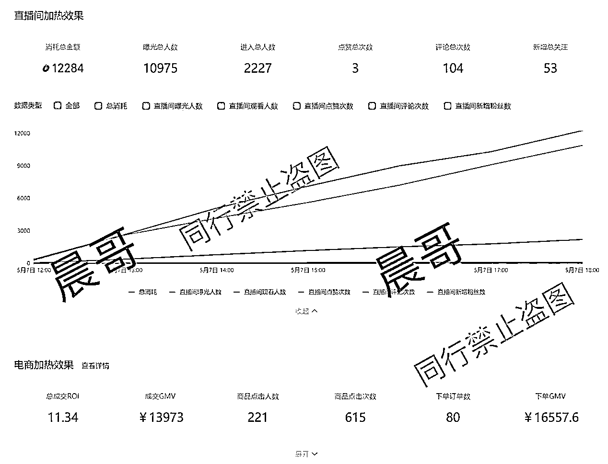

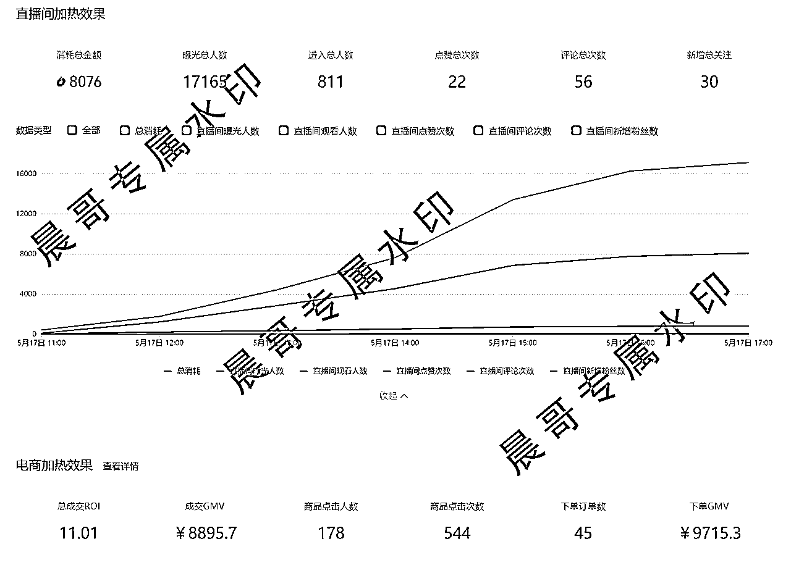

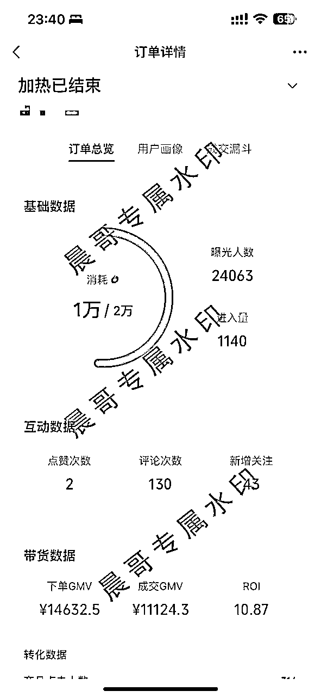

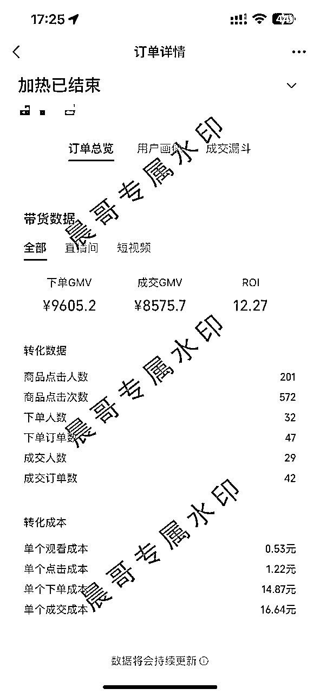

人货场反正是抖音同步，所以这里就不讲这些了。不同的点就是弹讲解，个人建议不需要做卡库存或者改价的动作，视频号的人群都是中老年阿姨们，他们的手机偏卡，网络偏差，加上手速没那么快，所以建议大家321上架以后弹窗多给他们留点下单时间。哈哈哈~

题外话：市面上很多在说视频号现在还可以玩无人直播的，大家千万别信，无人直播我们去年就玩过，去年5月刚开始能玩，后面微信端封号严重，而且现在身份证会连坐机制，我们就做真人直播的，市面上说能做的都是割韭菜，不建议大家去尝试，请大家擦亮眼睛。

# 第三个平台：快手

快手直播其实做的比微信视频号早，但是目前来看风头还没有视频号高。

当然我们是做多平台挂播的，所以能做的平台都去做，不会管他的市场如何，只要它能给我们流量，给我们出单，那我们都可以做，毕竟投入的也就是一台手机的成本。

快手我们主要以挂播为主，目前快手的流量上并没有比视频号高，所以这一个平台我们就是纯挂着吃自然流。每天直播一场，大概的销售额稳定在3000元左右，视频爆了除外。

这个平台玩法摸索较少，基本就是如果你的短视频有基础的播放量或者爆了，那么就微付费投短视频打爆引流进直播间成交，短视频非常容易爆的，大家可以去试试。

# 第四个平台：小红书

小红书电商应该在圈子里的人都知道，今年是大发力了。发带货笔记都随便出单，以至于非常多的无货源玩家都进入到了小红书，但是我们做的是直播呀，跟他们不是同一个赛道。

小红书直播目前还是萌芽期，因为直播广场的入口都藏的很深，但是官方又给了一些直播的扶持，从这几天的618官方开的店播流量口子，就可以看出来小红书接下去的大方向了。懂的都懂。

一些小红书官方的动向我们都是随时关注，有需要进官方的群也可以找我拉你进群。

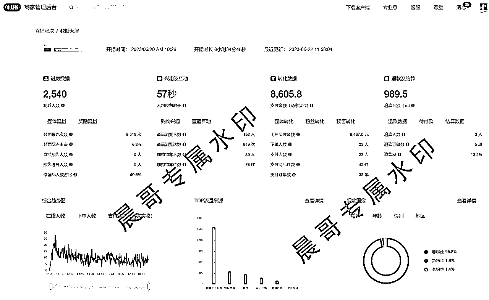

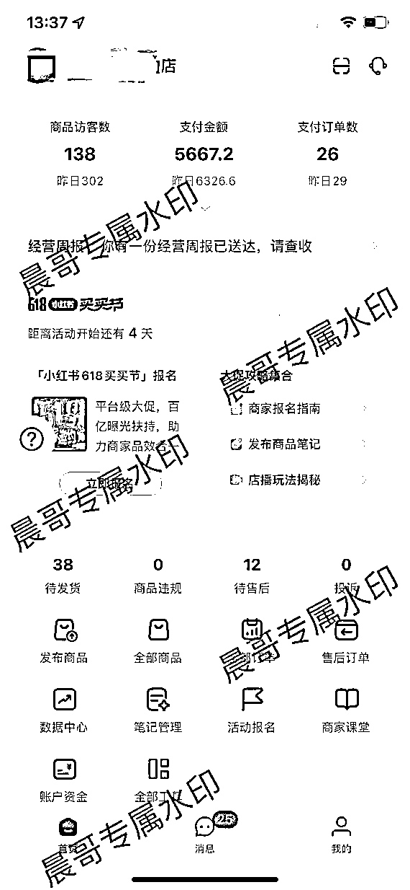

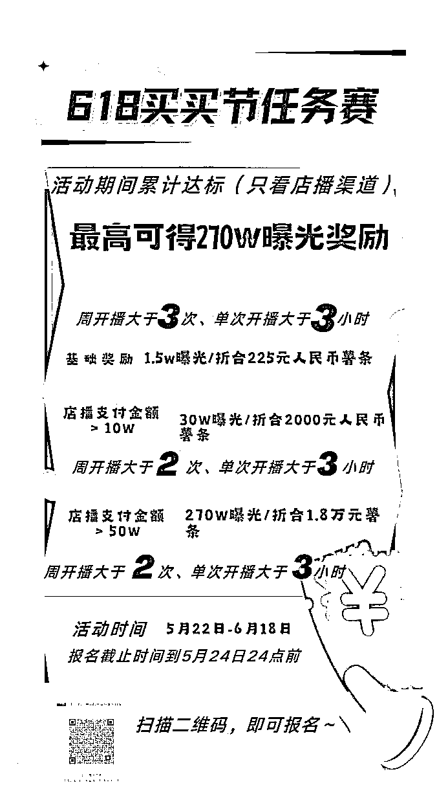

# 第五个平台：淘宝直播

淘宝直播应该算是行业老大哥了，可惜它的流量分配机制，导致商家纷纷跑向了抖音的怀抱，所以抖音这些年直播板块发展迅速，一跃成为直播的老大哥。

在电商圈子对淘宝这个平台应该都是不陌生的，淘系这些年在内容板块也是煞费苦心，从以前的创作者平台到现在的光合平台，去年的逛逛也并没有太大的起色，所以今年开始在直播板块继续“发力”，年初的时候发了一些消息，据说今年直播板块会给挺大的直播流量扶持。

目前测试下来，对于新店或者新号扶持甚少，除非你使用的是老号或者是有一定粉丝基础的达人号or店铺号，那直播可能会有一些流量倾斜。

淘宝直播的流量分配还是归结于淘系的那套赛马机制，只要你的账号从D1层级往上升，突破层级以后，那么你的直播流量也是会有倾斜的，我们主要是做挂播，所以平台的细致玩法就不去深究了，我们拿基础流量能出单就行。淘系我们挂播一天也有几千的收入。

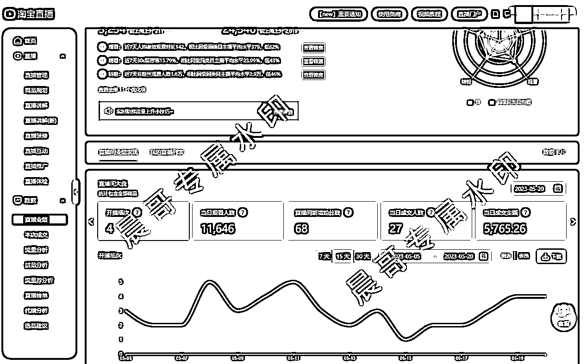

目前我们主要做的就是一些主流的平台小的平台去花费太多精力也是没有必要的剩余的其他平台，大家有想让我去测试的可以留言我去观察观察看看值不值得去做，或者有待更多小伙伴探索。

# 总结：

综上，这就是我目前的多平台同时直播玩法，然后讲讲我从开始做直播到现在的一些心态的变化吧。刚开始接触直播带货的时候其实整个人还是非常的浮躁的自身了解一些基础的直播知识就开始盲目去从去干没有去深入的思考去调研市场，运气好做出来了一点小小的成绩就开始骄傲，其实并不知道这就是错误的开始。然后就开始出现各种违规差评开始陷入了瓶颈，这段时间是整个人的低谷期开始焦虑迷茫整个人也暴躁起来，其中也包括“病急乱求医”给别人割了一波大大的韭菜，那段时间属实难过也没有人去交流学习，焦虑充斥着整个人，也去寻找了什么所谓的科技(其实也是被割了)指导后面看到了@盗坤大佬的文章，开始去思考去反思其中最让我印象深刻的一句话就是“直播带货的核心就是做好是人货场本身”，于是我开始放弃所谓的黑科技、放弃是所谓的七条螺旋起号、放弃了韭菜大师给我的方法。开始注重所选类目的人货场，开始去学习模仿同行的场景布置、直播话术。那一段时间真的很忙很忙，虽然没有什么月入多少多少，但是在那段时间的学习和试错中，开始慢慢有了起色开始稳步向前，焦虑也开始慢慢褪去整个人没有了那种轻飘飘的感觉，尽管过程是痛苦的结果还是相对来说我觉得比较满意的。也就是我经历了这些我也想和刚接触到直播带货的一些朋友说，别看抖音上别人一夜暴富就开始心生向往开始飘忽不定，别小钱看不上大钱赚不到，还是要脚踏实地的一步一步来，我就是这样的一个普通人有过一夜暴富的幻想最终被现实打败到现在开始享受脚踏实地的每一个脚印。

第一次在生财上边发稿，写稿的内容优化可能不够完善，也希望大家多多批评指正，更希望有做直播带货的伙伴朋友一块交流心得，我也希望链接更多做直播带货的朋友们一块交流进步，如果大家有多平台直播的疑问需要解答也可以随时call me，也希望让我们一起破认知，破信息，破圈层，一起生财有术！

# 最后，感谢一下@藏锋 拉我进了生财这么好的一个学习社群。