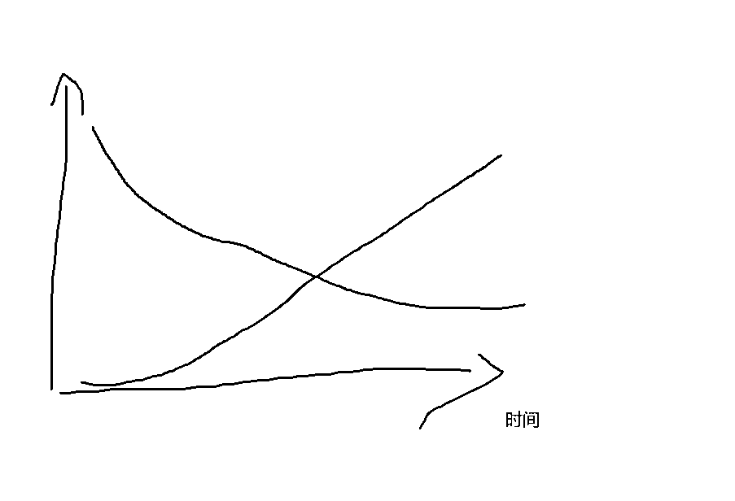
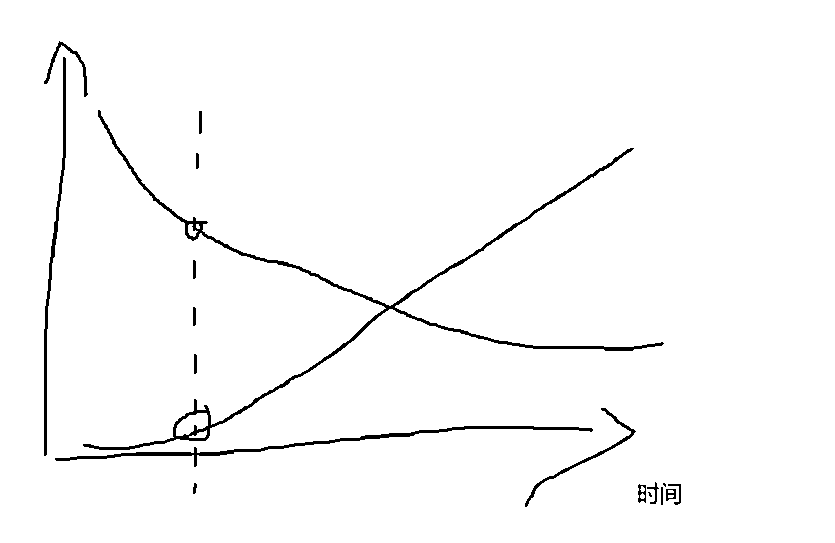
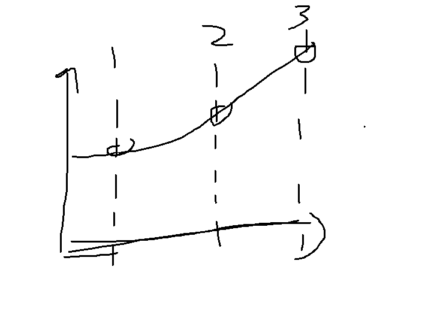
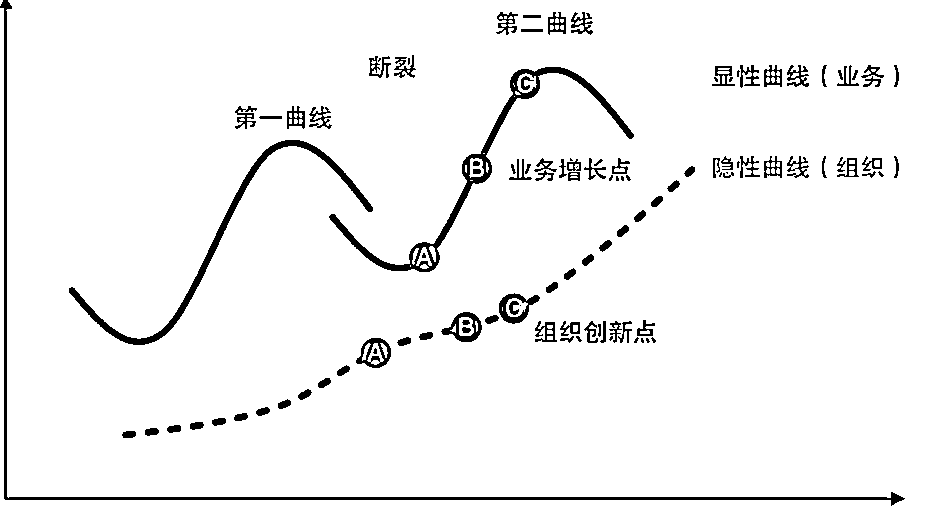
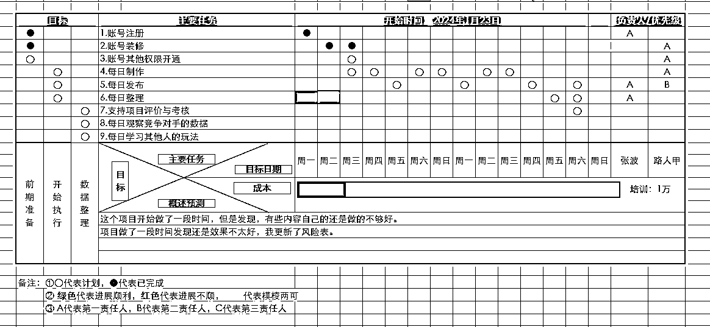
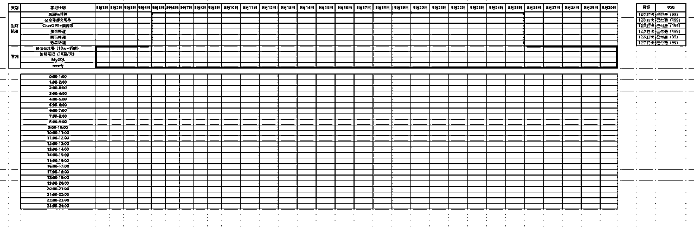
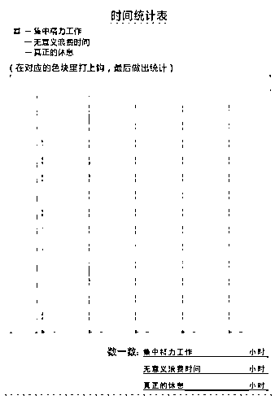
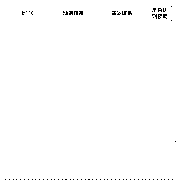
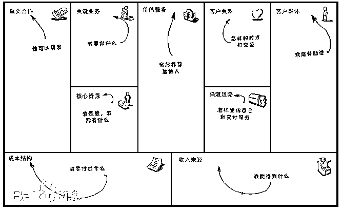
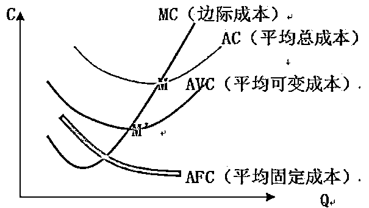

# 自由职业复盘：送给每一个迷茫的人，自己该如何的做好自由职业！！！

> 来源：[https://k170ac9yh31.feishu.cn/docx/YPV2dPc8ToAzIHxsJjgcqqm6nhd](https://k170ac9yh31.feishu.cn/docx/YPV2dPc8ToAzIHxsJjgcqqm6nhd)

# 前言

2024年3月份，我做了自由职业的教练，作为群内答疑教练。

在航海期间，完成了群内日志答疑工作，这几天做了一个梳理发现自己作为教练的话，答疑内容也有了1w字左右，我把内容简单的进行了一下梳理，希望能够对大家有所帮助。

后期有时间的话，我再好好的整理一下，更加的系统化，规范化的整理。

# 什么才是自由职业？

如果是在职的话，也可以做自由职业。自由职业不一定是自己在家，或者开公司才是自由职业，关键是自己的心态，自己是不是是要干事，还是说自己当一天和尚撞一天钟这种心态。

在职的话一般时间比较少，可以找一些花费时间比较少的项目，还要结合自己的长处。例如你会用gpt写文章或者SD出图，或者会剪辑视频，一定结合自己的长处，减少自己摘学习技术上的花费，快速能够拿到结果。

如果自己离职的话，自己就要去分析自己的长处，找一些自己比较喜欢的项目。例如生财航海就有很多比较好的项目，自己做一个全面的分析，这些项目是不是适合你，能不能够快速的拿到结果。

总结：一开始的话大家都比较的迷茫的时候，多找人聊一聊。在某一块有问题，就找和你类似的人聊一聊，不要问一个人，至少要问10个人。例如我有些问题，超出我的认知后，我也会找人聊聊，找不同的人聊，找不同地区的人聊。

如何找到自己的长处，我觉得自己的长处不是朋友圈的那些信息告诉你的，应该是你自己想做啥。

学会接纳不完美的自己，别人说不好的地方，你如果觉得有道理那就去改；如果觉得别人说的没有道理，那就继续坚持下去，做出成绩告诉别人我这样做是可以的是对的。

行动才是硬道理！加油

我拿自己的帖子举个例子把：《航海项目-个体/副业项目实践操作初步指南》 ，这是我自己整理出的符合我自己的找项目的SOP，我自己问了很多人查了很多资料，参加了很多的航海，别人告诉我很多维度。

迷茫的时候要行动，越不行动越迷茫！

# 对于自由职业的思考？

1、无论是自由职业还是在职都找做的事情——学习，尤其是看别人经验的分享。时间多的话，就多看一下，时间少的话就少看一下，这个过程需要坚持下去。自己无法跑得快，那就坚持的久。

2、看到的内容，看到的收获，自己一定要做分析，是不是适合你。很多做成功的，写的帖子或者分享出来的是一部分内容。有些内容没有办法往外讲，可能存在信息差。有时候别人项目做成功，是不是那个时候竞争不激烈，是不是有过这方面的积累，是不是有这方面的资源，一定要做实事求是的分析。

3、一个人认真的做事，不偷奸耍滑，一步一个脚印，成功只是早晚得事情。

在做公众号爆文的教练，遇到2个典型的例子：

一个人从10月份写公众号，到最近才出成绩，坚持了3个月，进行阶段分析，现在项目做成功。

另一个也是坚持了3个月，前期一直坚持一个方向写，没有结果，后期换了方向一个月不到就爆了。

一个有机会的项目，或者竞争比较激烈的项目，最后拼带后期就是执行力，谁能够坚持到最后，谁就能够成功。

坚持一天可能比较简单，坚持一段时间比较难，没有成绩的时候坚持更难。

如果想做一个事情，先往最坏了想，如果很难的话，自己能不能坚持的下来。

选择一个方向，然后做一段时间，看一看自己的投入，自己收获是不是有变化，如果一个项目在一个月左右，自己都没有任何变化的话，估计方向就可能是错的。

# 利用渐进明细判断自己的状态？

渐进明细是指：一开始的时候就是蓝线，项目的风险最高，随着做下来的时候，风险应该是越来越低。

黑线可以想成收益，一开始为0，随着时间增加应该是逐渐升高。

一段时间后进行分析，有没有收益或者风险有没有减少。

例如出现风险没变，收益为零，投入还在大量增加，说明这个不适合自己。

黑线为变现，蓝线为投入。

要想把钱收回来，就是后面的黑线，可以理解为爆款，也可以称呼为奇迹。

# 如何提升自己的效率，如何赚更多的钱？

自己开始做自由职业了，找到一个项目，收益还不错，遇到的一个问题就是如何提升效率，如何赚更多的钱。

对于这个问题，我的建议是，要做复盘：

1、那些是可以标准化的东西

2、那些东西能够借助AI完成

3、那些东西是不是可以外包

把自己每天的工作做个复盘，每周的工作进行复盘，每月事情也做个复盘。

复盘越到位，你就知道那些事情可以压缩时间，那些是重复的工作。梳理出自己的SOP后，自己就能够进一步的放大。

通过上面的复盘，可以看看用的上面的技术，是不是可以迁移到新项目上去。然后新项目在做复盘，可以这么一直下去。

总结一下：最难的是第一个项目，一定要花时间复盘，复盘越详细越好，找到自己的不足之处，是不是可以提高效率，是不是可以节省时间等等。

发现优化到无法优化的时候，自己可以做一套SOP，可以找人家里人帮你做，或者说找兼职帮你做，一切都按照你的SOP。

这样就可以去找第二个、第三个，一直做下去。

自己不做复盘，或者无法做到部分标准化，自己越做越累，投产无法成正比。随便就找人帮你做，还不满意，还容易影响质量。

复盘从开始做项目开始，从今天开始！

死磕自己去复盘。从老板到国家领袖，基本都会做复盘。实事求是去复盘，自己不会的去学习，哪怕没有成绩，我明天争取有成绩。复盘不是给自己压力，而是知道自己的方向。

# 如何做好时间管理？

建议有一个时间管理的计划，要懂得劳逸结合，以及大概的时间计划。

有进度有节点，可以有每一个月的计划，也会一周，一天的计划。

时间管理的话怎么讲呢，我没记错的话现在停到四象限哪里了。最新的是直接以事情的重要程度来做时间管理。

有一本比较经典的书《小强升职记》可以去看看：

各种让你自己测试的一大堆，能够跟着跑一遍，管理时间绰绰有余。

# 如何做好精力管理？

精力管理的话：也推荐一本书《别让猴子跳回背上》 。

是你的事情，就去干；不是你的事情，就要让别人去干。 谁的猴子谁负责。

能者多劳，太多了也会把自己压垮。

精力管理是一定自己要有可以管理的部分，上班时间，还要考虑通勤问题，晚上下班后吃饭等等。

做一个表格，把你最画精力的做个记录

然后看你的那一部分可以压缩，可以节省

就两种解决方式，增加精力时间，压缩别的地方的时间

一天24小时，你看看自己的时间还是不是，能够增加

如果不能的话，那就压缩其他地方浪费的。

对于时间管理和精力管理：这两本书可能不是最好的，相信最适合大家的，还有更好的方法，更好的理念，投产不成正比。

# 如何在不耽误工作的情况下，做好自由职业？

1、自由职业不是说一定要大量的时间，静下心来做一件事才是自由职业，或者说一定要离职才是自由职业。自由职业取决于你的心态，能不能在依托自己身边资源，能不能实现收益或者价值。

2、自律是一个经久不衰的话题，解决的办法——加强自己做计划的能力。很多人是从副业开始的，副业也算一种自由职业，很多人下班后自己在家每天可能就是2-3个小时左右，每天这么坚持的做下去，慢慢的也会越来越好。

3、越想着我自己怎么不够自律？怎么没有人督促我？如何才能全身心的投入？这些更多的是自己内在出了问题，一定要给自己做几个计划，每天/每周/每月干啥，然后进行复盘，这些我是不是完成了。通过做计划来约束自己的行为，以行致性，通过自己的行动来改变自己的性格。

4、周末做的话，就有些形式主义了，一周2天自由职业，一个月8天，一年才96天，这个时间能够干啥。如果自己想自由职业的话，先找个小项目，不太花费时间的，一点点从小到大。前期收入少，但是投入的时间也小，慢慢的改变自己的一些不太好的性格。

# 被动成为自由职业后，如何提升自己的认知？

1、已经成为自由职业者的人，很多是被动成为自由职业的。主动成为自由职业的者的人，目标一般都比较明确至少不会有这方面的困惑。这也是航海的意义，帮助大家能够建立正确的心态，在大家的一起讨论中试着提升自己。

2、自媒体探索一年多，感觉时间来说已经够长了，该踩的坑，全都踩过了，不知道从事是哪一方面项目。这一年多的时间，是不是每天/每周/每月是不是都有计划，自己执行的怎么样。这一年多的项目经历自己是不是做了复盘，你遇到的问题到底是什么，这些事情看起来比较小，是关键的问题。

3、针对计划和复盘再说一下，我相信一个自律的人，有正能量的人，很容易就能够找到搭档也好，搭子也好。大家都是自由职业者的时候，很多人希望的是互相取长补短，而不是互相说我怎么没有赚钱，天天都是一堆抱怨的话，我今天遇到了问题，我进行了分析，进行了总结，你帮我看看是不是能够提点建议，而不是说我做了很久的一个项目没有收益，我也不知道如何说就是没有收益。

4、认识没有啥不同的，大家的工具和玩法基本都一样。一步一个脚印去做，实事求是去做，就能够提升自己的认知。认知不是天上掉下来，或者别人给你的，一定是自己踩过了坑，自己总结出来的。

例如以一个月为周期，我这个月收益为0，我自己就要分析，为什么是0下个月，我该如何努力才能有收益。

到了第二个月就算还是0，我现在已经2次0了，下个月我得变现了吧。

总结：你若盛开，清风自来！

# 如何提升自己创业的机率？

自己一定要有一套自己的商业模式，这样确实可以能够理清自己的想做事情的方向，而且能够提升成功率的记录，下面是一个常见的分析工具，叫商业画布：

需要注意两点：

1、所有的分析和推理，都是基于你能够看得到的数据，有些数据或者分析出的东西，可能只是存在于理论上。

2、商场如战场，就算你推演的没有问题，你做起来的也没有问题，如果出现了一个竞争对手抄袭你的业务，而且比你的执行力快多了，就很麻烦了。

总结：

凡是预则立，不预则废。——这句话很正确

很多设想很好，但是有些事情发展方向不会向着我们预想的方向去。通过“实践”找到问题的“矛盾”，然后再“实践”如此循环往复。

# 自由职业如何做才能成功，如何做好心理建设？

提一下建议，不能说自由职业多么好，大家都自由职业：

1、提升自己的专业能力，根据自己的工作，扩大自己的技能。例如学习AI这类技术，也不能够在职场中温水煮青蛙。

2、持续学习的能力，这个说起来比较容易，但是很多人都是在自我感动。有些人说自己一个月看一本，可能就很开心了，但是一年也才12本，到今天每个月要学习的东西，一个月一本书很难把自己提升多少。

3、我觉得：自己的职业技术过硬+学习能力够强+身边的资源=做好项目。按照前后的顺序，千万不要乱，要不然的话会有一些其他的事情发生。例如我人脉好，特别好，但是技术和学习能力都不行，这项目你还是得找别人，你作为中间人很受伤，收益也极低。

总结：如果在职的话还没有考虑好做自由职业者，先求稳再求发展，做到居安思危，避免自己陷入舒适圈中。

# 如何协调资金与时间？

这里我引入一个新的名词——边际成本：你做一件事，每多一份产出，需要多付出的代价。

时间与金钱，根据潜在的收益，设置一个比较好的比例。

第一种：以资金换时间，要考虑你投入了的钱，后期能不能够收的回来。例如一个项目的潜在收益1w，购买资料5000，在添置设备2000，这样的话，纯收益就比较低了。这个项目要是一周还比较的好，如果3个月，这项目就是垃圾项目了。

如果一个项目，投入就要1w，收益最多也才到1w，你还要自己搭上功夫。也就是常说的积累项目经验了，为爱发电了。

到底要不要投入，投入多少，自己心理要有一个心理预期。

第二种：以时间来换资金，例如一个项目可能赚钱，但是你不想给别人付费，或者觉得投入的成本太多了，那就自己用时间来做研究，最后完成变现。

对于蓝海项目、或者说竞争不太激烈的项目，来说是一个比较好的选择。收益都在自己的手里，技术在自己的手里，后期也可以出售课程来获得收益。

到底要不要付费，还是自己研究自己要做分析；例如一个项目别人已经比较完整了，收益比较的合理，你也能够快速的将费用收回来，我觉得可以付费；如果回收成本周期太长，或者这方面的资料不够全，如果有能力的话，可以自己做研究。

要考虑自己投入的钱、时间、以及变现的周期，潜在的风向等等各种因素，结合自己的实际情况做出自己决策。

如果是一个基本比较完整的项目，收益能够达到多少，自己稍微问一问，或者看一看帖子。=（最高+最低+4平均收益）/6直接用贝塔分布，基本准确了。蓝海项目，就靠自己的经验了。

这个做的就是正态分布，如果一个项目的收益准确的话，那么收益肯定是一条正态分布的线。投产肯定成比例关系。

# 自由职业的项目如何收款？

1、一开始做项目的话，可以是适当的降低价格，或者做好坏账的准备。前期自己处在一个建立经验，以及建立声誉的阶段。现在要做的是要做好项目的交付、如何接更多的项目，把时间用拓展业务的方向上。

2、对于已经出现的坏账，自己要学会合理的催促。问一问对方有没有二次合作的机会，可以打个折优惠一下；或者能不能给介绍其他朋友；等等，要学会变通的催账。

3、当自己客户稳定后，或者项目越来越多的时候，就要学会要钱。例如设置：40%-30%-30%，这种比例。预付款的话最好在40%左右，先把自己可能投入的钱在自己手里，这样的话保证自己不会亏；剩下的可以设置为完成30%，后面的话验收通过30%等等。一开始客户较少的时候，不要这样来，前期还是学会拓展人脉增加客户。

当自己的项目越来越多，要学会维系客户，也要一点点做好各方面的流程，以免发生一些不愉快。最后和对方关系破裂，而且还失去了潜在的合作机会。

人情世故，要学会变通。有时候换一种方式，或者换一种语气，换一种思维，可能会有其他更好的处理方式。

# 计划和复盘能力提升的重要性？

要知道复盘和总结的重要性。

如果自己不知道自己怎么做，对未来迷茫的时候：去复盘吧，每日复盘，每周复盘，每月复盘。

找人请教，免费也好，付费也好，帮你解决问题过程，也是在帮你复盘的过程。

有人指点你一个赚钱的新项目：你做不出来成绩，请教别人，还是要给你复盘；做出来成绩后，找别人问一问如何提升，还是在复盘。

一定是自己找到问题后，再去找免费或者付费，请教别人。如果当你没有想清楚的话。大佬们实际行动告诉你：什么叫社会。要么一脸嫌弃，要么也是无奈。

付费请教：当你被割了一刀，你就会自己复盘了，就会复盘一下自己为啥被割，然后痛定思痛，完成破茧成蝶。

现在都把这个价值这么值钱的技术告诉了大家了，希望大家都能够避免被割！

我最喜欢的一个故事分享给大家：

五祖弘忍让弟子做偈语，大弟子神秀经常听五祖讲经，做了那个“身是菩提树······”；惠能听了一次，每天劈柴烧水，做了“菩提本无树”。最后五祖弘忍传惠能。

运用自己身边的资源，神秀听讲经肯定是身是菩提树，惠能听不到讲经肯定是菩提本无树。

利用好自己身边的资源，在一次次的学习中学会复盘，提升自己，这样就能够找到自己的优点或者弱点，快速和别人拉开差距，形成差异化。

成功的面子，不成功的地方是里子。

面子是给别人看的，里子自己清楚就好了。

你找大佬帮你解决问题，大佬问你遇到的问题，如果自己都不做复盘，问你的问题，你还现场想，描述了很长时间都是抱怨，没有一句重点。

脾气不好的心理就想说一个字：滚

脾气好的，也就是无奈，还能聊啥。

大佬们有的是实力，你得展现出自己的能力。

你是执行力够可以当打手，还是说脑子灵活天天能够出主意。

你要是啥也不想干，最好的办法，就是自己努力成为大佬。

# 到底是重返职场？还是继续自由职业？

问题：如果自己以前在公司是一个比较优秀的员工，公司的各种资源都会给配置完整，后面尝试做自由职业，取得了一定的成绩然后就走上了自由职业之路，现在又要重返职场。

我分两部分，一部分是分析，另一部分是建议：

一、分析

1、以前在一家公司做成管理者，一般只负责其中的一个版块，可能没有接触过全部；

2、公司的资源（人力或者金钱）：你用的是老板的资源，还会有人帮你做分析，做风险的调控；

3、副业和自由职业还是有差距的，以前的话自己有收入做副业，和无收入做自由职业不一样的。

一个人离开职场的话或者做副业，有3点都要注意：

1、我是不是完整的接触过全业务，如果我没有接触过我有没有办法给补齐短板？

2、离开公司的资源，我是不是可以自己做？

3、如果我在一段时间内没有收入，我有钱生活或者投资，有压力嘛？

二、建议

重返职场的朋友，或者在职场的朋友，哪怕自由职业者。大家都是身处江湖，江湖需要两个东西，一个是技能，一个是人情事故。

技能：在职场或者自由职业都要学习，学习那些能够提升自己效率的内容。例如时间管理，项目管理，沟通管理等等。自由自己的工作效率够快，后期不论你是自由职业者，还是继续在职场，保证自己有收益。

人情世故：

有的时候待别人好一些，收起自己的锋芒。

有些事情别人赞成我不反对，别人反对的我不赞成。

有的时候一些件事情也要考虑，后面的发展方向，例如和别人吵架就算吵赢了，后面会不会说坏话，或者穿小鞋等等。

“江湖不是打打杀杀，是人情世故”

自己做的话，就要自己就要面临决策，资源，风险等方面的问题。

# 成为自由职业者基于什么心态？

你想做自由职业者一定要是自己想做，或者说自己想去尝试一下。而不是抱着躲避的心态，在心理学上有一个定理——墨菲定理，如果是因为躲避上班，那么自由职业也做不好。

不是因为我不喜欢一件事，我去做另一件事。我建议要有两种心态：

1、我非常乐意去做这件事，我为这件事做好了所有的准备，我已经迫不及待了。我能够接受所有的挑战，我能够坚持下去。

2、我就是不想上班，我觉得上班太呆板了，我想时间上自由一些。上班一坐就是一天，我非常的不适应会影响我的效率，那就做自由职业发挥自己的效率高的优势。 通过高效率来弥补需要规矩的短处。

躲避解决不了问题的，要么直接面对，要么直接换一种玩法。

# 为什么要做复盘？要有什么心态？

这一次目前的感觉，我觉得用可以把PDCA调整一下，就能够概括给大家：

认知 计划 执行 复盘

我只能说复盘有用，你觉得复盘没有用，说明还没有到需要用的地步。

复盘，不只是PUA自己，你也可以复盘一些开心的事情。

我说让你复盘不开心的事情了吗？

在问一个问题，风险真的只是坏事吗？

风险：既可以是机遇，也可以是挑战

复盘，既可以PUA自己；也可以复盘好事，开心的事。

做时间管理不是复盘吗，有的时候自己回忆好事不是复盘吗？

人容易复盘自己的好事，忘记自己的不好的地方。

要从：一个问题，要么是对，要么是错。

转变为：一个问题，既可以是对，也可以是错。

时间是最好的老师。有些事情需要社会来教，需要时间来教。

你觉得没有必要那就不复盘，复盘对你来说就是个狗屎，就可以了。

不是所有的人，都能够明白，都能够走出自己的舒适区。

敢于走出自己的舒适区

活在当下舒适区是生活；努力拼搏也是生活。

最后还是要看自己的一个选择。

只有对于自己的生活满意的人，才不需要复盘，家庭和睦，事业稳定，兜里有钱还复盘啥。

要是觉得自己生活不太幸福，天天都是忧心匆匆，下班后烦心的事情一大堆，我又不想躺平，我不复盘，怎么解决呢？

有些事情，能做只是引导。每个人选择不同，与其告诉别人一个让他难以接受的方向，得罪一个人，不如告诉他一个他可以接受的答案，取悦他。

# 是做喜欢但不赚钱的事，还是做赚钱但不喜欢的事？

如何做好自由者职业，到底是从“发现自己擅长什么”再到“自己喜欢的”入手；还是从自己的实际出发。

这个问题看起来比较的矛盾，在实际的生活中经常会遇到这样的情况，问个问题向不同的人请教得出的结论是不一样的。或者你实际操作中，和别人对你的设想也不一样。

基于上面的问题，我建议可以通过下面几个维多做分析：

1、实事求是：实事求是的分析自己，自己到底能不能做，给你提建议的这个人，经济状况是比你好，还是比你差。如果比你好的话，自己就需要特别的注意了，王健林的一个小目标是“一个亿”，他给你的建议，对你来说可能就会是空中楼阁；如果比你差的话，你可以全部的听，但是因为资产过低的话，认知会有局限性；

最好是寻找和你经济差不多的，一个圈子里的人，这样的建议最有参考意义；或者找几个最好的问一问，找几个普通人问一问，取个平均。

2、接受落差：看别人成功的分享，以及各种励志的内容。根据别人的建议没有做出来成绩，以前自己多么的喜欢，后面可能就会有多么的讨厌。给的建议和实际操作会有很大的差别，有可能有些内容完全是南辕北辙。如果出现了不一致，以上面的实事求是为准。

别人说成功XX条，要是真的能够成功的话，成功人士现在到处都是了。

3、活在当下：你如何做自由职业，选择什么类型的项目，还和自身的情况有关系。如果自己是富家子弟随心所欲；如果是一个普通家庭的人，就要脚踏实地了。

还是这句话：很多人表面上有选择，实际上没有选择。

4、学会调整：很多内容自己要学会裁剪，接受需要的自己的内容。不需要的内容，可以放在一边，只解决最关键的问题。

对于事情的处理，解决问题的方式不是唯一解，需要的就是自己拥有足够的判断力。

避免自己拿着别人的内容当圣经，最后还是苦了自己。

# 如何给别人提建议？

一个人的成长我认为三个阶段：解决问题，提出问题，理解问题。

1、解决问题：很多人一开始就是解决问题。会有人告诉你要做什么，而且会告诉你如果做，自己只需要学习相关的技能，把这个事情给处理好了，对于这个问题如何出来的，事情如何发生的还没有知道的欲望，很多人停在了解决问题这一个方面。

2、提出问题：当自己处理问题过多后，就会考虑这个问题如何产生的。当你看到一个问题去思考了，结合自己的实际情况，分析后将自己的理解告诉别人。这种建议比那种随口说的要可信的多。这位朋友给被人的建议我觉得处在了提出问题后，给出了一个较为完美的解决方案。

3、理解问题：站在更高的角度理解问题的本身，就能够控制发展。能够给出更加的合理的建议，预料到一些潜在的风险。

当自己想给别人建议的时候，自己要判断自己的建议是不是合理，如果自己认知过于局限，就可能把别人引入歧途。

有些办法是万能的，但是万能药也是有副作用的。就好比刚才聊的，所有的问题都可以付费解决，副作用就是一直付费。

给出一个解决问题的方案容易，一般人都能够找到问题，找出问题后都能够给到解决方案。

我觉得解决方案要考虑次生风险，如果刚解决了一个问题，又出现一个比解决问题还大问题，就要考虑适不适合了，要不要治疗了，有时候“带病生活”也不是一件坏事。

# 如何找到适合的事业？

解决问题常用的两种方式，大多数是两种方式：

1、以结果为导向

2、以目标为导向

1、以结果为导向，我想赚钱，为了赚钱我要做什么事情，例如做小红书，我喜欢旅游选择旅游分类，然后再一步步的具体下来。最后倒过来写，就是自己行动的操作步骤，最后就是为了赚钱。

2、以目标为导向，我的目标就是做好小红书，为了做好小红书，我要研究各种规则，我要拆解各个对标等等。就是为了做好这个项目，项目成功了我就有变现的机会，首先要做好这个平台。

我觉得以结果为导向最好：项目做好了不一定赚钱，赚钱了项目肯定是做好了。

不管选择上面的那一个方向，最后还是需要自己一步步的坚持，一步步的学习提升自己。

# 如何正确认知到自我的技能？

首先要能够清楚的认识的能力，前期想不要想着自己找到最赚钱的项目，而是基于自己的能力，先做一些适合自己能力的项目。

当自己把一个项目做成了，或者已经能够完全落地了。在考虑提升自己技能，这样话的既能够落地，技能又能够用起来。

要做自己想做的事情，这是创业。如果是为了别人的目标前进，就算是创业，最后也是打工。

创业的话是循序渐进的，不是一口吃个大胖子。

# 自由职业认知？

这个说起来比较简单，但是做起来的话，不是一件简单的事情。

每一句话，或者几个字展开都是一大部分，看起来简单实际一点也不简单。

我给大家说复盘，自己也在做复盘，最近根据大家的提问，以及提问我也复盘了一下自己的部分内容，写了一篇文章：https://t.zsxq.com/183Cwa2CC，送给大家，我自己做自由职业的辛酸苦辣，以及如何在生财学习，算给大家做一个补充。

神话的本质，就是实事求是

不过是常人的思维所不易理解的平常事！

很多人还没有做事，就开始想怎么赚钱。尤其是做了没几天，就问怎么还没有收益。

教员讲过：要学习别人先进的东西，要通过实践论，和矛盾论正式的处理事情。不要照抄照搬，搞本本主义那一套。

实践是检验真理的唯一标准，科技是第一生产力。

一开始的时候盘子不要铺的太大，太大的话有时候未必是好事。

发挥自己的长处，既能够解决金钱的投入，也能够解决大量时间的投入，两种风险都降低了很多。

要懂得成长了，有时候自己赚到了，不要一直攥在自己手里，也要懂得投资自己。

你觉得这个项目还有没有上升的空间，或者短期内收益符不符合你的心理预期。

也要自己想一想是继续投入时间划算还是重启一个新项目划算。

有些项目前期投入的时间少，就能够有部分收益了，投产比高于1：2。有些项目越往后，想增长的话很难，投产比，可能1：1左右了。

一定要能够标准化，标准化才是钱，就代表可以复制，就可以躺着赚钱了。

项目变现，不是用说空话和多数人说教，就够赚到钱的，而是要铁和血的执行力。

# 如何正确认识离职？

这个问题，比较开放，我只能说一下，我自己的一个个人经验，以及个人的建议了(有时候搏一搏也可能单车变摩托，什么事情都不是绝对的)：

很多人的思想+认识+规划，都没有问题，但是需要自己判断一下，是不是真的符合自己的实际情况。

在规划中，解决了收入方面的问题，社保方向的问题，如何保持激情，时间安排等等。

生活保障：可以维持2年左右，这个是一个已经量化的指标。

收入问题的话：

剪辑兼职（保障基本生存需要），第二条是做航海项目小红书店铺（打算在这条路上开拓），这两个来源需要进一步的量化。例如现在我剪辑视频一个月可以有多少收入，投产是不是能够成正比。

新的拓展方向（第二条是做航海项目小红书店铺（打算在这条路上开拓）），现在兼职做的是视频剪辑，其他视频类的平台都可以放出来。

还要考虑自己的业务方向，不能未来几年全都做剪辑，或者某个平台，也要思考自己的发展。

建议：

1、创业需要自己能够激励自己，靠的不是一时的热血，拼的是综合实力。

2、如果上面的计划都不行的话，除了重返职场外，有没有Plan B 的方案。

3、能够坚持自己多长时间没有收益，你能够扛得住多大的压力。

# 自由职业用什么模式？

根据自己的实际情况，来选择合适的模式。我的模式未必适合所有的人，所有的人也未必适合这种模式。

1、拥有各种资源，各种渠道，需要做的是战略。可以少看帖子，例如大量的付费，我用金钱来换时间。或者找专业的人来做这件事。

2、不太富裕的，自己没有太多资源，别人也不需要你。比较好的方式，就是战术，拼的就是执行了。

穷则战术穿插，富则火力覆盖。

根据自己的事情情况来做选择。

# 如何听别人的建议，如果找到自己的方向？

适合自己的是最好的，不论在别人眼里怎么样，哪怕别人觉得不好又能够怎么样。

自己的心态，以及认知上要不断地提升，如下：

1、提升自己的能力，提升自己的认知，把自己放在学习的位置上，不断地提升自己。

2、臭棋篓子下棋越下越臭，找到比自己厉害的人像他们学习，提升自己的能力，这样的话自己才能够走的更远。

3、不要让别人的下限，来收割你的上限。不论是找高手，还是普通人，前期找到一个合适的比较容易。后面及比较难了，有些人还在学习，还在提升自己，有些人已经止步不前了。如果他的下限提升不了了，你继续跟着就是死路一条，早晚也会被淘汰。

总结：实事求是，学会提升自己的能力，提升自己的认知，尽量不要受限于他人。

# 解决问题的最好方式，交流与沟通。

如果自己遇到问题没有办法解决，查资料或者看书、看课程都无法解决，那就去找人聊一聊，觉得问题越大，找的人就该越多。

和其他人聊的时候，自己一定要知道自己想要什么东西，想解决什么问题。不要一上来就是抱怨，主要目的是为了解决问题的。

上来就是一通抱怨，需要的不是解决问题，而是有个人听你抱怨一下。

有些人是出于朋友的关系或者其他关系，来帮助你的。当然也有一些是付费的。两种方式要合理对待和区别。

不能说免费的建议，你就觉得不重要。或者说收费的建议肯定好，要不然别人怎么收费。一定要认清自己的问题，多找几个人问一下，不同的人给的解决方法也不一样。

不管上面的那种，后面最好都给一个反馈，只有你给别人反馈了，别人才可能会把后面的事情告诉你。你听了别人的方法，如果不知道下一步，还会遇到问题。

总结：解决问题的方式，首先是找到问题，后面是思考解决问题的方法，尝试解决问题，最后复盘总结。

# 我自己常用的分析问题的方式？

我给大家说一个自己分析事情的常用模型：

1、定性分析：是什么性质的问题，是什么状态的问题。

2、定量分析：这个影响会有多大，有多少问题

3、量化分析：我如何把上面的定量，一步步的量化出来

# 总结

现在也是春天借用《三国演义》的一段话，结尾：

曹操：“龙能大能小，能升能隐；大则兴云吐雾，小则隐介藏形；升则飞腾于宇宙之间，隐则潜伏于波涛之内。夫英雄者，胸怀大志，腹有良谋，有包藏宇宙之机，吞吐天地之志者也”

刘备：“大丈夫行于乱世，即使处于逆境，也当屈身守份，以待天时！”