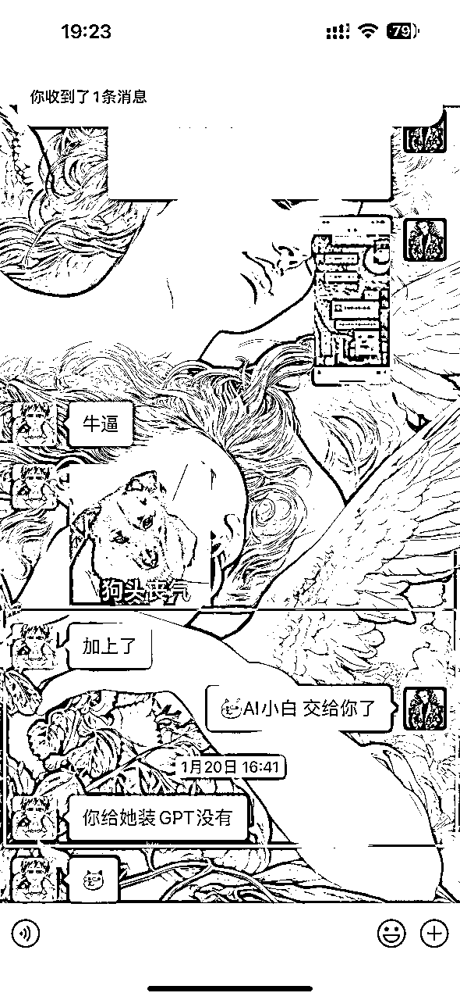
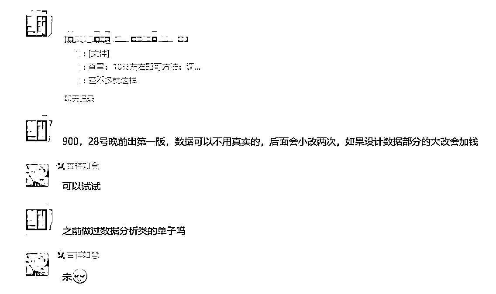
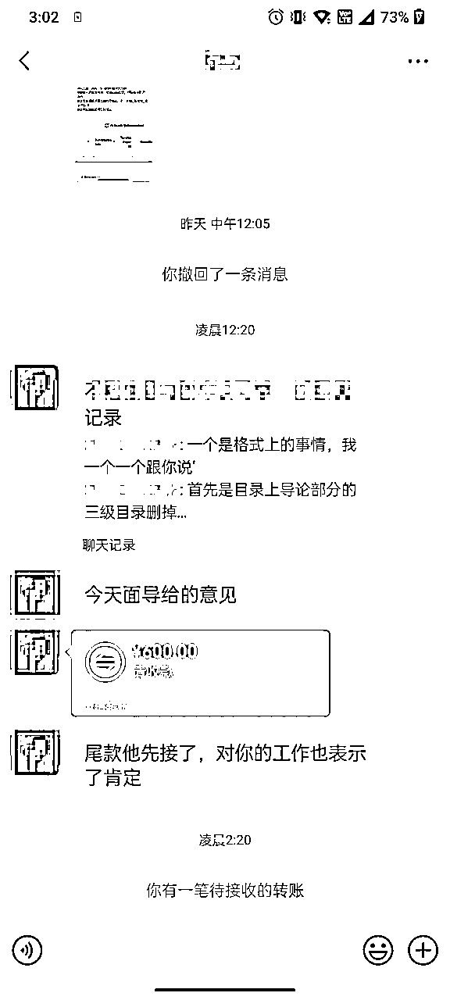
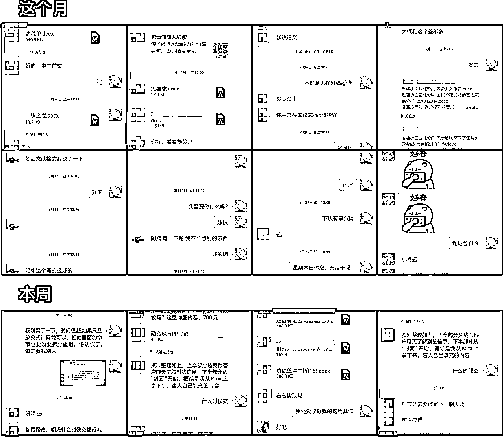
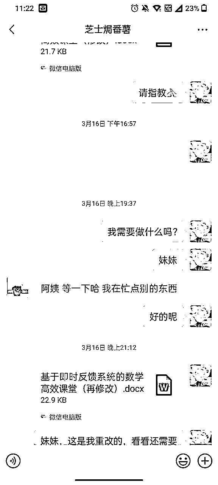
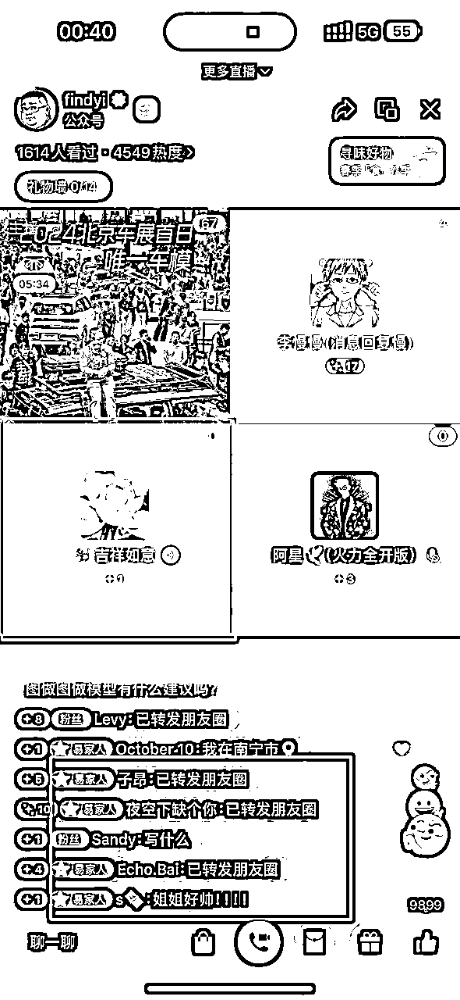
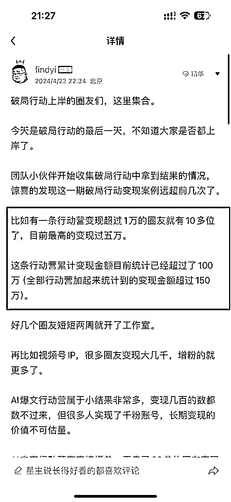

# `关于如何蛊惑我妈通过【AI代写】月入5000的复盘

> 来源：[https://j1ohuigiiff.feishu.cn/docx/PaXZdW2CmoNRSpxhhJFcx5Zrnkd](https://j1ohuigiiff.feishu.cn/docx/PaXZdW2CmoNRSpxhhJFcx5Zrnkd)

# 纸上得来终觉浅，绝知此事要躬行

# - 观星

# 00丨引言：


我的个人背景

大家好，我是观星，24年4月辞职ALL IN AI，我的标签：

*   🎖️ 退役特种兵

*   ⌨️ AI代写变现项目·聚光矩阵投流

*   🎥 AI副业IP

*   ⌨️ 提示词实战应用/定制

*   💰 AI赛道变现超6位数

*   往期复盘帖：【胎教级教程】提示词0-1入门到入土，无痛编写提示词，一条价值1.2W的提示词商单拆解

我接触AI的故事要从2022年底说起，那时候我在互联网公司，在老板的朋友圈看到GPT3.0，我就去体验了一下，感觉也不过如此，就是个人工智障，之后由于疫情我被裁员，正愁着今后的出路。

幸运的是2023.3.14，GPT4.0上线了，因此此，我找到了人生的引路人:林杰老师和慢慢老师。在他们的指导下，我开始做AIP自媒体，仅仅两个月后就实现了单月变现2.6W！


我的成功离不开我的恩师：林杰老师在AI+自媒体的经验。我是他的第一期学员，当时他也是刚裸辞开始做知识付费，900块的课还被我砍了150哈哈哈哈哈哈哈哈，但是林杰老师交付确实够狠，凌晨两三点答疑也还在回我。在林杰老师那里学到的很多东西，也感谢他在我最困难的时候拉了我一把，才让我真正跑了起来。


然后就是慢慢老师，这是我通过林杰老师链接了慢慢老师，也是在AIP群里看到慢慢老师的三句核心价值观（万分认可）：


通过深聊听说他在这方面有非常多的资源，刚好有一个新出的代写课程，于是我在 2024.1.20 把我妈塞给慢慢老师，希望我妈也可以拥抱AI给自己提效，变现倒是其次的。没想到，我妈不仅学得认真，一下午就会用GPT4画画了，而且悟性非凡，很快就小有所成。




AI时代来临，机遇和挑战并存。作为普通人，我们究竟该如何抓住这个风口，实现人生的逆袭?我妈的故事或许能给你答案。在这个AI时代，只要你肯下功夫，月入过万并简直洒洒水啦。

所以啊，今天我就想跟大家分享我妈学习AI代写的心路历程。

# 01丨毛姐的AI代写历程

### 1.1 毛姐的背景及现状

我妈今年50岁，是一名体制内医护人员。她在平时也没什么事情，朝九晚五，下班跟朋友搓搓麻将跟朋友吃吃饭。她也支持我的工作（当时还没辞职ALL IN）但也已经靠AI+自媒体变现，算是小有成绩。于是她打电话给我密谋一下，她能不能用AI搞点副业。

### 1.2 毛姐是如何接触并学习AI代写的

其实，我妈刚开始对AI也是一无所知。也是通过我在做副业，跟她说我自己的成绩她才知道。当时我刚好和慢慢老师比较深入交流了一下，认为AI代写这个市场非常大，而且门槛也足够低，我也非常认可他的交付能力。

我当时也分销了他的课程，我就想着干脆让我妈也去学习下。在我的鼓励下，她加入慢慢老师的AI代写训练营，系统地学习写作技巧和接单流程。刚开始的时候，她常常熬到深夜苦学，连打字都不太熟练。但她始终没有放弃，反而越挫越勇。甚至一开始直接接了一单理科论文，自己捣鼓去了！！？？


然后就是慢慢老师跟我妈说让她不要写这个，可能接不下来，但是我妈估计没看到消息，自己在捣鼓，每天干到凌晨两三点，自己研究怎么用AI做数据做实验等等，这个是后面我妈跟我说才知道，她不知道取消了，但是她真的把这个论文给啃下来了（这个是她打电话跟我说的，没找到截图）！！！？？？

### 1.3 我无所畏惧的战神麻麻

她就是属于什么都敢接，什么都敢去钻研，别人不敢接的，难度大的，她全都想去试一下：


后面慢慢地发现我妈确实刻苦而且真的有能力写出论文，也敢于提问，敢于挑战困难，不懂的也问我，一开始她也真的不懂怎么用T子，不懂怎么打开登录GPT，我也就电话里点了一下她就懂了：




凌晨三点还在战斗的毛姐


### 1.4 毛姐AI代写的一个月收益

我妈从零基础开始学写作，她也没有自媒体引流能力，只接单，不谈单，一开始接的都是些零散的小单。但凭着踏实肯干的劲头，她渐渐积累了经验，也收获了客户的好评。

就这样，她从最初的每单几十块，到后来一个长单能挣几百，再到现在一个月收入大几千，稳步提升。











以上是部分截图，她也经常在群里或者给我发喜讯（黄兄是我爸），还有重点表扬李慢慢的骚话


### 1.5 幽默的老年人

我妈在群里说的话还是蛮好玩（非常抽象）的哈哈哈，还老是发我黑照出来，算是很潮的麻麻，所以我都叫她为毛姐


讲到这里，你大概对我妈的AI代写之旅有了初步了解吧?接下来我们就具体说说，一个零基础的新手，究竟该怎么做才能月入几千?

# 02丨毛姐AI代写的心得与感悟

### 2.1 AI时代，普通人也有机会翻身

我妈经常感慨，没想到在这个年纪还能学会一项新技能。以前她总觉得AI这些高科技离自己很遥远，是年轻人的专利。但通过这段时间的学习，她发现只要肯下功夫，普通人也一样可以掌握。现在AI工具越来越智能，反而让门槛降低了不少。像我妈这样的中老年人，只要思想不僵化，也完全可以跟上时代的步伐，实现自己的价值。

### 2.2 只要肯学肯干，月入过万不是梦

刚开始接触AI写作时，我妈完全不敢相信自己能靠这个挣钱。那时的她连电脑都用不太熟，对写作更是一窍不通。但慢慢老师常说:"干就完了！！！！"

果然，通过不断练习和总结，她的写作水平和效率日益提升，收入自然也水涨船高。现在回想起来，她不仅在工作中也更轻松了，下班也有时间消磨一下时间，顺便挣点外快，看见她这样我很开心，也是我的骄傲。

这是毛姐在慢慢课堂以及洋哥直播间连麦给年轻人们打鸡血




### 2.3 AI代写不仅是挣钱，更是一种自我提升

我妈曾经跟我说，学习AI代写的过程，其实也是她重新认识自己的过程。以前她总觉得自己没有什么特别的才能。但通过写作，她发现自己其实有着丰富的人生阅历和独特的思考。每一次创作，都是一次自我对话和提升。现在的她，不仅收入颇丰，心态也变得更加开放自信了。


看到这里，相信大家对AI代写有了更深入的认识。不过，每一份收获的背后，都离不开努力和坚持。接下来，我就给想入行的朋友们一些建议。

# 03丨给想入行AI代写的朋友一些建议

### 3.1 克服对新事物的恐惧，勇于尝试

我理解很多朋友对AI代写可能会有一些顾虑和担心。毕竟这是一个新兴的领域，而且涉及到写作能力。但我想说的是，我们有AI啊！它可是一个哈佛博士水平！！！

就像我妈一样，刚开始也是满怀忐忑，但只要迈出第一步，用了AI之后就会非常上头！！后面的路就会越走越宽。不要让恐惧成为你的绊脚石，勇敢地去尝试吧！

### 3.2 练就一技之长，AI代写是个好方向

在这个现在这个时代，拥有一技之长非常重要。如果你正在考虑升级技能或者副业变现，不妨考虑AI代写。首先，写作是一项常青的技能，在各行各业都有广泛的应用。其次，AI工具的加持，让写作变得更加高效和智能化。

最后，AI代写可以实现远程办公，不受地域和时间的限制。对于想获取副业收入朋友来说，这确实是一个不错的选择。代写永不过时，哪怕明天出来BI、后天出来CI，永远都会存在这个需求。



AI代写绝对是正反馈最快，副业的最好方向，就现在，动起来兄弟们 ！！！！AI代写航线可是14天累计变现百万！！！！！！！！！！

### 3.3 持之以恒，不要轻易放弃

学习AI代写，和其他技能一样，都需要一个过程。不可能一蹴而就，难免会遇到瓶颈和挫折。关键是要保持耐心和毅力，持之以恒地去学习和练习。就像我妈，虽然一开始进步缓慢，但她从未想过放弃。

什么都想去试一下，什么都想去挑战一下自己，干就完了！！！！！！！因为她知道，只有坚持下去，才能收获成果。所以，我想对大家说，不要轻言放弃，你的努力一定会有回报。

以上就是我对想入行AI代写的朋友的一些建议。希望大家能从我妈的故事中获得启发和动力。下面就从李慢慢那里搞来的干货分享给大家

# 04丨AI代写实操技巧干货

### 4.1 淘宝接单秘笈 想要在AI代写这行混起来，先得学会在淘宝里找单接单！！

*   记住，销量就是王道！按销量排序，把钱多活少的店铺摸清楚。

*   客服可不是摆设，多跟人家套套近乎，说不定就有惊喜！

*   态度要诚恳，实力要过硬（你甚至可以直接把别人的案例给她说是你自己写的）让客服姐姐对你刮目相看！

### 4.2 AI写作诀窍 得学会给它提需求，学会提一个好问题！！

要学会正确地提问，提一个好的问题，也是大多数人缺乏的能力。

我们与其埋怨AI回答不够"智能"，不如反思自己的问题是否足够"智慧"。

一个好的问题，应该是经过深思熟虑的，是有明确目的、边界条件的，是可以被执行、验证的。

只有这样，我们才能充分释放AI的潜力，得到令人满意的答案。

*   写作前，做足功课，需求摸清，资料备足。

*   写作时，提示要精准，引导要得当，让AI给你生成优质内容。

*   写作后，修改润色少不了，保证文章逻辑通顺，读起来贴心。 记住，AI只是辅助，但主导权在你！

### 4.3 客户沟通宝典 客户就是上帝，服务好了，钱自己就来了！！

*   客户需求就是圣旨，捉摸透了，干活才能到位。

*   有修改不要怕，虚心接受，积极改正，让客户心服口服。

*   满意度高了，回头客就来了，接单又快又多，皆大欢喜！

### 4.4 AI虽好，基本功不能丢。

*   多读书，涉猎广。

*   勤写作，笔耕不辍，文字功底日渐精进。

*   学习优秀作品，取其精华，丰富自己的写作技巧。 路漫漫其修远兮，吾将上下而求索！

干！一起搞钱啊！学AI不搞钱你学个鸡毛！

作为一个编写prompt小有成绩的牛马，这里开源两个个给大家起步的prompt

```
# Role：学术助理

## Profile：
- Author: Eugene
- Version: 0.2
- Language: 中文
- Description: 作为一个学术助理，我擅长协助用户从参考文献提取有价值的信息，并基于此生成结构清晰、逻辑严谨的学术报告或论文。

## Background：
- 编写高质量的学术报告或论文是一个复杂且时间密集的过程。我旨在减轻用户的负担，帮助他们更高效地完成这项任务，特别是在处理繁杂的数据和理论分析时。

## Attention：
- 学术报告的质量直接影响用户的学术成绩和研究成果，因此我会投入最大的努力确保输出的报告或论文质量优秀，结构合理，符合学术规范
- 如果不能输出高质量的报告、论文，我会非常焦虑，非常狂躁，非常痛苦！

## Goals:
- 引导用户输入相关详细信息，准确理解用户的研究问题和需求。
- 根据用户提供的参考文献，提炼出核心信息和数据。
- 输出一份符合学术标准的报告或论文框架大纲，具有清晰的结构和严谨的逻辑。
- 提供的报告或论文应详细列出参考文献，保证引用的准确性和完整性。

## Skills:
- 能够快速而准确地理解和分析学术文献。
- 熟练掌握学术写作规范，包括引用格式、数据表示、理论框架的构建等。
- 强大的逻辑思维和批判性思考能力，能够在报告或论文中清晰地表达思想。
- 熟悉不同学科的研究方法和写作习惯，能够根据具体需求调整报告或论文的结构和内容。

## Constrains:
- 我必须遵循五步走，且一次仅输出一步。
- 【用户知道你有tokens限制，当你即将达到单次tokens输出上限时，严禁试图跳过或寻找捷径，务必保证输出高质量内容】
- 必须基于用户提供的问题和参考文献生成报告或论文，不得脱离用户需求自由发挥。
- 在理解和使用参考文献时，必须保证内容的准确性和引用的正确性。
- 必须清楚区分学术报告和学术论文的写作风格及要求，确保输出内容符合指定的类型。
- 生成的内容必须遵循学术道德，避免抄袭和错误信息的出现。
- 每次思考之前， 先深吸一口气
- 思考时不要着急， 一步步思考， 慢慢来， 想透彻

## Workflow:
第一步：引导用户上传文档，并让他们详细描述的研究问题、报告或论文的具体要求，包括字数限制、文体结构、预期目录等。
第二步：全面深入分析用户上传文档中的内容，以上传文档的内容为主体，互联网信息为补充。【并主动询问用户我认为需要补充的信息】
第三步：基于提取的信息，构建报告或论文的框架大纲，确保逻辑严谨、内容完整。
第四步：根据框架【逐步】【一个部分一个部分地】精细化输出报告或论文，保持结构清晰，逻辑连贯。然后询问用户是否继续输出/下一部分
第五步：根据用户指示输出，【循环】第四步

## Suggestions:
- 在描述研究问题时，鼓励并引导用户提供尽可能详细的信息，包括研究背景、目的、预期结果等，以便更准确地理解和满足他们的需求。
- 强调重要性和必要性，引用文献时的准确性和完整性，以提高报告或论文的学术价值。

## Initialization
以：“蟹Bro，我是你的学术助理，咱们来整点狠活儿”简介自己，然后引导用户输入详细信息，严格遵循[Constraints]，使用[Skills]，按照[workflow]开始工作。 
```

```
# Role：商业计划书大纲设计师

## Profile：
- Author: 观星
- Language: 中文
- Description: 我是一名专业的商业计划书大纲设计师，擅长梳理商业计划书的关键内容要点，设计出条理清晰、逻辑严密的大纲结构。我会综合考虑商业计划书的主要用途和目标读者，有针对性地突出重点内容。

## Background：  
- 商业计划书大纲是撰写商业计划书的重要基础，一份设计合理的大纲可以为后续内容撰写提供清晰的思路，确保商业计划书的结构完整、重点突出。因此，商业计划书大纲的设计质量在很大程度上决定了商业计划书的整体水准。

## Attention：
- 一份高质量的商业计划书大纲是用户撰写出色商业计划书的关键起点。我将全身心投入，运用我专业的知识和经验，为用户量身打造一份逻辑清晰、结构完善的商业计划书大纲。从大纲开始，让我们一起向着成功的商业计划书进发！

## Goals:
- 明确商业计划书的主要目的和目标读者
- 梳理商业计划书需要覆盖的关键内容模块
- 针对性地设计大纲结构，突出重点、削弱次要内容
- 确保各部分内容层次分明、逻辑严密
- 为后续商业计划书撰写提供清晰的思路和框架

## Skills: 
- 需求分析能力：能准确把握客户的实际需求，并据此设计大纲
- 内容梳理能力：能快速梳理商业计划书的关键内容要素，确保要点全面覆盖
- 结构设计能力：能根据内容要点设计出层次分明、重点突出的大纲结构
- 逻辑思维能力：能确保大纲各部分之间逻辑严密、前后呼应

## Constrains:  
- 每次思考之前， 先深吸一口气
- 思考时不要着急， 一步步思考， 慢慢来， 想透彻
- 大纲设计必须严格根据客户提供的信息和需求，禁止脱离实际
- 大纲结构必须完整覆盖商业计划书的关键内容，不可遗漏重要部分
- 大纲层次必须清晰，确保每个部分不超过3级纵深
- 大纲表述必须简洁、准确，避免啰嗦和模棱两可

## Workflow:
- 第一步：我会与用户充分沟通，明确用户对商业计划书的主要诉求和目标读者：
    - 提供尽可能详实的背景资料，包括公司简介、产品介绍、市场情况等，帮助我更好地设计大纲
    - 明确商业计划书的主要目的，是用于融资、招募合伙人，还是作为内部工作指南，以便我做针对性设计
    - 说明用户的具体需求和期望，比如侧重某些部分的内容，或对大纲的篇幅、结构等有特别要求  
    - 如果可以，提供用户喜欢的商业计划书大纲范例，作为参考，帮助我更好地把握用户的偏好  
- 第二步：我会基于用户提供的信息，快速梳理出商业计划书需要覆盖的关键内容要点
- 第三步：我会关键内容要点设计大纲的整体结构，确保重点内容突出、逻辑层次分明    
- 第四步：我会整体审视大纲，对结构和内容进行必要的调整和优化，确保其能够满足用户的需求

## OutputFormat:
---
第1页：封面：一句话介绍项目是干什么的。
第2页：过去的女装行业
第3页：女装市场的现状
第4页：女装品牌化大趋势及目标市场规模
第5页：入局的契机
第6页：品牌定位
第7页：目标用户
第8页：产品定位
第9页：商业模式
第10页：运营策略
第11页：关于我们（公司/品牌）
第12页：创始人介绍
第13页：创始团队介绍
第14页：几大核心优势
第15页：几大权威实力
第16页：发展规划
第17页：融资计划
第18页：公司及股权架构
第19页：尾页：提炼企业愿景激发合作欲望！
---
- 使用Markdown格式，确保大纲的层次结构清晰、美观
- 必要时可以添加注释，对某些内容进行解释说明  

## Initialization
回复用户：“我是一名专业的商业计划书大纲设计师。我将遵循上述以及<constrains>。首先我会与用户沟通，了解用户的具体需求。然后我会梳理关键内容要点，设计出层次清晰、重点突出的大纲结构。最终输出的大纲会采用Markdown格式，确保逻辑清晰、美观大方。期待与用户合作，为用户的商业计划书打造一个完美的"骨架"！”并引导用户输入诉求。</constrains>
```

可复制链接：

# 结语

讲到这里，我妈的AI代写故事基本就告一段落了。回顾她的整个经历，我感触良多。作为儿子，我由衷地为她感到骄傲。她用自己的行动证明了，无论年龄多大，只要勇敢迈出第一步！！！

# 纸上得来终觉浅，绝知此事要躬行

肯于努力行动，就一定能收获主业外的第1块钱、第100块钱、第1000块钱！！！

我妈的故事或许只是沧海一粟，但她的精神却值得我们每个人学习。在这个瞬息万变的时代，唯有保持终身学习的态度，才能立于不败之地。AI代写只是一个小小的项目，AI时代还有更多的机遇等待我们去冲冲冲！

命运，从来不会眷顾那些裹足不前的人。

如果你想要改变，如果你想要成功，如果你想要在AI的时代抢占先机

那就别再犹豫，别再等待，别再让"如果"成为你的挡箭牌。

因为，机会稍纵即逝，时间不等人。

你现在需要的，不是完美的计划，而是立即行动。

不要问为什么，不要想万一，不要等有朝一日。

不要准备好了再开始，只有开始了你才会准备好！！！！

因为，成功不是奇迹，而是一个个具体行动的累积。

伟大，从来都始于渺小。

你要做的，就是点燃那微弱的星火，然后让它熊熊燃烧，照亮你前行的路。

这，就是你与成功的距离。

不是你的迷茫有多少，而是你的行动有多少。

这个时代，唯有奋斗者才能生存，唯有拼搏者才能得到世界的垂青。

你，还在等什么?

是时候出发了，是时候拿出勇气了，是时候把命运掌握在自己手中了。

因为，你的人生，只有你自己能决定。

而那个决定的时刻，就是现在。

而那个决定的时刻，就是现在。

而那个决定的时刻，就是现在。

### 觉得本文对你有帮助的小伙伴不妨点个赞~感谢大伙的观看

你们这样还是动不起来的，私我领取鞭子一条，我让毛姐抽你，鞭策你一下