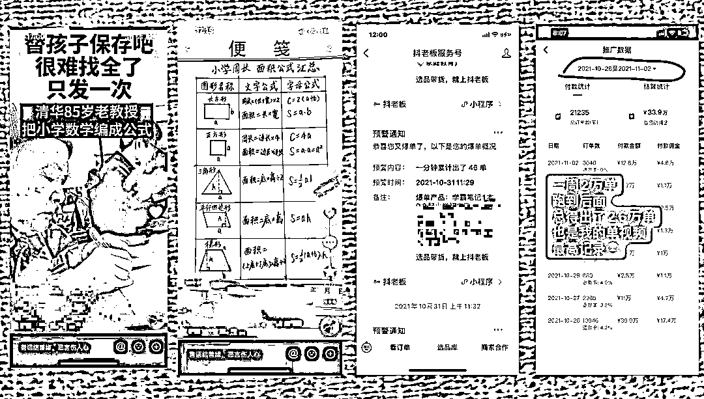

# 新手航海 普遍存在的 3 个问题！

> 原文：[`www.yuque.com/for_lazy/zhoubao/ah62dnx2do8gvouv`](https://www.yuque.com/for_lazy/zhoubao/ah62dnx2do8gvouv)

## (102 赞)新手航海 普遍存在的 3 个问题！

作者： 豪叔（猎音狮）

日期：2024-06-18

圈友们好！视频号带货 6 月航海的船友们好！

我是豪叔，很荣幸能担任本次航海**视频号带货**这条船的教练。

  

最近群里看了一下大家的问题，发现新人都有这些问题，大家可以对号入座，有则改之，无则加勉！

**第一、贪多图快**

并不是视频发的多你就可以爆，量是要建立在质的基础上，而不是越多越好。

我看很多人动不动就“批量”啥都想批量，做一个视频花个一小时就没耐心了，爆单视频是需要打磨的。

批量只适合工作室来，个人，而且还是新手，我是不建议批量的，我之所以一个赛到能玩到现在，就是拿得住性子，贵精不贵多，精细化运营！

记得我分享过，我一个 11 秒的视频卖了 2.6 万单，如下图，一分钟 46 单！说这个不是为了炫耀，是想告诉大家**专注的威力到底有多大**！

  

可是 11 秒你知道我做了多久嘛，差不多就是一个白天，8 小时。为什么花那么长时间，因为我要自己写字，画图，还要剪辑，字写的不好看就把纸撕了重新写，直到写好看为止，但是这种形式现在已经被淘汰了，我去年就转型做真人口播了。

所以也要**顺势而为**，咱们船员如果能做口播的，我是很鼓励大家去做的，混剪我是过来人，技术也曾达到天花板级别的，但是我为什么不继续做，因为口播真的更稳定，剪辑起来也比混剪的快，口播就加加字幕啥的，混剪要各种去重，各种修整。

当你静下心来做一个视频的时候，视频还没发，自己心中都会有满满成就感，潜意识里觉得会爆。

当有这种自信的时候，即使你发了没爆，但是每次都是这种态度，不久你真的会爆单！

**二、落不下地**

这一点主要针对新手！很多新手看**航海手册**都是走马观花，不加以消化理解，就是说不知道从哪里做起。

就说**选品**这件事，**航海手册**里不但**详细讲解**了方法，而且还在手册最后给出了**选品案例与建议**！

这些东西你到外面去学，少说也要花两三千，生财组织航海，有**航海手册**（也就是我们的教科书），还给大家安排了**教练**，不懂就群里提问，所以大家要珍惜这种来之不易的机会。

再说上岸就退保证金，相当与给你白嫖了，当然，退还保证金那不是目的，有些船员就是为了退保证金来打卡，那你就失去了航海的意义，这也不是生财的初心，生财这样做都是为了监督你，希望船员都能拿到好成绩！

咱们视频号带货，是技术活，而且是**脑力技术活**，你上船了，就算认认真真学了，你不动脑子，遇到新的问题你又不会了，不像打螺丝，就那个动作，学会了，就一直重复就行，所以还有一个很重要的事情，就是要学会**举一反三**！

**第三个问题、选品**

选品，是做带货最核心的部分，所以你不能想当然的去卖一些品，你的研究视频号用户群里的市场供需。

**所以，对于新手，我给一些建议：**

**1、最好选择视频号里有现成对标、案例，已经卖的不错的品。**

因为视频号里没有的，试错成本会比较高，测品那都是大佬干的事，根本不适合新手。

**2、单品思维。**

选好一个品如果转化不错，可以把这个品死磕到底，因为这个品已经能给你带来收入了，能很好的转化了，你就不用去测其它品了，一个是浪费时间，再一个，卖的太杂会影响账号垂直度，再一个，做精了，你才能在这个品深耕，就比如说我自己，我做教辅都做了几年，做成了行业标杆，我现在找对标都找不到，因为自己就是别人的对标，

所以有句话说的好：**不想当元帅的士兵，不是好士兵！**选好一个赛道，死磕，做到行业第一，或者你的小圈子里的第一，你就能赚到大钱了！我也是单品思维，不同季节火的不同的品，都是把流量薅干，才换下一个！

**3、不要选高危品！不要选高危品！不要选高危品！**

对于新手来说，按部就班来做，哪怕不出现违规，也很难了，最近看群里很多小伙伴一会儿出现医疗禁言，一会儿宗教，一会儿涉及夸大功效……新手已经够难了，特别是有些玻璃心的，你再碰高危品，我真担心做着做着你会放弃！

所以，新手建议选一些安全的赛道深耕，等你跑通闭环了，再尝试高危行业也不迟，因为高风险高收益，可以后面再挑战，现在先把带货闭环跑通，先做好从 0 到 1，以后再慢慢到 100，到 1 万，到 100 万……

好了，这是我这一周看了船员们在群里暴露的问题，所以就总结一下，看看自己有没有这三个问题，有则改之无则加勉！

**最后，送大家一段话：**

**不要等着被照亮，要努力去让自己发光。**

**老实做人，踏实做事，保持学习，细心耐心，多换位思考，多做利他之事，定有所成。**

**要相信自己，也要允许自己慢慢变富，不要追求赚快钱，学到位，做到位，结果必然到位。**

* * *

评论区：

芒果石榴 : 我看很多人动不动就“批量”啥都想批量，做一个视频花个一小时就没耐心了，爆单视频是需要打磨的。...
怪才 : 个人感悟：不要急，不要急，不要急。
做的好的人，是挺多的，作为新进入的人来说，要学会看优秀的人的做法，而不是只关心他的成绩，不然真的只会焦虑。
乐天 : 感谢豪叔解答，醍醐灌顶
妙环 : 谢谢教练那么用心
冬日暖阳 : 现在抠别人视频也容易违规
冬日暖阳 : 方便加个微信交流交流不
阿戴 : 这篇文章非常及时，我就是被群里消息搞得特别焦虑的新人，第一阶段到现在都还没做好，这下心里定了，感谢豪叔
豪叔（猎音狮） : 一起生财有术[强][强]

* * *