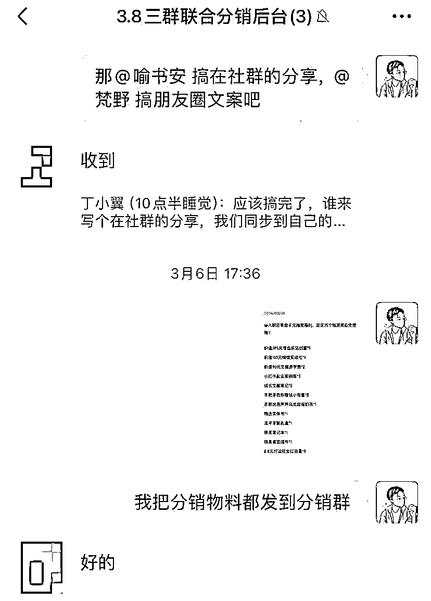
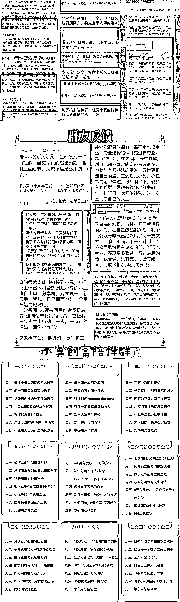

# 女神节组织联名群发售，私域小白 7 天 GMV4 万+，我们做对了什么？

> 原文：[`www.yuque.com/for_lazy/zhoubao/tnxz2mn0ul0yqipq`](https://www.yuque.com/for_lazy/zhoubao/tnxz2mn0ul0yqipq)

## (9 赞)女神节组织联名群发售，私域小白 7 天 GMV4 万+，我们做对了什么？

作者： 丁小翼

日期：2024-06-19

你好哇我是小翼，上次组局了场女神节活动，简单来说就是：

**我们 3 个陪伴群，联名发售拉新，最终 GMV 突破了 4 万+，平均每个群新增了 300+人，超 6 倍达成了预期目标。**

给大家分享下我的详细复盘，活动之所以成功的 4 个关键点。

结尾有活动物料的全部分享，供家人们参考，如果后续使用了，给我们发个感谢就好啦。

## **1、发起的关键点：抱团+借势。**

这次发起其实是比较偶然的，是我正好看到梵野姐的陪伴群准备搞分销，3.6 号中午才看到，3.8 号就女神节了，而我 3.9 号就要出去旅行了。

但因为之前看过这样的案例（平时积累的重要性），觉得是比较好的机会，时间 2 天也来得及（实际只用了 1 天，不得不说我们太高效了），所以我决定发起邀约，梵野和书安两位大佬也非常爽快地答应。

**这里“抱团”的关键点有两个：**

1 是找跟你价值观比较相似的人。

这个可以从对方的朋友圈、文章内容里看到（可见平时朋友圈是多么重要，你不发，别人根本不知道你是谁，持有什么样的观点）。

2 是找跟你比较互补的人。

我们 3 个分别在小红书、视频号、公众号领域比较突出，而且流量也不太重合，能力和流量上都比较互补，这样搞活动的效果是最好的。对用户来说，也是最划算的选择。

**除此之外，还有 3 个“借势”点：**

一是节日势能。

我经常跟学员说的固定热点，是完全可以提前准备的。

节日天然就是搞活动的好时机，优惠和福利用户也不会觉得廉价和反感。

做内容也是如此，提前准备节日热点内容，是比你平时内容效果要翻倍的。

二是人的势能。

刚才说了我们三个各自有自己的私域流量，那联名宣传，会起到 1+1+1>3 的效果，比自己单打独斗，势能要强太多。

三是圈子的势能。

我们在宣传第一天就做了个动作——去几个合伙人圈子报喜（而不是等结束后再发），这相当于把我们的活动，即时曝光到更大的圈子里。

在这里必须感谢下合伙人生态，在一个高价值圈子里，人与人之间的信任成本变得很低，

有太多合作的资源和机会了，一起合作资源互换一下、借势破圈一下，学费早就回来了。

我觉得这是小 IP 的必经之路，我自己就是最好的例子，我在合伙人赚了有几十倍学费了，这才半年多啊。

其实我之前是不喜欢“抱团”这个词的，觉得自己能力不差且挺全面的，为啥要搞这种小团体？

我是个很注重公平的人，所以我在读书和工作时，都尽量平等对待每个人，有问题也是对事不对人。

**但现在做自媒体，自媒体是什么？ 它是一个杠杆，是一个放大器，你能力再强，一个人的时间、精力、流量总是有限的。**

**今年的搞钱趋势就是：破圈+联盟。付费社群不只是用来“学习”的，更是用来拿着信息差、找到适合的人联盟的。**

所以一定要学会，团结一切可以团结的力量、一定要有“借势思维”，这样才能把我们付费的资源，为我们所用，而不只是一个“学习者”。

## **2、组织的关键点：管理+执行+动态调整。**

几个人的合作，必须有人来牵头推进。很荣幸，这次活动两位信任我，我来整体操盘。

我们也是第一次合作，两位大佬在私域活动上算是“小白新手”。

这时我作为操盘手，分配任务的原则就是，两位不会的我来做，两位各自擅长分配出去，发挥各自优势。

比如活动最关键的就是宣传文案和海报，文案又分社群文案和朋友圈分销文案，海报有主海报、抽奖海报、好评截图海报等等，

所以我的分工就是，社群文案请擅长写作的书安来负责，朋友圈请已经研究完案例的梵野来负责，我自己来负责最终的设计排版（这部分时间太赶就没有外包，完成大于完美）。

分工明确后，大家的执行力都拉满，所以合作进行得异常顺畅，半天基本所有物料都准备好了。

最后就是活动期间的动态调整环节。这个也是我擅长的部分，活动期间一定是会有些意外的。

比如第一个分销群被举报解散了、如何激励小白出单、如何控制分销不被低价贱卖、保证公平性等等，我就会立马到群里跟两位同步，快速调整。

我们三个在群里都是意见一致的，这也是前期选人合作的重要性。

在这里特别感谢两位对我的信任，让我发挥了擅长的“领导力”，书安还问我是不是有做过管理。

**我觉得管理最重要的一点：**

**就是激发团队每个人对这件事的重视度，发挥每个人的长处，布置恰到好处的任务。**

**你自己是一定要冲在前面的，用户可以看不到你，但团队一定要看到你**——

推进已经完成了哪些，还剩哪些，你需要做哪些，这样组织才能高效推进。

**尤其是三个 I 人合作，一起实战就是最好的破冰，打胜仗是最好的团建。**

有朋友问，我自己是个小白，大佬也看不上我，我怎么去找别人合作呢？

我们都听过一个俗语叫“三个臭皮匠，顶个诸葛亮”，小白+小白+小白>大白（甚至一个小 IP）。

重要的是找到合适的人或组织，格局打开，不要去计较现在流量谁多谁少一点。

比如我找书安和梵野，主要看重他两都是踏实做事的人，应该能合得来，这次小合作也只是一个开始，失败了也没关系，都是宝贵的实战经验。

所以大家一有想法就大胆去搞，欣赏谁就直接去邀约，优先找跟你价值观比较匹配的，其次找同量级的。

## **3、分销的关键点：利他+分钱。**

**对成功的拉新活动来说，分销应该占比 50%及以上。**我们这次成功的关键，也是分销刚好占了 50%。

我们在一开始就确定了活动的关键，就是分销。

那如何让 KOL 愿意参与进来分销？如何让小白能够第一次参与赚到钱呢？

这个部分，我们的福利设计是拉满的：

1.  分销佣金调整至 80%，也就是分销 1 单能赚 103 元。

3.  除此之外，还额外享受阶梯激励，设置了万元福利+奖金。

5.  KOL 看重的不仅是奖金，更是流量曝光。所以我们决定再给到 5 个群嘉宾分享位，这是他们最需要、远超金钱激励的东西。

7.  KOL 也可以结合自己的陪伴群等产品一起卖，相当于跟我们联合曝光了。

我们的分钱都是实时的，大方分钱+真正为 KOL 考虑，而不是守着自己钱和流量不放，才是合作的基础。

在邀约上，我们也是一个个列出名单，用心地手工邀约，真诚是最可贵的。

最终我们邀请了 80 个 KOL 分销，重新拉群后剩下 50 多个，前三名大佬就出了 100 多单。

**当然也有被拒绝的情况，但小翼认为，被拒绝也是一种曝光！**

为啥呢？

因为第一，人家拒绝你是有别的事情在忙，并不代表下次不能合作。

关系建立都是从麻烦别人开始的。有了这次邀约，就有了一次交流，也许下次就能一起合作。

第二，人家知道了你在做什么事情，人是很有趣的动物，只要知道了一件事，未来就会不自觉关注，或者在别的地方看到。

这就留了个印象，这个人曾经搞过一件这样的事，TA 有什么样的能力，我以后有这方面的需求可以找他 TA，这不就是很好的曝光嘛。

**大家做自媒体，真的不要怕尴尬，我在线下也是社恐的人，但完全不影响我线上搞钱。**

另外，价格设计上，也是充分照顾了老客户的感受。

3 个群的价格原本我的是最贵的，119 元/年，那 3 群联合发售的价格都定在 129 元，老客户只需要补差价，就可以入另外两个群了。

## **4、心态的关键点：降低预期+持续交付。**

最后一点看似很虚，但实际非常重要。这里面有两个心态：

1、在最开始，我就让大家降低预期，我们定的目标是平均 50 人新增，最终 6 倍完成了预期目标。

50 人其实是我觉得保底可以实现的目标，以这个目标，只要自然地做完安排的动作，这个目标就能达成，这样也给到团队信心。

所以活动第一天上午，就没让大家去邀约 KOL，看我们自然能达成多少。

**结果我们第一天晚上就达成了，这个时候势能也起来了，就让大家尽力去邀约 KOL，因为我们已经验证过了，就更有信心让 KOL 去推。**

后面已经几倍达成目标了，就需要控制下分销局面，别让社群被低价甩卖了。

2、我们三个的心态都一样，人数的增加固然可喜，但后期的“持续交付”才是更重要的。

**一个社群不可能满足所有人的需求，如何做好内容和运营，留住适合的人，**

**营销活动不是结束，而是交付的开始。**

### **最后附上活动物料，供大家参考学习，有启发记得点个发财赞~鼓励之后小翼给大家带来更多复盘分享~**

再次感谢所有 KOL 们的帮助和支持，特别感谢@梵野@书安两位伙伴，这次真的是背靠背作战，中间我还去旅游了，我们互相补位发挥所长，超级给力。

期待未来与更多大佬们合作，一起联盟破圈，做最闪耀的 IP，手可摘星辰！

* * *

评论区：

WU casa（吴雪* : 又是精华贴预定了，太棒了🌟有可能做资源链接吗？有水果资源，想做海南青椰。不知道对你们的群体有吸引了吗？
丁小翼 : 欢迎交流呀
WU casa（吴雪* : 可以的话➕B18835932615

* * *