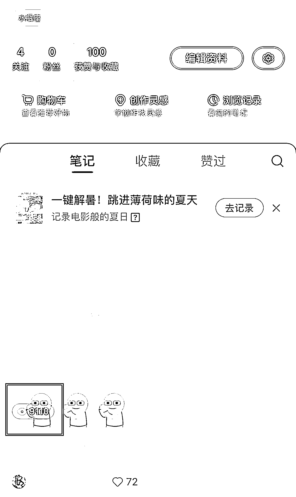
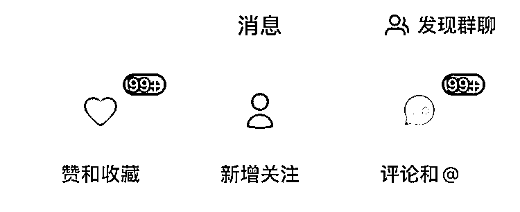
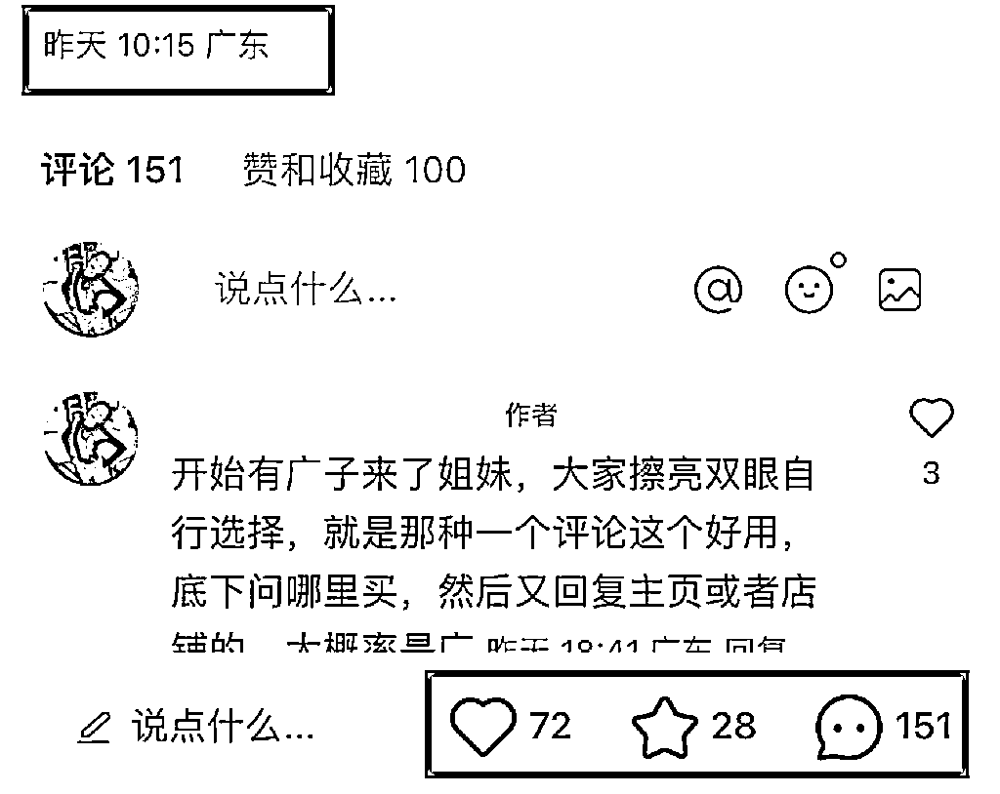

# 实操经验：小红书新号如何第一篇笔记就出 99+❤️

> 原文：[`www.yuque.com/for_lazy/zhoubao/mwnzh8af2ptoqslf`](https://www.yuque.com/for_lazy/zhoubao/mwnzh8af2ptoqslf)

## (22 赞)实操经验：小红书新号如何第一篇笔记就出 99+❤️

作者： 加麻

日期：2024-06-18

新号第一篇图文笔记隔天就能跑到 1 万多小眼睛，并且点赞评论 99+，评论比点赞多，先放截图：

小红书新号不一定要第一篇笔记就做把数据做得很好，但是如果能做到前几篇或者第一篇笔记出小爆，那对整个账号起号以及项目周期是有帮助的，有几个原因：

1、让自己有爽感，有信心去做一个账号

2、让账号标签垂直

3、完成养号动作直接进入下一步

但是切记一味的去追求流量是没有用的，因为有的就属于泛流量，不仅变现不了，甚至对整个账号垂直度也会有影响，所以不能逮着有流量话题的笔记就发，像明星类、娱乐类，除非你做这个赛道知道怎么变现，否则建议不要选。

首先我们应该重点发的笔记：

行业细分领域相关 or 行业大类目相关

比如我这次的新项目是美妆类产品，假如按关键词去区分，那么行业细分领域可以分为：

场景词：夏天粉底液

功效词：粉底液推荐遮瑕持久不脱妆

人群词：敏感肌粉底液/孕妇可用粉底液

按照行业大类目相关的笔记去区分，那么可以分为：

产品词：粉底液

类目词：粉底液小样

（具提小红书关键词区分可以看我这篇：[小红书不同搜索词解析](https://articles.zsxq.com/id_obbnwinm7l85.html)）

我们筛选出关键词，就可以有针对性的去发布笔记，我们知道要发行业细分领域相关 or 行业大类目相关，那么怎么发才会出数据呢？

大家都知道，小红书的 CES 评分=点赞 1 分+收藏数 1 分+评论数 4 分+转发数 4 分+关注数 8 分，可以看出小红书的点赞和收藏分是比较一般的，评论/关注/转发才是重心。就我们以卖货为主的账号来说，按重要性来排：评论数＞转发数＞关注数，关注和转发一般我们不太能干预也不 care，所以我们尽可能的要去做互动数据高的笔记

那怎么去发布互动数据高的笔记呢？底层逻辑就是：

1、针对性设计内容。使用互动元素：在笔记标题/封面上直接加入问题、提问、投票、针对产品热点进行认可或提自己的想法，让用户参与分享自己的个人经验和观点，从而增加评论和互动

2、人为操纵评论。及时回复评论：积极与用户互动，及时回复他们的评论，展现对他们的关注和尊重，因为你自己的评论也会算进 ces 评分里面

理解了上面的逻辑之后，回到主题上来，小红书新号如何第一篇笔记就出 99+❤️呢？步骤如下：

1、养号：新账号注册后养号 2-3 天，养号期间不动账号三件套，先按照行业大类目 or 细分领域搜关键词，给行业内笔记点赞收藏评论，让系统越来越给你推送行业笔记

2、设计好内容：看似随意，实则都在设计之中。基于行业关键词的情况下，我们发出的互动，一定是要用户能回答得上的，还是拿美妆举例：

①粉底液和气垫到底怎么选（标题）+自己拿捏不准求解答（内容）

②刚画完的妆不到一个小时就融了（标题）+怎么解决底妆服贴（内容）

③这世界上到底有没有好用的橄榄皮粉底液（标题）+求推荐（内容）

3、发笔记：通过关键词筛选行业内互动元素高的内容，并在笔记标题/封面上加入关键词（重要⭐️）。

互动高的内容结构有：新手提问、使用提问、产品推荐等等，每个行业内都会有这些互动贴、问题贴，做好养号之后去对标大概率流量不会差到哪里去。但是切记第一篇笔记不要发吐槽类，很有可能会被判消极笔记直接限流（痛的领悟）。

希望对大家有帮助。

* * *

评论区：

暂无评论

* * *