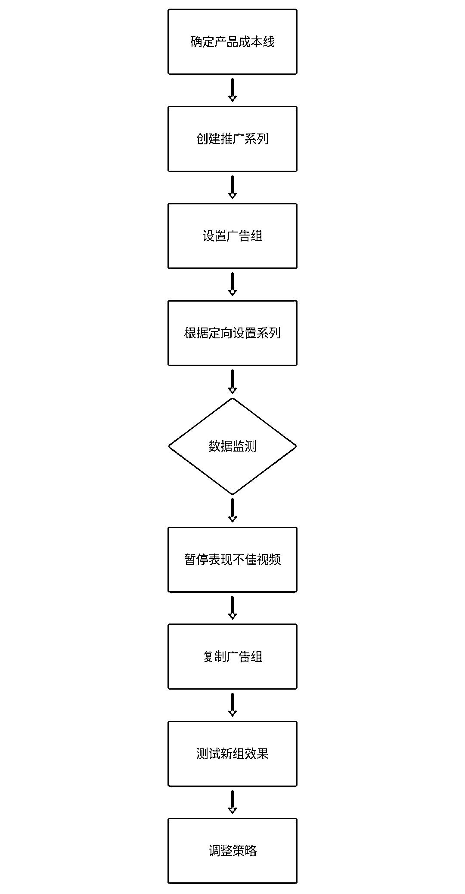
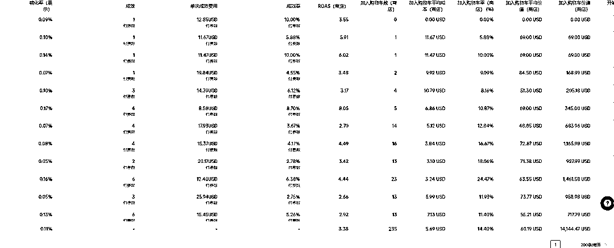

# tiktok 小店投流分享（新手篇）

> 原文：[`www.yuque.com/for_lazy/zhoubao/tmzvsziomr6dl4h8`](https://www.yuque.com/for_lazy/zhoubao/tmzvsziomr6dl4h8)

## (10 赞)tiktok 小店投流分享（新手篇）

作者： 梁小伟

日期：2024-06-17

分享一篇 pipiads 数据网站的投流教程

## TikTok 广告投放与优化实操指南

在 TikTok 广告投放中，选择适当的投放方式和策略至关重要。

本文将详细介绍测品的核心逻辑、快速测品的方法、如何判断符合扩量标准，以及具体的投放策略和数据分析方法，帮助广告优化师在实际操作中取得最佳效果。

**一、测品的必要性**

1.  **核心逻辑**

**验证市场情况**：通过选定产品、制作素材、装修店铺等初步准备，通过实际投放验证这些内容的市场反应。

**获取数据反馈**：投放后，通过数据反馈观察和优化上述内容，确保广告策略的有效性。

1.  **测品方法**

**模型设置****账户数量**：使用 1-2 个广告账户。

**广告组数量**：每个账户创建 5 个广告组，好的保留缓慢加预算，差的关闭，反复复制。

**素材数量**：每个广告组使用 3-10 个素材。

**投放策略**：5 个广告组系统自动投放，拿到数据改自动出价 三条广告组通投，2 条广告组不同兴趣，观察数据反复关停复制持续测试

**投放逻辑****多账户、多素材、多广告组**：通过广泛的市场验证来测试效果，增加测试覆盖面。

**手动出价与自动出价结合**：通过不同出价策略找到最佳的出价范围和优化方向。

**预算设置****广告预算**：预留至少 50%的利润用于广告费用。

**单次转化预算**：加预算控制在出价的 20 倍以上，复制组 20 美金预算一直复制。

**出价策略**：使用阶梯出价法，从 5 到 20 美元不等，逐步增加或减少 1-2 美元，测试合理出价范围。

1.  **数据观察与优化**

**关键指标**

**CPM（每千次展示费用）**：广告展示的成本。**CPC（每次点击费用）**：每次点击广告的成本。**CTR（点击率）**：点击次数与展示次数的比率。**加购率**：商品加购次数与点击次数的比率。**出单率**：商品购买次数与点击次数的比率。

**数据分析****CTR 大于 2%：点击率较高，意味着广告素材吸引力强。点击率高但无加购分析素材与落地页产品的契合度**：检查广告素材和落地页是否一致，是否能有效转化用户。

**人群定位是否精准**：查看广告投放的人群是否匹配产品目标受众

**加购多但无支付：**检查价格及相关优惠，考虑信任度问题

**定价及运费**：合理设定产品价格和运费，避免用户因为价格问题放弃购买。

**二、投放方式与策略**

**4.确定成本线并推广单独广告组**

1.  **步骤**
2.  **确定产品成本线（盈亏线）**：计算产品成本和利润线，确保广告投放不会亏损。
3.  **创建单独推广系列**：针对每个产品创建单独的推广系列
4.  **根据不同定向设置不同兴趣和素材**：细分广告定向，覆盖不同人群，确保广告触达精准用户。
5.  **暂停表现不佳的视频**：通过数据反馈暂停表现不佳的视频广告，集中到效果好的视频上加预算和复制。
6.  **复制多条条相同广告组**：复制表现好的广告组，测试新的广告组是否同样出单，保证广告效果的持续性。
7.  **复制新的推广系列**：在旧的系列掉量时，有新的系列补上，确保广告投放不中断。
8.  
9.  **注意事项**
10.  **提价策略**：提价时不要一次翻倍，建议 20%～30%逐步增加。
11.  **复制广告组数量**：复制广告组时，持续复制+关停保持每次 5-10 组，其中 80%广告组都要关闭

**5.系统自动出价跑视频创意**

1.  **步骤**：
2.  **根据不同定向设置不同系列**：视频创意保持不变，系统自动出价进行投放。
3.  **测试产品的大概转化成本**：通过系统自动出价测试产品的转化成本，确定最佳出价范围。
4.  **复制组操作**：与第一种方法相同，通过持续复制测试新的广告组，保证广告效果。

**三、数据监测与调整策略**

1.  **CPM 高的原因与应对方法**

1.  **原因**：受大盘影响或客户自身定向过窄导致。
2.  **应对方法**：
3.  **关注 KPI**：如果 ROAS 高，CPM 高也可以接受，说明人群精准。
4.  **查看 CPM 背后的原因**：如 ROAS 下降，需调整策略，换素材或换产品。

6.  **投流的相关思路**
7.  **核心策略**：定向过窄导致跑量困难，定向过宽导致人群不精准。
8.  **操作建议**：对于跑量不错的计划，如果想紧缩定向，建议复制计划后再修改定向。

10.  **新计划如何优化素材**
11.  **调整素材**：是解决不消耗问题的最有效方法。
12.  **创作频率**：每天保持不同类型素材的创作频率，同时对老素材进行数据分析，优化方向。
13.  **素材质量评估**：通过 3 秒播放率、点击率、转化率等数据评估素材质量。

**四、具体执行策略**

1.  **流程图：测品流程**

**10.流程图：广告投放与优化流程**

**五、关键数据指标与优化**

表格：关键指标监测（仅供参考）

指标描述目标值 CPM 每千次展示费用$10-$20CPC 每次点击费用 0.2-0.8CTR 点击率>2%加购率商品加购次数与点击次数的比率>5%出单率商品购买次数与点击次数的比率>1%

#### 表格：数据分析与优化

问题原因解决方案 CPM 高大盘影响，定向窄调整素材，更换产品 CPC 高点击超出文案美金改视频，加营销术 CTR 低素材数据不好优化创意，改素材加购多无支付落地页信任度低优化落地页，检查支付通道

**六、广告组与素材管理**

#### 广告组设置与管理

**广告系列 1**：

广告组 1-通投

广告组 2-通投

广告组 3-兴趣 1

广告组 4-兴趣 2

广告组 5-兴趣 3

**广告系列 2**：

广告组 1-通投

广告组 2-兴趣 1

广告组 3-兴趣 2

**七、总结**

通过科学的方法和系统的测试，TikTok 广告投放能够有效验证市场情况，优化广告策略，提升广告效果和 ROI。不断观察数据反馈、调整策略，才能在竞争激烈的市场中取得成功。

**实操环节**

tiktok 投放随着系统越来越完善，操作也越来越简单。

投放扩量就两种方法，**复制组和加预算**。

两者可以同步进行

很多卖家会纠结于投法。

到底是走品牌投法，建五个组，一直加预算让系统去找人群

还是通过复制组的方式去手动撞人

皮皮今天可以直接告诉你，都可以。

两种方法各有利弊。但如果是省钱的跑法，前期测品可以考虑通过复制组的方式去手动去撞人群

测品期：**测素材+找人群**

以下我会用一个客单 70 美金的产品来给大家讲解

新店铺，细分类目，无建联达人，正常 roas 是 5 以上

混剪拍摄素材拉店铺动销

准备期：混剪了 5-10 条素材

这个品是店铺被封过，知道他的出价范围和什么类型的素材效果好

直接混剪了三种类型的素材

1：纯达人讲解素材

2：开箱素材

3：达人使用场景素材

**三种素材结合=爆款**

同样适用于大多数产品

**讲解+测评+使用场景**

方法走复制组，准备多条素材

素材与素材之前的区别很明显

组与组之间的数据差异也很明显

数据差的组关闭，数据好的组保留缓慢加预算结合复制

反复去找到优质组

评判标准（仅供参考）：

刚开始消耗看 cpm，cpm 异常关闭，

1 美金内 有点击看点击，点击率低于 1.5%关闭广告，

2-5 美金 总花费 10-%20%内

有加购 不出单，花费 30%关闭广告

有出单 roi 高于 3 复制广告+加预算

**出单＞加购＞ctr**

有一个漏斗评判标准

核心看出单情况 观察总的 roas

素材迭代测试有进行多类型测试 以及高光帧素材测试

具体案例具体分析。

投放没有公式和绝对，不管从哪个角度说，似乎都可以。

大家可以不用太纠结于跑法 核心回归到做素材和创意上面。

这一篇是新手扫盲篇，希望对大家有所帮助。

pipiads 是专业的 tiktok 广告数据分析平台及选品平台，拥有市面上最全的投流数据。

* * *

评论区：

嘉达 : CPC 高点击超出文案美金改视频，加营销术————大佬，这一句是不是有错字，没太懂什么意思呢[合十]

* * *