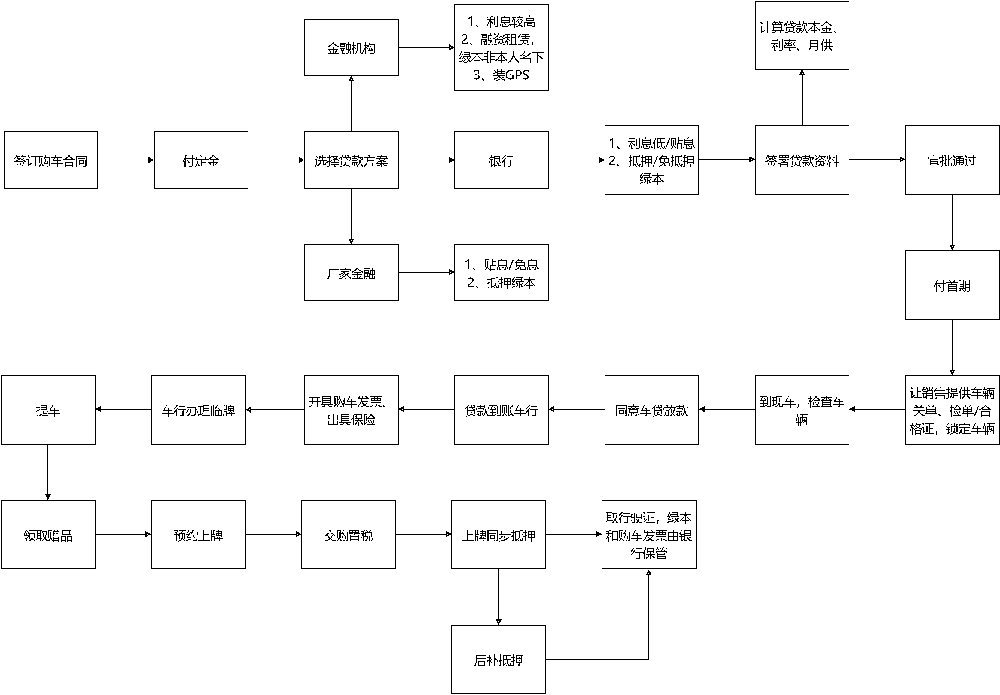
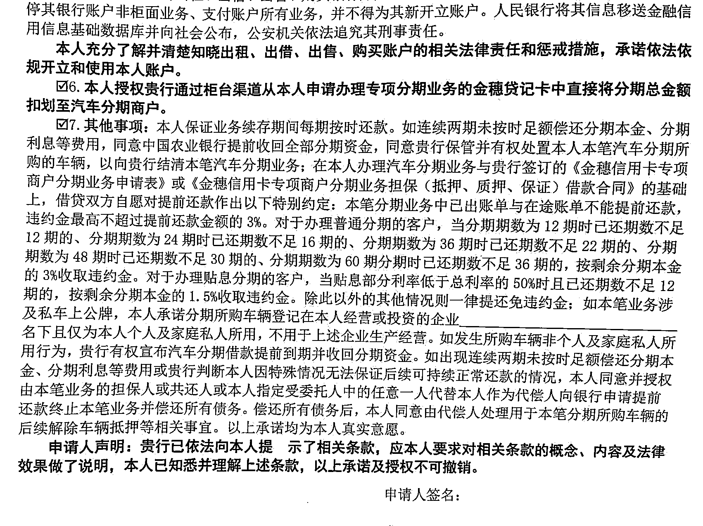
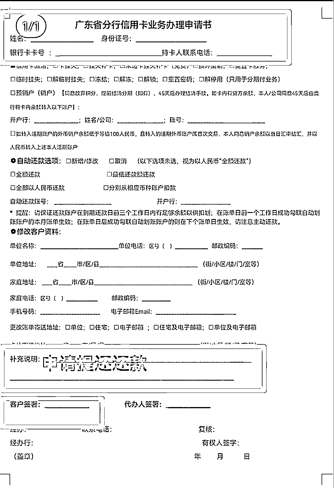
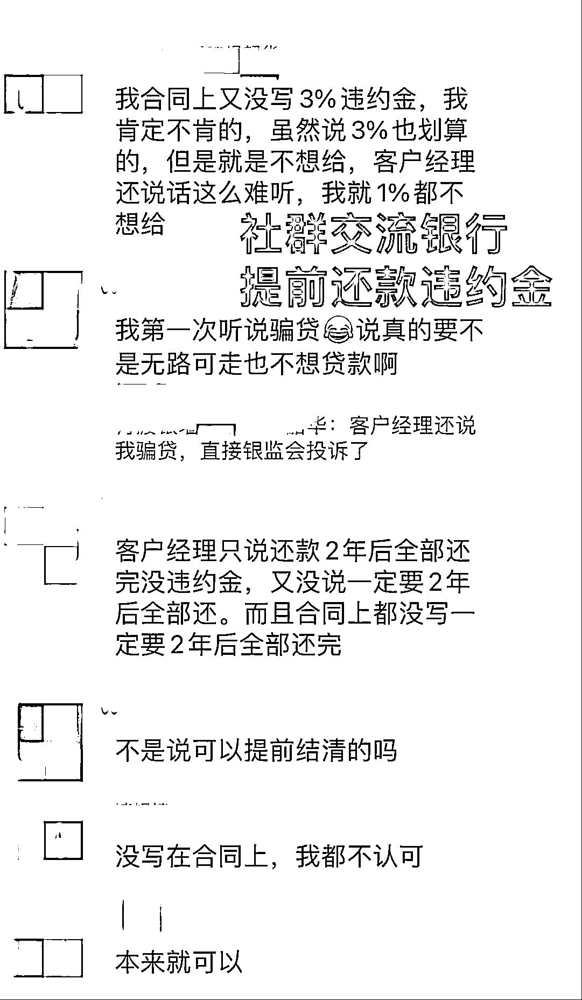
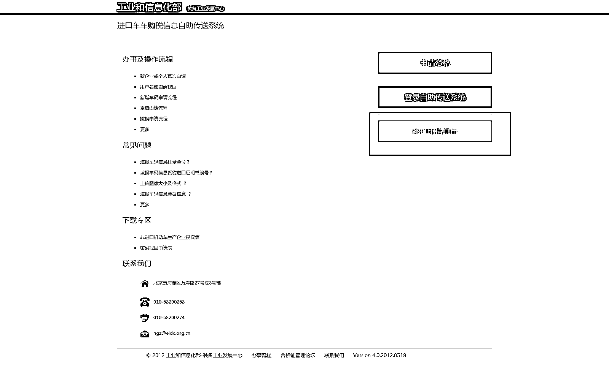
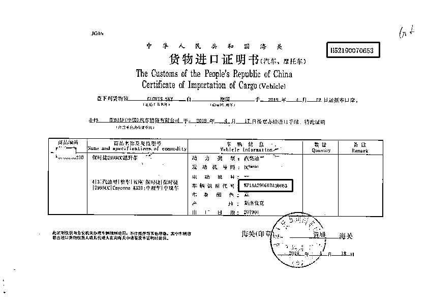
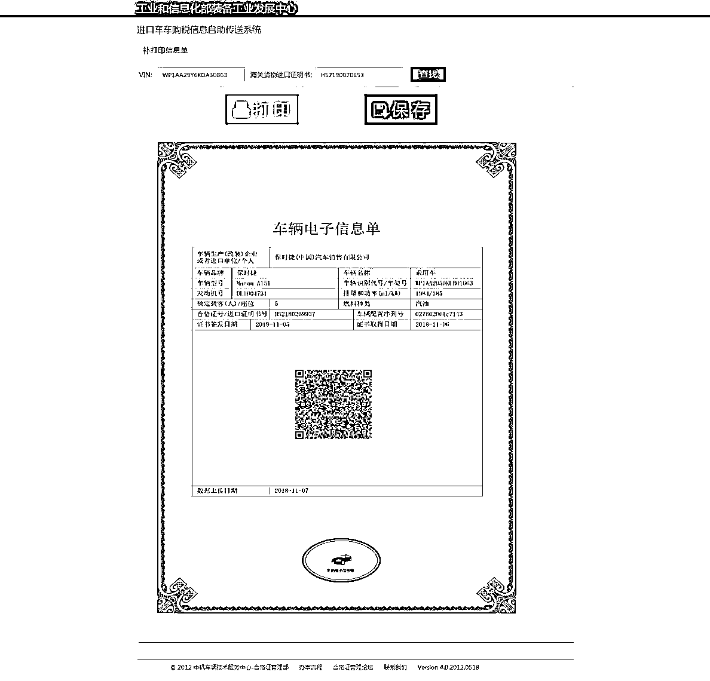
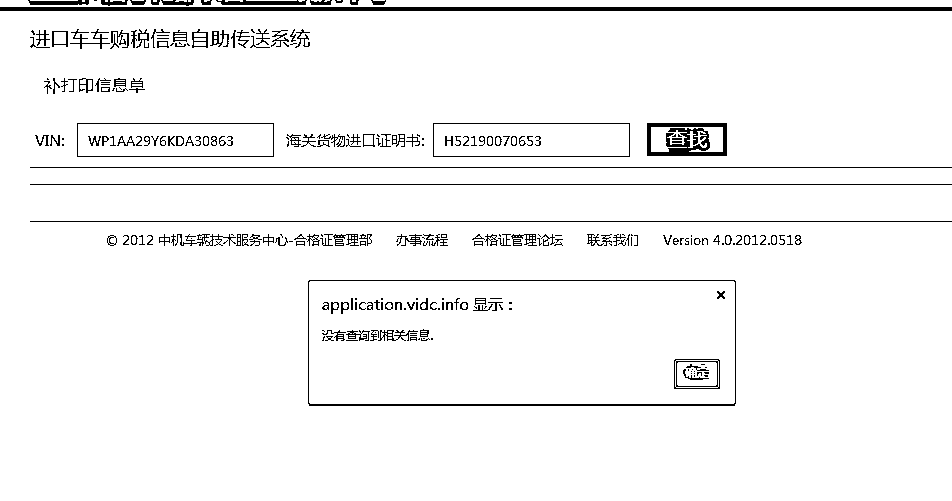

# 买车贷款前必看，不踩坑

> 原文：[`www.yuque.com/for_lazy/zhoubao/mq8dbdzcnorutbq8`](https://www.yuque.com/for_lazy/zhoubao/mq8dbdzcnorutbq8)

## (31 赞)买车贷款前必看，不踩坑

作者： choco 陶⁹⁹⁸⁸

日期：2024-06-18

大家好，我是融资顾问陶陶，2024 年 12 月加入生财，和生财好友线下聚会聊到本职专业，发现很多人对车贷、房贷、信用贷、经营贷缺乏认识，学校和家庭都没有教育的科目偏偏又是人生不得不面对的大宗消费，随便一个踩坑都涉及几十万、几百万甚至上千万的损失。

简单介绍一下自己，从事金融综合服务行业 15 年+，任职过商业银行、小贷公司、担保公司车贷风控总监，4S 店车行金融培训师，以下我专门来说说买车分期需要注意的事项：

**一、买车分期全流程**

首先我们要先了解全局和流程，才能更清晰自己要如何走到终点，把握关键节点。

**二、注意事项**

1、**【看车】**如果有相熟销售最好到店前预约，不然到店后会认定为自来直客，想再找相熟销售或经理拿优惠就很难了。

2、**【签订购车合同】**裸车价=厂家指导价-店家优惠价，每个店家优惠不一样，不要以为 4S 店就是统一价格。在购车合同上注明发票价即裸车价，发票价是决定可贷金额和购置税金额。签订购车合同即付定金一般是 3000-5000 元，退车一般不退定金（不过也可以协商退！这个看销售人品）

3、**【购置税】**=发票价/11.3 ，不要相信销售说的一价全包。

4、**【费用】**上牌费一般是 500 元-1500 元，按揭手续费一般是 3000 元/笔，中高端品牌按贷款额计算，一般不超贷款额 3%

5、**【保险】**建议首年在店内买保险，新手不免磕碰，回店内报修由保险直赔付不用先垫资，筛选后建议参考险种：第三者责任险 200 万起、车辆损失险。

6、不需要装 GPS，不需要交 GPS 流量费，不需要交出车费，要你交的销售都是想坑钱。

7、**【车贷分期】**买车可以选择一次性或分期付款，这时 100%销售会叫你选择分期，因为银行对车行有返佣，羊毛出在羊身上，返佣就是你的利息一部分，所以这时候你要做对比，车行合作的金融机构一般有 3-5 家，优先考虑顺序是利息从低到高：银行、厂家金融、融资租赁金融机构。自身资质好，征信无逾期，有稳定收入来源，选择利息相对低的银行，资质稍微差点的考虑利息中间水平的厂家金融，有时候遇上活动，厂家金融会有贴息，即部分利息由厂家承担，往往能省下几大千元利息，一般销售也不会主动告诉你，你要主动咨询。资质差，征信逾期严重或无法显示稳定收入来源的，可能要申请第三方的融资租赁公司，利息偏高，而且有可能车辆绿本无法登记在你名下，而是登记证在租赁公司名下，你每月交租金，签署租赁协议，租赁期满后过户，这种方式比较极端，适合征信十分差的。

选择贷款方案时，注意清晰四项重要数据：本金、月供、年限、月利率。

【车贷分期计算万能公式】

总还款额=月供*期数

总利息=总还款额-本金

月利息=总利息/期数

月利率=月利息/本金

月利率在 3-5 厘为正常范围，超出范围就要考虑是不是被坑了。

【重点】车贷利息的计算方式是复利，意思是即使你每一期有还本金，利息也是按照你贷款总金额计算，车贷是复利即年利率，房贷经营贷用的是单利即年化利率。在横比利率的时候要区分年利率和年化利率。

8、**【提还违约金】**无论是银行、厂家金融还是金融机构，都会要求供款满多少期才免提还违约金，每间银行都不一样，同一间银行不同地方支行也可能不一样。在陶陶准车主群组有 2 位小伙伴就分享过自己在当地同一家银行的车贷合同对于违约金不同的比例（下图）

所以提醒大家在签署借款合同的时候可以其他不看，关于提前还款约定违约金比例一定要看清楚（下图），参考比例是 2-3%。

还有一种情况是银行要求把剩余利息一次性存入结清后再冲销部分利息的，的确存在这种操作，这种情况提醒大家需要先到银行填写一份提还申请表（下图），把该冲销金额填上以免有异议。

9、**【免抵押申请】**如果你征信良好，名下有房产，车贷金额不超 50 万，要主动提出免抵押，好处是绿本不用抵押给银行，年审或改变车外观年审时不用向银行申请借绿本，更重要的是随时卖车不用结清车贷赎回绿本。

10、**【锁定车架号】**交首期前要和销售确认自己的车辆，如何确认呢？就是锁定车辆的“出生纸”进口车是“货物进口证书”和“进口机动车辆随车检验单”，国产车是“合格证”，无论是进口还是国产，都要销售提供车辆的“发动机号”和“车架号码”，这 2 组号码是一车一号，独一无二，进口车可以登录政府官方网站中机网 ，查验是否存在此车，以防被骗。点击“补打印信息单”，输入相应的 VIN 号和进口证明单号

**输入车架号和进口证明书号，正常会显示：**

**如此车架号不存在，即车辆不存在，会显示一下界面，需注意：**

11、**【最佳放款时间】**锁定车辆车架号和发动机号，现车到店才同意销售放款，因为车贷一放款就开始计算利息就要开始供款，如果车未到店未提车就要算利息你愿不愿意？！有些车行为了冲月底业绩任务，赶着开购车发票赶车款到账，会存在未经车主同意先开票先放款，提醒大家避坑！！！

12、**【不要提前开发票】**车行提前开购车发票对车辆有什么影响？最重要的影响是车船税，早开一个月多交一个月，还有车龄的影响，如果不跨月问题不大，如果开票时间超了三个月以上就要注意了，当你上牌的时候车管所会罚滞纳金。

13、**【临牌先交税】**开豪车的朋友可能会想多开几个月临牌，你懂的，建议先去车管所交购置税，换几次临牌后再去上牌也不至于面临大额滞纳金，我有客户试过林宝坚尼开票后一年才去上牌，滞纳金罚了 60 多万。

14、**【保险不生效】**提醒开临牌的小伙伴，因为未上牌保险未生效，所有的刮损，意外都不赔付，新手上路请谨慎！

15、**【是否二手车】**购买保险的时候务必检查车辆是否存在二次投保，因为在行内判断是否二手车不是看行驶公里数（表可以调的）而是看是否已经购买了保险！！

16、**【绿本提前备份】**上牌抵押后，车管所出具车辆登记证，俗称绿本，第一页是你自己的名字，第三页是抵押权人全称即银行。绿本和购车发票原件需要交银行归档，你自己保留复印件或拍照存在手机，日后续保、年审、卖车用得上。

17、**【还款提示】**以后每个月收到银行还款短信提示准时还款，也可以登录手机银行 app 查看贷款详细，注意不要迟还或不还，有逾期记录对日后贷款有影响，车贷都是走信用卡所以会有账单日和最迟还款日，一般账单日后 20 天就是最迟还款日，具体以你贷款行为准。

18、**【贷后管理】**万一逾期了会有什么责任？逾期 1-2 期银行经办会致电协商，如果你真的遇上困难，一时间无法还款，一定要和银行经办好好沟通好好协商，寻求解决办法，例如展期，债务重组，按照目前还款能力再分期。连续逾期 3 期以上就会有律所介入，意味着银行把此笔贷款列入为不良，开始走司法流程，如果无好好把握之前说的和银行沟通，一旦介入律师就会产生律师费用，雪上加霜，并且会收到律师催还款函，律师上门贴通知还款函，然后就开始司法流程，冻结名下银行卡、微信支付、支付宝账号等，然后是查封名下资产等等。这里不一一展开，总之就是不要逾期！提前做好资金计划！！

最后，我是融资顾问陶陶，在广州从事助贷和垫资过桥业务，希望以上内容会对你有所帮助，我在做个人自媒体账号陶陶银行圈，科普贷款知识，帮助年轻人提升财商，用好金融工具，让财富持续增长。

* * *

评论区：

冷小喵 : 202
4 年 12 月加入？
choco 陶⁹⁹⁸⁸ : 2023 年 12 月[调皮]写错了
象.Ellie : 干货技术帖[强]
choco 陶⁹⁹⁸⁸ : 谢谢大象姐

* * *