# 生财小白在小红书，如何用 AI 写作 3 个月收入 12w+

> 原文：[`www.yuque.com/for_lazy/zhoubao/mp1o321q3rftn0gd`](https://www.yuque.com/for_lazy/zhoubao/mp1o321q3rftn0gd)

## (107 赞)生财小白在小红书，如何用 AI 写作 3 个月收入 12w+

作者： 浩然

日期：2024-06-14

圈友们好，我是浩然，今年 4 月加入生财的新人。

在 AI 的风口上，想不赚钱都难，我每天朝十晚七上班，腾出时间在小红书做 AI 写作，3 个月都赚了 12w 多，让我真切的感受到了顺势红利的巨大力量，这是我的收益图。

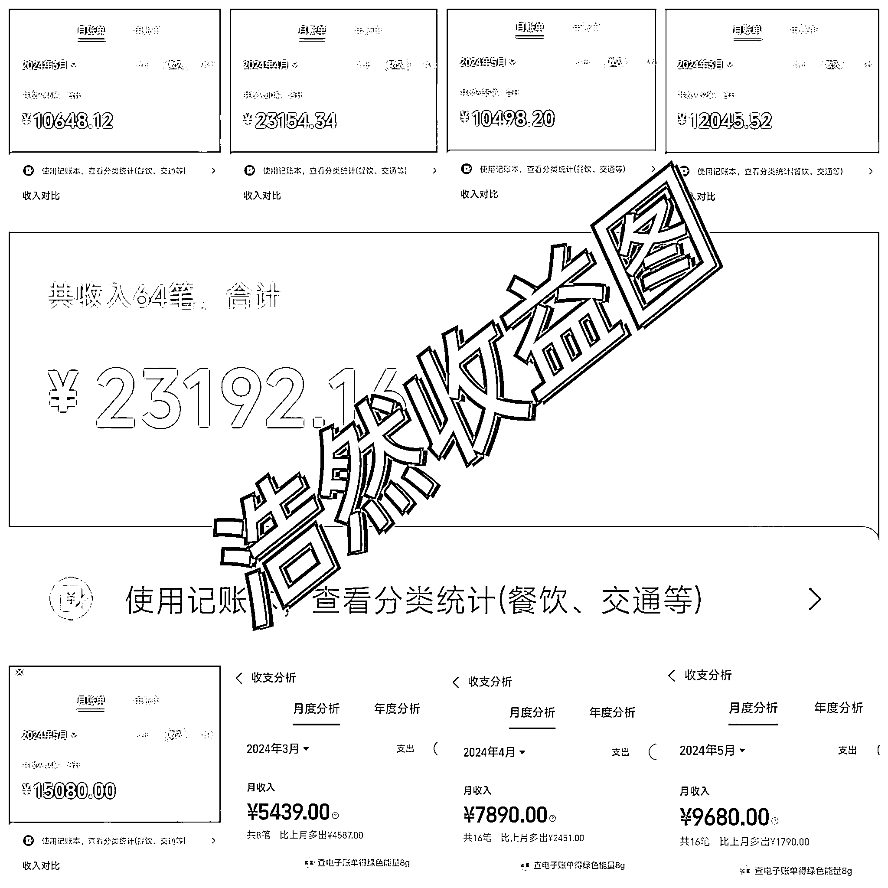

一直潜水生财，在徐宿老师的鼓励和帮助下，今天我也鼓起勇气来分享复盘一下自己的经验，希望对还在项目里迷茫的新人朋友有所帮助。

**1、敏锐觉察 AI 写作的红利商机**

之所以入局 AI，是因为我之前的项目，遇到了增长卡点。

当时我 1 月 25 号做的抖音无人直播，那时候，1 个月已经能达到 5000 多的收益，但是，没有场地，还容易封号，让我没有办法放大，收益的不稳定，逼着我需要找新的突破口，找一个更好的项目。

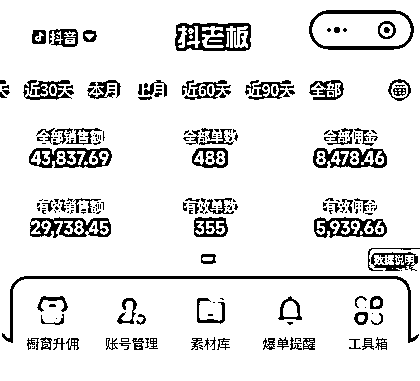

后来，在徐宿老师的推荐下，我参加了生财的三天体验营，精华帖的内容，让我大开眼界，收获甚多，然后，我就加入了生财。

在生财找项目的过程，就像大海淘金，每一个好像都不错，都想做，但真的要开始了，又犹豫不决。大家都说今年的小红书，是不可错过的平台，我看了很久的无货源，已经构思了一切，却看到一些消息说，无货源被小红书打压，于是我很快就放弃了这个念头。

兜兜转转了很久，我突然发现，自己犯了一个大多数人都会犯的思维错误：害怕失败。

因为之前的成功束缚了我，让我觉得以后入局的每一个项目，都必须成功。

可是，没有什么比错过机会更让人遗憾的事情了，所以，放手去干！去兴致勃勃的失败！

打通了这个思维卡点之后，我继续刷小红书精华帖，同时盯着自身优势琢磨，我是一名程序员，如果我做个 IP 号，兴许可以长久一点。

我用梨云提到的守破离方法，一开始不按照自己的直觉判断去做，而是去找对标。

我搜集了计算机赛道 30 多个博主，一个个分析他们的笔记选题和内容，我发现爆款笔记的选题，不少分布在计算机答辩和论文知识这一块，而且下面也有很多评论，说明需求很强烈。

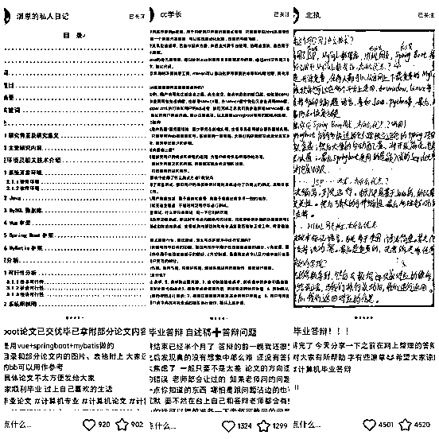

到现在，我都不会忘记 3 月 4 号那一天。

第一次模仿博主，用 AI 写了一篇如何写论文的笔记，发完我就担心自己没流量，每过一段时间，就去刷新一下主页，看点赞有没有增加。

这个时候就想看看小红书上能做什么，刚开始的想法也是做无货源电商，但是看到一些消息说，小红书正在打压无货源，之后就放弃了这个念头。

结果，点赞没几个，却有人来找我私聊，问我能不能帮他写一篇论文，题目是 WEB 应用测试用例并行执行优化策略研究。

看完他的论文选题，我本能是想拒绝的，因为我是做大数据的，对测试行业不熟悉，就算是程序员，也是分很多种类的。

但是我想了一下，我会 AI，这可是一个机会，一念之间，命运齿轮转动了。

虽然心里没底，但我还是强行啃了下来，整整通宵了两天，就靠着和 GPT 一问一答，硬是把初稿给问出来了。

我把初稿交给那个同学后，他觉得我写的不错，又介绍了他的同学，就这样，起步全靠自己摸索，开启了我的 AI 写作之路。

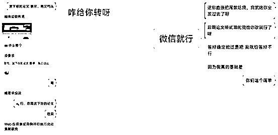

就在此时，我意识到了这是一个可以把握的机会，我又发了一篇笔记，引流了 5 个人，变现 4000 后，账号被判引流，给我封了。

就在我以为小红书走不通，想去其他平台的时候，无意间刷生财，看到了小红书解封的方法：通过换 QQ 号和微信号，来登录自己小红书，然后绑定自己这个已经被封的手机号，就可以把手机号释放出来。

然后，我就开始继续搞引流。

**2、不发笔记的快反馈截流玩法**

账号解封了之后，疯狂刷笔记，突然发现评论区截流好像更高效，然后就开始在各个评论区放钩子，说“我这边可以写论文，计算机专业的，个人写手，来赚点外快”。

后面还直接私聊那些在评论区求推荐的，发现这种还更高效，就是封号特别快，得多备自己 QQ 号。

这里，我和大家分享一下，我是怎么快速截流的：

打开小红书，搜索：计算机论文，看最近发的帖子，然后点击详情页里，比如这张图里我们点击第一个。

点进去之后，找到这种最近（时间超过半个月的就不要私聊了，最好是最近 5 天之内）刚发布的：求，求介绍。等等的评论，后台去私聊！

发私聊文案：哈喽，同学，在找写论文的么，本人计算机专业的，经验丰富，个人写你要找的话，可以看看我。

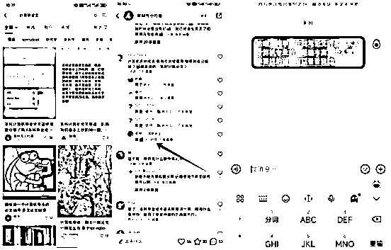

这种文案大家可以找 GPT 再润色几个，不要同一时间发布的引流文案都一样，增加概率风控。

引流到微信，这块是被封控的重灾区，所以我会介绍几种更安全的引流方式。

如果有同学回复，我们就把有微信号的图片发给他，可以把图片存小红书表情里，操作和微信号存表情一样。这种一般也多准备几张，不要同时给很多人发同一张图片。大家私聊完记得把小红书的聊天框删了，能对抗一点风险。

AI 写作，它是一个有闭环的商业模式，除了前端流量要做好，后端的交付，也不能落下。

**3、和客户怎样谈单提升成功率**

在我给身边同学分享了这个赛道以后，发现很多朋友难在了谈单方面，那么我就分享一下我的谈单技巧。                                                                                                                                                                                                                              

新手小白如何谈单和报价呢？如果是完全不懂的新手朋友，谈单就是明确客户的需求，问下客户的专业，客户想要做什么，是论文写作还是论文修改还是其他等等。然后根据客户的要求再来报价，行业内一般是根据字数来报价。

下图是一份行业报价单，大家可以参考来。

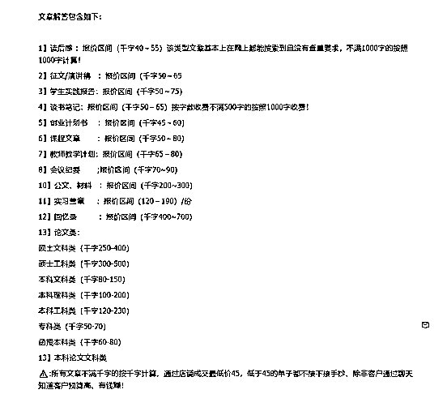

下面是我的一个谈单案例，本来以为是 1k 的单子，最后 2.5k 成交。

刚才说了谈单的第一步就是了解客户的需求，看客户到底想要做什么，还有客户的要求。客户有时可能连需求都说不明白，这个时候我们就要深挖，这就需要你对当前的客户要做的有一定的专业能力。

第二步体现价值，谈单最容易成的也就是你对客户的需求也有专业的能力，一旦你体现了你的专业能力，那么这个客户就非常容易成交。

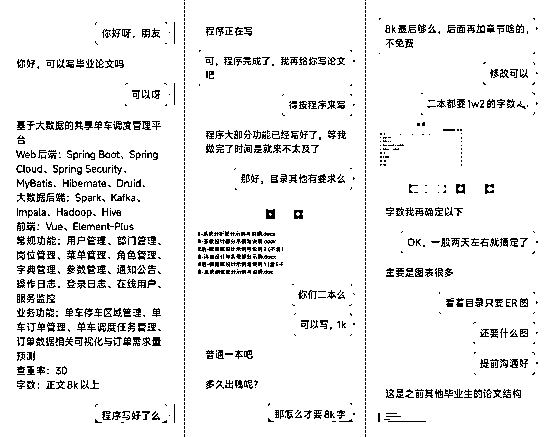

第三步就是根据需求报价了，这个单子，一开始我报价早了，客户说只要 8k 的字，我以为是二本学校，没想要是一本的深入了解需求后，我报价了 2500，在和客户的聊天过程中客户也看到了我的专业能力，然后就成交了。

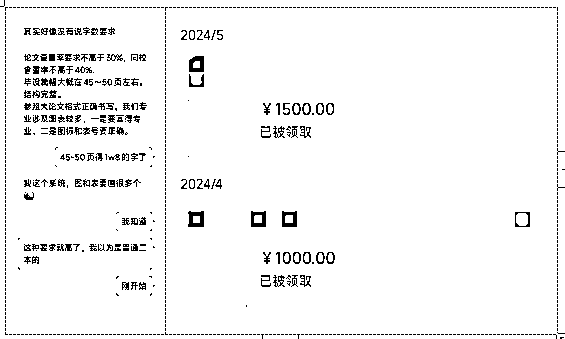**4、用极致交付推动指数级裂变**

好的交付，能形成口碑，好的口碑，会给你带来意想不到的惊喜。

我刚开始接到写作单子，也没写过这类论文，不知道怎么样才叫写得好，如果你没有先完成再完美的迭代思维，那么会直接卡在这个环节，不敢开始，错失机会。

我当时想的是，先写好第一稿，发给同学，等反馈继续修改，是完善交付质量，也是积攒经验，一箭双雕。

你甚至想不到，一开始，我以为自己专业的目录是通用的，结果做了才意识到，每个学校的要求还都不一样，一边和同学沟通，一边挑着夜灯全靠万能的百度辅助，论文调整格式的细节，也是在 b 站上拉着视频进度条一点点学来的。

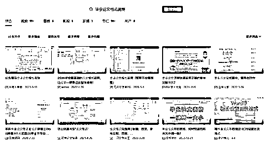

当我不断提升自己交付质量的时候，渐渐发现，这个市场上做好交付的人太少了，评论区总有一堆哭诉自己被骗的经历。
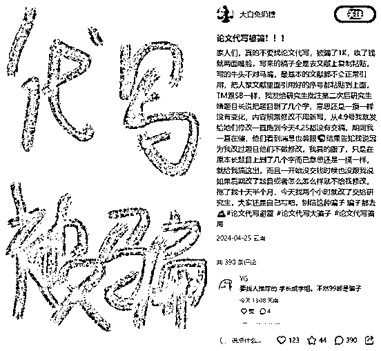

而我的经历告诉我，只要你能做好交付，那么你会获得这个同学他背后的资源。

之前有一个同学，因为我交付的好，他不仅把同班同学推荐给了我，还把其他专业的人都拉了过来，我承包了他们学校很多的单子。

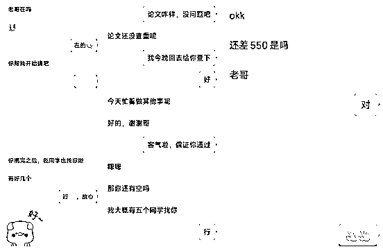

所以，想要在这个项目上赚更多的钱，就一定要有交付思维，对自己的产品高要求，后期你就有抬价的空间。

我接过 3k 一单的论文，就是同学推荐的，因为第一次交付有了信任感，所以说，大家如果想持续深耕 AI 写作，做好交付必不可少。

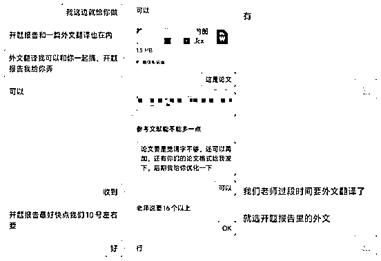

再给大家分享一下我觉得做好写作的一个思维，交付思维，交付思维也是如何成为高质量写手要掌握的思维：

什么是交付思维？按我自己的理解，**交付思维就是你要用心对待你的客户，把每一个文稿都认真地完成，不能应付敷衍了事**。你可以把自己想象成客户，如果别人这么对待你，你是否会满意？在我入局写作领域的过程中，做过写手，也做过派单者，见过不少敷衍了事的人，这种人通常只会合作一次，就没有下次了。

敷衍客户无异于在断自己的后路。如果你提供的质量差，不仅失去转介绍的客户。AI 生成的初稿到最终完成稿之间还有一段距离，需要润色、去 AI 化，以及格式调整。论文有论文的格式，演讲稿有演讲稿的格式，这些都需要清楚掌握。

交付思维还要求你有一种以终为始的思维方式。客户找到你写一份稿件时，你需要在与客户聊完需求后，形成一个初步的思路，知道怎么写、怎么完成任务，以及最终的呈现效果。当然，这需要慢慢练习。在过程中可能会出现思路与客户需求不符的情况，这时就需要复盘，找出问题所在，并在下次改进。下面给大家看一个复盘示例，大家可以参考这个来。 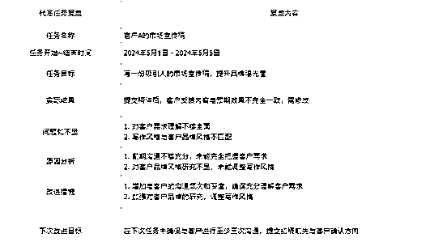 大家在客户交付时一定要用心再用心。这样不仅可以减少后续修改的次数，还能增加客户的重复下单机会，甚至获得客户的推荐。在这个领域，只要把交付做好，把细节把控到位，你就已经超越了 80%的人。

同时还包括对客户需求的深刻理解和准确回应。客户的需求各不相同，有些对内容有极高的专业要求，有些更看重文稿的可读性和创意。在与客户沟通时，我们需要明确客户的要求，并在文稿中尽可能地体现这些要求。

这就需要我们具备很强的沟通能力和同理心。通过有效的沟通，不仅可以明确客户的需求，还能在项目进行过程中及时获取反馈，调整写作方向，确保最终交付的文稿能够完全满足客户的期望。同理心则帮助我们站在客户的角度思考问题，提供更贴近客户需求的服务。

在实际操作中，交付思维还体现在对细节的关注上。细节决定成败，这句话在写作行业尤为适用。从文稿的内容、语言、格式，到最终的呈现效果，每一个环节都需要用心去做。特别是对于一些专业性较强的文稿，细节的准确与否直接影响到文稿的专业度和可信度。如图，引用格式来说，有的人写完一整篇论文，下面的参考文献一个也不引用。

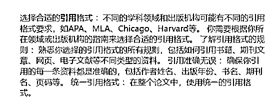

还要具备较强的时间管理能力。客户通常会有明确的交付期限，**准时交付**是对客户基本的尊重。在保证质量的前提下，我们需要合理安排时间，确保在规定的时间内完成任务。这不仅能够提升客户的满意度，也能够提升我们的工作效率和专业形象。这个问题也是我在写作领域遇见很多的，很多人完全没有时间观念，要不就是在快要完成的时候给客户敷衍了事，这种人以后也会是被淘汰的对象。下面是我一个排期表，建议大家也准备一个。

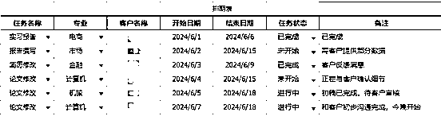

在面对复杂任务时，我们要对任务做分解和规划。一个复杂的项目通常由多个部分组成，我们需要对每一个部分进行详细的规划，明确每一个步骤的完成时间和质量标准。通过这种方式，我们可以有效地控制项目进度，确保最终交付的文稿符合客户的期望。

还有，要不断提升自己的专业能力。随着 AI 技术的发展，写作行业的竞争也越来越激烈。只有不断提升自己的专业能力，才能在激烈的竞争中脱颖而出。专业能力不仅包括写作技能，还包括对各类文稿格式的熟悉，对客户需求的准确把握，以及对 AI 技术的深刻理解和应用。 下面是我收藏的一些关于 AI 的学习视频还有如何调整格式的。

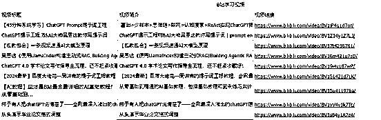

最后，我想说交付思维不仅是一种工作态度，更是一种职业素养。在写作行业，只有具备交付思维，我们才能为客户提供优质的服务，建立良好的职业信誉，从而在激烈的市场竞争中立于不败之地。

**5、手把手带你开启 AI 写作变现**

既然交付如此重要，那么我们在接到一单论文之后，要怎么开始呢？

这里我就以自己用 GPT 写计算机来举例子，从零到一给大家分享。

一篇完整的论文，除了学校封面是学生给的，其他的都需要我们来完成。

**1、确定目录**

在刚开始的时候，一定要问清楚，学生那边有没有确定的目录，如果有，我们直接拿过来用，如果没有，我们在通过小红书查找，来确定对应的目录框架。

一篇论文一般有 6 个部分组成，分别是：

**1、学校封面**

**2、摘要**

**3、目录（核心）**

**4、根据目录生成的内容**

**5、参考文献**

**6、致谢**

这个确定之后，再开始让 GPT 或者其他 AI 工具来生成，如果目录没有和学生达成统一共识，那么完稿之后的修改，工作量会很大。

**2、确定主题**

每篇论文都有自己的主题，就像每篇精华帖，都在围绕一个核心展开。

一般主题都是学生给的，就像是命题作文，我这次拿到的主题：**基于 Java 技术的教务管理系统设计与实现**

**3、内容调教**

在写论文的过程中，不要直接让 GPT 给你写论文。

它就像一个模仿能力超强的新手，你需要告诉它相关的素材，它才知道要生成什么样的论文。

所以，我们需要要把论文中相关的东西传给 GPT，计算机论文的就是核心代码，所以只需要把 Controller 层里面的代码复制在 txt 文件中，上传到 GPT 中，让让 AI 去分析整个系统干了什么，让他有一定的理解：

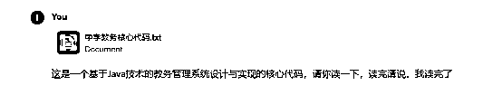

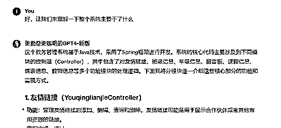 **4、框架搭建**

当整个 AI 分析完了之后，我们就要让 AI 开始搭框架了，（同时如果自己对所写的东西有一定的理解，可以自己检查一遍 AI 有没有分析错。一般是没有，但是也得注意一下）

在 GPT 上敲下这段命令：这是一段编写架构的命令，根据这条命令来生成一个框架，然后自己要看生成的框架是否否和学生给的，然后我们让 AI 一步步调整到适合学生论文的框架。

GPT 的生成

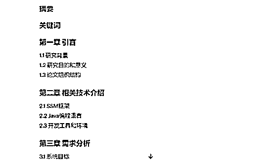

这一块大家要注意，可能生成的框架不同，尽量跟学生给的框架一致，生成的框架不同，可以让 GPT 去修改框架。

**5、内容编写**

确认好框架，就可以让 GPT 开始编写了，尽量一个模块中一个小标题开始写：让 GPT 开始写每一段的时候，让 GPT 列出要求，不然 GPT 有时容易忘。

如果说 AI 忘了的话，请给他说明一下：

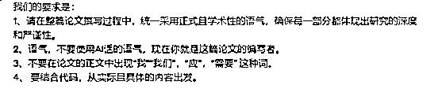

从摘要开始，摘要要记得生成关键词，我这块的命令应该再补充上：请先列出要求，之后开始生成摘要，摘要生成后，记得列关键词。

从摘要开始，下面就是每一章的编写：记得每一章节开始的时候，先让 AI 回忆之前的内容，然后列出架构，根据之前生成的大的架构，可以适当的调整。

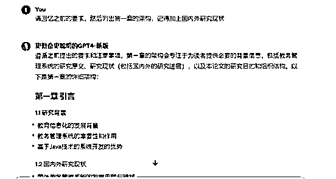

当 GPT 回答后，就是简单，请开始 1.1… 1.x 来写内容了，大家在这过程中一定要去自己识别 AI 生成的内容，有的不符合规范。（如果自己是在写一个新的领域，没有经验识别，那就先不用识别，让同学的老师帮咋们优化，就是后期修改会麻烦点，但是增加了一行的经验，以后会越写越熟练）：

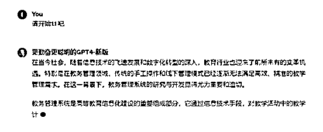

第一章写完了之后，我们开始第二章：

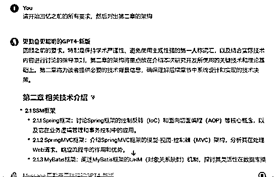

接下来就是 2.1 2.x 直到结束
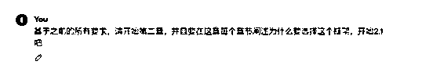开始第三章，和之前一模一样
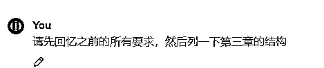
开始第四章节：第四章节，这块会设计到画图，同时有的学校要求表格使用三线表。这块得注意，画图我经常使用的软件是 processon ，它里面的 AI 功能用来画流程图和顺序图都不错。[`www.processon.com/`](https://www.processon.com/)

很多人常常不会画图，或者不知道怎么更快速的画图，这块我会再出一个流程讲解。

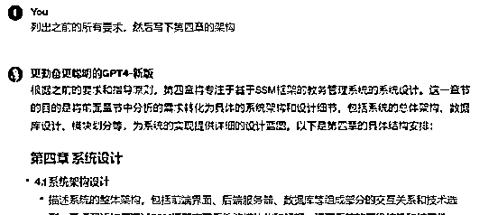

第五章的内容就是根据图生文字，这个根据系统截图，一般可以给学生要，把截图放到一个当前的论文中，上传论文，让 GPT 来生成功能介绍： 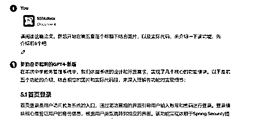 他有时会有代码介绍，这个视情况而定，有的学生要代码有点不要，不要的话就给 GPT 说只介绍功能即可 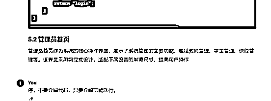 开始第六章，第六章的开始也是先回忆，然后再开始列架构，列完结构再开始 6.1 6.x 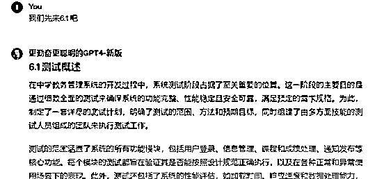

第六章有一个注意的点就是，要生成用例表格：

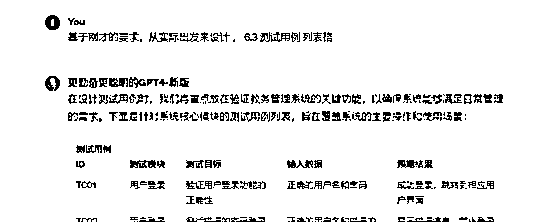

第六章写完写第七章：

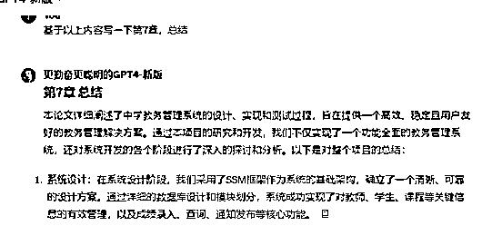

最后致谢：

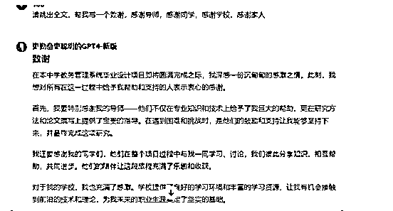

基本到这整篇论文正文就结束了。

剩下的加**参考文献**。

参考文献在知网里找：

网地址：[`www.cnki.net/`](https://www.cnki.net)

万方数据地址：[`www.wanfangdata.com.cn/`](https://www.wanfangdata.com.cn)

文献查找方法：大家直接复制论文题目去知网搜，如果搜不到，就开始简略

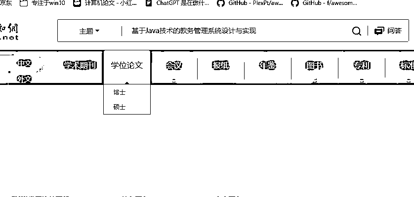

比如我就精简成这个，一下子就搜到了，下面的都可以借鉴

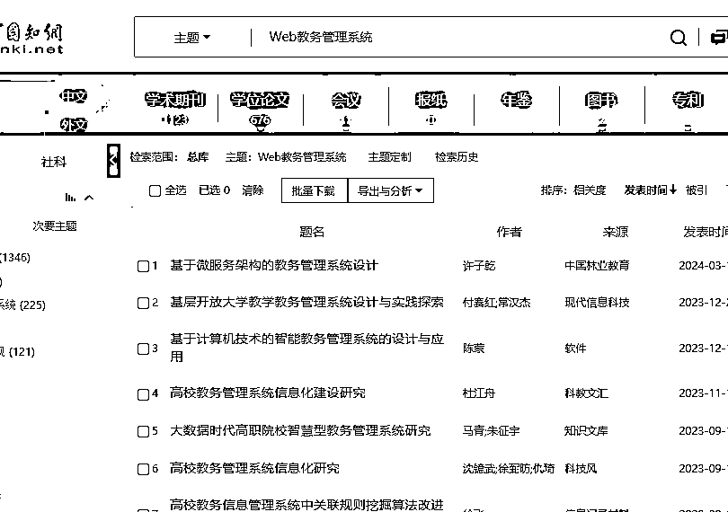

### **论文格式修改教程**

之后就是修改格式，根据学生反馈来进行修改。

这个大家直接看这个 B 站教程：[`www.bilibili.com/video/BV1s84y1A7z4/?spm_id_from=333.337.search-card.all.click`](https://www.bilibili.com/video/BV1s84y1A7z4?spm_id_from=333.337.search-card.all.click)

还有 Wps 一键排版，需要充会员，一键排版后，还需要手动调整，所以我建议大家直接学习下怎么手动调整。

大家也可以发现，在整篇论文的过程中我只有目录使用了结构化提示词，那是因为之前发现每个学校的要求都不同（包括目录），但是在我写了多篇以后，发现正文无不外乎，第一章引言，第二章相关技术介绍，第三章需求分析，第四章系统设计，第五章系统实现，第六章系统测试，第七章结论。

那么大部分学校都是按照整个流程来的，那么在下一篇文章，我会介绍如何用结构化提示词，快速完成一篇 60 分的计算机论文，其他就是根据老师的要求来微调了。

**6、查重&降重**

正文写完了，接下来就到论文的下一个步骤，就是查重和降重，查重平台我一般用的是 paperpass:[`www.paperpass.com/`](https://www.paperpass.com)   这个网站是免费，但是也有它的缺点，就是查的不准。还需要学生根据他们学校要求的平台再查一遍。

查重完就是降重了，每个查重平台的降重规则都是不一样的，通常，降重的方法可以分为以下几类：

1\. **同义词替换**：将文中的词语替换成同义词。例如，将“重要”改为“关键”，将“发展”改为“进展”等。

2\. **句子结构调整**：改变句子的语序或重组句子结构。例如，原句“提高生产效率非常重要”可以改为“非常重要的是提高生产效率”。

3\. **句式变换**：使用不同的句式表达同一个意思。例如，可以将陈述句改为被动句，将长句拆分为短句，或将短句合并为长句。

4\. **段落重写**：对一些高度重复的段落进行重写，用自己的语言重新表达内容，同时保持原意不变。

5\. **引用和标注**：对一些无法修改的内容，可以增加引用和标注，以示区别。例如，通过正确引用来源，避免整段文字被判定为抄袭。

6\. **增加原创内容**：在一些关键点上，增加自己对内容的理解和分析，以增加原创度。例如，添加个人的案例分析、观点阐述等。

7\. **图表和数据**：使用图表和数据来替代部分文字描述，有助于降低重复率。例如，将文字描述的数据转化为图表形式，并在图表说明中增加解释。

8\. **专业术语替换**：在不改变意思的前提下，替换一些专业术语。例如，将“客户满意度”改为“顾客满意度”，将“市场占有率”改为“市场份额”。

那么还是有一种更直接的方法，就是把论文种标红的删除掉，这种方法的前提是，要保证论文的连贯性和论文的字数要求。

给大家分享一下我降重使用的提示词：

**6、其他变现玩法**

AI 写作 变现的多种玩法，就先论文就可以衍生多种变现模式：论文写作，论文修改，论文降重/降 AI，答辩稿写作，答辩 PPT 写作。再往后就是简历写作，PPT 写作，文案写作，主持稿写作，书籍写作，剧本写作等等。AI 写作的变现模式很多。给大家分享一个我整理的写作时间线，写作有旺期和淡期，只要按照时间线来，能大概率跨域周期。

**7、新手小白经常遇的八大问题**

我整理了一下我身边刚入局的朋友们的一些问题，来给大家解答一下。

1、做这个前期需要准备什么？

前期准备的就是一台能使用办公软件的电脑和至少一台手机。电脑用来完成任务，手机用来做流量渠道。还有要对 AI 的使用要多了解一些。

2、前期可以去哪里接单？

小红书和闲鱼都可以，这两个接单平台都可以接到一手单。如果说自己不会做流量的，就可以去淘宝或者 Boss 直聘接一些二手单，这些单子适合练手，但是价格是黑奴价。

3、AI 能写所有么？

以我的经验来看，并不能，我经常会拒绝一些单子，在我前期的时候，我不懂机械，也不懂建筑行业等等，这些方向的论文我是不会接的。后期我也是遇到很多同行，再遇到这些单子，会把这些单子分出去，自己赚一些佣金。

4、AI 写作的天花板有多高？

如果只是做一名写手来看，一个月赚 4，5 w 可能就是一个天花板了，但是如果是做个工作室，比如你掌握了流量密码，那么你完全可以开个工作室，自己在网上招写手，给他们分成，这种一个月月入 10w 应该是没有问题的。

5、如果写的单子被客户嫌弃怎么办？

这种在还是新手阶段有大概率遇到，首先先问客户哪里不满意，就是不满意的点在哪里，然后自己根据客户提出的要求再做出具体修改。事后，一定要及时复盘，避免下次还有这种情况。

6、如果遇到客户跑单怎么办？

我暂时还没遇到过。但是怎么避免这种情况呢，就是我 99%的单子都是在微信促成的，只有 1%的单子是在咸鱼成交的，微信的单子就是先让客户交 30%~50%的定金，收到定金再开始做。之后做完给客户说做完了，让他付了尾款后再给他成品，或者先给他一个有水印的 PDF 文件稿。一般没有付定金的单子，我是不建议做的。

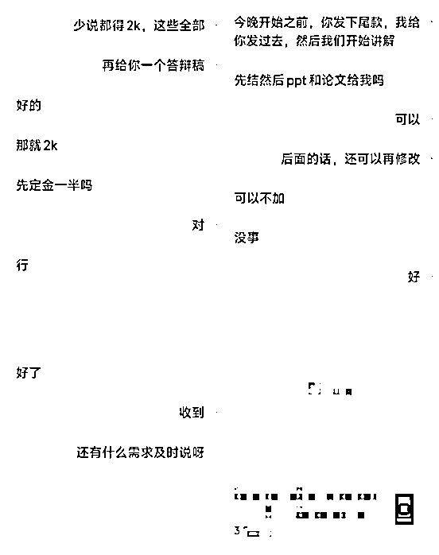

7、小红书截流回复率不高怎么办？

这个问题也是问的最多的一个问题。截留回复率不高的原因一般有两种。

一种是去人家分享论文模板下面去截流了，这部分客户可能人家只想要个模板，写作需求很少，可能你私聊了 50 条才有一两个人回你，这也是很正常的，属于没有找对鱼塘。

还有一种是有的帖子有的人评论的时间已经有了一个月了，这个时候你再去截流那么对方很可能已经找到了，所以这种回复率也不高。

那么怎么提高回复率呢，就是去搜关键词  xxx 专业论文，去这种帖子看评论时间最好在 3 天以内的，截流这种回复率会很高。

8、写作使用哪个 AI 工具好一点？

国内的我一般用 KIMI 和秘塔写作，国外的就是 ChatGPT4。关于使用哪个工具好一点，我觉得还是要结合你使用的场景，比如来了一篇，让你结合国内最新资讯来写一篇文稿，那么使用秘塔写作就比其他两个要好很多，这个还是要根据具体场景选择不同的工具，才能事半功倍。

如果有想要入局的朋友还有其他问题欢迎随时来问~

**小结**

AI 写作有着非常庞大的市场容量，哪怕是专做一个细分赛道，也是非常吃香。

这个项目在论文选择上，初期可以去接自己本专业的论文，这样自己熟悉，也更好上手，等跑完闭环，再去跨专业接单，会更好。

像我是程序员，前期就只做计算机这个专业的，形成了自己的流程后，速度就快了起来，我从刚开始一篇两天，到现在基本三四个小时就搞定了。要求低的可能 2 个小时就搞定了。

还有 PPT 和演讲稿，答辩稿之类的，这些也是不错的选择，高端 PPT 一页可以 50~200，答辩的 PPT 也可以做到 15 一页，高客单的就可以做论文之类，因为我文科和理科都写过，文科是完全 GPT 可以搞定，理科得有自己专业的知识基础。

**凭自身专业，用 AI 赋能，切流量赛道，就是这个项目最核心的秘密。**

感谢老师们给我的帮助，感谢@徐宿 老师在项目知识体系上的私训，让我对赚钱有了系统的认知；感谢@梨云 老师在小红书上的耐心点拨，让我对小红书有了更深的理解，感谢@亦仁 老师创造了这么棒的生财有术，让我在迷茫中找到了可以深耕下去的项目。

今天的 AI 写作分享就到这里，希望对大家都有所帮助。

* * *

评论区：

K 同学 : 厉害
小鹅 : 牛的
张大气 : 真好
浩然 : [呲牙]一起加油
浩然 : 感谢夸奖
黄增添 Tony : 厉害了！！请问 AI 写作有没有大众化的赛道？PPT 算吗？我的专业比较偏门
兰凯翔 : 就像文中所说，你刚开始对某些方面不了解，所以不去碰这方面，用我举例，可能我对 99%的都不是很了解，如果尝试用 gpt 硬写，会不会特别水
浩然 : 会的，但是给我的话，我还是会尝试下，因为客户的正反馈，会给我指导哪里需要改正，哪里是正确的需要保持。

我身边有一个大二学生，一开始也是啥也不懂，我让他先尝试的是从演讲稿写起，慢慢来就能看到结果，现在他也会写 PPT，和一些结课小论文了。

* * *