# 京东 CPS 赚佣，如何在小红书引流 2k 人，0 门槛带货 GMV 60w+

> 原文：[`www.yuque.com/for_lazy/zhoubao/gbfufgn9rlaayzmt`](https://www.yuque.com/for_lazy/zhoubao/gbfufgn9rlaayzmt)

## (41 赞)京东 CPS 赚佣，如何在小红书引流 2k 人，0 门槛带货 GMV 60w+

作者： 苏木

日期：2024-06-14

圈友们大家好，我是九哥，深耕小红书渠道 4 年。

每年的 618 都会产生非常多的商机，早在去年，在徐宿老师的建议下，618 和双 11，我去做了小红书团购项目，当时赚了小几千，今年决定跑京东 CPS 分佣，没想到变现取得了非常不错的成绩。

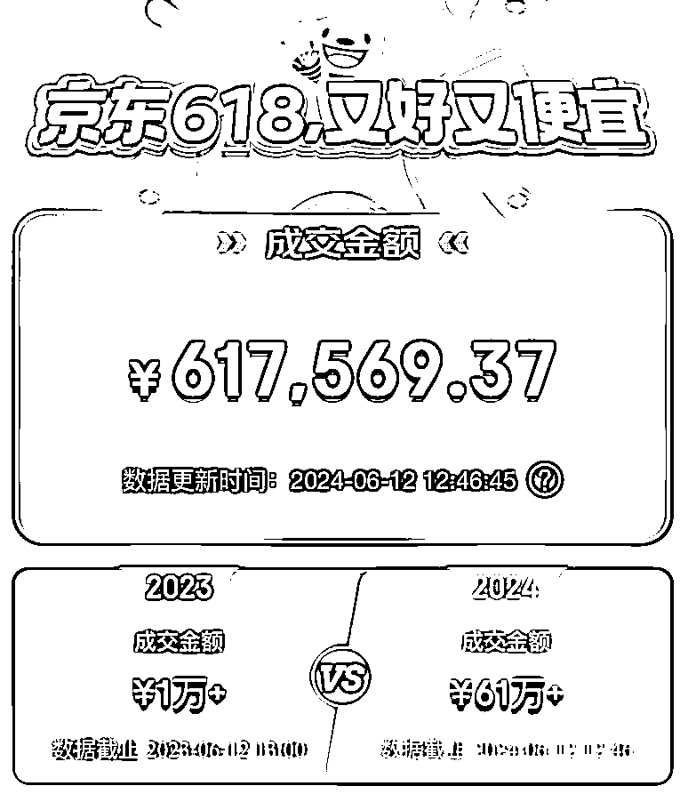

作为一个 0 门槛的项目，整个变现逻辑非常简单：从小红书引流到微信，把商品链接发给用户下单，然后赚取 CPS 佣金。

但是，里面也有非常多的细节，为了帮助新人小白更好的上手，我来分享自己做这个项目的全流程。

## 一、在购物里发现商机

现在购物，离不开 618 和双十一，但是，年年促销活动，越整越花里胡哨，于是，产生了一个巨大的痛点：

本想好好购个物，它非得让我算奥数。

一会优惠券，一会凑满减，很多人直接就绕晕了，哪里有需求，哪里就有供给，于是，在小红书上面就，就出现了很多购物攻略，教你买什么，怎么买。

这么耗费时间的攻略，而且还有不少人在做，无利不起早，在我的拆解之下，发现了这背后蕴藏的商业模式。

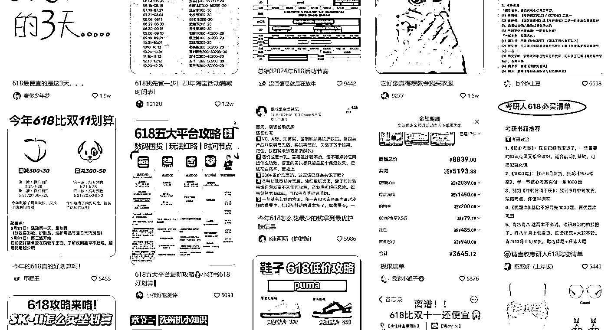

我跟到一个博主的群里，发现大家都在求链接，而博主，又把我们引流到微信群，发链接给我们买。

因为 22 年做过 CPS 项目，我立马知道，他靠链接的分佣来赚钱。

于是，我也开始如法炮制。

## 二、细分品类错位竞争

我分析了同行的笔记数据，发现平台攻略是爆款选题。

内容很简单，就是告诉大家，各大电商平台的促销什么开始，哪个节点更优惠，都是公开资料，相互复制粘贴。

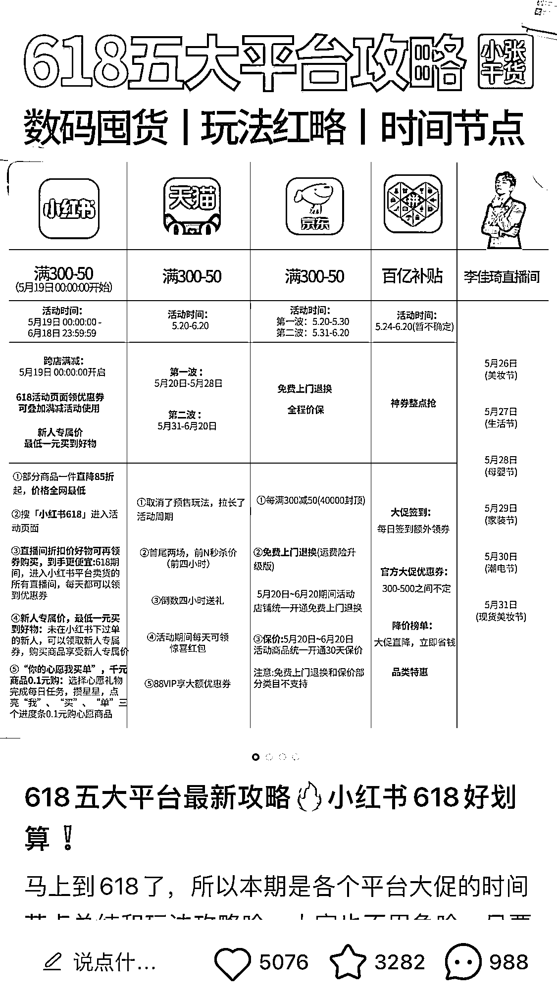

我就在想，这么泛的选题，流量很大，用户也比较泛，而且人家已经先入局了，这时候，如果我针对某个具体类目的促销，不仅对用户来说更有用，满足的需求更精准，而且我的竞争力也大大提高了。

于是，为了验证自己的想法，就写了一篇笔记，针对具体类目，具体产品，618 活动节点的大概价格。

结果，在数据差不多的情况下，笔记评价从蹲活动，变成了怎么买，说明我吸引了非常精准的用户。

流量吸引来之后，因为小红书平台不能直接发链接，所以必须把用户引流到微信，进行变现。

## 三、公域流量导流私域

引流的方法有很多，我就分享自己现在正在用的，保证有效。

之前我直接在自己爆款的笔记下面评论，让别人私信我，结果吸引了眼红的同行，把我的举报没了。

吸取教训，曲线救国，我现在笔记里加入群聊链接，把人往小红书群里面引。

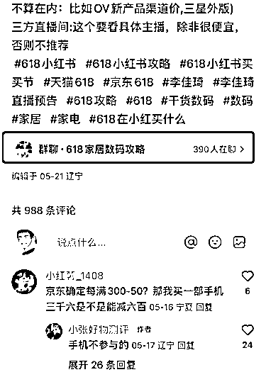

流量好的笔记在评论区也把群聊置顶，写上 618+具体类目+分享、跟买群，这个操作在小红书官方是没有任何问题的，所以也不怕举报。

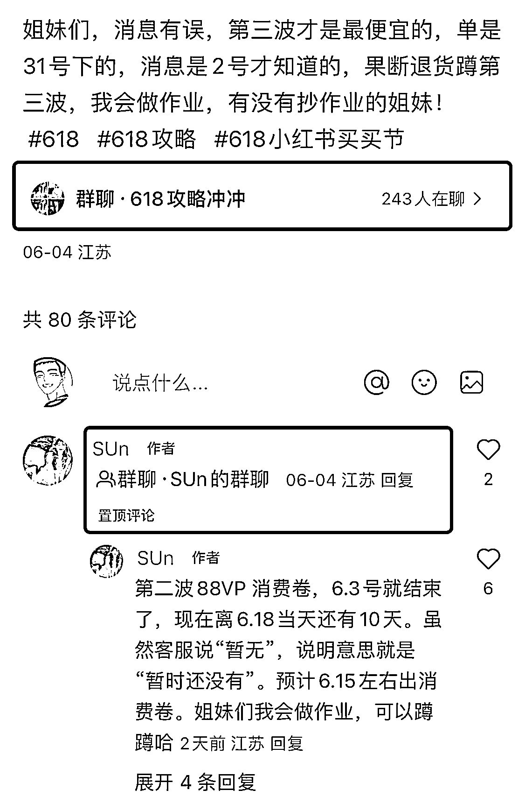

这样进来的粉丝都是对这类产品有兴趣的，想知道怎么买到这个价，因为小红书里不让发其他平台的链接，就有一个很好的理由让粉丝加你的微信。

群公告里留了怎么加到我微信的方式，接下来就等坐等粉丝加微信，加过来之后，微信继续拉群，群内分享商品链接。

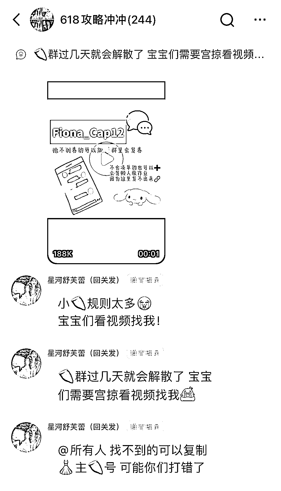

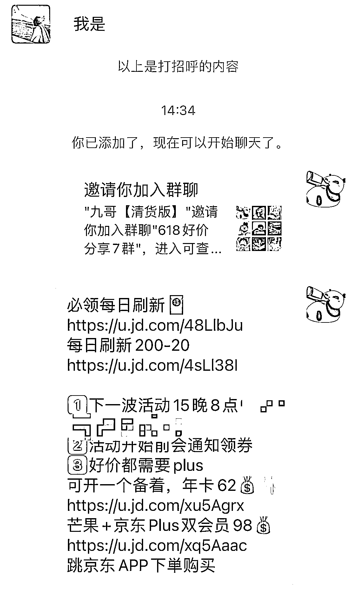

## 四、如何设置分佣链接

把小红书的人拉进微信群，复制商品链接去淘宝联盟或者京粉，用转链功能把链接转成你的链接发群里，粉丝通过你的链接下单，你就会有一定佣金，等订单完成，佣金就会打到你的账上。

分佣链接是变现的最后一个环节，很多人都不知道怎么设置，其实非常简单。

京东链接：

1、复制链接打开京粉。

2、一般都会自动识别链接，如果没有的话，点图 1 左上角的转链，手动把复制的链接粘贴到转链处点图 3 立即转链。

3、点立即转链。

4、点立即分享。

有个小技巧，京粉可以复制多个链接一次完成转链，比较方便。

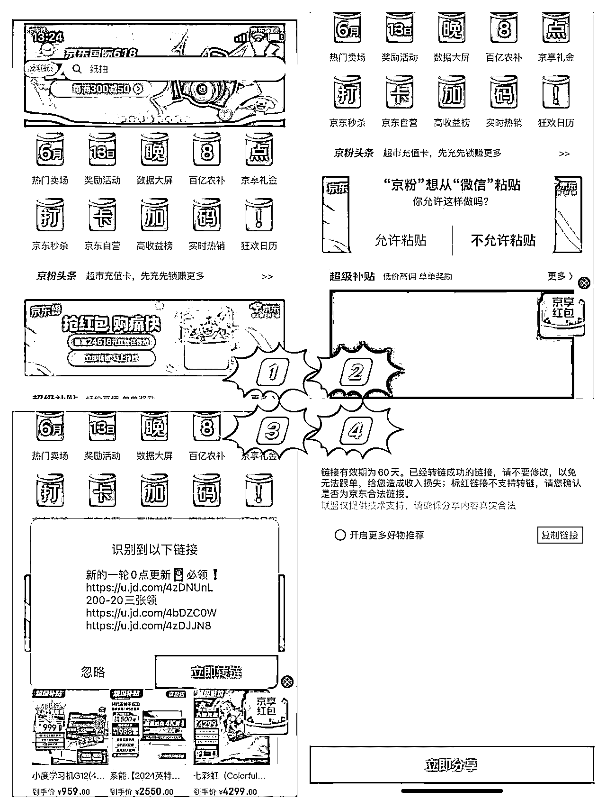

淘宝也差不多。

1、复制链接打开淘宝联盟，一般都会自动识别链接，点允许粘贴。

2、点赚分享链接。

3、选复制文案或者仅复制口令，分享到群里。

4、如果没有自动识别链接，点我的-图 4 链接转换，手动粘贴链接转换，重复 2、3 步骤。

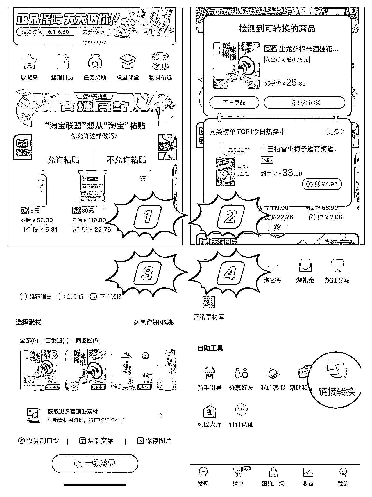

不知道类目商品怎么凑活动价怎么办？

其实不需要你懂，你只需要进几个分享同行的群，把别人的链接转成你的，转发你的群里就好了。

以上是第一波走通路径，接下来是微调放大。

## 五、跑完 MVP 迭代突破

我做这件事情，也不是一步到位，而是一边实战，一边根据数据反馈来优化的，先后经历了 3 次迭代突破。

①公域突破

小红书群，一开始只建了 2 个，虽然大促笔记选题自带流量，但进人速度特别慢。

就在这个时候，我刷到了之前关注的一个同行，有一篇笔记突然流量异常好，我点开一看，是一篇抽奖笔记。

白送的东西，谁不爱，大家都会非常积极，就带来了非常巨大的流量。

我就在想，能不能利用抽奖笔记，吸引流量导入群里，思而不做则亡，立马动手。

笔记发出去，小红书里的群聊一天不到就满了，最后拉满了 10 个 500 人的群，微信也加到手软。

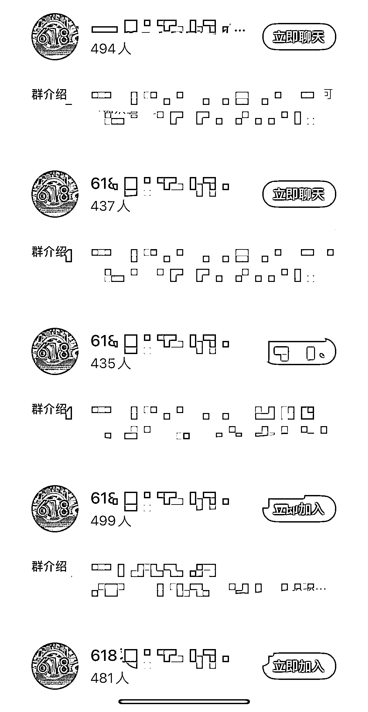

②私域突破

正在累并快乐的时候，群被举报，直接给我群禁言了。

因为引流信息放的不能太直白，总有些人不理解，要问你怎么加微信群，不能回答怎么办？

我用的第一个方法是转让群主给小号，小号能说话，但明显治标不治本，一天后，小号也禁言了。

后面经我测试，群内的新人欢迎语，这里审核是最宽松的，同时也是不会给其他用户留下举报证据的地方。每个新人进来都会自动发加到我微信的方法，其他人又看不到，也算是暂时解决了违规问题。

就这样，我 500 人的微信群，拉满了 6 个。

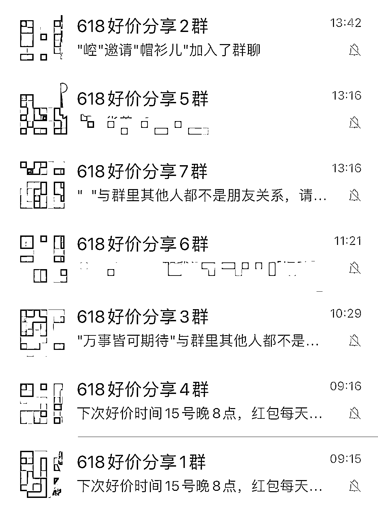

③变现突破

公域流量大，引流到私域的流失率低，自然变现量就上去了，最后做到了京东联盟 GMV 突破 60w 大关！

## 小结

总的来说，没事多看别人在干啥，看到数据异常的笔记多分析为什么，有没有可能复制，然后上手试，这一步很关键，不试光想没结果，试了通过数据反馈快递调整策略方法，主打一个快速迭代，毕竟，风口可不等人。

有兴趣的小伙伴可以快点去试，618 还够时间跑通一遍流程，为下一波双 11 做准备。

* * *

评论区：

无想 : 好有生意头脑
苏木 : 就爱瞎折腾
老师傅 : 好厉害[强]，执行力杠杠的，小小建议，如果在小红书那边想办法先发一波 红包密令，再导入私域，有可能佣金收入会增加一点点，毕竟从公域导私域的过程会流失用户
苏木 : 恩，感谢建议，密令有同步发，效果不好估算，就没提

* * *