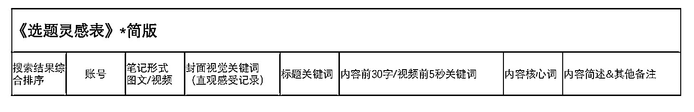

# 小红书不同搜索词解析

> 原文：[`www.yuque.com/for_lazy/zhoubao/pmulr1w8qggh46vs`](https://www.yuque.com/for_lazy/zhoubao/pmulr1w8qggh46vs)

## (22 赞)小红书不同搜索词解析

作者： 加麻

日期：2024-06-11

不同词性：品牌产品词、功效词、竞品词、行业类目词、人群/场景词

ps：一般老板通常会关注品牌词、核心产品/功效词，如果投放，是需要 24 小时精确匹配抢首位开，放预算在线的（单独设置计划，无预算限制，抢首位系数高）

以雅诗兰黛品牌为例

品牌产品词：例如雅诗兰黛 DW 粉底液核心词：DW 粉底、Doublewear 粉底液、甚至粉底液

功效词：控油、补水、美白、修复、祛皱等

类目词：粉底液、水乳，精华，面膜等

竞品词：竞品品牌词

场景词：熬夜、加班、秋冬、春夏、节日词等

人群词：上班族、熬夜党、学生党、30 岁等

一、品牌产品词

用户在小红书搜索“品牌/产品词”时，大概率是不了解品牌的，希望来小红书搜索并了解品牌的核心卖点、用户口碑、综合实力，要把握住这个最精准新客户人群，把品牌最想要传达的信息，以用户最容易吸收的方式

品牌关键词的笔记需要在标题、首图等醒目位置出现品牌名、产品名、带有 LOGO 的产品图片等，可以考虑为品牌的产品集合类笔记、促销宣传类笔记，吸引转化潜力较强的客户

二、功效词

功效词通常也是转化率最高的词，小红书内容营销的核心是能给搜索该词的用户带来什么信息、价值。功效词应该在笔记创作之前，就规划好预埋在笔记内，并根据规划，靠“短语匹配”来做补充，根据效果做长尾词优化

笔记需围绕产品的具体功效来进行创作，需要在标题、首图、笔记内容中出现对该产品特定功效的介绍，如：展示使用前后对比情况（如彩妆、穿搭等所见即所得的品类可以用此方式），介绍产品成分功效等。便于吸引用户在搜索相关功效词时点入查看，提高转化率

三、行业/类目词

用户在小红书搜索“行业/类目词”时，90%她已有了模糊的需求，希望来小红书搜索并了解这个类目/需求点下，当前流行什么、大家推荐什么、什么是新鲜有意思的。要用“高赞笔记”去截获目标客户，而不是强怼粗糙的商品卖点。（如果你看到自己赛道核心词搜索结果的第 1、2、3 位上还不是高热度笔记时，恭喜你，获得了一条坦荡荡的美好赛道，请务必果断拿下）

需要在笔记的标题或者首图复现该词，例如：用户在搜索了粉底液这个词之后看到上面三个笔记会有很大概率点入查看

四、竞品词（多用于投放策略）

截流词！根据不同产品线/卖点/功效，选择不同的竞品设置：譬如 A 品牌在粉底液上竞争对手是 B，则在购买“B”品牌词时，应选用高热度的粉底液笔记；

竞品品牌的关键词的笔记应注意，不要在标题或者首图等明显位置出现本品牌的品牌名称，可以重点突出产品的功能以及效果，在笔记末尾部分再安利产品及品牌，否则会出现关键词转化率较低的情况

五、人群/场景词

在小红书做营销，必须懂得“场景化营销”的概念，即思考什么人、在什么场景下会使用我家的产品。

公式=什么人+在什么场景下+获得什么效果

可以结合近期的天气、目标人群规律（例如：熬夜、加班、学生党等），节日等进行笔记创作，首图以及标题需要将该场景词“突出表现”，吸引近期有相关需求的潜在购买客户进行查看

加餐一：

笔记内容生产：从产品/品牌自身特性出发，结合热搜词，确认【核心词】，挖掘相关搜索词下的热门笔记共性

1\. 在 app 发现页搜索核心词，（例如“特性词”+“品类词”，“人群词”+“功效词”等），如日系摄影照、婚期化妆等。

2\. 按时间从近到远排序，选其中赞藏高的笔记（因为好的内容也有时效性，一般选择近 2 个月的内容作为参考）。

3.记录《选题灵感表》中的关键信息，记录优质笔记的用户喜好共性，总结规律

加餐二：**一篇好笔记的基本功**

✓ **笔记的内容建议专注一个卖点**

这也是为什么每篇笔记只能选择一个话题的缘故。什么都抓，可能什么都抓不住。不建议乱蹭各种关键词，什么都写一点，其实对笔记曝光非常不利。不建议乱堆关键词，用户直观感受很不好。

✓ **笔记的首图/封面和标题，非常重要**

首图和标题是影响点击率的种要因素，好的笔记首图/封面和标题会让你的笔记更容易吸引用户的注意力，更利于提升笔记的点击率，从而获得更多的流量。（在投放上一个创意曝光 3000，消耗 500 以上，点击率才置信。因此先积累数据，积累到至少 3000-5000 曝光后，判断点击率，点击率低于 benchmark，则优化封面和标题）

✓ **不要只做“标题党”**

笔记的分发，除点击率外，还会看互动和关注等。文不对题也不会有好的曝光，就算点击率很高，没有互动或者用户觉得不是他想看的，后续也会影响笔记的流量分发。

✓ **严禁刷量作弊**

任何刷数据，包含【互赞群】这类的行为，会被抓出来记为数据作弊。数据作弊对账号有累积惩罚，且惩罚不可逆（救不了）。

* * *

评论区：

暂无评论

* * *