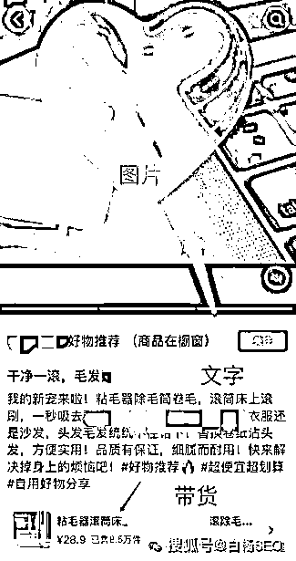

# 白杨 SEO：除了抖音图文带货，抖音图文 SEO 搜索流量方法也可以看看~

> 原文：[`www.yuque.com/for_lazy/zhoubao/alikxmbi8iodsyah`](https://www.yuque.com/for_lazy/zhoubao/alikxmbi8iodsyah)

## (16 赞)白杨 SEO：除了抖音图文带货，抖音图文 SEO 搜索流量方法也可以看看~

作者： 白杨 SEO

日期：2024-06-14

前言：为什么想到写这个？以前有个朋友跟我提过这个抖音图文搜索，所以来写写。分享大家，希望对于做抖音搜索流量的有用，尤其做 B2B 垂直行业，欢迎收藏或分享需要的朋友。

文章大纲：

1、抖音图文是什么？常见的图文带货是什么？

2、抖音图文 SEO 是什么？靠谱吗？

3、抖音图文 SEO 精准流量怎么做？【重点】

4、为什么一定要 B2B 垂直细分行业更好？

**抖音图文是什么？常见的图文带货是什么？**

抖音图文是什么？再白话不过，就是在抖音里面发图文。啥，图文你也不懂？就是图片+文字，哈哈哈。

至于你是放一张图文还是几张随意，你是把图文上加上文字，还是在图片发布下面描述写上文字都是可以的。抖音是一个 2016 年 9 月出来的短视频平台，2021 年 10 月开始内测可发图文内容，也就是这个抖音图文出来 3 年多了。

据说抖音图文出来是对标有生活种草第一平台的小红书图文，不管是不是，反正抖音图文是抖音除了发视频以外可以发图片满足用户需求。

抖音图文带货是什么？

所谓抖音图文带货是指在抖音这个平台上，通过发布图文内容来进行商品推广和销售赚取佣金的一种营销方式哈。长啥样？如图：

啥，抖音图文有多火？可以这么说，现在真成了做自媒体赚钱“一门技能”了。至于赚钱不赚钱我不知道哈

白杨 SEO 个人建议，仅供参考，抖音图文真想做，可以去试试，看你自己。以前大家用来发图片记录生活美好，后面就有人用来带货卖东西，当然也有人用这个来做排名做精准搜索流量，就看你怎么用？

**抖音图文 SEO 是什么？靠谱吗？**

抖音图文 SEO 是什么？不知道很正常。毕竟白杨 SEO 没有把这个抖音图文与 SEO 放在一起的时候，目前可能没什么人这么放过，哈哈哈。

那白杨 SEO 简单说下这个指什么哈，抖音图文大家知道了，在抖音发布图文。SEO，原意是指搜索引擎优化排名。抖音图文 SEO 就可以理解在抖音图文搜索优化排名。再白话一点，就是在抖音里用发布图文来做关键词搜索排名哈。长啥样，如图。

看上图，你是不是认为只能在抖音图文发布描述里有这个关键词才有收录和排名？不一定，图文上包含关键词也可以。下面具体怎么做会详细举例说明。

你可能会问，抖音图文 SEO 靠谱吗？靠谱不靠谱不是白杨 SEO 说的，而是你自己去实战做的。而且抖音图文 SEO 并不适合任何行业，只适合特定的 B2B 垂直细分行业，为啥，下面也会讲到，继续往下看哈。

**抖音图文 SEO 精准流量怎么做？【重点】**

抖音图文 SEO 精准流量怎么做？具体参考以下几点：

1、用 SEO 方法找准合适的关键词

如何挖掘出关键词？我们首先要有母词（也就是产品或服务的业务词）。比如你是做电路板生产的，那么电路板，PCB，就是你的母词。比如白杨 SEO 做全网 SEO 精准流量的，SEO 也是我的这个母词，当然精准流量也算，哈哈哈。

找到母词后，你应该挖掘母词下面与你业务相关的流量词。这个可以用 SEO 站长工具 5118，或者爱站。我以爱站工具举例截图。

你可以觉得这个工具数据流量指数不准，或者没法参考，你可以用巨量指数看抖音搜索指数，如图。

找到这些流量词后，就去找用户搜索需求的精准关键词，这个你直接在抖音搜索然后看下拉中与你业务相关的关键词收集过来即可。

而且，你也可以用这个流量词电路板打样提前了解一下同行的内容以及用户喜欢什么样的，等你做可以参考。

2、关键词 SEO 布局

关键词 SEO 布局，简单理解就是把你要做排名的关键词布局在你要发布的抖音图文里。我们前面说过，除了布局在发布抖音图文的描述里，比如在抖音图文的图片、描述里的标签上都可以加，如图。

注意：布局关键词千万千万不要像以前做百度 SEO 一样，使劲的堆积关键词增加关键词密度。只要上面提到的图片、描述或标签任一地方出现一次即可，而且一定要自然。

3、图文素材要求与背景音乐

图片一定要原创，高清，这是基础要求。原创好解决，自己产品或服务自己拍即可，高清，一定要好一点手机或者专业相机。

抖音图片尺寸为横版是 1080*608px，竖版是 1080*1920px，一般用竖的多哈。除了图片上要展示产品，功能，属性以外，这个作品的背景音乐也非常重要。因为我们要抖音完播率，所以音乐一定要选适合并且热门的哈。

4、用好抖音标签

抖音标签是什么？就是在发布抖音图文的时候可以用#添加。每个作品可以添加 5 个关键词。我在之前公众号写抖音 SEO 视频时也写过。

这个标签一是可以让抖音对这个标签推荐，二是也是最重要的就是当关键词布局用。关键词标签建议一定要与自己的发布作品相关，同时关键词标签可以由流量从小到大，或者从大到小放都可以，我举个例你就明白了。

比如我发布了一则抖音 SEO 怎么做的图文，标签可以是#抖音#抖音排名#抖音 SEO#抖音 SEO 优化#抖音 SEO 怎么做，当然也可以用抖音关键词排名，抖音搜索优化之类。

5、利用好抖音合集功能

如果想要发布的抖音的图文作品排名高，那么就要在发布的时候把图文作品放在某个合集里。因为在抖音 SEO 里，这个合集对于作品的排名占比权重比单一作品更高。

你可以在抖音 PC 后台自己创建哈，后续在手机或者电脑后台发布作品，选择这个合集即可。

6、添加互动元素，引导用户评论

你在发布图文内容时可以添加一些互动元素，比如提问、投票等等，这样可以鼓励用户留言、评论和分享。它不仅可以增加用户的参与度，还可以提高这个内容在抖音关键词的搜索排名。

当然，抖音 SEO 里面的用户行为很重要，以前是搜索点击，有人靠做数据。现在是做真实的点赞，收藏，评论，尤其这个评论很重要。

可能你会好奇，怎么样有这样的真实数据？你肯定听过以前的“五毛 dang”“水军”之类的词，肯定也听过多账号的事。虽然白杨 SEO 不做这个事，但我想说的事，只要有排名，就有人去研究，甚至有人去利用。

好听叫合理利用规则，难听就叫钻漏洞赚钱，哈哈哈。

7、注意排版和模板，可以考虑批量矩阵结合

要想抖音图文 SEO 做得好，光是布局关键词，光是做一些数据，肯定不行的。

最重要的是两个点，一是发布抖音图文的图片上的文字排版一定要美观，简洁明了，甚至可以做成模板，你去看小红书图文那个搜索热门笔记模板你就懂我说的了。

二是要以考虑批量矩阵结合的方式。因为在我们做 SEO 精准流量这个行业里，一直就有两派，质量派与数量派。数量派的观点是，管它三七二十一，要想搞更多流量，在数量面前都是弟弟，哈哈哈。

白杨 SEO 虽然一直是质量派，但是很多企业，尤其传统企业，虽然做产品做服务厉害，但做自媒体，做图文肯定没有别人专门做互联网的人做得好，所以也没办法，也要用数量对抗质量，做搜索多的作品来占位。

所以，至于你想选择哪样，看你自己。不过长远来看，不管抖音还是其它平台，都会打击这类做法，毕竟平台不怕你来搞流量，就怕你来这个平台完全制造垃圾影响它的用户体验，哈哈哈。

**为什么一定要 B2B 垂直细分行业更好？**

上面写完了在抖音上用图文 SEO 方式来搞精准流量，你可能会问这些流量有什么用？能引私域还是做营销？因为你这个分享的不是带货。同时，为什么一定要加 B2B 垂直细分行业？先回答上抖音 SEO 精准流量有什么用？

如果你是 B2B 业务，肯定有很长流程，需要先咨询，所以，你可以在内容或图片留电话，获得潜在意向咨询。甚至主页或者私信可留你的联系方式。你不要说，抖音都不允许之类，如果你是企业，你做了抖音企业蓝 V 认证本来就是可以留地址，联系方式的。

如果你是个人方式，号多准备几个，你是做搜索流量的，你怕啥？如果这怕那怕，你根本就不适合做营销！

为什么一定要加 B2B 垂直细分行业？因为像 2C 领域，前 10 排名大多数都被视频占据了。因为 2C 业务大家熟知，竞争也大，而且视频比图文更直接，当然视频更好。

而 B2B 行业呢，因为现在很多流量从百度转到抖音，所以 B2B 业务也不再只是百度这个以搜索为主的平台。

B2B 行业的垂直细分领域为什么好做抖音图文 SEO？其实抖音视频 SEO 也好做。因为这个行业的内容在抖音生态本来就不多，别说抖音视频能力了，很多图文能力都做不好，明白了？

因为很多传统厂家在抖音搞流量基本不太懂，听到最多也是在抖音投广告，真正下场的不多。一些第三方抖音 SEO 业务的公司对传统行业也不懂，这就是传统行业做抖音 SEO 的商机。

不要再说什么抖音图文没什么机会了，是现在抖音图文在抖音视频面前算弟弟，毕竟抖音是短视频平台，不是图文平台。但是比如白杨 SEO 讲到的这个特殊的行业就是这样，你随便搜搜就知道了。

当然，如果你感兴趣想做，你一定也要注意：什么保证让你做到排名第一，什么 XXX 系统之类。你要关注的是这个关键词排名对你有没有用，这个词是不是你潜在用户需求，什么提前预充几千几万，什么系统几千几万不要冲动付费。

如果你实在判断不了，可以找白杨 SEO 问问哈，恰好我有朋友在做这个。如果你觉得白杨 SEO 写的这个分享内容对你有帮助，可以继续关注我，也可以把它转分享给需要的朋友，谢谢。

**作者介绍：**

白杨 SEO，专注 SEO 十年，全网 SEO 流量实战派，对互联网精准流量有深入研究。全网同名：白杨 SEO。

* * *

评论区：

暂无评论

* * *