# 那些没有在抖音大卖的实体品牌，有一个最基本的动作都没做

> 原文：[`www.yuque.com/for_lazy/zhoubao/me7mwbanbku2ws6o`](https://www.yuque.com/for_lazy/zhoubao/me7mwbanbku2ws6o)

## (17 赞)那些没有在抖音大卖的实体品牌，有一个最基本的动作都没做

作者： 楚川

日期：2024-06-14

**大家好，我是楚川，一名 5000 多实体商家服务经验的实战派。**今天跟大家讲讲今年很多人没做好的一个事情。

2024 年的抖音本地生活依旧很猛，新领导上台，整顿大类目风气，重抓服务品质，内部大变动后，商家良性管理体系初成，本地推逐渐展露头角，全面赋能商家。

抖音用了 3 年时间像所有的短视频平台证明，实体生意值得用短视频重构一遍生意形态，那些美团无法渗透的类目，走向的版图，抖音用短视频实现兴哥的梦想。现在抖音平台生态已成，接下来 3000 亿的体量将迎来万亿的跨越，生活服务体量直逼美团，抖音身体力行证明自己依旧是无所不能的公司。

#### **一、抖音给传统行业的获客带来了新出路**

##### **1、新机会的到来**

进入 2024 年，楚川团队一直欢呼雀跃，抖音生活服务市场开放的类目越来越多，数不清的宝藏类目（律所、服装、白酒连锁店、手机维修、家电连锁、家装建材等），肉眼可判断的就是：实力雄厚和新锐力量都会在这个大流量池里疯狂增长。功夫肩颈这种现象级的云连锁品牌在太多人的脑海里留下深刻印象，所以适合云连锁的传统行业依旧有机会杀到一个难以想象的高度，这里面就是新锐力量改变行业格局的机会，这也会是不同行业在抖音产生大战的契机，好戏会在几年间上演。

##### 2、实体品牌拿不到结果的硬伤

但疯狂的背后，我们也发现不少实体品牌无法卖爆的硬伤。我们沟通不少连锁品牌发现一个通病：不少实体品牌在抖音从 0 到 1 的过程，营销基础建设太差，导致初期爆破节奏变慢或者是一波流量起来卖货就迅速衰减，怎么样做都拉不起来。

同时我们亲自上手的客户，也会在初期沟通的时候发现这种问题存在，导致我们需要重新帮客户做 POI 搭建和装修、抖音 SEO 部署、企业职人矩阵体系搭建、组品调整和优化、经营分提升，这也严重拖慢我们的营销节奏，以及降低服务利润，但品牌又会认识不到这个重要性。

当然我们也听说不少同行的反馈，那就是不管三七二十一，品牌入驻抖音就是直接粗暴上线，门店的 sku 直接照搬到抖音，然后直接达人探店+品牌大场直接疯狂轰炸。这种感觉就像是斗地主的时候，地主直接开局王炸、四个二开场，到最后没牌可打导致后期宣发一次比一次差，因为一开始就没考虑到门店承接流程、组品线上化、真正的投产比，导致三率问题、低 ROI 一次性打击整个品牌的信心和投入决心，拿不到持续的结果就是一件必然的事情。

#### 二**、抖音给传统行业的获客带来了新出路**

怎么理解抖音生活服务营销基础建设？此项服务当下在抖音本地生活没有第二家公司在提，是一个综合能力要求高的服务项，帮助企业做好了这项，企业自运营是可以事半功倍。

所有实体老板可以理解为：在抖音开店，跟实体店一样，也需要选品、装修、做招牌、发传单、开业等，同样的事情在抖音也需要做一遍，才有可能让后期的营销速度越跑越快，不然就是流量起来，门店流量和基础直接崩盘。怎么理解抖音营销基建，其实就是 4 个方面。

第一，**抖音 POI 连锁化经营：POI 上架、名称优化、连锁化经营**

1.  目的：这是在抖音开店、开团购的第一步，实际上也是一个品牌的辨识度提升、流量圈扩张、流量筛选的过程

2.  功能和价值：把 POI 名称做好定位【如天鹅到家-家政保洁-家电清洗，相当于做了两层业务标签定位，让这成为抖音店招，流量提前做出筛选，对于精准性、核销率都是有提升左右】，让业务流量更加精准，并且做到云连锁化经营，多 POI 流量实现共振

3.  行业痛点：POI 的搭建现阶段大部分供应商只能做到简单的上架或者是擦边入驻，无法融入运营细节，会导致后期运营有难题；我们团队作为技术源头方之一，此类现象见到比较多。

4.  运营流程和案例拆解

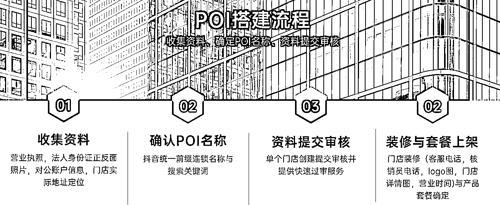

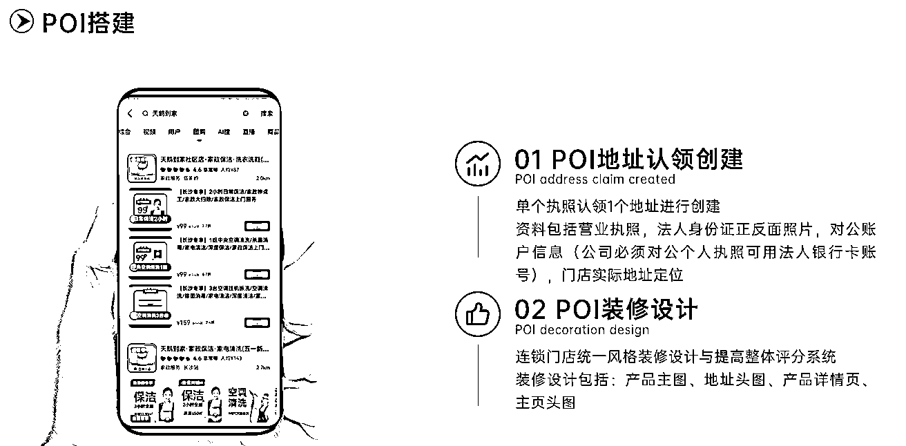

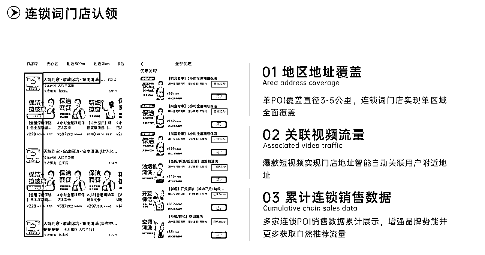

第二，**抖音生活服务团购页面装修：组品策略、产品上架、SKU 装修**

1.  共识点：POI 完成入驻的动作后，实际上就是做门店内部装修，要确定在抖音做生意卖什么，如何适应平台的特点定品，或者做对应的优化，一定不是简单入驻。把生意搬到抖音平台，而不是平移照搬，这是老板和运营们注意到的问题。其次是上架产品的时候，所有产品详情页，SKU 组图设计一定要严肃对待，而不是简单的去处理，做出很多违背品牌 VI 和调性的事情，否则极有可能掉粉或者吸引到非品牌用户。

1.  功能和价值：选品和组品定对大方向提高流量爆发几率 50%（选品和组品策略大家可以参考往期文章，有爆品设计思路）；SKU 的图片设计和名词定义能够降低消费决策时间，提高转化率；好的页面装修，能够获得抖音流量推荐 20-30%

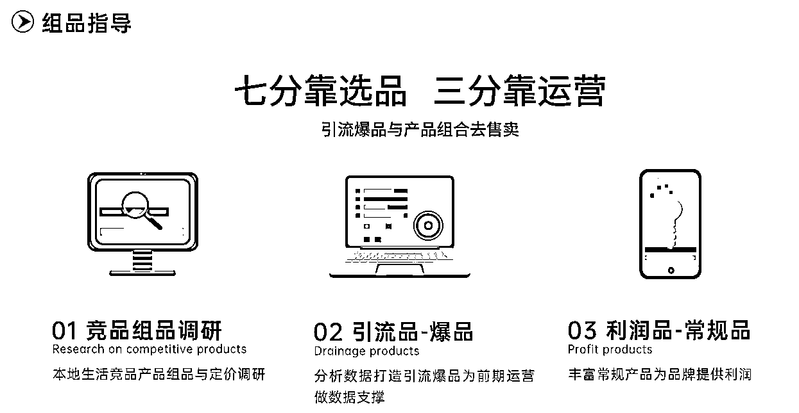

1.  案例展示：选择一个家装客户的诊断分析，大家就能一目了然

2.  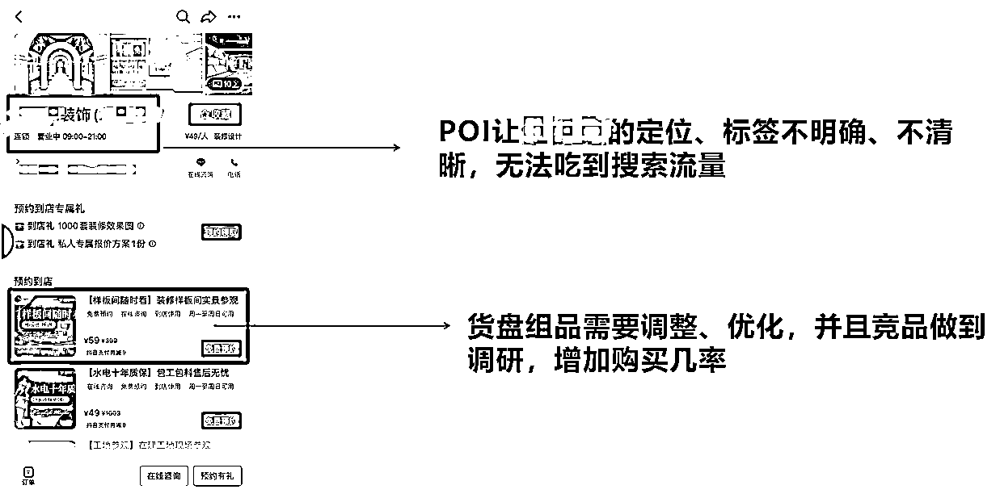

3.  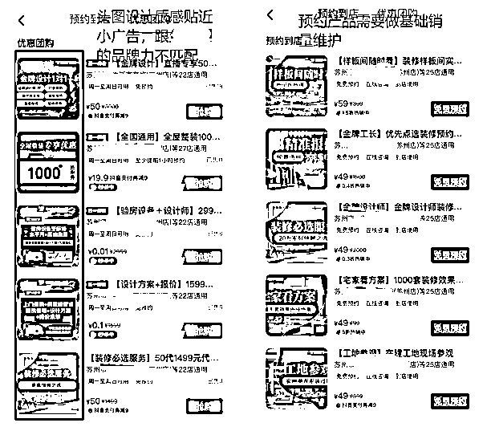

第三，**抖音搜索（SEO）流量的部署：关键词的选择和优化、行业渗透率和占有率的提升、用户自发搜索弹出靠前**

1.  目的：现在抖音 SEO 流量可以进入短视频、直播和 POI 门店页面，几个路径的成交最高可以占品牌成交的 70%以上，这大部分人目前没有看到的机会，品牌无论是咨询还是直接成交都是一个躺赚的通道。

1.  功能和价值：抖音搜索流量目前已经超过百度，在搜索成交的环节一直是抖音的流量洼地，这属于躺赚的阶段；实体品牌的不少服务为非即时性需求，用户会在需求的阶段进行搜索，如果排名较前，那成交的概率高于其他品牌，目前实体品牌搜索成交占比 20%以上，这是不可忽视的市场。

1.  运营拆解：关键因素为 POI 连锁词、视频内容关键词【声音、画面、文案】、用户搜索关键词占位，这是楚川过去 2 年实战得出的几个权重因子容易出现的地方。但是想跟大家说 2023 年有了解到抖音 SEO 的机制和算法更新了 10 万次以上，那就意味着所有人的方法论都是不稳，只能是摸石头过河。另外就是一个细节，抖音 SEO 是慢工出细活，30 天以上才能有一个流量漏斗和答案，一定要有耐心，不然就别谈躺赚。

1.  行业案例：穿云是最早提出抖音本地生活搜索流量的打法，过去操盘的案例中，拿到了单月从 0 到 2500 万的业绩增长，分别有夏令营、家政和租房等。

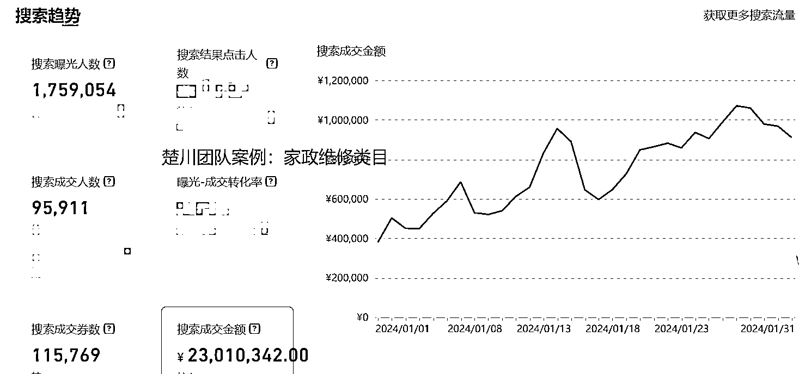

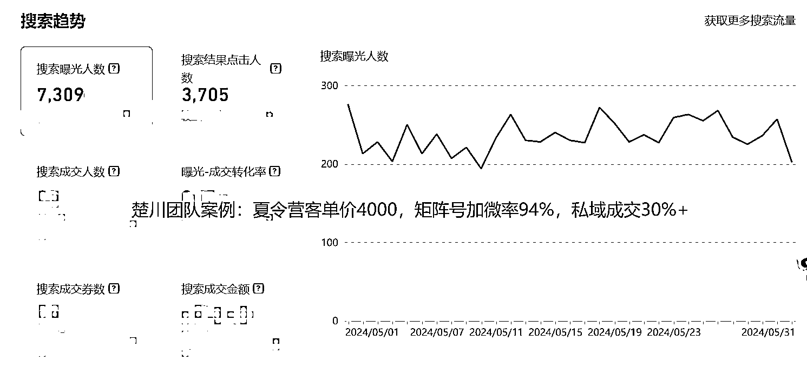

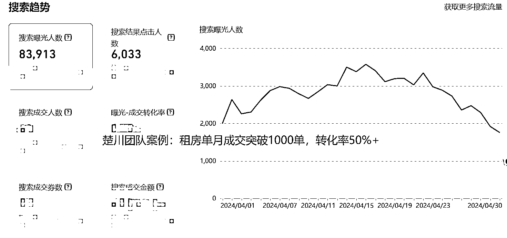

第四，**实体品牌批量化剪辑能力建设-职人矩阵体系搭建：新媒体团队剪辑能力的培养、公司职人矩阵发布能力的建设**

1.  目的：在抖音发传单不丢人，没流量才痛苦。职人视频是抖音本地生活未来 2-3 年必做的工程，这是企业在平台宣发的营销壁垒，这种集合型发布需要自上而下一条心做到落地。

1.  功能和价值：我们时刻需要反思当达人流量无法持续，当预算收紧的时候，用什么去降低达人视频缺失带来的流量低谷，用什么降本增效，其实答案就是职人矩阵。未来一定要将职人视频做到日常工作，保证每日更新 3 条以上，做到厚积薄发，我们用职人的打法已经拿到了大量的结果。毕竟顶天立地，不如铺天盖地。

1.  运营工作流程

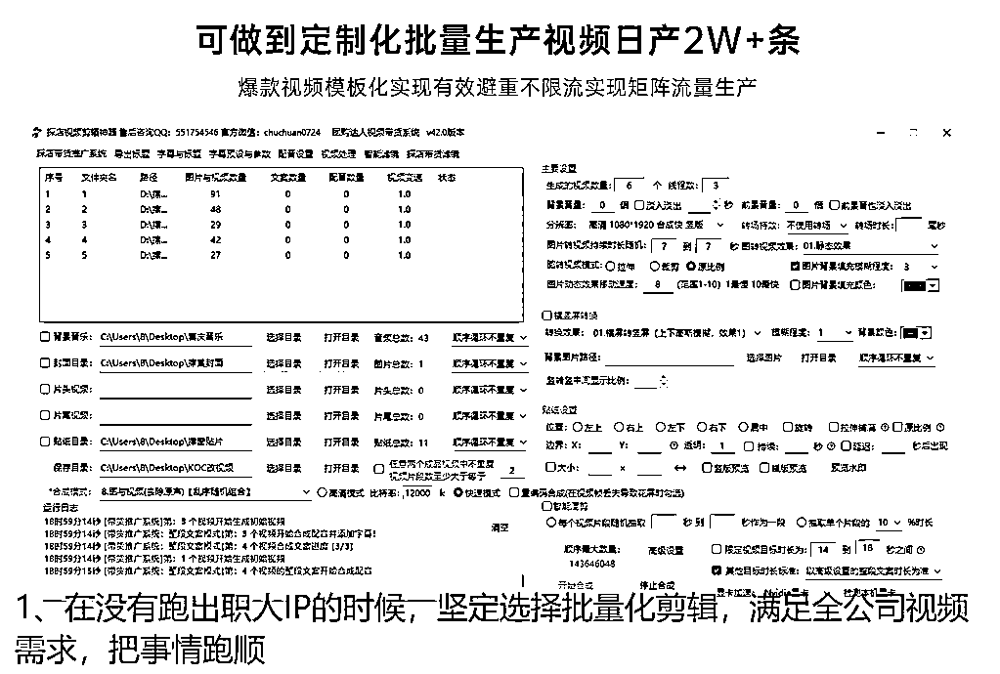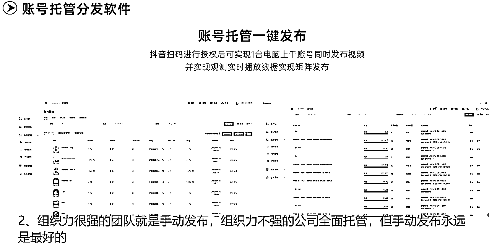

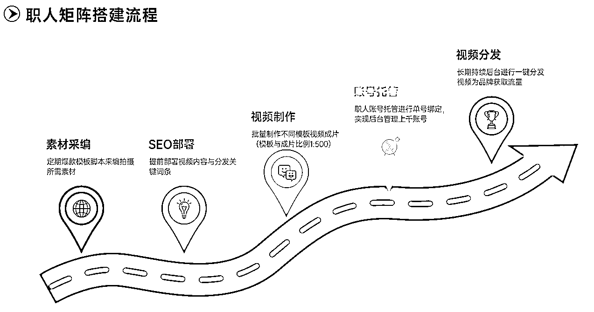

**以上就是楚川理解的本地生活基建服务，要想持续拿结果的实体品牌一定要做，希望所有的品牌都能拿到满意的结果。**

* * *

评论区：

暂无评论

* * *