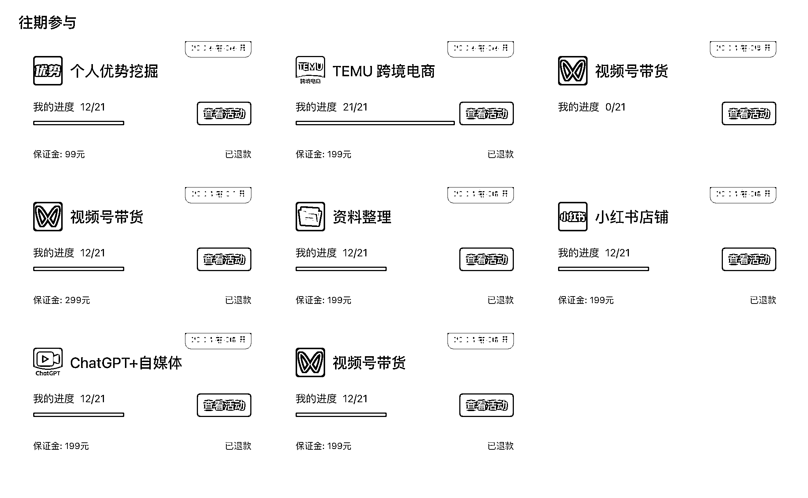
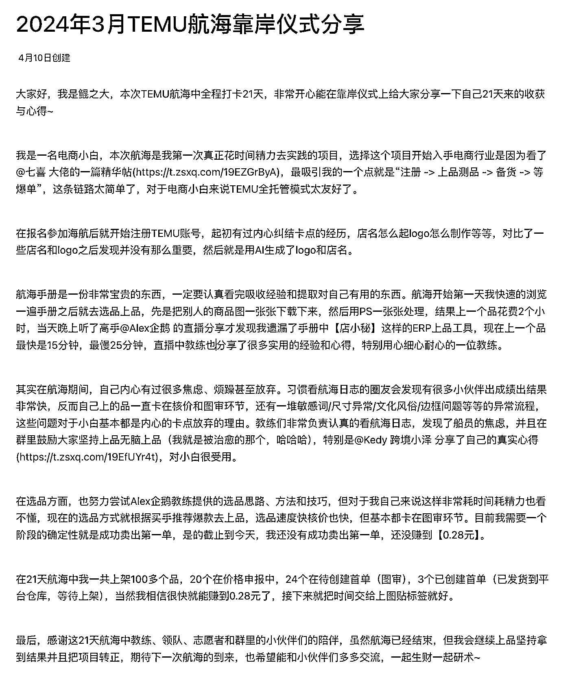
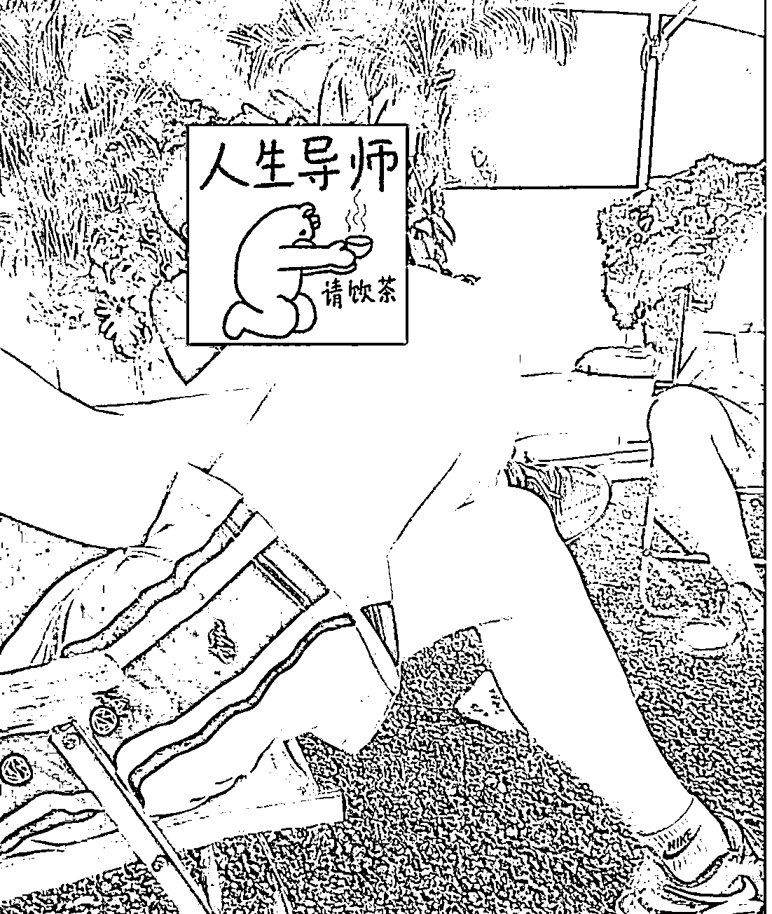
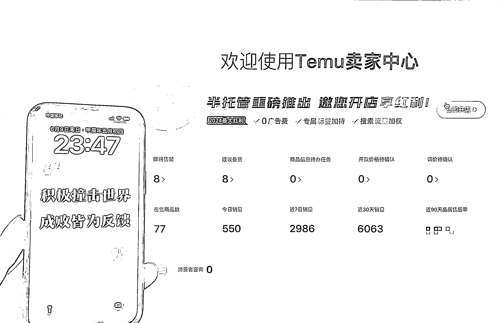
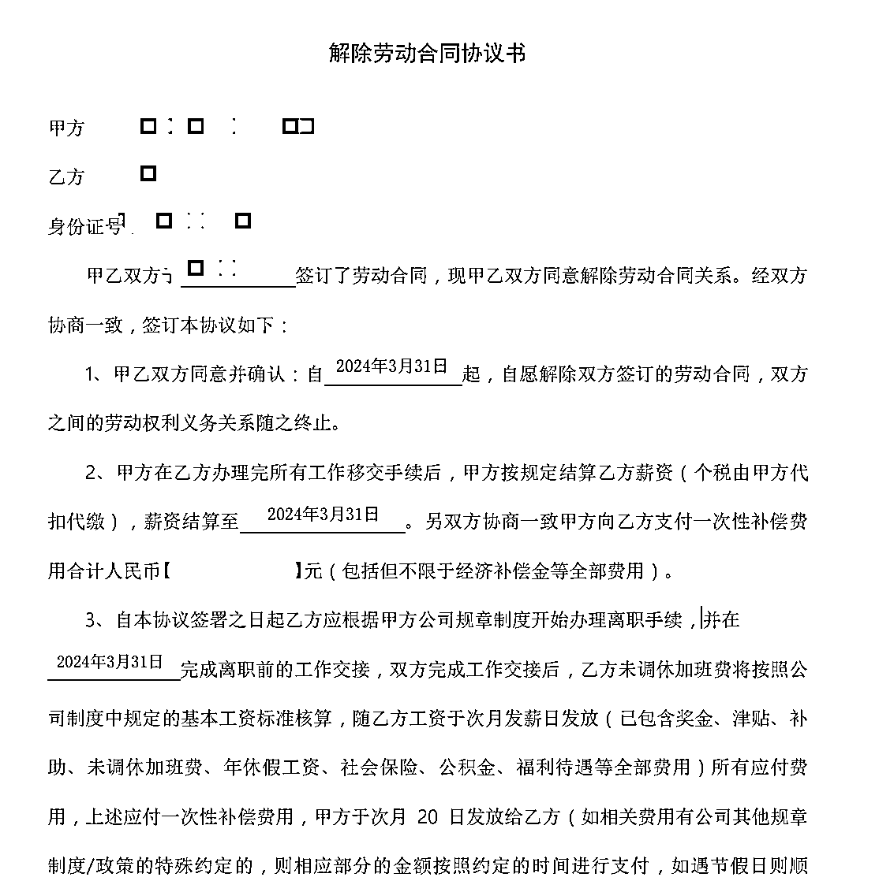

# 电商小白在 3 月 TEMU 航海销量从零到稳居 500+日销，我做了什么？

> 原文：[`www.yuque.com/for_lazy/zhoubao/erxfgnn49xk35535`](https://www.yuque.com/for_lazy/zhoubao/erxfgnn49xk35535)

## (36 赞)电商小白在 3 月 TEMU 航海销量从零到稳居 500+日销，我做了什么？

作者： 鲲之大

日期：2024-06-12

先回答问题~

我认为只做对了一件事情，**坚持做自己认为结果的事情和不断修正未来要走的道路。**

**一、来个自我介绍**

来自广州，其名为鲲，**鲲之大**想出海去看看。

23 年 4 月加入生财，没人领路，只因在公众号看到了一篇有价值的文章，果断付费加入，当然现在也有相见恨晚的感受（真实的想法）。

我曾是一名工作过 8 年普普通通的程序员，在职场没有得到任何晋升，一直处于搬砖的基层，今年 3 月份主动申请毕业。

我也是一名电商小白，23 年 5 月份参加过小红书、视频号、写作等一些航海，当时没有拿到任何的结果，零反馈、没坚持，这对于一个做副业的**航海新人**来说是非常大的信心打击。但是在这些航海中，我得到了很多宝贵的复盘经验，比如同期航海不要报 3-5 个船，这是新人最致命的地方，时间根本管理不过来，一天时间都不知道在做啥。

从上图来看，23 年 6 月份由于报名航海太多，对信心打击太大，以至于后面都没有再参加航海项目，12 次打卡的项目，基本都是划水完成的。

**二、为什么会选择 TEMU 这个项目**

在生财一年，虽然没有像其他大佬那样把过往所有的精华帖都刷完，但至少看过上百篇了，从中也能发现大部分项目的商业模式或者商业思路都差不多，**尤其是互联网项目，只不过互联网平台在进步，我们要不断的切换自己在平台上的位置罢了。**

之前参加的小红书航海、视频号航海、闲鱼航海也好，其实也都是带货卖货，而 24 年 3 月选择了 TEMU 这个航海，是因为他的全托管模式。

全托管模式在跨境电商来说是非常简单的，只需要**选品、选品、选品**。也是因为看了@七喜 大佬分享的帖子，对这个商业模式产生了浓烈的兴趣 [帖子入口](https://wx.zsxq.com/dweb2/index/topic_detail/188442825188112) 大家有兴趣的可以点去看看。

不过后面我搜生财的帖子才发现，还有一个大佬在 2022 年 9 月份就发了一个精华帖@通路 [帖子入口](https://wx.zsxq.com/dweb2/index/topic_detail/585428888811244)，**看到这个帖子之后就去做 TEMU 项目的圈友在吗**，评论留言看看呗，没有评论也正常，可能他在贴标签打包发货中,哈哈哈~

**好项目一直在我们身边，只是我们没有细心研究精华帖，然后结合自身的情况去实践~**

**三、从航海中得到了什么**

报名参加航海，千万不要想着能从中赚到多少钱，因为 21 天对于新手来说，是一定赚不到钱哪怕就是 1 块钱（精英就不同）。

**这是 3 月份航海结束后，领队叫我写的一份心得分享，21 天用心打卡，最后还是没有开单。**

在航海过程中，有好多圈友第二天就出单或者出成绩的，他们都是提前跑了，我们需要时间才能跟上，不要在其内耗。还有就是在航海过程中认识更多志同道合的朋友，大家可以多交流一下想法和做法，尤其是拿到大结果的教练们，教练们无私的分享是最值得尊敬和佩服的人，这里我就的提一下我们当时的教练了

@alex 企鹅 大佬在直播分享的时候非常真诚，问什么问题也一一的回答，等于是手把手教你了，是一个年轻血气方刚的大佬。

@跨境小泽 小泽教练非常有耐心的鼓励你，让你坚持做下去，坚持上品，帮助你排除其他杂念，也是一个非常老练的年轻小伙子，哈哈哈~

有幸，线下也跟两位大佬聊过，有结果的人思维都非常前卫，佩服呀~

so~ 在航海中，我的收获是

**1、航海手册，快速的带你入门一个你感兴趣的项目，让你快速了解这个项目的商业逻辑（基础版）**

**2、跟一群有共同目标的圈友一起干同一件事情，然后分享自己的心得，分享本身也是动力燃料的一种吧**

**3、找到志同道合的人或者有结果的人，向他们学习**

**4、验证项目是否适合自己，是否可以继续做下去**

**四、短短 3 个月，如何做到日销 500+**

6 月 9 号首次突破 500 单日销，直至今天都在 500 单以上。

从图片可以看出，我在售 77 个商品，并且已经下架了 5 个商品（清仓下架），所以我总共上架了 82 个商品，跑出热销标签的商品有 18 个，热销款占比 20%左右，不过有些商品刚上站点，还需要一点时间去跑。

这个账号是从 3 月航海开始做，航海新人想要了解我当时的航海经历和心得，可以去 3 月份 TEMU 航海日志里看看，里面全是心酸的故事，哈哈哈。账号突破百单，应该是 5 月中下旬的时候，所以从销量数据来看，近 7 日销量比 4-5 月份的总销量持平了。

总结~

**销量是跟热销款和库存有关**

1、上新品跑热销，在航海的时候，小泽教练一直说“**多上品，不要内耗和怀疑自己，上品能够解决一切烦恼**”，[消灭烦恼入口 1](https://wx.zsxq.com/dweb2/index/topic_detail/2855822225454121) [消灭烦恼入口 2](https://wx.zsxq.com/dweb2/index/topic_detail/811425221282852) 这两个帖子都是小泽老师写的，绝对能消灭新手的怀疑。上新品去跑出热销，然后快速备货补充库存，就能维持单量，当然也有例外，暂且不说。

2、每天检查库存、销量情况，提前预判备货数量。（这里也有很多问题，以后再分享吧）

3、多看 TEMU 前端热卖的商品类型，跟卖一个月内的热销款，这种品出热销的概率比较高

好吧，我只有这么点料了，我还需要学习，等我学到再跟大家分享，哈哈哈~

高端玩家可以找小泽教练过过招，还有 alex 企鹅教练。

**五、TEMU 这个项目还能做吗**

短短 3 个月下来，我从一个程序员转行到 TEMU 这个平台做跨境电商，我的感受是

1、上手简单，有手就行。

2、没有选品经验，没有电商经验处处是坎坷，需要一段时间去磨砺行业经验

3、平台低价跑马策略并没有那么恐怖，有很多品是有利润的，只要自己的手能控制住不降价就行

4、测品有风险，滞销或者商品上架时提示有侵权然后不给上架

5、资金消耗比较大，动则 10 万 8 万的，回本周期会比较长

6、控制库存难度比较大，库存多怕卖不掉资金回笼慢，库存少怕断货影响链接流量

7、平台规则多，新手会踩很多坑，时间、人力、资金都是问题。好吧，**可能对于您来说人力、资金都不是问题，只有时间上的问题**。

8、副业玩家最好不要搞太多品，上 20 个品左右，看能不能跑出热销款，有热销款就做几个热销就好，放大的话就需要仓库、人力、资金还有更多的时间了。

9、在 TEMU 上低客单的商品会比较容易跑出热销，并且利润还非常不错，中客单的商品很容易被罚款吃掉利润，高客单估计要做半托管吧。

好吧，第一次写文章发帖水平欠佳，请精华帖大佬多多包涵，请吸收精华帖的大佬更要**海涵。**

后续学习到更多经验，再与圈友一起分享~

扬帆正当时，航海出名师

链接他人得心志，感恩生财逢雨时

========================================================================

最后，这也许就是程序员的最终归属吧~

加油同学们，哈哈哈！

* * *

评论区：

明微 : 我是 6 月份刚加入的新圈友，新手小白一枚，准备从 TEMU 开始实战，请问能连接您吗？

* * *