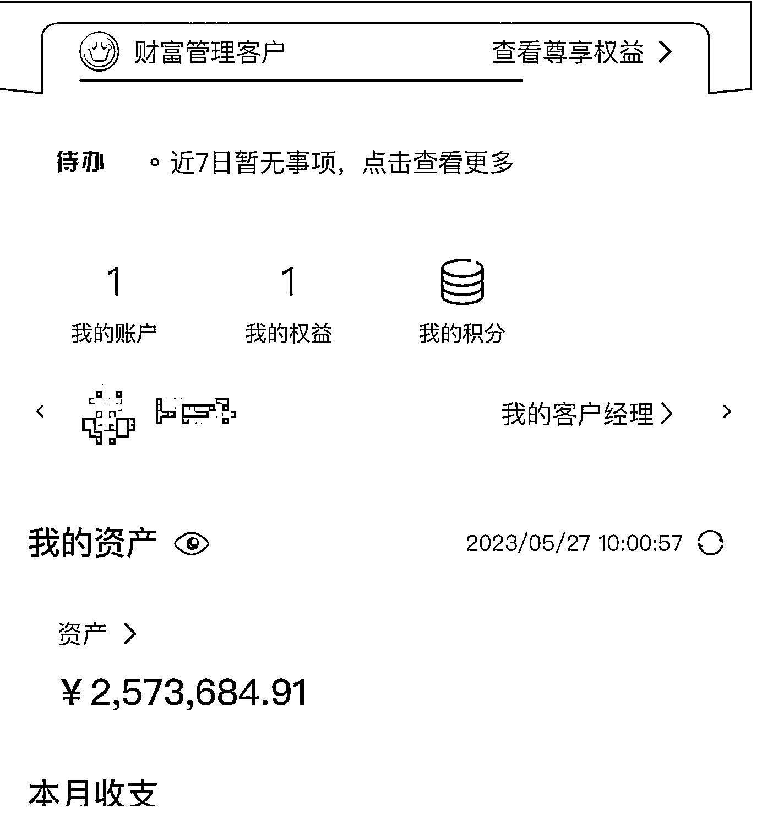

# 跨境电商认知分享，个人创业者从 0 到 1000w+

> 原文：[`www.yuque.com/for_lazy/zhoubao/ycz3giz1g7ln9gyo`](https://www.yuque.com/for_lazy/zhoubao/ycz3giz1g7ln9gyo)

## (31 赞)跨境电商认知分享，个人创业者从 0 到 1000w+

作者： 国民弟弟的跨境十年

日期：2024-06-13

**今天谈谈如何做跨境电商，和跨境电商分享和商机分析。**

我先会从主流平台和自己的经历，分享接触到的跨境电商上的商机和看法。

本文会讲述一个 30+大龄小镇废材做题家，1 年半的跨境电商创业历程，到现在 2023 年 5 月，已经有 350W+的资产。目前每个月纯利润收入 40-60W 左右。目前人在美帝，探索商机。（文章发布在 2023 年 6 月，依然有借鉴意义）

更新：2024 年 6 月，已经 2 年多的创业，早已经破千万了。为了安全，就不晒了。**感谢生财，也学习很多！**

## 自我介绍

1.叫我国民弟弟，国民弟弟的跨境十年是我的频道。

目前是某个公司跨境电商合伙人，也是亚马逊 OA 和套利的玩家。回答，不是为了卖课，算是为了回顾自己的一年半的创业历程。砥砺前行。

2.个人如何做跨境？

在短短一年半中，我已经尝试了跨境电商基本所有平台，

最后摸索出自己赚钱的路径。算是草根出发，能够让很多朋友认知目前的情况。（当然也欢迎各位大佬指教）

3.内容 1W 字以上，全程高能。

注意可以按目录看，建议**收藏**，关注，欢迎围观我的频道，讲述草根创业者的经历。

**以下文字为旧文重新发布，也有新的添加。**

## **我的成就**

直接晒存款，没有炫的意思，赚钱的老板比我多，世界上不要太多。

中国银行是 257W，支付宝是差不多 92W,一共目前人民币现金流是 349W.

因为做亚马逊还有很多钱货压在货上面（懂的都懂）。美元也有美国公司银行户头，也有美元账号。感觉国内平台，不好晒美元资产，就不晒了。

龙珠老贴这里。也可以继续往下看。 [`articles.zsxq.com/id_o242ukpwrs8b.html`](https://articles.zsxq.com/id_o242ukpwrs8b.html)

****在生财圈子待久了，今天鱼丸找到我说，Bruce 你的经历很丰富哈。可以在圈子里面分享。****目前文章在生财有术加精选文章。

****感谢推动，也在群里里面收获了很多认知。这里分享自己的创业的经历。就是一个普通人诚恳的讲讲自己故事。****

****不喜勿喷。我就是一个普通的不能再普通的人。****

大家好，我是国民弟弟的跨境十年 Bruce.（这篇文章是 2022 年 4 月份写的，直接搬运过来了）

我是一个美国本土亚马逊店铺套利和批发卖家。从 0 到 1 开启自己亚马逊套利生意，半年内从月销 2K 刀做到月销 2W 刀，副业给自己每月带来 2W+人民币的收入。目前也跨境公司做项目合伙人，也做自己的项目。这次给大家分享下我的副业是如何从 0 开始起步做和自己微创业的感受。

### ****1.目前的情况（2022 年 4 月）.****

废话不多说，这是 2022 年 4 月份某天的主店铺的截屏。30 天售卖了 2.6W 刀，货值是售价的 1/3 左右（8K 刀)，利润是货值的 50%左右，也就是 4k 刀，利润是 2.6W 人民币。

PS，现在 2022 年 10 月到了 6W 刀的销售。利润也是大致 5-6w 人民币的样子。

后面一张是细节图。有时间戳。

这是随手截图的产品利润率。可以看到时间和我命名 SKU 的方式就知道这个产品的利润率基本就是 100%

****2.我的微创业的人生转变故事****

先简单介绍下，来自一个二本学校，学了个万金油的专业。毕业做外贸，自己玩过 Gap year 间隔年，在东南亚晃荡。不正经的在一家公司做户外向导，一年工作半年，剩下半年就是旅游。钱也只够穷游。穷困潦倒的时候，某次飞机上，找空少要了 4 盒飞机餐回去继续吃了两天。（机票是公司的报销的）

真正开始工作是 2016 年进入某大厂，万科做教育板块。后来因为各种情况和办公室政治。离开了某教育行业公司，之前虽然在这个行业待了 6-7 年，但是在这个行业没有什么积累。****算是人生吃了一鼻子的亏和瞎混了一圈****。只是拿了个工资的打工人。除了做事认真以外，乏善可陈。年级又到 30 了，****基本上在人才市场是属于吃灰的那种****。只有小公司万不得已才收。

****从跨境前的唯一一份正经工作开始说起****

当时在万科里面做户外教育板块。算是新业务，公司让我负责宁波市的业务。很快就和几个深圳的小伙伴上了早上 10 点深航飞机，两个小时后，小团队就这么在一个完全陌生的城市开始了业务。新城市，新地点，每个角落都是未知的。刚开始租车花了 5 天，跑了下城市大概，好歹先不要迷路。

前期的 3 个月的时间，每天除了睡觉就是工作。4 个小伙伴一起鸡血，虽然不至于通宵，但是基本上 3 个月连轴转。没有休息，白天开会讨论引流方案和活动方案，晚上头脑风暴，盘点复盘。

团队里面，我是一个唯一在这行业有经验的人，其他人只有两个月的经验，还要负责培训新人。

对了，团队里面还有一个几个月才慢 18 岁的小朋友。算是带着童工和一堆新手开始在一个新城市，找流量，开始做业务。

作为项目负责人的我，晚上唯一的解压方式，是找其他各个同行朋友和其他分公司负责人打电话。还记在平楼的沥青小阳台上，踱着脚，从东走到西，南到北，像极一个热锅的蚂蚁在试图找到新业务的流量密码入口。

和现实中所有的一样，欲速则不达，客户进来都需要时间沉淀的，特别是我们做小朋友的生意的，更需要长期活动下来的信任。且自己也是流量新手，并不懂如何很好的去使用其他方式去引流和成交客户。就这样团队在每天鸡血忙碌了一年，流量业务上没有什么业绩，虽然成为公司夏令营口碑最佳的营期代表，抵不住利润报表的亏空。团队也就被公司拆散了。随后几个月后自己也离开了。

基于对之前行业的负面经历，决定换行业新进入跨境电商，付费两次找过跨境电商大佬电话咨询，只是希望自己没有选错方向。****目标就是自己的跨境的创业的起步不要错。现在社会试错成本都很高，宁可利润低，也不要最后一地鸡毛。****

2020 年末，从 0 开始进入换行业赛道，从深圳一个小跨境公司上班开始做亚马逊，中间换了一次，到现在长期搬砖的跨境年的大厂，做项目合伙人，同时也在 2021 年末，悄悄的开始了做自己的副业，目前自己副业已经超过主业收入。

### ****3.为什么选择跨境呢？****

2018 年的时候，就萌生换行业的想法。给认识的唯一在做亚马逊的同学打电话的时候，随意闲聊中，之前的小学弟已经是年入 50W 了，这个金额让我错愕不已，当时的我虽然在公司做项目经理，也只是拿 1W 的工资，且要扣除各种公积金和税到手也就 8K。对比下，猛然觉得选对行业比经验都重要。中国的老话，男怕入错行，女怕嫁错郎。只有经历过才刻骨铭心。

现在回顾下，这个世界大部分都是普通人，你和我和现在看这个篇文章的朋友，承认一个现实，95%以上的人都是普通人。如果你不是，那么你就是社会中的 1%的老板了。

### ****4.那么普通人怎么现实逆袭呢？****

选择一个持续增长的行业。什么叫持续增加的行业？

最简单的判读，这个行业是替代之前旧需求的解决方案。

如，新能源的特斯拉替代燃油车，成为妖股。

美国亚马逊电商就是替代去商超店的购物。和我们中国淘宝起来的那么一波一模一样。

### ****未来铁定是中国电商全球的市场。进入这个行业至少有 10 年以上的发展前景。****

### ****新的信息和新的改变。****

于是在 2020,12 月通过社群知道亚马逊还有套利模式的时候

（简单介绍下，套利，就是通过在美国的其他零售平台购买打折的货物，在美国亚马逊上进行售卖，如，在美国沃尔玛上买到廉价的尾货，同样的产品在亚马逊上进行售卖。****类似中国拼多多进货到淘宝卖的模式****）

而且在群里看着人家从 0 开始白手起家，20W 直接在 4 个月后直接赚回来的时候，自己终于磨蹭的在 2021 年 3 月份开始套利模式。

然而在当时公司新项目，忙碌到每天加班到 10 点，只能周末做事情。

周末通过社群和网络资料来学习。刚开始真的一脸蒙蔽，大量海外网站在自己面前，说是简单的套利，从别人家买了到亚马逊售卖。然而花花绿绿的网站放在你面前，还有更多五颜六色的商品在网站上，要在这成千上万的产品中找到能让有利润的产品，瞬间感觉到无从下手的焦虑。

****钱不会掉下来，每一次的开始都是要靠自己。****

硬着头皮，直接上，选择最笨的战术。黏贴采购网站的标题，到亚马逊搜索，人工识别确认是否一致，是否有利润，是否有权限售卖等等。

然而看着自己每天工作打卡到晚上 10 点，偶尔半夜起来工作的节奏加上大小周的作息，已经榨干了我这个打工人的精力。和所有人在奋斗的人一样，都希望努力出成绩，但是超人的勤奋会严重透支你的精力。

在前期鸡血干了一个月后，因为投入时间严重不足，加上白天工作的焦虑和忙碌。几个月下来，我的店铺只有刚开始的业绩截图是看的下去的。因为我只是进了一次货。这是 5 月份新店业绩截图。

这段时间，开心的是开始自己能够有自己的副业赚到一笔 60 刀。遗憾的是自己无法投入更多精力做事情。

回顾下，最重要的是，****任何副业前期都要给出时间让自己专注的做事情。****

### ****5.亚马逊套利副业启航的故事****

2021 年 7 月中旬，终于有空出大量时间开始做亚马逊套利。正到我准备踌躇满志的时候。晴天霹雳，收到亚马逊封店的邮件。封店！配图是网图（非正式邮件内容）

因为放了一段时间，没有售卖任何货物。账户被审查需要提供资料，然后因为是买的店铺，没有任何资料，无法解封。就像你新店还未开张在装修的时候，就被租店的人告知你，不租店铺给你，你关门吧！

当时看到封店的邮件的时候，心中瞬间非常低落，不想说话，只想躺在沙发上刷手机看点其他的排除下烦恼，然后点一顿外卖，配上肥宅快乐水，刷个剧抚慰下自己受伤的心。

躺在沙发默默不语，抿着嘴半个小时之后，开始咨询各方朋友，确认了确实无法解封。又是一波失落涌在心头。做在公寓台阶上，就那么看着天，发着呆，什么都不想说。天上的云儿就那样无表情的来回游走。我也无表情的看着他们。

约半个时候后，过来会，想想到自己悟到的金句。****“这个世界没有什么是不变的，唯一的不变就是变化，而且非常多的事情不是你能控制的，积极应对才是生活的强者，You are NOT in control”****

反复脑中念了几遍，这么多年来，其实所有的东西都是变化，人和关系，都是一样的。跳出固定思维，积极应对才是生活的强者。如果你碰到类似的事情，这句话送给你。

承认这个世界的不确定后，我开始接纳现实，同时阿 Q 精神的告诉自己，封的早好，好歹没有货，否则钱货两空就更难过。

几天后，同时大量中国身份注册的亚马逊的店铺已经被限制权限了。让我也被治愈了，抱团取暖就是这样的感觉吧。同时也阿 Q 一把，反正中国账号也没有意思，本来就要换，只是被强制提前升级了而已。

### ****6.美司亚马逊之旅的开启****

然后我开启走向开美国公司注册亚马逊的路程。真的像，上帝给你关上了门，但是同时有给你开了一扇窗。很多时候你就是被时代机遇推着走的，其实回想起来，感谢封店。不封我不会去探索新的路径。

开美国公司做亚马逊的路并不容易，好歹自己积累了些美国朋友资源，通过朋友的朋友，找到代理完成了从公司到店铺地址的明信片的验证，后续也完成了亚马逊最难的二审验证。

还记得在某个晚上和美国留学的朋友一起聊我的新公司起什么名字，最后在 3 个备用选项里面，帮我选择了一个美国化的名字。隔着大洋 一点一滴，一家美国公司在我的方寸间的房间里诞生了。

有了这些基础，我才可以第一次申请自己的亚马逊账号。

在社群和网络上翻略无数的帖子和反复和代理确认，我自己开始了自己的申请账号的路程，一切并不是很复杂，远程朋友家的电脑提交了资料。然后再是视频验证。记得视频的时候是一个小姐姐，操着南美口语，拿着一堆资料和她核对，15 分钟搞定。小插曲是，资料提交因为格式不规范，导致来来回了一下，在咨询朋友和代理后，提交了正确的资料，比较顺利。

在 8 月中旬有了自己的店铺，权限齐全。记得那一天感觉闻到的空气都是甜的。辛苦一个月，靴子落地，而且结果很好。

### ****7.店铺有了，从这里开始，才是真正的自己美司套利启航的开始。****

2021 年的 8 月中旬，又是重置自己，从 0 开始手动选品，在一个 Nordstorm Rack 网站打折清仓区开始，黏贴复制到亚马逊, 又是几个夜晚的不眠，凌晨三点的挑灯夜战，让我回归了到高考的感觉。然而几天后，效果依然一般。虽然下来几单，但是效率依然比较低下。

### ****8.学习总是遇到困难就有新的解决方案。****

开始复习 TA 和 SM 这两款选品软件。我把网络上关于他们的工具使用的视频全完了，又投入到选品中。成果比较喜人，选出了一些利润在 30-40%的产品。

****当我欣喜的时候，这时候总有让你打回原形的事情发生。****

当我下单的时候，我的美区 Paypal 被封了（这是大家做套利的重要的支付路径）。当时候还得意自己的美区 PayPal 可能没有问题，因为注册的时间久，想想是老账号，权重高，蜜汁自信。结果说封就封。

然后就是疯狂的给 PayPal 打电话，20 多分钟终于找到合适的人通话。按照自己的中国思维，好歹给个机会，结果是一个 BIG NO.

祸不单行，大量网站也砍了我的单子，沃尔玛，Macys,还有 Academy,只要我下单子就砍。

无法支付，无法下单。让我好多天都没有精神，躺着床上，起来找攻略，可惜这个领域都是一个全新的领域，并没有任何人能够提供适合你的解决方案。

****我瞬间蒙蔽了！那段时间是我打了很多电话。****

我随意截图下。因为需要在美国时间电话，我一般都是晚上 11 点之后电话，一个一个打，还有最坑的是，话说到一半，网络掉线了。你知道那种崩溃是什么样子的么？花了半个小时找到人，已经聊到核心的时候，断线，然后需要重新打进入，因为他们不会打回来。持续了几周的一天 3 个小时电话量。

大量的实践，居然让我总结出来，其他下单的套路。和如何和客服快速沟通的经验。

在一个未知的领域，实践出真知。

总结了支付和砍单的经验后，我又升级打怪，进入批发的领域。

### ****9.开始批发之路！****

普通人厉害，靠什么？靠超人的勤奋！

15 天互联网的汪洋中，自己找到的 600 个批发商，开始电话和邮件。

你以为这些有资料就是能够解决问题？

不要天真了，大部分需要你的资质和其他的材料。

经历了几次沟通不畅的情况，一个大胆的想法出现在我的脑子，雇佣美国人帮我电话。

于是乎万能的朋友圈让我找到之前的美国朋友，美国老爷子没事愿意以一个比较低的价格帮我电话。

我们就这么交替合作，努力这次有了回报的，找到了些不错的利润的批发商。总结下，本土人互相沟通比较方便，而且年级大的做事比较稳，和销售沟通时彼此比较信任。

### ****10.这半年里面,我的困难和努力。****

有很多不眠之夜我是挂着电话和海外网站的客服隔空撕逼，要求单子能够下进去。

有多少个夜晚在不同的网站里面跳转，选择思考分析，把选到的产品放到自己采购清单里面。

还有绝望的等待，因为第三方贴标服务商把我的几十万的货拖在仓库（他们人手不够）。

有着不断选择测试 IP 怎么样不被 PayPal 封号的探索，和被封号后，一周每天 3 个小时的和他们客服的撕逼大战。

中间很多事情，都是新的，要不断想办法来解决。

在这里我补习了自己的商业英文口语，每日从油管 follow 教程，怎么样把自己的锻炼的更美式英文表达思维，如何高效的表述和合理获得解决方案。

我自己搭建了独立站，自己装修站点。包装的非常本土，以至于被后续居然啥也没做独立站也出单了。

我学会了如何电话拜访供应商，如何和美国人谈完公事后拉家常，建立良好的供应商关系。

在这里，我又测试了出来了申请 ITIN（美国个人税号）绑定美区 PayPal，稳定不封号的方法。

又开通了美司的商业 PayPal

在熬夜的一个晚上，我用空壳的美国公司，申请下来了美客多，Etsy 和其他电商平台。（正常的中国公司很难申请）

在某个晚上，我又信手拈来，去批量开了美国的信用卡，获得更多的美国银行方式。

在某个白天，自己闲着没事又开通了，美区的 Stripe。

到现在，可以借着着自己的经验，利用美司，开 Walmart，分享美司套利的技巧。

游刃有余的协助一些朋友一起开始 OA 套利。

****当你开始了，一切就变得越来越简单。****

### ****11.时间是我的朋友****

我从的店铺从第一个月的 2k 刀，到第二个月到了单日出 20 单欢喜。然后是缓慢的从 5k 到破 1W，到现在开始到 2W。利润不断追加投入中，到雇佣了我的亲戚帮我打理店铺。一切就在短短的半年完成了。

这是第一个月的 2K 的开始

每一步都是一个积累，大量的练习，让我行业经验越来越足，不断能够淘到 50%到 100%以上的高周转产品，同时因为需要处理非常的事务，自己的工作节奏也是更加高效和简明。

这是顺手截图的在出单的产品。

### ****12.走下来感悟最深的是：****

1.任何副业都没有速成的，都是需要大量的前期垃圾时间的积累，自己去做每日的经验总结。

2.提前规划最佳，因为使用的美国公司开的亚马逊账号，后续开权限基本无压力。包括后续开 ITIN 等申请信用卡一切都是水到渠成。

3.主动努力中，也要积极寻找合适可以帮助你的资源。没有美国的朋友和代理的协助有些事情在国内只能望洋兴叹。

4.主动学习的解决问题，向行业厉害的人虚心讨教。很多事情都是第一次做，通过搜索和问行业里面厉害的人，少走了弯路。

5.在自己擅长的领域开始，投入比常人更多精力。无数个夜晚对接美国时间和电话，一切都让后期的事情，无比顺畅。

6.选择比努力重要。如果我在跨境的路上还是抱着中国公司开店铺，估计很快就会有瓶颈。而美司虽然来来回回，好歹给我更多的选择。

或者我选择自己的老的行业赛道，就可能无法达到在电商上的收益！

7.人生只要有一两件事，你怀有十足的劲头，不怕艰难险阻，就能够得到很高的收获，其他的事情就直接躺平就行。

## 一起做亚马逊套利朋友的反馈

我也曾经辞职，拼命卷 OA。

我也曾经每天几十个小时泡在做事情上。

我也曾经从 0-1 完成自己的所有安排。

唯独有这样的经历，你才是真的你，你才能浴火重生。

**这个世界上最难的是什么，就是赚钱，能解决赚钱的人，一般都不会太差。**

## 独立站经历分享:

2020 年 9 月，从 0 到 1 ，报了一个老外讲独立站课程，学习独立站，飞到深圳。我记得是 4K 人民币的培训费。当时对于穷困的我，掏出这 4K 人民币都是难事情。

飞到深圳，真的从 0 到 1 开始了解独立站。第一天就被各种名词给绕晕了。BM,广告组，受众，VPS。

下课的时候，一问都是各个行业的小老板，从平台做起，现在过来学习独立站的运营。

中午吃饭的时候，中饭 28 块，让当时贫困的我，备感口袋空空。

很快 3 天课程就上完了，依然脑袋懵懵的。

干脆住在边上的青年旅舍，50 块一晚，每天加班加点，从中午开始干到第二天凌晨 4、5 点，然后就去睡觉。

起来在下午 1 点左右，又可以去城市快餐店，享受错峰少 3 块钱的，15 块便当。

就这么倒腾了 2 周，基本把当初的所有的讲的内容都消化了，且从 0 到 1 完成整个流程闭环。

从域名购买，网站搭建，广告素材视频剪辑，Logo 设置，收款安排，FB 广告账号申请，受众分析，广告组设置，选品等，都是自己一步一步完成。

然而当我完成了所有拼图的时候，要烧广告的时候，**我意识到作为一个独立个体做独立站是多么难。**

因为受众和数据都需要花钱喂出经验来。所以我烧了几百刀的广告后，出一两个单子后，就意识到，这不是我的游戏。

我要拿公司的钱去玩耍，给自己增加广告投放经验。

然后就果断停止自己的做独立站的想法。

Boss 上开始拼命投简历的过程。在面试 10 家以上的公司后。我又很快得出一个结论，未必有合适我的机会在这个市场里面，或者我没有机会学到更多内容。

当时的深圳独立站公司，真的是很神奇的。从大厂出来的，自己拉个团队，10 个人就开始扩张的。

有大厂，有做广告投放的小组长都没有搞清楚，如何解决 FB 账号安全问题，然后所有人的 FB 账号被封。直接停工两周的情况。

有去面试的，老板直接说，兄弟你没经验，而且，你年纪大，下面都是 97,98 的，你能不能呆得住呢？

有新成立一个公司，都没有一个厉害的投手，最长员工资历就是 3 个月的。然后从其他地方，拉投手来培训。

主动分析了下，自己的能力和目前市场情况。

**我的目标就是：找到一个进步扩张的小公司，有人教。**

而目前我的水平和能力，还有年纪在这里，找到一个愿意收我的公司都比较难。要不就是我不愿意进去。要不薪资就是四五千一个月。

**最终我认定，真的能够在这个行业起飞的人的路径是这样的。**

1.在这个行业刚起来的时候呆着，比如早两年。积累了大量的广告投放经验。

2.积累经验，同时积累人脉，能够组建一个几个人的小团队，解决前后的问题，才能从 0 到 1，创业成功。

## 关于其他平台

1.我后期开了 ETSY 的店铺，真的算是不错的平台，佣金少，投放就有产出。利润 50-100% .适合新手。

2.Walmart，平台要求高，需要亚马逊和独立站的验证。要求高水平和有产品资源的卖家。平台利润低，适合资本进入。

3.Ebay ,和 Etsy 相似，因为平台门槛高，内卷不严重。搞出点利润不难。

4.美客多，拉美平台，做的人少，可以用美国公司开店。测试了下利润，确实可以。适合行业待了 1 年的老人创业。

5.虾皮，没有做过，可以自行查看。每个时期平台都会变化。市场和商机，可以自行摸索。

6.亚马逊分析。

中国企业开的亚马逊。铺货就不要做了，铺货是大厂之前的玩法。

走精品，独立卖家，基本玩不动。有认识的公司，一年 50w 美金的左右的店铺，长期小类目头部，就被大玩家给直接干趴了。然后亚马逊部门清库存，解散亚马逊部门。

唯独可以做的就是套利。权限限制非常多，也有朋友做到 10W，真的是在夹缝中做到，不容易。

建议拿一个中国企业亚马逊练手，注册路径，哪里都可以搜到。

甚至都有注册练习用网站。

后期建议走美国公司搞套利模式。投入会有一些，大致 1W 人民币左右。几个月就能回本。

7.Wayfair ,home depot 适合产业链中的工厂卖家，对资金，供应链产品都要求。适合 2b 公司转型，通过美国大型商超售卖，都能赚钱。唯独就是门槛高。一个 Home depot 账号都可以到 30W 人民币。Wayfair 账号市场价 8k 左右。

8.Tiktok ,美国小店值得关注。真的从到 0 到 1 ，做到 100w。因为限制国人开账号，投入成本，至少 3-8W。

回本就看是否坚持和选品。回本长期看不是问题，甚至非常有可能从 0-1，做到 100W。

英国小店，只适合有实力的朋友去卷，独立创业者不要去玩。

## 关于创业的思考

#### 认知每个成功案例的本质+主动链接优秀的人，

记得刚进一些电商圈子的时候，看到别人在深圳获得了第一个 100W 的经历的分享，觉得遥不可及。还记那个案例是做独立站的。从独立站投放公司出来，自己做 FB 投放，整个业务非常简单，最后发展壮大，成立公司。管了几十号人。

最后两年后回顾这个案例，不再惊奇了。因为能力提升了，能够看的更清楚别人的赚钱的思路和情景。

我知道，那个 100w 赚到是有人家的时间背景。

行业经验，投放经验，加上天时地利人和。就这么完成 100W 的快速积累。

需要具体分析别人为什么能赚，而同样的情况下，是否自己能够赚到。

#### 关于链接优秀的人

创业本来就是独行者的天地，这个社会独立创业者也是少之又少。

能够链接的大量创业者的唯一方式，就是通过互联网络。线下你能碰到厉害的人概率基本是千分之几。**也就是互联网，让我和你相距在屏幕前，彼此互相滋养。**

**感谢互联网的高触达，低成本，能够在网络上和这么多厉害的朋友一起成长。和厉害的人一起走，才会更快。所以要主动去触及更厉害的人。**

也感谢各位粉丝朋友的关注和鼓励。

在我被攻击的时候，给支撑。有些还会主动伸出手来，问有什么资源需要。

顺带提下，目前自己收益情况，大部分来源，亚马逊套利批发卖货，和公司合作的电商项目分红，还有小部分的知识付费。

## 独立个体如何创业？

## 

### 1.积累，长期的行业积累。

这样的积累不是简单日复一日的积累，是基于对赚钱的极大的动机，能够不断在行业中找到优秀的人去学习和成长。

我有个 10 年朋友，10 年自己创业，一年在 50-60W 左右，属于过得还不错的中产。唯独就是缺乏在行业的中学会更快的蝶变和进步，躺在自己固有的江山上，最后今年就碰到行业变化，目前就是一个月从 5-6w 收入到 1-2W 收入的巨变。温水煮青蛙，让他缺乏更深的积累。最终因为房贷的压力，他居然去上班了。

人就应该不断突破自己舒适区，不断积累，才不会被时代淘汰。

### 2.斜杠，长期的斜杠。

自己就非常理解的斜杠的价值。

我在进入跨境前，是做外贸的。交了被割韭菜的费用，上了一个在深圳的巴西老外的独立站的课。学会的一些独立站的套路。又做过 Tiktok 账号和直播，对站外流量比较熟悉些，各种坑都有踩过和尝试过。

然后进大厂，学习亚马逊精品打法，铺货。

网络上自己研究和付费学习套利和批发。自己也额外研究了 Etsy 如何卖货的套路。

同时因为之前的经历，英文也不错。了解各国文化。

自己又向跨境行业大佬，学习和模仿建立个人自媒体博客网站，向厉害的人学习。

所有东西，最后融合在一起，自己就能做成项目

当我现在，在美国谈供应商的时候，我的英文和跨文化沟通能力，就让我获得很多机会和能够触达更有价值的产品。

生活的每一步，都是为自己储备资源和能力。等到机会来的时候，你就能闪光。

### 3.努力，长期超乎常人的努力。

我记得我在下班后，有种被公司掏空的感觉，回到家里，只想刷 PDD，买买买，去缓解压力。

后来自己寻求改变就是，自己去运动和健身。

提高自己的精力后，我尽可能学习更多的知识，反复学习优秀人的经验和文章。

自己创业工作的时候，基本每天睡 5 到 6 个小时，然后就是行动，执行项目，自己从 0 到 1 做事情，思考如何提供工作效率，等等。难的时候，就是各种焦虑和孤独，这时候有句话，就会浮现在我耳边，”你所经历过的，我也曾经历过”。这是一个父亲对儿子说过的话。

### 4.远见，长远的判读和思考分析，提前规划。

远见，这样的东西，更多来自独立的思考。

我是一个非常喜欢独立思考的人，喜欢去刨根问底的人。

比如说，大家很多人看到肥肉球的发家成功的案例，就自然映射到自己。

其实你和他的差距不要一星半点。你要复制人家，就要全套复制。

1.复制人家长期的商业思维判读

2.复制人家坚决的执行力

3.复制人家摸索和探索的精神

4.复制人家的地理环境。

那么你思考清楚人家的成功的地方，就可以反推对事物本身原本的认知。其实很多人大脑不经过训练，是不会去思考和判断的。

规划，是基于你的思考得出的结论，提前安排自己的一些事情。

比如，我在做 OA 的时候，就遇到支付的难题，我自己解决了，顺带发现，ITIN 这个个人税号是一个好东西。但是周期非常长。然后就自己找代理提前在护照过期前，申请下来了，ITIN 号。

还有自己在卖货初期，尽可能的触发了二审，然后找代理提供了账单，这样以后卖货也不存在任何麻烦的问题。

后续又帮我解决了大量的其他相关的问题，paypal ,Etsy,Ebay,信用卡等。

### 5.对于赚钱,强烈的自我动机，自我认知和自我学习。

#### **关于赚钱的自我认知**

我认识一个朋友叫大白，一直在教他家庭里的小朋友，中学生如何赚钱。我觉得就非常好。

这一个社会，大部分你经历过 12 年的教育目标就是为了赚钱，在社会上谋生。家里土豪排除在外。

而这个技能，是学校永远不会教你的，因为学校老师也不会赚钱。怎么教你呀。第二个这个东西，中国文化不好放在台面上讲。

这个教育给你的是一些基础能力，作为一个高素质的劳动者，可你真的如果按照他们的要求做下去，你就真的一辈子成为一个高素质的劳动者。

我见过，留欧洲 8 年的人，跑到深圳，拿个 8K 的工资，吭哧吭哧的上班，没有什么特别的。最后还特别叼，心高气傲。wtf.你啥玩意。

还有跑到英国读书，两年出来，英文都不如我这个没出过国的人。**看他们在努力装自己很厉害的时候，我都真的可以笑出声了。**

教育的那么久都没有转化成为生产价值。而且很多自认为不错的人，一直抱怨自己赚不到钱。

比如学历不错，比如，海外经历丰富的，比如，作人素质修养非常好的 ，比如，自认为学习能力很好的，比如，老板同事夸你做的很好的，就自我良好。

请认清楚，你的优势只是在某个领域，其实完全和赚钱这个领域非常不相关。

你成就再好，没有在商业上思考清楚，然并卵。你之前的成就，你要思考是否和你后期创业有关联，有什么技能可以迁移的，

**而大部分朋友，这辈子都没活明白，反而自信满满。**

好像国民弟弟的在嘲笑你？

**哈哈，我也是曾经是小丑。**

我自己就非常自我良好的，在大型公司做过，行业我经验最足，执行能力我又好，我的英文又好于公司大部分人。我感觉自己非常厉害。感觉公司里面没几个比我厉害的。

然而，真正的让公司运营起来赚钱的时候，我就让项目亏损，没有成本概念，没有客户观念等等，当然外在的也缺乏，我没做好，其他的人也做的一般般，我算是努力做的不差的那种，但是和赚钱依然没有沾边。

**人能够认知到自己社会上显性的优势和赚钱并不相关。就是一个进步。**

当然还有很多的细节，只有自己经历才有，学会知识付费，向人家学习，就是一个很重要的地方。

#### **关于学习能力**

学习进步不要太重要！

我看到很多优秀的老板。

认识一个老板，公司是行业的中型公司，5 个亿的规模的。

你很难想象到老板是个 30 岁的年轻人，从 0 开始创业。10 年创业，从深圳某个不知名的库房，到有 400 名员工。

公司设置新项目的时候，找行业的朋友拉关系做培训，强制所有人都要给出培训记录，坚决不给你躺平的机会。

也见过，行业小老板老板，一看就不太思考进步，躺平在自己历史功记薄上。我呆了一个月，就自己走了。因为知道呆一点时间，就是浪费我的生命。也知道为什么他一直十年了就只有这么大的原因。

**千万不要因为一个老板赚到了钱，而反而证明他所有做的 都是对。**

要因为他思考的是对，才能证明他做的是对的。

进步思考，而且对人性把控稳妥的，才适合走的更长远。

#### 积累的优秀的习惯。

比如，写作思考，能够学习优秀人的方法，自己总结和思考。把脑中的内容，用清晰的文字表达出来。

这训练了什么？

1.逻辑表述能力。

2.总结能力。

记得小时候说，白居易的诗都是给大字不识的农妇讲么，就是训练极简的表达能力。

**朋友说，你每天文字都很干。而且写了这么久，也没有去故意水文章。**

每个人有专攻，我爱思考和写作，把自己思考的优秀的地方表达出来就是对自己的总结和进步。

而且好的内容，是会被高度认同的也是很开心的事情。

写一篇文章需要高度的精力的耗费的，写的人都知道。这篇文章，**我费时 10H，高度有效率的 10H 写的文章。**看到这里觉得有价值，就转发给你认识的朋友，证明你也是一个不断进步的人吧。大家互勉。

* * *

评论区：

暂无评论

* * *