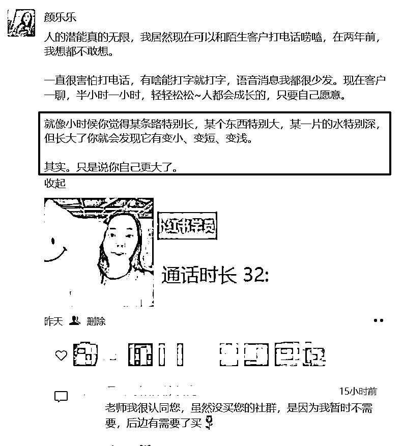
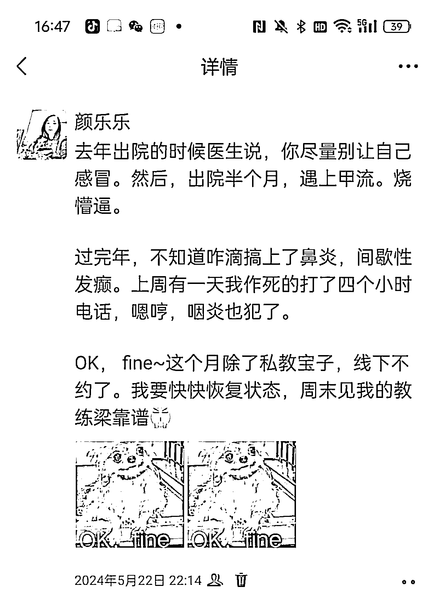
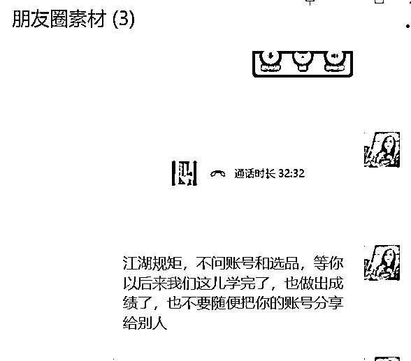
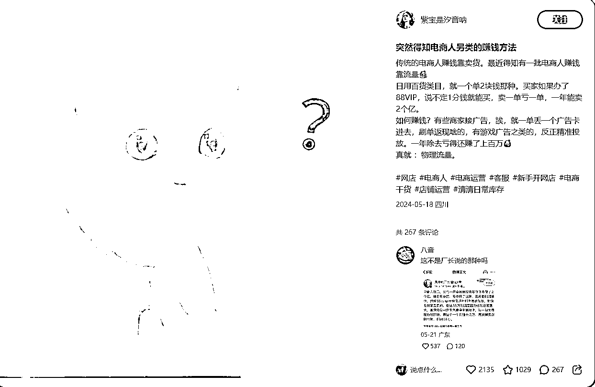
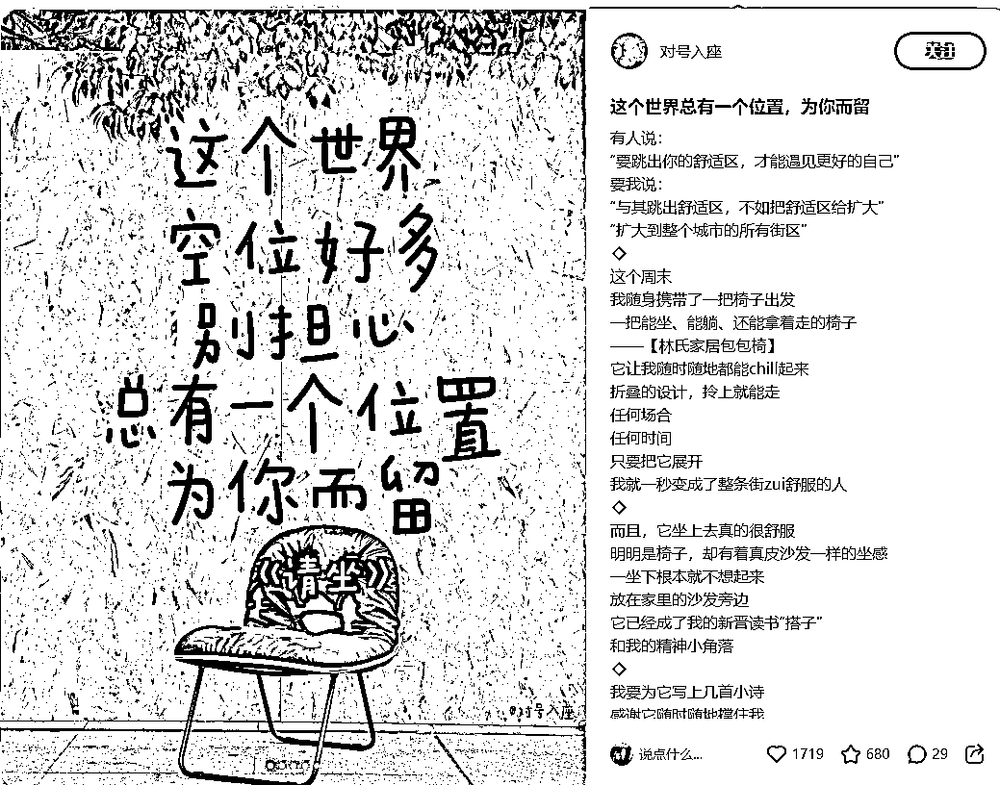
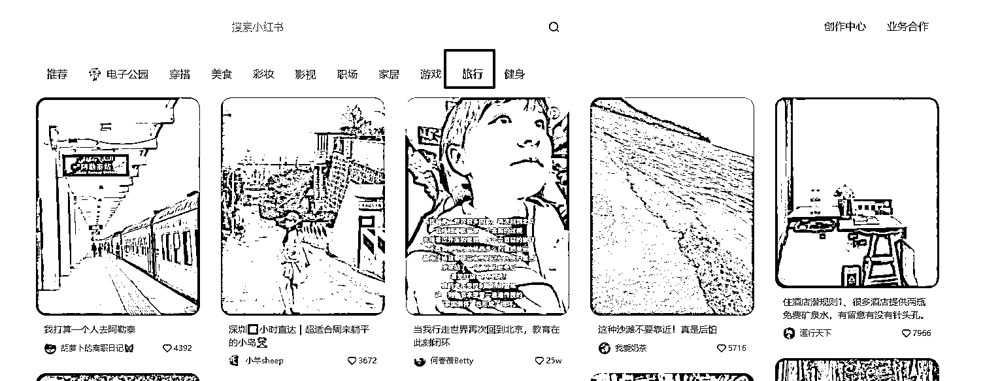

# 6 个月发了 1000 条朋友圈变现 15W，总结一下我的经验。

> 原文：[`www.yuque.com/for_lazy/zhoubao/ci3lk1gzvgpa8ias`](https://www.yuque.com/for_lazy/zhoubao/ci3lk1gzvgpa8ias)

## (57 赞)6 个月发了 1000 条朋友圈变现 15W，总结一下我的经验。

作者： 颜乐乐

日期：2024-06-04

生财的宝子们大家好，我是乐乐，2022 年加入生财，今年是我在生财的第三年。

从职场妈妈到自由职业者，参加了十几次航海，终于找到了适合自己的模式。

今天我想跟大家分享一下关于朋友圈这个版块的内容。

很多从职场出来的人，可能都曾遇过发朋友圈头大的问题，不好意思发，不会发。

我自己这半年也在重点突破这一块，而且突破后，公域流量的转化效率高了很多。从原来的 2-3 个月的转化，到现在加了以后 2-3 天，甚至有 24 小时内当场转化的订单（3980 的私教），累计私域变现 15W，同时也把这个方法复制给我的伙伴们，帮助伙伴取得过百万 GMV。朋友圈真的价值百万~

在此感谢我的老师@芷蓝 和@梁靠谱

我是去年 12 月开始正式做个人 IP 这块的。也是从那会，我开始把朋友圈重视起来，每天都在发内容~数了数，大概发了 1000 条左右，每天五条，有时还多一些。

建议所有做引流的同学，一定要在引流的时候注重朋友圈，把内容先铺好，不然来了流量也不见得接得住。

从没得发到发得出到发好，会经历三个阶段。

**（一）第一阶段 ：不敢发，不好意思发**

刚开始的时候，最难突破的不是技术问题，而是心态问题。

大多就这三种：

1、发了没人互动

2、担心发的是营销内容被人删

3、有心理压力，怎么变得这么 LOW，尽干些微商的事

可能还有第 4 种 ，哈哈 大家想到也可以补充~

发了没人互动，那就没人互动，继续下一条。而且我自己验证，付费的用户并不是在朋友圈和你一直互动的。反而有的人他一直看着你 但不互动，需要的时候来找你，就可以了。

被人删也没什么，因为你也会删别人，这样的人 如果删了 也是净化通讯录了！

如果不想被删，那就多发一些对别人有益的内容，少直接发硬广。

关于心理压力，这个，我遇到的伙伴，基本都跟我聊过这个问题，都知道朋友圈很重要~但发的时候，妈耶，总是放不开。外面没有那么多人关注你，人生在世，无非是赚点小钱，买点喜欢的东西，照顾好在乎的人就行了。

卖东西不丢人，无论是产品还是卖服务，我们最终都是提供价值给到用户。如果你介意谁，在乎谁的看法，那就屏蔽他吧，打个标签，让他看不到就好了。比如我会屏蔽我娃幼儿园的家长和老师，还有我自己的亲戚，七姑八婆的太难解释的全部屏蔽。

而且开始发不好，也不用担心，多发就会越来越好，我开始的时候发的也是很乱，但只要你多发，表达力就会提升起来。

当时我和我的学员秀秀聊天的时候还在说，她说看我一直持续在输出，而且感觉到了在进步，虽然她不咋互动，可她有看啊，因为我一直发，所以她想试一下小红书的时候，就找到了我咨询。

做不好又怎么样，一直做就好会，而且你的用户会看着你变好的过程，也非常有参与感。

**（二）第二阶段：不知道发什么？**

说朋友圈很重要，是知道的，但重要是重要，怎么做呢？

到底要发什么呢？这是很多同学头疼的问题。

朋友圈所有的内容都是为了解决信任的问题。一个 IP 的朋友圈至少会有这四类内容。

1.  你的生活，真实的生活状态

2.  你的工作，你服务客户的记录，客户的好评

3.  你的价值观，三观正，同频，有性格特点

4.  你的专业，你对自己领域的专业研究和学习

可即使我告诉你，有这四类内容，但还是很头疼，我具体到底要发啥呢？

推荐大家都保存下我从芷蓝老师那里学来的，朋友圈 14 晒，围绕这 14 个纬度，

一天发 5 条内容，那还不是轻轻松松？

1、晒风格（你的情绪、立场、价值观）

2、晒品牌（你的产品和服务）

3、晒反馈（客户的证言）

4、晒咨询（证明你做的事情是有价值的）

5、晒生活（让用户更了解你）

6、晒收入（证明实力，描绘跟着你干的蓝图）

7、晒授权（证明你的身份和实力）

8、晒团队（证明你的能力和魅力）

9、晒讲课（增加个人魅力与认可）

10、晒忙碌（忙碌的状态就是赚钱）

11、晒学习（证明你一直在花钱投资自己，一直在进步）

12、晒故事（见证你的成长之路，让用户体会到你背后的辛酸）

13、晒专业（因为专业所以信任）

14、晒感恩和责任（到最后是人品的竞争）

可能有伙伴说，为什么我要一天发 5 条啊？发一两条不行吗？

时至今日，你觉得你能刷到多少人的朋友圈呢？发一两条，可能根本没人看到啊。

**（三）第三阶段，怎么发得更好，更有互动。**

**1、尽量发与我有关**

数量，发个名人名言，早安晚安，好像也能凑够。但没互动，怎么办呢？

这里有一个方法，发的内容都尽量结合自己的经历和思考来发。

你想啊，名人名言，你可以发别人也能发，如果这条内容换个名字也能发，说明，是不太合格的。

**可以用这个方法（我从芷蓝老师那里学的）：**

**金句+自己的照片/场景照片+自己的当前的境况延伸**

金句你可以去找名人名言或者影视剧台词，反正最好是大家都知道的，或者说一听就觉得有道理的那种；

自己的照片可以是一张美美的自拍，也可以是一张自己工作的照片，或者说是专注做什么事情的，总之里面最好要有你，大家就是来朋友圈看你的；

自己当前境况的延伸应该是服务于自己的产品，突出自己的人设也是为了卖产品。所以你的人设跟你的产品要相匹配才行。

所以大家看我朋友圈会发现，我经常发自拍。这样大家都发内容，我因为放了自己的照片，其实是可以差异化同行的。

给大家看一条我昨天晚上的朋友圈，其实本来是想发一条硬广，我又和伙伴通电话了。刚好我之前又存了我中间圈着的那个金句，我就想把这个结合起来。果然效果就比较好，评论区还出现了同频的伙伴。 这条内容里出现了我的经历和改变，别人其实是复制不了的，拿去用了，没有我的经验也奇怪。

所以我们讲说朋友圈，怎么能不被折叠，你尽量原创，自己写啊，不要总是别人发啥一键复制粘贴，这肯定是不行的哇。

**2、不要过于完美，漏短也没事**

都说朋友圈里全是大家的理想生活状态，可是生活，哪有全是理想的啊？

大家都想晒自己体面的一面，不体面的时候，其实才会引发共鸣~

压力，难受，伤心，也不是坏事。

适当的示弱，也会增加你的人设好感度

倒霉蛋的生活，也是提供情绪价值的~

而且人天然会想要帮助别人，会有人给你出主意，帮助你，爱与被爱，都是能量的流动~

**（四）一些发朋友圈的小技巧**

**1、我会建个群，拿来放朋友圈素材**

有啥想发的都我截图或者复制丢进去，朋友圈也是我的日常工作，只要是工作，就不是靠灵感，而是靠方法。

随时随地可以保持记录的状态，要发的时候就可以直接拿来发。

不一定非要所有的内容都是你原创，有一些金句啥的可以在别人那里抄，再结合自己的改下就好了。

**2、去小红书找素材配图**

朋友圈照片总是有限的，你自己拍吧，能拍多少呢，有的时候不可避免要用一些网图。

小红书就是个绝佳素材库，可以搜你赛道的内容。出来一睦些专业的图文内容，直接搬到朋友圈配上你的文案就行

自己私域爱咋发咋发~

比如这种好可爱的表情包  你不可能自己生出来  就在平台一拿一个准。

旅行赛道的美照就更多了

**3、截图注意事项**

A、关键信息打码，头像和名字，除非当事人同意，否则尽量都打码。

B、 尽量使用同一个水印，大家看我朋友圈学员的水印就是统一的

这个怎么做？

（1）用美图秀秀做一张图，带上你的字，裁剪到你想要的区域，保存到手机。

（2）打开微信，表情，添加表情

（3）发圈选图的时候点“编辑”添加表情

以上，是我发朋友圈的一点小经验。大家都要大胆去发，去记录自己，去影响他人。影响力决定收入。

如果你不发，他就找别人买咯。保持你的活跃度，我建议是一天 3-5 条。刮风下雨都不要停，三个月一定可以看到效果，亲测有效。

我是乐乐，曾经是一名职场妈妈，现在转型做小红书获客陪跑，一起生财有术！

* * *

评论区：

芒果石榴 : 感谢这位宝妈的分享！爱出者爱返，福往者福来！
颜乐乐 : 谢谢芒果石榴的看见和点赞[[爱心]一起生财有术]
芒果石榴 : 哈哈，看我名字就知道我做啥的吧[调皮][调皮]
芒果石榴 : 加油！再接再励！一起生财！
芒果石榴 : 其实去年三四月份就参加了生财体验营。犹豫了一下就错过一整年尝试的机会。
颜乐乐 : 现在也不晚，不要停止尝试，上车每一次航海。
绢绢感恩美学 : 厉害了，简直就是一个辣妈成长传记
绢绢感恩美学 : 我就是计划一件通过想通过航海建立自己的赚钱模式，学习了

* * *