# 一年半业绩 1500w，分享一个不怕被封的小红书引流方式

> 原文：[`www.yuque.com/for_lazy/zhoubao/ufs4lfdlk1v4lzlc`](https://www.yuque.com/for_lazy/zhoubao/ufs4lfdlk1v4lzlc)

## (115 赞)一年半业绩 1500w，分享一个不怕被封的小红书引流方式

作者： 请叫我娃哥

日期：2024-06-07

大家好，我是娃哥！生财 2 年级同学，主业做教育领域的流量操盘手，副业开了家精酿酒吧（酒吧在上海，有想链接娃哥的可以滴滴哈哈哈哈哈）

这次也是非常荣幸受到生财的邀请，来跟家人们分享我是如何在小红书偷流量的，话不多说，我直接开始。

# **一、项目概况**

首先简单介绍下我们的主营业务。

我们做的是成人教育品类，包括会计领域的 CPA（注册会计师）、ACCA（特许公认会计师）、USCPA（美国注册会计师）等证书培训，金融领域的 CFA（特许金融分析师）、FRM（金融风险管理师）、CQF（量化金融分析师）等证书培训，学历教育领域的 MBA、国际硕士（水硕）、留学等学历产品。

有些聪明的家人们已经能猜到我是哪家公司了，但请保密～嘘～

接着再讲一下项目背景：

我是 2022 年 8 月份进的公司，刚进公司是做私域引流，包括微信公众号、个微、企微以及社群。做了 1 个月发现流量太差，整个微信生态的流量已经被前几年的引流动作消耗殆尽，也没有新的流量注入，拿到的线索 leads 都是被洗过很多遍的重复线索，所以我们开始瞄向了新的获客渠道——小红书。

当时我也没想到会做成什么样子，只想着如果我一直做微信生态，一定会“死”的，所以就一股脑冲了进去！

# **二、项目成果**

做小红书这个事，除了自己和团队的努力之外，肯定也有一些运气的因素，做的还不错，那我也先小小的秀一下肌肉：从 2022 年 9 月开始起盘做小红书，团队从最开始的 2 个人到最后共计 8 个人，合计小红书矩阵账号 50+，线索量 26000+，业绩规模 1500 万+。

2022 年 -2023 年：868 万，这个图是腾讯文档的业绩求和，下同

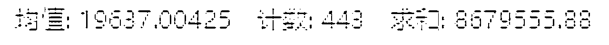

2024 年 1 月 -4 月：602 万

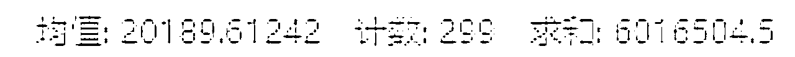

2024 年 5 月 1-18 日：46 万

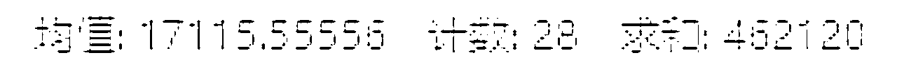

各个项目的客单价和转化率都不同，但基本上都是一万五以上的客单价，像学历、留学等项目，客单能到十万以上甚至更高走，这里也是做个说明。

今年的目标是 2000 万，我们也正在朝这个方向努力，我相信是一定可以实现的！

# **三、流量怎么来**

再来聊聊流量怎么来！

最开始我们的玩法很简单，就是资料引流，整体的转化路径也很清晰：**用户刷到我们的笔记内容-用户感兴趣-用户评论-用户私信我们/我们主动私信用户-索取用户手机号/微信号-录入系统-销售电话销售/微信联系-成交。**

**（1）关于内容**

我们内部，是有一套非常成熟的内容运营方法论的，就是关于内容的**分层运营**。基本上所有的项目，都可以套用这个模式，即 **4+3+2+1** 的模型。

**40%的资料引流内容（引流）+30%的干货&科普内容（涨粉）+20%的话题性内容（做账号权重）+10%的课程种草内容（拿精准线索）**。

这个公式可以套用到几乎所有的教育培训类产品，可谓无往而不利！

这样划分的好处在于：

1、对于平台来说，我们的账号里有 50%的是营销内容，50%不是，也为平台产出了优质的内容；

2、对于用户来说，不全是广告，体验感更好；

3、对于公司来说，有一类线索（10%的课程种草内容），有二类线索（40%的资料引流内容），更加科学化；

4、 对于我们来说，各种形式的内容尝试，也让我们平时的工作不会过于枯燥。

**比如资料引流内容举例：**

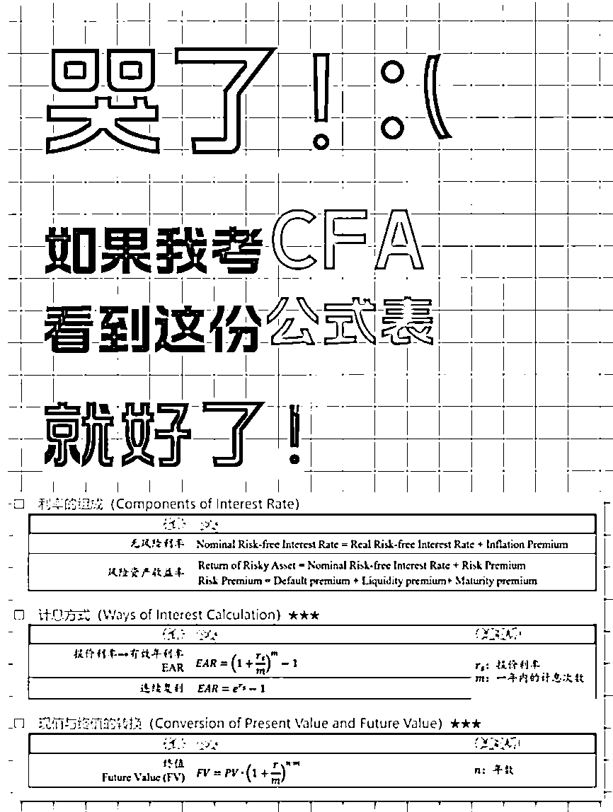

项目关键词+资料截图+话题性话术的形式，其它项目可以直接照抄；

这里多说一句，资料引流的笔记，尾图非常重要，我们当时特意为每个项目都设计了引流的尾图，拿出一张供参考一下：

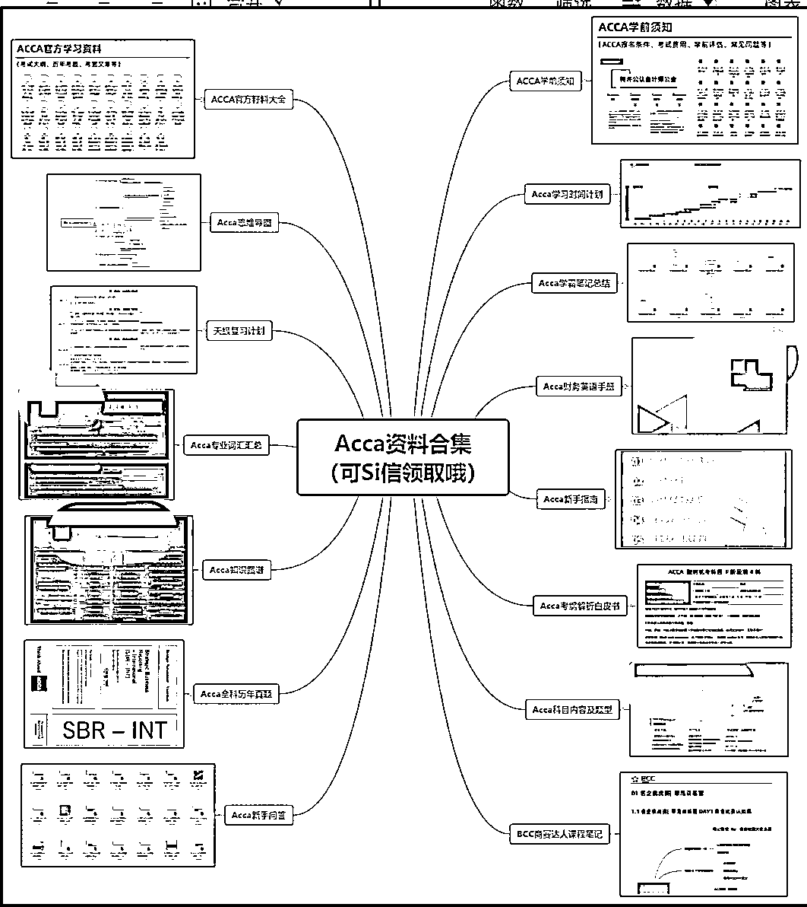

把资料设计成思维导图的形式，给用户的冲击感更强！

**比如干货科普内容举例：**

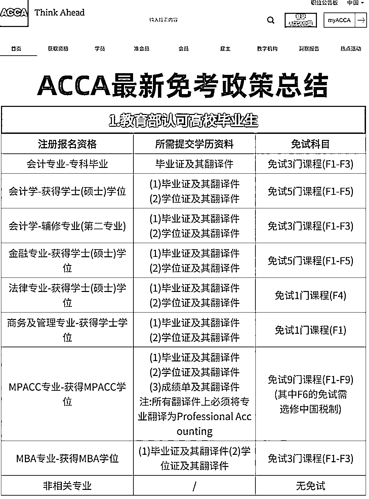

项目的一些关键政策，通过表格的方式整理出来，效果很好；

**比如话题性内容：**

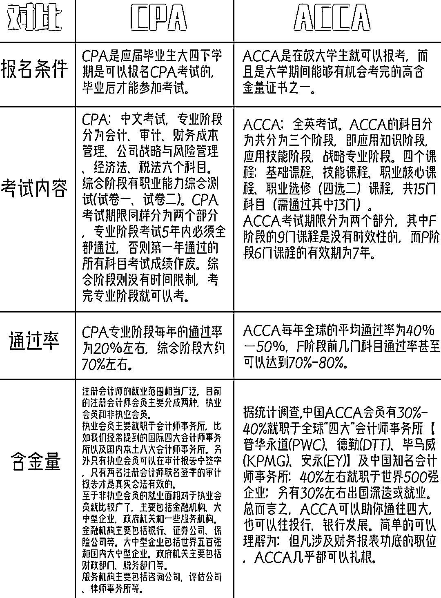

对比两个项目或者证书，同样用表格形式展示出来，引导用户讨论；

**比如种草型内容：**

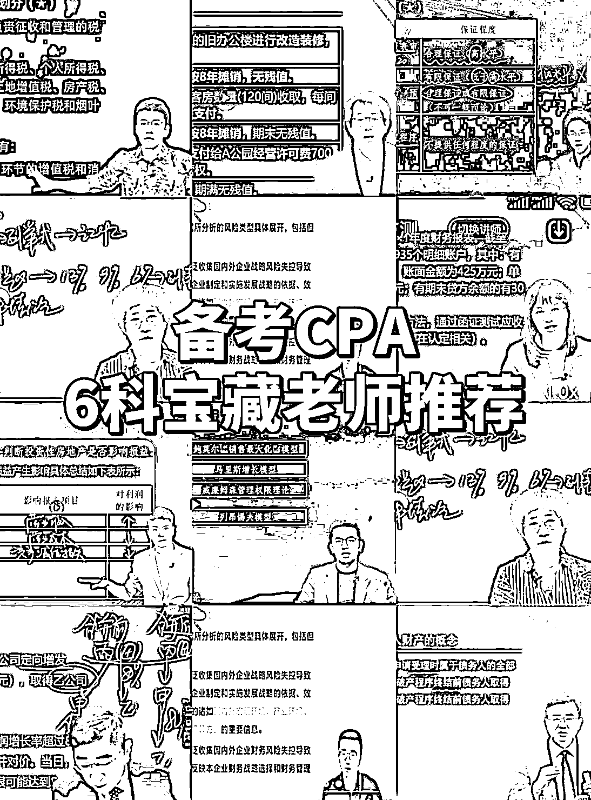

老师推荐的内容，吸引来的客户是非常精准的，这种的线索转化率非常高，供大家参考。

**（2）关于引流**

这里提前讲一下，我们前端营销部门和后端销售部门是各自独立的 2 个部门，中间也会有各种各样的问题，这个后面再说。

**而且我们和许多做小红书的同学不一样的是，我们是找用户要手机号码，然后把线索录入公司的 CRM 系统，而不是把自己的微信发给用户让用户自己来添加，这个要提前说明。**

引流的路径，也经历了从**小程序二维码-直接私信索咨-聚光自建站-聚光投放私信通的迭代和更新**。

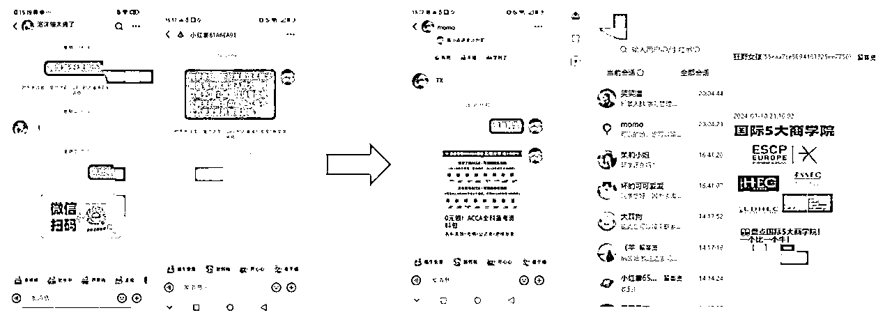

这个引流路径的迭代必须要展开说一下，因为里面真的有很大的坑，尤其是针对小白而言！

首先明确一个共识，为什么我的标题写的是偷，因为确实干的就是偷流量的事情，把小红书这个公域平台的流量，偷到我们自己的私域，然后去做转化，本质上我们的所有动作都是在跟平台对抗，而且官方的机器识别也越来越完善，所以之前的许多玩法现在已经不适用了。

作为小白，我们要做的就是不断的迭代和优化自己的引流方式，不管是最开始的二维码，到谐音字，再到自建站，还是私信通，其实做的都是一件事：尽可能安全的引流。

这里也给大家分享一个非常牛逼的引流方式，不需要开私信通，而是小红书官方的自建站！

这个玩法需要企业认证号并且需要开通聚光后台，但可以不用花钱投放，如果是个人号可以略过：

在小红书聚光后台的工具那一栏，有一个落地页管理：

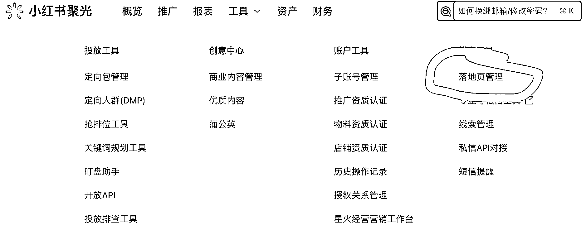

点进去之后，你是可以自己建一个落地页表单的：

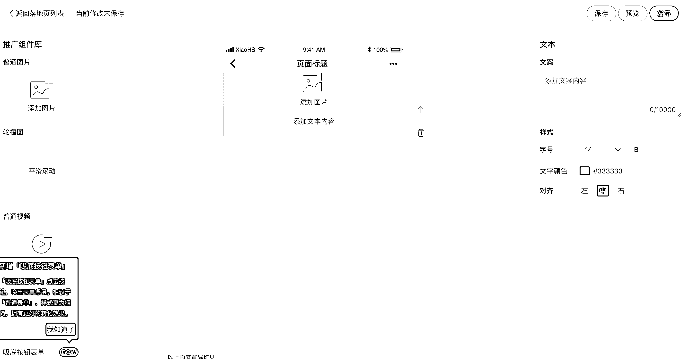

里面可以放一个留咨按钮，用户填完手机号，会直接进入聚光后台，你就相当于拿到了用户的联系方式！

这个链接是可以在小红书后台分享的：

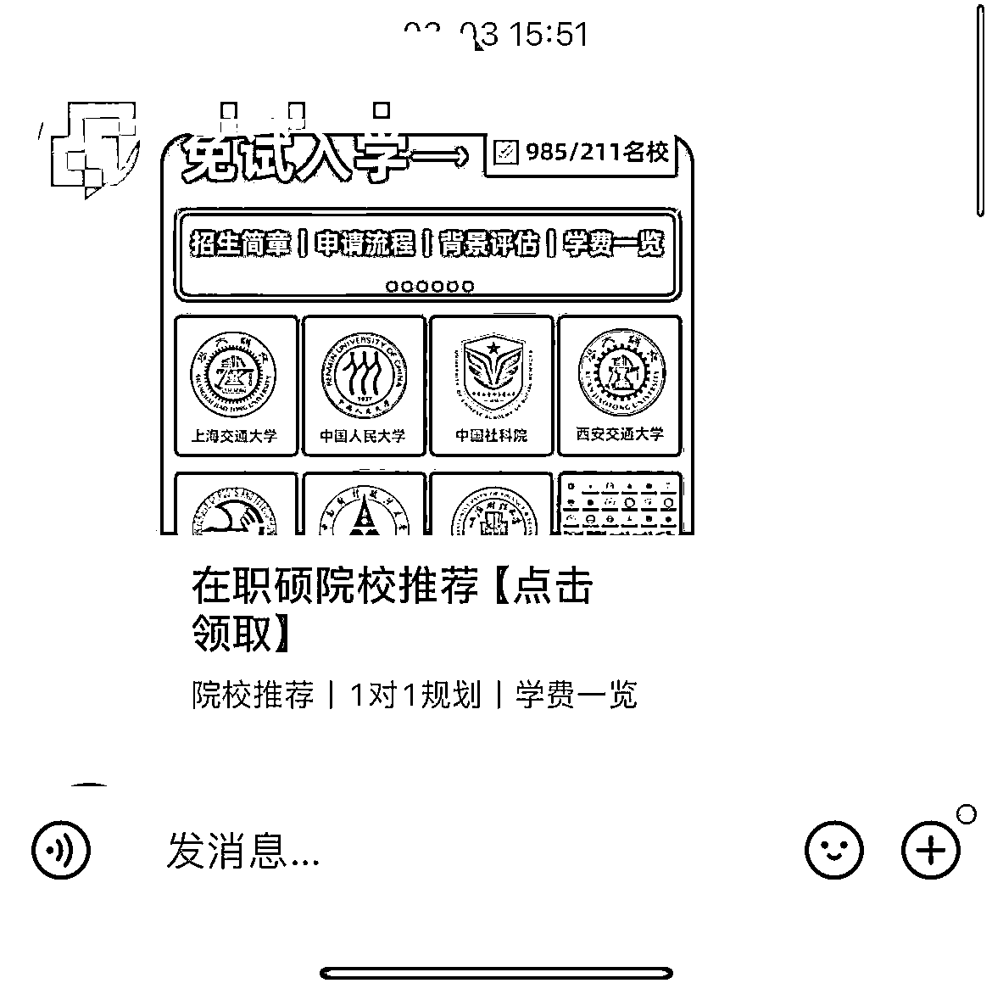

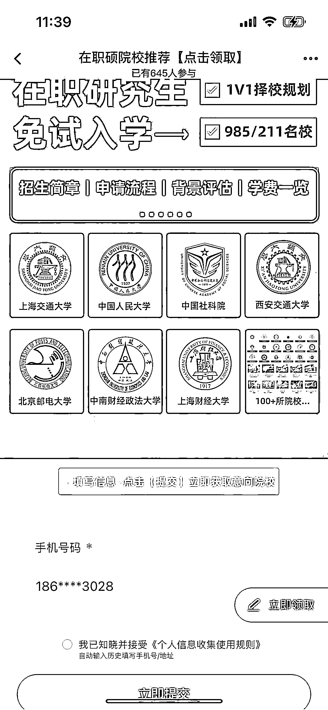

最关键的是，这是小红书官方的链接，你说小红书官方会封自己的链接吗？

所以，这是我们自己测出来的一个安全的留咨玩法，但也有弊端，就是留咨率相对比较低，只有 15%-20%左右，但如果对方已经关注我们了，我们就加一句话术：

“同学您看，看到您在了解在职研究生项目，您可以点击上方的卡片，进去填下，填完扣个 1，我安排老师帮您详细介绍一下哦～”

留咨率就到了 30%左右，所以这个玩法要配合引导用户关注我们，效果更好。

另外，如果你就是为了拿目标用户的手机号码，你也可以做一个自建站，在竞品的评论区盯着，看到有需要的目标客户，直接把链接丢给他，个人号每天可以私信 5 次，认证号是 20 次，也有概率可以拿到不少流量，而且不会被判违规和引流封号。

既然说到引流，就再补充几个目前相对比较安全的引流方式：

① 大号拉小红书社群，小号发微信号引导用户添加；

② 大号公开收藏，收藏的笔记是一篇小号的引流笔记；

③ 大号的简介里@小号，小号发一篇引流笔记；

④ 最安全的当然还是开通官方的聚光投放，并开通私信通功能，就可以正大光明的留手机号和微信号了。

# **四、项目做起来的四个阶段**

**（1）2022 年 9 月 -2022 年 11 月，第一单 CPA，21800 元！**

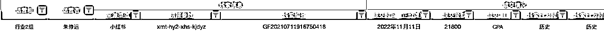

第一单的成单是 CPA，21800 元，是在 22 年的双十一开出来的！（其实我很想把这个成交的笔记找出来，但实在太久找不到了。。。)

这一单告诉我自己，同时也也告诉团队和领导，**这件事可以做。**

因为刚开始，只有 2 个人在跑小红书渠道，很多同事包括领导也不太相信这件事能跑出来，但我确实很适合做从 0-1 的事情，所以就自告奋勇来跑这件事，当然最终的结果也很好。

那个阶段的钩子全部是各个项目的备考资料，因为公司在资料方面，资源比较多，而且也不需要我们去整理，**我们需要做的就是，通过最吸引人的封面和标题，让潜在客户对我们的资料感兴趣，然后要到他们的联系方式。**

**（这个因为涉及到公司机密，故没办法截图给大家看）**

当时的引流是通过一个金数据表单，里面让用户填手机号，然后通过二维码生成器将这个金数据表单生成二维码，把二维码发给用户让用户填写留咨，整体的链路很长。

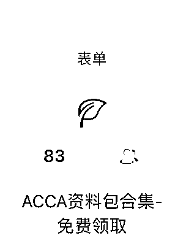

**（2）2022 年 11 月 -2023 年 2 月，初具规模，渠道跑通**

我们从 22 年 9 月跑到 23 年 2 月时，已经有 21 单、26 万的业绩，并且在 2023 年 2 月，当月线索 leads 已经到达月度 400 个的规模了，并且主要做的项目 ACCA、CFA、CPA 都有成单，慢慢有了规模。

那个阶段玩法仍是资料引流，效果还可以，并且在那个时候，我们开始通过谐音字的方式直接要手机/微信了，到了 3 月开学季，也就是我们的行业旺季，就开始让部门其它的小伙伴也开始跑小红书了，慢慢人也越来越多。。

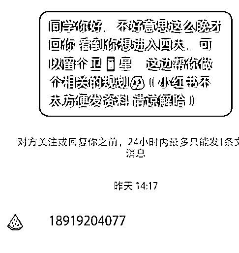

**（3）2023 年 2 月 -4 月，新项目开单，证明项目种草/推荐的玩法可行性**

2023 年 4 月 21 日，第一单学历项目成单，一单 39800 的同等学力项目，这个也证明了在小红书上做教育品类，**玩法上除了资料引流还有项目种草/推荐。**

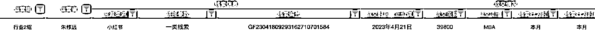

为什么这个时间点很重要？因为这个项目不是通过资料引流，而是**项目推荐/申请实现成交的**，大家可以类比留学，就有点种草的感觉了。

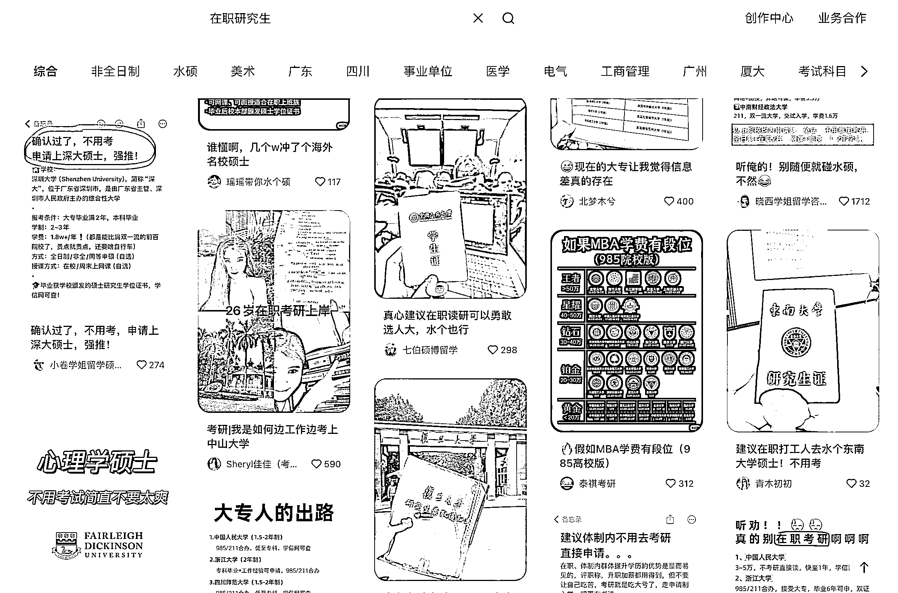

还是同样的原因，笔记不太适合展示，就大概是这样的形式。

这也在团队里树立了一个很重要的观点：**在小红书做教育品类，不一样全部要做资料引流，项目种草、推荐照样可以跑通，同时逼近 4 万的客单价以及短短一周的转化周期，也再次论证小红书的人群确实有很强的付费能力，在团队内部也树立了信心**。

而且我作为团队的 Leader，这个项目的第一单必须是我这边开的，就是要让团队的所有人相信，小红书可以做，并且适合公司的所有项目。

**（4）2023 年 4 月 -2024 年 8 月：免费流不太行，要开始上投放**

这个阶段，我们对公司各个项目的内容策略、引流模式有了清晰的认识，也在 6 月份实现了业绩单月 50 万的规模：

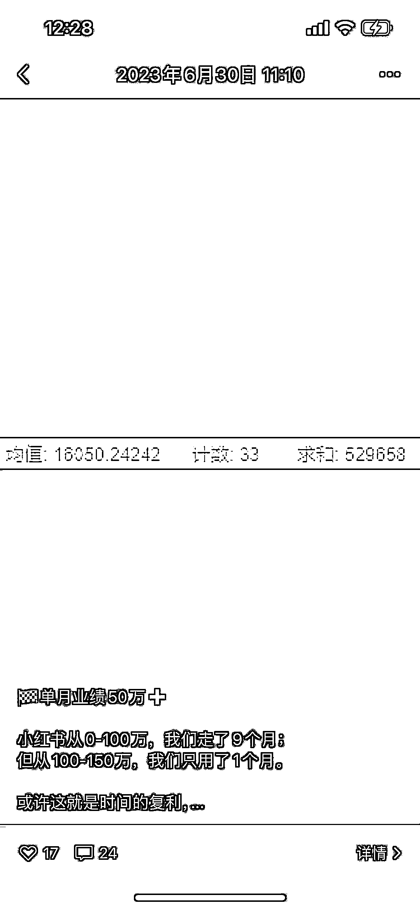

但同时问题也来了，我发现小红书对引流的打击越来越多，也是在那段时间开始，我们开始被频繁的限流封号：

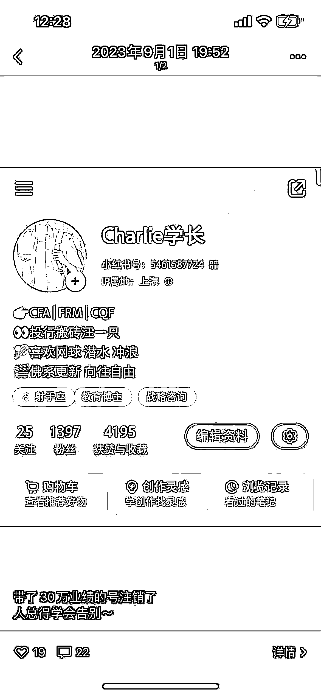

和老板商量了一下，也结合了市面上的同行经验，在 2023 年的 11 月份，我们也正式步入**免费+付费**的全新运营模式，整体的业绩也到了一个很高的体量。

# **五、项目做起来的关键环节**

其实，我们这个项目本质是属于资料引流的范畴，仍然是一种非常好的赚小钱的方式。

比如整理 CPA 的备考资料，引流到私域，卖 19.9 元 -39.9 元，卖完可以再跟机构谈一波 CPS 合作，直接分润，是一个比较好的商业模式（我有认识很多人这么玩的）。

**1、选品：**CPA 的资料有很多，可以在小红书上搜索 CPA，选择用户最关心的资料。另外很重要的是要结合时间节点，比如现在离 CPA 考试还有不到 100 天，冲刺类、模拟题类的资料效果好；

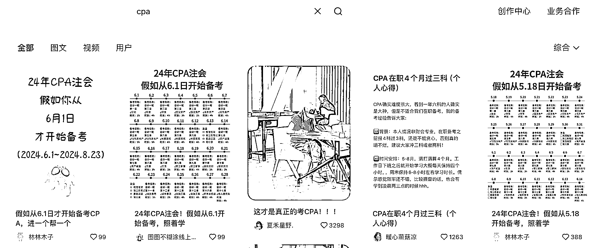

**2、选题：**比如从 6 月 1 日开始备考 CPA，这种有时间节点的内容，很容跑出流量；

**3、引流：**刚才有提到的一些引流方式，不管怎么样，搞到私域里就行；

**4、团队：**如果咱们是小工作室做的话，一个负责前端的内容引流，一个负责后端的私域承接，2 个人甚至 1 个人都搞得定。

如果后面还有和机构合作分成，做私域的直接推给机构就好了。这里也稍微提一下，建议把推过去的线索做成在线文档，让机构的销售跟进时，一定要及时在文档里标注跟进的情况（最后我会再展开讲一下这个点，里面坑真的很多）。

这里多说两句，做教育品类的家人们，就我们前端获客和后端销售，一定一定要打好配合。

你自己的线索一定要跟销售打好配合，告诉销售是从哪条笔记、哪个钩子过来的，方便销售跟进；

同时也要跟销售多交流，知道用户是否愿意付费的点在哪里，是价格、服务、品牌、时间节点等等，哪些因素导致用户不买单，我们在前端也可以做好内容方向的优化。

# **六、项目入局机会和门槛**

**（1）机会**

普通人入局肯定有机会，但 24 年明显没有 22 年和 23 年好做了。

我们从 23 年 11 月已经上聚光，目前整个部门每个月投放花费在 10 万+，整体 ROI 在 1：10 以上，不包含员工成本以及房租等开支，算的话预估在 1：5 左右。

**（2）门槛**

1、废号流非常消耗手机和手机卡，这个需要你提前做好准备，包括不卡顿的手机和月租很少的手机卡，之前我用的是虚拟卡，但现在好像不能用了，大家可以注意一下；

2、如果想投聚光的话，你一定要系统的学习下理论知识，还要熟悉聚光后台，否则一股脑扎进去，非常容易赔钱；

3、普通人后端没有产品承接，需要自己去找机构合作，这里面也有不少的坑，下次有机会再跟大家分享，我的另外一个项目，是如何搞到烧了 2000 多块，搞废 3 个手机号，浪费了 3 个手机，搞了 1000+线索，却一单没有成的。

# **七、经验分享**

**（1）关于类目选择**

如果你要做教育赛道，请尽量选择搜索量大且没有那么多品牌投放的品类，即流量大、竞争小的品类：

下图是小红书官方给出的 4 月份成人教育类的搜索量占比：

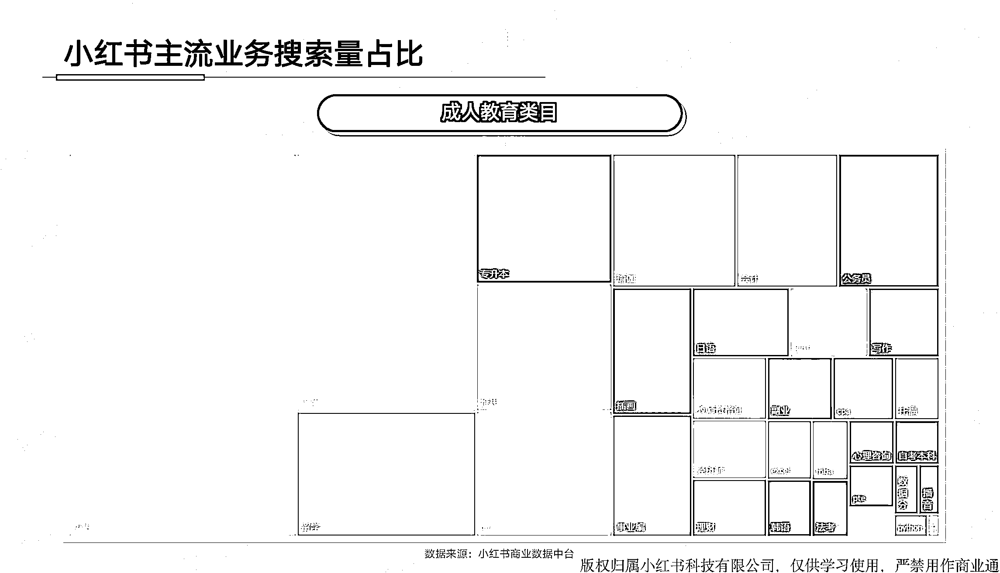

下图是小红书官方给出的成人教育类目的竞争概况：

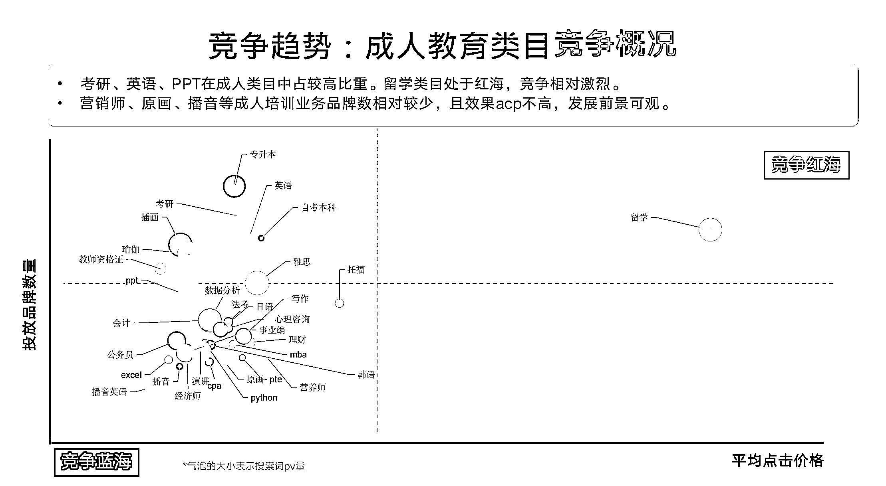

大家对这两张图可以交叉对比看下，我们可以得出结论：

**留学虽然流量很大，但竞争激烈，小白不太适合进入；**

**像会计、教师资格证、公务员培训、Excel 等就属于相对流量大、竞争没那么大的类目，刚开始做小红书的小白，可以从这些类目开始，也更容易出结果！**

另外，每个类目的热点期是不一样的，比如考研的热点是 6-11 月份，属于备考期，也就是说 5 月份你就可以开始做相关的内容了，或者再早一点，年后你就应该开始准备了，如果你在 10 月份才开始做这件事，那只能做临考类的内容。

**（2）关于限流、封号问题**

目前我们遇到的限流和封号问题，95%都属于违规引流，5%可能是关于模仿抄袭，原创度低。

模仿和抄袭的问题相对比较好解决，封面的话可以通过变背景颜色、字体大小、字体颜色等来解决，正文的话可以用 Chat-GPT 解决，这里也分享一个我用的相对比较好的 prompt：

1、我将为你提供一段文案，请先阅读分析，完成后只需要回复“已准备好”，并等待我的下一步指令。以下是文案内容：（复制爆款笔记内容）

2、请将这段文案，用小红书的风格，在不改变原意的前提下进行改写，要求相似度不超过 50%，有 emoji 表情，语言生动有趣

后续生成的文案，再稍微检查一下，基本上就可以用了。

我目前用的工具是文心一言，对我而言，已经够用了。

**（3）关于与机构的合作**

这个点是一定要单独拿出来讲的，小白非常容易踩坑。

如果你现在已经把资料引流这个路径跑通了，想跑出更大的结果，那就大概率会涉及到跟机构的合作分佣。

就拿我比较擅长的学历提升这一块来讲，目前我和机构的合作模式是通过 cps 结算，即把线索直接给到合作机构，机构安排销售跟进。

如果后续成单了给我返点，市面上的返点比例一般是在 10%-20%，正常不会超过 20%，比如一单 39800 的单子，返点 10%，就给你返点 3980 元：

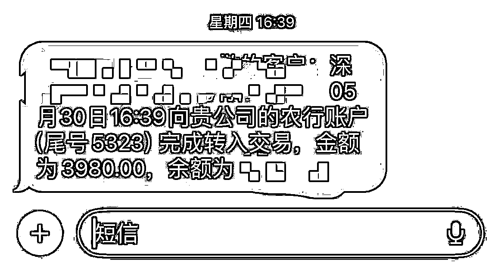

这是我上个月刚收到的打款！

但这种模式有一个非常大的弊端：它建立在你和机构非常熟悉且信任的基础上，因为如果对方藏单（开单了不告诉你），你是很被动的， 因为你不在他们的 crm（客户服务系统）里，所以销售的跟进情况你并不知道。

所以，最开始就一定要跟机构沟通好，首先合同肯定要签订，其次要让让对方给我做一个在线文档，我要看到每一条线索的跟进情况。

当然，合同和在线文档都无法保证对方 100%不会藏单，如果他最开始就有想坑你的决心，那是很难去规避的。

但合同和文档这两个制度会尽可能保证双方的利益。

这里也提 3 点我对机构的判断，满足这 3 点，大概率是靠谱的（任何事没有 100%，供参考）：

1、打款及时（非常非常重要，大家都是为了赚钱的，如果有不及时的一定要找他要，不要不好意思）；

2、定期跟你汇报一段时间内的线索情况，不管是线上还是线下，反馈线索的问题，并和你沟通后续的调整方向和策略；

3、在线文档的更新速度，是否每天都会跟新。

如果满足这 3 点，大概率能判断这个机构不太会坑你。

**（4）最后总结**

最后总结一下，如果在现在这个阶段，想在小红书上大规模获客，**最好也最安全的方式就是上聚光投放**。

可以去加一些小红书官方的人，如果有需要可以联系我，我帮你推荐，他们会告诉你近期的一些平台的动向，包括投放的注意事项，并且还有返点和优惠。

前两天，有个也是做小红书的同学请教我，说现在投放成本贵，投不出去，而且线索少，我是这么回的：

我们做流量的，本身就是在和官方斗智斗勇，这也是这个工作的一部分，用最小的代价，获得最多的客户，就是流量的魅力。

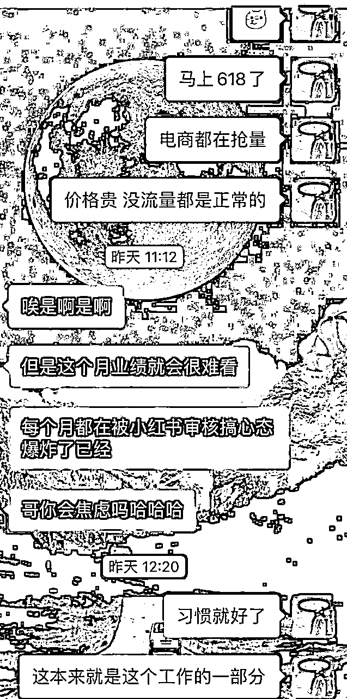

希望大家都能在不忘初心，用心做好内容，加油～

* * *

评论区：

S.K : 学习了[抱拳]
请叫我娃哥 : 谢谢，你觉得有帮助就行[呲牙]
芒果石榴 : 干货！感谢分享[强][强][强]
请叫我娃哥 : 不客气哦，对你有用就好[呲牙]
蔡圆子 : 干货，学习到了很多知识
请叫我娃哥 : 好的，有用就好！
小猪哥（期刊论文） : 娃哥酒吧在哪呢，我去支持一下，顺便想请教小红书的引流技巧[嘿哈]
Young : 学到了！感谢分享🙏

* * *