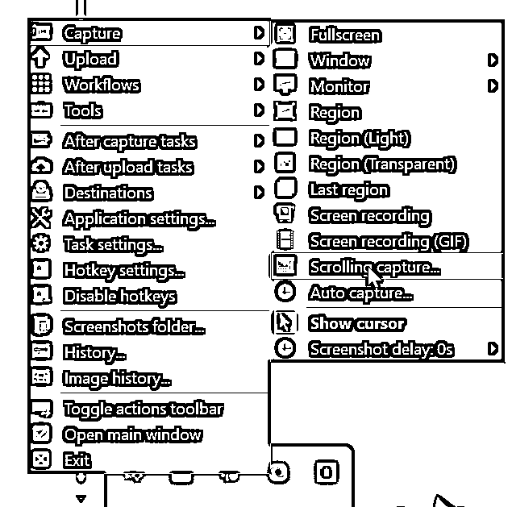

# 小红书新手博主教程长文章内容如何快速排版成图发笔记

> 原文：[`www.yuque.com/for_lazy/zhoubao/nsgvdq318rknxnq6`](https://www.yuque.com/for_lazy/zhoubao/nsgvdq318rknxnq6)

## (60 赞)小红书新手博主教程长文章内容如何快速排版成图发笔记

作者： 持猫

日期：2024-06-07

大家好，我是猫哥，一个普通的 90 后留学中介，目前在哈佛读教育学硕士。

加入生财几年了都没发过贴，因为一直啥也不会，没啥可以分享给大家的😂

这两天摸索出一个适合小红书博主的发文字版图片的方式：直接在文字处理工具里编辑好文字版，之后半自动变成截图，快速发笔记。

本身不复杂，完全一看就能会，可能很多大佬早就会了；但我是刚弄明白，以前都傻乎乎地手动截图，甚至把文字放到图片编辑 app 里手动排版😒

现在这么做快了很多，分享给我和一样的新手博主们。

### **第一步：在飞书（或其他编辑工具）里写内容**

这步我用飞书，因为之后方便管理和修改，而且全程在浏览器里进行，不用打开其他的软件，并且方便添加封面图，让主页看起来更一致。

搞完之后大概这个效果：

### **第二步：调整网页页面**

把浏览器窗口调整成截图需要的宽度，建议用 125%显示，实测 100%在手机上看字有点小

宽度就估算就行，一般飞书里就是标题刚好换行的程度，最后在手机上看比较舒服

### **第三步：调整网页页面**

这步应该有很多可行的工具，我用的是 ShareX，安装之后打开，在系统托盘右键然后选这个滚动截图

然后选择要截图的部分，之后会自动滚动截图， 获得这样一个长图

### **第四步（可选）：简单编辑截图**

直接用系统自带的画图工具打开简单处理，我会删掉一些开头没必要的留白、把被换行的标题放回一行之类的，这个完全可选，可做可不做。

调整前 vs 调整后

重点是末尾，我会把飞书这个尾巴删掉**，另外多留一些空白，留手机一屏左右长度，方便后续自动切图的时候每个图都一样长**。否则会造成最后一个图形状和其他的不一样，上传笔记不美观。

调整前 vs 调整后

此时顺便可以看一下画图里显示的长截图像素：

根据这个之后计算需要的单个截图长度。

### **第五步：在线工具自动分割长截图**

用[在线分割长图片 - 在线超级转换工具 (](https://www.wdku.net/image/imagesplit)[wdku.net](http://wdku.net)[)](https://www.wdku.net/image/imagesplit)自动分割长截图。

因为之前的长截图宽度是 786px，计算一下需要的高度是 786/3x4=1048

、

在参数设置里**选固定高度**，数字填入刚刚计算的 1048，**避开切割文字选择“是”**。

免费转换后下载解压，就是切割好的 3x4 图片了

最后一个空白的横向长条就是刚才留白造成的，直接删掉即可。如果刚才没有编辑图片留白的话，就会导致最后一条带文字的截图长度和别的不一样。

* * *

评论区：

芒果石榴 : 确实不一样
小周 : 是不是，还可以用（公众号排版工具），更方便一些，特别是做图文并茂的更合适。
小鱼 : 学到了
持猫 : 其实可以的 不过我用最简单的就够了哈哈哈多了感觉很麻烦 我其实只要能加粗就够用了
戴巍 : 哈佛[强][强][强]
简西 : 非常有用
东篱 : 有用
尤鑫玉 : 为啥我电脑截图文字，一直像素不高呢[皱眉]

* * *