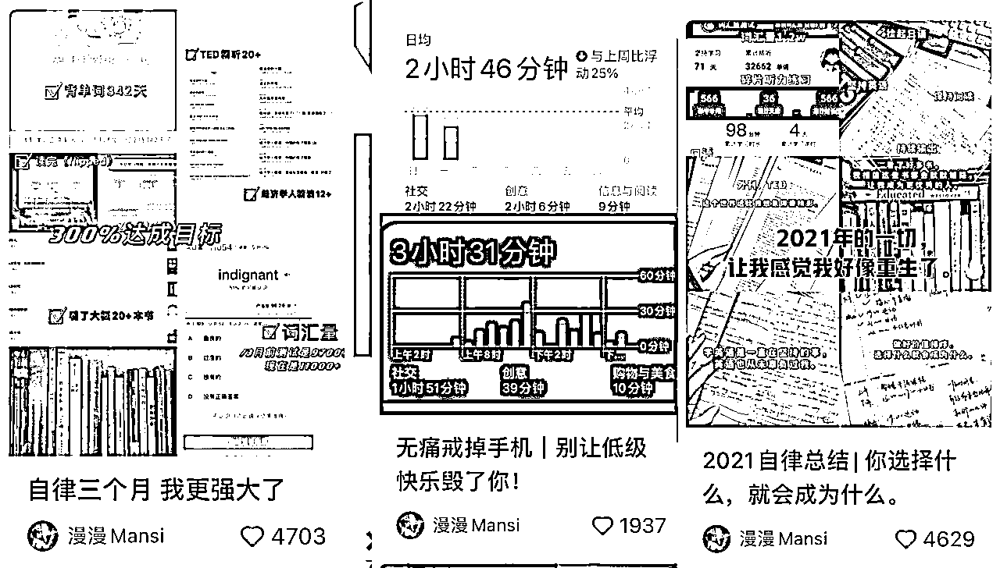
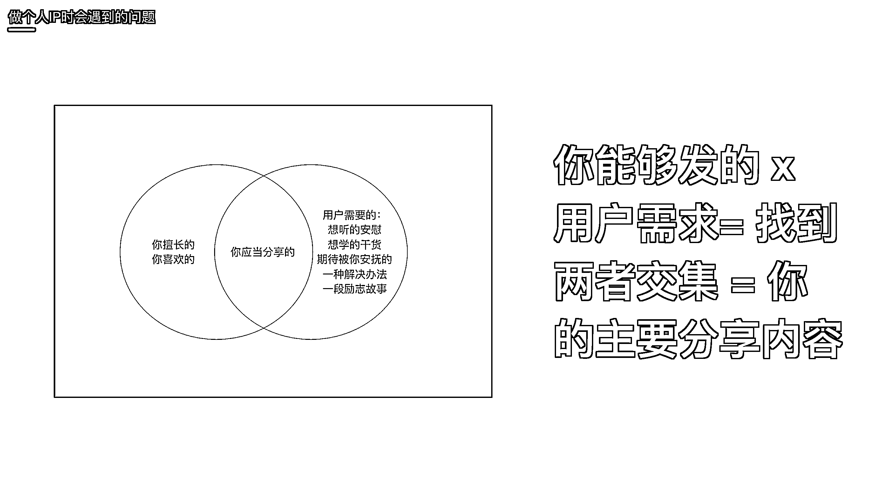
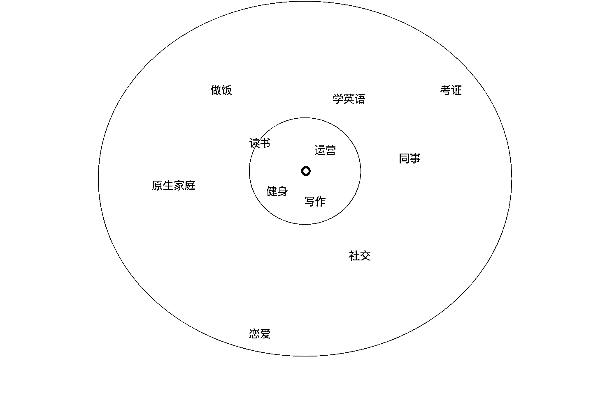
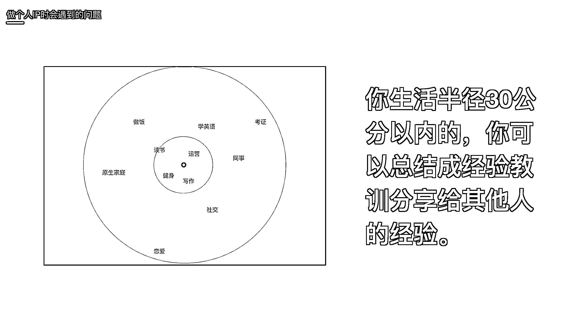
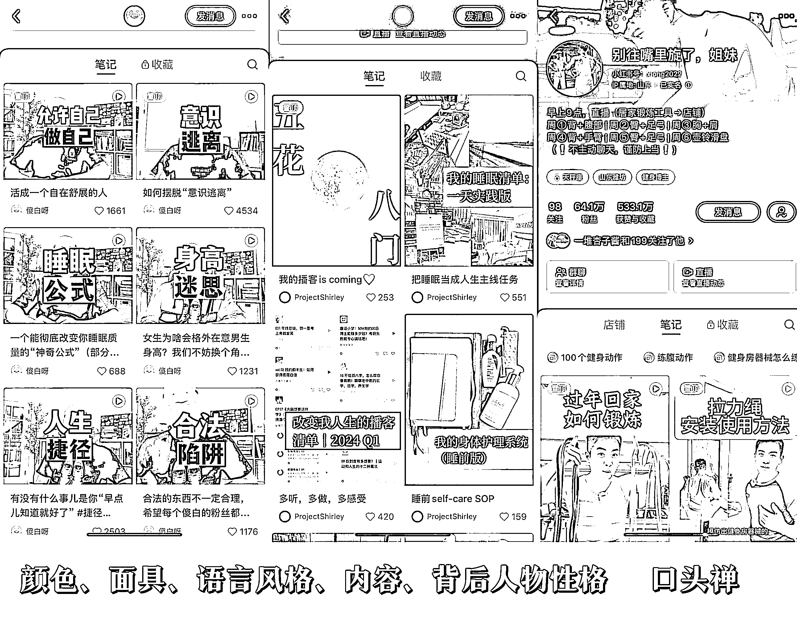

# 小红书 34 万粉丝，一年商业化变现百万：普通人做个人 IP 到变现路径闭环

> 原文：[`www.yuque.com/for_lazy/zhoubao/owstb8swhr02o3fu`](https://www.yuque.com/for_lazy/zhoubao/owstb8swhr02o3fu)

## (45 赞)小红书 34 万粉丝，一年商业化变现百万：普通人做个人 IP 到变现路径闭环

作者： 漫漫 mansi

日期：2024-06-04

哈喽，大家好，我是漫漫，目前是一名小红书的 34 万粉的博主，加入生财一年多了，之前有分享过一次我从 0 涨粉到 30 万的个人 IP 起号复盘。[`t.zsxq.com/EV6AP`](https://t.zsxq.com/EV6AP)

这次分享的 2.0 版本，改进了：

1\. 这一次经过一年的成长，我知道了更为底层的用户心理、商业逻辑、算法机制。以及我自己做了一些小红书课程带领一些人做了号，对一些个人 IP 更关键的节点更清楚了。

2.去年开始做商业化，跑通了几个变现的路径，这一部分新增进来。

接下来就是我的分享了，谢谢大家，希望大家多给我点赞～并且留言大家想要知道的问题，我在看到之后会尽力回复，如果不回复说明有些情况可能有些复杂我可能不足以一下解决。感谢大家。

阅读这篇文章有两种形式

1.方便用飞书阅读的可以直接用飞书阅读，比较方便跳转目录，这个链接是飞书链接 ：  [`xtwwuii5ub.feishu.cn/docx/RbjwdF4e8oxEk8x4aWNc3KHhnmf`](https://xtwwuii5ub.feishu.cn/docx/RbjwdF4e8oxEk8x4aWNc3KHhnmf)

2.不方便飞书的直接在星球阅读，以下也是这篇文章的全文：

# 我的个人账号情况：

我做的是知识领域，主要发表的内容是把我的学习成长经历总结提炼出对应的方法干货心得分享出去，包括我在实现这些目标过程中遇到的各种学习方法、情绪、人际等方面的问题以及我是如何克服这些问题的解决办法。

大概是从 2020 年 12 月开始做小红书。 12 月底的时候拿到了雅思分数，然后当时就 po 上去了，自己的雅思分数，起了一个搞笑、根据自己的网感起了个标题就叫《雅思考了 8 分，但是依然不能够出国留学》一下子就有了几千点赞。

但是后续不知道该怎么做，在漫长的时间里有尝试去发一些美妆等内容，（因为当时以为小红书就是一个分享美妆这些的比较多），也没有任何点赞量。

（现在回想起来当时那篇笔记下面很多人让我出学习方法，我当时就应该直接照着他们的需求去出内容的哈哈，也就是根据用户需求出选题）

2021 年 5 月 3 万粉左右，2022 年 5 月我记得大概就 20 万粉啦。后来就是一直缓慢持续在涨粉。

## 很多人问我，我一开始是怎么想到要小红书。其实我的目的很单纯，

### 一、增强个人背书， 增强求职竞争力。

（1）一是为了增加我找工作的筹码。 我的本科和研究生专业是一个比较小众冷门的文科专业， 我不太想找本专业的工作，因为薪资可能会比较低。我想要找互联网运营相关的工作，有几个原因，

（2）一是**互联网运营的这些工作其实是一个离钱很近的工作**，**运营其实是一个产品和发售中间的这个环节，运营的概念简单来说就是想方设法把产品卖出去，偶尔要和产品 battle 反馈用户需求，偶尔要去大量了解用户的需求然后调整运营策略。**

我们经常在说「小红书运营」，也就是想方设法把我们的图文让别人看得到，把我们想要传递的东西传递出去让别人看到。根据用户的反馈来调整，用户想要看到什么样的内容，我们就去调整成为他们喜欢的形式，当然那个产品核心也就是我们本身拥有的认知可能是不变的，我们是要根据用户的反馈去调整配色配图标题风格等。

**所以这个环节很有上帝视角，在这个环节将产品和用户端都连接和了解，了解一个业务线几乎完整的闭环，对做生意/副业/赚钱都有好处。**

（3）一方面是没有技术门槛，工作上没有一个标准答案，可以适度的发挥一定的创意，力求做到更好， 容错率比较高。

**运营确实是一个没有标准答案的岗位.每个用户都是具体的人，每个人考虑问题都会有很多细节的因素。**

比如我们永远都无法有一个最完美的文章，没有一个绝对完美的文章公式。有的人可能这篇文案写得很好、总体的框架没有任何问题，思路清晰、逻辑又很强。可能就是差一点情绪。那什么样的情绪才能打动什么样的人呢？每个人情绪诉求又不一样。

这个都是没有标准答案的，我们都可以发挥自己的创意，都可以跟自己结合，我们只需要力求做到最好就好了。**永远可以更好。**

（4）一方面是我本科的时候有做过自媒体运营的经历。

做小红书，是因为做小红书是一个没有准入门槛的事情，不需要经济成本，没有时间束缚随时可以开始做，而且在这个过程中没有人给你布置确切的 KPI，我们可以自己按照自己的节奏去调整和成长。

### 二、倒逼自己输入

但是我能持续不断地坚持下去，确实是因为在这个过程中获得的非常多的正反馈。

一方面是自己个人成长，在这个过程中，我在持续不断地倒逼自己总结我的经验和方法， 不懂的不够熟练的技能就学习和补充，完善了我的个人知识体系，我自己得到了很多的成长，

其次就是我真的从做小红书中获得了金钱的回报，和粉丝的喜欢，这也是一个很重要的动力。

## **个人 IP 到底有什么价值？（这里特指商业价值）**

今年我依然在基于我的个人 IP 做一些后续的影响力扩大、开发自己的课程产品等等。

从做一个博主，到做一个知识付费产品的开发，从一个人到一个团队到一家公司，到现在认识很多朋友，工作上的伙伴合作上的资源

IP 的价值在于：

**01 节省营销成本 扩大收入**

很多创始人直接拥有自己的 IP 之后省去了代言费，比如前段时间的小米汽车。比如你们看到很多品牌的老板、app 的开发者、店铺主理人等等都下场做自媒体开自己的账号。

比如我个人就是一个 IP。不需要再去找别人帮我推广我的自媒体课程、英语资料、学习方法。而且粉丝认识我认可我，购买我的产品。

**02 IP 可以带来更多的商业价值。**

**IP 贵，IP 带的产品就贵。**

市面上相似的、好的产品很多很多， 为什么有的卖得贵？有的卖得便宜呢？其实大家很大程度上是冲着生产这个产品的品牌负责人或者是品牌本身的 IP。

比如说别人卖 200 块钱东西，你可以卖 400 块钱或者更高。比如我现在卖的读书会，因为我的产品我的同学们大学生会比较多一点，所以我卖得比较便宜。但是市面上很多同类产品会售价在 1000 左右。以及很多博主训练营在 3000+单价。粉丝量级越大的博主喊的价格越高，课程质量虽然有差别，但溢价程度很大也是基于 IP 知名度。（我还要说一句我的课程质量比**很多**几千的课程和社群要好多了！！！，只是因为粉丝大部分为大学生所以才价格低一些）

**1000 个铁粉定律。**

很多人说帐号长粉量比较小，只有几千个不到万粉怎么办？人 常说的一个叫做 1000 铁粉定律，1000 个粉丝，每个人这一生为你付费 10,000，可以有 1000 万的收入。甚至有的人他的 IP 可能不止卖到一万，他可能不止从这 1000 个人这一生中收到一万，可能价值更高。

**03 个人 IP 就是一个作品集，一个个人品牌展示。**

很多现在 boss HR 都直接在小红书找员工。很多人也直接在小红书上 po 自己的简历找工作。

如果你在小红书发布自己关于某个行业的认知，是确确实实能被人看到的。

比如你擅长运用，经常在小红书上发布自己关于运营的理解和案例分析，有一天应聘一个运营，可以直接用小红书上展示你的能力。比你在简历上写什么、口头说的更有信服力。

**04 小红书鼓励个人生活记录与分享。**

至少小红书这个平台一直在强调的是记录生活，帮助普通人改变生活。他的算法也不是只推送你关注的人，而是会根据你的 tag 推送那些你可能喜欢的内容，也就是说，每个人都有被推送被看到的可能的可能，甚至比高量级账号更容易被送到首页。而且这一点也从小红书流量机制上能体现出来，新人入驻时都会有额外的流量扶持。

所以（1）抓住新人扶持期，猛猛发笔记。（2）很多人会问我「**一个旧的账号还能不能接着做」**的时候我会跟他讲说新人入驻的时候是会有流量扶持的，如果你这个旧的账号没有太多的价值，比如你这个账号之前发过很乱的一些笔记内容没有多少粉丝量，可能有个一两千或者三四千的粉丝量，但是你的内容是很乱的，也没有长尾的流量也没有再持续涨粉了。那么你很有你可以把这个号直接注销掉。因为这个账号可能不如你重新注册一个新号拿到的流量红利大。

## 大部分人对做个人 IP 都很感兴趣，但是做的时候会有很多误区

比如有些人只追求选题，到处找灵感，盲目对标甚至抄袭，

有些人内容干巴巴的没有可读性。

有人来找我问我自己做了很多爆款，但为什么不涨粉？

因为比起形式上的图文做法，我觉得内心对个人 IP 的认识更重要。也就是心法要比做法还要重要一些。

什么是心法呢？大概就是目的、价值观，需要形成观念。

而做法可以方便复制的，虽然也需要去理解和感受。比如热门标题的起法、文章的结构框架。但我觉得做个人 IP 上心法比做法能珍贵。

我会始终强调的是，**做个人 IP 其实就是做自己，首先，你有能量有价值，别人自然会关注你，跟随你，喜欢你。**

**其次，小红书是我们把自己的能量和价值展现出来的一个平台。只不过要**以用户、观众会喜欢的形式，把我们想传递的东西传递得更好让他们接受，比如说把图文做得更好看一点，把文章结构写得更清晰，视频剪辑更流畅更活泼一点等等。

**所以首先，自己在成长，才能持续不断地输出内容；表达你的观点而非迎合他人，才能收获共鸣；分享你真正理解和擅长的，才能帮助到你可以帮助的人；做你自己总结你自己分享你自己，你才能在小红书玩得舒服；然后以用户喜欢的方式呈现内容。**

**我们常说的，干货价值和情绪价值。也很好理解。观众会关注你，因为你给他们提供了一些切实可行的方法。或者相信你会给他们提供方法。**

**而情绪价值在于，关注你并不完全是成就，而是你的人格魅力，你自己生命中最有勇气和力量瞬间让他们看到了希望。所以多讲讲你如何克服困难的故事激励他们。**

做内容是要传递自己的价值观和情绪，如果我们大量地去追求表面上的细节东西，比如说模板，比如说热门的标题的写法，这些东西的话就会造成大量的重复，而且你感觉自己一直在抄袭，一直没有进步，但是我们经常说的利他这个东西是要找到自己真正想要分享的原因，就是「我真的很想帮助你，我真的很想要去把这个东西告诉你，跟你交流」，在这样子、带着这样的目的去分享的时候，我们的语言会自发地变得是为用户在考虑，用户就自然能够感受到你的利他性。

当然，做法也很重要很重要，这个我们也需要用漫长地时间去学习。

那么接下来我的内容会将心法和做法结合，尽量让大家理解做 IP 的出发点。这样才能更好地实践。

## 那么接下来我来给大家详细地分析一下做个人 ip 大家会遇到的几个问题

### 很多人会问我，没有这么厉害的经历怎么办？

#### （1）**【信息差无处不在】**

其实有很多你以为你知道别人也会知道的事情，别人可能并不知道，其实很多事情你没有意识到你是稀缺的掌握资源者。

01 大家有没有刷到过之前有一个账号是「教大家如何坐公交、第一次坐飞机的流程」等等。这个账号火的时候很多人都觉得：这都能火吗？但实际上就是有很多人不知道怎么坐公交。

她可能是因为自己遇到某个不会坐公交的朋友，意识到很多人也不会坐公交，于是就有了这个选题。发完这个内容后引发了很多评论区的共鸣，很多人在下面评论说想要看更多基础生活科普，比如很多人说自己不会坐飞机，她接着就出如何坐飞机的内容。

多刷一些小红书，就会发现很多科普博主科普的都是我们很多人知道的事情，但是实际上很多人确实不知道这些事情。

02 现在互联网上有非常多这种教大家一些基本的生存模式，就比如说大学生，很多人不会不知道什么是第三方，求职要不要签第三方？什么是第三方？租房应该注意哪一些事情？如果你现在是一个刚毕业的大学生，刚进入职场一年，那么你是有过这样的一些经历的，你就可以完全去把这些内容做成你的小红书账号的内容，就比如说毕业生第一次租房要注意什么。因为有些城市它是有毕业生补贴的，租房补贴，有些城市是有毕业生租房的优惠，租房的时候可以免押金等等，或是第一个月减免等等，对吧？还有比如说大学生签要不要签第三方？第三方是什么东西？然后呢？怎么交水电费？怎么就是都是很多的？怎么交医保、社保怎么去计算？这些都是很多大学生不知道的东西，如果你刚好知道这些东西，你可以分享出来，我相信你的这个账号的数据会很好，因为有很多大学生是不知道这些东西的。

03 我在做大学系列内容的时候，也是突然意识到，很多人读大学其实是一头雾水的，不知道大学到底要干嘛，而我恰好过了一个丰富的大学，所以我可以分享出来，让更多人知道还有很多事情可以做。

我其实本科拿的荣誉说起来真的不算什么，基本上都是一些二等奖、三等奖安慰奖之类的，我做小红书一直有很多人喷我，我是二本考研 985 的，喷我本科二本来分享考研经验和英语方法。但是他们不知道的是，有很多的比我基础更差的人他们就是想要看我是怎么考上研的，而不是去看那些本来就是 985 的人怎么去考 985。

作为一个曾经的学渣，我也更清楚为什么大部分人学不好，以及到底要该怎么样从小白一步一步学好。

所以我写的那些干货类的知识分享每一篇数据都很高很高，按照我的学习方法，也有很多跟我报喜～

04 我的很多粉丝，二本找到了大厂岗位的，在小红书上分享二本如何求职，和 985 毕业学生的求职思路也会不同。

非英专生找到了外贸工作可以教大家如何求职。

考研失败找到工作的可以分享自己调节心态的方法。

#### （2）**大部分人都是普通人，大部分人都想看普通的最基础的生活方式。**

**你知道的，其实别人真不一定知道。并且别人真的很渴望知道。**

我在小红书的简介是**「普通人的经验或许比天才的方法论更适合你」**

每个人都是普通人， 无非就是想获得一些共鸣，看到那个人身上有自己的影子，他的过去式我的现在那么我想成为他的，现在我要从他身上学习按通过模仿他而成为他。

大家关注我是为了看我是怎么坐小红书的别人关注你，也可能是为了看你是怎么样学会一个东西，我们每个人都有被关注的价值。

**从普通人的角度出发，去写自己为什么要这么做、做的过程中经历了什么，能引起更多的共鸣。**而且我刚做小红书，很多人后来跟我说，我的封面非常粗糙，以至于他不想点进去，但恰恰，很多人就是能记住我的封面，我那平平无奇但全是我的证书、我的学习记录的封面，反而是我特征的一种。

很多地方在拆解我的账号的时候，甚至也会说，这就是我的一个个人特色，我和其他把封面做得特别漂亮的博主是不一样的，但我的封面也能让你一眼看到就知道是我，这就是我的个人特色。而且我的封面都是实际经历，实拍。我封面里记录的那些奖状、证书，参加比赛的照片。图书馆一个人学习、聊天记录等等，是真实的我，独特的我，但是又能引起大家的讨论。而且我真实分享的经历也能引起大家的讨论。大家可以刻意制造一个可以被讨论的点，这样笔记热度也会更上去。

**能引起共鸣，因为很多人都经历过。**

**如果你现在是某个领域、技能的初学者，也会引起很多人的共鸣的，一起讨论、一起学习。然后我的学习、考试、性格（价值观态度）等等，全部都在我的笔记里可以体现出来，所以才形成了一个立体的我。**

**一个普通人是如何战胜困难的心路历程才是其他更多普通人想要知道的。每个人都想从自己可以模仿的人身上寻到一种出路。**

任何你觉得自己做的还不错的，不需要跟别人比较，就你自己觉得擅长的，分享试试看。

做自己，把选择权交给用户。

#### 先分享一下，你会变得逐渐越来越认可自己。

即使你现在不认可自己，你做着做着就会认可自己的，因为真的会有很多人来告诉你你有多好。

即使我最开始做的时候，我自己也会觉得我跟我的同学们相比起来很差，因为我本科学历不高，因为我入学的时候很多东西都不会。但是我做着就会有很多人来认可我，很多人会告诉我说我对他们产生了怎样的帮助，即使我是只有 70 分的人（从世俗评价角度而非做人的角度），依然会有比我成绩更差的人可能想要成为我这样。

我反复强调的是做真实的自己，要分享你的经验你的你的努力前提是你确实是付出实质性的努力。

刚考上研的时候，我其实没有考英语。我就只有一个考研的经历，我本科的时候的所有的经验全部都是二等奖三等奖，没有很厉害的经历，但是我做着就会有很多，他们可能比我的成绩更差一点的人来告诉我说我很好。然后被他们鼓励的过程中我。为了让自己变得更对得起大家的信任，我就不停的去做，不停的做，然后慢慢的我真的积累了更多。付出了更多实质性的努力，变成了更好的自己，

## 做成长号，比干货号可能更有价值。

#### 因为用户参与了你成长的过程，你们的情感绑定远深于观众和表演的关系。

如果大家觉得自己没有厉害的经历，可以去考虑去做成长号。其实做成长号比做个人比做干货号更有价值，因为成长号它就是随着我们个人 IP 的成长，在不断的呈现自己的整个路程。

我自己是通过做小红书倒逼自己掌握了非常多的技能，我在一开始做内容的时候非常简单，就只做记录。我当时每天学了什么东西？我当时每天看的书，拍个照片，我的学习的记录的打卡。然后手机屏幕使用时间打卡的时间。我的读书笔记等等，就是一些这样简单的拼接，如果说大家想要做成长、知识类的话，完全可以参考我这个模式，今天应该学了什么，拍个照片就好了。放在首页上放在图片上大概。做的稍微好看一点，对一开始不会就先记录打卡，大概先按照这个形式去记录，封面统一一下比例和配色就差不多了。

通过做小红书，我倒逼自己掌握了非常多的技能，我的粉丝是看着我从研二分享过往的考研经历，到我后来一边学英语一边总结英语干货，到后来我努力学习求职技巧，分享求职经验， 再后来我创业总结我的赚钱搞钱经验。

记录我今天为了找这份工作，我是怎么改简历的思路是怎么样的，投简历的思路是怎么样的？后面到我入职的时候怎么去协调我和 leader 之间的关系怎么去处理我的实习和。学校的学习以及生活上的各个时间管理的内容，我就是分享我的生活里面我正在经历的，我遇到的问题，我是如何解决那些问题的。

做一个简单的记录和打卡。分享我通过学什么东西让我产生了什么改变等等。每一个阶段都会有不同的进步。

**但关注我的人，他们就是围观了我整个的成长的过程。**

很多人从三年前就认识我到现在，我也收到很多人的消息跟我说关注我好几年啦，看到我的成长，自己也跟着我成长了很多。

对我来说，我在总结我的经验， 是对我自己知识体系的构建和完善。

我在分享我学了什么通过什么方法，让我产生了什么改变。

关注我的人，他们参与了我整个成长的过程。

比起纯粹的「知识号」， 我和我的粉丝之间的情感共鸣和链接更强，即使我有过失败，有过沮丧，这些都不重要，因为他们参与其中，是和我站在一起的。

我给大家的建议是：要**持续不断地记录复盘这段时间你的改变，比如你找到了解决问题的方法，并且还可以把之前的情况和现在情况做一下对比。**

如果你想要做一个成长号，**从零开始做的话可以做一些特殊的选题活动，比如：100 天挑战赚多少钱攒多少钱、或减肥多少斤、100 天学会什么每天学习记录。**

**你自己能够进步，其他人也能看到你的成长。 无论你是否成功，只要在展示，只要你付出了实质的行动，用户都参与了。**

**这就是影响力。做 IP 就是做影响力。**

影响到一个人，哪怕只有。十秒钟让他当下非常的有想要跟你一起参与做事情的。那种激情也是影响到他，你对他产生的那一瞬间的情愫。当时也会牢牢的在他的脑海里面形成一个深刻的印象。这是你的印象，你下次看到他看到的时候他依然知道是你。

最成功的 IP 是**不管在哪个平台，用户看到你的名字，他就知道是你。他看到你这个人，他能够想象到你之前带给他的那些情愫，不管以什么形式，都愿意为你这个人付费。**

有很多大 V 被封号了，有可能做了一些什么不太合适的，或者是跟 MCN 有了任何的问题，他们被封号了。但是他不管出现在哪个平台。你依然知道是他？这是最成功的一批 IP。因为用户参与的过程，因为因为用户。和他之间有情感链接。在我看来，**追索欣赏喜欢的情感是比干货更重要的东西。**

#### **但一定要注意的是：做真实的自己。**

我们不能做一个虚假的人设，走得不好看，也根本走不长远。即使不做 IP，你做干货，你就得真的会，不然你总是抄袭，没有自己的思考，依然也是走不长远的。

不能为了分享而夸大自己对知识的掌握程度哦。

如果是编的。大家一定能够认识意识到你是编的，你做的也不开心。抄袭的就更不好了。

**真实发生的事情才会让你注意到细节。**

大家很多人可能都会有做饭的经验，电视剧里面的编剧，每次写描述一个人不会做饭的场景的时候总是会写盐放多了，但是真的做过饭，真的做饭做的很难吃的人，你比如说我就会遇到很多问题。比如说不会腌肉、肉非常的腥味，不会择菜、把菜全煮了等等这样的，这些问题才是生活中的细节，是很多普通人真正需要去解决的问题，而不是盐放多了。

比如在写作上，如果一个人是虚构的经历， 描述是错误词汇重点放在对客观事物的描述上，如果真实发生的话，重点会放在自己的感受上。比如描述一个你喜欢的地方，虚构出来的人大概率会描述这个地方客观看上去是怎样的。真实有感触的人会主动强调那个地方带给自己的感受是怎样的。

**真的有过这样的经历，真的做过这些事情，你才会知道每一个需要去解决的细节到底是什么，而不是想象出来构建出来的。**

（除非你的写作能力非常强，非常懂得用户心理，能够构建一个场景并且描述出来。这个技能其实也是可以锻炼出来的。从写作角度可以实现但是在输出知识和观点这个角度上，我建议咱们道德底线还是要高一点～）

### 问题 2:很多人总说不知道写什么，没有选题

接着上面的分享，我想说的是“你的选题就是你自己本身的经历”，所以其实我们只需要多去挖掘自己可以帮到别人的点。

其次大家一定要注意，选题甚至比你写作能力要重要。因为选题的意思是你的用户需不需要，只要他们可能是需要内容，那么你文章写得丑一点也没关系。

### （1）先发你擅长的 ，你的经验，然后让用户推着你的选题往前走。

我最开始是发雅思，后来我发雅思的时候就说，因为我学英语学得很好，所以这个学英语考雅思的经历帮我考研的时候四个月就上岸了。

然后很多人就问我说你是怎么考研的呀？我发现，诶，原来大家想听这个怎么考研的？我就开始去写关于考研我怎么上来的内容。

然后考研的时候我就必不可少地会提到我之前参加过很多比赛，这些东西对考研来讲是非常重要的，于是我我就去分享我是怎么样去拿到这些奖的等等。

我开始不停地去观察我的用户的评论区，观察我的评论区、我的私信用户，甚至用户点开他们的收藏夹，他们收藏夹里面一定包含着他们的需求，他们想要看到的内容。

我的选题源源不断，点赞量也源源不断。

你的选题都藏在你的评论区，也就是你的用户的评论、私信，以及你的用户的收藏夹里。

很多人做 IP 都会盯着竞争对手，我之前也这么做过，但是后来我发现很没有意义，盯着竞争对手，人家做的内容我不一定擅长，我擅长的，又很容易被影响，脑子里都是人家的文章观点和框架。不如从评论区找用户需求，然后看看我能回答哪些就回答哪些。

做自媒体就是把你擅长的那部分经验分享给别人。然后用户的需求推着我们走，直到最后找到一个这样的交集：我们擅长的内容，我擅长的内容和用户需要的的交集。变成我们之后需要保持分享的。

所以，拆解**你擅长的，或者你热爱的，找到擅长的 x 热爱的交集作为你的初始分享内容。**

不能 2 部分的交集，或者你就单纯分享你擅长的，因为做自媒体就是分享经验，你得分享的内容对人家有价值才行啊。

### （2）什么拯救你，你就拿什么拯救别人

你觉得你人生中比较重要的经历、让你发生重大改变的事件、人、一次思想观念的变化是什么？如何改变了你，在此之前你是怎样的，之后又是怎样的。

提取一些这些时刻，然后分享这些时刻是如何帮助你的。

**什么是对自己有用的，可以把这个有用的观点/道理/技能分享出去给别人。**

然后，你就可以**帮助曾经的自己、帮目前处于你曾经那个阶段的人。**

在做小红书博主写文章的时候，我时常想，**如果我处于那个阶段时有人对我说这些就好了。就能让我少走很多弯路。**

这种心态让我写出来的文章有一种很强的对话感，用户会觉得我是在和他讲道理讲故事。ta 的代入感更强，我们的文章效果更好。

背后的原因是，只有我们就是用户本人，才能真正做到代入用户的心态，

每一个迷茫的阶段都会想要有一个人能够帮助自己拨开迷雾找到答案。

所以几个解决部分：

#### **1.提取一些这些时刻，然后分享这些时刻是如何帮助你的。**

01 一个很简单的办法就是提取自己简历中的高光时刻。这些就是你擅长的。分享起来游刃有余。

02 还可以去回忆自己哪些瞬间得到了成长，什么事情对自己来说是重要的。比如我时常觉得是学英语让我获得了很多升学的机会，是做小红书让我获得了优质的信息和人脉资源商务资源。那我就把我的故事分享出来，同时提供一些有用的信息给想要学英语和做小红书的朋友。什么事情让你获得了成长呢？你可以去讲那个故事：**【过去发生的事情给你带来的改变，如果别人想做应该怎么做？】**

让自己意识到自己的性格在成长中非常有价值，比如我就觉得我的目的性、野心、特别高傲的性格其实给了我自己很多帮助，我克服了别人对我性格的质疑，因为这样的性格成就了现在我的成绩。我会分享我是如何克服别人对我的质疑和 judge、坚持自我的心理成长过程。

甚至这些想法是你不愿意对人说的秘密。

03 这些时刻不一定是非常重大的时候，也可以是某一瞬间的感悟，你觉得很重要就想分享出去。

去。

我们做的内容都是围绕自己的，围绕自己生活半径 30 公分以内的内容，是我们经历过的、有些许擅长的，可以总结成经验或者教训分享给其他人的。

其实知识博主就是把自己已经掌握的知识分享给别人我们掌握的知识，其实很多很多小细节是我们意识不到的，就好比看一本书，其实涉及到如何挑选书如何做读书笔记？用什么软件做读书笔记？看书的时间时间管理方法，等等。

但当你找到一个切入点写了笔记之后，你只需要从评论区就可以看到更多的切入点。 我发现非常非常多的小细节可以作为选题，每一个你觉得「这不应该是人人都知道的内容吗？」的问题其实很多人不知道，很多的小细节都可以做成一篇笔记。

#### 2.**把写文章的目的变成：帮助曾经的自己、帮目前处于我那个阶段的人****。**

**想象自己是对着过去那个自己写文章，写给过去那个傻 x 的自己。**

过去的我无知——所以我要教会他什么，其实就是教会和我一样在那个阶段的人

**想象曾经的自己迫切地需要什么**，情绪也能和过去那个阶段的我/他们共鸣。

结合上述亮点，个人认为最好的选题应该是，**自己有所触动、自己觉得真正有价值，曾经帮助过自己的内容，可以分享给其他人帮助到他人。比如某个观点某件事某种触动，让自己有所改变。又或者觉得自己曾经做过的事情很有价值，可能很多人不知道，所以想分享出去。**

做知识成长类博主的其实就是别人想要通过知道我们学了什么东西、想要模仿我们学习的路径，变成和我们一样的人。

所以我们要先真正掌握、成为某个值得学习模仿的人，才能分享我们之前是学了什么东西，是如何变成我们这样的人的。

比如说有很多大学生想要攒钱，那我们真的攒到过钱了、是做了什么事情赚到钱的？我做自媒体赚到钱，自媒体是如何做的，想通了什么、怎么接广告的，怎么有选题的，就是把这些东西总结出来，教给那些想做自媒体的人。

#### 3\. 身边的人感觉迷茫向你吐槽的时候，**如果你对于她们的迷茫有发言权，那么你指点她的同时可以根据她迷茫的点写一篇文章，告诉其他有相同问题的人。**

#### **4.写文章时假象一个你身边的极度想要劝说他改变的对象，**

比如我每次写女性成长独立内容时，就会想象我一个恋爱脑吃了很多亏的女性朋友。我写大家一定要重视学习时，就想象我一个初中成绩很好高中混黑社会现在去做厨师的表弟。我写出来的文章痛心疾首有理有据情感充沛。

### （3）从对标中找灵感。**我们所说的对标，也绝对不是照抄**

##### 1.**从对方的分享中找到一个****你也有话语权的，你也经历过的话题，分享你的故事、你的意见、你的感受。**

某个话题或者**某个博主有一些和你相似的经历，她提到了这件事情，你觉得你好像也可以有点发言权，然后就去说了。**

某一个和你经历相似的博主， 比如你们都考过雅思，那这个博主，他从哪些切入点在分享学雅思呢？是他学雅思的目的？还是他如何选择雅思学习的网课？等等，

那你也有学习过程中遇到过一些问题，你是如何克服这些问题的？ 你是选择的什么样的网课和资料？

**是****从对方分享的内容中找到一个你也有话语权的话题，****比如都是时间管理，都是择校，都是求职，****你也经历过呀，你可以分享你的故事、你的意见、你的感受。**

#### 2.参考对方的内容分类，形成你自己的内容分布

对方的内容分享都有些什么。比如我要去分析我的内容排布，就是我收藏夹分类过的：【英语学习】、【求职与搞钱】、【个人成长】、【考研】、【无纸化学习工具效率】

如果你觉得这些内容你也可以分享，那你可以每周分享 3-4 篇这些主题的内容，就不怕没话题分享啦。

你自己如果经历丰富的话，其实不需要参考别人的，把自己的经历划分一下，你有哪些擅长的，就可以分成不同的类别，然后就围绕这些主题去分享就好啦。 没选题的时候就看一下自己的分类从中找一些灵感～

### 问题三：不敢暴露自己

### 但是人性的脆弱往往会更容易引起共鸣

“万一被人看到，会觉得很羞耻？”大概率是因为在小红书可以畅所欲言，说的都是自己的心里话展示的是真实的自己，包括那些不想被人知道的脆弱和秘密。

但很多时候用户关注一个人，恰恰是这些平凡的普通人的特质，以及在这些过程中寻求帮助的过程，最后战胜困难的结果，是最吸引人的。

我之前一直发布干货笔记，直到有一次我看到一篇笔记名为《二本里不合群的女生》爆了之后我也想讲讲我的故事，然后发布了几篇类似的主题，比如**我不被喜欢、不被看好、别人说我功利性、目的性，等等的文章，结果发现甚至比我单纯地发学习逆袭，涨粉更快。一篇 1 万赞的笔记，涨了 2 万粉....我惊呆了。**

所以，**你不被人看好的“缺点”，可能是你的特质。比如“功利性”“目的性”“算计”“爱占便宜”“孤僻”“高敏感”“笨”，**

**其实都能引起大部分人的共情！**

于是我开始暴露自己的“缺点”和“弱点”，涨粉非常非常快。

我写过的：**我的焦虑症、我的原生家庭、我的自卑等等，你们如果愿意也可以作为自己的选题。**

**人性的共通点**，更容易引起共情。

只要不是伤害别人，做自己而导致的一些不被世俗价值认可的性格特点是不会被太多攻击的，而且现在人人都在强调做自己，反而写出来只会让人赞你挺你

01 得**是真人**，**更是普通人，**你的经历才能有参考价值，**（共性+特性）**

02 你得有个性/调性。一个完整的、有棱角、有脆弱点的人，比一个完美的人更能引起情绪共鸣。

我总结了一下，我的人设就是：美、强、惨

美是一种实力， 我有实力。而恰好，美貌或者成就都是让人渴望的东西。

强是一种态度，我能量强。而恰好人人都喜欢有力量和激情的人，妄图从对方身上获取一些能量。所以，你一定要展示高能量的自己。

惨是一种谦虚，我谦虚地承认我的过去和脆弱，而恰好善良是人宝贵的品质，人们愿意为自己的同理心做片刻停留。所以，学会示弱。

### 不露脸也能做个人 IP

**个人 IP 最重要的标识，其实是你的****核心价值，也就是你能帮人解决什么样的问题**

无论你对外输出多少价值，用户记住你的方法永远是你能帮到他什么。

例如，我在别人眼中的标签就是【教别人英语、考研、学习、思考】。大家都是利己的，都看你能帮到他什么。你好看到让他开心？你搞笑能让他开心？让他学到什么知识？

**其次是外在形象**

退一步说，如果一个人没有一技之长，但是却有一个让人过目不忘的外在形象，用户也能记住他，只是这个外部形象不能为你变现罢了。外在形象包括：穿衣风格、面部特征、发型配饰、社交网络头像等。

如果你有核心价值+一个特点也挺好的。比如很多不露脸的博主会有特定的封面配色、语言风格、面具等等。

**然后是你的文化特征**

也就是你的风格、性格、行为特点。

这一点，又回到最初的我想跟大家强调的：做自己，在你舒服的节奏里，输出基于你的内容，发表你的看法。

**最后，你可以**关掉推送给可能认识的人的机制，然后可以选择不在作品中过多透露个人信息，或者使用化名、遮挡面部等方式保护隐私。我其实很少被推送给我的朋友过，只有热门标题爆了偶尔会有被刷到，身边刷到我的人很少～

## 个人 IP 的变现方式

### （1）变现方式

个人 ip 的变现方式，肯定是比其他的账号类型更广的。

从产品形式上分，做小红书的变现方式分为两种产品，一种是实物，一种是虚拟。

从成交形式上分，平台上大家我们见到的最多的是接广告，然后小红书现在大力发展小红书电商迎来了买手时代支持带货，主要是直播带货和笔记带货。其次就是大家可以通过小红书成交后在其他私域平台进行更深度链接之后再进行更多的变现。

这一块就可以做的很多了。

比如你的 IP 在某个专业领域有权威背书，可以**卖服务、卖时间，具体的产品形式就是做咨询收费、私教、顾问、答疑等。**

不管你是擅长读书也好，擅长运动还是减肥也好像穿搭也好，做饭也好。求职也好，等等都可以，都可以从一次简单的咨询开始入手。咨询收费，做私教，做顾问去答疑。

**也**可以卖内容，比如录播课、直播课、线下课。如果你有自己的产品，还可以自己带货卖自己的产品，如果没有也可以自己生产啦。比如知识类博主虚拟产品可以有自己的笔记、资料、知识库。或者自己的实物产品：出版物，或者自己的店铺产品等等，

比如说我的很多粉丝做二本考研上岸的，买自己二本上岸的那些学习笔记。卖自己的英语的学习笔记。二本找到外企工作的，卖自己的简历模板。或者是帮别人去做模拟面试？简历修改这样的一对一的服务。或者可以直接把自己的内容做成一本小册子，就是二本，如何求职，第一步应该怎么做？就是哪有哪些有哪一些求职的网站，公众号，平台等等。这些我们以为我们知道了，大家都会知道内容，其实很多人不知道，你就可以把这些内容沉淀下来做成册子。

高阶一点，比如说做自己自己的书籍出版，电子书籍出版或者是纸质书籍出版，我现在正在做自己的纸质书籍的出版的准备。

还有一些可以作为资源整合，如果你的私域人很多，还可以卖坑位费，广告在你的朋友圈投放需要坑位费等等。我有很多职场博主朋友就会帮企业在朋友圈发宣文拿 to B 的坑位费赚得很多。

比起小红书，我在我的微信群里面那几千个人，几万个人的群里面发一条笔记，比小红书可能看到的人。的曝光量更多，而且粉丝粘性更强，所以如果你的个人 IP 做的好，影响力大，或者对影响对粉丝的影响比较深的话。你的坑位费还是很贵的。

## （2）为自己的时间定价/虚拟产品定价

**01.从粉丝/用户愿意给你付费多少开始逐渐增加 or 调整价格。**现在市面上有非常多的咨询，比如说你想要做。简历咨询对吧，想要去做求职的咨询，你可以在闲鱼上上找到一大堆从 99 到 199 不等的，那你到底是去怎么去定价呢？我们，我们互联网产品很难从「价值决定价格」这个层面去定价了，我们基本上都是从粉丝愿意付费多少去定价的，比如说我的粉丝大概都是学生的话，那我可能会去根据学生群体愿意、能够付出付的那个费去调整我的价格。从一个比较低的价格开始入手。

不然，人都不愿意买你的东西，你定那么高的价格干嘛。

**02.第二步是根据自己能够我自己能够提供的服务和对方想要获得的服务去不断的去调整，直到去找一个中间的值。**比如说我最开始的时候可能收费的是 200 块钱，然后 200 块钱就有大量的人来找我，那 200 块钱的话我就忙不过来了，所以我就不停的去调高这个价格。然后呢，就**逐渐的达到一个我既能够保证自己的稳定的收入，然后又能够保证我自己精力交付的过来的这样一个的价格。**

**03.从低一点的价格开始逐渐提价。**一**方面是我们本身自己的能力可能不如自己想象得高。**很多的我们的知识体系也不一定就是非常的完善，**在我们帮助别人完成解决问题的时候，其实也是在提高自己解决问题和看待问题的一个能力**，因为可能有很多细节是我们自己没想到的。所以其实对方来提问也是在帮我们自己去去。找到更多的细节，去完善自己更多的细节。所以。可以从低一点的价格开始逐渐的往上去提，随着自己的知识储储备的增加，价格也可以逐渐的去提升。另一方面是保证能符合用户预期。低价的话，对方可能他万一如果有很高的心理预期，如果付了格外比较多的价格的话，他可能内心会有失衡。而我们做 IP 最重要的其实是。保证我们的信任度，就是也是要保证用户的一个体验的感受，因为那样子的话才走的长久。所以不妨从低价入手开始慢慢调整。

**（3） 引流私域的问题**

**算法检测的逻辑是，不符合常规的就是不对的，比如如果是大量重复。**

重复次数够多是会被检测到的，大小号互相引流小红书加入了检测算法

一切不是正常用户的行为都可能被检测到。

简单想想，普通的只是把小红书当作搜索引擎或者买东西的用户，他们不会做这些动作。

所以你一直重复的去引流就是不正常的呀，不正常的肯定会被系统检测到呀。

不重复 就减少被检测到的几率。

系统会检测被重复发送的信息，所以只需要做到逃避算法就行。手写的、图片换着换着发。

各种小号、微信号的各种形式、各种手写的图片换着发。等等。

如果是店铺、企业号，还可以给小红书官方叫保护费打钱等等。

* * *

评论区：

高畅 Ann : 漫漫一如既往的强👍
绢绢感恩美学 : 学了很多，之前有个 300 的号、还是先注销了
漫漫 mansi : 可以滴，没太大关系
漫漫 mansi : [调皮][亲亲][亲亲]
胖大魔 : [旺柴]所以即刻看到大佬，再回生财找找是不是圈友
漫漫 mansi : 兜兜转转，原来大家都是圈友😏
胖大魔 : 世界是个巨大生财圈
林家少爷 : 真厉害，先赞后看了，我攒下的第一个一百万很快用光了，在努力攒第二个

* * *