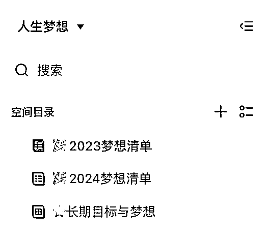

# 做自媒体，别急着学习，先建立自己的知识体系！

> 原文：[`www.yuque.com/for_lazy/zhoubao/nvmhmubop8k0m56g`](https://www.yuque.com/for_lazy/zhoubao/nvmhmubop8k0m56g)

## (91 赞)做自媒体，别急着学习，先建立自己的知识体系！

作者： 丁小翼

日期：2024-06-05

你好哇， 我是小翼。

你是不是收藏了很多内容，看了很多书，但要用的时候，就是想不起来？

年底了，想回顾一年到底学到了啥，却发现并没有留下什么痕迹？

**其实你不是不努力，你只是不会搭建知识体系！**

今天我将教你从 0 搭建自己的知识体系，学完就能用，

而且还能轻松写作输出，

**（2000 字深度精华，可以先赞后看哦~）**

# **01 知识管理误区**

首先先来解决一个误区，

就是我们往往会在读书/学习时，

用收藏、摘抄、思维导图等方式来收集知识。

**注意，这里收集的不是其实知识，而是一个个信息！**

知识体系其实是个 4 层金字塔，

从下往上分别是数据-信息-知识-智慧（DIKW 模型）。

那**信息**和**知识**的区别是什么呢？

就在于这个东西**是否经过你的验证，与你有关联**。

举个🌰子：

拿天气来说，温度 0 度——这个是**数据**

今天温度 0 度，降温了 10 度，天气非常冷——这个是**信息**

今天 0 度大降温了，所以我要穿得暖和点——这个是**知识**

那基于每年的天气规律，古人总结出了节气——这就叫**智慧**

# **02 如何搭建知识体系**

OK 那框架有了，如何动手搭这个知识体系呢？

**总共分 3 步：**

**第一步：**

**在信息收集端，**

我们会经常面临在各个平台**囤积**了一堆信息，

但要用的时候，却怎么也找不到。

别急，这时我们只需一个 all in one 的信息管理工具，

我用的是**Cubox**这个小工具：

**它能帮我快速收集任意平台的信息，并且统一文字格式**，

还能把语音视频和图片转成文字，

这样所有信息都被统一规整到一个地方，

方便我们定期去回顾和归档。

**第二步：**

**在知识形成端，**

我们会面临看过就忘，看过等于会了，

一实操发现根本没学会的尴尬情况。

因此在信息整理的基础上，

**我们需要用到卡片笔记法，将信息转化成知识。**

这里我会用**flomo**这个软件：

具体做法是：

在读到一条让你有触动的信息时，复制到 flomo，然后填写以下 4 行：

**1）复述：**用自己的话来复述一遍

**2）关联旧知识：**这个新知识，让我联想到了哪些旧知识？

**3）关联经历：**我过往的经历中，有没有跟它相关联的部分？

**4）行动项：**根据这个知识，我有什么行动改变？

举个🌰子：

我在《富爸爸财务自由之路》P198 页读到：

语言是人类最有影响力的工具，一个人所说的和所想的会变为现实。

**1）****复述：**

语言的影响力比我们想象得更强大，

一个人经常说的话，就会影响行动，从而影响现实结果。

**2）关联旧知识：**

《有钱人和你想的不一样》里，就说语言设定非常重要，

小时候接收到的信息，就会让我们潜意识里很难变成有钱人。

**3）关联经历：**

以前听到前同事说，X 万块一个月，我一辈子都不可能达到这个工资。

那他就不会去考虑“怎么实现”，自己给自己设置了收入上限。

我倒是没有这方面的语言设定，

但是我最近经常说“我太忙了”“没时间”，

这让我确实处于一种忙碌疲惫的状态，

其实我的时间明明很自由，完全可以调整。

**4）行动项：**

改掉说“我太忙了”“没时间”，

对自己说“我有充足的时间”，改变忙碌的状态。

**这样就把所有信息，跟过往的知识或者经历串联起来，织成一张独属于你的知识网络。**

而且每个知识点，你都可以轻松输出一大段内容。

往后有任何问题，也都可以到这里搜索来获取答案，

里面没有的就去学习、去扩充，

这样你的知识体系，就逐渐形成啦。

**第三步：**

如果还想把知识，沉淀成人生智慧，需要一点点总结归纳能力。

我用**飞书**搭建了个知识库给大家参考，把**核心知识分为 6 大板块**，分别是：

**1）底层知识：**

这里用来存放能给人生抉择带来关键影响的底层知识，

包括查理芒格推崇的跨学科知识模型，以及其他重要的思维方式。

**2）核心能力：**

用来沉淀一个人也能独立养活自己的核心能力，

比如一人企业、AI 写作、时间管理、情绪管理等。

**3）人生觉察：**

因为我平时就有用 flomo 写每日觉察的习惯，

其中重要的觉察，我会放到这里，

这样以后也能复制这次的经验，或者不会犯同样的错误，更好地预判未来。

**4）人生梦想：**

包括了长期和短期的梦想清单，

以及如何去实现的步骤。（拆解可以看上个视频）

**5）内容输出：**

我坚信教是最好的学，我会把所有学到的内容都进行输出。

这里会按项目制来管理，

比如最近做这个知识体系的选题，

会把平时收集的信息和知识都丢进去，再做系统的梳理。

**6）健康管理：**

这里我容易忽视的部分，

所以专门做了个板块，用于睡眠管理、健康习惯养成、和一些健康记录，

毕竟身体是前 5 项的根基。

大家可以根据自己的需求去设置板块，

**工具用飞书/notion/wolai**等都可以，内容比形式更重要~

具体内容我也在不断建设中，**欢迎一起探讨交流~**

* * *

评论区：

芒果石榴 : 确实牛🐂
筱天堂 : 醍醐灌顶
罗伊 : 很有帮助
绢绢感恩美学 : 学会智慧的努力
🍟19131 : 在小红书上关注了你，没想到也在这里[跳跳][转圈]
丁小翼 : 哇有缘！
英雄哥 : 简洁，身体力行。很棒！

* * *