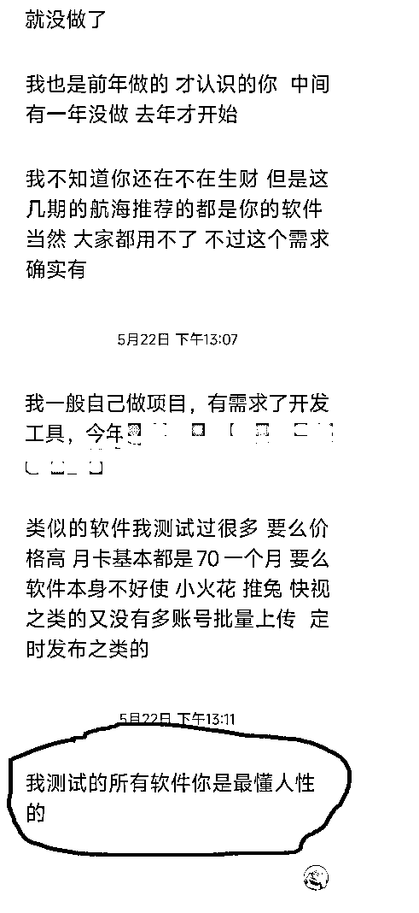

# 免费多账号必备小工具：多账号登录浏览器（方便矩阵管理多个账号）

> 原文：[`www.yuque.com/for_lazy/zhoubao/wqfoozoo6mp5vyuw`](https://www.yuque.com/for_lazy/zhoubao/wqfoozoo6mp5vyuw)

## (45 赞)免费多账号必备小工具：多账号登录浏览器（方便矩阵管理多个账号）

作者： 施仁

日期：2024-05-31

视频号矩阵、抖音多账号，小红书多账号，快手多账号，得物、知乎等等，都可以使用，相当于一个软件多个浏览器，部分平台甚至可以使用延长登录的功能延长账号的登录时间。

目前软件各种平台登录多个账号随意切换。

陆续也会开发各平台自动发作品的功能，目前可以使用的多账号批量发文有视频号、得物、京东、B 站。

因为视频号登录一天就会掉线（之前研究过视频号的永久登录，但是现在那个方法已经不能用了），我依然把视频号定时功能加了进来，可以一次性把 1-30 天内的视频定时，玩视频号矩阵的朋友就不用每天多个账号登录了。

去年 418 后，当时给新来的圈友免费分享了一些我写的各种平台的软件，

后来忙于做项目，部分软件可能失效或者有些朋友不会正确使用，今年过了年，陆陆续续不少圈友找我说这些问题，

前一阵有个圈友又跟我聊起来别的视频号全自动批量发视频软件不好使，怂恿我继续更新下去。

给我一顿夸，直接把我整的找不到北了。

说白了很多时候我写软件都是根据自己需求写，

自己也是使用者，所以需要什么功能我自己就加上去了，

但是后来精力有限，有些软件随着我不使用有些功能我就不去维护了。

过了年后也会考虑这件事，

每次有新的需求我就要重新写一个软件，虽然开头的一些固定程序我可以直接套进去，但每次开发还是有些麻烦，索性这次我就写个综合性能多、集成各个平台都可使用的工具。

教程和下载都在这里。

[`udxxg5rx5m.feishu.cn/docx/QZ0cdj6VxouxvixbAx7cag09nUe?from=from_copylink`](https://udxxg5rx5m.feishu.cn/docx/QZ0cdj6VxouxvixbAx7cag09nUe?from=from_copylink)

* * *

评论区：

biubiu : 链接好像点不了
施仁 : 复制粘贴也可以[捂脸]
Rio : 发图片后再上飞书链接，链接无法跳转
施仁 : 你说的哪个功能[发呆]
Rio : 说的是 这个星球网页版的 bug

* * *