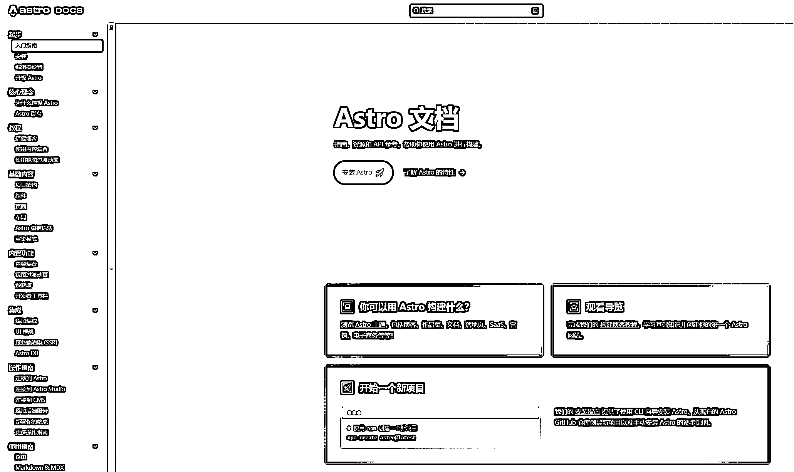

# 生财新人分享一个周末制作的 AI 工具合计网站，快速跑通 MVP

> 原文：[`www.yuque.com/for_lazy/zhoubao/ng9tzesdorvregv1`](https://www.yuque.com/for_lazy/zhoubao/ng9tzesdorvregv1)

## (33 赞)生财新人分享一个周末制作的 AI 工具合计网站，快速跑通 MVP

作者： 彩笺

日期：2024-05-27

大家好，我是这个月才进入生财的 00 后新人彩笺。

想到生财的核心价值观包含了 **“输出”，“利他”**，所以写下第一篇文章，分享我**快速跑通产品 MVP 的过程**。

## 背景

最近阅读了不少生财的文章，其中有刘小排大佬分享的[《写给独立开发者：如何快速做出产品 MVP》](https://articles.zsxq.com/id_pj4qminuwlc7.html)

基于文章内容和个人经验认知(无前端经验，但是会用 AI 工具以及搜索引擎），花了两天时间制作了一个 AI 工具合计网站，下面是详细过程和思路。

[这是个人按照如下流程两天开发出来的网站](https://www.colorepistle.com/)

## 1\. idea

不知道各位的心路历程是如何的，我在做之前，会困扰于要做什么内容，他解决了什么需求？做这个的多不多？竞争压力大不大？

思来想去时间就流逝掉了，也一直没开始进行实践。小排大佬文章中的一个观点是：

看到这里其实就已经明白了，想再多都是问题，做下去才有答案。围绕着最近很火的 AI，我想在 chatgpt 之后国内外雨后春笋般的出了这么多 AI 工具，那做个**AI 工具合集**应该是会解决一部分人的需求的。

## 前期调研

现在已经明确了 idea 以及产品形态（网站），那么我需要知道我应该使用哪些技术和工具，来促使我达成这一产品的开发。

在我的个人认知中，网站的背后是：**前端、域名、服务器、部署、开发** 等关键词

小排大佬文章标题中提到了**独立开发者**

围绕这几个关键字，通过百度、google 搜索引擎，我得到了以下几个资源点：

*   1.

    **域名：**cloudflare

    [`dash.cloudflare.com/`](https://dash.cloudflare.com/)

    在这个网站可以购买域名。价格还是挺便宜的。

    *   2.

    **前端技术框架：**Astro
    

**Astro 的这些关键点描述，很匹配我当下要快速开发一个网站的需求，同时 Astro 官网自带教程，和模板，方便开发**

*   1.

    Vercel
    

    **Vercel**可以免费，快速的部署我的网站。同时支持快速部署 Astro，配合起来很简单。

## 实践

开发一个网站最耗费精力也最麻烦的是代码环节，Astro 提供了很多模板和对应源代码，可以很大程度在这方面节省时间。

[`astro.build/themes/`](https://astro.build/themes/)

对于网站开发和前端技术我没有任何经验。这里用的了两个“**术**”：

1: 在实践过程中主要依靠 AI 辅助，来进行代码的解释，更改，和调整。

2: 网站内容和代码里面存在对应关系，可以通过代码内检索更改，实时比对一点点来改，然后观察网站对应的文字和图片是否发生变化。

我个人的开发实践路径为：

*   1.

    部署开发环境：**在 Astro 官网有详细的教程，按照教程一步步来就可以**
    

    *   2.

    挑选模板：根据个人喜好以及内容匹配程度，挑选模板
    

    *   3.

    部署到本地：Astro 官网有详细教程部署模板
    

    *   4.

    本地调试，模板部署好之后，本地运行环境会告诉你如何在本地预览

    *   5.

    代码更改：**我使用了 vscode 代码编辑器，打开模板源代码，更改其中的网页展示内容，同时利用了 AI 工具 github copilot 来进行局部的调整**

    *   6.

    部署到 Vercel：在 Vercel 里面有直接的入口，部署你的 Astro 项目。
    

    *   7.

    绑定域名：部署好之后，Vercel 页面会提示你可以绑定域名，这时去购买域名进行绑定。
    

**网上有很多关于 Astro 开发和 Vercel 部署的教程，也可以根据他人的教程来模仿搭建，根据时间线选一个比较靠近当下的即可。**

## 总结

*   1.

    确定你的 idea，不要管其他的，只要网站满足了核心需求即可，至于网站好看与否，技术 low 与否，不要考虑

    *   2.

    快速实践。网上有很多搭建网站相关的文章和技术框架，善用搜索引擎，找到最适合你的最快的实践路径。

    *   3.

    不断迭代更新优化你的网站，包括内容，和 SEO（**本人还在持续学习中**）

* * *

评论区：

陈不胖 : 提个小意见，可以在每个软件背后写上推荐指数和排列顺序，最热，最新综合
彩笺 : 感谢建议
女巫的蛋挞 : 真的是想做的事，遇到什么困难就解决什么困难。既然在不懂代码的情况下做一个网站真的好不给自己设限！
彩笺 : 最难的和最关键的不是实践，而且想法[捂脸]

* * *