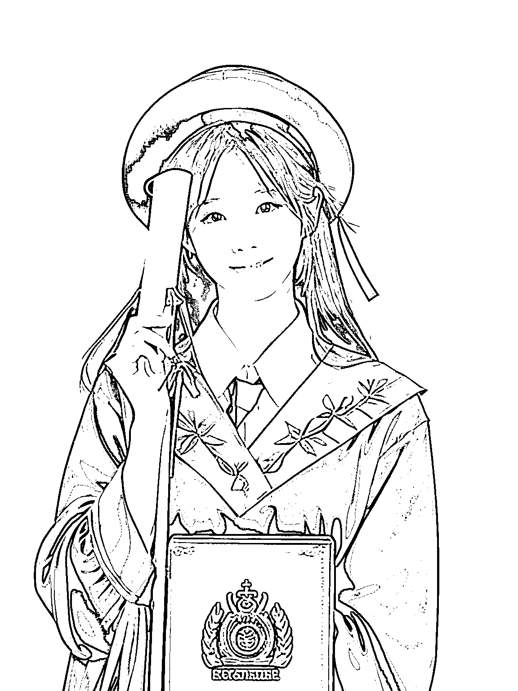
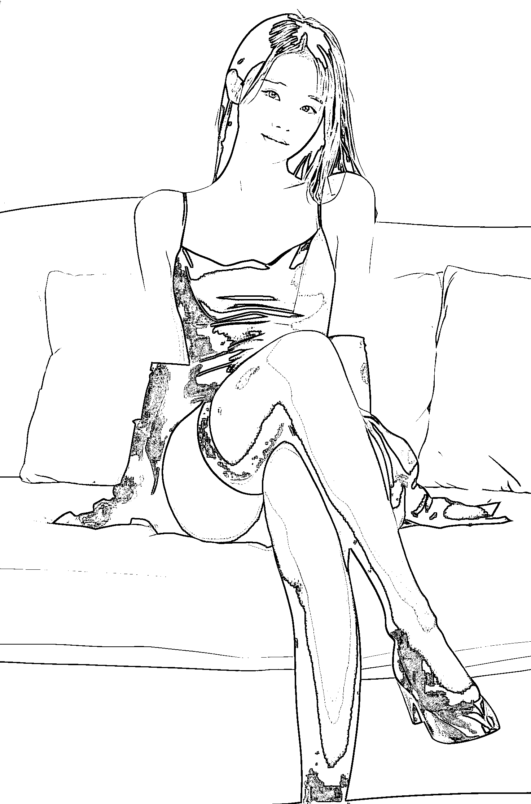

# 利用 coze 图像流搭建线上写真馆，月入过万

> 原文：[`www.yuque.com/for_lazy/zhoubao/zvm0xkkthbg3kweg`](https://www.yuque.com/for_lazy/zhoubao/zvm0xkkthbg3kweg)

## (30 赞)利用 coze 图像流搭建线上写真馆，月入过万

作者： 盟主君

日期：2024-05-27

什么？即将毕业的你还在为拍写真集烦恼？

翻遍小红书各种 AI 写真收费都不低。

那你为何不自己搭建一个 AI 工具做个线上写真馆呢？

好吧，先来看个效果吧。

这是我的一个小姐姐照片

利用“完美写真馆”生成三种风格的照片

**01 职业范**

**02 校园范**

**03 女王范**

来看看我怎么做的吧

详细教程请移步飞书查看

[`szxb4qbve7.feishu.cn/docx/OCxydP0N8ojPj0xvCWKcyvSdn6c?from=from_copylink`](https://szxb4qbve7.feishu.cn/docx/OCxydP0N8ojPj0xvCWKcyvSdn6c?from=from_copylink)

* * *

评论区：

暂无评论

* * *