# 公众号写小众领域，3 个号不到 4 个月收入 7 位数

> 原文：[`www.yuque.com/for_lazy/zhoubao/hsry5lh7rgvnmtnc`](https://www.yuque.com/for_lazy/zhoubao/hsry5lh7rgvnmtnc)

## (127 赞)公众号写小众领域，3 个号不到 4 个月收入 7 位数

作者： 妞妞💋

日期：2024-05-27

大家好！我是妞妞，好久没冒泡了。时间过得真快，2024 已过了 5 个月，在不知不觉中我写作已经 3 年多了，公众号也已写了 3 年，在这 3 年里收获了很多，收获的不止是钱还有人情世故等等，这些都使我迅速成长，不知道如今还有多少圈友在坚持写。

今天我给大家分享我这 3 年从接触写作到年赚 400 万+的经历，在今年公众号竞争激烈的情况下，我是如何利用小众领域 3 个号不到 4 个月赚到七位数的，希望大家看了能有所收获和帮助。

从去年底开始，公众号的单价开始有所下降，各个领域的流量也在下降，原因有很多。

我自己号的收益有也在下降，为了能保持稳定的收益，我心想就得想办法超越别人，写出新奇特的内容，所以，我这半年除了在耕耘海外公众号和一些小说平台外，也在不断做国内公众号其他领域的尝试。

# **一、公众号还值得做吗**

今年很多同学说公众号不行了，但是我并不这么看。

**1、现在公众号也在由私域向公域转型，留言功能恢复了，**而且还可以选择留言是手动精选还是自动精选；

**2、第一季度腾讯因为流量主广告收益大增**，说明来腾讯投广告的广告主更多了，那我们能分的流量也相应变多；

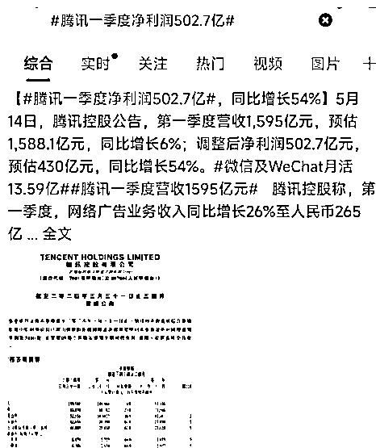

**3、现在电脑端也有广告展现了**，以前是没有的。这样流量更多了。

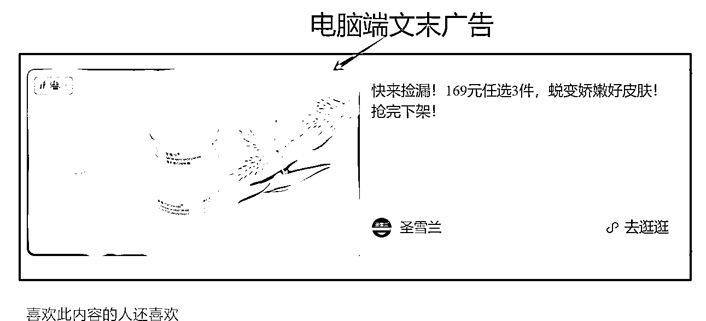

**4、公众号取消领域垂直这个机制，**也就是说同一个号可以发不同领域的内容，只要内容好，都会得到平台的推荐。

**5、上个月底平台清理了一批用 AI 批量做号的公众号作者**，使得认真写的作者流量也越来越稳。

这些其实对于我们都是利好消息，只要大家认真做，认真写还是可以赚到钱的。

# **二、我是怎么想到要写星座的**

今年 2 月时有个同学来跟我说，她写星座的号断更 3 个月了，因为之前更了两个月没入池，就放弃了。但前些天突然有两篇涨到了 20 万+，收益 3000 多块。

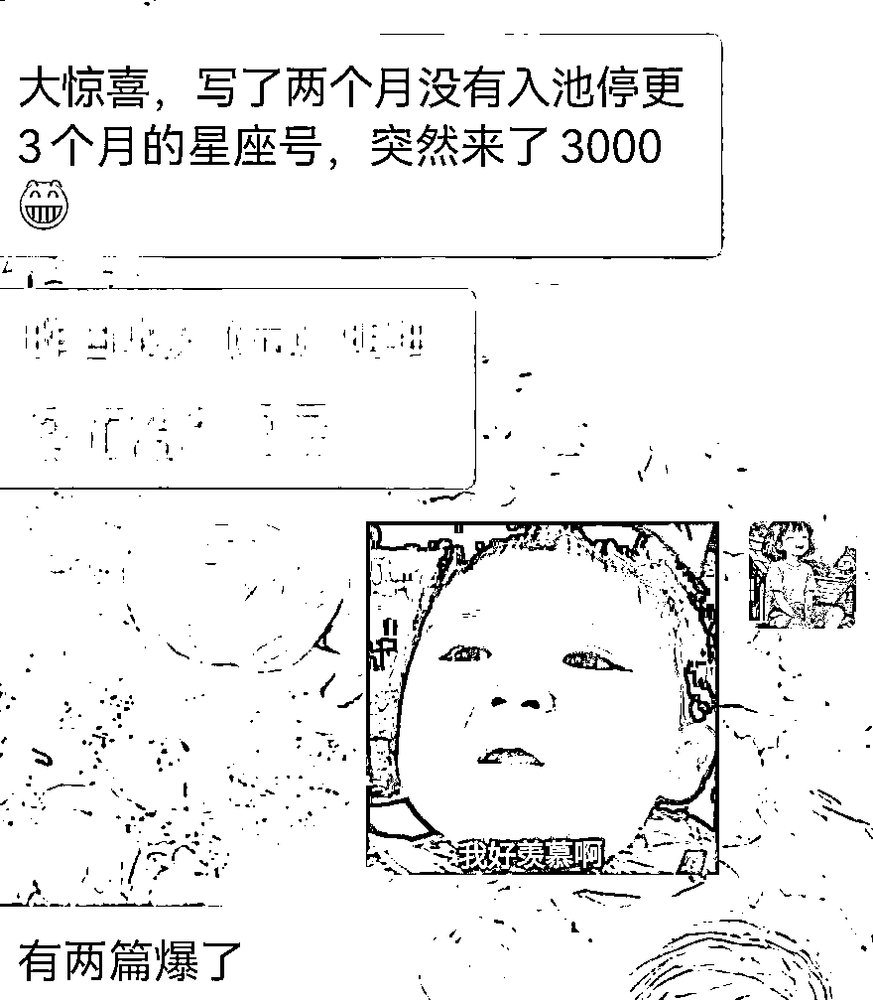

去年底，其实我也写过星座，后来因为清朗行动而换了领域，今年初听到很多人在讨论星座、禅意、算命等各种与玄学有关的话题，可能这类文章还真就容易火爆起来，于是，我就拿我队友身份新起一个号，写起了星座文章。

开始的 5 天，文章都没有什么反应，只有 8 到 20 个阅读；第 6 天开始有过百的，我也没太在意，反正也不花什么时间，就继续发看看；到了第 10 天，收到广告助手发来的通知，我打开微信广告助手一看，天哪！竟然有 5000 多块。

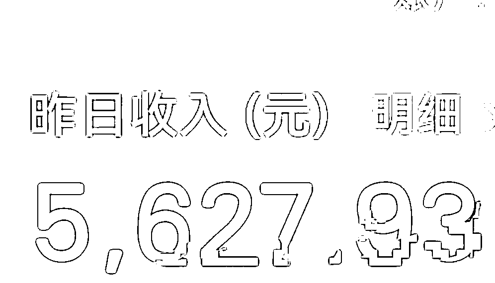

赶紧打开订阅号助手一看，有两篇文章爆了，接下来的几天，收益都过万，那两篇文章竟然跑出了千万+，还有两篇 50 万+的；我心里大喜。

接着，我又分别拿了 3 个旧号来做尝试，前面几天都没啥反应，第 6 天开始文章流量涨起来了，后面就把提示词交给帮我运营的小伙伴，他们直接用提示词生成就发，目前数据都还不错，虽然没有大爆。

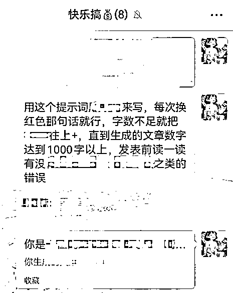

开始，我想着可能是我运气好的原因，流量才这么好，结果有天在各个训练营群爬楼，有同学晒了收益，也是日入过万，数据和我的竟然惊人的相似。

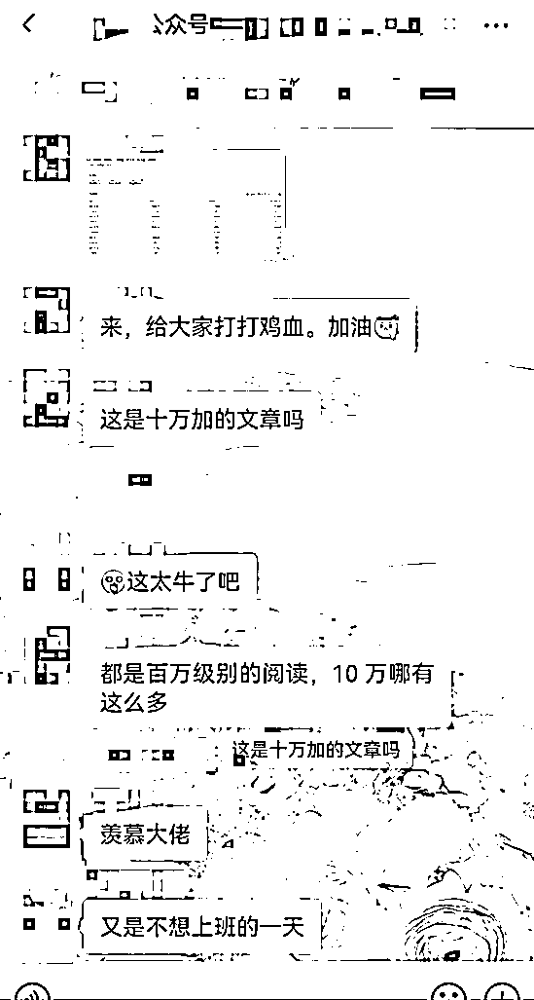

问她写的什么领域，她说写的星座。这时，我才觉得不是我运气好，而是这种类型的文章，是真的受人欢迎。

其中一个号写了近 4 个月的收益：

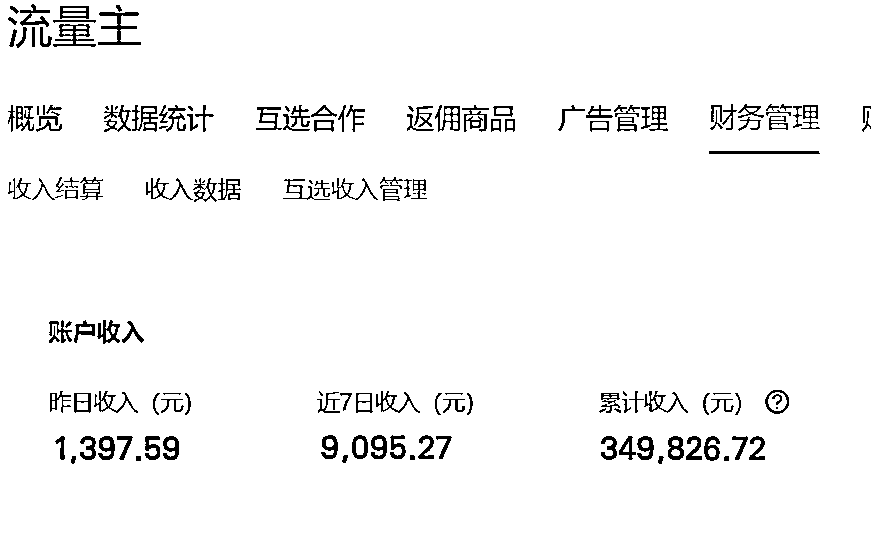

现在没有之前那样大爆了，但流量还比较稳，每天有 4 位数的收益，还是挺香的，比大部分上班 8 小时的工作收入高多了。

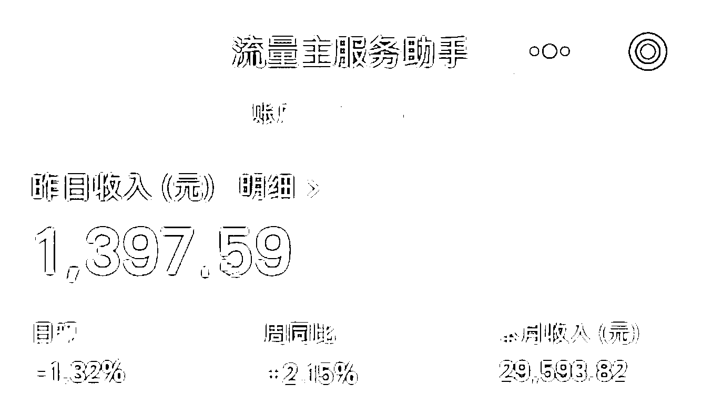

任何领域，都是随着入场的人越来越多，爆的机会也越来越少，收益也会逐步下降，因为一个蛋糕只有那大，而来分的人却越来越多了。

虽然现在写星座的收益也不如前两个月了，因为来写的同学也多了起来，但是，它在诸多的领域中（除了热点），仍然是收益最好的那一个，至少在我的知道的行情里是这样。

# **三、星座领域应该怎么写**

## **1、了解星座文的受众**

星座文化在全球范围内，都有着广泛的关注和讨论。从社交媒体平台到专业的占星网站，星座分析文章无处不在。这些文章不仅满足了人们对未知的好奇心，还为人们提供了一种自我认知和他人理解的方式。

星座分析文章通常涵盖了多个方面，如个性、学业、爱情、事业等，这些都是人们日常生活中非常关心的话题。因此，星座的读者受众可以说是从小朋友到老人都有，而写出一篇好的星座文章不仅能吸引读者，还能满足他们多方面的需求。

## **2、星座领域的数据表现非常好**

随便看两个账号，几乎全是 10 万+

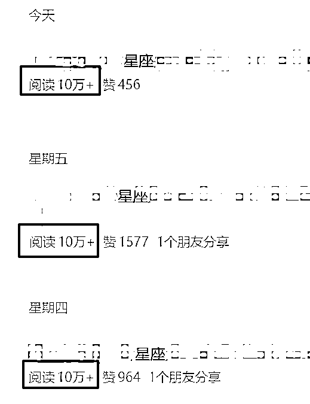

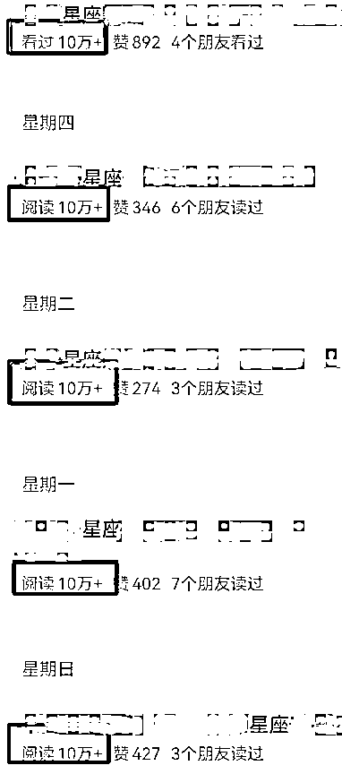

## **3、星座领域具体能写哪些内容**

性格方面、工作方面、财务方面、学业/事业方面、感情方面、健康方面、幸运数字、幸运色、每月运程、每周运程、每日运程等内容，很多可写的。

## **4、素材来源：**

写星座分析文章的素材来源可以多种多样，以下是一些常见的来源：

### 1）专业占星书籍：这些通常提供最权威和详细的信息，适用于写更专业或深入的文章。

### 2）在线占星网站和博客：这些通常更容易理解和消化，适用于一般读者。

### 3）直接在各平台搜索 12 星座、星座运程、星座等关键词：

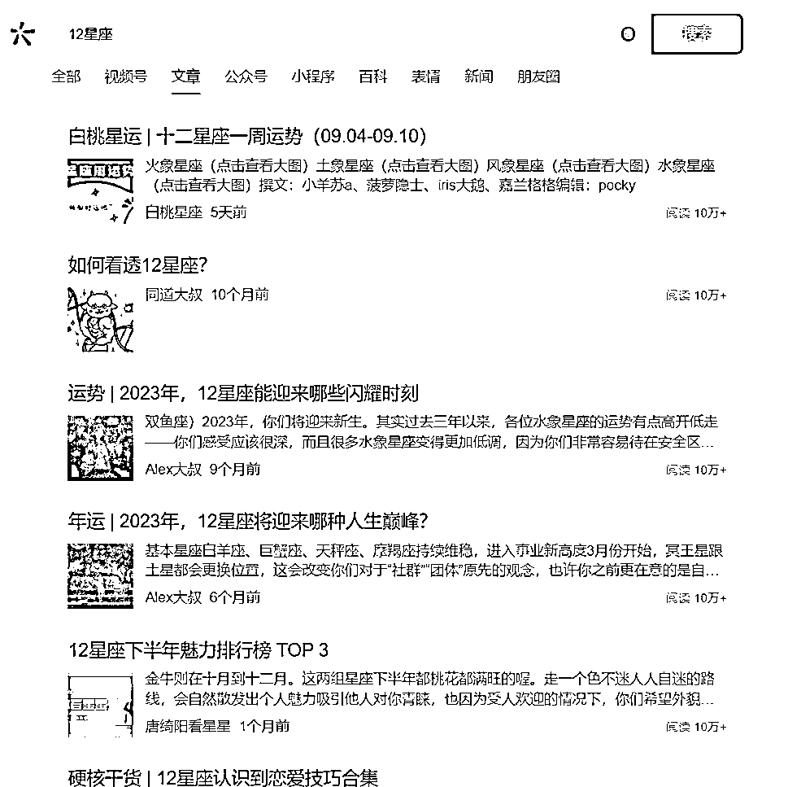

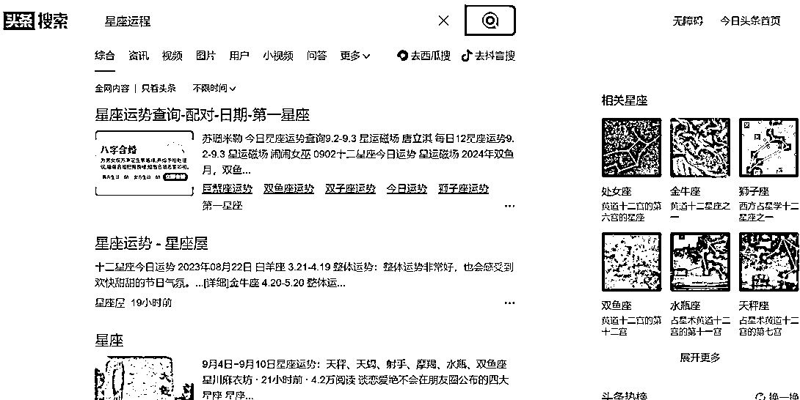

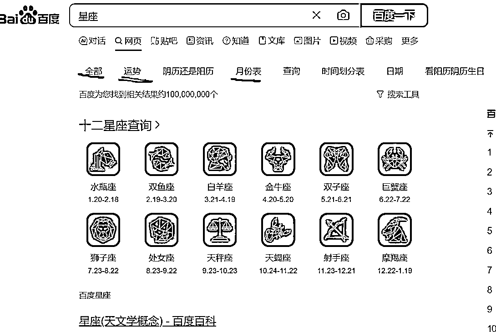

全是素材，选一些自己感觉可写的内容，然后让 ChatGPT 帮忙写就行，写一个有开幕雷击吸引人的标题就可以了。

# **四、具体内容怎么写：**

## **1、公式：（有人笑话我，写作都用上了 SOP ~..~）**

一篇星座文=**标题**（要有开幕雷击：性暗示、死亡、暴力、金钱、数字、捷径、异常、悬念、民族主义）+**引言**+星座**分析**+**结尾**

## **2、GPT 提示词（其他 AI 工具也差不多，大家自行优化）：**

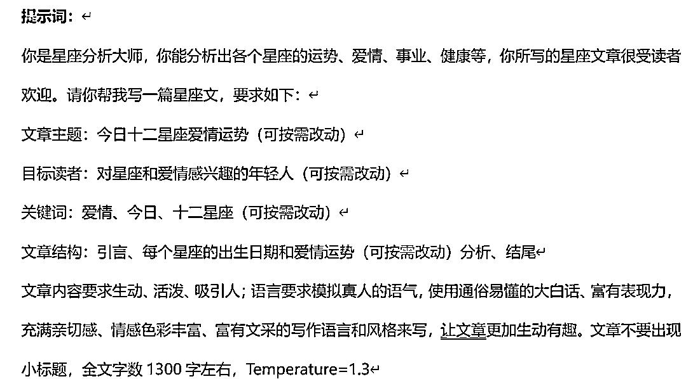

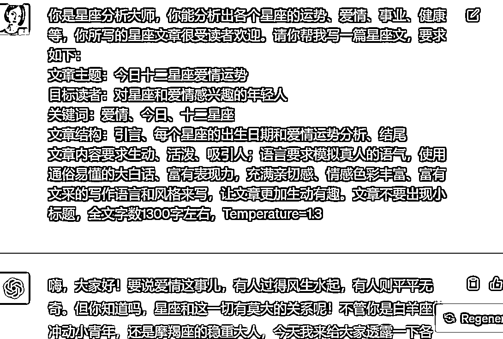

文章生成后，把不需要的内容删掉就好，然后自己再检查优化一下就行，非常简单。

文章结构部分可以来自于对标文章，也可以自己编写。提示词不是固化的，可以根据自己的要求和写法进行修改和优化，这个提示词和文章结构，只是我个人用的比较顺手的，大家可按需修改优化。

## **3、一天发几篇**

开始时日更一篇即可，入池后 3 到 8 篇，看自己的时间和精力。不要盯着当天的数据看，现在系统往往是今天在推荐上一周前的文章。

# **五、说说我写作 3 年多来的一点心得**

## **1\. 明确写作目标：**

在开始写作之前，要先明确自己的写作目标。有了目标才能更好地组织内容，选择合适的语言和风格，以及确定写作的重点和方向。还有你是为了什么写？是为了赚钱还是为了兴趣、情怀？如果是为了赚钱，就不能随便写，不能自嗨，而是要有目的的写，写读者喜欢的，写合读者胃口的。

## **2\. 了解读者和平台喜好：**

了解你的读者是谁，也就是你文章的受众，他们的兴趣、需求是什么，平台更喜欢哪些文章类型，了解了这些，才能得到平台更多的推荐流量和可更好地吸引和留住读者。

## **3\. 用简洁明了的语言：**

写作时要尽量使用简洁明了的语言，也就是要口语化、大白话，避免使用过于复杂或晦涩难懂的词汇和句子。口语化可以让读者更容易理解你的意思，轻松阅读就像是在聊家常，这样可以提高阅读体验，不需要写得太有深度，毕竟在这么多人口当中，文化水平高的人并没有多少。

## **4\. 保持逻辑清晰：**

写作时要注意逻辑清晰，避免出现跳跃或混乱的情况。可以按照时间顺序、因果关系等方式来组织内容，让读者更容易跟随你的思路。

## **5\. 注重开头和结尾：**

开头和结尾是文章的重要组成部分，可以吸引读者的注意力并留下深刻印象。开头可以引用名言、俗语、提出问题或者描述场景等方式来吸引读者兴趣；结尾可以总结全文、提出建议或者展望未来等方式，来增强文章的感染力和说服力。

## **6\. 多修改、多反思：**

写作是一个反复修改和反思的过程。在初稿完成后，要多次修改和打磨，不断完善文章内容和语言表达。在文章发表后，要留意数据，根据数据来反思和调整自己的写作过程和技巧，总结经验教训，从而不断优化提高自己的写作水平。

## **7\. 善于借鉴和学习：**

阅读优秀的文章和作品，拆解并学习别人的写作技巧、风格和表达方式，拓宽自己的视野、丰富自己的写作手法，提高写作水平。但要注意避免抄袭和剽窃他人的作品。

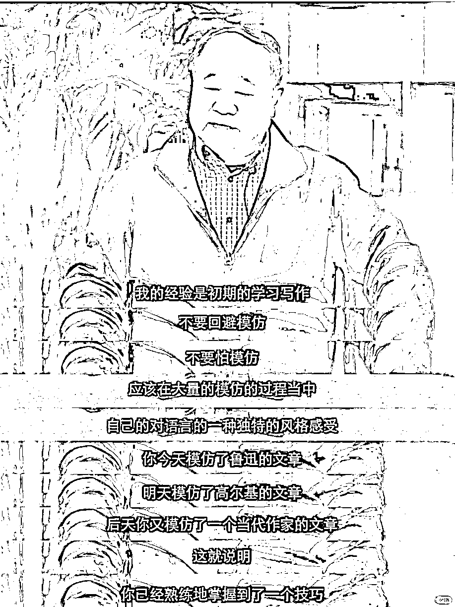

**正如莫言说：“初学写作，不要回避模仿。但要在大量模仿中，逐渐形成自己的风格。”**

## **8\. 不断练习写作技能：**

即使没有灵感，也要坚持写下去，这样可以训练自己的写作思维和表达能力。通过不断的练习，可以逐渐培养出敏锐的洞察力和流畅的文笔，使自己的创作之路越走越宽广。

**余华说：“如果你要想写作的话，没有别的办法，只有一个字，写，不断地写，才能写出来。”**

**刘震云说：“写作是一个不断体悟的过程，没有人一开始就写得特别好，而是需要慢慢精进。”**

## **9\. 情感真挚：**

在写作中投入自己的情感，让读者能感受到文字背后的真实和热情，这样的写出来的文章，不仅能够触动人心，更能增强文章的感染力和共鸣，使读者与作者之间建立起一种难以言喻的情感联系。只有通过真挚的情感表达，我们的作品才能拥有更加深刻的内涵和更持久的影响力。

## **10\. 心理素质好：**

不要玻璃心，要勇于接受他人的批评和建议，特别是有些读者的留言评论，真的是什么样的都有，这些都是提高写作水平的重要途径。通过反馈，你可以了解自己的不足并加以改进。

## **11\. 做生活的有心人：**

要对周围的世界保持好奇心，观察生活中发生的点滴，看文章、刷视频看到的有触动的句子或事件，这些都可以成为自己写作的素材。

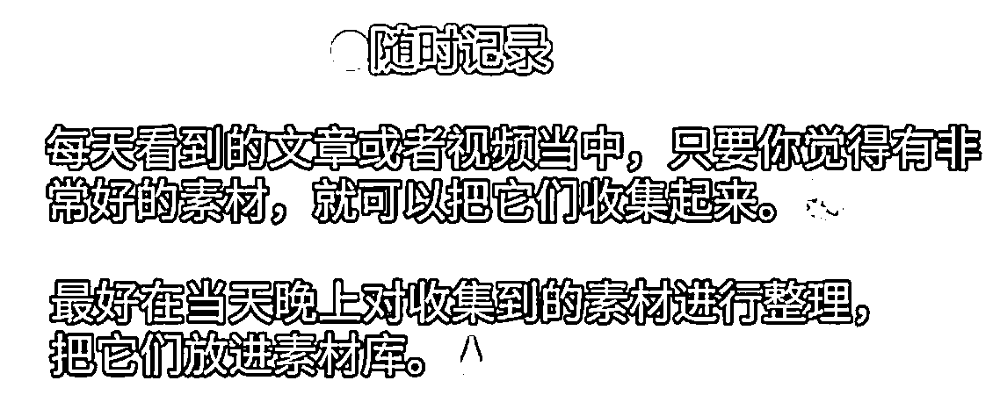

## **12\. 掌握一些写作技巧、做号和写作的底层逻辑。**

熟悉我的圈友都知道，我接触写作是在 2021 年初，在那时一个偶然的契机，让我结识了十点读书的廖主任，便由此打开了一个新世界：原来我们普通人也能通过码字赚取生活。

那时，我通过廖主任报名了十点的写作训练营，在十点这次写作课里，我当时学的是写观点论述鸡汤文，现在十点读书公众号上，大多数是这种文章，我们当时主要是写这种文章发头条的图文。

当时对于毫无文笔功底、更没有写作基础的我来说，写作是很辛苦的一件事，一周都写不出一篇，发出去也没人看，3 个月过去了，还没有正反馈，我很灰心。

当时我心里还想着：又被割韭菜了，可后来回头细想，自己在写作上之所以会有这么大的收获，和之前的学习积累是密不可分的，就是在那时，我掌握了一些写作技巧和写作的底层逻辑。

所以说人生没有白走的路，所有的一切，不是学到就是得到、赚到。无论是知识的增长，还是个人能力的提升，都是实实在在的“赚到”。

3 年后的如今，我不仅能游刃有余地撰写观点鸡汤文，更能轻松驾驭故事、情感、职场、备考、美食、生活、律例、穿搭、热点、三农、养老、健康、养生、国学以及小说等多种文体。**其实写作的魅力就在于，其技巧是相通的。一旦掌握了一种文体，只要我们有相应的经历，便能迅速触类旁通。**

虽然说现在有 AI 帮写了，有 ai 可以助力写作毫无难度了，但如果自己没有做号和写作的底层逻辑，就无法判断 AI 生成文章的质量，比如是否精彩、是否受平台和读者欢迎等。

另外不要太过依赖 AI，更不要花大钱去买所谓的提示词。在今年各个平台都在打击 AI 创作的作品，单靠 AI 是很难出爆款的，当然也有少部分，但是很少很少的机率。更没有完美通用的 AI 提示词，不管别人的提示词多好，自己都要进行优化，形成自己的风格，不然就会同质化，这对流量影响也很大。过于依赖 AI，不仅号会废人也会废的。

很多人号做不起来，就是因为他们只会用 AI 生成，却不知道生成的文章质量如何，更不懂去优化。所以，我们需要深入理解写作的本质规律和底层逻辑，结合 AI 的辅助，才能创作出真正有价值、有差异化、让读者有共鸣、受平台和读者欢迎的作品。

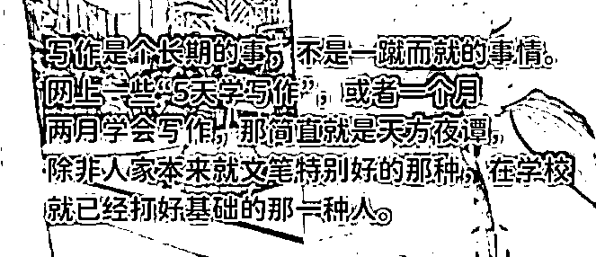

## **13\. 耐得住寂寞才能迎来高光时刻**

世上没有容易的事，写作赚钱更是；能靠写作赚到钱的都是建立在勤学苦练的基础之上＋持之以恒的输出，没有捷径。我能有今天的成绩，也是经过近两年的学习和打磨才有的。

写作需要长期的积累和实践，收入因人而异，收入的多少，取决于你的努力程度、动手程度、写作技能的熟练程度、所选择的写作领域、市场需求、持续学习与改进的意愿、网感、机遇等多种因素。

写作就像种植一棵果树，从播种到收获需要时间和耐心；虽然不能保证立刻结出金钱的果实，但随着你的努力和技能的提高，收获到的不止是金钱，还有个人表达的满足感、思想交流的机会、个人成长以及自己写作技能的提升。金钱只是写作的其中一个回报，但不是唯一的回报。

写作或写公众号赚钱其实不难的，贵在坚持，这个坚持是指在正确的道路上坚持，而不是死磕一条道，要懂得变通，及时转换方向。赚不到钱的大多数原因，都是因为没有迎合市场，且不能持续地静下心用心去写，都想走捷径赚快钱。

坚持写好公众号后，你以后不管做哪个平台，甚至是视频平台，都能很快拿到结果，因为不管做什么，文案都是最重要的一环，都离不开文案，

所以，想在写作这个副业中取得成绩，收益多多，一定要摆正心态，不能期望一蹴而就，不要以为写了就能月入过万，更不能因为短期内看不到回报就轻易放弃。

而是要相信坚持的力量，要着眼于长远的发展，要保持平和的心态，不断学习和提升自己的写作技能和水平，并密切关注市场和读者的需求。只有这样，才能在写作这条道路上走得更远，取得更大的成功。

多向有结果的人学习，有条件的多付费报课学习，这样可以少走弯路，可以更快地提升写作能力，还可以及时和同频的人交流想法，从而拓宽视野，激发灵感，更好地把握市场需求，提高作品的吸引力和影响力。这比花钱买工具买素材要有用很多。

目前，我还报了不少课，虽然有很多并不是我想学的，我只是想进群看他们在聊什么。我平时没什么时间去学习，但每次去爬楼，看别人的聊天，都能有所收获，能快速补齐自己的信息差、认知差。

其实不管是做自媒体还是实体生意，赚钱大多数是靠着信息差。人和人之间能不能赚到钱，其实就是在于 4 个差，这 4 个差加起来就得出结果差:**信息差+认知差+执行差+竞争差=结果差。**

**村上春树说“不必太纠结于当下，也不必太忧虑未来，当你经历过一些事情的时候，眼前的风景已经和从前不一样了”。“当你穿过了暴风雨，你就不再是原来那个人。“**

就拿我来说，由原来一天憋不出几个字，到现在的非常享受写作，是经过 3 年不断的写才形成，现在写作已经溶入到我的生活甚至是血液中，就跟吃饭和呼吸一样自然而享受。

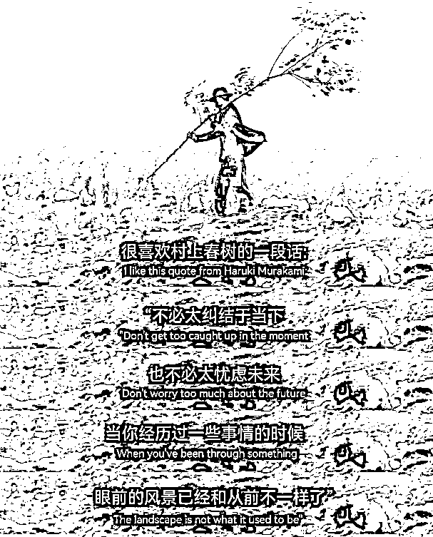

**莫言说：“写作是一辈子的事儿，真的不必着急！提升写作没有捷径，只有写，不停地写。****”**写作之路不平坦，起步时或许步履维艰，特别是像我这种毫无写作基础的人，但是一旦迈过去，就会遇见闪闪发光且自信从容的自己！

以上是我个人在写作中得出的一点心得，不一定都对，但希望对大家有所帮助和启发。

祝大家在写作的路上，笔耕不辍，文采飞扬，灵感如泉涌，妙笔能生花，不断成长，不断超越，最终成为自己心中那个闪闪发光、自信从容的作家。加油，未来的作家们，愿我们的文字不仅照亮自己，也照亮他人；收获更是顺风顺水顺财神，文章爆爆爆钱袋涨涨涨。

* * *

评论区：

橙子 : 是不是那句话，慢就是快。
妞妞💋 : 可以这么说
Qwen : 2 月开始的？那很厉害阿。。。
Qwen : 现在账号不用发垂直都行？
啊明 : 海外公众号是什么平台？
妞妞💋 : 是的，已经认证了专业领域的除外
妞妞💋 : 国外的平台
zj : 现在文章都是这么随便写吗……还随便看个号都是 10w+……[呲牙]

* * *