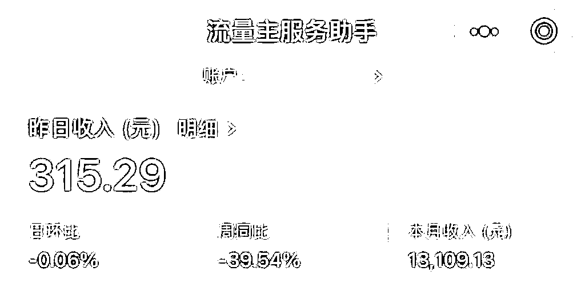

# 《我和生财的故事：从新手到公众号 77W+爆文，职场宝妈的自由职业逆袭之路》

> 原文：[`www.yuque.com/for_lazy/zhoubao/sgqkfd5x9te0f0xt`](https://www.yuque.com/for_lazy/zhoubao/sgqkfd5x9te0f0xt)

## (115 赞)《我和生财的故事：从新手到公众号 77W+爆文，职场宝妈的自由职业逆袭之路》

作者： 小伞

日期：2024-05-29

各位生财圈友们好，我是小伞。从一个职场宝妈，成长为了一个自由职业者。

加入生财一年多，一直在潜水，觉得我的经历和拿到的结果，还不够含金量来生财发帖，但好朋友@李慢慢一直鼓励我，让我来分享一下和生财的故事。

所以，我就来了，感谢慢慢的鞭子——

这篇帖子，**更多的是分享我的经历，希望能够给想要从职场上跳出来的圈友们，或者要开始海航的新圈友们，一些信心和勇气。**

先讲一下自由职业半年多来取得的小成绩：

> 而在这之前，我是一个白天打工，晚上带娃，每天挤时间参加航海折腾副业的宝妈。说出来有点丢脸，去年的我，28 岁，还是会为工作掉眼泪。
> 
> 在自媒体还没有稳定收入的时候，我裸辞了（现在想想真的有点莽又有点勇，不过我也断断续续探索副业一两年了），我想着自媒体只要一个月能赚 2000，这条路我就要走下去。
> 
> 于是，一个人，带着点不甘，和微弱的勇气，在慌乱中上路了。没想到，裸辞的第二个月就获得了极大的正反馈，我写出了 10 万+大爆文，靠公众号爆文的流量主收益月入上万，顺利踏上了自由职业的道路。
> 
> 
> 
> 
> 
> 直到现在，公众号一条广告可以顶我之前打工一个月的收入，我终于能过上相对从容的生活了。而这一切，都要从我加入生财有术说起**。**
> 
> **今天，我想分享一下，生财有术到底带给了我什么，为什么我会对这个社群有如此高的向心力和忠诚度。**
> 
> 更多内容请移步飞书：
> 
> [`vnng84yf44.feishu.cn/docx/Y6I0dhenpoS3x8xsRvwchjKznmd`](https://vnng84yf44.feishu.cn/docx/Y6I0dhenpoS3x8xsRvwchjKznmd)
> 
> 潜水一年第一次发长文贴，如果看完收获了一点点信心和勇气，请给我点个赞，笔芯！
> 
> * * *
> 
> 评论区：
> 
> 小张。 : 链接点不进去
> 小伞 : 现在再试试呢
> 🌸猫本红豆冰🌟 : 给我小伞疯狂打 Call，认真学习！
> Rio : 身在污泥仰望星空
> 小伞 : 谢谢猫本🥹
> 湘玲 : 感谢分享，分享很棒，很有收获。[强]
> 冯近近 : 我刚入生财，报名了公众号爆文这个项目，看了你真诚分享，真有鼓励到我[握手]
> 小伞 : 那就好！一起加油
> 
> 
> 
> * * *