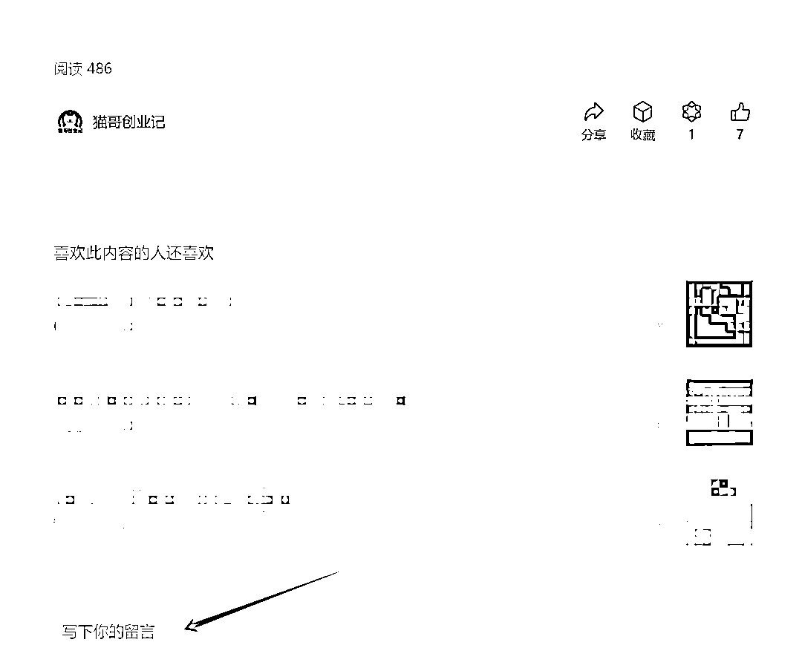
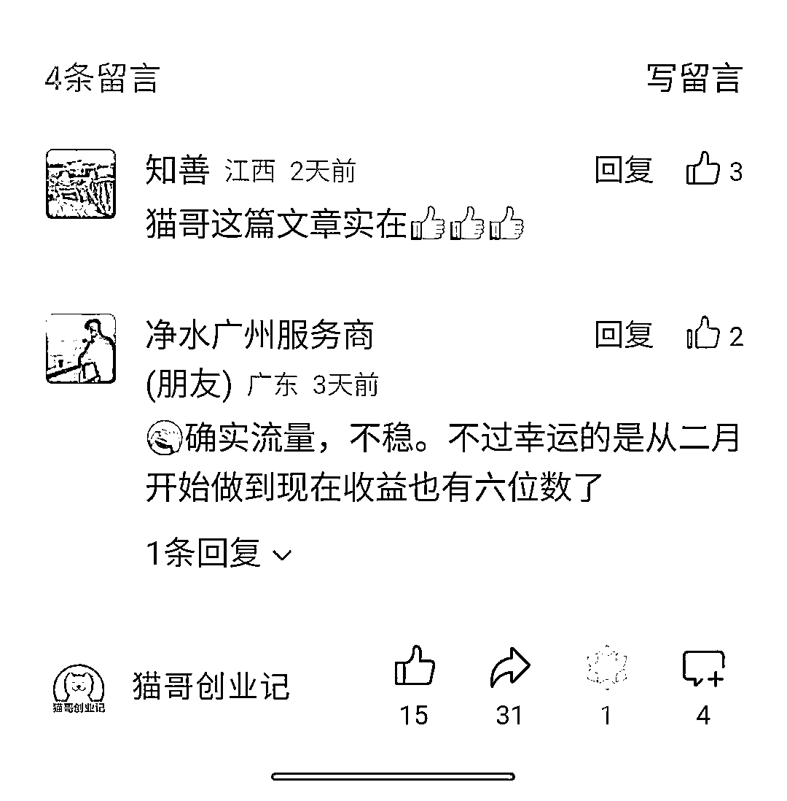
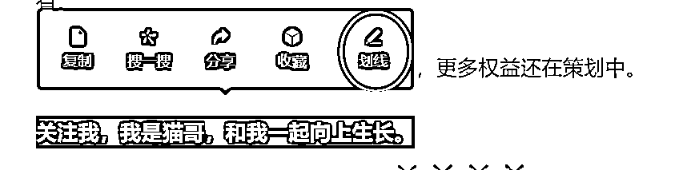
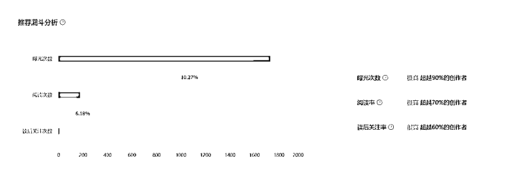

# 公众号算法分析，为什么标题党文章那么吃香？

> 原文：[`www.yuque.com/for_lazy/zhoubao/bml8o54bzawrf084`](https://www.yuque.com/for_lazy/zhoubao/bml8o54bzawrf084)

## (61 赞)公众号算法分析，为什么标题党文章那么吃香？

作者： 猫哥

日期：2024-05-28

公众号算法分析，为什么标题党文章那么吃香？

这是做了一年多公众号的一些思考，仅供参考。若有不对的地方，欢迎指正。接受批评。

今天看了刘润老师的一篇关于公众号越来越抖音化的文章，拜读后很有启发。

这 2 个平台，我都做过，公众号确实是在做赛马机制，但是很难，难的点不在于内容，而在于用户行为，如果完全用抖音的玩法去做，可能会死得很惨。

**1.****功能缺失**

公众号作为一个已经存活 10 年的产品，长期以来用户都是用来作为获取一些信息的渠道，相比短视频，它也仅仅只是一个渠道而已，但是互动很小。

我们都知道，自 2018 年 2 月后注册的公众号，留言功能（就是评论功能）都没有开放，不管你遇到多么优秀的文章，如果没有留言功能，本来想着要发表几句的，但是现在用户也只能看看划走，甚至想要收藏，都找不到收藏的按钮，你会发现在 Pc 端和移动端，这些按钮的位置不一样。

在 Pc 端，下面的 4 个常规按钮是，分享，收藏，在看，点赞。然后如果有留言功能则是在最下面。

这是移动端的，下面的 4 个按钮，换成了点赞，分享，在看，留言。不仅仅顺序变了，就连收藏这么重要的功能也没有了，想要收藏，就必须点击右上角的三个点，在里面找到。

是不是有点匪夷所思？不同的按钮是为了增加用户的学习成本吗？当代用户还有多少思考能力，时刻不断区分不一样的平台选择不一样位置的按钮。

难道当我想要收藏的时候，要先思考下我是在电脑还是在手机上操作？这不应该是固定的吗？

**2.****用户行为**

什么是赛马机制，是不是拼的内容质量？那么如何反馈哪个作品更好，是不是拼的数据，比如某音的 5 秒完播率，点赞率，评论，关注，收藏，分享，完播次数等等。

在某音你看到有价值的内容，你会直接收藏分享，看到不一样的观点，你会忍不住吐槽，系统再通过这些数据做一套算法，来决定你的内容是否优质。

前提是，**有用户行为**，也就是有用户愿意去做这些动作，而且是大部分用户都自然而然得产生的行为，是惯习。

但是在公众号，这是一个封闭了将近 10 年的产品，长久以来大部分用户仅仅只是看看，几乎是零互动，更别说一些账号连最基本的留言功能都没有获得。

去年的时候，公众号出了一个新的功能，**叫做划线**，就是在阅读文章的时候，你觉得那一句话非常好，可以长按，然后点击划线，后来的人也可以看到划线。

当时我就发过一篇文章，猜测这个划线功能的目的是为了筛选出优质的内容，毕竟文字不比视频，文字更需要共鸣，打动人心。

但是事实上，这个功能从发布以来，也有半年了，到现在还是灰度测试，只有部分用户有，而且即便这些用户被内测到了，很多用户也不知道这个功能。

当用户习惯了只是看看的时候，粘性就会大大的降低，这是一个表达爆发的时代，除了划线，我觉得可以在划线的基础上加一个评论，是对划线这句话的评论。

这是一个表达欲爆发的时代，看视频要发弹幕，要发评论，看到有趣的内容要分享，看到有价值的要收藏，而公众号恰恰没有。当你想要评论，抱歉很多文章没有评论权限，当你好不容易遇到有评论功能的了，抱歉需要作者精选后才可以显示。此刻一些用户心里估计会想 TMD 了。

**3.****标题为王**

一个连用户行为都没有的平台，该怎么去区分优质内容？剩下的大概只有点击率吧。

给大家看看公众号后台的文章分析，主要呈现的其实就是点击率，在推荐漏斗里面，没有分析评论，收藏，划线，分享这些数据，也没有分析完读率，多少用户从文章什么部分跳出，仅仅分析了关注，阅读次数。

这又说明了什么？

是不是意味着，目前的算法中，**主要是点击率和关注**，点击率是不是就是标题和封面决定的？

当你花费了很长时间去创作内容，到最后还没有标题党的流量大，久而久而，你还有信心创作吗？

还有吗？

**4.****无端断流**

你们有没有遇到一种情况，比如运营了几个号，这些号是不同赛道，内容都是原创，也是人工创作的，经过一段时间的创作，这些号陆续都进入了推荐池子，流量有多有少，但是某一天的某一个时刻，突然这些号就全部断流了，全部噶了。

这些号，都是个人单独运营的，而且文章质量比较高，没有违规信息。再者这些号的流量有的并不大，甚至仅仅是只有几千上万阅读。

这种情况，大概率是系统有一套算法，不断的去扫描检测，检测到了，然后全部给踢出推荐池了，至于是什么标准，不得而知。不过从一刀切的局面来看，想必不是什么好的算法标准。

这个问题，不是只有我遇到，刘润老师的文章中也讲了，一个号突然 10w+，然后就噶了。说明这个现象是普遍存在的。

现阶段，短期内想要做一个非常好的算法来筛选优质内容，是非常难的，主要还是因为缺少用户行为，没有数据来反馈这些内容的价值。

不知道当前这种局面要持续多久，之前关注的很多账号都陆续停更了，创作者也在不断的流失。

相信未来公众号一定会有一套相对优质的算法，让优质的创作者被更多人看见。

* * *

评论区：

Rio : 目前有什么对策？猫哥指点一下
猫哥 : 这几天流量已经开始慢慢恢复了

* * *