# 直播 5 小时创收 141w！小红书卖货指南来啦~

> 原文：[`www.yuque.com/for_lazy/zhoubao/czkgwl2n2hgq6341`](https://www.yuque.com/for_lazy/zhoubao/czkgwl2n2hgq6341)

## (91 赞)直播 5 小时创收 141w！小红书卖货指南来啦~

作者： 谢无敌🐱闪亮猫传媒

日期：2024-05-31

Hi~生财的朋友们大家好~ 我是你们的老朋友-谢无敌，闪亮猫传媒创始人。

继董洁、章小蕙、伊能静之后，小红书直播再度出圈，让越来越多的人进入到小红书直播。

最近很多人问我：如果不是明星、达人，能做直播吗？

我的答案是：完全可以。

上周五，我的家居业务在小红书做带货直播，**开播 14 分钟 GMV 就达到了 17w，整场直播 5 个多小时 GMV 拉到了 141W！**

与小红书实力买手@董洁、@伊能静 **同时出现在 Top 榜前五！！**

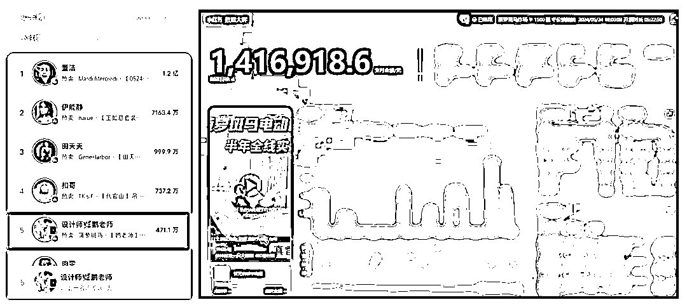

为什么说小红书的直播红利有很多？

几个月前，小红书发布了一组数据，冲上官方榜单的百大买手，其中不乏千粉万粉博主。

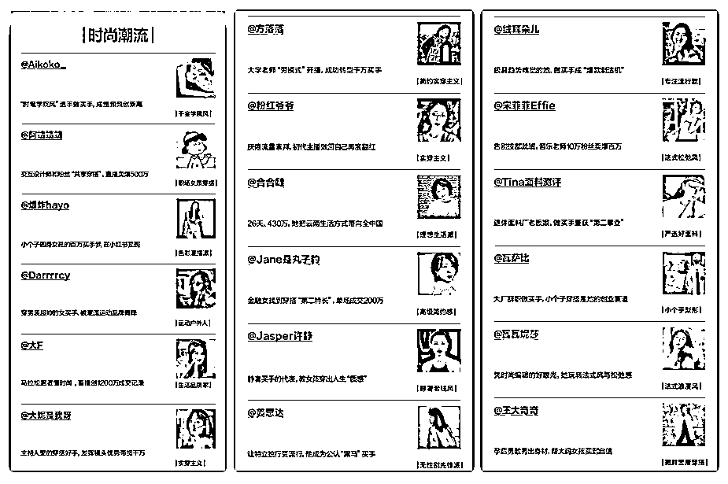

再从政策层面看，今年 618 电商节，官方也给予了大量的扶持，针对新开播的商家、买手都**提供了专属的直播扶持**。

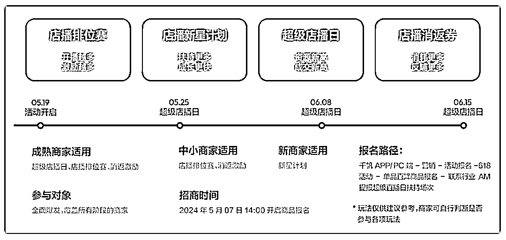

也预示着，今年的小红书直播，一定是不一样的。

我孵化的一位烘培博主，也是从去年开始在小红书直播**。**

她的人均**场观达到 3000+人**，最新一场的预估销量就**达到了 300+份。**

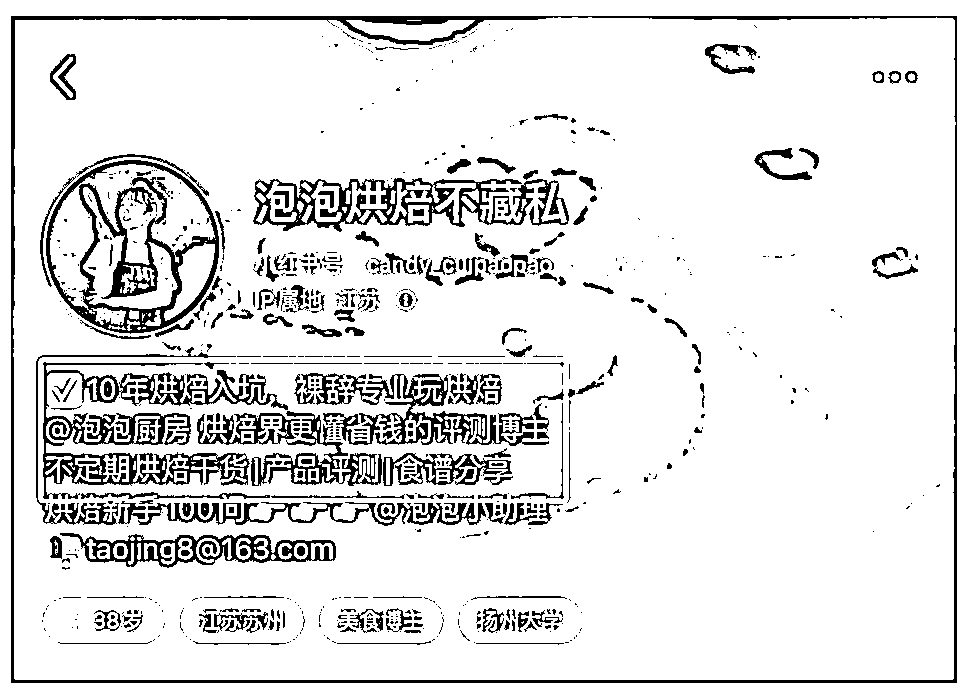

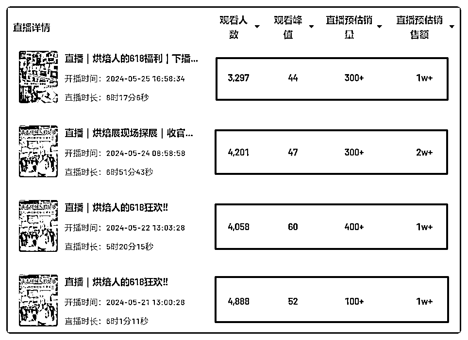

这段时间，她也成功了蹭到了**小红书 618 的直播流量扶持**，为自己的矩阵号带来了巨大的流量。

今天这篇文章来跟大家聊一聊，**小红书直播应该怎么做，如何快速入局，拿到变现结果！**

## **以产品为主导的店铺直播**

小红书平台的女性用户约占 70%，也成就了一个浑然天成的电商环境。

而做好直播的第一步，一定是对**账号的定位和优质的产品。**

那没有产品，如何通过小红书直播，实现变现呢？

#### **1.账号定位：学会蹭品牌热点**

最近，我在小红书看到一个活跃度非常高的账号，没有产品，却靠着蹭流和选品，短短一个月的时间，就收获了 19.2w 的粉丝关注数！

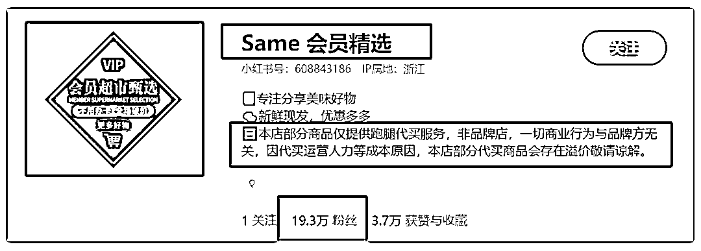

在账号定位上，通过**头像、昵称、签名，与“山姆会员超市”进行了强关联。**

不仅精准的吸引了用户的关注，**也成功的蹭到了品牌的自带流量。**

#### **2.选品方向：与账号定位强关联**

在选品上，不仅做了与账号定位关联的“代买”类产品，更是把相关的“复刻产品”进行直播间的售卖。

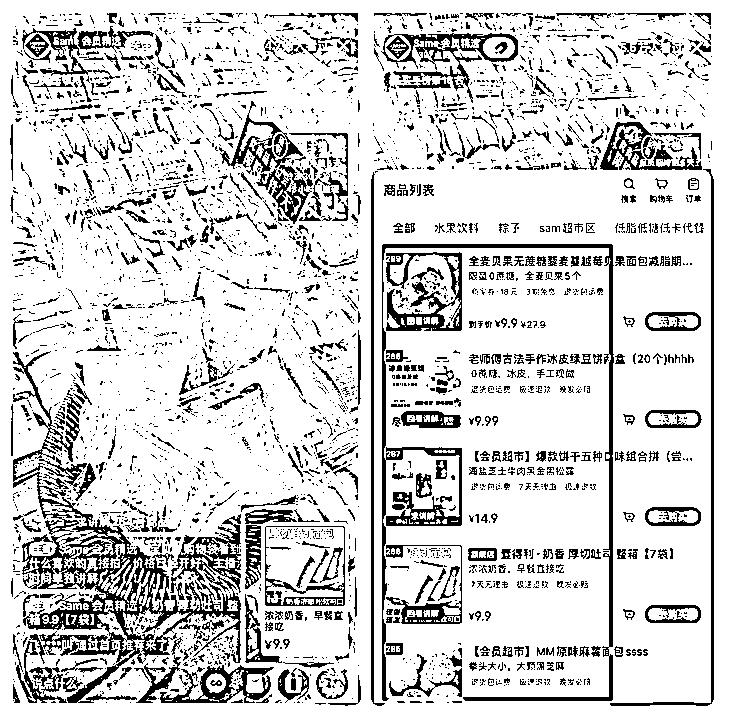

无论是产品的选择还是价格，都非常吸睛；

单一款**9.9 元的产品，销量就达到了 5.2w 的销售量，销售额突破 500000 元+。**

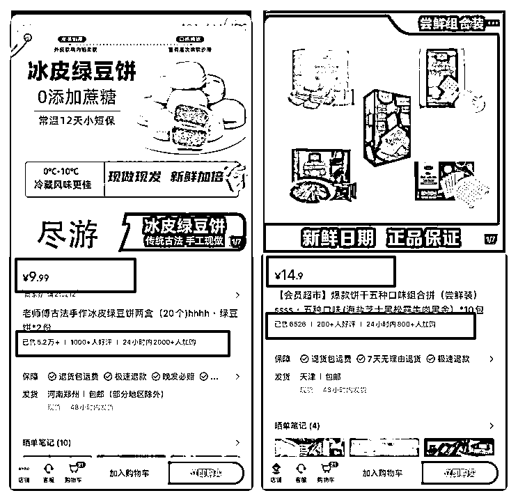

@Sama 会员精选 不仅善于利用**品牌产品与相关产品组合上架售卖**，既提升产品的转化数据，又带动了其他产品的销量。

还合理的运用了这个**身份定位**，在吸粉的同时，也快速的拉高了曝光流量。

不仅如此，还巧妙的避免了关联**品牌侵权的问题**发生，即便是上架了产品，也和直播间的主营产品毫无关系。

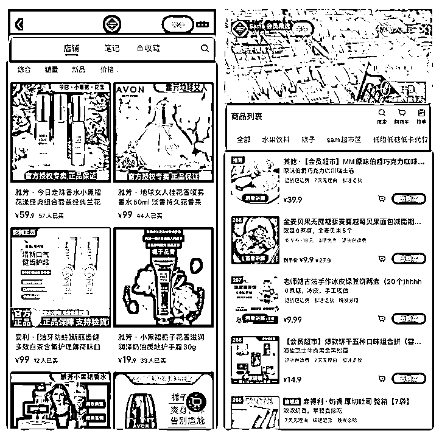

既避免违规风险，又能蹭到品牌流量，这种方法非常适合没有产品的商家博主。

#### **3.笔记内容：真诚、有趣、有话题**

在内容创作方面，通过@Sama 会员精选 置顶的优质爆文笔记可以看出，

在笔记内容上，博主从消费者的角度，**以第一人称拍摄视角，进行沉浸式的试品体验**，让用户有代入感，吸引用户的收藏关注。

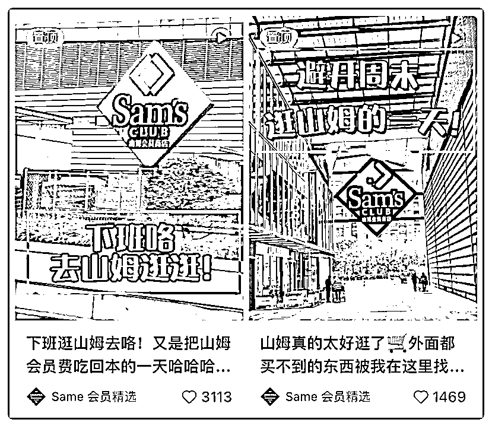

@Sama 会员精选 在笔记文案关键词上，也非常符合**当下年轻人的现状，非常懂目标群体。**

比如：“下班逛山姆”、“避开周末逛山姆”、“又是把山姆会员费吃回本的一天”、“山姆真的太好逛了”等等...

从**真实体验的角度出发，拉高用户的情绪价值，**也让账号在人设定位上更占优势。

除了置顶笔记外，博主还会用一镜到底的方式进行单个产品的拍摄、配乐，操作起来简单，易模仿。

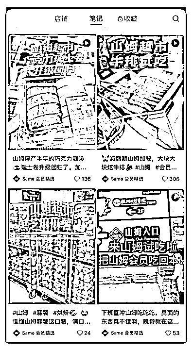

并结合热门产品做视频内容，收获了不错的笔记互动数据。

#### **4.直播技巧：配合预热笔记，提升曝光量**

@Sama 会员精选 在直播策略上也非常值得大家去学习模仿。

利用**低价福利产品+主推产品**的方式，进行不间断的直播讲解，单一款主推品就有 2.9w 的销售量。

目前直播间上架了 289 款关联产品，由此可见，一场直播下来，直播间的 GMV 数据也不容小觑。

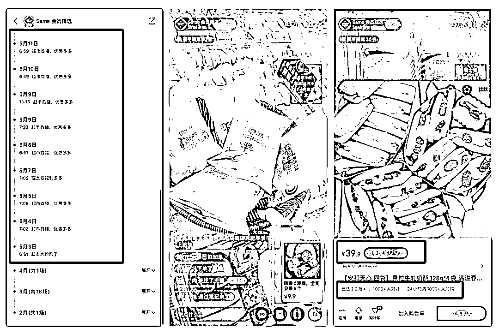

目前，小红书上也出现了不少的代购账号，想要蹭上这波热度流量。

这样的模式不仅可以复刻到**“胖东来”、“开市客”等会员制，或是具有地域性的商超；**

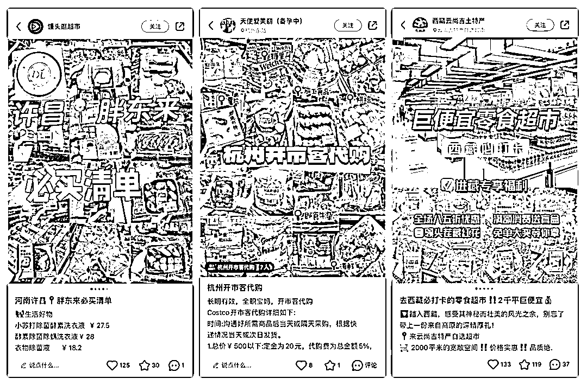

同时，地方特产如“杭州代购”，

或者某景点寺庙代购，如“灵隐寺代购”等，都可以利用这个商业模式放大。

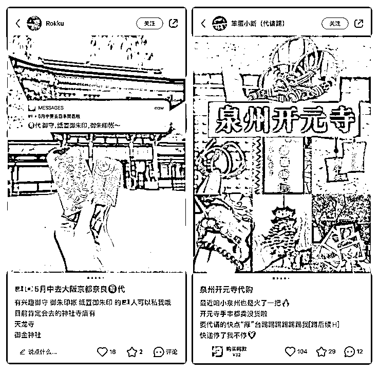

## **以 IP 为主导的达人直播**

除了以产品为主导外，还有一类账号，就是以**账号人设的打造**作为流量切入口，非常适合想做人设型账号的博主。

像@董洁、@章小惠 这类博主账号，在账号定位上，以一个“懂行”的角色定位，粉丝粘性不仅高，种草效果也非常不错。

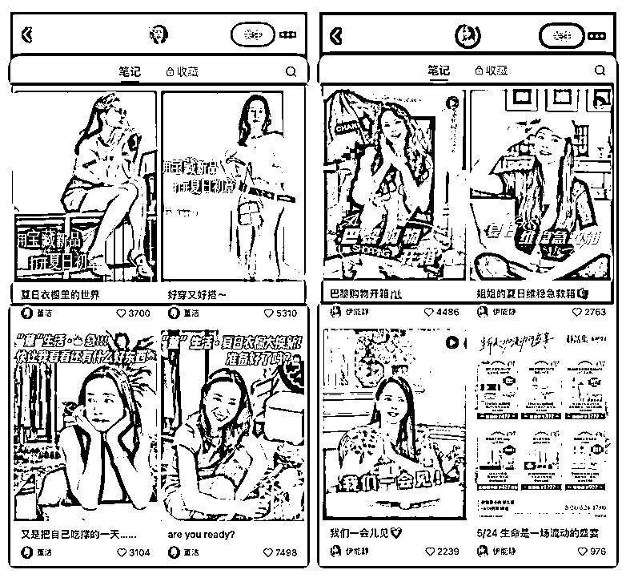

在内容上，通过简单的内容排版，发布专业领域的知识，吸引用户关注。

比如@瓦萨比 ，她就是小红书电商百大买手中的一个独特存在。

#### **1.强人设定位，树立形象**

这个账号最具有特色的地方，就是拥有一个强人设的定位标签：**身高+体重。**

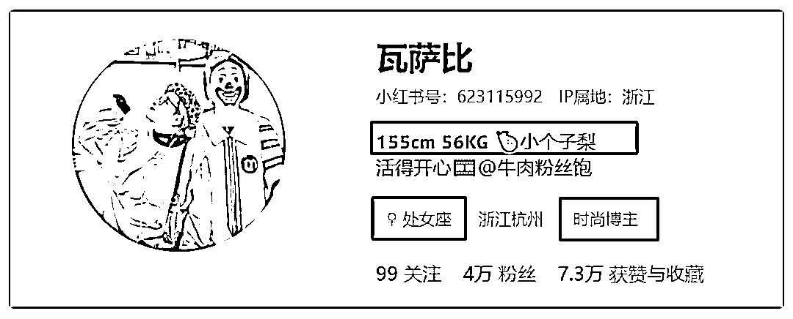

而“小个子梨形”身材，是小红书平台**比较热搜的关键词，也是很多人的痛点。**

@瓦萨比 却把这种大家都认为的缺点，转化成为**她的定位优势，**目前已经收获了 4w+的粉丝关注。

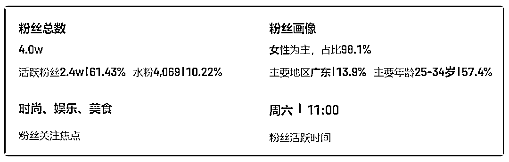

博主的女粉占比就达到了 94.9%，其中，25-34 岁这个主要消费年龄段占了 52.6%，无疑是一个变现能力非常强的账号。

**为什么我一直强调，要在小红书上做好个人 IP。**

因为既简单又好做，并且还能持续性的**获取到精准的流量**，吸粉的同时，转化率也会更高。

#### **2.内容选题，与人设相关联**

在内容创作方面，与账号人设进行关联，不仅不会出现创作瓶颈，还可以围绕一个方向不断地更新优质内容。

@瓦萨比 在内容上，就从**小个子日常穿搭、穿搭视频合集、选品直播预告**等多个相关的方向进行创作。

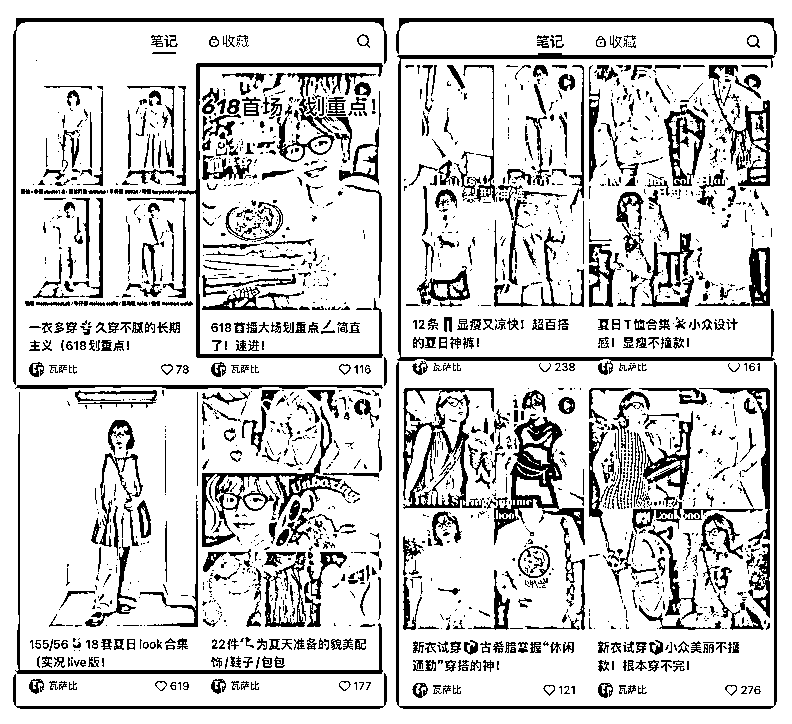

精准的拿捏粉丝的喜好，也能吸引目标人群的持续关注，为后续的转化做铺垫。

与此同时，博主还**把生活与工作进行了区分，**在账号标签上与生活号进行@关联，生活号以 vlog 的方式记录生活。

这样不仅能提升用户粘性、吸引更多用户的关注，同时也能增加变现可能性，达到两全其美的效果。

**其实说白了，能在小红书上赚到钱，选择一定大于努力！**

如果你也想通过小红书实现变现，不仅要做好产品的选择，更重要的还是账号 IP 的定位，以及视觉审美的优化和提升。

* * *

评论区：

小吴姐 : 这么强大的拆解分析贴竟然只点赞、没有手动评论？！我来做第一个！才看到第一个账号拆解，就要来赞赞赞！
谢无敌🐱闪亮猫传媒 : 谢谢宝贝
筱天堂 : 强大！可以直接抄作业了！
米菲🐰 : 厉害👍
悟一 : 学霸，请收下我的膝盖
巴比比巴比巴布 : 感谢分享[鼓掌]
倾听晚风 : 感谢分享！

* * *