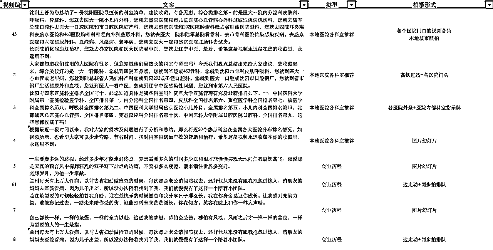

# 如何通过陪诊赚到 124.72 元-拆解

> 原文：[`www.yuque.com/for_lazy/zhoubao/nk3g8k216sg5ngep`](https://www.yuque.com/for_lazy/zhoubao/nk3g8k216sg5ngep)

## (精华帖)(185 赞)如何通过陪诊赚到 124.72 元-拆解

作者： 王平

日期：2024-05-30

##### #项目拆解 #召唤伯乐

##### 客户付费：396 预付+100 小费=496 元

##### 支出：陪诊员 215(90 半天+50 接送+40 超时+返程路费 35)元+打车费 146（48+45+46+7=146）+保险 7.9（3.95*2）+小商店提现 2.38，

##### 共计 215+146+7.9+2.38=371.28 元

##### 利润：496-371.28=124.72 元

##### 项目测试时间：2021 年 11 月

##### 测试地区：江苏省淮安市

* * *

**项目概述**

####      陪诊服务是一种专业的医疗辅助服务，主要为患者在医院就诊时提供全面的陪伴和支持。这种服务通常包括但不限于以下几个方面：

####      1\. 预约挂号：帮助患者预约医生，减少等待时间。

####      2\. 排队候诊：在就诊过程中代替或协助患者排队，提高效率。

####      3\. 取药和报告：代替患者去药房取药，或帮助患者取回检查报告。

####      4\. 医患沟通：在必要时协助患者与医生沟通，确保信息的准确传递。

####      5\. 检查陪同：在进行医学检查时提供必要的支持和帮助。

####      陪诊服务的目标是为了让患者在就医过程中感到更加安心和便利，尤其是对于那些可能因为年龄、健康状况或其他原因而难以独立完成这些任务的人群，如独自在大城市打拼不愿欠人情的人、老年人、孕妇、残疾人士等。此外，陪诊服务还包括一些额外的支持措施，如帮助患者了解病情、治疗方案以及后续的医疗建议。

####      随着社会的发展、人口老龄化的加剧、人们对陪伴需求的增长，使陪诊服务已经从一个新兴的概念逐渐转变为一个标准化、规范化的服务行业。市场上的陪诊服务不仅包括个人从事的陪诊工作，还有养老机构、家政公司、保险公司等提供相关业务。

* * *

#### **项目来源和选择理由**

####      来源：生财#风向标

#### 

####      为什么挑这个项目测试，原因来自于《天道》对经典对话：精神拯救的暴利与毒品麻醉的暴利完全等值，而且不必像贩毒那样耍花招，没有心理成本和法律风险。那个暴利不是由谁决定的，是由人的主决定的，主让众生把他口袋里的钱掏出来，由不得他不掏，因为不是谁让人有了灵，是主。主无处不在，简单地说，支配人的价值取舍行为的那个东西就是主，就是文化属性。

#### 总之-精神需求更具爆发潜力。

* * *

**市场调研和视频发布**

####      从抖音、小红书、视频号平台，筛选出 1 年内点赞最多的视频

#### 

#### 下载视频：使用微信小程序-轻抖-去水印-得到无水印视频

#### 提取文案：使用微信小程序-轻抖-文案提取-得到文案

#### 

#### 下面是得到的视频和文案

#### 

#### 建表格拆解视频

#### 

#### 以下是不同的视频拍摄形式

#### 

接下来就是去医院拍视频了

戴上口罩，谁也不知道你是谁（社恐的福音）

一天去了三家医院，拍了 100 多个素材

前面不是下载了很多关于陪诊的视频吗

现在打开电脑版剪映 app，开始模仿视频，用上拍摄的素材，拼出和爆款视频类似的视频

制作多个模仿的视频并导出

可以制作一些带本地口音的视频，更容易吸引同城的用户

发布在抖音、视频号、小红书等视频平台上

同时启用一个微信号，同步发微信朋友圈，用于新加好友建立信任

并记录发布情况

如果发布视频可以加定位，请加上同城医院定位，有概率上同城热门

发布不同类型的视频可以实现的效果 

下面是账号发布效果

其中一个视频抖音播放量 20W+

小红书播放 5W+，点赞 1150 收藏 880 评论 200

* * *

## 陪诊员管理

如何加上微信：

1.抖音可以私信加微信号，发送带微信号的图片

2.小红书可以用小号发带微信的图文，然后大号分享小号的笔记引导加微信

3.视频号简介直接就可以留微信

**这个是话术：**

陪诊员信息备忘

姓名：

手机号：

年龄：

性别：

历史职业：

自己的优势：

哪些时间可以去医院陪诊：

其它补充：

最后发一个常驻地址定位，便于根据地址优先派单

用 P 开头备注陪诊员 地区-姓名-职业（也就是可以兼职提供陪诊的人）

登记了定位，可以通过定位来做陪诊员地图

展示成果

后期有客户需要陪诊，可以直接到地图上找到离得最近的陪诊员，并电话沟通

* * *

## **成交前准备**

如何收款：淘宝/闲鱼/微信小商店

上架商品需要有主图和详情，看看同行，改一改

同行可以在微信小程序搜索：陪诊

有不同的项目和收费价格

下面是做好主图和详情 （下方有工具包，有 psd 源文件可以修改）

#### 

* * *

**询单对接**

**客户聊天记录**

##### 了解需求，位置，时间，要身份证买保险

**陪诊员聊天记录**

##### 先用陪诊员地图找到客户附近的陪诊员，电话沟通时候有时间提供服务，让她发身份证提前一天买保险

##### 陪诊过程中可以要一些图片和视频素材，用于制作新的视频发布

**建群聊天记录**

##### 同步陪诊进度，发图片、视频、录音，买家支付相关医疗费用

* * *

### **如何购买单日意外保险**

[平安 1 天意外险](https://baoxian.pingan.com/pa18shopnst/era/web/product/shortTermAccident/index.shtml?WT.mc_id=baoxian.pingan.com)

* * *

### **建立陪诊记录档案**

留存陪诊过程中的图片、视频、录音、保险

* * *

### **话术**

陪诊半天 90 元 全天 150 元

一般看病一上午 或一下午就好了 花全天时间的少

单日预期收入：90 元（1 个半天）150 元（一个全天） 180 元（2 个半天）

确认预约后我们支付您 15%定金，陪诊完成后支付尾款 85%

接送有 3 种

1.陪诊员去定位处接+一起到医院+医院送回家+陪诊员返程（支付 4 次打车费+服务费用 50-100）

2.陪诊员去定位处接+一起到医院+打车司机送回家（支付 3 次打车费+服务费用 30-50）

3.陪诊员帮忙打车，让司机接和送（支付 2 次打车费）

有在您附近的客户，我们会提前 1 天以上联系您确认时间，并告知就诊者的情况。

提前一天为您和患者购买保险。

就诊人：xx

年龄：75

性别：男

就诊时间和医院：11.26 上午 xx 医院

接送地址：7：30 前到 漕运镇 xx

就诊原因：血压 180 好几天不降

半天陪诊费 90 元+接送另加 50 元 共计 140 元，定金 15%是 21 元，完成后支付 119 元。

打车费用和医疗费用让群里的家属支付。

有在您附近的客户，我们会提前 1 天以上联系您确认时间，并告知就诊者的情况。

提前一天为您和患者购买保险。

等有合适的顾客 我们再谈费用方面的  因为不同地区的价格会有差别   确认预约后我们支付您 15%定金，陪诊完成后支付尾款 85%  涉及的医疗费用会建群 让家属支付

* * *

### **利润计算**

客户付费：396 预付+100 小费=496 元

##### 支出：陪诊员 215(90 半天+50 接送+40 超时+返程路费 35)元+打车费 146（48+45+46+7=146）+保险 7.9（3.95*2）+小商店提现 2.38，

#####         共计 215+146+7.9+2.38=371.28 元

##### 利润：496-371.28=124.72 元

* * *

### **工具包**

[百度网盘下载](https://pan.baidu.com/s/1oygGOZ_Bg9MUDEtY6UYtbw?pwd=scys)  链接: [`pan.baidu.com/s/1oygGOZ_Bg9MUDEtY6UYtbw?pwd=scys`](https://pan.baidu.com/s/1oygGOZ_Bg9MUDEtY6UYtbw?pwd=scys) 提取码: scys

* * *

### **延伸**

**关于增加复购的思考**

如果客户已经购买了 2 次陪诊服务，就是对我们已经认可了，可以参考以下：

##### 项目成本是多少公司每个人都清楚，所以能赚到的毛利润大家也都心里有数。而我，则把业务员开发到的第一个客户，所获得利润的绝大部分作为提成发放给业务员本身。这个措施加上另外一些比如循环淘汰等等制度相结合，是为了保证他能每天都有激情去开发新客户；以后基本上客户要重复消费都与业务员本身没有联系了，都是直接与客服部联系，但，我把这个客户后续消费为公司带来的利润划分一部分比例作为业务员的后续奖金按时发放。这样做的结果是什么样的呢？渐渐地，业务员开发到客户，为公司带来财富的同时，自己也累积了很多老客户，而这些客户就会每一两个月都会为公司带来利润的同时，也为他自己带来一部分奖金。老客户很少流失，新客户不断加入，所以，这个业务员差不多每个月都比上个月拿到的钱要多。那，请问，他还有什么理由离开公司呢？因为一旦他离开公司，这些奖金将全部取消。

##### 所以他在离开还是待下去两者作选择的时候就不会那么轻易地选择潇洒走人了。而我这个项目里面，最牛逼的一个业务员月薪从最初的 500 元不断涨到了现在的一万多，每个月单单拿老客户提成就是大几千的人还不少。基本上，这个项目从立项到现在，只要是个人才，就只有升职的，没有叛逃的。因为他们知道，在这里，只要自己认真工作，工资似乎没有天花板。那谁还愿意放弃自己前期这么多的积累而选择另外一个陌生的零起点呢？

##### 业务员如果缺少监管的话都喜欢贪污、少报或接私单。很多行业都有类似潜规则，业内人士应该深有感触。所以我多加入一些限制的规则，表面上是游戏规则，其实也是用利的武器来约束他们呀。那就是，每发展一个业务，初次打货的大部分收入分给业务员，后期这个客户重复付费而赚取的也拿出一部分作为这个业务员的奖金。但有一条比较特殊的就是：一旦出现少报、接私单或者贪污行为，一经证实则立刻开除，情节严重者追究法律责任；被开除人的以前客户累计全部计入举报者名下。基本上，新到的业务员不会这么快就开始搞公司的鬼，都是一段时间后陌生感消失了才开始心痒痒。而在这些制度之下，往往几个月后他就积累了一些的客户，有了一定的稳定提成，何况最开始也会有人相互监督。所以在面对可能的诱惑的时候他就会多一层顾虑了。

团队的销售和客户，均可当做我们的业务员来看待，基于增量，给与首单纯利润分成和复购纯利润分成。

**关于拓展渠道的思考**

##### 团队刚组建不久，为了尽快打开市场，我把所有的业务人员分成了三个业务小组，每个小组大概 7 个人，我要求他们，在传统销售模式的基础上，每个小组必须要去尝试非传统的销售渠道，至于具体是什么渠道，自己琢磨试验、自己去想办法（当然，是在一定基本行为规范的前提下自由发挥了）。

##### 3 个月的考核期，哪个小组在非传统渠道之外的渠道取得最好的成绩，哪个小组胜出，然后再在这个胜出小组的 7 个人中统计排名。第一名直接越级升职为营销主管，第二名到第四名分别任这 3 个业务小组的组长，如果能在接下来的 3 个月排名也为该小组第一名，则升为销售经理。

##### 这是在干嘛？这是让每个人在团队合作中有竞争意识，最大程度地发挥每个人的主观能动性。知道 3 个月考核期过后的情况如何吗？结果让我都大吃一惊，给我带来了很大的震撼。他们出其意料地尝试了很多很多不同的渠道，很多连我想都没有想过，更让我吃惊的是，最后效果最好的渠道也是我从来没有想到过的，真是不可思议，就算再给几个月时间让我去想破脑袋我估计也难以想出来。问题的重点来了，原先我最有信心的渠道成果并不明显，投入了大量资源的渠道效果也不明显，而从来没有想过的渠道却赚到了相对最多的钱。这个时候，是你的话，会怎样继续开展公司的业务呢？所以经过深思熟虑过后，我是这样做的，壮士断腕，将所有的其他渠道全部停掉；将业务人员重新分配，还是 3 个小组，只是将胜出的那个小组的二三名以及倒数二、三名与另外 2 个小组的 4 人平均置换了；然后在全团队第一名，也就是营销主管的带领下，全部人员把全部的精力都投入到深入学习、研究这个赚到钱、效果最好的渠道中来；然后开始疯狂地挖掘这个渠道，每个人都用尽自己所能，把这个渠道的生意做到极致。后来，这样调整思路后的效果反映到公司利润上来，就是每个月都以惊人的速度增长。

#### **MVP 法则**

##### MVP（最小化可行产品）是一种产品开发策略，旨在通过构建一个功能最基础的产品版本来快速获得市场反馈，并据此进行迭代优化。这种方法最初由 Eric Ries 在其著作《精益创业》中提出。

##### MVP 的核心思想是以最低的成本和风险快速推出产品，以验证市场需求和商业模式的可行性。它强调的是“最小化”和“可行性”，即产品应包含满足用户基本需求的最少功能集合，同时保证这些功能的实用性和可用性。

##### 实施 MVP 的过程通常包括以下几个步骤：首先，明确产品愿景和核心职能；其次，设计并实现一个包含关键功能的最小化产品；然后，将这个产品快速推向市场，收集用户反馈；最后，根据收集到的数据和用户反馈对产品进行迭代改进。

##### MVP 的优势在于能够有效降低开发成本和时间，同时减少市场风险。通过早期的市场测试，企业可以更快地发现并纠正潜在的问题，从而提高产品成功率。此外，MVP 还支持灵活的迭代过程，使得产品能够根据市场变化不断调整和优化。

##### 这种方法特别适合于资源有限或需要快速验证市场反应的创业团队和初创企业。

##### 会不会有很多生意，并不需要你有交付的能力，只需要你把需求方和交付方拉个群，甚至都不用收款，只需要和交付方谈好首次成交纯利分成，复购小比例纯利分成，再和有复购的需求方用同样方式合作，就可以跑通呢？

* * *

### **感谢**

感谢生财有术 #风向标 提供的方向

感谢@海子 在江苏淮安期间提供的帮助

欢迎圈友积极尝试，大胆尝试，先赚到 1 元钱，会越来越有感觉

* * *

### **召唤伯乐**

##### 如果您独具慧眼，通过这篇分享，能发掘出我的优势，可提供平台和机会，欢迎邀请我加入团队，可星球私信或联系鱼丸要我的联系方式

##### 之前的文章：

##### 精华帖：[《淘宝定制类目的蓝海机会》](https://t.zsxq.com/nKVuE)

##### 普通帖： [《始于钝感力，聊聊内功心法》](https://articles.zsxq.com/id_fxujpao4xzw1.html)

##### 如果找工作太难，如何让工作找你呢？

##### 如果你追钱太累，如何让钱追你呢？

##### 思考，，，，，，，

* * *

评论区：

今天也是贫穷的婷婷子 : 我真是看了风向标就过了，毫无执行力，你真是太 6 了
浅榆木 : 圈友行动力太强了[强]，这个项目我一直在观望着，也就几天前的事，不得不佩服啊[强][强]
大毛 : 这个项目，有一个叫国康医疗的机构一直在做。
兰心 : 有兴趣，有一起组队的吗
阿愚呱呱 RPA : 执行很强，梳理很细，流弊
王平 : RPA 收益良多
王平 : 谢谢认可[愉快]
胖大魔 : 国标出来，后面应该有机会

* * *