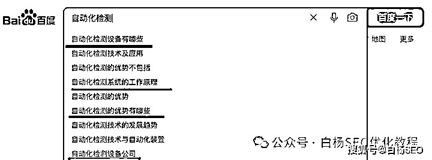

# 为什么任何“创业”要先找需求？分享下自己大学卖书的真实故事

> 原文：[`www.yuque.com/for_lazy/zhoubao/iv5qv2lh6inzgff3`](https://www.yuque.com/for_lazy/zhoubao/iv5qv2lh6inzgff3)

## (35 赞)为什么任何“创业”要先找需求？分享下自己大学卖书的真实故事

作者： 白杨 SEO

日期：2024-05-27

创业，一般理解，狭义讲是指创办了个企业，广义是指创造一番事业。

我之所以把“创业”加了个双引号，除了上面狭义或者广义之外，我觉得像个体工作室、个人 IP、自由职业甚至线下各类路边摊也可以算。当然绝大部分人不会同意，他们会认为这哪里是创业，这就是生存。

不管是理解成创业，还是生存，为什么都要先找用户需求？

**先讲一个我的失败的真实故事。**

2006 年，我 20 岁，考上了大学（大专），带着家里亲戚凑的 500 元，凭借自己理解可以助学贷款一个人去了成都，也是第一次出我们市。

（大学宿舍时的我，这件衣服同学送的）

至于如何最终报上了名，中间又有哪些事在这里姑且不说，以后有时间在我视频号白杨 SEO 每周三晚上直播时再讲。

因为家里三代都没有从商之类的人，我的从商经验还是很小的时候跟我哥去卖打火机饼烟啥来的（因为我哥小学毕业没书读了，一是家里供两个上学难，二是我哥成绩不太好，我爸给他找个事干，所以让他去走村卖东西）。

进入大学后，除了上课学习以外，我最重要考虑的是如何生活下去。考上大专，因为家庭情况，所以我们县教育局奖励了我两千元，好像本科是三千。解决吃饭问题，我就想到了食堂，能免费吃饭，所以就去食堂打临时工。

上图就是我大学饭堂打工地方，后面重游大学拍的。我的大学前两年就这么过来的。因为食堂打工，除了吃饭，每个月也就一百来块钱。离我一年学费（含住宿）六千多还差太远，所以我又去了学校水服部送水打工，每送一桶水有一块钱（中午一般能有几块到二十块）。

后面我又去了学校开水房打工，甚至想到去学校打扫教室清洁处打工。即使如此，仍觉得要还完大学三年学费太慢。除了当时想好好读书拿奖学金外，应该要做点什么事，“创业”就这么来了。

因为打工送水，所以会去很多寝室，男生女生的都有，又加上后面竞选了个“楼长”（检查卫生什么的）所以跟一些寝室同学就熟了。

我当时就想，我能不能做点什么生意呢？因为我自己喜欢看书，我在想他们会不会喜欢看书，我可不可以卖书给他们，赚点跑路费。

如果我要卖书，我就需要有启动资金，当时其实除了生活，手上没有多少钱，而且我买的书是他们想要的吗？所以我就做了一件事，先做统计，再来买书或者找人合作。

我就一个一个寝室去敲门问，拿着纸和笔，男生宿舍好进也好问，他们有些人在打游戏，有些在看干别的，我就把问到的记下来。

大概是：同学，我是 XXX 寝室杨红林，是这样的，我在做一个调查统计，方便问下，你们有看书吗？大概喜欢看什么样的书？是租还是买的？如果我有这样一个送货上门服务你们愿意要吗？

女生宿舍呢，我就利用送水的时候顺带问一下，然后用脑子记住，当然没有男生宿舍问的那么多。（现在看来，原来这就是在调研需求）

大约一个星期左右，基本统计好了，我就利用周末去外面找书源。因为统计里面，我大概知道男生喜欢看武侠，女生喜欢看言情，并不是我喜欢看的文学，而且愿意买的人并不多，租的人更多，所以我就留意租书的地方。

找了蛮久，看到一个租书的书屋，进去后聊了才了解到这个开的是我们大学的一个师兄。

因为我自己没什么钱，所以我想到的是“团购”预订形式，就是我去统计需求然后找他拿书，我呢赚这个租书返佣。我说可以先付一些租书钱。他可能看我是大一，也可能觉得我是空手套白狼，还有他现有租书业务也还行，反正没有谈拢。

按理我应该再找几家谈，总有同意的，因为算是我第一次尝试创业，又因为晚上要回去打工，所以就算了。所以第一次想靠租书和卖书创业失败。当然也有意外之喜。

意外之喜，因为在找合作的时候看到一个卖矿泉水的，跟那老板聊，他觉得我还可以，我成了校园他那个矿泉水批发代理。做了大半年多，后面因为学校严还有竞争（学校内有人提供了，之前没有）

后来，我没有跟那个卖书师兄合作成我就自己去成都旧书批发市场自己进书卖，利用周末，骑自行车来回 6 个小时，每次买一两百块的书，可以赚个一百块，一部分卖寝室，一部分校外摆摊卖，对于有像我这样特别喜欢书，聊得来的，我就给优惠哈哈哈。

**为什么任何创业都需要先找需求？**

在回答为什么之前，先说说需求是什么？需求怎么找到？

需求是什么，简单理解就是别人愿意为这个买单，不管是产品还是服务。

有人说需求就是流量，流量就是需求。前半句对，后半句不对！

需求就是流量，没有错，因为只要有需求，就有人去找。比如线下衣食住行服务是人的刚需，比如线上不管是找工作还是看病还是找设备还是学习还是别的，只要你找准需求，这个需求就是流量。

为什么说流量不是需求？举个简单例子，你逛过店吧，你刷过短视频吧，你对于店来说，对于短视频平台来说，你就是他们的流量，但你不一定买过，你只是想看看而已。如果我把流量前面加上“精准”二字，精准流量，那么就可以说是需求了哈。

**创业需求怎么找到？白杨 SEO 建议三种方法。**

方法一：从自己痛点，经历，或者自己公司的业务找需求。

白杨 SEO 身边好几个创业朋友第一次创业出来做的业务都是和自己原来所在公司有相关的。因为熟悉，不管是找潜在客户需求，还是找供应链都相对容易。

拿白杨 SEO 自己来说，虽然做自由职业跟我打工十年的公司业务没有直接关系，但 SEO 顾问或者 SEO 服务，这些是我十年打工中常用的技能。

方法二：线下做市场调研，找到需求

白杨 SEO 上面那个大学想创业卖书就是做线下市场调研，找到的需求。其实我上面还有点没说，我去买瓶装水代理，因为有寝室同学说有这个需要，需要一件一件买。

因为我自己没有创业成功过（如果你说我现在这种有点影响力也算的话，那就有），所以实体创业线下市场调研更深入的经验我都是没有的。

我以前只是打工，在甲方王氏线下卖大闸蟹，茶叶店做过线上线下推广，但线下比如选店，比如产品包括定价根据什么来，这块没有做过，所以给不出建议。

如果白杨 SEO 粉丝有做过有不错的，可以找我投稿或者留言，以后我可能也会涉及。

方法三：从搜索框去找到用户需求

这是白杨 SEO 最擅长的，准确的说，只要是 SEO 从业都都应该具备这一基础技能。

如何从搜索框里去找用户需求，简单理解用到关键词即可。怎么用，我截一些图，如果你能看懂图，你就明白了。

我以百度 PC 截图举例，其它平台类似。

你可能会说，看下拉框呀，原来这么简单？就是这一步，很多人都没弄明白！

其实还有比如如何找到提示词（放进下拉的词）？如何找完这个下拉词？百度这个下拉跟抖音，小红书，微信下拉怎么判断谁更好？下拉词到底有没有流量，有多少流量？这些下拉词如何布局到各平台去？又怎么让这些下拉词有排名，有效果？

其实以上这些都是做 SEO，做流量，做营销必须要掌握的技能。当然也并不是一次就可以学会，还要不断实践。

我们创业的时候会说，先要跑通。什么叫跑通？所谓跑通就是指假如你想在某个平台做流量来转化，就是先要做来流量。比如我喜欢现在喜欢用公众号做搜索流量，跟一个朋友业务让我帮测试试，已经有精准需求来了。

虽然目前还不多，至少验证这个方法在这个平台是可行的。虽然没有小红书那个来的流量快，但是用户主动搜索加过来的。

如果我告诉你测试项目的内容除了找需求词和标题是我写的外，内容全都是用 AI 写作的呢？只是做了下排版和优化。而且，现在 AI 创作的内容在某些专业领域已经不错了！当然白杨 SEO 优化教程这个垂直 IP 全网内容都是白杨 SEO 本人手打原创，不会用 AI 写作哈。

**回到今天最重要问题：为什么任何形式的创业都需要先找需求？**

因为不管你是创业，还是做副业，还是做自由职业什么的，因为只有你先找到你想做的这个事情里的用户需求，你才能最终赚到钱，够直白吧。

创业先找需求，也可以是说定位，就是你的潜在人群是谁，谁为你付费，你提供什么样的产品或服务。

你说，白杨 SEO，我就是做公众号推荐流量赚流量主，赚平台给我广告费，我做短视频拿平台分佣金，不需要找用户需求！但我告诉，这样可能养不活你自己，因为不稳定，当然你要成了网红当我没说。

商业最最最基本的底层逻辑就是，要想赚钱就是提供相应价值！

哪怕短视频，直播带货，也是卖货。做什么游戏，娱乐主播，也提供了情续价值！

如果你是创业者或者想创业，产品，流量，转化，这三者你至少要擅长一样，否则千万不要去创业，哪怕自由职业也不行。当然你说去送外卖啥的，那不在这个范围！

**作者介绍：**

白杨 SEO，专注 SEO 十年，全网 SEO 流量实战派，对互联网精准流量有深入研究。全网同名白杨 SEO，都能找到我。

* * *

评论区：

暂无评论

* * *