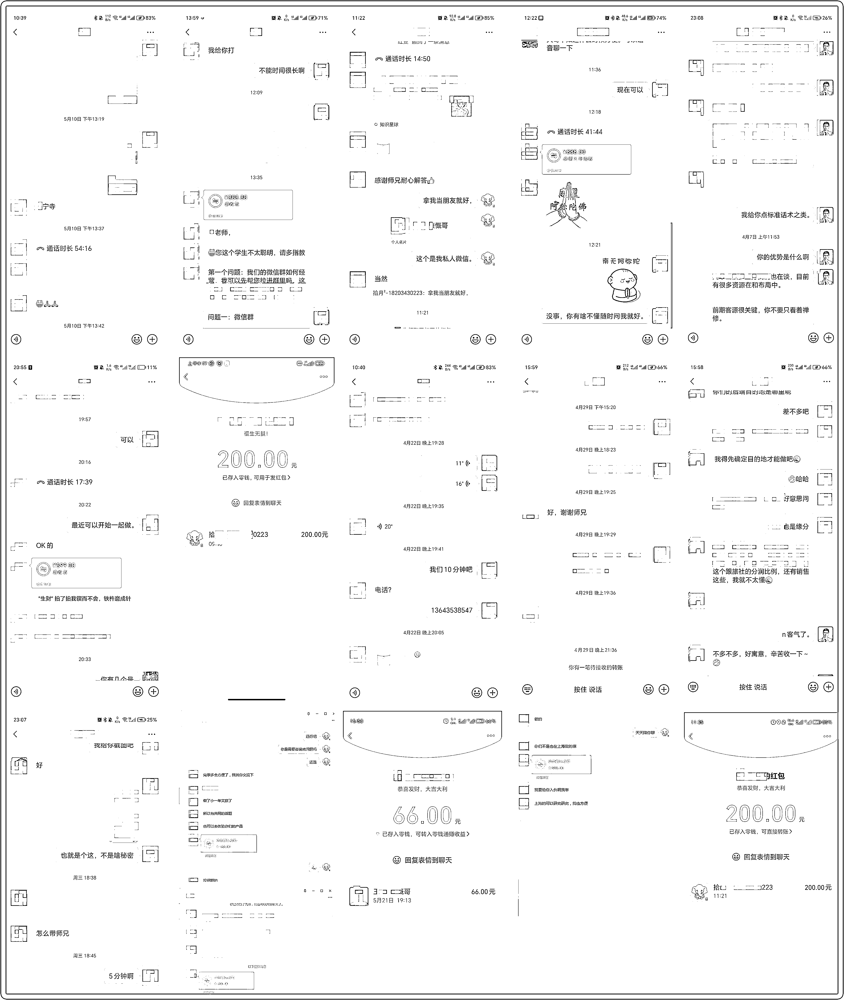
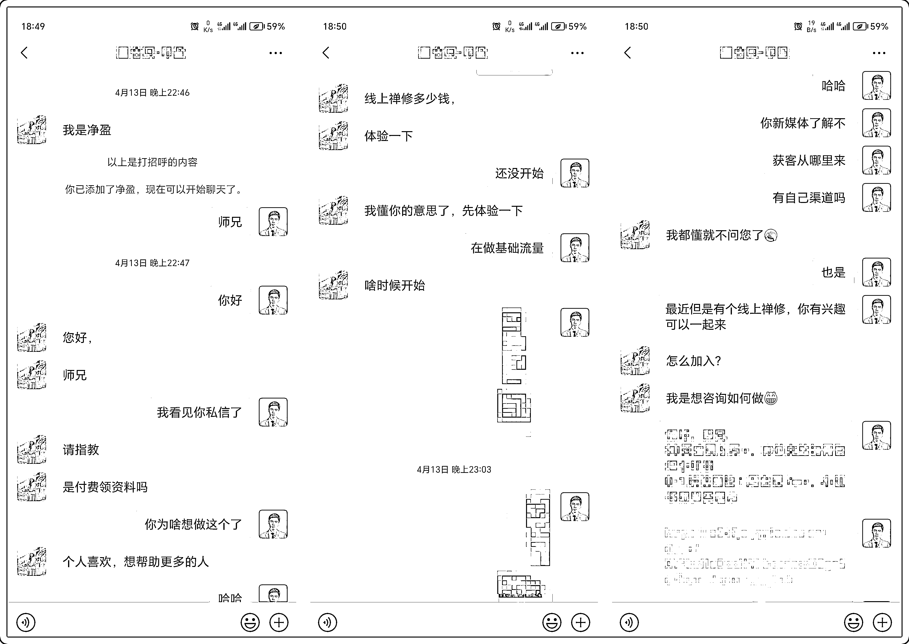
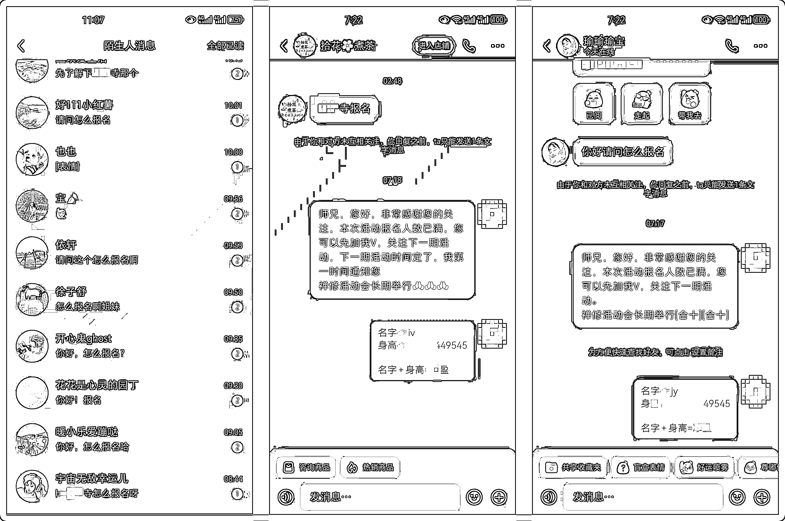
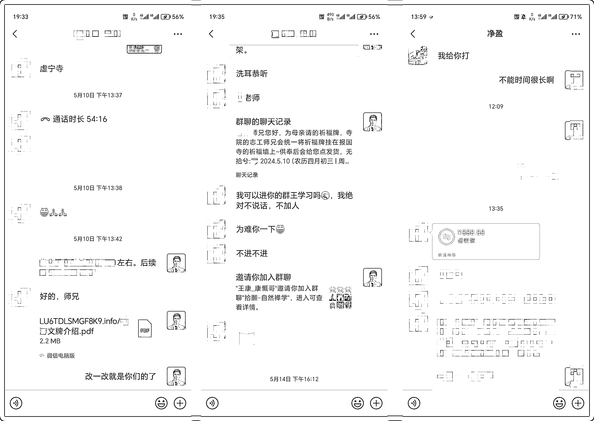
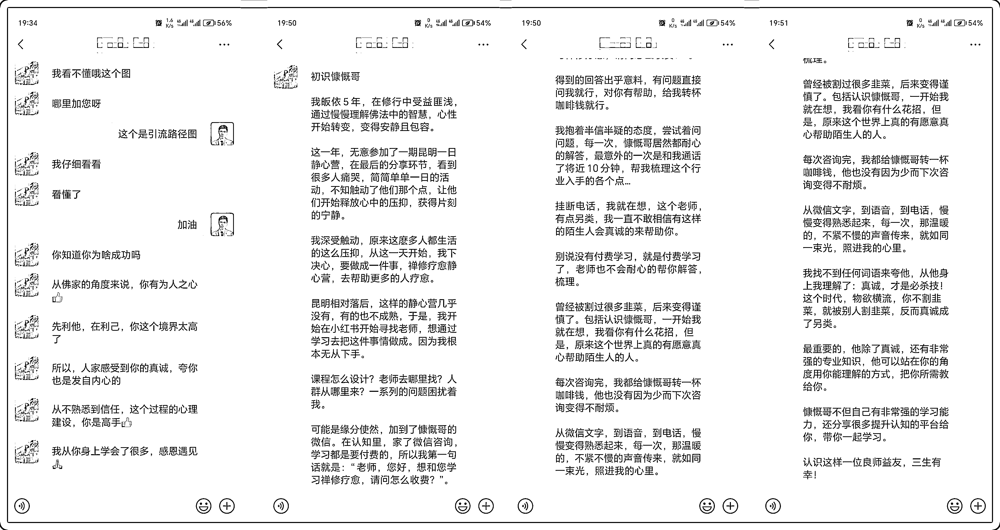

# 零基础做禅旅咨询变现 3w+，揭秘我的变现秘诀!

> 原文：[`www.yuque.com/for_lazy/zhoubao/sb5nxoqnn4rfqo27`](https://www.yuque.com/for_lazy/zhoubao/sb5nxoqnn4rfqo27)

## (34 赞)零基础做禅旅咨询变现 3w+，揭秘我的变现秘诀!

作者： 安小安

日期：2024-05-28

#### **一、自我介绍**

大家好我是拾月，之前分享了过 2 篇文章，没有阅读过的圈友可以重复阅读下，分别为[30 天变现 5 万+，禅修文旅如何做爆小红书](https://b3k2jeijqy.feishu.cn/docx/G3HFd8l1xoK63SxEB7lcCwrInRD?from=from_copylink)与[1 周变现 7w+，小红书禅旅赛道从 0-1 玩法揭秘](https://b3k2jeijqy.feishu.cn/docx/XVNud1sOool1VHxcshhcd08gn5c?from=from_copylink) 。

经过一段时间的忙碌，总结了一些咨询心得，也依靠咨询费挣到了一笔小钱，没有做专属的产品，几个月算下来也是差不多几万块，服务也有 200-300 人左右， 以下是个别的截图。

**二、项目介绍**

这里描述不涉及公域流量账号与内容的制作，重点复盘一下我变现几个步骤与操作逻辑，也许对大家会有帮助。

1.客户怎么来的？

社群：当时写完几篇项目复盘之后，几个社群主理人邀请我是否可以到他们那么进行分享，于是也就答应了下来，在进行第一次分享完之后，会有一些师兄觉得这个项目比较有意思，后续陆陆续续开始添加我。

小红书：我们大部分账号内容基本还是以小红书渠道为主，当时不是什么资料引流之类，基本都是禅修禅旅等一些活动内容，除了一些参加禅修的客户，还有另外一小部分人，对禅旅项目非常有兴趣，特意来咨询怎么做的。

3.交付如何做的？

有了基础咨询流量入口之后，那么其实就是一些经验分享与解决方案，后来人数的增多我还是把问题大概分了一下类。

资源型客户（有资源没流量，有流量没资源，有资源有流量没产品）这类用户其实就是帮他们解決，如何通过手上资源变现即可，包括整个高客单价变现体系。

迷茫型客户（没资源没产品没流量）基本就是想了解趋势与这个项目利润等一些问题，有些就是看这个赛道是否可以做个副业，这类用户碎片化问题会多一点，针对这些问题我做了个总结。

咨询问题库：[`www.yuque.com/yuqueyonghueepy1t/kznln1/bfsdt8acb795f5og?singleDoc#`](https://www.yuque.com/yuqueyonghueepy1t/kznln1/bfsdt8acb795f5og?singleDoc=)

3.转化如何来做？

这里先插一段话（目前这个转化方式定义为先提供价值后收费）

为什么转化没有放在交付前来描述，原因是我个人“性格问题”有两个因素，一目前没有把“咨询”作为业务中的一部分完全是顺带，二是个人觉得自己本身是普通人提供服务一定要有价值，但是让我惊讶的是，每次做完咨询之后，客户都会转一笔钱给我。

后来我问过客户，我给你解答的问题，是否可以对你有帮助，当时客户是这么回答的（我咨询过很多人都是先交费后提供服务，但是到你这里完全不一样了，都是先让把提出直接给我语音解答）这让它对我产生好感，在加上我确实帮他解决这个赛道的核心问题。

* * *

#### **三、新人建议**

1.如果你跑通了一个项目并且拿到了结果，一定要分享出来实现咨询闭环。

2.在对价格定位迷茫时候，完全可以采用先提供价值在收取费用。

3.对客户解答问题一定要坦诚、耐心并且洞察客户问题点解决掉它。

* * *

#### **四、私交陪跑**

这里我用最小模型来描述下针对单一客户，我是如何形成私教陪跑闭环的。（学员谈不上，我称之为合作伙伴）。

1.客户从哪里来？

起初我写了 2 篇复盘文章，心想把它还是发在小红书，尝试能否可以引流公域咨询人群，笔记内容（这里没有技巧）发布之后过了 2 天，有一些流量通过引导添加上了我，后续就是基础的赛道咨询。

* * *

2.提供什么服务？

当时客户确实想做这个赛道，但是我对她资源也不是很了解，后续基本沟通 30 分钟之后，大概了解客户的情况，有师资有场地没流量没产品，于是我帮他解决产品与流量问题就行，这 2 点其实不是很难。

产品问题当天晚上沟通完，第二天就快速做出活动 PPT，初步定为 2 天 1 晚寺庙禅修，这个效率也是觉了。

剩余就是做流量了（在新场地新地域 0-1 没有那么套路），直接做营销内容就是最快的方式，跑通闭环之后在考虑其他的。

* * *

3.后期如何做私教转化？

在做活动策划包括流量等方面，师兄会遇到很多很多细节问题，包括价格方面、细节流程、师资配合度、活动主题等问题，在没有经验时候，每一个问题都是一个门槛，于是对应这些问题我就给予解答，也没有收取相对费用，基本就是解答完，师兄请我喝杯辛巴克，顺带的事情。

前期我帮助合作伙伴解决问题，建立基础信任关系，客户随意给钱即可。

后期在信任基础之上，合作伙伴愿意支付基本咨询培训费与活动的 15%利润（这里策划单月 4 场活动）。

* * *

4.客户给予我的评价？

其实还是非常感谢客户对我的认可，我个人觉得挣钱还是建立的在原则上比较好，之前很多人问我为啥不做个社群其实有想过，觉得时机还不是很成熟、目前还是在沉淀沉淀吧。（因工作需要，名称更改为慷慨哥）

* * *

* * *

评论区：

安小安 : 一些基础问题解答，大家有兴趣可以看看的。
若梧 : 能直接参与你的分销吗
安小安 : 可以的。
夜未澜 : 学习了
Lic : 我看他们现在用免费禅修的字样卷流量
安小安 : 哈哈
安小安 : 免费有免费变现方式，一般免费的都是对应的一些小寺庙。
丙恒 : 链接一下吧！！

* * *