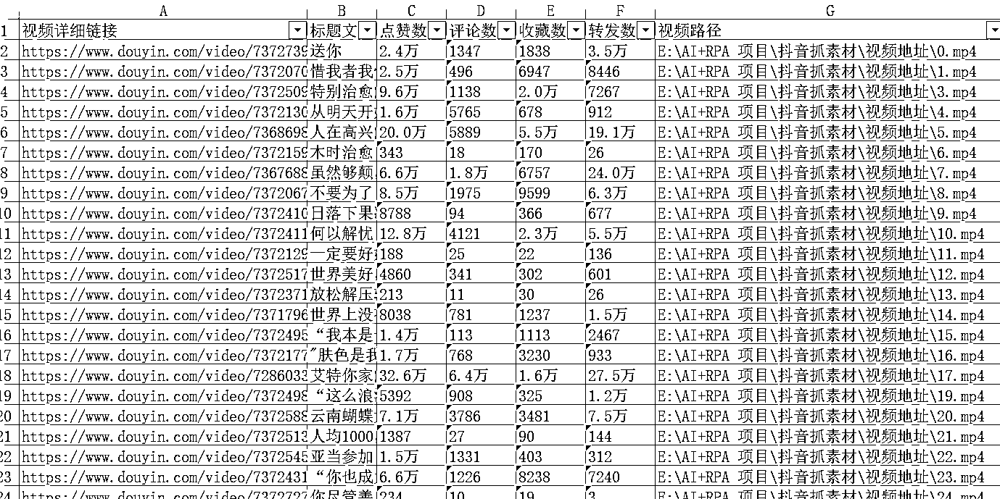

# 抖音平台根据关键字搜索爆款素材采集机器人

> 原文：[`www.yuque.com/for_lazy/zhoubao/lu02m4956ic0q0ub`](https://www.yuque.com/for_lazy/zhoubao/lu02m4956ic0q0ub)

## (22 赞)抖音平台根据关键字搜索爆款素材采集机器人

作者： 码农飞哥|RPA 定制

日期：2024-05-29

> ## **一、业务场景：**
> 
> 抖音作为头部短视频平台，日活达到了十亿级别，是短视频算法推荐的鼻祖。平台内有大量低粉爆款视频，这些视频一直是内容创作者所对标的视频。但是人工采集这些视频素材费时费力，需要耗费大量的时间。
> 
> 所以，一款全自动关键字搜索爆款素材采集机器人就可以帮助创作者节省大量的人力物力，从而更好地进行创作。
> 
> ### **一、演示视频**
> 
> 暂时无法在飞书文档外展示此内容
> 
> ### 2、功能效果：
> 
> 1、根据关键词搜索采集爆款素材
> 
> 2、下载爆款视频，将采集到的视频下载到电脑本地
> 
> 3、采集视频的标题，点赞数，收藏数，评论数，转发数，并关联对应的视频路径。
> 
> 
> 
> 
> 
> ## **二、使用手册**
> 
> 1、Chrome 浏览器需要安装好影刀插件
> 
> 2、创建好素材和图片的保存目录
> 
> 3、运行影刀 RPA 应用
> 
> ## **三、程序运行流程：**
> 
> 
> 
> 1、选择素材以及图片的保存目录，输入需要搜索的关键词，输入需要爬取的页数
> 
> 2、批量抓取本页的视频详情链接
> 
> 3、循环打开视频详情页，抓取文案，点赞数，收藏数等信息，并下载视频，将这些信息保存到数据表格中。
> 
> 4、导出数据表格到 Excel 中。
> 
> ## **四、机器人代码解释**
> 
> ### **主体代码截图：**
> 
> 
> 
> ### 1、输入对话框
> 
> 
> 
> 输入对话框中共有 素材保存目录（就是 Execl 的保存地址），视频保存路径，待搜索的关键词，需要搜索的页数。
> 
> #### **2、打开搜索页**
> 
> 
> 
> 这里根据输入的关键词直接打开最终的搜索页面，节省了点击步骤。
> 
> ### **4、循环页数**
> 
> 因为每页展示的数据有限的，所有需要翻页来不断地抓取数据。鼠标每滚动一次就相当于翻了一页。
> 
> 
> 
> 
> 
> ### 5、获取相似元素列表
> 
> 使用【获取相似元素列表】指令 采用 XPath 定位方式来定位到当前页内所有的视频详情链接。
> 
> 
> 
> 接着就是挨个循环捕获到相似元素列表，读取其里面的链接。
> 
> ### 6、获取视频下载链接
> 
> 获取视频下载链接分为两步，第一步是通过 XPath 的方式获取链接元素，获取的方式如下图所示：
> 
> 
> 
> 第二步是获取元素信息
> 
> 
> 
> 其他的属性获取比较简单，在此就不赘述了。希望本文对生财圈友所有帮助。
> 
> * * *
> 
> 评论区：
> 
> ※嘻£嘻※ : 大哥，真厉害！
> 拾悦说 : [强][强][强]
> 码农飞哥|RPA 定制 : 欢迎与我交流
> 码农飞哥|RPA 定制 : [嘿哈][嘿哈]
> 鸯哥 : 厉害
> 
> 
> 
> * * *