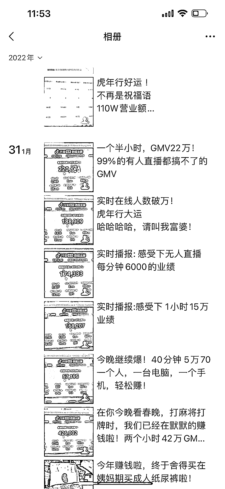
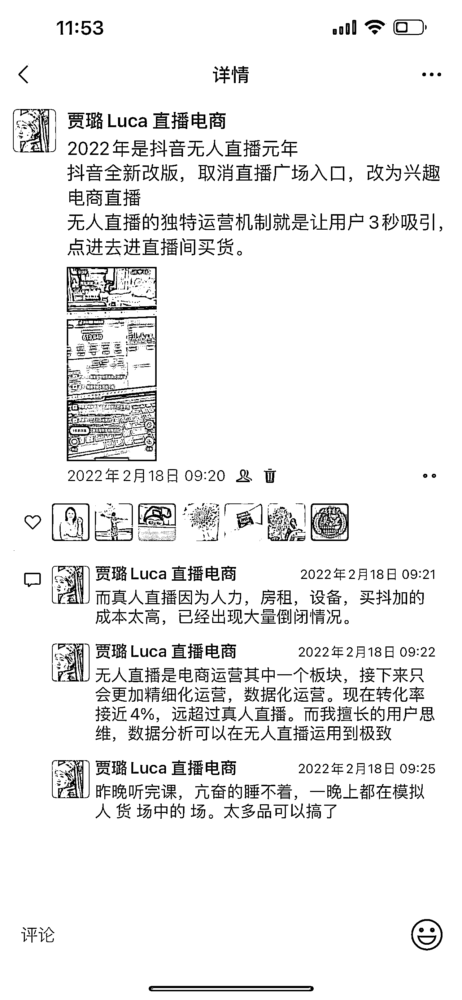
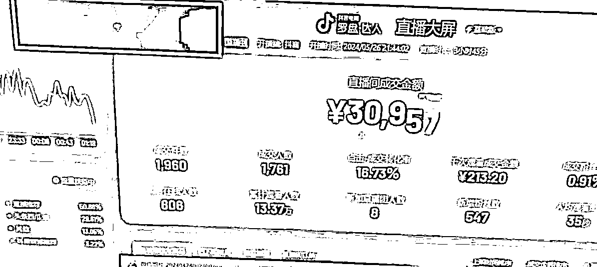
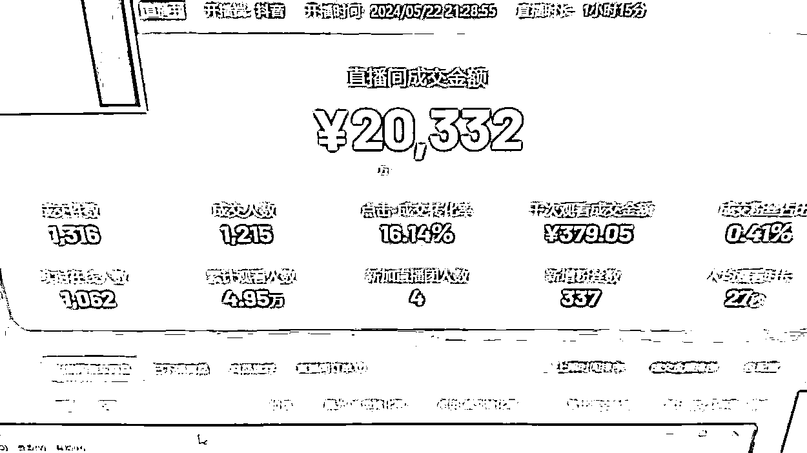

# 无人直播 2024 年还能做吗？4 年的操盘手用 6 大观察点告诉你

> 原文：[`www.yuque.com/for_lazy/zhoubao/mzrmia9f2sbsgh9t`](https://www.yuque.com/for_lazy/zhoubao/mzrmia9f2sbsgh9t)

## (18 赞)无人直播 2024 年还能做吗？4 年的操盘手用 6 大观察点告诉你

作者： 贾璐 无人直播电商

日期：2024-05-28

之前给大家介绍过一些无人直播的发展和基础，在 2024 年，一方面全民下场做短视频搞钱，另一方面头部主播被查税查合规纷纷上岸转型，无人直播的模式发生了怎样的变化呢？下面结合我们这几年操盘的感受分享一下。

先介绍下自己，贾璐 luca，江湖人称璐姐，哈哈哈，2019 年入行无人直播，算是入行最早的一批操盘手，4 年多的时间，从最开始的音频无人直播，短视频卖惨引流直播间，从快手再回到抖音纯自然流，经历了无人直播所有的阶段，现在在杭州规模化运营无人直播了。这几年陆陆续续的学费也花了大几十万。没有财富自由，但也赚到了广州一套房还有 2 个孩子以后的教育基金。

### 人多项目少，电商和短视频依然有空间

年年我们都说赚钱难，经济环境差，不过今年对这个问题的争议应该小了，地产、贷款、保险、理财、教培、游戏，很多顶层行业都缺乏增长，持续收缩，这使得很多人被甩了出来，除了滴滴美团奶茶咖啡，短视频是大家再就业的首选赛道，门槛低，不需要大量资金投入，见效快。这么想，似乎短视频似乎变得拥挤了，我们也确实能看到很多素人开始做短视频和直播了，那无人直播，半无人矩阵电商已经不是一个好项目了？

我觉得：是好项目，也不是人人能做的好项目

2022 年时，随便一个号都能跑 50 万，100 万，2 年过去了，现在一场直播平均几万块钱，只能怀念当时的辉煌，但相对比其他行业还是稳赚不赔的，毕竟启动成本低，日常投入很小，电脑一个月租金 200，二手手机 600，一个月电费 200，软件费 300。

这是 2022 年的辉煌，我称为无人直播元年，哈哈哈！十几个小时几十万 GMV，佣金达到 25%

现在一场直播下来基本是几万的 GMV，虽然跟 2 年前比少很多，但当下，我们已经是无人直播技术 top 级别了，很多同行都做不到。

作为 4 年无人直播操盘，经过大周期的无人直播玩家，对 2024 年是否还能做这个问题有几个更深入的观察。希望看完对圈友有帮助。

内容较多，转飞书链接查看

[`r7weuqivm5.feishu.cn/docx/XT1cdh3SfoGWu7x34Q8cnfMLn9e?from=from_copylink`](https://r7weuqivm5.feishu.cn/docx/XT1cdh3SfoGWu7x34Q8cnfMLn9e?from=from_copylink)

* * *

评论区：

洲同学 : 璐姐在广州吗[色]
贾璐 无人直播电商 : 嗯嗯这两天在广州，后天深圳出差，然后就在杭州了
洲同学 : 您这种 4 年经验的元老大咖都花了大几十[捂脸]学费，那我们这种自己野路子摸索的在抖音搞无人直播真的是处处碰壁啊，今年 3.15 过后，他们都建议去小红书快手拼多多那些地方无人直播[捂脸][捂脸]
贾璐 无人直播电商 : 我们抖音很稳，哈哈，播个十几天问题不大
洲同学 : 璐姐，慕拜，想链接您，向你学习

* * *