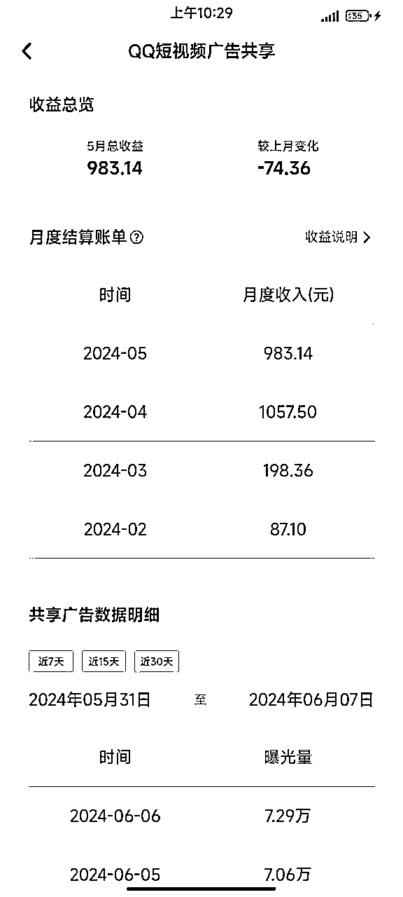
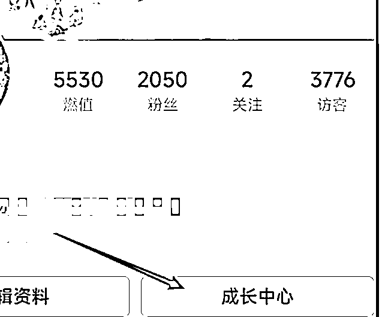
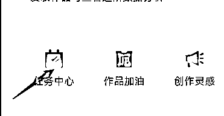
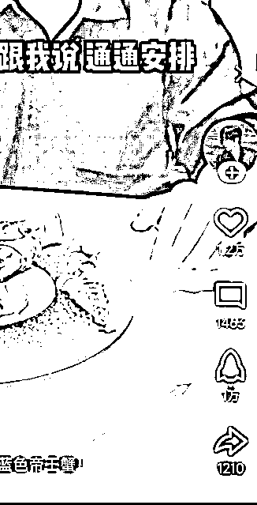
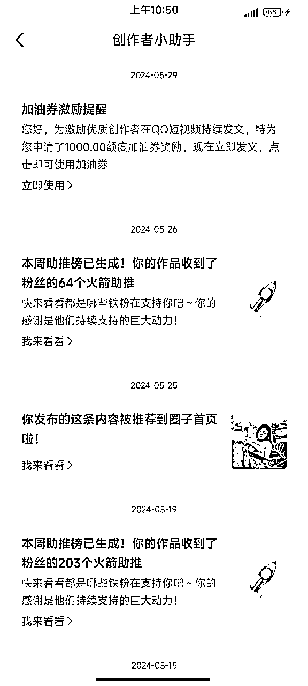
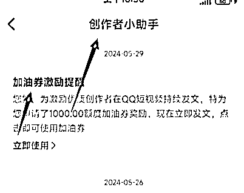

# QQ短视频，新手入局教程+工具分享。

> 来源：[https://udxxg5rx5m.feishu.cn/docx/ABrsdK0kVoDjwQx3v4bcT4Hynad](https://udxxg5rx5m.feishu.cn/docx/ABrsdK0kVoDjwQx3v4bcT4Hynad)

生财这个圈子，

千万不要只是看看帖子，

把自己分享出去，

让更多人能连接到你，

会有意想不到的结果。

生财对我来说就是个转折点。

我是施仁，专注小众赛道项目。

一时不知该从哪里写，

这两年做的某些项目虽说跟生财没什么关系，

但合作的工作室，一些渠道的来源都是生财认识的朋友提供的，

而且这些在我项目的实操上也占了非常关键的一部分，

尤其去年，幸亏在生财有认识的朋友介绍资源，

才在一些关键问题上，有了非常简单的解决办法。

不然去年的项目完全卡在一个想破头都解决不了的困境里。

三个月放大操作，流水做了接近两百个。纯收益一百个。

那个项目属于昙花一现，就不在此分享了。

这次还很幸运的成了万赞中奖者，

亦仁送了一张门票，然后第七期结束，根据龙珠竟然还给了我分红。

简直了！

坚持在生财分享自己吧。

生财新的一年，

分享个今年在运作的项目给新圈友，

适合不想投入太多金钱成本的圈友自己做做。

需要花费一些精力和时间。

当然也有怎么做都没做起来的账号，

# 一、前言

QQ短视频，原名QQ小世界。

去年年初做过一阵没拿到结果，

放弃了，

后来在生财看到有人说平台有了广告共享计划，

但那个时候正好在忙别的，于是也就搁置了。

今年过完年正在找项目，想起来这件事，

正好手里还有个小世界的发布软件，

可以搞一搞，

于是二月就开始研究，

也走了一些弯路，

测试几个月下来觉得收益还行，关键是可以放大操作。

目前工作室还在做的有36个号，每个号每个月收益大概在500-1500上下。

个别几个号收益破不了百。

我个人认为目前QQ短视频还是在处于发力阶段，

号还是比较好起的。

# 二、项目实操

## 一、注册账号

QQ注册目前就是需要手机号且短时间内不能频繁注册，并且也要注意ip，

我的方法就是先让别人帮忙注册，然后登录到我这边的APP上，

过大概一周再把QQ绑的手机号换绑成自己的手机号，

这样不用麻烦别人。

新QQ号得养号，多刷刷QQ短视频，

加加好友，切记切记❗️新注册之后不要频繁修改头像网名。

QQ聊天界面🔍关注【QQ短视频创作中服务号】，即可收到作品审核动态通知。

发布作品前，需要绑定密保手机号，不然会被安全打击，视频无法推荐。

注册好的账号，可以直接在https://qqzz.qq.com/public/login 进行登录

手机发一个号还好，多账号操作还是习惯用电脑。

## 二、找作者，进行筛选。

我这边做的大部分是搬运，

抖快红里去找QQ短视频上没有的作者，

比如你在抖音找了一个作者A，

那你就在QQ短视频上搜这个作者A的名字，

搜不到就代表没有，

当然也会有这个作者在这个平台不叫这个名字，

那你就找一个这个作者两周内发布的作品去搜索，

一定不要最新的作品，

因为可能这个作者还没在QQ短视频平台上传，你未必搜得到，

如果名字、作品都没有这个作者，那你就可以考虑搬运这个作者的作品，

注意，并不是这个平台没有这个作者就可以无脑搬运了。

我发现很多人都会进入一个误区，

会认为这是我喜欢的作者，

他的作品搬到这个平台肯定也会有不少粉。

其实并不是的。

首先我不知道什么作品一定会火，

但是我可以告诉你什么作品平台不推荐，

模板、特效、图文轮播、灵感库等门槛较低的作品，

直接pass,

平台相对会更喜欢：

真人出镜的内容账号最好，

其次是真人配音，

领域上我不方便说太具体，自己可以去刷刷视频，看一下。

光真人出镜这一个标准，就能把QQ短视频上很多领域pass掉。

## 三、包装账号、去重、发布作品。

找到作者后，名字头像都改成对标作者，

个人建议，改的作者名最好后面加个字母，或者用户名里的其中一个字变成别的，

比如小李讲美食，改成小李说美食，

然后就可以进行对标搬运了，

作品发布前最好再进行一下去重，

我目前作品去重完全是通过cr操作的，

抽帧+一些微调。批量操作就行了。

上传作品封面一定不要用系统默认，自己挑一个吸引人的。

敲黑板，重点来了，

QQ号这种东西可以说人人都有，

手机QQ点短视频，左上角自己的头像，

进入QQ短视频主页，

点这里，成长中心，

然后点任务中心，

可以看到一些任务，

完成任务会获得火箭，

火箭有什么用呢，

就是可以给别人的作品进行助力，

长按火箭可以直接推十个。

超级会员会有额外的任务奖励，

这个任务是有限的，

任务奖励全部消耗完火箭就成0了，

但是没关系不用慌，

只要你把火箭用成0，

平台还会给你一个破产补助的奖励，奖励5个火箭，

每天奖励三次，3*5=15，

相当于每个号每天依然会有15个火箭可以让你用来助力，

这种助力方式，一个号不要持续对一个号助力，效果会越来越不明显，

## 四、起号涨粉。开通权益

去年年初我第一次研究小世界的时候，

当时还有个刷粉的网站，

做了几个1000粉以上的号，

但是现在没有了。

如果那个朋友有相关的刷粉方式，也可以文章下面留个言。

这样就省去一个涨粉的步骤。

涨粉有一个高风险高回报的方法，

那就是擦边，

优点就是快速，可能一天两天就能涨到500粉，

缺点就是，就算涨到500粉，对账号后期的垂直也会有一定影响。

我个人建议如果用这种方法，粉丝涨到500就把之前的作品隐藏，

然后在个人列表立刻补一些垂直作品。

稳妥一点的方法就是发垂直内容，多个QQ号互相火箭助力，或者小小花钱投流一下。

正常的账号，这个周期大概2-3周完成，

数据好的账号1周就可以达到500粉，

官方偶尔还会进行推流，

持续发布作品还有机会获取加油券，

用来推送自己的作品。

注意创作者小助手的通知消息。

这里要注意，从你开始发视频的第一天起，

如果没有粉丝评论，那就用小号评论一条，然后作者回复小号的评论，

因为开通广告收益的要求里就有一条，

一个月内必须要有最低一条的回复评论，

这个条件看起来很好满足，

但是等你其他条件达标后，再去回复评论，

这个条件完成是有延时的，并不是你当时回复评论，条件就立刻达标，

一般要等3-7天，所以千万不要等其他条件达标再去做这个任务。

很浪费时间。

所有条件达标然后实名就可以开通了，

一定要记着不要急着先实名，

如果这个号废了还可以换号。

所有要求都达标，就可以在 成长中心→创作变现→广告共享计划里开通广告收益了，

开通后，记得在广告共享计划里，

下滑到最后，把评论区广告、个人主页下拉广告 两个开关都打开即可，

这样别人看你视频的时候就会有广告了。

而我们的收益就是从这两个广告位获取的。

每天尽量保持10-20个视频。

如果作品不多，考虑最早的视频删掉重发。

或者找同类型作品继续发。

## 五、作品违规或数据过低

先看看【QQ短视频创作中服务号】里是否有通知，

如果没任何提示，

可以在https://qqzz.qq.com/public/login【数据中心】查看发布前的审核状态。

## 六、PC端QQ短视频创作者中心使用手册

1.  QQ短视频创作者中心功能概览

【QQ短视频创作者中心】是一个致力于为创作者提供多元化信息和多样化生产工具的平台，目前主要功能模块包括：

*   内容发布：支持PC端批量上传高清大文件视频，支持话题输入、自定义封面等功能。

*   作品管理：近期发布的作品管理，数据分展示，作品二次编辑。

*   作品合集：支持创建作品合集，高效作品管理。

*   评论管理：评论回复、删除功能；

*   数据分析：近期/历史累计作品消费、互动数据分析；

*   平台热点：实时了解全站热门话题，快速获取平台活动信息让作品被更多人看到。

1.  如何登陆创作者中心平台？

如果你已开通QQ短视频创作者中心使用权限，可按以下流程登录。

### 第1步：使用电脑输入网址

*   https://qqzz.qq.com/public/login

### 第2步：打开QQ手机版扫码登录

1.  如何使用创作者服务平台？

### 1.首页总览

创作者可通过首页，快速了解帐号基本数据

### 2.内容发布

#### 2.1 格式要求

视频时长：不可以上传时长小于5秒或大于10分钟的视频

视频分辨率：≥720p

视频大小：最大可上传4G的视频

视频格式：MP4、FLV、F4V、WEBM、M4V、MOV、3GP、3G2

#### 2.2 使用步骤

*   选择文件

选择左侧「内容发布」，点击页面中间区域后可批量选择视频文件，或直接把视频文件拖拽至上传页面。

*   填写信息

以下信息可根据实际所需情况来选择填写。

*   封面图：封面图系统自动在已上传的视频中进行截取，也可以选择自助上传

*   自行上传：可上传一张最小尺寸为 400px*400px 的封面图。

若不上传也未截取，发布视频后将默认将视频首帧作为封面图

*   视频描述：创作者可填写 1000 个字符以内的视频描述，支持通过输入符号“#”来添加话题标签

*   提交发布

填写完成视频信息后，点击“发布”并跳转至视频管理页面可进行查看。

平台将对视频进行转码，转码需要一定时间，一般与上传作品的时间等长，但不会对视频画质有影响。

#### 2.3 注意事项

*   封面图设置

目前封面图未设置比例限制和支持线上裁剪，为保证效果，请上传和视频尺寸相同的图片 封面。

### 3.作品管理

支持筛选/删除作品，同步展示作品的审核状态

### 4.评论管理

支持分作品删除/回复评论

### 5.作品合集

支持创建作品合集，实现高效作品管理

### 6.平台热点

常登录创作者中心，实时了解全站热门话题，快速获取平台活动信息让作品被更多人看到。

# 三、项目复盘

一定要多找作者多做账号，

一个人可以实名5个QQ，

那你就要按照10个号以上的标准去做，

比如你可以找朋友实名20个号，

那你就按照40个号去注册去找作者做。

因为到最后肯定会有一部分账号起不来。

起不来的号pass，

起来的号去实名开权益。

一定要记着多跟评论互动，

发作品的QQ一定要在自己手里，

账号是每天都要登录的，

如果用的别人的QQ，每天都要找朋友扫码登录，很麻烦。

我自己手里设备足够多，所以一个手机登录3-5个QQ。

手机不多的可以考虑用分身app分更多的QQ。

这有一个免费版的分身分享出来，只能安卓使用。

QQ短视频的自动发布软件也在里面。

使用教程在这里，功能比较多，所以教程在慢慢录制中，

需要的软件。

链接：https://pan.baidu.com/s/1vSW5zD8I1iGxg6ATSsUL5g?pwd=0809

提取码：0809

--来自百度网盘超级会员V8的分享

QQ短视频PC网址：https://qqzz.qq.com/public/login