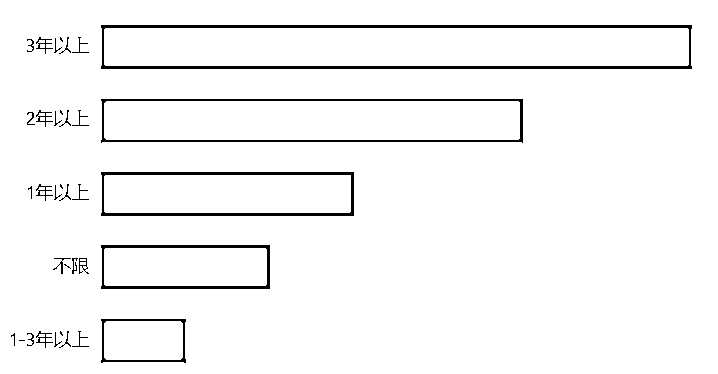
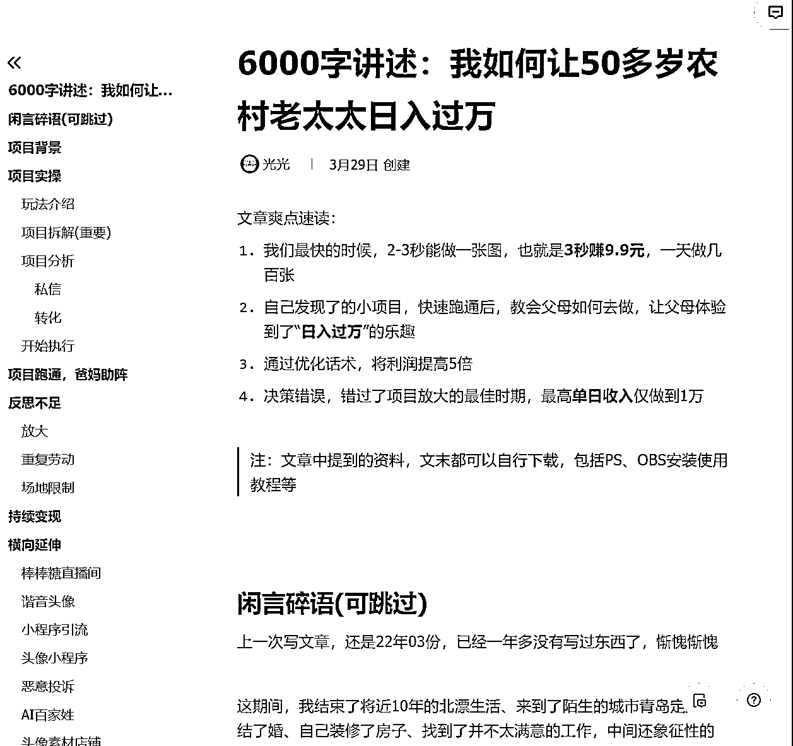

# 不知道设计如何生财？你一定需要这份《生财设计搞钱指南》！

> 来源：[https://eeey5k7076.feishu.cn/docx/AJbPdQKgeoBmOoxG9AncVUTSn9g](https://eeey5k7076.feishu.cn/docx/AJbPdQKgeoBmOoxG9AncVUTSn9g)

# 自我介绍与创作背景

大家好，我是keya，02年的INTJ，本科就读产品设计专业，喜欢用设计的思维思考一切。

3月左右，在搞钱女孩的牵引下，我初识并加入生财。自打来了之后，用明白老师文章里的话来说就是——“碎”了一次又一次。

生财里有一个很大的世界，以“财”为核心，链接的是各个领域的底层发展模式与逻辑，我被这个世界深深震撼到了，看什么都觉得很厉害，也从没想过自己能为这个世界做点什么。

机缘巧合下，通过亦仁大大418问答帖摸到生财大学生的组织群，也因此结识了七小哥和七玄门。

跟七小哥聊天时，他提到在生财做过的【通用型新手指南】，后来也有技术圈友提供的【技术类指南】，那有没有可能会有【设计类指南】呢？

作为一个设计专业的学生，我的DNA立刻动了。

在七小哥的帮助下，有幸与木鱼、锦黎、涂涂、路言、柯柯几位学妹一起展开调研和思考，并获得千帆老师与米斗老师的倾情指导，前后经历一个月有余，最终有了这样一篇【生财设计搞钱指南】帖子。

在这篇帖子中，与几位学妹一起，我们将近两年来生财内与设计相关的（几乎所有）帖子内容，近几个月来生财内与设计相关的（几乎所有）风向标进行梳理总结，爬取BOSS直聘上14种设计师职位，300＋公司的薪资待遇与任职要求，并广泛调研设计师常驻平台小红书、站酷等，希望通过对前人经验的梳理总结，为大家提供一点设计生财道路上的帮助。

这是我第一次在生财写帖，也是第一次以“设计搞钱”的视角去重新打开我的大学专业，帮助我从新的视角看待我的专业、未来可能的职业方向。有些生涩，也有很多地方交代不清，如有任何意见建议，欢迎各位圈友指出！

“生财”是一个很大的世界，任何领域都可以通过在这里的挖掘找到底层的生财链路。

试着提供这份设计生财指南，祝我们都能拓宽本领域的生财之路。

# 导言

这篇文章主要基于【设计零基础小白】与【设计师】两类人进行内容整理与书写，大家可自行判断需求并跳转至相应内容。希望对你有帮助！

1.  初阶篇：零基础小白如何走上设计之路？

*   建立设计技能点，为设计生财铺路

*   零基础设计小白的初步变现之路

1.  进阶篇：走上“设计师之路”

*   设计师进阶之路（行业类目，基本入职要求，职场发展之路）

*   设计师转行之路（建立个人IP，AI+设计，其他行业发展方向拓展）

*   更多设计生财发展方向（设计风向标内容整合）

本文目录如下：

* * *

# 💥初阶篇：零基础小白如何走上设计之路？

## 一、建立设计技能点，为设计生财铺路

##### 零基础接单第一步：拥有技能，走遍天下都不怕

#### 1.1 基础设计技能学习

*   基础学习：Photoshop、Illustrator、Procreate等软件的基础操作

*   免费教学课程推荐：

| 类目 | 课程链接1 | 课程链接2 |
| Photoshop | 【拜托三连了！这绝对是全B站最用心（没有之一）的PS公开课程，耗时千余小时开发！】 https://www.bilibili.com/video/BV1Q5411P7k4/?share_source=copy_web&vd_source=56be5b5374d04e1a11b8b5f4365ffaa5 | 【【PS教程】终于有一套全面的PS教程啦！从零开始学PS！！】 https://www.bilibili.com/video/BV187411Z7bx/?share_source=copy_web&vd_source=56be5b5374d04e1a11b8b5f4365ffaa5 |
| Illustrator | 【AI教程(illustrator零基础入门50集)从入门到入土，听说是江湖中传闻的熊猫版AI】 https://www.bilibili.com/video/BV1ox411f7tA/?share_source=copy_web&vd_source=56be5b5374d04e1a11b8b5f4365ffaa5 | 【【求求大家来个三连吧】零基础新手半小时学会AI &#124; 针对建筑规划景观环艺的Adobe Illustrator入门教程】 https://www.bilibili.com/video/BV18t4y1r7U1/?share_source=copy_web&vd_source=56be5b5374d04e1a11b8b5f4365ffaa5 |
| Procreate | 【【Procreate教程】新手只用90分钟，学会用procreate画画！保姆级入门教程&#124;附赠笔刷线稿练习！插画&#124;板绘&#124;厚涂&#124;原画&#124;SAI】 https://www.bilibili.com/video/BV1w841197zY/?share_source=copy_web&vd_source=56be5b5374d04e1a11b8b5f4365ffaa5 | 【【平板绘画2023】大佬爆肝！B站最干的procreate新手入门全教程200集（持续更新中）】 https://www.bilibili.com/video/BV1Uu411N7jy/?share_source=copy_web&vd_source=56be5b5374d04e1a11b8b5f4365ffaa5 |

#### 1.2 PPT技能学习

*   基础学习：熟练掌握至少一种PPT设计软件，比如Microsoft PowerPoint、Keynote、Canva。可以去看计算机二级考试要求，建立基本技能，这在未来办公场景也很需要。

*   免费公众号学习推荐：秋叶PPT；旁门左道PPT

#### 1.3 AI设计技能学习

*   推荐直接进行航海上手，或者可以看看往期航海手册内容～

*   AI绘画特训：https://scys.com/activity/landing?id=3043

*   ChatGPT提效：https://scys.com/activity/landing?id=3040

*   Sora交流：https://scys.com/activity/landing?id=3047

*   AI编程（爬虫）：https://scys.com/activity/landing?id=3481&tabIndex=0

*   AI设计工具平台推荐（暂时只放了一部分，如有机会和需求以后可以专门整理一个帖子～）

| 类目 | 简介 | 链接直达 | 备注 |
| Midjourney | AI图像和插画生成工具 | https://www.midjourney.com/home | 一般在discord上使用，国内也有很多接口可用 |
| Stable diffusion | StabilityAI推出的文本到图像生成AI | 需要本地下载安装包/使用远程 |  |
| WHEE | 美图推出的AI图片和绘画创作平台 | https://www.whee.com/?channel=1004 |  |
| 稿定设计 | 一站式AI创作和设计平台 | https://www.gaoding.com/ai?hmsr=aibot-aibot-ai--aidesign-aidesign-bdqd&utm_source=aibot |  |
| 即时设计 | AI生成可编辑的UI原型稿 | https://jsai.cc/ai/create/izDsYx?source=ai-bot.cn |  |
| 可画 magic design | 在线设计工具Canva推出的AI设计工具 | https://www.canva.com/magic-design/ |  |

#### 1.4 设计灵感网站/搜图网站

##### 国内：

站酷（有不少视觉的内容）：https://www.zcool.com.cn/

普象（产品为主）：https://www.puxiang.com/

小红书（近来兴起，非常好用）：https://www.xiaohongshu.com/explore

大作（可以理解为国内pinterest）：https://www.bigbigwork.com/tupian/image/20812845795.html

堆友（阿里旗下的，有一些社区空间）：https://d.design/ai

花瓣（杂图很多，现在不是很推荐了）：https://huaban.com/

##### 国外：

需要科学上网

pinterest（大量图集）：https://www.pinterest.ru/

behance（会有很多整本设计作品集出现，⚠️不要登录直接浏览）：https://www.behance.net/

dribble（UI适用）：https://dribbble.com/

## 二、零基础设计小白的初步变现之路

##### 零基础接单第二步：寻找潜在的需求和试炼点，先赚到第一块钱

#### 2.1 从朋友和家人中寻找设计需求

身边的同学、朋友，是非常靠谱的获客途径。相比其他获客方式，信任度高、风险低。

1.  表明能力：在认识新朋友时，主动大方地介绍自己的职业和技能，主动展示自己曾经的作品，可以让他们看到你的价值，在有需求的时候也能快速想到你。

1.  常见需求：现在自媒体时代，做线上工作的朋友可能需要名片设计、海报设计、社交媒体封面图等；做线下工作的朋友可能需要店面logo设计、品牌设计等。这些需求虽然简单，但却是非常好的练习机会，既可以帮助我们锻炼技能，也可以积累作品

1.  建立信心：家人朋友最初都会以鼓励我们为主，可以帮助自己建立设计信心。同时大家都喜欢跟有能力、能帮的上忙的朋友来往，当我们顺利完成设计单子后，彼此之间关系会更近一步，或者他们继而把我们推荐给其他有需要的人，设计生财之路，就此打开！

#### 2.2 在校生生财指南（部分内容也可作为非在校群体参考）

##### 2.2.1 寻找社团、学生组织的展板/海报/文创设计机会

以我的本科学校为例，隔三岔五就会有很多的校内活动，有活动就需要展板、海报、地贴、物料设计……这时候，设计系学生/拥有设计技能的学生就会成为所有学校社团组织的“香饽饽”。

试着去问问这些活，还有学长学姐指导，都是锻炼设计技能的绝佳机会。参与这些项目不仅能够积累作品，还能提升团队合作和沟通能力。

那些年，我们在校接过的设计单子…

##### 2.2.2 帮助大创项目/个人答辩项目做PPT

“互联网+”、“挑战杯”等大学生创新创业类项目，十佳党支部、十佳个人展评，活动内容宣讲……有PPT在的地方，就有设计需求。尤其是国省级类答辩内容，往往需要高质量的PPT演示。

帮助这些项目制作PPT，不仅能提升自己的设计水平，还能获得更多的设计实践经验。以我一位朋友为例，从大一开始给人免费做PPT到大三一页PPT60R不在话下，已经成为各个学院每次要做PPT就会率先找到的“优秀人才”。甚至有时我们自己参加评选，把PPT实力拿出来，也会有单子上门！

##### 2.2.3 参加设计比赛

有很多设计比赛是有奖金的，尤其以创业类竞赛和若干文旅类文创/IP设计竞赛为主。锤炼技能，积累作品，多投比赛，既拿奖又拿金，非常划算！很多比赛也支持社会人士投稿，现在也出现了很多AI类比赛，凡带奖金的都可以冲一冲。

想参加比赛可以关注一下这个公众号，会定期推送很多设计比赛

#### 2.3 新手设计接单入门平台推荐

闲鱼、猪八戒和淘宝等平台是许多新手设计师的首选。这些平台上有大量的设计需求，从简单的LOGO设计到复杂的品牌策划都有涵盖。新手设计师可以通过这些平台发布自己的服务，逐步积累客户和口碑。

##### 2.3.1 闲鱼

在闲鱼平台上挂自己的过往作品，标注自己承接的设计业务范围，标一个10-40的低价，有人来打招呼之后引流到微信，具体每单的价格以实际每单的任务需求为准。

以我曾经在闲鱼挂过的单子为例，我接的是产品3D建模渲染，时不时擦亮一下，有一阵子一下子爆好多单。陆陆续续大概赚了小一千块钱，后来因为忙其他事情去了，就没有再接。但因为这样的挂单方式门槛低、方便快捷，作为新手初试牛刀是很合适的。

##### 2.3.2 设计类接单平台（入门）

1.  云队友（接单方向很全面）：https://www.duiyou360.com/

1.  68design(设计师岗位非常多）：https://www.68design.net/

1.  猪八戒（杂单，各类单子都有）：https://www.zbj.com/xinren/seller

1.  米画师（出钥匙插画单，价格有高有低）：https://www.mihuashi.com/

这类接单平台可以作为前期接单的先行者。

优势：入门门槛比较低，比较适合刚入门的小白尝试接单。通过反复练习可以提升技能，积累经验和建立客户群。

劣势：每单报价比较低，可能会存在多次改工的情况。

1.  公众号接单

直接在公众号搜索设计接单，会有很多约稿接单平台。但这一块之前没有接过单，无法提供经验，只为各位朋友提供一个思路路径。

##### 2.3.3 素材供稿

千图、千库、包图、昵图、视觉中国、即时、海洛创意、花瓣、稿定设计……

这类网站主要以设计素材的交易为主，可以申请成为平台的设计达人/特邀设计，提供拍摄或制作素材，或者定期提供设计模板（飞机稿也可以试试，有下载就有收入），但也可以注意筛选，有小伙伴说有的平台结款不是很好结...

##### 2.3.4 建立设计影响力（进阶）

比较推荐的是在前期通过2.1和2.2积累经验和设计技能之后，在淘宝开店接单，或者在小红书挂账号发帖接单。基本思路与前面一致。有一定的经验沉淀之后建立自己的账号，也是一个建立个人IP的过程，当客户主动找上你的时候，能够带来比较好的议价空间。

也可以考虑下面两个网站平台：

1.  站酷（其实很多客户也是会在站酷看案例寻找设计师的）：https://www.zcool.com.cn/

1.  特赞（会根据你的作品及个人能力推荐合适的商单）：https://www.tezign.com/

#### 2.4 接单注意事项

接单注意事项内容搜集原帖链接🔗：

首先要敢于接单！别怕做不好，市场上做不好还在接单的大有人在（不是哈哈哈），但是接单的过程可以帮助我们去探索自己还缺乏什么技能，既是对自己的提升，还有钱赚。别光练技能不变现，亏！

##### 2.4.1 完善个人资料

*   突出技能：详细描述你的设计和插画技能，包括你擅长的风格和工具。（详见各种小红书博主主页简介）

*   展示作品集：上传你最好的设计和插画作品，即使是练习作品，也能展示你的能力和风格。

*   专业照片：使用专业且友好的个人照片，让客户对你产生信任感。

##### 2.4.2 了解平台规则和机制

###### 熟悉平台操作

*   平台指南：仔细阅读平台的使用指南，了解如何发布作品、报价和接单。

*   收费标准：了解平台的收费标准和服务费率，以便合理设置你的报价。

在接单的时候要，勇于谈💰勇于展示自己，还要勇于拒绝低价单，时间精力和💰都很宝贵啊！另外不要总担心自己的作品不够好不敢发，不管你处于哪个水平，都有它的受众，请大胆展示吧！！！

###### 研究同行作品

*   市场调研：浏览其他设计师和插画师的作品，了解市场需求和流行风格。

*   定价参考：参考其他新手设计师和插画师的报价，确保你的报价具有竞争力。

##### 2.4.3\. 制作高质量的样板作品（建立作品集）

###### 样板作品的选择

*   多样化作品：准备几个不同类型和风格的样板作品，展示你的多样性和适应能力。

*   主题明确：每个样板作品都要有明确的主题和高质量的完成度，让客户一眼就能看到你的实力。

##### 2.4.4 建立客户关系

*   优质服务：每个项目都要用心完成，与客户保持良好的沟通，确保按时交付高质量作品。

维护好老客户，很重要！！！

维护好几个老客户，客户觉得你做的好，沟通合作舒服，就会有源源不断的订单。很少有客户的需求是一次性的，后面再有订单他肯定还习惯找你。而且每个客户都有自己的创业圈，做好每一单，还能让朋友们口口相传，带来更多新客户。

*   反馈和评价：完成项目后，请客户为你留下积极的评价和反馈，有助于提升你的信誉和吸引更多客户。

##### 2.4.5 实践与总结

*   项目总结：每完成一个项目后，总结经验和教训，不断改进自己的工作流程和技术。

*   练习创作：利用闲暇时间进行自由创作和练习，不断提升自己的创作水平。

# 💥进阶篇：走上“设计师之路”

## 三、设计进阶之路

#### 3.1 想做设计？你必须知道市场需要什么样的设计人才

我们爬了十四种设计师职位，300＋公司对其的薪资待遇与岗位职责，以及任职要求

数据原件🔗：

##### 3.1.1 设计岗位类目

根据boss采集的数据，市场上关于设计相关的岗位名称参差不齐。

为了方便介绍与区分，我们将之大致分为室内设计类、平面设计类、游戏设计类、产品设计类、UI/UX设计类五类（如有不足，欢迎各位uu指出！）。

##### 3.1.2 大公司的招聘要求

我们根据爬取的300＋公司，总结了中大规模公司里五大设计岗位招聘要求，希望对想往设计职业发展的uu提供一定参考，技能点可以往这些方向进一步发展。

其中技能与经验要求以图表型展示，按照频率降序排序

###### 室内设计类（家居设计）

① 基本工作

*   与客户详细沟通并实地观察测量，制定设计方案，绘制设计图纸和效果图；

*   进行室内装修设计和物理环境设计；

*   调整、优化室内空间的分隔组合，进行室内用品、家具、成套装置的陈设以及空间视觉风格的设计；

*   协助客户选材、选配软装饰、协调施工团队；

*   指导、检查装修施工。

② 能力要求

审美能力、沟通能力（跟客户谈单）、施工知识

③ 薪资中位数

¥9200/月

④ 技能与经验要求

###### 2.平面设计类（视觉设计，广告设计）

① 基本工作内容

*   使用PS、AI、AE、C4D等设计软件进行平面设计，包括但不限于插画、广告、网页、APP、H5等；

*   与相关团队合作，提供专业的审美意见和设计思路，输出设计作品；

*   把握品牌定位，完成品牌IP衍生品体系搭建，完成文创产品研发及礼品设计；

*   与需求方沟通，对设计草稿和样品进行调整。

② 能力要求

审美能力、沟通能力、项目管理能力、团队协作能力

③ 薪资中位数

¥8453/月

④ 技能与经验要求：

###### 3.游戏设计类（特效设计，3D设计，动画设计）

① 基本工作内容

*   负责游戏内容创作与设计，涉及游戏的整体构思、角色设定、场景布局、关卡设计、交互逻辑、用户体验等方面。

② 能力要求

美术功底、审美能力、创新能力、沟通能力、团队协作能力

③ 薪资中位数

¥9293/月

④ 技能与经验要求

###### 4.产品设计（工业设计）

① 基本工作内容

*   准确解读用户需求，全面研究产品的使用场景、定位、用户画像等关键元素，分析提炼出符合市场趋势的设计方向；

*   负责产品的外观与CMF（工艺、材料、颜色）设计，使用手绘、平面设计软件和三维建模渲染等多种工具，绘制设计草图、效果图、3D模型等；

*   制作设计方案，并向客户或需求方呈现完整提案；

*   根据设计图，制作产品原型或模型，检验材料要求，估算成本；

*   与生产部门协同评估产品的可行性、安全性、外观和功能，跟踪产品转化过程，解决项目过程中的CMF相关问题。

② 能力要求

产品思维、用户思维、市场洞察力、审美能力、沟通能力、团队协作能力

③ 薪资中位数

¥9600/月

④ 技能与经验要求

###### 5.UI/UX设计（服务设计，体验设计）

① 基本工作内容

UI（用户界面设计）：

*   结合产品需求，完成界面设计、视觉设计、创意设计等各类图像类设计工作；

*   参与相关设计规范的制定，定义标准样式、图标、基本元素、配色规范等，输出高质量的设计效果及资源；

*   配合产品经理和前端工程师，对设计稿的实现效果进行验收和调整；

*   关注产品设计趋势，研究用户审美倾向，持续提升产品用户体验。

UX（用户体验设计）：

*   参与产品的前期用户研究，挖掘用户需求，定义产品的初始形态或进行产品迭代；

*   根据公司战略及产品目标，输出相关设计文档，参与后续开发，对产品体验负责；

*   研究和完善用户画像，通过可用性测试、A/B测试收集用户反馈，持续分析优化现有业务流程，提高数据表现；

*   梳理核心流程，维护设计规范，包括视觉规范、UI组件、多语言、插画等；

*   根据用户体验度量指标，持续进行产品的用户体验迭代优化。

② 能力要求

产品思维、审美能力、有创意、设计思维、沟通能力、团队协作能力，对代码有一定了解更好

③ 薪资中位数

UI岗：¥11323/月

UX岗：¥16526/月

④技能与经验要求

##### 3.1.3 相关信息与总结

1.  在设计行业，作品和能力是第一位的，相比之下对学历的要求没有那么高。

1.  在设计行业，审美能力、沟通能力、创新能力、团队协作能力是底层核心的能力。

1.  相关研报补充

《2022年互联网新兴设计人才白皮书》-腾讯出品

这份报告具体围绕 新兴设计人才的工作现状、岗位需求以及教育培养 三大方面，给我们提供一定的信息参考。

#### 3.2 设计师的职场进阶之路是什么样的

我们与专业设计师米斗老师进行沟通交流，大致列出设计师的职场进阶之路与薪资水平，具体薪资状态会与地域呈较强相关，供未来有意进一步往设计职业发展的uu参考。

3.2.1 初级设计师（5k/月）

*   必备技能：基本设计软件操作，理解设计原理

*   积累经验：参与小型项目，逐步提升设计水平

3.2.2 中级设计师（6-7k/月）

*   提升创意能力，参与复杂项目

*   学习团队合作和沟通技巧

3.2.3 资深设计师（8-12k/月）

*   掌握全局设计思维，带团队完成项目

*   参与公司重要项目，提升影响力

3.2.4 美术指导（10-15k/月）

*   指导团队设计方向，创意领导

*   与客户沟通，了解需求，提供设计方案

3.2.5 总监（20-30k/月）

*   负责整体设计战略和团队管理

*   制定设计标准，推动公司设计水平提升

#### 3.3 听听现在的设计在岗者怎么说

##### 3.3.1 一个10年设计经验的创业者的反思与总结

整理自设计日记的Sky《一个设计创业者，在7月份的100条反思》21-08-04

原文链接🔗：https://t.zsxq.com/1xBXq

Sky老师是一位拥有10年设计经验的创业者，在帖子中分享了关于设计、品牌、成长、生活、创业等方面的思考，文字简要有力，此处仅做部分提炼，建议阅读原文，反复阅读！

###### 关于设计的反思

*   设计与商业：设计只是商业的一部分，需要跳出单纯设计的视角看待整个商业拼图。

*   专业能力与思维：30岁之前重视专业能力，之后更注重思维的差异化和人脉资源的运用。

*   人脉关系：人脉并非指认识多少大人物，而是看你帮助了多少人并促进了他们的成长。

*   工作选择：选择工作时，快乐源于与谁一起工作和做什么事情，而非单纯的薪水。

*   与优秀者交流：多与优秀的人交流，提升设计思维和格局。

*   选择权的重要性：选择一个好的公司并跟随其成长，比短期的得失更重要。

*   判断好公司：一家公司的社会价值和商业模式是判断其好坏的重要指标。

*   战略与战术：战略错误无法通过战术弥补，应及时调整策略。

*   核心竞争力：30岁后需要通过聚焦专业能力和突破性进步来保持竞争力。

*   互联网内卷：专业知识和业务理解并重，懂得数据分析是关键。

*   写作的重要性：写作构建专业壁垒，系统梳理知识，提升输入输出习惯。

*   T型人才：在一方面深入钻研，然后扩展横向能力。

*   木桶效应：初期依赖每个人的长板，后期需要弥补短板。

*   学习与游戏：学习的正反馈慢，而游戏反馈强烈，需坚持长期积累。

*   审美与竞争力：审美是文案、内容、选品的重要竞争力。

###### 关于品牌的反思

*   品牌的重要性：品牌就像内衣，看不见但很重要。

*   品牌与生活：苹果品牌通过无形影响力让产品成为生活必需品。

*   品牌与设计：设计应基于品牌风格，而非追逐流行。

*   品牌与内容：品牌需要对内容负责，内容成为品牌的一部分。

*   品牌选择：年纪越大，更倾向于选择用科技改变生活的品牌。

*   品牌简化选择：品牌简化选择过程，让用户少做选择。

*   品牌的社会影响：选择品牌应考虑其对社会的价值和影响力。

###### 关于成长的反思

*   独特性：每个人的成功无法复制，因为经历和性格不同。

*   自我对比：和自己对比，而不是和他人对比，减少痛苦来源。

*   读书的价值：读书是与作者灵魂对话的重要途径。

*   持续学习：不断提升认知，才能赚到超越认知的钱。

*   人际关系：成功不仅依赖能力，更依赖人际关系和贵人相助。

*   自我反思：接受自己是普通人，失败是正常的，学会放下执念。

###### 关于创业的反思

*   创业刺激：从拿工资到发工资的转变，需要承担更大的责任和压力。

*   创业孤独：创业者需要做决策、抗压力，还要激励团队和服务会员。

*   关键决策：在重要决策中加入时间维度，考虑长期影响。

*   创业动机：如果需要鼓励才创业，可能不适合创业。

###### 关于运营的反思

*   运营洞察力：运营不仅是执行，更需要洞察用户需求和平衡商业价值。

*   无套路运营：基于用户价值提供超预期的服务。

*   社群运营：将优秀的人组织在一起，形成化学反应，共同成长。

*   写作方法：从微博热搜中寻找话题角度，锻炼写作能力。

###### 其他反思

*   主动性：主动做事，持续挖掘成长点和价值贡献。

*   持续进步：追求持续的进步，而非短期的完美。

*   学习重要性：学习是自己的事情，公司提供平台，但学不学是自己的选择。

##### 3.3.2 关于品牌与品牌的“术”

整理自大树在生财的分享《品牌的理解以及品牌早期会用到的一些 “术”》23-04-13

原文链接🔗：https://t.zsxq.com/iiz79

###### 品牌设计的意义

*   品牌形象设计是企业的基础：每个创业者都必须认识到品牌形象设计的重要性。品牌设计不仅是企业外在形象的体现，更是企业内在文化和价值的传达工具。

*   品牌的影响：品牌不仅仅是一个标识，而是消费者对企业产品和服务的整体印象。品牌的力量可以帮助企业建立市场认知，提高客户信任度和忠诚度。

*   品牌溢价：一个强大的品牌能够使产品具备更高的溢价能力。例如，耐克的产品不仅仅是因为质量好，更因为其品牌文化和价值的认可。

###### 品牌设计的实际应用

*   品牌印象：消费者对品牌的第一印象非常重要，决定了他们是否愿意深入了解和信任该品牌。

*   品牌选择：在陌生环境中，人们往往选择熟悉的品牌，这种习惯性选择降低了沟通成本，提高了交易效率。

*   品牌价值：品牌的价值不仅体现在企业的固定资产上，更体现在品牌本身的无形资产中。即使物质资产消失，强大的品牌依然能够得到支持和重建。

###### 品牌设计的方法与渠道

*   满足基本需求：初创企业预算有限时，可以通过淘宝、猪八戒网和一品威客网等平台寻找合适的设计服务。这些平台可以帮助企业以较低的成本获得基本的品牌设计。

*   品牌的养成：品牌形象设计不仅仅是设计一个标识，而是需要长期的维护和优化。企业需要将品牌设计贯穿于日常运营的每一个环节，逐步建立和强化品牌形象。

###### 品牌设计的核心竞争力

*   聚焦品牌形象设计：与全案设计不同，大树建议创业者专注于核心竞争力，聚焦于品牌形象设计，例如logo和VI（视觉识别系统）的设计。

*   品牌策略与执行：品牌设计不仅仅是视觉呈现，还需要与品牌策略紧密结合。设计师需要理解品牌策略，从商业角度制定设计方案，以实现品牌的战略目标。

###### 品牌设计的未来发展

*   品牌运营的重要性：拥有一套品牌视觉系统是基础，但更重要的是如何运营和维护品牌。品牌的运营需要长期的投入和优化，以保持品牌的一致性和价值传递。

*   场景中的品牌形象设计：设计必须落地到实际场景中，通过实际应用增强品牌认知。好的设计可以帮助企业在场景中凸显品牌，节省推广费用，提高品牌价值。

###### 总结

品牌设计不仅是企业的基础需求，更是企业长期发展的关键因素。通过专注于核心品牌形象设计，并结合品牌策略，企业可以建立强大的品牌形象，获得更高的市场认可和客户忠诚度。同时，品牌设计需要长期的维护和优化，以保持品牌的一致性和价值传递。在创业初期，企业可以通过合适的平台满足基本的品牌设计需求，但更重要的是如何运营和维护品牌，使其成为企业持续发展的核心竞争力。

##### 3.3.3 产品需求挖掘之道

整理自壹树《小众产品的起点——需求挖掘（进阶篇）》22-06-17

原文链接🔗：https://t.zsxq.com/ejp7R

按照挖掘产品需求的步骤拆解：

###### 平台

*   选择平台：确定一个有足够用户的平台，例如全球排名前200的网站或垂直领域排名前10的网站。一个有大量用户的平台能确保即使只解决少数用户的问题，也能获得足够的用户基础。

###### 用户

*   用户体验：注册并以用户身份体验平台，点击所有明显的按钮，熟悉平台的常用功能流程，初步了解平台解决的核心问题。

###### 问题

*   寻找问题：如果体验过程中未发现明显问题，可以通过以下方法寻找：

1.  半个问题搜索：输入部分关键词进行搜索。

1.  26个字母搜索：用每个字母进行不同组合的搜索。

1.  工具辅助：利用工具和好奇心去产生问题，并记录感兴趣的问题和数据。

###### 需求

*   分析需求：在寻找问题的过程中，观察用户给出的可行答案，这些答案通常是现有的产品。

1.  核心问题：找出这些产品主要解决的用户问题。

1.  功能模块：区分主要功能模块，了解哪些是收费的，哪些是免费的。

1.  定价策略：分析产品的定价策略。

1.  官网访问量：使用工具如SimilarWeb，查看官网访问量。

###### 竞品

*   竞品分析：搜集相关竞品资料，区分通用免费功能和差异收费功能。

1.  通用免费功能：解决用户基本需求，通常用于引流。

1.  差异收费功能：解决特定问题，具有价格差异，可能是产品创新的关键点。

###### 数据

*   收集数据：记录工具数据及问答网站（如Quora、Reddit、Medium等）上的用户回复、点赞数、浏览量和评论数。

*   用户反馈：关注长回复中的用户意见，可能为未来产品改进方向提供灵感。

###### 决策

*   形成决策表：将前六个步骤的数据整理成评分表，主观评分决定需求方向。

*   评分维度：需求方向、开发评分、运营评分、竞争可能、搜索评分、价格分数等。

*   评分表使用：根据评分表选择总分最高的需求方向进行产品化。

###### 产品

*   设计产品：进入产品设计环节，最重要的是做减法，简化产品功能。

*   MVP理念：设计最小可用产品（MVP），例如自动化工具只需开始和结束按钮，电商店铺分析工具只呈现最关注的数据。

###### 总结

挖掘产品需求涉及多个环节，每个环节需要深入理解其背后的意义。通过实践和好奇心的驱动，不断练习这些环节，可以形成有效的需求挖掘习惯，并开发出满足用户需求的成功产品。

##### 3.3.4 35岁的设计师的思考

整理自禾析在生财轻享的分享，内容涉及“设计委托时的省钱秘籍是什么？好的设计师是怎么样的？几百和上万的logo，差别体现在什么地方？如何花最少的钱找到靠谱的设计师？”等话题 19-03-04

原文链接🔗：https://t.zsxq.com/aKomH

###### 设计师与设计结果的关系

1.  设计师的能力差异：

*   不同能力的设计师在同样时间内解决同一问题时，产出的结果差异明显。高级设计师不仅设计手法更高超，还能在任务中提供附加价值，如引导式询问、诊断公司愿景、讨论目标人群等。

*   高级设计师综合素质高，能够理解需求的商业目的，用设计手段解决商业问题。

1.  设计带来的附加价值：

*   制造话题性：优秀设计能引起关注，例如“29cm”电商App因其设计获红点奖，带来了自发推广和用户下载。

*   提高效率：设计可以优化使用体验，例如《这就是服务设计思考！》通过服务设计的方法构建内容，方便读者查找和使用。

###### 减少设计成本的方法

1.  明确设计预期：

*   产品定位：了解产品和竞品，明确设计需求。

*   需求明确：如果需求明确，只需找视觉设计，节省成本和时间。

*   复杂需求：需要复合能力的设计师或团队，时间周期长，费用高。

1.  选择设计团队：

*   价格合理：了解市场行情，选择价格合理的设计团队。

*   实力考察：通过作品和试稿了解设计师的实力。

*   思考方式：询问设计师的解决方案，了解他们的思考方式和工作态度。

1.  合适的委托合同：

*   付款方式：常见方式有4/3/3或5/5，分阶段付款减少风险。

*   节点把控：确定每个付款周期的验收标准，减少更换团队的损失。

*   违约责任：明确违约责任和售后机制，保障利益。

1.  与设计师的沟通：

*   有效沟通：沟通是协作的关键，初始阶段明确需求，细节阶段提供反馈。

*   倾听理解：理解设计师的思维和设计背后的逻辑，避免鸡同鸭讲。

1.  不要过早陷入细节：

*   由粗入细：先草稿，再细化，避免在草稿阶段纠结细节。

1.  规范修改需求：

*   提供详细修改指示：在修改阶段，提供清晰的需求和参考方向，加快项目进度。

##### 3.3.5 进阶设计师的从业思考

整理自咏舍《35岁的设计师都在做什么？》20-05-22

原文链接🔗：https://t.zsxq.com/lSdC1

###### 设计从业与学习的建议

*   靠近优秀的人：找到并靠近最优秀的人，向他们学习，即使付费也值得。

*   立即行动：有了想法一定要立即去做，在行动中升级自己的认知。

*   跳出舒适圈：按部就班虽然稳妥，但要尽量跳出舒适圈，接受更多挑战，提升眼界和格局。

*   养成好习惯：定期复盘、阅读、思考、输出和分享，这些都是个人成长的重要方式。

*   有效利用资源：如果能用钱解决的问题，不要浪费更多时间来解决，年轻和时间是最宝贵的资本。

*   长远思考：在遇到犹豫不决时，问问自己1年后、10年后是否会喜欢现在的选择。

## 四、设计师不一定只是设计师，也可以是…

#### 4.1 不要只做设计美工，做自己的设计品牌

##### 4.1.1 设计师如何打造个人IP

整理自花爷《做IP这么难，我为什么还建议你去做？》21-05-24

原文链接🔗：https://t.zsxq.com/LqaIr

###### 什么样的人适合做个人IP？

*   有生意的人：这些人已经有自己的生意，利用IP可以进一步提升影响力和扩大业务。

*   有经验、资源、特长或爱好的人：这些人虽然还没有把自己的特长变成生意，但有资源和特长，做IP是一个成本较低的方法。

*   没有特长资源的人：这类人需要先提升自己。

###### 为什么要做IP？

*   提升影响力：IP可以帮助扩大个人或企业的影响力，吸引更多用户和合作伙伴。

*   吸引精准用户：通过IP，可以吸引到精准的核心用户，带来更多的合作机会和收入。

*   节省资源：相比于传统的品牌建设，个人IP更容易建立信任和影响力，尤其是对于中小企业和创业者。

*   时间长尾效应：IP的影响力具有长期效应，过去发布的内容依然能吸引新的用户。

*   低成本：打造IP的成本低，失败的代价也较小，主要花费的是时间。

*   高效连接：IP能够高效地连接到目标用户和合作伙伴，省去大量的线下社交时间和费用。

###### 如何做IP？

*   定位：确定IP的定位和目标用户，明确提供的价值和解决的问题。比如通过万能公式“为xx用户提供xx元的xx服务，解决xx问题”来明确定位。

*   引流：找到目标用户活跃的平台和渠道，进行精准引流。常见的引流渠道有问答搜索、垂直论坛、垂直社群等。

*   内容生产：

*   专业内容：发布与领域相关的专业内容，建立用户信任。

*   日常内容：展示个人日常生活，增加IP的亲和力和黏性。

*   销售内容：巧妙地植入商业信息，推动用户购买或合作。

*   变现：选择适合自己的变现方式（如知识付费、带货、企业服务等），早期专注于一种变现手段，提高IP的黏性和用户质量。

*   闭环：通过内容吸引精准用户，赚取收入，再将利润投入到内容生产和推广中，形成滚雪球效应，逐步扩大IP的影响力和收益。

##### 4.1.2 个人IP如何变现

整理自芳园《我做小红书垂直IP，第1个月变现10万的经验分享》23-02-24

原文链接🔗：https://articles.zsxq.com/id_i7wzsx5vq4rj.html

###### 私域变现产品设计

*   高利润产品：设计高利润产品是实现低粉高变现的关键。只卖低利润产品无法快速变现。

*   例如：1对1咨询（500元）、28天训练营（1980元）、全年私教（9800元）。

*   产品梯度：

*   引流产品：低价或免费的产品（如免费资料、9.9公开课），用于吸引用户。

*   信任产品：中等价格的产品（如1对1咨询、训练营），用于建立客户信任。

*   利润产品：高价产品（如私教、私董、弟子班），是真正的利润来源。

###### 流量来了如何快速做成交

*   建立信任：新用户对你的信任感弱，不能直接推销产品。要通过提供价值建立信任。

*   筛选精准客户：通过问卷筛选出精准客户，再进行深度沟通。

*   电话成交：电话比私聊更能建立信任，更适合高价产品成交。

*   电话成交步骤：

*   提前准备：根据对方需求提前准备建议。

*   了解需求：进一步了解对方情况，放大痛苦和需求。

*   给到建议：提供大方向建议，强调解决问题后的好处。

*   回访：电话结束后，通过微信进一步提供价值，加强信任，促成成交。

###### 如何在小红书精准引流

*   选题内容：发布能吸引精准用户的内容。70%的内容要垂直吸引目标受众，20%-30%的内容蹭热门话题或讲个人故事。

*   写出容易爆的短视频文案：

*   新的认知：提供颠覆以往认知或新方法的内容。

*   具体方法：提供具体可操作的方法，增加用户获得感。

*   群聊引流：创建群聊，在群聊中引流到微信。

*   关键步骤：

*   准备吸引用户的钩子（如免费资料）。

*   用户进群后第一时间@他，欢迎他进群。

*   明确告诉用户加微信号可以获得资料，微信号单独发出方便复制。

##### 4.1.3 如何在朋友圈建立个人IP

整理自靠谱《四年发了八千条朋友圈，销冠的成交心法》23-11-02

原文链接🔗：https://t.zsxq.com/yBCEY

###### 高成交的朋友圈如何介绍产品

*   持续发布：发朋友圈需要持续进行，至少1-3个月。最开始人少是正常的，需要通过不断地发布内容来积累粉丝和客户。

*   内容策略：写朋友圈要包含故事，以下是六种写法：

*   写用户：讲述用户的故事，尤其是通过产品得到改变的故事。

*   写卖点：通过故事来呈现产品卖点，让用户共情。

*   写理由：解释推广产品的原因，让用户理解并认同。

*   写场景：描绘产品使用的场景，让用户身临其境。

*   写痛点：直击用户痛点，提供解决方案。

*   写用户证言：通过用户的反馈和证言来增加信任度。

###### 布局朋友圈，除了产品还能写什么

*   变消费为生产资料：将所有的消费行为转化为内容素材，记录和分享生活中的点滴。

*   用户问题的答案：把用户常见的问题及其答案写成朋友圈，展示专业性并提供价值。

*   展示价值观的观点：分享自己的观点，特别是那些能展示个人价值观和生活态度的内容。

*   与世界的互动：记录自己与世界的互动，包括与家人、朋友、客户的故事，甚至不完美的经历。

###### 具体建议解法

<h7>持续发布朋友圈</h7>

*   初期需要持续发布内容，积累粉丝和客户。

*   发朋友圈要有耐心，至少持续1-3个月，才能看到效果。

<h7>高成交的朋友圈内容策略</h7>

*   写用户故事：通过用户的真实故事展示产品的价值和效果。

*   写产品卖点：通过故事呈现产品卖点，使用户产生共鸣。

*   解释推广理由：讲述推广产品的原因，让用户理解并认同。

*   描绘使用场景：通过具体的场景描述，让用户更容易理解产品的使用情境。

*   直击用户痛点：了解用户的痛点并提供解决方案，使用户感到被理解和关心。

*   展示用户证言：通过用户的真实反馈增加产品的可信度和吸引力。

<h7>朋友圈内容布局</h7>

*   变消费为生产资料：记录和分享生活中的点滴，将消费行为转化为内容素材。

*   回答用户问题：把用户常见的问题及其答案写成朋友圈，展示专业性并提供价值。

*   展示个人价值观：分享自己的观点和价值观，吸引志同道合的用户。

*   记录与世界的互动：记录自己与家人、朋友、客户的互动，甚至是不完美的经历，增加真实感和亲和力。

##### 4.1.4 如何提升个人IP影响力

整理自兰卡《如何提升个人品牌的影响力精华提取》23-02-14

原文链接🔗：https://t.zsxq.com/4LwMJ

###### 做垂直领域，靠近金钱

*   案例：猪先生从写历史内容转型到私域营销，因为喜欢自己的人和愿意付费的人不是同一群人。

*   关键：个人品牌定位必须足够垂直且离钱近，才能有效利用时间和精力。

*   指导问题：我喜欢做什么？我擅长什么？能让我赚到钱吗？

*   结论：用户愿意付费的才做，否则只能是个人爱好。

###### 定位要能立足，并随势能提升

*   初期定位：如猪先生最初定位于私域营销，随着势能提升，定位升级为成就高营收个体。

*   原则：初期定位要能立足，随势能提升后再升级定位。

###### 情感驱动购买

*   情感决策：大部分购买决策建立在情感上，先让人喜欢你，然后产生信任，再购买。

*   策略：通过讲故事、分享个人经历等，增加用户的好感和信任。

*   例子：猪先生通过讲论语吸引企业老板的关注和信任。

###### 垂直定位与个性化标签结合

*   双重策略：在一个特别能解决问题的领域有垂直定位，同时展示个性化标签。

*   例子：猪先生不仅分享私域营销，还展示自己的兴趣和故事，增加个人吸引力。

###### 善于借势

*   外包与借势：内容产出是IP最重要的能力，其他如剪辑、运营可外包。

*   策略：利用已有平台和资源，比如在生财有术分享，借用平台势能打造个人品牌。

###### 优质作品自传播

*   定义作品：客户案例、PDF、电子书、演讲等都是作品。

*   效果：优质作品能迅速建立信任并传播。

*   策略：产出高质量的作品，确保其能被广泛传播。

###### 线下见面增强影响力

*   线下交流：线下见面比线上交流更有效，能增强信任和影响力。

*   策略：定期举办线下活动，与用户面对面交流，获取反馈和灵感。

###### 大事件提升记忆点

*   大事件：做出让人印象深刻的大事件，让用户记住你。

*   例子：连续一年的日更朋友圈、减肥30斤、百万播放量的视频等。

###### 内容输出量引发质变

*   量变质变：内容输出量要达到一定量级才能引发质变。

*   策略：持续大量地分享内容，如朋友圈、直播、视频切片等。

###### 内在丰盛感染他人

*   内在能量：真实、充满能量的人更能感染他人。

*   策略：保持内心喜悦和满足，分享热爱的领域，传递正能量。

##### 4.1.5 设计师做个人IP的100问

整理自米斗老师与七玄门前辈《设计师问题调研》

原文链接🔗：

###### 调研任务

*   赛道方向：小红书封面设计、小红书内容设计、朋友圈海报。

*   调研重点：

*   设计师做小红书的常见问题及解决方案。

*   自媒体人运营设计的常见问题及解决方案。

*   朋友圈视觉设计的常见问题及解决方案。

###### 市场问题采集

1.  设计师做小红书

*   常见问题包括：

*   设计师如何在小红书上做个人IP。

*   为什么精心编辑的内容流量不高。

*   缺乏案例和内容创作的困惑。

*   爆款作品难以持续。

*   点赞多但不涨粉。

*   如何吸引流量和建立账号定位。

*   设计师的自我介绍和选题库建立。

*   新的拓客渠道和爆款选题的打造。

*   小红书封面设计、标题、文案、排版等细节问题。

1.  自媒体人运营设计

*   涉及的问题有：

*   图文封面的设计原则和排版。

*   如何制作吸引人的封面和标题。

*   如何提升账号的点击率和用户互动。

*   内容创作的原则和方法。

1.  朋友圈视觉设计

*   主要问题包括：

*   朋友圈美学的定义和适用范围。

*   如何设计朋友圈内容和打造个人品牌。

*   朋友圈内容发布的时间点和策略。

###### 设计师做个人IP可能遇到的问题和解决办法

1.  内容流量低

问题：精心编辑的内容流量低，点赞多但不涨粉。

解决办法：

*   优化封面设计：利用视觉吸引力提升封面点击率。

*   改进标题和文案：使用更具吸引力和关联性的标题与文案。

*   互动反馈：多与粉丝互动，回应评论，增加用户粘性。

1.  缺乏内容创作灵感

问题：没有足够的案例，不知道发布什么内容。

解决办法：

*   建立选题库：收集整理相关设计主题，定期发布内容。

*   多样化内容：分享设计过程、心得体会、设计教程等。

*   合作互动：与其他设计师合作或分享他们的作品。

1.  内容持续性差

问题：难以持续输出高质量内容，爆款作品难以复制。

解决办法：

*   制定内容计划：提前规划好发布内容的时间和主题。

*   保持内容更新：定期发布新作品或重制旧作品。

*   分析数据：分析每次发布的内容数据，找出爆款作品的规律。

1.  账号定位不明确

问题：对账号的定位不明确，粉丝增长缓慢。

解决办法：

*   明确品牌定位：确定自己的设计风格和目标受众。

*   统一风格：保持账号整体风格的一致性，增强品牌识别度。

*   内容垂直化：专注于某一设计领域，打造专业权威形象。

1.  互动性低

问题：有点赞但不涨粉，互动性低。

解决办法：

*   提高互动：在作品发布后积极回应粉丝评论，增加互动。

*   举办活动：通过小活动或抽奖增加粉丝的参与感。

*   直播互动：定期举办设计直播，与粉丝实时互动。

##### 4.1.6 设计IP类别总结与学习推荐

我们在小红书等平台搜集整理了一批设计类IP博主，包括其所属设计类别、主页简介、主页链接等，希望能对各位想建立设计IP的圈友提供一些参考帮助。

数据原件🔗：

###### 目前在小红书平台上主要的设计师IP类别

品牌设计：米斗设计，东临Dolin，焕标设计

平面设计：设长，设计师MAO兰江，是小象耶，贝蒂画设计✨，独立设计师Cindy，大成设计

AI设计师：贝塔ai绘画设计，贝老师的AI进阶手册，设计师知知，美式Plus

设计教程/设计专业学习：是阿玖，设计怪少女TQ，沈优秀，呵呜啊况

设计转岗：是鱼哟

###### 为想要在小红书打造个人IP的设计师提供的建议

*   明确的个人风格：从优秀的设计博主中可以看出，他们的风格逐渐清晰化，配色和设计风格独特且有吸引力。这对吸引和留住粉丝非常重要。

*   真实且有共鸣的内容：分享自己的工作日常、设计过程和心得体会，真实的内容更容易引起粉丝的共鸣。真诚分享自己的经历和感受，会让观众觉得更加亲切。

*   多平台联动：例如利用抖音等平台进行直播互动，这不仅可以增加曝光度，还能直接与粉丝互动，建立更紧密的联系。

*   专业领域的深耕：选择一个专业领域深耕，例如字体设计、品牌logo设计等，专业化的内容能够更好地展示自己的能力和价值，吸引有相应需求的客户。

*   与时俱进：积极使用新技术，如AI出图工具，这不仅能提高工作效率，还能展示自己对新技术的敏锐度和适应能力。

*   版权意识：注意保护自己的原创作品，标注版权声明，防止未经授权的使用或二次修改。同时，也要尊重他人的版权，避免侵权行为。

###### 平面设计师如何在互联网平台打造个人IP生财

整理自米斗老师与七玄门前辈《平面设计师【互联网市场】调研》

原文链接🔗：

###### 调研任务

赛道方向：

*   私域美学

*   教人做海报

*   教设计师做小红书账号

变现方式：

*   设计师做付费社群

*   设计师做付费课程

调研重点：

1.  设计变现方式、课程大纲、定价

1.  有哪些设计师在做？做的怎么样？

1.  流量主要是从哪里来的？

###### 市场信息采集

<h7>私域美学方向</h7>

➡️目标人群：

*   追求美感的个人和需要打造品牌形象的企业家、培训讲师、销售员

*   想通过朋友圈美学实现变现的微商和自媒体明星

➡️建议实操方向：

1.  接美学图片订单，用时间和精力换钱

1.  在公域引流，通过低门槛活动转化到会员群，实现会员裂变和变现

1.  具备流量和运营能力的，可以开设导师班/合伙人课程，教大家如何用朋友圈美学赚钱

1.  把朋友圈美学当做高价值的创业定位

<h7>教客户海报制作方向</h7>

➡️课程与定价：

*   平面海报设计大师课：499元

*   设计师就业衔接班：1199元

*   优设平面设计实战营：1599元

*   @异想天开IMAGINE视觉传达课程：5890元

*   鹿溟山手绘商业国风海报班：1169元

➡️技能点与卖点：

*   海报设计、品牌VI设计、电商物料设计

*   书籍画册、字体设计、色彩搭配、版式编排

*   提升审美、商业沟通、设计流程、消费心理

<h7>教设计师做小红书账号</h7>

➡️课程与定价：

*   电商设计0基础到就业（前进老师）：3999元

*   电商类课程（设计之内）：公众号到微信引流

➡️小红书运营建议：

*   确定变现途径：个人品牌、推广合作

*   保持固定更新频率和内容垂直性

*   常见选题方向：个人作品展示、优质设计作品分析、接单经验分享、设计过程教程、设计素材资源、求职经验、个人成长经历

#### 4.2 “AI+设计”，全新的职业发展方向

##### 4.2.1 生财AI项目整理

AIGC的爆火，如今设计领域正经历着前所未有的变革。AI不仅是一种工具，更是一个灵感的源泉，能帮助我们以全新的视角看待设计。

用好AI可以为设计提效，接下来为大家带来生财AI小项目，作为设计师副业嘎嘎搞钱～

文档精华：如何让50多岁农村老太太日入过万

*   2-3秒能做一张图，也就是3秒赚9.9元，一天做几百张

*   快速跑通后，教会父母如何去做，让父母体验到了“日入过万”的乐趣

*   通过优化话术，将利润提高5倍

生财战友可以点击下面的链接，查看操作细节👇https://t.zsxq.com/6jIP1

更多关于AI+设计的帖子整理与链接，欢迎大家根据原帖进行实操！

1.  AI作图画机车

原文链接🔗： https://t.zsxq.com/DSno9

吴东子 《AIGC变现！带领300+小白跑通赛博机车项目，完整复盘及保姆级实操手册分享！》 24-02-06

1.  AI设计国潮设计

原文链接🔗： https://t.zsxq.com/JpQgz

比利菜 #风向标 23-03-20

1.  ChatGPT 生成图片

原文链接🔗： https://t.zsxq.com/Re5wg

清风制作 （鱼丸转发）《如何用ChatGPT创造独特的图片》23-07-28

1.  AI创意字

原文链接🔗： https://t.zsxq.com/tutA8

吴东子 《爆肝7天！AI创意字终极攻略，光影、隐藏、嵌入、海报4种创意字全拆解！》 2023-07-18

1.  ChatGPT+Canva可画 做视频

原文链接🔗：https://t.zsxq.com/lQ2Wn

张禹 《ChatGPT+Canva可画，不露脸不拍视频，10分钟批量生产100条短视频》 2024-02-21

1.  AI做精美又能赚钱的艺术二维码

原文链接🔗： https://t.zsxq.com/jXOcH

重庆-羊羊羊 制作（鱼丸转发）2023-06-28

1.  AI绘画（航海项目）

原文链接🔗：https://t.zsxq.com/rnY5g

巴菲 《首次参加AI绘画航海赚到人生副业第一桶金，来生财一年后我终于明白什么是“利他”》 2023-05-09

1.  SD辅助设计、AI模特、分镜脚本等

原文链接🔗：https://t.zsxq.com/sWSxF

沧海 Stable Diffusion 应用场景和模型训练 2023-05-06

#### 4.3 设计副业之路，设计转型怎么搞钱？

整理自青志 《副业和设计无关怎么办？》23-05-23

原文链接🔗：https://t.zsxq.com/DAo12

###### 从设计师到成功副业的转变总结

青志本是一位设计师，后来尝试众多项目，最终通过在闲鱼上卖货，在两年内赚取了30万。关于这个过程提炼如下：

*   顿悟与行动：意识到设计工作收入有限，决定尝试副业。

*   多元尝试：实验了多个项目，包括电商、短视频营销和微信广告。

*   闲鱼电商：在闲鱼上取得显著成功，通过持续更新产品和提供优质客服，积累了稳定收入。

*   学习与适应：根据市场反馈调整策略，强调坚持和持续学习的重要性。

###### 给转行设计师的建议

*   从小做起：设定可管理的目标，逐步扩大。

*   保持一致：在产品更新和质量上保持一致的努力。

*   市场调研：定期分析市场趋势，调整策略。

*   利用技能：利用现有的设计技能来提升产品展示和营销材料。

*   多样化尝试：在多个平台和方法上进行实验，找到最有效的方式。

###### 项目建议

<h7>外卖CPS项目建议</h7>

1.前期引流需要投入成本，回本周期看投入多少

2.现在纯外卖佣金被平台打压，流量也被官方本地群薅走，可以结合淘客等项目做二次变现，扩大利润。

<h7>设计IP</h7>

小红书账号搭建、图文制作、引流私域、公众号、写作等等，都是在进行IP建立时会训练到的技能。在这个过程中，可以重新思考自身对设计这个职业的热情，（二次比较自己是对设计更有热情还是对赚钱更有热情），因为在商业闭环中，设计本身距离钱还是有一定的距离。

“如果我做设计IP，那最后不还是教人怎么打工?不，我内心是拒绝的。

毕竟，我的愿景是让大家赚到非打工收入的第一桶金。没有做出太大的成绩，就不给大家建议了。”

<h7>视频号带货</h7>

1.短视频带货爆发强，爆一个视频能够一个月赚几万甚至十几万以上的利润。但是不爆的过程会带来比较严重的精神内耗，因为可能你剪了1个月一分钱没有。所以，前期的投入成本比较高(更多的是精力和时间成本)。

2.只要是以视频为载体的内容电商(包括但不限于视频号抖音)都得要学剪辑视频，剪辑视频的过程对人的兴趣值、专注力都有要求。如果想入局，建议自己先找些基础教程剪几个感受下流程。

<h7>闲鱼无货源</h7>

认识闲鱼，选品为上，找准规律，扩大利润。

建议到原文细读～

#### 4.4 更多设计生财发展方向

我们整理并提取部分生财中与设计相关的风向标。

作为设计师，如何进行职业转型，或者通过副业改变主业。抓住风向标，踏上生财之路吧！

🔥以下整理部分代表性内容，更多内容点击具体整理的文档👉

###### 小众设计师在小红书的商业化：https://t.zsxq.com/1tO0V

###### 海外设计师在twitter上的运营：https://t.zsxq.com/aFi2H

###### 用设计师好物推荐赋能小红书账号：https://t.zsxq.com/7jiAk

###### SD训练电商模特，省去模特费用：https://t.zsxq.com/uHm0R

###### AI做工业设计，让网友来投票生产，提高效率：https://t.zsxq.com/eUVTA

###### 适老化服装设计，考虑其特殊需求和审美：https://t.zsxq.com/rSQdL

###### 原创/招财的红包封面：https://t.zsxq.com/kHJcy https://t.zsxq.com/S9cT1

###### 毕业季，一些有纪念意义的电子设计类素材：https://t.zsxq.com/JjYK6

###### LOGO自助设计和商标设计：https://t.zsxq.com/y89aOLOGO

* * *

# 人员参与列表

（排名不分先后）

大纲指导：七小，千帆，米斗

大纲编排与帖子内容整理：keya

生财内容整理搜集：木鱼，keya

BOSS直聘数据搜集与整理：路言，柯柯

小红书及各平台内容搜集与整理：锦黎，涂涂

整体排版美化：keya，锦黎

# 致谢

该帖子历时一月有余，特别感谢七小哥，米斗老师，千帆老师三位大佬的倾情指导！！！和积极提供帮助的Eve小杰！

特别感谢参与该帖子项目调研的木鱼、锦黎、涂涂、路言、柯柯几位好姐妹，是大家一起才让这个帖子的调研面尽可能完整化。

也特别感谢看到这里的你，希望这个帖子对你有所帮助！（哪怕一点点，就真的非常非常让人开心了！）