# 《2024年下半年，小红书生财搞钱10大关键词》

> 来源：[https://qdrlbziuml.feishu.cn/docx/BPkedwtZ8oYFO0xLQWrcwc5WnQW](https://qdrlbziuml.feishu.cn/docx/BPkedwtZ8oYFO0xLQWrcwc5WnQW)

各位生财圈友大家好，我是比比先森。从参编国内第一本小红书运营畅销书《爆款小红书》，到20w商业IP操盘手，累计变现超百万。

到现在累计带领1000+知识付费IP和实体商家开启小红书引流获客变现，给阿里巴巴，安利，鲸灵等多个企业做小红书内训，我亲眼目睹了小红书的多阶段发展。

也非常有幸可以获得亦仁老大的认可，收到了微天使投资和宝贵的孵化机会。

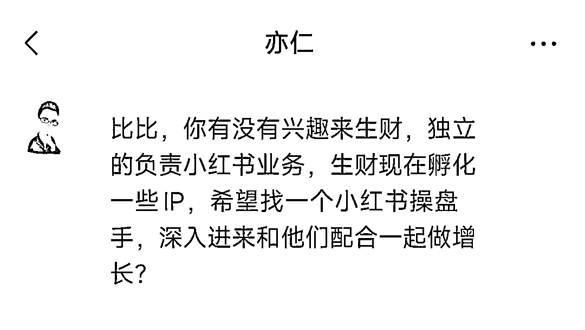

那关于2024即将进入下半年，对于我们普通人而言，小红书还有哪些可以掘金的红利机会？我们又该如何正确把握小红书趋势？有哪些非常好用但还没有多少人知道的偷流量方法？又有哪些非常高频的问题痛点可以和大家分享？

今天给大家分享小红书搞钱的10大关键词，不管你是什么行业赛道，看到最后，绝对有帮助。那我们话不多说，立马开始吧～

## 关键词1 去工具化

我们都知道小红书的用户喜欢干货密集型笔记，这种比较好起数据，也能享受后台一直跳出有人给你点赞收藏关注的快感。

但不要沉迷于其中，不要形成路径依赖，更重要的是，在流量好的时候，除了复制爆款，更要把你的人设笔记和产品笔记写好。

并在文案区里，图文内页，视频开头结尾，都加上你的人设。而不是怼一堆看起来很gpt的干货，那样有数据，但没人设，更别说有引流变现效果了。

而且对于一个账号，其实是有选题分类的。我称之为“三维选题法”。

给大家总结三大维度，让你的IP价值感更立体。它们分别是：爆款型笔记，人设型笔记，产品型笔记。

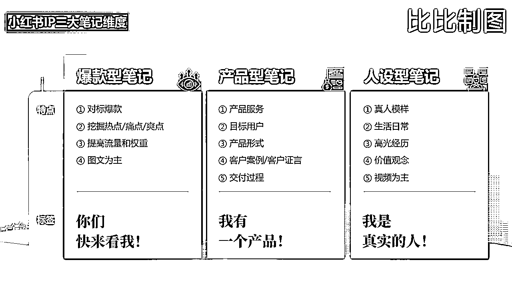

第一，爆款型笔记，就是主要做合集类或系列型的选题，容易数据起量。比如，60个设计师面试必备问答，北京的30个必打卡景点，人生重启计划之100个愿望清单。

因为信息量大，干货丰富，容易激发用户的收藏欲，带动笔记和账号的整体流量，能够有机会让更多的流量涌进去你的主页看到其他的笔记。

第二，产品型笔记，就是专门介绍你目前的后端产品，服务形式，目标客户，客户案例，客户证言，交付过程等等。

比如我有一个做知识付费培训的案例，通过小红书一年变现70w。她就是在每一条图文笔记里都优先前置了学员拿到的结果和报喜，再开始介绍交付过程，最后介绍产品和具体内容权益等等，和IP发朋友圈是一个逻辑。

第三，人设型笔记，就是介绍你自己的故事，高光经历，生活日常，旨在暗示用户：你是一个真实的人，不是只发干货的工具号，也不是只发产品广告的营销号。增加人设部分，与用户建立信任，方便引流私域后，更好转化成单。

让用户更深度了解你，认识你，看见你，才能有更高信任和意愿为你付费。一套体系化的打法下来，账号的变现价值才会更高。

## 关键词2 标题笨法

写标题这事，有三个阶段层次。

第一阶段，你接触研究到什么“数字法”，“痛点法”，“套关键词法”，“反差法”等理论方法，你能判断什么是好标题，你会总结，但可能很难运用。

第二阶段，你开始发现小红书有一些套路标题，比如你在小红书搜索“小红书爆款标题”，会出来一堆模板。

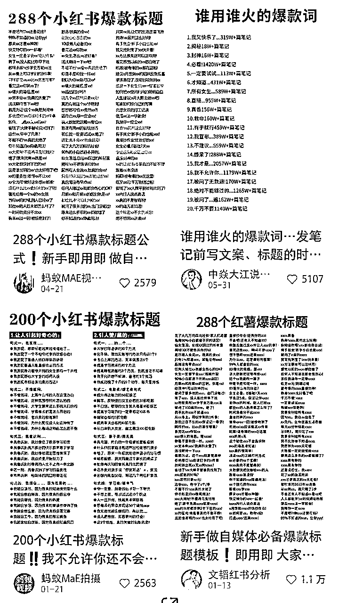

第三阶段，也就是最快的方法，就是主动去搜关键词，遇到好的就扒下来用，完事。

是的，标题和文案区还有图片不一样，其他查重，标题是不查重的。所以遇到好的标题，直接记录保存下来，发笔记可以直接用！写标题这事，千万不要自己想。

## 关键词3 字母选题

我们都说，爆款的本质是用户的需求，爆款选题就是用户的痛点所在。那我们怎么样才能知道用户的痛点呢？怎么找到源源不断的选题呢？

有一个很好的方法，就是关键词+abcd。比如你搜索“减肥”，就可以搜索“减肥a”，“减肥b”，“减肥c”……

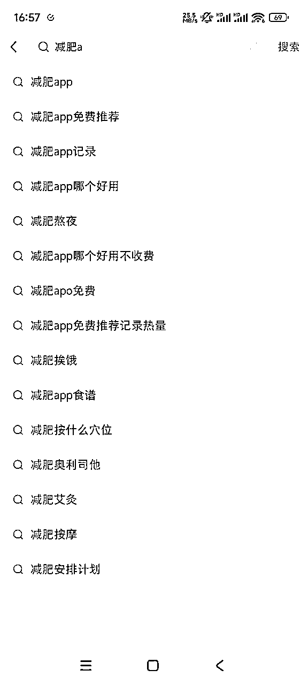

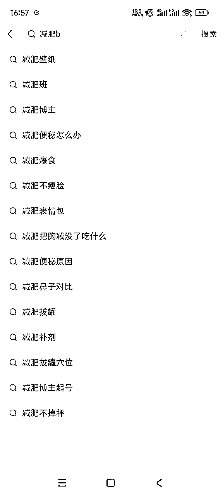

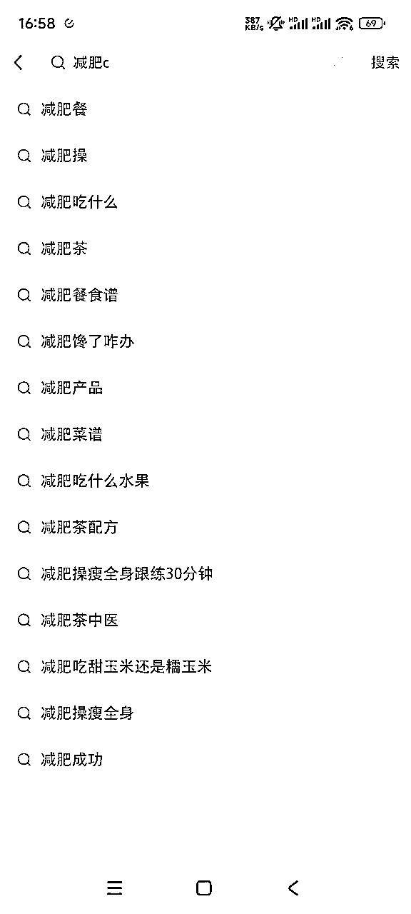

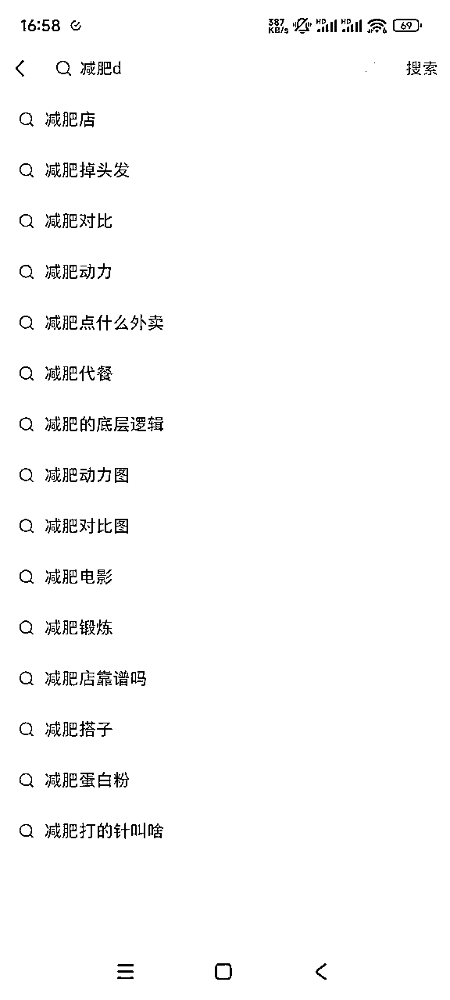

不同的关键词拼音组合，都会出现不同的下拉词，这些用户直接搜索过的高频词，一方面可以成为选题，另一方面也可以作为关键词加入到我们的笔记，有利于提升长尾流量！

## 关键词4 群聊花样

我们都知道，小红书引流的其中一个方法是在群聊发微信号或钩子。但是这事情里面有3个细节，仔细对照你有没有做好！

第一，用小号发微信号或钩子，不要用大号发！小号是损耗品，被举报坏了就注销重来。但大号可得保护好。所以，一切引流动作尽量用小号，切记！！

第二，群聊名称是关键。你在群里引流，关键是别人得进群啊哈哈哈，所以，你要引导别人加入群聊，要给对方一个理由，一个钩子。

而不是别人看到只是有个群，想进去的欲望都没有，甩头就走。你的群聊名称，是不是还在写什么——“小美的读书群”，“明明讨论群”，这种虚头巴脑的玩意？

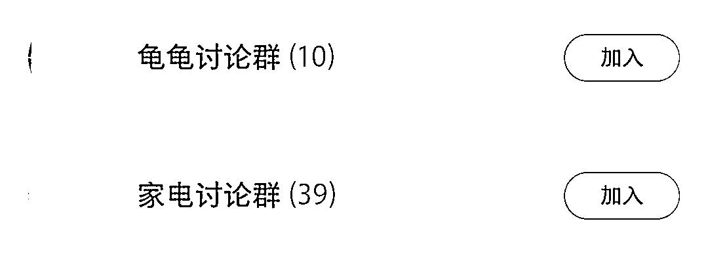

你要给用户提供价值感，比如，可以是领取资料——“减肥食谱进群领”，可以是圈定人群，如“想省钱的宝妈赶紧进”

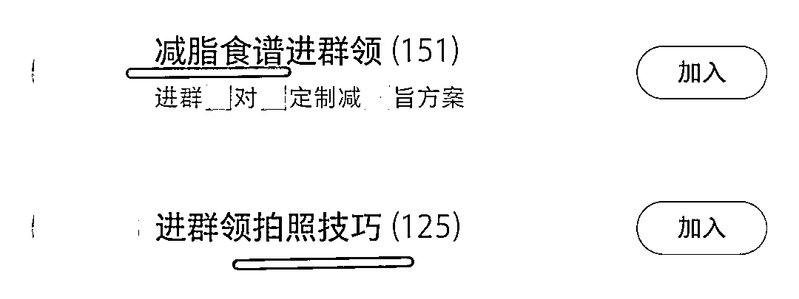

给用户塑造出一种不进群就亏大了的紧张感，你想，进群人数不得哐哐上涨！

第三，你发了笔记，建立了群聊，是不是忘记了关联啊家人们？？赶紧点开群聊，同时选择“个人主页展示”和“关联笔记”。

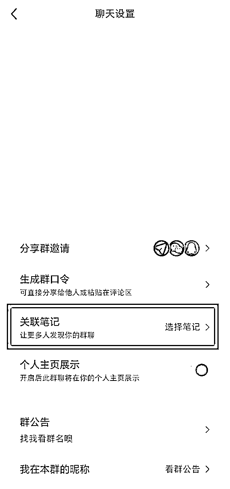

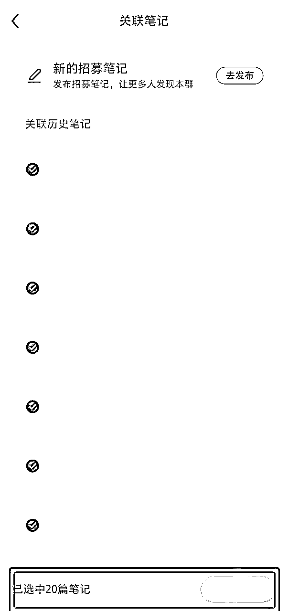

不然，万一你的笔记出了爆款，你流失的可是泼天的流量和富贵啊！

## 关键词5 低粉高赚

什么意思？也就是你可能只有几十个粉丝，几百个粉丝，但是能产生高达几千上万的变现。

比如我之前带过做高端定制旅游的案例，3个粉丝变现26000元。连他自己都不可思议。还有一个高端茶叶实体老板，不到1000粉丝就直接开了370000的大单。说明小红书在高客单变现，以及低粉高赚这块真的大有可为！内容对了，方向对了，一切皆有可能！

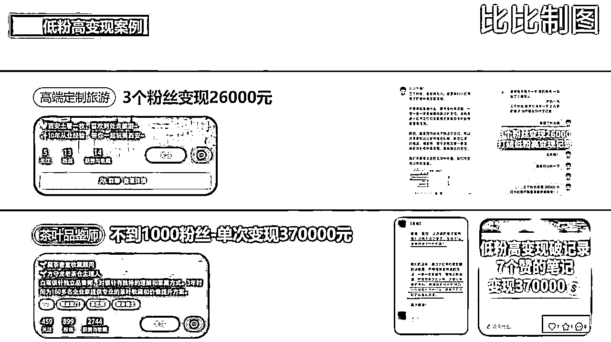

因为小红书天然聚集了高净值人群，他们愿意花钱，有高客单信任。说个段子，同一款产品，在拼多多卖29.9，在抖音卖39.9，在小红书能卖69.9。

所以，如果你在做小红书，请大胆做高客单。不用害怕你的产品卖不出去。相反，如果你的价格太低，用户可能还会觉得是价格低质量差哈哈哈！

而如果你说吸引来的全是白嫖粉，不精准，那肯定是你的笔记内容出了问题，都说内容决定用户。你的标题圈中的人群，文案区或脚本里强调的用户痛点，都会直接影响吸引的用户质量和付费意愿。

## 关键词6 a种b收

之前有一种比较流行的打法，就是素人帖打法。比如你用普通人的口吻去说“以下是我的真实感受”，文案区都是个人口吻，小红书风的表达，很贴近真实人设，照片也是真人，不是传单式硬广。

比如你看这条评论区，全都是“求推荐”，比起自卖自夸，小红书姐妹用户更偏向用户的真实体验，也会更信任。

这个就是a种草，然后a拔草。你自己伪装成素人，然后把流量导给自己。非常丝滑的软广，不会让用户一看就是暴力营销，然后直接滑走。

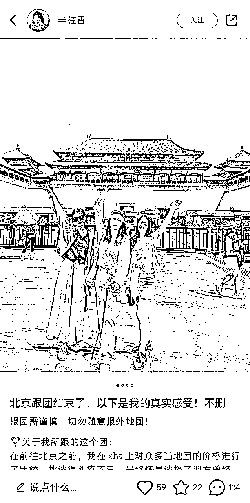

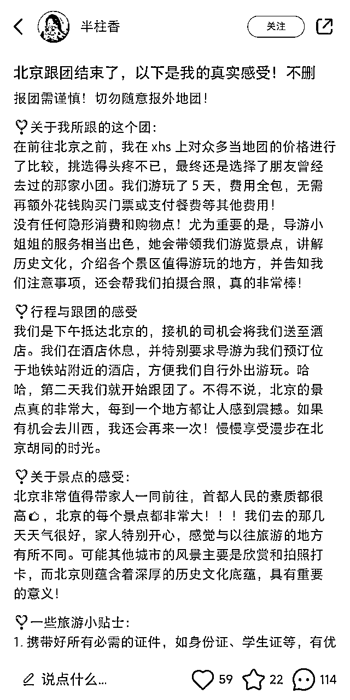

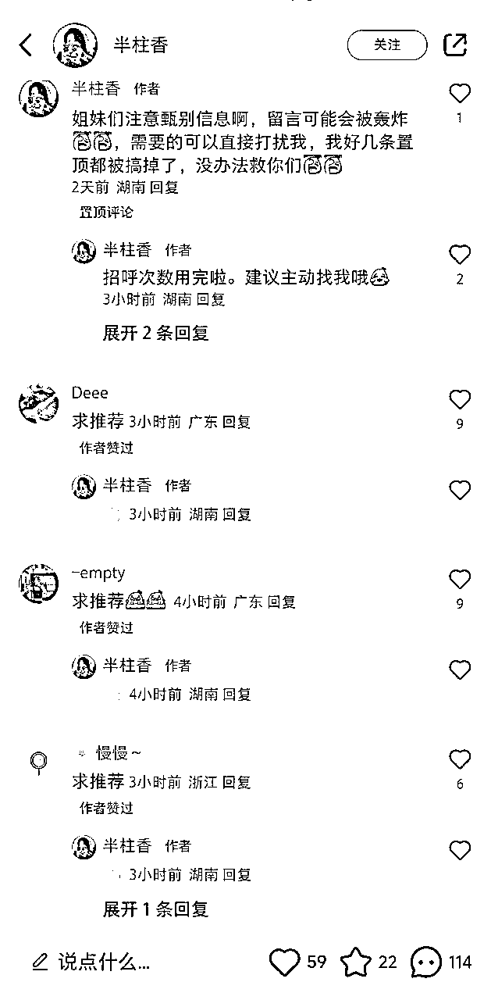

更高级的打法呢，是“a种b收”。什么意思呢？就是a来种草，b在评论区进行分享和引流。

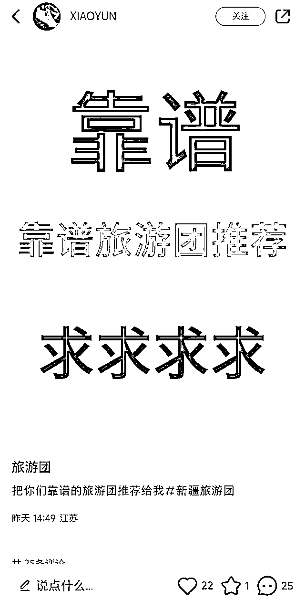

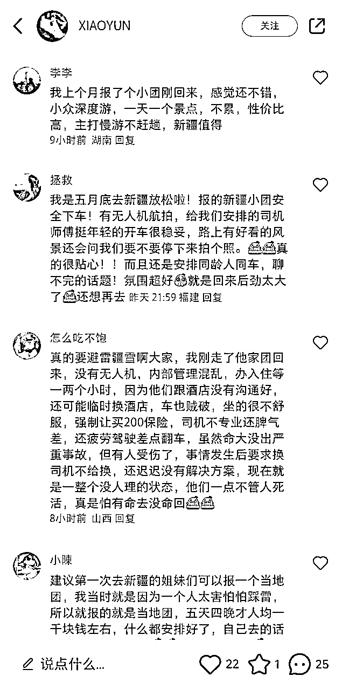

比如你发了个讨论贴，询问用户的观点意见。然后再用另外一个号进行分享。

因为用户看到这种讨论帖，都会第一时间刷评论区，这个时候用户看到，就会更加无意识的信任， 然后好奇提问——“姐妹，你这个是在哪报的，可以推荐吗？”咱们就说，这波信任度直接拉满！！

## 关键词7 减法思维

想清楚你做小红书的目的到底是为了什么。如果你是做精准引流，就不要在意粉丝数，不要在意赞藏。

如果你是涨粉接商单，一直洗爆款就好了，不要有太多自以为是的想法，更不要有什么创意。平台火什么你就抄什么，越是跟随平台趋势，涨粉就越快。

但很多人发了一段时间笔记，发着发着就忘记了初心。比如你是做引流的，天天焦虑小眼睛怎么才一两百，为什么点赞了却不关注你……这有啥用？告诉我有啥用哇？

所以，一定要明确你做小红书的目的，是为了涨粉，还是为了引流。

想清楚了，就会大大缓解你的焦虑内耗。

但对于大多人而言，只有四个字：为了变现！为了变现！为了变现！

## 关键词8 近即真理

如果你看到2022年的大爆款笔记，你现在去对标，大概率火不起来。为什么？

因为用户已经看腻了。

用户看到封面不点开，都能预判到你里面的配图到底是什么排版格式，你觉得他还会认真看完吗？

所以，请你选择最近3个月爆款过的笔记，如果你的赛道是热门赛道，也就是一搜就随随便便都是爆款，那就把时间缩短到一个月内，甚至两周内。

如果你的赛道比较冷门，今年平台可能就出了几条大爆款，那可以酌情把时间拉长到半年内。所以，看到这里你就知道了，请放心舍弃掉那些2023年发布，甚至2022年发布的笔记哈~

## 关键词9 违规处置

很多小红书博主，遇到违规通知就直接天塌下来了一样——“老师！我违规了，怎么办！要注销账号吗？账号会不会限流？要删除笔记吗？”

别紧张啊，人家肯定不是无缘无故搞你的，都是盯准了你再下手的。

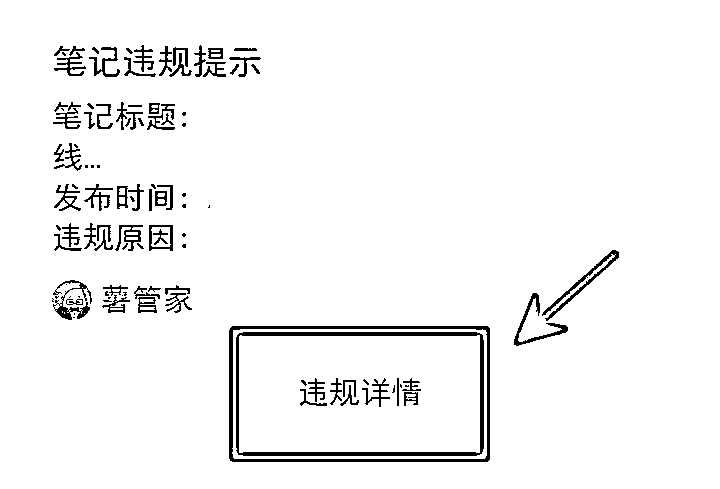

第一步要做的，就是先点开“违规详情”，看看对方具体判了你哪一点。是抄袭？还是伪造人设故事？还是被恶意举报？还是出现了平台logo？

具体要点开详情，然后根据情况进行处理。

比如涉及素材搬运，如果是图文，那就降重处理，编辑重新调整后再上传。如果是视频，就只能删除再调整。修改后可以再发布，通过后笔记就会恢复正常。

比如说你出现平台logo引流，那你就仔细检查每一个字眼，每一张图片。一定是你看漏了，检查发现后去掉再发布就行。

比如你抄袭被举报了，这种情况就是被同行盯上了，一般比较难申诉。如果笔记不是很重要，建议直接删除就好。

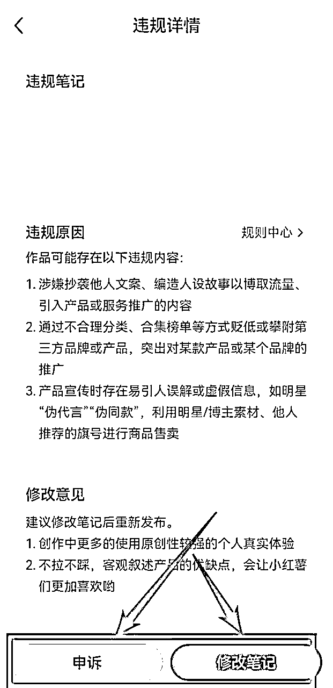

所以，遇到违规先别急着慌，两次三次也别怕。账号流量正常就行哈！

## 关键词10 万能解法

如果你遇到一个问题，你的第一反应，大概率是找个专业的人问问，如果你稍微I人一点，你会去小红书搜索问题。

但有时候搜索关键词，你会发现还是找不到你想要的答案，怎么办呢？

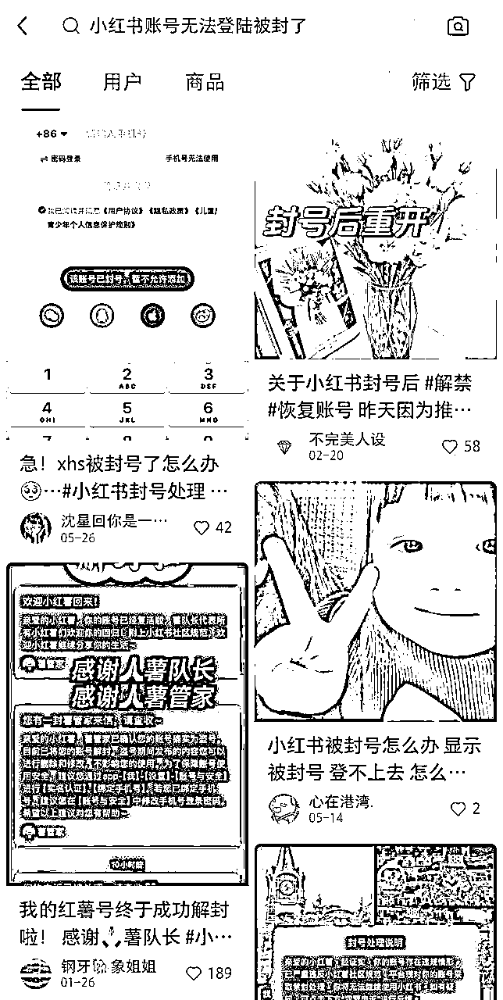

其实小红书有官方人工客服。只是入口比较深。来，直接告诉你路径：点开小红书-我-左上角三条杠-专业号中心-右上角耳机

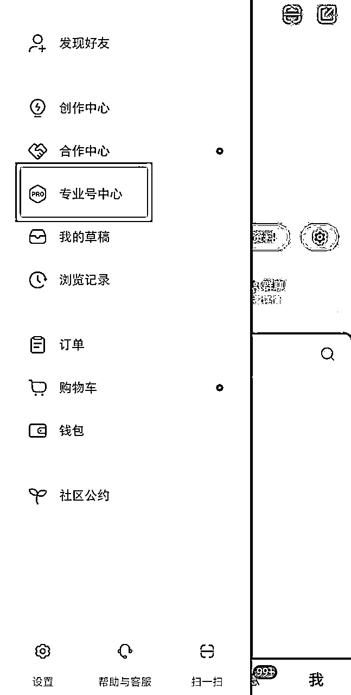

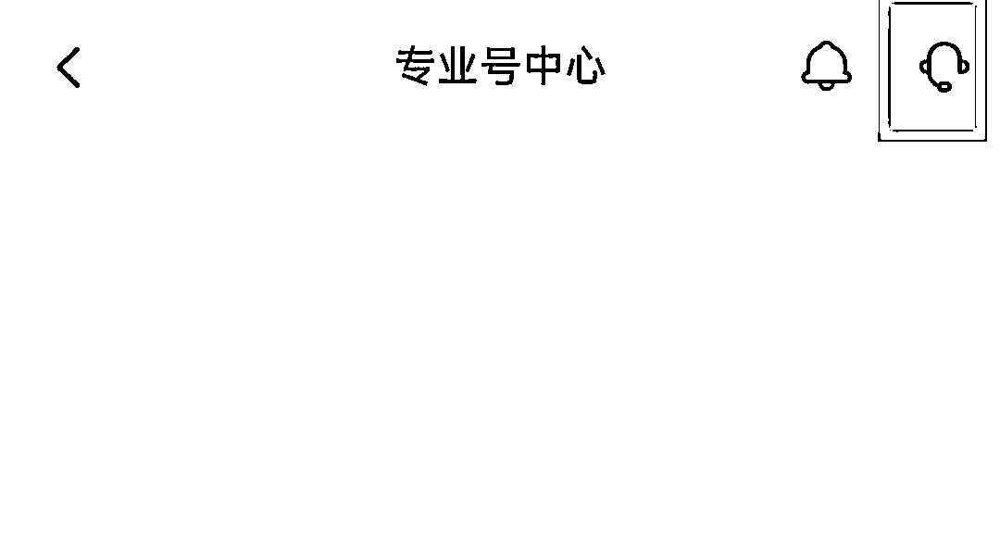

你说，诶？为什么我一点开，都是机器人回复，发了“人工客服”也没反应？

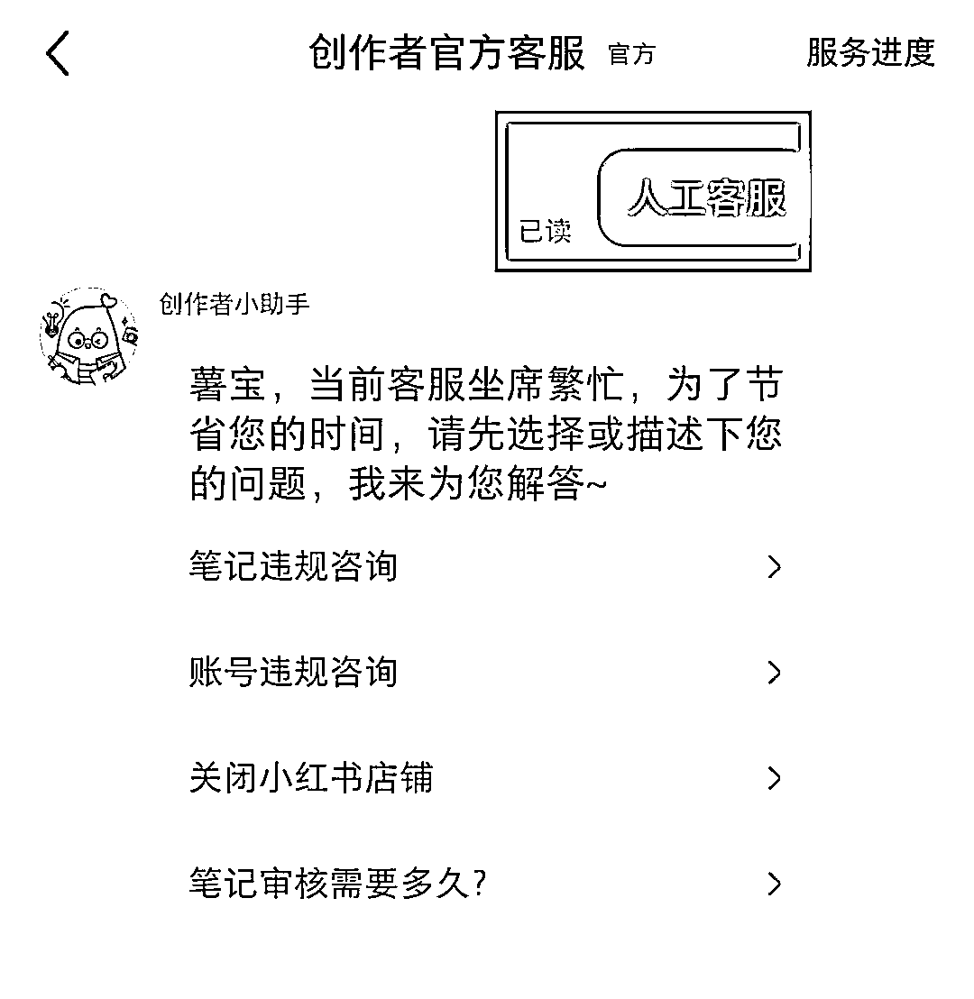

怎么做呢？很简单，连发3次“人工客服”。这个时候会自动弹出人工客服入口，点击就可以和对方咨询问题啦！

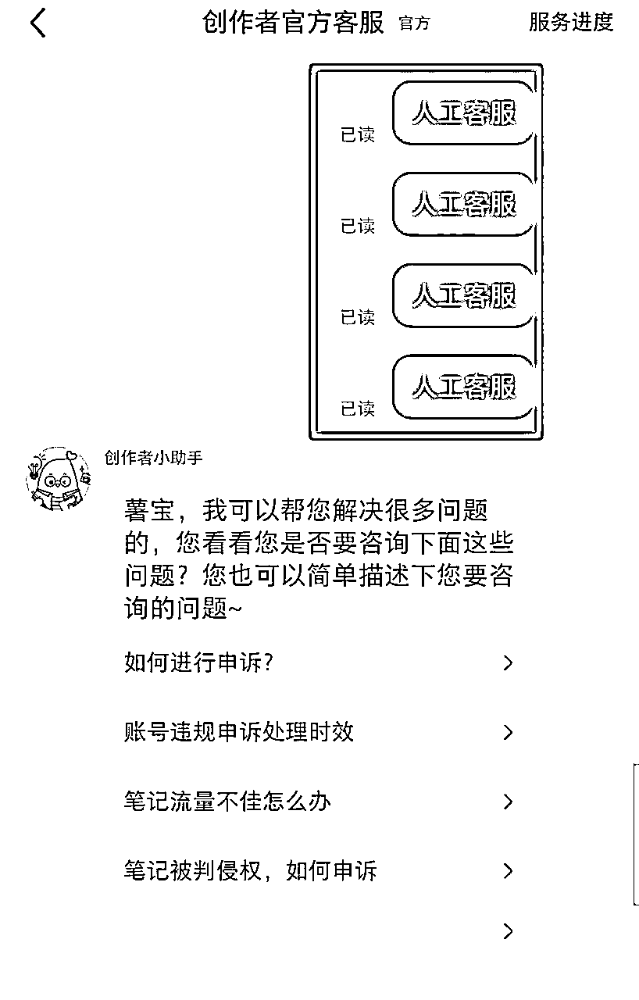

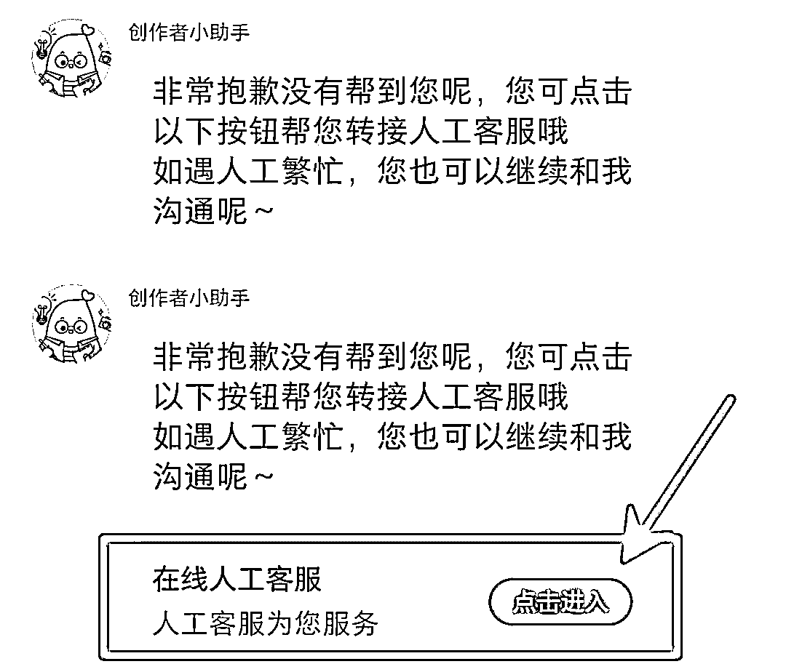

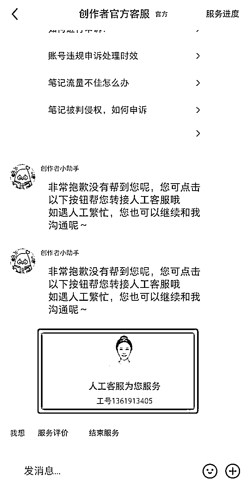

不管是账号问题还是笔记问题，限流还是违规，资质不全还是不会开店铺，关于小红书的一切官方问题都可以问！

怎么样，这个办法听完，是不是又学到了哈哈！以上就是我的分享，希望可以给圈友们带来启发！大家有关于小红书的问题，可以找我多多交流，知无不言哇！我们一起生财有术！

链接交流：ftw8575232