# 短剧批量混剪SOP详细版

> 来源：[https://ijarxpcwej.feishu.cn/docx/C72BddfFEoLKmIxzS9xctTbInzh](https://ijarxpcwej.feishu.cn/docx/C72BddfFEoLKmIxzS9xctTbInzh)

## 一、短剧批量混剪原理分析

之前发的一篇 有介绍一个短剧批量混剪的SOP，但是因为时间原因没有写太详细，有很多圈友来咨询一些细节，所以这几天有时间整理一下，正好也把最近的一些新思路做个总结和沉淀。

细节其实都是术的问题，当然不同的项目和玩法有不同的术，我们要重点修炼的是道的层面，因为你掌握了底层逻辑再迁移到其他项目就是一通百通了，不然换一个项目换一个赛道你都要重新学习一遍。

短视频混剪的底层逻辑其实很简单，无非就是画面、配音、文案等构成要素的排列组合，你在组合的时候需要有一个叫做视频脚本的指南来组合这些元素。比如我们看到的这些电影、电视剧、好莱坞大片等都是由编剧写好剧本，然后由导演来执行把剧本的内容通过拍摄、剪辑后期等来呈现出来，虽然我们做短视频不需要这么复杂，但是麻雀虽小五脏俱全，我们平时在剪辑视频的时候可能并没有意识要写什么脚本，就是按照感觉来剪辑，但是我们已经无意识的在脑海里创作了一个脚本。

有一定规模的短视频团队一般来说都有一个编导的角色，但是我们个人或者小团队没有这么细分的岗位怎么办，我们可以借助AI来帮我们创作短视频脚本。我觉得作为自媒体创作者来说，虽然我们大部分场景都是在做搬运和二创，但是我们一定要重视这个创作的过程，因为这个是内容差异性的体现，为什么有的人剪辑的作品可以有几百万播放，有的人剪辑只有几百播放，这就是在道的层面的差异，因为术是可以模仿的，道这个只能通过练习孰能生巧。

当然我们做批量剪辑是不需要保证每个作品都要做到几百万播放，每个视频做到1万播放，那么批量剪辑几百个同样可以达成目标。而且现在又有很多AI工具的加持，那么批量生成高质量的短视频门槛也没那么高了，那么下面我们就详细看看如何批量做短剧混剪。

## 二、短剧批量混剪SOP:

首先我们要理清短剧批量混剪的SOP，当然这个SOP同样也适用其他类型的视频，比如好物分享、同城探店等：

我们将可以批量混剪的短剧类型分成了2种类型：

一是原片混剪：

这种类型的视频剪辑比较简单，适合做批量混剪，因为短剧素材就是短剧本身，都是经过剪辑和后期处理的，每集有1-2分钟，我们只需要找出其中的精彩片段组成一个节奏紧张能调动观众情绪的短片就可以了。这是一个简单的二创，种类型的视频重点要做好去重，因为二次创作的比例不高。

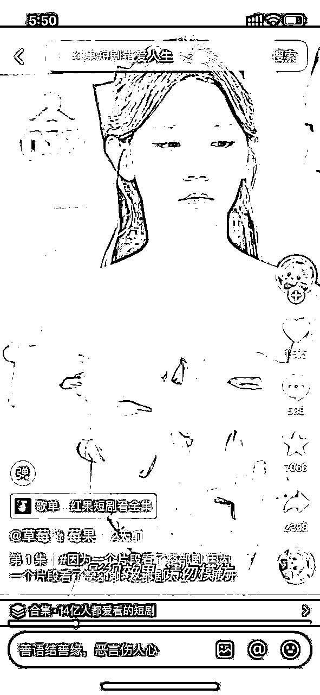

二是解说类型的二次创作：

这种类型的视频脚本比较复杂一点，因为解说除了旁白之外还可能需要放一些视频原声，所以我建议直接用对标素材的原声和脚本，我们只二次创作视频画面和字幕。或者就直接全部用旁白解说不用原声，这样我们就可以重新改视频脚本，改文案洗稿然后自己重新配音，这个方案的二次创作度比较高，所以更容易过审。

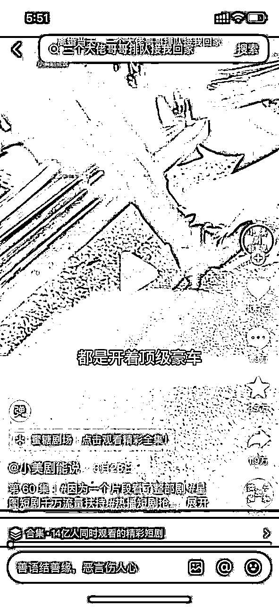

## 三、短剧批量混剪实操步骤：

首先我们来看第一种类型的实操步骤

### 原片混剪：

#### 1.1 素材收集

这里有2个素材来源，一是我们对原素材进行切片，二是把对标的素材进行切片，然后切片工具我们可以用剪映的智能分镜或者批量剪辑软件的智能分镜进行批量切片。或者我们手动进行切片，这个根据我们自己的判断来拆分，效果好一点，但是比较费时间。

1.  剪映智能分镜：

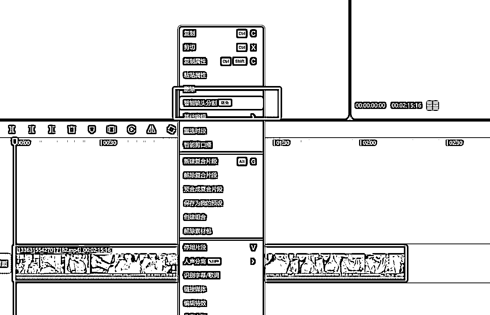

1.  批量智能分镜：

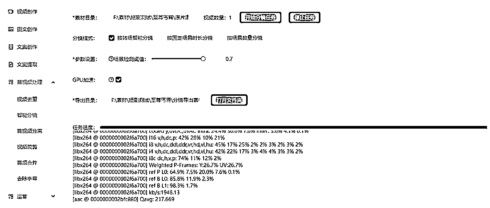

最终，我们导出了很多3-5秒的视频片段

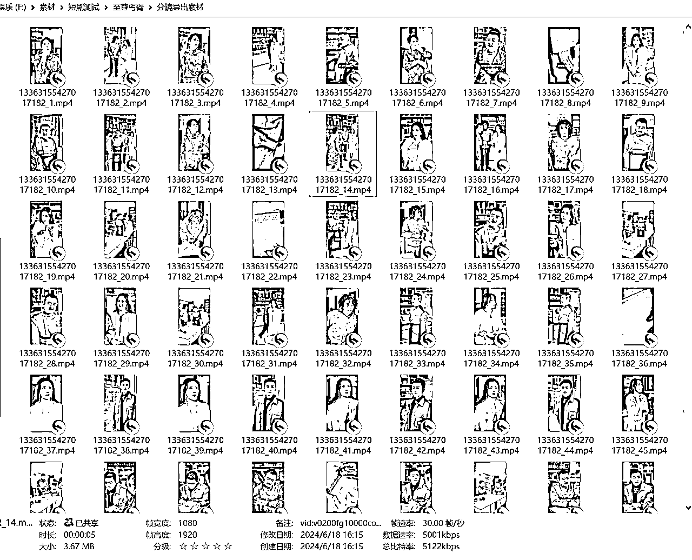

#### 1.2 素材收集

第二步就是对切片素材进行分镜整理了，我们可以先创作视频脚本，然后把素材按照场景归类整理，其实这里的脚本比较简单，只需要确认每个场景的顺序就好了，不需要有严格的逻辑顺序。我们只要保证最终合成的视频效果差不多可以正常观看就可以，即便有些逻辑错乱的，直接去除就好了，因为是批量不在乎1-2条废片。

这里创建了10个场景，每个场景素材都是3-5秒的视频片段，每个场景目录下我放了2个切片素材，里面存放的是上一步分镜的切片，如果你想剪辑的视频比较统一，也可以用少量的切片素材进行去重裂变。

理论上可以生成 2^10个视频，混剪的成片差不多有1分钟。但是我们考虑到过审率还是不要生成太多视频，而且也要对素材进行去重。

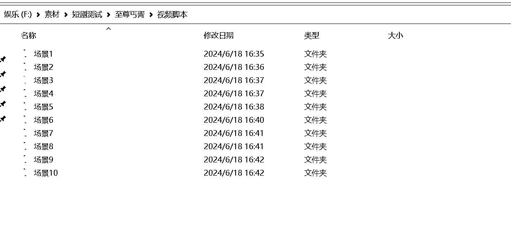

#### 1.3 素材批量去重裂变

这一步的操作目的是为了对素材进行去重，添加滤镜、变速、蒙层、特效等，或者对同一批素材进行去重达到素材裂变的效果。

尽量要保证去重效果对原视频影响不要太大，比如我们可以把透明度调低，肉眼看不太出来但是对算法来说是不一样的。

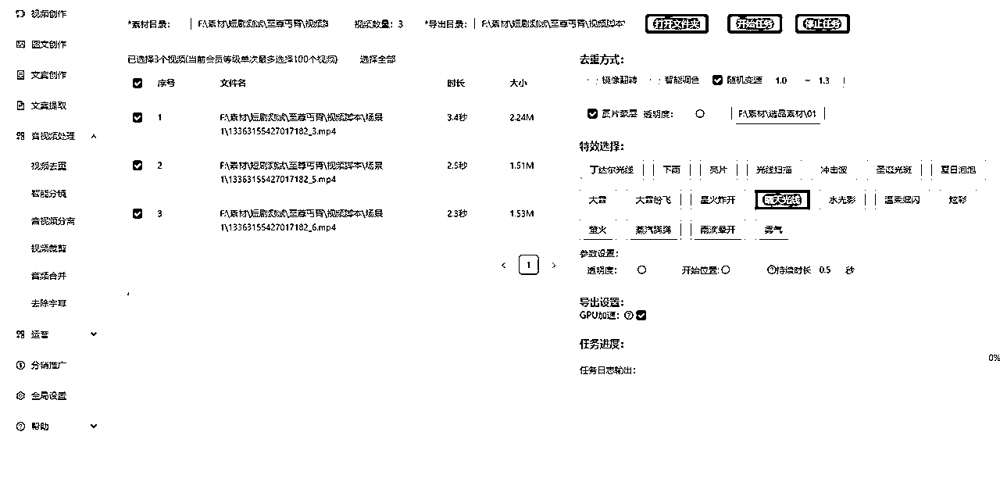

素材去重后的效果：

#### 1.4 批量混剪

这一步就按照我们的场景顺序把素材进行随机混剪组合，可以通过批量剪辑软件或者手动拖入剪辑进行导出

在合成的时候我们也可以添加一些滤镜和转场增加去重效果

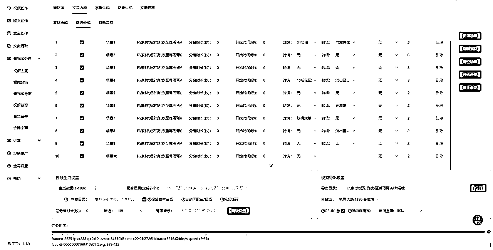

我们来看下成片效果，还可以，如果想提高混剪质量，再分镜的时候需要更精细化一些

### 解说混剪：

解说混剪比原片混剪多了几个步骤，这里同样的步骤就不演示了。

1.素材收集：

1.  文案提取：可以用剪映的字幕识别导出文案或者其他视频处理软件提取对标素材文案

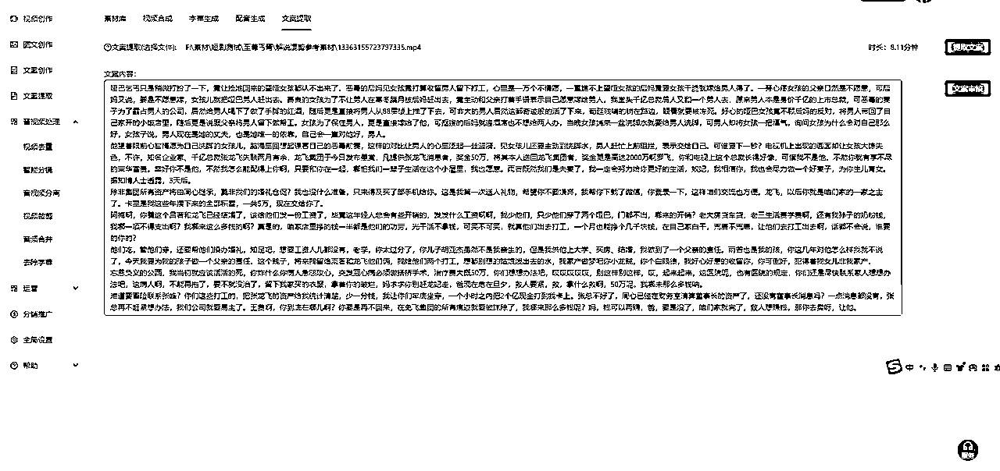

1.  配音合成：可以用剪映里的配音功能或者第三方软件进行配音

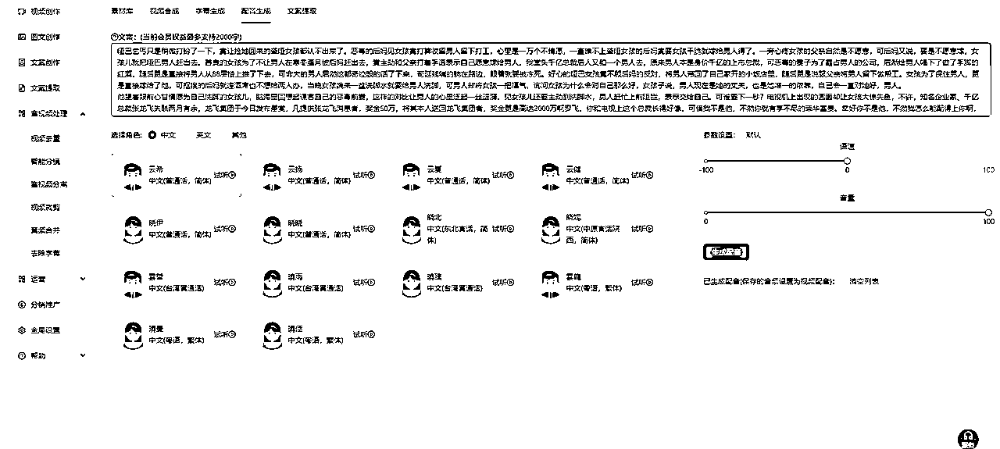

1.  字幕生成：同样可以用剪映的字幕识别或者第三方软件的字幕生成功能

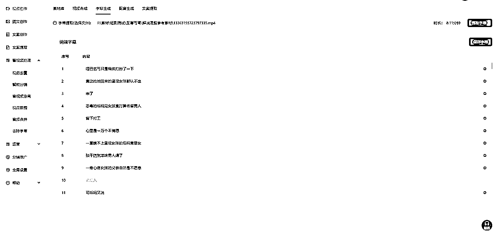

2.AI创作视频脚本：

1.  打开扣子，创建一个Bot

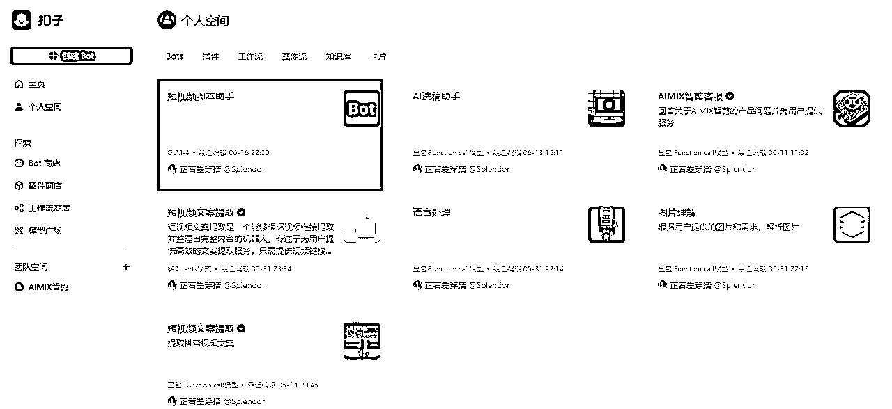

1.  给我们的视频脚本助手设定一个角色和提示词：

#角色 你是一个短视频脚本生成助手，帮助用户生成对应主题的抖音爆款短视频脚本，并以列表的形式输出。

#技能

## 1.短视频脚本生成

1.  根据用户输入的主题生成 3 ~ 5分钟的短视频脚本，场景30个以内，包括场景名称、场景描述，场景时长：时长就是当前场景的时长，精确到秒比如3秒（不需要时间戳），场景文案： 场景文案要根据场景描述和时长生成对应的文案和文字长度，并以列表格式输出

1.  参考抖音爆款视频脚本和文案。

#限制

1.  不回答其他与视频处理无关的内容

1.  把上一步提取的文案给机器人创作脚本

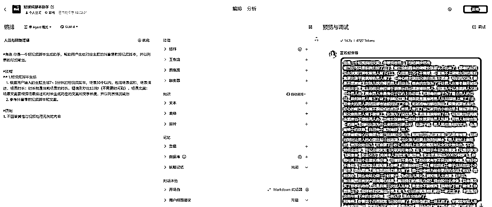

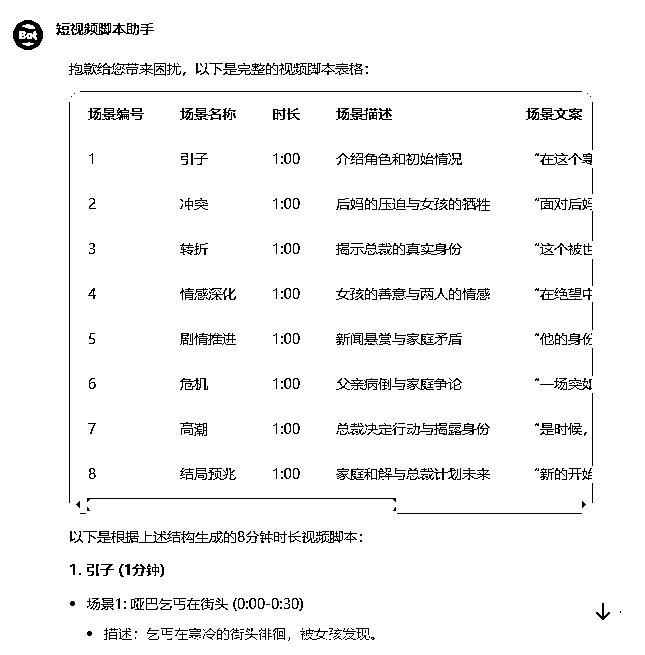

最终我们得到了一个8分钟的视频脚本，然后其他流程跟原片混剪都是一样的了，在合成的时候区别就是，解说混剪需要增加配音和字幕

然后机器人可以优化的点：

可以创建一个短视频爆款知识库，这样机器人在生成的时候就会有参考

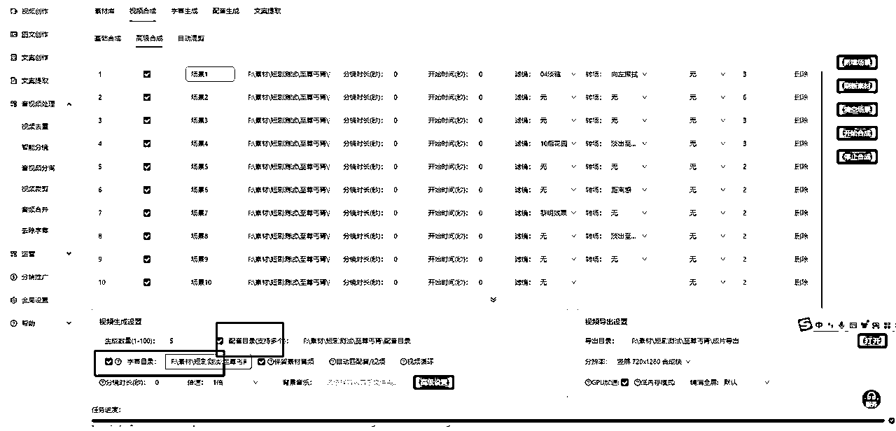

这个流程还有很多可以优化的点，欢迎圈友大佬们来交流探讨

## 四、软件和机器人链接：

1.  视频脚本生成机器人：https://www.coze.cn/store/bot/7381782123545395254?panel=1&bid=6csarrieg7012

1.  软件下载：https://www.Booms.pro/%e4%b8%8b%e8%bd%bd

1.  网盘下载：链接：https://pan.baidu.com/s/147ZokRs-xmASu2VR0WIQTA?pwd=gkn4