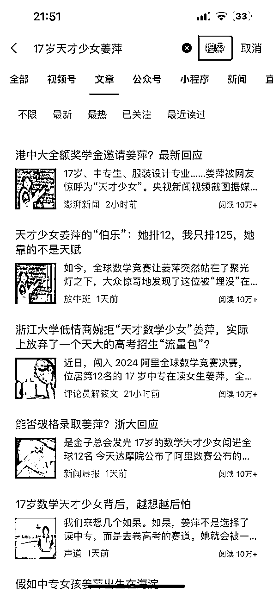
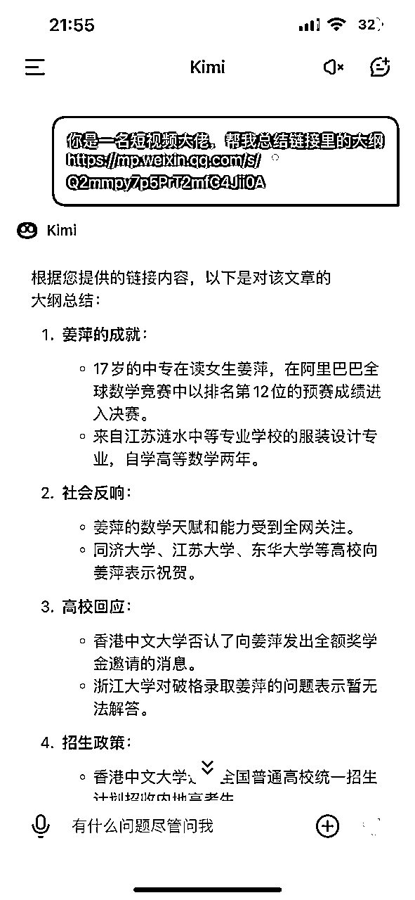
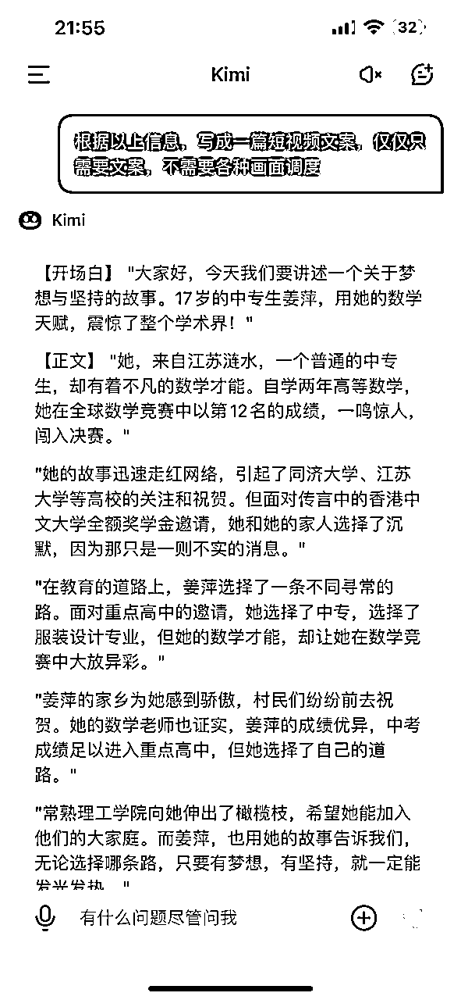
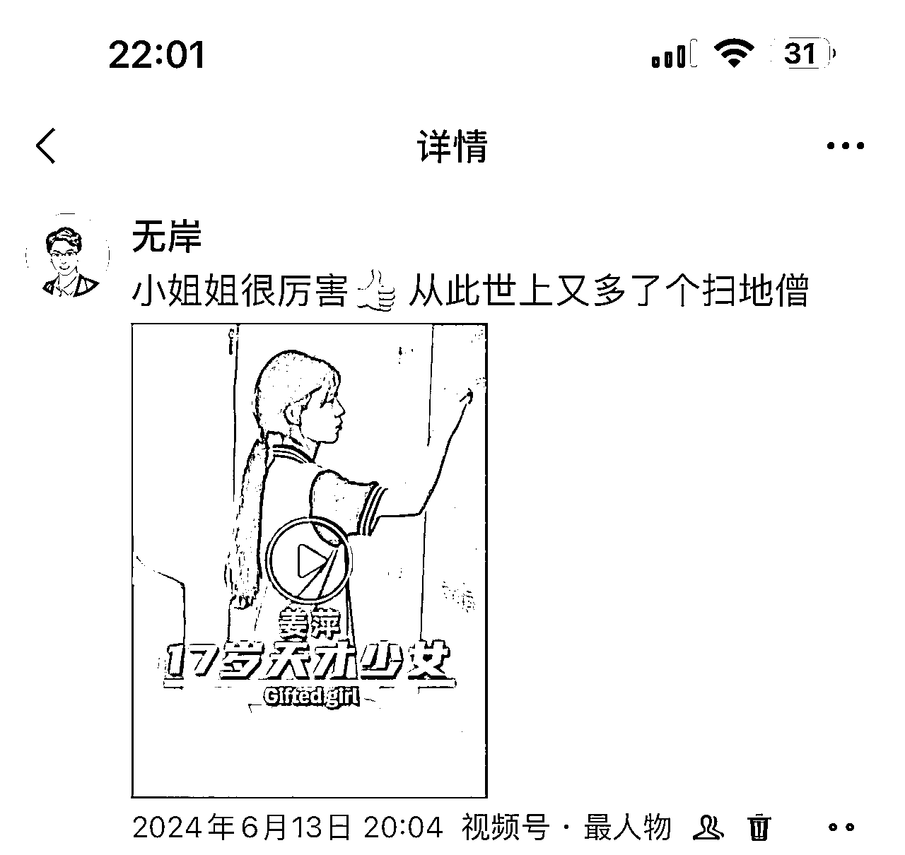
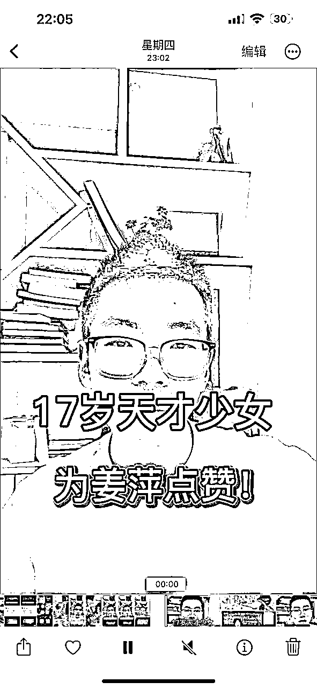
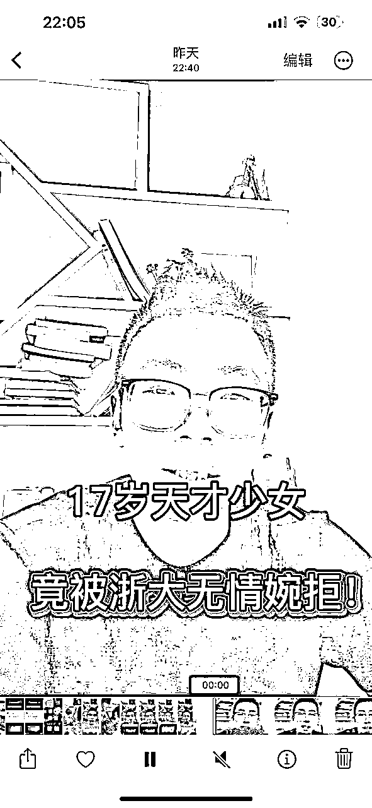
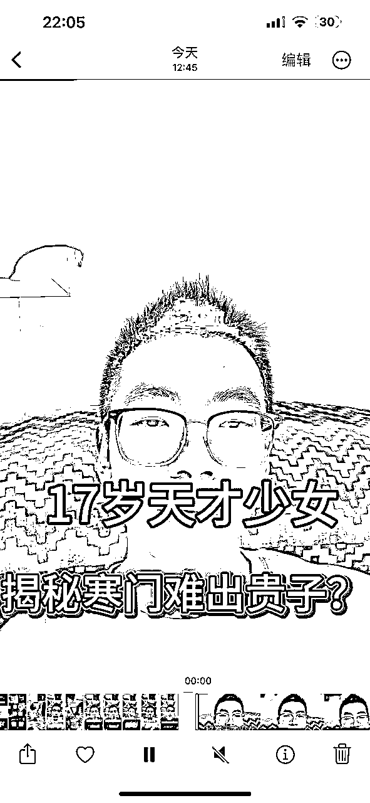
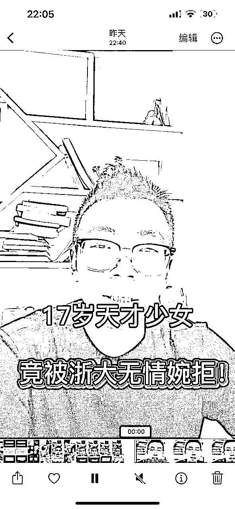
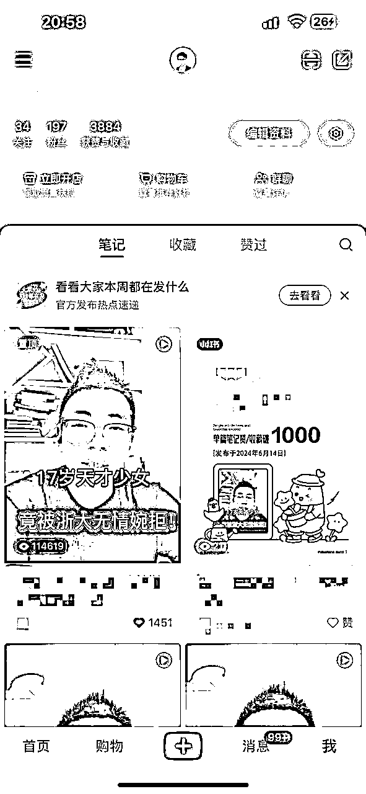

# 小红书单个口播视频播放量10w+，我做对了什么？！

> 来源：[https://mw1ctv1p4w.feishu.cn/docx/CEERd7TVPox6NVxrxuccQikenfe](https://mw1ctv1p4w.feishu.cn/docx/CEERd7TVPox6NVxrxuccQikenfe)

大家好，我是无岸。

从前几天开始，有个叫姜萍的中专生疯狂刷屏。我一看这个热点可以蹭，于是连续两天我都盯着这个热点，制作口播视频。

最后单个口播视频播放量达到10w+，我很开心，现在就来复盘一下，我究竟做对了什么！

# 1、选话题

做口播视频虽然是表达自我，讲述心中所想，但其实你讲的内容要和观众有联系，有信息增量和情绪价值。

所以，首先不是考虑你想讲什么，而是去寻找话题，表达你的内容和感悟。

像姜萍这种身上叠满了buff，数学竞赛，中专学生，女生，全球预赛第12名，这些标签是引爆公众情绪的点。

全网热议的话题，并且不带任何负面信息，这样的话题堪称完美！

我们并不追求去蹭每一个热点，那样太累了，要把有限的精力放在这种只需要稍稍努力，就可以出成绩的地方。

# 2、制作文案

口播一般事先都会写好文案，当然我偶尔也会在脑子里打好草稿，直接脱口而出。

既然要做爆款，那么就要像爆款学习。

但文案千万不能去短视频里找，而是去图文平台找，比如公众号。

我们可以在微信搜索栏里直接输入关键词“17岁天才少女姜萍”，然后筛选最热门的文章。

基本上我们的文案素材就在这里面了。

我们可以多挑选几篇文章，进行创作。

比如，我会使用kimi智能助手，进行文案创作，因为这个app可以对文章链接进行解析。

即便你不满意全文，我们只需挑选满意的部分摘取出来，再用其他的文章进行创作。

用ai创作比较快，我也会进行一定的增改删减，提高原创度。

# 3、注意封面

拍摄过程我就不赘述了，我一般用一台手机，一个手机支架搞定。

我重点说一下剪辑过程里的封面。

一开始关于封面里写什么字，我产生了纠结，因为我担心自己词不达意。

怎么办呢？

直接抄爆款呗！

我用同样的方法在视频号里搜，但搜来搜去我都找不到合适的，因为太多作品都是新闻机构发的，他们习惯性把所有信息都写在封面。

然后我就看到了这个

这个封面太棒了，正合我心！

然后我做了三个视频，都是采用类似的标题！

封面的内容一定要激发观众的兴趣，不然就是无效封面。

短视频时代，封面确实很重要，不然观众没有点击的欲望。

# 4、坚持一鱼多吃

很多时候我们都会遇到，作品发了但是流量很差，然后就从信心满满变得异常灰心。

特别是在你前面和你后面发的作品，数据都比你好，心态要崩！

这样是很正常的，因为数据存在随机性，只要持续发就行。

这话是一位大佬告诉我的，我一开始以为是安慰我，没想到第二天泼天的富贵就来了。

本来我是一直首发视频号的，其他平台我都是同步而已。

昨晚视频号一发，我本来是不想发小红书，因为刚刚白天接受了打击，后来一想还是发吧。

这次我用心了，看了看别人用了什么话题标签，直接抄过来。

睡觉之前小眼睛破5000，一觉醒来破2w，到中午就9w+！

但视频号就一直不温不过，反而是前天的视频播放量越来越高，有好几千。

# 5、维护评论区

有人一直在问，怎么获得流量？

其实所谓的流量是系统看你互动情况不错，一直给你推荐罢了。

互动就是指用户对你的视频反馈，点赞收藏评论分享都是。对于小红书来说，评论实在太重要了！

只要有源源不断的评论，系统就会一直推荐你，所以我们常常看到那些有争议性的内容会引起用户评论的欲望。

包括我这次追的热点。

一边是天才少女，一边是浙大婉拒！

对立冲突的场景一下子就有了，不管是支持哪一方，都会在我的评论区疯狂输出。

在一开始评论较少的时候，我会一条条回复，不管对方的评论是赞同还是反对，黑红也是红嘛！

评论越来越多后，我就彻底不管了，网友会替我回复。

# 6、遗憾之处

本次小红书成绩还是不错的，播放量破10w，赞藏破1600，目前最好的数据。

可惜播放量未能突破20w，与我的预期相符。

涨粉过少，让我心存遗憾。本来以为能涨三位数的粉丝，最后只有几十。

大概率的原因，我没有别人一定要关注我的足够理由吧。

好了，以上就是我今天全部的分享！

如果你也对短视频感兴趣，欢迎一起交流！