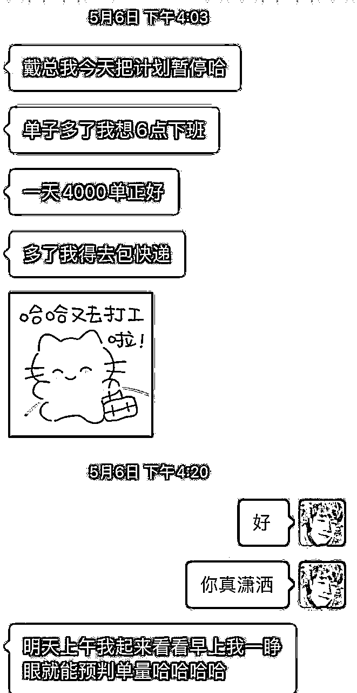

# 从0到100W利润的小红书带货宝典 副本

> 来源：[https://n4dbdw6xhe.feishu.cn/docx/CRs6df7ZQoiI1UxI9nIcKWYznKb](https://n4dbdw6xhe.feishu.cn/docx/CRs6df7ZQoiI1UxI9nIcKWYznKb)

一本小红书操盘手视角的《带货宝典》，带你系统化学习小红书带货

从0到1完整复盘小红书笔记带货的所有核心策略和执行细节，既可以当工具书查找解决选品，运营等问题。又可以当作系统化的学习资料学习小红书带货。总结团队多年经验及诸多一些实战的好兄弟的技巧玩法，💯一线实操干货。

作者：戴小胖（抖音ip同名）

作者声明：第一次写这种所谓的带货宝典，有点梦回当年打游戏各种贴吧找大神寻攻略的错觉。只不过这次我变成了所谓的“大神”，变成了攻略的制作者，激情满满，哈哈！！

本文主要总结了我从看不起小红书带货，到真香打脸的完整心路历程。从一个月只有2万GMV入不敷出，到单月最高800万GMV，再到单店月利润100W+的所有核心实操干货。

写的不好，也很粗暴，但是我一直坚信一个鲁莽的开始的，就是最好的开始。就像我19年做抖音，22年做小红书，都是在鲁莽的开始，在大家异样的眼光中不得成长进步起来的。

使用说明：尽信书不如无书，本书不是真理，只是个人视角里的一点实操经验，是对小红书电商的一点独家的但是狭隘的理解和认知。另外涉及到赛道 人货场等多重因素影响，本书内容并非所有行业都可以拿来套用。

但正所谓：怕什么真理无穷,进一步有进一步欢喜。希望各位在使用本书的部分方法实操获得正反馈的时候，给老铁我打个666；如果有什么错误或者有什么新玩法新经验，也欢迎批评指正，交流切磋，我们一起无限进步！！

# 核心心法

1000条笔记定律：只要在你小红书发过1000条有效笔记，你一定能大爆一次，并且能获得10w左右的收益。（你发一条笔记=赚100元）

1.在笔记爆之前我们的投入产出是不成正比的。

如何在一个领域成为专家：10000小时定律，如何在小红书大爆一次：1000条笔记定律。

1000条笔记定律：只要在你小红书发过1000条有效笔记，你一定能大爆一次，并且能获得10w左右的收益，你发一条笔记=赚100元

战胜概率：正确的方法+快速的执行+足量的时间+足够的内容素材

卖货逻辑：对的产品+对的素材=爆单

二八定律

选品——重要性80%

笔记——重要性 19%

运气——重要性1%

不要自嗨，卖被市场验证过的产品，而不是自己创造的，卖用户喜欢的产品而不是自己心水的，卖确定性最高的产品，而不是天马行空的

封面重要性 80%

标题重要性 15%

内容细节重要性5%

天才是99%的汗水+1%灵感

爆单是99%的选品和素材+1%的运气

用足够的数量个和努力战胜概率

抓住事物的本质和关键，在主要矛盾处花最多的精力，不要在细枝末节上浪费时间。

## 新手都在找捷径，高手都在苦练基本功

什么是护城河：就是大家明明知道这样做是对的，是有效果的，成功概率也高，但是大部分人还是不敢做、不敢跟、跟不起、跟不动。只有在基本功，在最关键的事情上下苦功夫，投入最多最重的时间，才能有所突破，才能突破内卷，构建自己的壁垒，享受丰厚的利润。

直面关键问题，绝不逃避！！！

## 钱会流向不缺钱的人，爱会流向不缺爱的，爆品也会流向热爱生活的人。

状态永远大于能力。

保持对生活的热爱，对万物的觉知，保持思考，保持“品感”才能真正选出大爆品。

在选品强悍的基础下，批量+矩阵笔记带货就是最长久最稳定的真正的无人直播带货

总时长=人均观看时长*人数

30天 5w小时总观看 ：5w小时=300w分钟

每天观看总时长10w分钟 每小时观看总时长4167分钟 。每分钟观看总时长 69分钟

假设每人观看1分钟（60s），实时在线约等于69人。 每人观看2S，实时在线等于350

选品

选品定生死

人 什么货 用户

货 卖给谁 商品

场 怎么卖 成交场景 笔记带货/直播/买手

笔记

点击率决定流量下限（封面标题 决定点击率）

封面=店铺门面

标题=店铺招牌

推荐流量

算法 ces=点赞X1分+收藏X1分+评论X4分+转发X4分+关注X8分

搜索流量

笔记特定关键词

特定场景+特定人群

## 如何快速入局小红书并拿到结果

### 强大自己不如选择对手

朴素的心法：提升自己不如降维打击，在降维打击中不断拿到正反馈，才能真正的提升自己。

我在小红书，做Ip，做矩阵都做了200W+粉丝，还是下重注做了笔记带货，原因无他，降维打击罢了

## 基础恶补

### 赛道：傻瓜都在赚钱的赛道就是好赛道

综合分析赛道里赚钱的同行，他的产品 供应链 笔记素材 变现形式 资金压力等你是否可以模仿甚至超越。

信息来源：官方自带的千帆后台，第三方软件 千瓜， 自己刷笔记，小红书信息渠道

|  | 产品 | 供应链 | 笔记素材 | 变现形式 | 资金压力 | 备注 |
| 小老虎工厂店 | 女装+饰品 | 外贸尾单（后端组货能力很强） | 静物展示 | 笔记带货+直播带货 | 较大 | 供应链强，以产品带流量 |
| 小红书范冰爷 | 女装（大牌平替） | 外贸尾单，大牌平替 | 衣柜展示讲解 | 笔记带货+直播带货 | 较大 | 供应链强，以产品带流量，蹭大牌流量 |
| 香雅木舍 | 高客单手串 | 文玩珠宝，定制手串 | 质感和审美极高，模仿比较难 | 笔记带货+直播带货 | 大 | 原创产品能力+高质感素材+高人设直播 |
| 1mo饼 | 女装T恤（基础款） | 可以直接1688找 | 直拍+AI语音讲解 | 笔记带货 | 小 | 可以抄，且品类退货较低 |

一个粗暴的认知：细节太多赛道不是好赛道。

越聪明的人越简单 ，越简单的商业模式越赚钱，越简单越接近实物的本质。

### 选品基础课：区分标品和非标品

### 小红书的机会在于非标

小红书的主要机会非标电商 非标高客定服务。

快速入局小红书的机会在于非标品中的标品

#### 标品和非标品的定义和理解

标品：具有统一的市场标准/具体型号的商品，如水果、大米、电磁炉、iphone15、垃圾袋等。

理解： 功能大于款式

非标品：反之，如大码女装 ，连衣裙、女包等。

理解：款式大于功能

#### 从消费者角度区分标品和非标品（消费决策）

标品：

功能层：标品在功能性方面扮演着刚需的角色，卖微波炉为了ding食物，买个垃圾袋为了装垃圾、买大米为了煮饭吃。

质量层：买家对标品的品质认知较强，首先是商品材质和工艺的通用标准，例如买一盒筷子，材质分别是竹筷、不锈钢、塑料等，众所周知不锈钢材质比竹子好（贵得有道理）。其次是名品（知名品牌），多数情况下品牌的定位和知名度意味着质量（品控），例如格力的空调、durex的condom等；最后是销量魔咒，买家都认为多人买的就是好的。

价格层：在上述条件一致且不超出常识逻辑情况下，价格往往是决定性因素。

大部分消费者对标品的认知比较明确，过了功能、品质、价格三关后随即下单，因素排序分别为功能价格>品质。因商品同质化严重且买家主观性强，多半无需过多挑选便完成付款，概述为理性派。

某妹子要买点垃圾袋，画面流程大概是：

1、搜索【垃圾袋】；

2、排名前三的商品点击去看看价格；

3、排名前十的商品再点进去看看厚度和对比价格；

····（看完十几个款，头胀）

4、选个发货地近/最便宜的下单付款。

* * *

非标：

功能层：买家对商品的功能需求没有绝对标准，例如女装类目的买家需求是“好看”，妹子的审美历来是捉摸不透的玄学，何来的统一标准。在没同款的情况下，“好看”这一因素占购买意向的大比重。

质量层：非标的商品材质和工艺标准数不胜数，买家对非标的品质认知比较弱，且较少作为核心购物因素，品牌对于非标的质量甄别标准多为锦上添花之举。例如服饰，买家很难通过图片分辨质量层级；销量对任何商品都是魔咒（除了小部分的防撞心理作祟）。

价格层：非标品的价格因素影响较小，往往呈现分段式波动。

大部分非标品买家的购物意向相对模糊，除了品质和价格，对商品的功能并没有明确的需求，就像纯粹的“逛街行为”，概述为感性派。

某妹子要买件连衣裙，画面流程大概是：

1、种草or搜索【连衣裙】；

2、这件挺好看的，这件也好看诶；

3、这件挺好看的，这件也好看诶；

货币3家？no 货比千家！！！

····（看完十几个店铺上百个细分品类，翻完四五千个款，插上充电器继续找）

4、从挑中的几十个款中筛选出3-5个款，再听听闺蜜/舍友/男友/同学的建议，选其中的一款下单付款。

3天后试穿，发现不好看 退款

非标的痛点：难选款 多sku 容易压货压库存，资金压力较大。举例一个童十几个颜色 近百个款式

标品痛点：大标品 重资金 重供应链 重付费 重关键词推广和搜索排名

### 小红书的机会在于非标

小红书的主要机会非标电商 非标高客定服务。

快速入局小红书的机会在于非标品中的标品

强标品（第一列）一般指买家熟知型号/或纯基础款能满足70%以上需求，例如手机、纸品、鲜果等，基础款销量在所属三级类目的销量占比超70%以上。

弱标品（第二列）多半是基础款份额过半但未垄断类目的商品，例如女内、彩妆、运动户外等，基础款市场份额占比在半数之间波动。

弱非标（第三列）存在多样性，最特殊的表现为点击单价比其他子类目更高，例如男装男鞋、应该说跟男人沾点边的都呈现出标品的特性吧（呵~男人），或女装的裤子、丝袜等。

非标（第四列）商品丰富度高，明显的特征为全网商品同款率极低，例如女装、女鞋、女包、童装等，应该说跟女人有关的类目都呈现出非标的特性

# 可复制的单店百万利润——连爆玩法

## 核心5步，价值百万

1.养号： 测流量，养权重 发娱乐热点 对立话题【‼️务必是正向，不要引战】

2.选品：就是找到同行已经出结果的品，去卷他们的价格。不要自己去选！【‼️此一起✅供应链要求很高，不一定能找到优势供应链】建议还是从我们现有的品开始。‼️

3.起店：确定大的类目 研究同行都在爆的款，跟款，卷品+低价。重量不重利，起店铺拉权重为主，后续可以出利润款。

4.抄素材：100%的爆=70的爆款相似度x足够多的尝试。跨行抄=300%的利润

【现在很多女装，只要网上刷到花色你觉得好看，哪怕它是个窗帘，咱们都能做成女装】‼️

5.连爆：测出一条比较好的素材 重复再发 80%的可能爆。大力出奇迹，产品爆了 会带动笔记爆

### 0.玩法模式

1.一证7店

1个身份证可以注册一个个人店

1个身份证可以在小红书认证3个营业执照；一个营业执照可以认证2个专业号；每个专业号可以开1个店。

（必须先认证专业号，再开店）

一个人最多可以开7个店。

2.一证控25号，账号关联，6个专业号店可以再关联18个个人号，可以控制25（6*3+6+1=25）个账号带货。

3.一证控43号，其实能控制货盘和资金的情况下，完全可以让找代理 再开关联18个企业子账号，专业就能一个证件控制43个带货账号。

（社群会员曹总补充：1证多个人店，就正常买别人的实名，开个人店的时候经营人填自己的身份证号就可以，大哥可以测试下，我昨天还刚开了四个）

### 1.养号：测流量 养权重

千万不要一上来就注册店铺，注册账号后先养号测权重。

人有命运，账号也有，有些账号出生就在罗马，而有些账号天生就是牛马。 拿到牛马账号建议注销重开。

养号基操，

一定是一卡一机一号，不要老切换号，不要wifi，不要先实名

起号之前发一些娱乐 互动 符合人群的内容。

框人群：我的人群是什么 ？ 发人群热点高互动内容。

人群热点内容：微博热搜 抖音 热搜 热门电视剧，情感 婚恋 女性成长等话题

2.权重

小红书的权重有很多，比如流量权重 电商（等级）权重 笔记权重 ，这里我们只讨论起号需要的基础权重

红薯等级 主页——资料编辑——划到最下面 个人号务必是尿布薯以上，最好能到泡泡🍠

实测结果：一上来就开店发产品的流量和爆量没有养过的号好，素人店铺 直接发电商带货笔记 生命周期 和爆发周期都不如起号前经过养号 发过一些 热点型 娱乐性的内容。

测流量步骤，前几条笔记测人群 测流量。 如果流量不行 注销重开（不开店铺注销可以立马释放手机和实名，开了店铺注销就特别麻烦 要公示要结算）

测流量笔记参考： 新人养号， 电视剧推荐， 要不要生二胎等等等

PS：专业号没有红薯等级这一权重，不需要过分养号。但可以发发测流量 圈人群的笔记，让你的流量权重快速起来。

### 2选品：找到同行已经出结果的品，去卷他们的价格。不要自己去选！

底层逻辑：小红书是一个算法及其精准的大庙会。

新手入门 平价 非标中的标品类目

比如 防晒帽 防晒衣 睡裤 睡衣 通勤裤 水果（不需要展示产品好看等附加属性的产品）

成功率100%的选品策略：跟品，确定大类目之后 不停刷 不停研究同行 找到已经有结果正在爆的同行。

选品工具软件

第三方数据软件：千瓜 新红 灰屯。 官方工具小红书千帆。

千瓜：笔记带货榜单

千瓜——实时低分爆文

根据爆文评论区选品开品

官方工具小红书千帆，笔记排行

优秀笔记合集功能

其他选品方式：

供应链反向赋能：供应链有最一手最真实的数据。

团队或者大哥的赋能，给到你正在爆的产品和链接以及素材

跨平台选品 比如抖音在爆单的品搬过来，要注意平台调性。

总结：成功率最高，最能拿到结果的就是跟爆品，快速执行，抄改超。其他方法需要一定的手感和内力，容错率较低。

选品定天下，要做确定性最高的事情！

# 小红书笔记几点发笔记最容易爆！

笔记必爆的核心策略：精准时间+精准人群+梯度批量素材=必爆

精准时间：前期曝光比较少，可能只有200-500个小眼睛，在对的时间遇见对的人，产生足够多的互动和转化才能起来

精准人群：话题框人群+精准关键词+封面+产品链接

梯度批量素材必爆：

1.新号起号发笔记条数梯度递增 按照

第1个礼拜：第一天 1条 ，第2天 3条，第3天5条，第4到7天 10条左右

第2个礼拜：第一天10条 ，第2天 15条 ，第3天20条，第4到7天 30条左右

第3个礼拜：按照素材产量，每天30——50条不等，设置定时发送，大约30分钟发送一条。

第4个礼拜之后：继续按照素材产量，每天30——50条不等，设置定时发送，大约30分钟发送一条。

### 3.100%起号的原则：爆款走量

小红书是一个算法及其精准且厉害的大庙会

思考：在庙会上 你隔壁的一家店铺爆单了，你要怎么做才能快速起量！！

选品起号

确定大的类目 研究同行都在爆的款，跟款，卷品+低价。低价走量，起店铺拉权重为主，后续可以出利润款。

起号的品 一定要和同行卷价格！

这里有一个有趣的小例子，分享给大家

设置错价格的爆单

保本 保证一定的利润 起店10%的利润

19.9 设置10块的优惠券 成本 6块钱。

最近刚发现的起店爆量小技巧，骗点击之偷天换日

如果你挂车 价格有失偏颇 骗点击=违规 价格欺诈的违规。

1.有概率成为0.1元，因为有券。

1.  5月9日 发布 不挂车的骗点击笔记。

1.  引导 通过 笔记置顶评论 导入店铺

1.  0.1元骗点击 ，惊喜盒子骗评论，拉动ces 爆流量 （还是不挂车 避免价格欺诈）

1.  爆了，5月17日 换 标题，0.1元改成9.8 ，同时换封面 +挂购物车。

1.  暴了 ，直播。

### 4模仿原创：

模仿关键要素：标题 封面 话题 评论引导 玩法 （带货类笔记 正文不重要，不要浪费时间写正文）

玩法：

模仿的底层逻辑

1.同赛道抄：100%的爆=70%的爆款相似度x足够多的尝试

千瓜软件 刷 千帆笔记排行

2.跨赛道抄：不要原封不动的抄 跨行抄 =等于3倍于同赛道抄的利润

开品！真正的高手 万物皆可开

## 4.1标题方法论

核心方法论，建立标题内容库。

标题模版1：场景+人群

场景=点击率

人群=转化

举例：

1.当一条裤子被穿来上班

打工仔就是人群，来上班就是场景。产品实际卖点，产品通勤又好穿

2.女大学生取快递穿什么裤子

女大学生就是人群，下楼取快递就是常见。 产品实际卖点，宽松方便好穿

标题模版2:价格+产品特性

产品特性=点击率

价格=转化

新中式水墨外套只要15R

新中式水墨外套=产品特性

15R=价格

加长112的水墨裤只要15R

加长112的水墨裤=产品特性

15R=价格

重新定义了小红书裤子的均码和加长

最初小红书都是均码98cm，我们发现了很多妹子都说裤子不够长，我们出加长款 从102+ 到106+ 再到112+ 122+ 重新定义了小红书的裤子长度。

标题模版3:情绪词/决策词+标题模版1 ；情绪词/决策词+标题模版2

啊啊啊啊啊！新中式水墨外套只要15R

测评 | 加长112的水墨裤只要15R

#### 利用AI 批量制作标题模版

kimi

1.用AI投喂数据和对标链接

举例您提供的链接指向的是小红书上的一个用户个人主页，名为“@xxxx”。在这个主页上，博主分享了几种居家裤的图片和描述，以及它们的价格。由于我不能直接从网页链接中获取实时数据，我将基于您提供的内容来分析博主的标题框架。

以下是根据您提供的内容分析出的博主的标题框架：

1\. **价格强调**：博主在标题中突出了价格，如“16块8💰”，这可能是为了吸引寻求经济实惠商品的用户。

2\. **数量提示**：提到了“一口气买3条”，这可能意味着价格足够便宜，可以促使用户进行多件购买。

3\. **产品特点**：博主使用了描述性的语言来强调产品的特点，如“好温柔的居家裤”、“新中式居家裤”、“好可爱的泡泡棉居家裤”。

4\. **尺寸信息**：在多个标题中提到了“有110cm👖”，这为需要特定尺寸的用户提供了信息。

5\. **情感表达**：使用“啊啊啊！”来表达对产品的强烈情感和推荐。

6\. **流行元素**：提及“波点裤”，这是一种流行的图案，可能吸引喜欢时尚的用户。

7\. **使用表情符号**：博主在标题中使用了货币符号“💰”和裤子的图标“👖”来吸引视觉注意力。

8\. **销售情况**：提到“爆卖1w条”，这可能是一种社会认同的策略，表明产品非常受欢迎。

9\. **感官体验**：使用“好凉爽啊啊！”来传达穿着体验。

10\. **呼吁行动**：虽然没有直接的呼吁行动的词汇，但通过描述产品的特点和优势，博主间接鼓励用户进行购买。

基于这些分析，以下是博主可能使用的10个标题框架：

1\. “价格💰 + 数量 + 产品特点！”

2\. “产品特点 + 尺寸信息👖 + 价格！”

3\. “情感表达 + 产品特点 + 价格💰！”

4\. “流行元素 + 产品类型 + 价格💰！”

5\. “感官体验 + 产品特点 + 价格💰！”

6\. “销售情况 + 产品类型 + 价格💰！”

7\. “产品特点 + 感官体验 + 价格💰！”

8\. “产品特点 + 情感表达 + 价格💰 + 尺寸信息👖！”

9\. “价格💰 + 产品特点 + 尺寸信息👖！”

10\. “情感表达 + 产品特点 + 价格💰 + 感官体验！”

请注意，这些框架是基于博主的标题风格和提供的内容推测出来的，实际的标题框架可能还会结合其他因素，如目标受众、市场趋势等。

2.让AI按照框架仿写：

#### 我对Ai应用的感悟和探索

总结了一些经验心得。

1：AI可以快速处理大量数据，识别模式和趋势，为内容创作者提供有价值的洞察。在小红书这样的平台上，AI可以帮助用户分析热门话题、用户偏好和市场动态，从而制定更有效的内容策略。

2：AI技术降低了高质量内容创作的门槛，使得即使没有专业背景的用户也能制作出吸引人的内容。这为小型企业和个人创作者提供了更多机会，使他们能够与大品牌竞争。

3：AI消除了内容的壁垒，未来做小红书电商和获客更多拼的是 资金链，供应链和执行力。未来要在小红书等平台上取得成功，需要一定的资金链来支持广告投放和产品开发，稳定的供应链来保证产品质量和及时配送，以及强大的执行力来确保策略的有效实施。

✅我对于Ai目前主要应用于

1.数据分析与用户洞察：AI可以分析用户行为数据，包括浏览习惯、互动模式和偏好，帮助内容创作者更好地理解目标受众。

2.自动化内容生成：AI可以辅助生成文章标题、描述甚至整个帖子的内容，节省时间并提高效率。

3.趋势预测：AI可以预测流行趋势和热门话题，帮助创作者把握时机，提前布局相关内容。

4.SEO优化：AI工具可以分析关键词密度和效果，帮助优化帖子的搜索引擎排名，增加可见度。

5.竞品分析：AI可以监控竞争对手的活动，提供有关其策略和表现的洞察，从而制定更有针对性的内容计划。

6.风险管理：AI可以帮助识别和过滤不适当的内容，减少违规风险。

❌尚未应用，想要探索和咨询各位大哥的点。

1.图像与视频编辑：最近听很多大哥说再用Ai做笔记图片和视频，我也做了尝试，没有实际去应用的原因：我做的都是精品店，持续运营的那种，AI对于素材的去重和审美达不到的我的要求，要是被判素材违规限流得不偿失。问问有没有低成本实现素材批量学习的AI工具。

💥兄弟一个礼拜卖40多万的 AI工具：https://www.ihuiwa.com/workspace/ai-image/one-shot

2.用户反馈分析：AI可以分析用户的评论和反馈，识别常见问题和改进点，提升用户体验。——这个有么有大哥实践过，想要学习。

3.供应链优化：AI可以预测销量和库存需求，帮助商家优化供应链管理，减少库存积压或缺货情况。 ————感觉这个很难 之前在博商同学会参加过几家公司，都是要配合线下智能设备实力不具备。

4.客户服务：AI聊天机器人可以提供24/7的客户服务，快速响应用户咨询————这个让运营研究了，但不符合我的使用场景，有没有大哥去研究下。我把几个AI客服产品放到下面链接

1.https://www.ti-net.com.cn/

2.https://www.7moor.com/

3.https://ai.baidu.com/solution/bsic/tts

### 4.2素材场景搭建+素材生产

好看的场景可以给你的产品增加质感和转化率，小红书就是一个卖图片和场景的平台

常用免费场景推荐

车： 不需要搭建。女生喜欢的内饰好看的车。 怕美 E300 白色 C260 特斯拉 其他内饰的国产内饰

路上：不需要搭建

好看的酒店：不需要搭建

好看的室内场景搭建：

100块打造高级感场景

教学的链接：跟着博主百元打造高级感场景：https://v.douyin.com/i2ukTSLb/

### 5笔记怎么连爆

连爆的基础：先爆1次

1.在笔记爆之前我们的投入产出是不成正比的。

如何在一个领域成为专家：10000小时定律，如果在小红书大爆一次：1000条笔记定律。

1000条笔记定律：只要在你小红书发过1000条有效笔记，你一定能大爆一次，并且能获得10w左右的收益，你发一条笔记=赚100元

连爆的底层：1爆款是重复的。 2链接流量带动笔记流量

测出一条比较好的素材 重复再发 80%的可能爆。

某个产品爆了一定要继续发这个产品，产品爆了 会带动笔记爆。发这个产品的笔记 随便发 一定会连爆。持续发 持续爆

发多少笔记，爆过之后，能发多少就发多少。用数量博概率。大力出奇迹。

### 6.投放

投放策略：

1.自然为主 付费辅助

2.付费撬动自然，roi越来越好

3.控制单量，校正单量

4.降低负反馈率，防止店铺或者链接被限流

投放路径：千帆后台——推广——新建计划

基础策略：笔记营销——日常推广——商品下单roi

人群：根据你的目标人群画像or店铺后台人群资产画像

一定要手动出价，不然很容易跑飞。

### 7.优化

1-6复盘优化，迭代。

## 社群会员 马总补充：【腾讯文档】无货源干货

https://docs.qq.com/doc/DQU5zaEVIb1pSa1dT