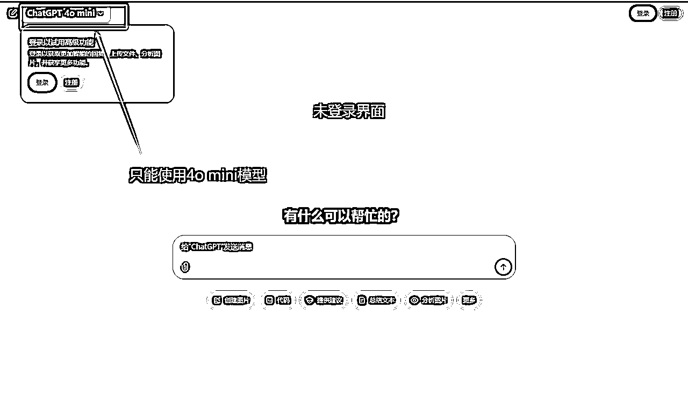
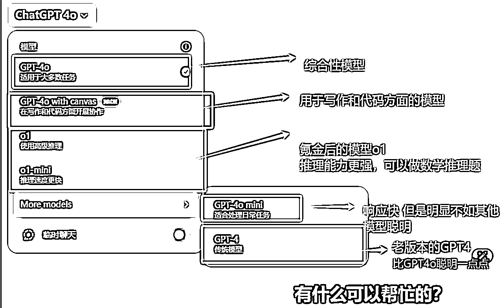

# 1_1_【科普】一文讲透ChatGPT入门科普【更新】

> 来源：[https://atbs4xk1uw.feishu.cn/docx/CiQxd7x43o0KT3xKfz6cj3vPnAe](https://atbs4xk1uw.feishu.cn/docx/CiQxd7x43o0KT3xKfz6cj3vPnAe)

版本号：v3.01

更新时间：2024.07.24

操作人员：

更新条目：

*   增加：文档信息

* * *

版本号：v5.02

更新时间：2024.12.12 03:21

操作人员：

更新条目：

*   增加：知识点列表

# 一、引言

## (一）效果小剧透

### 必修知识点：

1.  【认知】所有的“写文字”的AI，底层原理几乎都一样

1.  【认知】AI是对人类已有技能的放大，和对普通技能的低门槛快速入门

1.  【认知】大多数情况下，通过短期快速学习，达到拥有李四的能力【行业基础经验+AI】，能量产+打80分就够了

1.  【认知】如果想当行业大牛王五【打90分+量产】，需要持续深耕AI领域和垂类行业经验

1.  【认知】ChatGPT的核心原理是下一个字更大概率的出现，而不具备真正意义的上下文记忆

1.  【认知】ChatGPT情商低但是非常听话，你了解这个孩子的正确沟通方式，他可以帮助你高效的完成一切事情

1.  【认知】AI极具随机性，AI生成的内容可能是错误的

1.  【认知】GPT模型各版本对比

1.  【认知】GPT的长度限制

### 学习方法建议：

理解！理解！理解！

知识点在教程中以绿色背景标识，可重点关注

本教程分为必修模块和选修模块，【必修模块】必须全部掌握；【选修模块】直接跳过不影响全部教程最小闭环，学完全部必修教程后，有精力再回头补充选修部分

哈喽大家好，我是全网最接地气的AI实战教程博主，Cheese海盐，专为小白而生，专注打造全网最容易上手的AI实战教程

爆肝6k字，值得收藏，反复查阅

🚗只有干货，坐稳发车

* * *

## (二）升级打怪路线图

全局概览，心中有数

记得对照左侧目录层级，思路更清晰

* * *

# 二、必修模块（4小节）

这是一篇小白了解AI的科普贴~ 所有的“写文字”的AI，底层原理几乎都一样，为了对小白友好，本教程以ChatGPT这一个具体的AI为例，来讲解。你只需要知道，其他的AI，比如 claude、kimi、文心一言等，他们都是类似的，就好啦 -- 【知识点】

## (一）【科普1/4】AI认知

### 1 一句话总结AI的能力

AI是对人类已有技能的放大，和对普通技能的低门槛快速入门 -- 【知识点】

### 2 AI能力的局限性

把AI当做老师，和他对话，请教知识，无法让你在一个领域变成真正的大神

但AI可以在你原本升级打怪走向大神的路上，帮你增效提速。比如，在学习传统写作，当一个高质量写手时，用AI提效

AI只是能做一些原本人类就会做的，提取成了经验的任务而已

### 3 小白学了AI直接无敌？

PPT小白能用AI快速写高质量PPT吗？

PPT大神张三很牛，所以AI的开发者根据张三的经验训练出来了会写PPT的AI

试想，你的老板让你做一个高质量的PPT，你原本不会写PPT，现在就算你有了AI，但你没有大量PPT的实战经验，没有系统的知识，你根本不知道高质量PPT长什么样子！你拿到了AI软件，也做不出来高质量PPT

因为你连识别出什么样才是高质量PPT这个能力都没有

你更不知道如何才能调取出AI"脑子"里众多PPT中的高质量PPT，也就是说，你肯定不会调教AI

所以，就算有人能用AI生成高质量PPT，这也和你没一毛钱关系

### 4 谁学AI效用最大？

| 人物 | 技能1 | 技能2 | PPT效果得分 | PPT日产量 | 效用 |
| 张三 | 手工PPT大神 | 不会AI | 90分+ | 1个+ |  |
| 李四 | PPT基础 | 会AI | 80分+ | 10个+ | 短期提升最大 |
| 王五 | PPT大神 | 会AI | 90分+ | 10个+ | 直接封神 |
| 赵六 | PPT小白 | 会AI | 60分+ | 10个+ |  |

有PPT基础经验的人，用AI可能超越传统PPT大神？

如果PPT大神张三不会AI，虽然他是PPT大神，但是他可能1天只能做一篇高质量的PPT，人工来做，效率并不高

要知道，AI开发者已经把AI训练的可以做高质量PPT了（AI具备了大神张三的经验）

而只有PPT基础经验的你（你可识别出高质量PPT），只要学会了调教AI，让AI可以快速从AI知识库的海量PPT中调取出高质量PPT（你就直接具备了大神的经验），你1天就可以无脑输出10份高质量PPT。那你比大神张三就厉害多了

但是，如果遇到复杂问题，AI可能真的还没和大神张三学过，你又不会处理

那大神张三，拥有人类的创造力和复杂思考能力，至少还会手工解决。这时候，你是没办法和传统领域大神张三相比的，你解决不了这个问题

### 5 如何让AI效用最大？

一句话总结：学习行业基础经验+学习使用AI能力

大多数情况下，通过短期快速学习，达到拥有李四的能力【行业基础经验+AI】，能量产+打80分就够了，就可以让你工作和创业成绩持续走高，这就是大多数人学习AI，使用AI的目的 -- 【知识点】

如果想当行业大牛王五【打90分+量产】，需要持续深耕AI领域和垂类行业经验 -- 【知识点】

AI不会淘汰人类，会使用AI的人，可能会淘汰同行

* * *

## (二）【科普2/4】ChatGPT核心原理

这里意在使用一个ChatGPT的讲解，让大家了解所有文字内容生成式AI的原理，万变不离其宗，大家都差不太多~

### 1 ChatGPT到底是干啥的？

ChatGPT机器人的创造者OpenAI公司，预先给ChatGPT投喂了大量数据进行学习和模仿，互联网上你能看到的所有信息都可能被投喂给ChatGPT

当你问他问题的时候，它就像一个知晓天下事的小秘书，可以回答它知道的一切

### 2 ChatGPT主要功能

ChatGPT的主要功能是理解和生成人类语言 -- 【知识点】

ChatGPT可以在许多不同的场景中被应用，包括但不限于以下几种：

*   问答：

*   你可以向ChatGPT提问，它会根据它的训练数据来生成一个答案。例如，你可以问它一些关于科学、历史、文化等主题的问题，它会尽力给出一个准确的答案

*   文本生成：

*   你可以让ChatGPT帮你写一篇文章、故事、诗歌等。你只需要给出一个开头或者主题，ChatGPT就可以生成一段相应的文字

*   对话：

*   ChatGPT可以模拟人类的对话。这使得它可以被用在客服、教育、娱乐等领域，帮助人们进行模拟对话或者角色扮演

*   编程：

*   ChatGPT也可以理解编程语言，这意味着你可以向它提问一些编程相关的问题，或者让它帮你写代码

*   学习：

*   ChatGPT可以作为一个学习工具，帮助人们学习新的知识和技能。例如，你可以让它解释一个复杂的概念，或者帮你学习一门新的语言

以上只是ChatGPT能做的一些基本事情，当然，它的应用场景非常广泛，只要涉及到理解和生成人类语言的地方，都能用到ChatGPT

### 3 ChatGPT核心原理

ChatGPT并不具有人类的思维和逻辑，他无法知晓一篇文章中上下文真正的逻辑

而是从他脑子里的知识库中，通过一定的算法，猜测这个字的后边，更大概率会出现哪一个字，这样一个字接着一个字的生成一篇文章或一个回答给你

ChatGPT的核心原理是下一个字更大概率的出现，而不具备真正意义的上下文记忆。比如，它学习的知识库中有100篇文章中提到了“牙疼”，只有1篇文章提到了“牙痛”。当天输出给你内容的时候，先生成一个字“牙”，则要生成的下一个字更大概率是“疼”，而不是痛。也就是你和他对话的历史聊天记录它实际上并不真的理解，他是靠一定的算法来推算。所以，叫做伪上下文记忆。 -- 【知识点】

这个原理很重要，大家下场实践的时候，会感受到

* * *

## (三）【科普3/4】ChatGPT的不足【必修】

最最重要的原理你都知道啦，那ChatGPT的不足也就非常明显了

### 1 不具备真正逻辑思考

它并不具备人类复杂的生物脑结构，没有自己的思维

它就像一个学习了非常巨大的知识库的高智商的孩子，但是情商很低，给他下达一个简单的命令，他可能并get不到你心里真实想要什么

它无法向人类那样在复杂的场景中将已学会的各个领域的知识在脑海中快速检索、快速关联起来、融会贯通。需要你把一些方法论和样例告诉它，他才知道该怎么做

这个孩子会的唯一技能，就是通过你下达的指令，去调取相应的它学到的知识库中的文字内容，经过他自己的“大脑”处理后，将结果返回给你

所以，你给它下达的指令就尤为重要，ChatGPT情商低但是非常听话，你指令下达的好=就是对他调教的好=你了解这个孩子的正确沟通方式，他可以帮助你高效的完成一切事情，可能取代你80%的工作量 -- 【知识点】

### 2 AI幻觉

ChatGPT有时会给我们一种“AI幻觉”！它有时候会“编”一些答案出来。生成的内容并不总是100%准确的，有时候就是在“瞎掰”

这也是AI界目前重点在解决的AI最大弱点，导致了AI极具随机性，AI生成的内容可能是错误的 -- 【知识点】

但我们有多种方法来解决这个问题，在后续的ChatGPT调教教程中，会给大家展开说说

* * *

## (四）【科普4/4】掌握ChatGPT版本【必修】

单刀直入，直切主题，我们从小白首次打开gpt网站的角度去了解一下gpt官网当前能够使用的各种模型~

先看一下这个表简单了解一下现在的模型，其中最为常用的就是4o以及o1-mini这两个模型，下面也重点从【未登录】，【登录进去之后】，还有【氪金之后】三这种情况进行讲解。

在这之前先看一下目前官网主推的这几个版本对比总结表：

### 1 未登录

浏览器打开ChatGPT官网 chatgpt.com

可以看到免费版进去之后就会出现这样的一个界面，而免费版给我们提供到的模型分别是两种，一种是4o，另外一种则是4o-mini（4o的压缩版本，也就是阉割版）

先发起一个对话，简单了解一下具体的情况：

由这张图片可以引申出两个问题：a.为什么这个回答信息完全错误呢？b.GPT-4o跟4o-mini的差别在哪里？我们来依次回答这些问题。

第一个问题：为什么这个回答信息完全错误呢？

那是因为不管是4o模型还是4o-mini模型，他们最新的数据库都是截止到2023年10月，在当时的数据库中，还是他们的老前辈GPT3.5和GPT 4.0的天下！

而他们的回答是基于当初的训练结果来进行回答的，所以这里可以看出，不要把GPT当成一种搜索工具！因为他可能提供的信息不完全正确！

第二个问题　就是我们需要介绍的重点：

关于GPT 4o 与 4o-mini这两个版本的差别，其实从小白的角度理解，我们并不需要把他们复杂化

用很简单的话讲就是，GPT-4o就像是团队里的全能大哥，它不仅能处理文本，还能理解和生成图像、音频，甚至可以实时对这些信息进行推理。他的处理能力更加强大。而GPT-4o Mini呢？它更像是一个精干的小将，专注于文本和图像的理解与生成，头脑可能在某些方面不如大哥4o聪明。

从这个角度出发，我们可以得知，4o显然是最适合应用于语言输出和完成写作任务的模型，因为它可以完成一些复杂程度比较高的任务，而4omini也可以胜任这个任务，只不过相对于大哥4o而言，可能会逊色一点~

但是值得注意的是！如果你不氪金的话，那么你每三个小时只能使用4o模型10次，使用10次以上，将会自动变成4omini~

### 2 已登录

这个界面登陆进去是什么样的一个情况呢？是一个免费版的账号情况

它会先默认使用有使用限制的4o进行回答，等达到3小时10条的限制之后，就会强制你必须继续开通Plus才能继续使用4o，否则的话想要继续使用的话只能使用4o-mini模型

### 3 氪金版

如果你这时候要选择氪金的话 那么会有新的模型出现在你的眼前！

普通人用的会员ChatGPT Plus套餐，每个月20刀≈144元/月

但其实氪金后出现的模型其实并不会对我们正常的使用产生太大的影响

最大的影响应该是 对于o1和o1mini的使用次数比免费版的增多了，再者就是分配的算力会多一点，这东西具象化说明的话 就是 升级会员后，你觉得他会变聪明了！

### 4 GPT模型各版本对比

GPT4，比GPT4o更智能

o1是逻辑性、推理性更强的模型，类似于理科生

o1-mini，是o1的小弟，阉割版

o1系列和GPT4（及4o系列）区别：

GPT4和4o、4o-mini系列，是通用能力的大模型，文武双全，其中GPT4与4o不相上下，文武80+，而4omini更像是中等生，文武60-70分左右~

o1是推理能力强的理科生，数学90分，语文60分

### 5 AI写作推荐选ChatGPT模型的哪个版本？

小白刚上手，很长一段时间，常用gpt4o，足够

当需要写辞藻和逻辑都比较好的高端内容稿子，才需要付费会员的GPT4

当写逻辑性更强的，理科生推理思维的，才需要付费会员的o1

当然，你有预算的话，直接氪金，用高配，肯定更好~

当o1用量不足时，用o1-mini对付一下；gpt-4o用量不足时，用4o-mini对付一下

### 6 GPT的长度限制

#### 6.1 输入限制

这里以GPT-4o为例，大多数文字类AI模型都差不多~

GPT-4o模型的输入文本（提问）最大长度限制为8192个token，也就是说你和ChatGPT说话的时候，你一次性可以输入最多大约4000-5000个汉字。超过这个限制的输入将被截断或不完整的回答。--【知识点】

#### 6.2 输出限制

GPT-3.5模型的输出文本（回答）最大长度限制为8192个token，也就是说你和ChatGPT说话的时候，他一次性可以输出给你最多大约4000-5000个汉字。超过这个限制的输入将被截断或不完整的回答。--【知识点】

#### 6.3 上下文依赖限制

在进行文字接龙判断时，GPT不仅考虑用户最近提供的"提示"，还会将之前多轮对话中的"提示"和"回复"作为输入参考

GPT-4o模型的距离限制为8192个tokens，这相当于4000-5000汉字。也就是说，你和GPT对话时，如果你一次输入了2000个汉字给他，他最对能输出3000个汉字给你，一次输入输出加一起最多5000汉字。--【知识点】

另外，8192个tokens这个距离限制，也是ChatGPT的记忆空间限制。他的“脑容量”最多能够记忆5000个汉字，也就是你和他对话的上下文。当你和他对话多次，总汉字数量超过了5000字，他就开始失去最早的记忆了。

如果你和GPT本次所有对话上下文超出了5000汉字，GPT可能会忘掉最开始你和他说的话 -- 【知识点】

关于token，在下一章AI名词大科普时会讲，暂时先当做一个单词去理解。更多时候，一个token差不多是半个单词

* * *

# 三、选修模块（3小节）

## (一）【科普1/3】Claude版本

### 1 未登录

当你点开Claude网站 https://www.anthropic.com/claude

不登录的话，什么东西都用不了，必须有一个Claude账号才能使用

### 2 已登录

当你登陆进去之后，不氪金的情况下你只能使用Haiku这个免费版本

好消息就是他的算力还是比较强的，会比gpt中的40-mini 要强，仅仅逊色于4o的感觉~

### 3 氪金版

会员版，每月20美元，开通氪金的话，输入界面就可以切换模型进行输出

你会发现它会提供3.5 Sonnet和3 Opus和3 Haiku这几个模型（3.5 Sonnet和3 Opus是会员享受版本）

## (二）【科普2/3】Claude模型各版本对比

通过官方的网站数据，其实我们可以看出

开了会员的Claude 3.5 Sonnet是最牛逼的，最综合的模型，也是适合用来写作的模型之一

但是遗憾的是 他只能用于开通氪金后，才可以使用~ 文武双全80+ 的优等生

三小时限制80条，对于我们的日常使用来说，已经足够了哇

其次就是Claude 3 Opus，也是必须开通会员才可以使用的模型，相当于写作加强版的模型，在对于语言的处理上要比3.5 Sonnet 要强一些~ 文科尖子生 可以90+的文本处理能力 理科逻辑方面的处理能力比较差~

而跟gpt 4o 对标的模型就是 Haiku，同样是针对免费用户开放使用，输出效果上肯定是不如以上两种模型的，但是针对一些简单的稿件类型，质量要求不高的话同样可以得到满足~

文武双全 70分的水平~

## (三）【科普3/3】AI写作推荐选AI模型的哪个版本

Claude，我们AI写作，推荐选什么模型？

免费的Haiku可以体验一下~对于AI写作，不如GPT-4o模型

如果选择使用Claude，建议直接使用氪金的 Claude3.5 Sonnet版本~

总结一下：

AI写作比较建议1.ChatGPT-4o版本（免费）、2.ChatGPT会员版本的4o、o1、4这三个模型版本（如果资金有预算）、3.Claude会员版本的3.5 Sonnet模型版本（如果资金有预算）

* * *

# 四、总结

好啦，了解了这些内容，现在，你也算和AI混个脸熟啦，我们下期再见叭

From Cheese海盐芝士

* * *

哇，谢谢你的喜欢，耐心看到这里。恭喜你发现了一个宝藏博主~