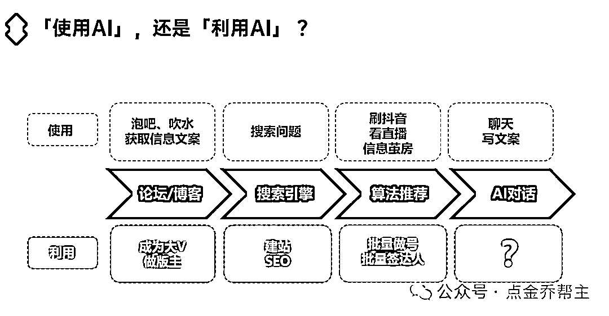

# 使用技术，还是利用技术？我的互联网成长和破局之道！

> 来源：[https://w91h2gmtrn.feishu.cn/docx/CmIldVALRo1J7Yxj3TPcCAiLnee](https://w91h2gmtrn.feishu.cn/docx/CmIldVALRo1J7Yxj3TPcCAiLnee)

读前说明：

1、本文3600字干货经验，内容较长，建议用电脑浏览器阅读更加高效。

2、欢迎圈友来链接和交流（联系方式见文末），赚钱路上一起同行、一起成长！

大家好，我是乔帮主，一个80后互联网技术老兵。作为88年的我，其实我不太想称自己为互联网老兵。还记得之前去线下参加一些线下活动，当时主持人介绍我的时候，称我为一个互联网技术老兵。

对如今市面上大多数的95后、00后个体创业者而言，我的确已经“老”了，所以你也不得不接受岁月留给你的标签，但同时这也是我价值优势所在。

我喜欢嘲讽自己为IT屌丝男，以前做技术总监的时候，更是嘲讽自己为领着一群屌丝的屌丝王。屌丝在很多人看来觉得是一个贬义词，在我看来任何事物都有两面性。

作为曾经互联网从业者，到如今的互联网创业者。要勇于自嘲，勇于面对自身缺点、努力表现自己的优点。只有正视自己，找准位置，才能实现自身价值。

在最近一段时间的AI技术的实践应用中，感受颇深。让我对技术的理解又上了一个台阶，我们到底是使用技术，还是利用技术？结合我在互联网上一些成长经历，来跟大家分享我在这方面的一些心得体会。

# 1、虽然见证了互联网的发展，但错过了很多次让钱包崛起的机会

从初中开始接触互联网，那时候我还用着windows 98打着星际争霸。那时候我宁愿骑1个小时自行车，只为赶到镇里网吧聊个QQ，只因那时候的网恋还很美好。

我算是见证过中国的互联网的发展，在1998年~2004年互联网早期，怀着对技术强烈的热爱和好奇探索心，没事就喜欢用灰鸽子盗盗密码，没事就喜欢用SQL注入搞搞网站。

那时候的互联网还很单纯，没有如今的这么复杂。互联网早期的黑客，也没那么神秘，只是那时候互联网安全还不够完善，然后接触了一些工具，用了大家一些信息差的工具，做了一些超出大家认知范围外的事情。

其实本质来说，就是一些工具技术的使用。那时候使用技术工具，盗取QQ密码、游戏账号密码、网站后台权限非常简单和容易。那时候也是单纯的爱好和炫耀，也更没想到还有其他商业可能。

2005年~2011年，PC电脑的发展，这时候主要是门户网站和博客的发展，微博也是在这期间开始崛起的。你很难想象，作为一个互联网技术人员，到如今我都没怎么刷过微博。

在PC时代，除了热衷打星际争霸、魔兽争霸及后来的DOTA，我还有一件事就是喜欢挂QQ，这都是青春的记忆。

2012年~至今，随着2009年开始推广3G网络，移动互联网接替PC互联网，进入移动互联网时代，每个国人几乎人均一个手机。

随着“朋友圈”的推出，微信开始得到普及，如今几乎每个国人手机中都有微信。但你很难想象，作为一个互联网技术人员，我从2015年才真正开始使用微信（以前都电脑不离手挂QQ）。

随着4G网络的推广，迎来短视频浪潮。你很难想象，作为一个互联网技术人员，我从2019年才开始使用抖音。

随着5G网络的推广和普及，如今的人工智能也在高速发展，未来互联网有更多的可能。

也许是作为技术人独有的孤傲，面对互联网的浪潮，连一些产品和技术在使用维度都让我提不起兴趣，反而让我变得呆滞、迟缓......

虽然我很早接触互联网技术，但也仅仅只是停留在使用这门技术的维度。也让我错过了很多互联网红利，很多互联网赚钱的机会。虽然见证了互联网技术的发展，但的确真的也让我错过了很多次让钱包崛起的机会。

# 2、曾经做着离技术最近的事情，却是距离赚钱最遥远的事情

虽然相比一般人，我们IT技术人员（有做硬件的、有做软件的、有做网络的等）可能最接近互联网，但往往仅停留在技术使用层面。

专注在自己技术岗位，使用岗位技能、技术，一直重复着干些使用技术的活，这也是我们IT技术人的行业状态：一群背着笔记本的农民工！

那为什么会这样呢？这跟每个行业的枷锁有关，每个行业都有对应的优势，同样也有对应的缺点，同样每个行业也都有着你不得不妥协的“潜规则”。

从心态上，这跟做技术人员身上有天生的一种孤傲有关。每个IT人都有个黑客梦，都梦想着登上那技术的高峰。喜欢越是牛逼的技术越能证明自己，对简单的技术不屑一顾。

对谁写的代码都不服（看谁的代码都像写的一坨屎），就服自己写的（就看得懂自己写的代码哈哈）。我们只关注技术使用维度，除非你在这些技术使用上比我玩的6，其他的说再多也是扯淡。

从能力上，大多数技术人员是井底之蛙，守着自己的一亩三分地，活在0和1逻辑世界中，受不了花里胡哨。没有做销售的能说会道、没有做运营的人洞察人性、没有做管理者的人情世故，更是没有做老板的商业认知。有的自认为自己有着造宇宙飞船的牛逼技术，然后并没啥卵用。因为我曾经也是这样，所以感同身受。

从认知上，回归商业角度、回归老板角度，越是简单的技术、越是简单的东西往往越赚钱。重要的是，能抓住互联网时代机会，站在商业角度，利用自己的资源优势、利用互联网或者利用互联网技术，知道怎么引流获客，知道怎么去变现。

所以本质上，我们技术人员对技术是停留在技术的使用层面，想的更多的是技术使用深度。而赚钱角度，我们对技术是利用层面，更多思考的技术创造价值，服务用户。

我们这一群做着互联网技术的人，也许我们最懂互联网技术的使用，但往往却没有利用好互联网为我们赚钱变现。在技术人员眼中的互联网，也许就是0和1。而在不同人眼中的互联网，也许就是不同的商机。

# 3、有流量的地方，就是互联网江湖

我错过了利用黑客技术实现财务自由的很多机会，自从2017年颁布了网络安全法后。如今想用这些敏感的技术赚钱，如同在刀尖上舔血。

QQ流行的时候，我错过了做QQ群、做QQ空间很多引流搞钱的机会。在站长、博客的时代，我也错过了做网站、做SEO引流搞钱的机会。微博盛行的时候，我也错过了微博引流赚钱的机会。

到了移动互联网，我也错过了做APP的红利。然后到微信普及的时候，我也错过了公众号和小程序的红利。

如今的互联网的赚钱机会在哪里？我觉得一方面，是新技术的出现，比如AI绝对是普通人逆袭的一次机会。如果这次错过了AI，你不仅错过了一项技术，而是错失了一个时代。

另外一方面，就是互联网的流量在什么地方，就是我们赚钱的机会。现在互联网流量都在微信、抖音、小红书、B站上。所以公众号、小程序、短视频、直播等依然是赚钱的项目赛道，然后结合AI机会，将更具潜力。

而且今年，我们将看到一件有意思的事情，万事万物都要结合AI了。在这个时候，我们更多要思考的是，不仅只是如何使用AI，而更多的是怎么利用AI？这也是我最近感悟最深的一句话，在我AI付费课及很多线下聚会活动中经常说的一句话。

我之前做社交APP的时候，那时候在Boss直聘上开始招运营人员，面试过好多刚毕业的大学生。好多大学生在校期间就开始做自媒体、新媒体开始赚钱。

我不禁感叹，想当初我那时候读大学，想要赚钱，想要创业，还得去装修办公室、去招人、去注册公司等。想要赚钱，感觉是多么遥远的一件事。

而如今，个体创业正在逐步取代公司创业，个体创业也将成为年轻一代创业的主流。一个笔记本、一部手机就能干一番事业。站在互联网这个巨人的肩膀上，站在AI技术这个巨人的肩膀上，赚钱将变得容易。

# 4、学会跨界+降维，才是破局之道

作为互联网技术从业者，我们要明白自己的优势、明白的自己的缺点，从而才能真正发挥自身价值。作为草根出身的我，没啥学历、英语能力也很差。在多年前我就深知，仅走IT技术这条道，就如同一条一维的水平直线。

要在这条直线上，100分的满分，你想达到80分应该不算太难。但是你想达到90分以上，真的太难了。相比较BAT那些技术大牛，你就知道差距了。比如华为年薪两百万招的“天才少年”，最后都是拼的学历、拼智力，真的太难了。

但是当你“跨界”，在多个领域施展的时候。这时候一维直线就变成二维平面、三维空间，甚至四维、五维、六维...等等。比如在技术领域我只需要达到60-70分及格，但我在运营领域也只需要达到60-70分及格。

也许你在一个领域很难达到90分以上，但两个领域结合，哪怕你在某一领域只能及格，但是60×60也有3600分了。所以这就是跨界的魅力，让机会和未来成为无限可能。

如果你不局限两个领域，有多个领域的时候，比如管理、技术、运营、创业等多个行业，那就可能是？× ？× ？× ？= 你的优势。所以作为典型的斜杠青年，我一直尝试多个领域提高自身能力，这是我在IT行业里面为什么能成长这么快的本质原因。

同时，通过跨界也是本质在解决作为IT人员的心态、能力和认知仅局限在技术层面的问题。只有这样，我们才会跳出技术的魔咒，才会明白怎么利用技术、怎么利用自身优势、怎么利用互联网去搞钱。

所以如今我跳出技术圈，聚焦在创业领域，选择AI赛道去放大自身价值。结合我曾经的积累的经验，利用AI技术在职场赋能、在内容营销、AI编程等为大家创造价值。成就他人，才能成就自己！因为利他便是利己！这是我的破局之道，也将会是大家破局之道！

微信：qiaobangzhu-cn，添加请备注：生财圈友。欢迎交流！

公众号：点金乔帮主

