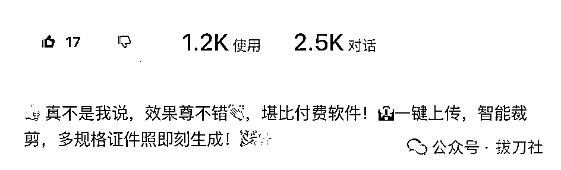
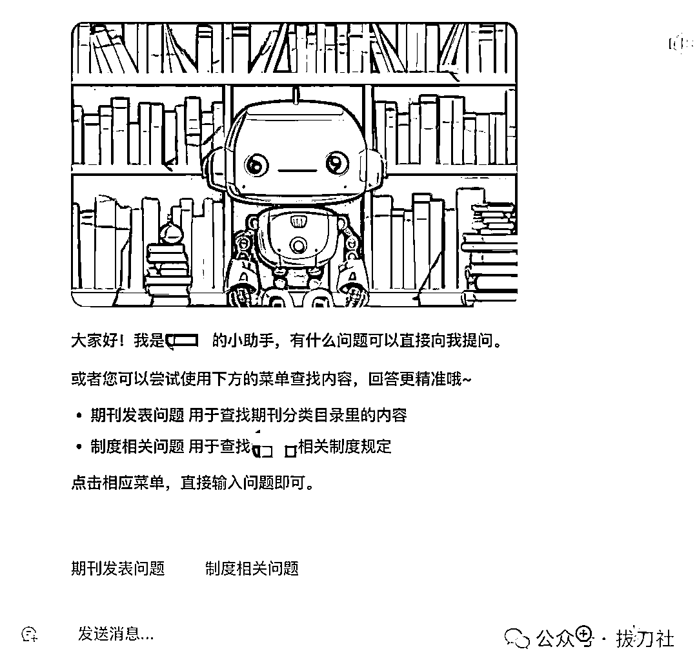
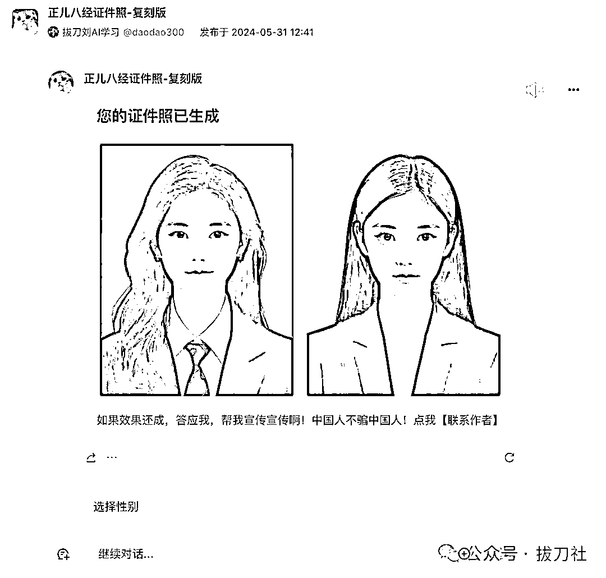

# 我做的Agent智能体上了Coze扣子官方推荐之后……

> 来源：[https://v0bko2tq65.feishu.cn/docx/DTfpdgMuroYuYKxRvR1chu6Xnzb](https://v0bko2tq65.feishu.cn/docx/DTfpdgMuroYuYKxRvR1chu6Xnzb)

跟各位汇报一下，我之前做的Agent智能体，用来做证件照的，上了Coze/扣子官方的焦点图推荐，特别有排面，咩哈哈哈……

喏，就是这个——正儿八经证件照。上传自己的照片，就可以快速生成专属证件照，有多种样式可以选择，制作心得可以看一下我上一篇文章《Coze/扣子新出的图像流功能，有点惊艳到了！》

在上一版基础上又增加了很多模板，给你们看下最终效果：

怎么样？效果还成吧。有多个模板可以选择，男女都能用。已经吸引1200+用户，使用了2500+次，我骄傲~

但是咱们今天想说的并不是这个，通过这段时间对于Agent智能体的学习，我有三点很深的感受：

## 1、Agent引领AI进入v1.5时代

如果把ChatGPT的出现算作AI1.0的话，那么现在通过大模型制作的智能体，无疑已经进入1.5时代。

Agent智能体比大模型到底强在哪呢？我认为主要有两点：

1、能力更强：借助插件提升大模型能力边界

2、善于处理复杂任务：借助工作流完成复杂任务，提高稳定度

咱们挨个聊，先说插件，如果把大模型比作大脑的话，插件就是手。原来好多事儿你只能脑嗨一下，现在可以直接上手了。

大模型没办法直接生成PPT文件，有了插件就可以；大模型没办法计算复杂数学问题，有了插件就可以；大模型没办法直接帮你定机票，但是未来一定可以通过插件来实现。

再来说工作流，就是控制Agent先干啥，再干啥，最后输出啥。你肯定听过一个词“AI数字员工”，原来听起来挺玄妙的，其实用工作流就能实现。

做过管理的人都知道，人这个东西是最难管理的，但是数字员工，不闹情绪、不知疲倦、不会请假、不发工资，这里头的价值DDDD。

比如说我们现在想完成一项工作，就是把抖音里的视频转成文字，然后再转成小红书的内容。

传统的工作中呢，我们需要先借助第三方工具，把抖音的视频先转化成文本，因为大模型没有直接读取视频的能力。

然后我们再copy这些文本，配上提示词，交给大模型，让他帮我们改写一篇小红书风格的文案。

如果老板一天要求你需要转写10篇文章，你就要不断的去重复这个动作。

但是智能体可以帮你一键搞定，你只需要输入抖音的视频链接，智能体就可以通过工作流的形式调用插件，将视频的内容转化成文本，然后再调用大模型模块，将视频的文本内容改写成小红书的文案，甚至可以同时帮你制作一张小红书的配图。

完成这一系列动作，仅仅需要一步！你不再重复写提示词，重复copy文案，重复性的SOP，靠Agent一键解决。

这就是智能体的价值。

## 2、智能体的技术溢出效应

离AI行业最近的，应该算是互联网行业了，很多大厂已经开始大规模使用AI工具来提升工作效率了。

但实际AI的技术溢出效应明显，几乎所有行业都可以被AI赋能，这才是AI被很多人看做新一代工业革命的原因。

比如我最近正在帮一所双一流的大学，制作一个问答机器人。可以根据学校的规章制度、公告内容，来解答老师和同学的问题，全校有1000多名老师，几万名学生，之前都是几名老师来负责答疑，每天都陷入到重复的工作中，同一个问题可能会被问及几十上百遍。

人肯定是崩溃的，用户体验肯定也不好，还浪费人力资源。

但是通过搭建一个知识库的智能体，把所有学校制度喂给它，它就可以不知疲倦的24小时解答用户问题了，效率高、成本低。

像这样的客服机器人，几乎每个企业都需要。 而实现这一切，其实并没有那么难。（保密原因，这个机器人无法分享）

所以在我看来，智能体的最大价值，还并不是来解决像做证件照这种通用化需求的。最大的价值，是用来赋能我们工作生活中，那些个性化应用场景的。

## 3、在实践中学习成长才最快

那制作证件照这样的智能体就没有意义了吗？其实也不是，通过制作这个智能体，我快速学会了图像流的应用，以及如何通过快捷指令让结果更可控，幸运的被官方做了推荐，进而认识了更多志同道合的新朋友，通过他们的反馈和帮助，我又优化了版本，熟悉了更多的功能，通过卡片让输出结果更友好（如下图），提升了智能体的体验，又能吸引更多的朋友找我链接。

如此这般，就进入到了一个快速、正向的学习循环当中，在实践中学习，可比读官方的操作文档带劲多了。

往期作品：

告别手写Prompt！一句话自动生成6个结构化提示词，附工具地址。免！费！用！