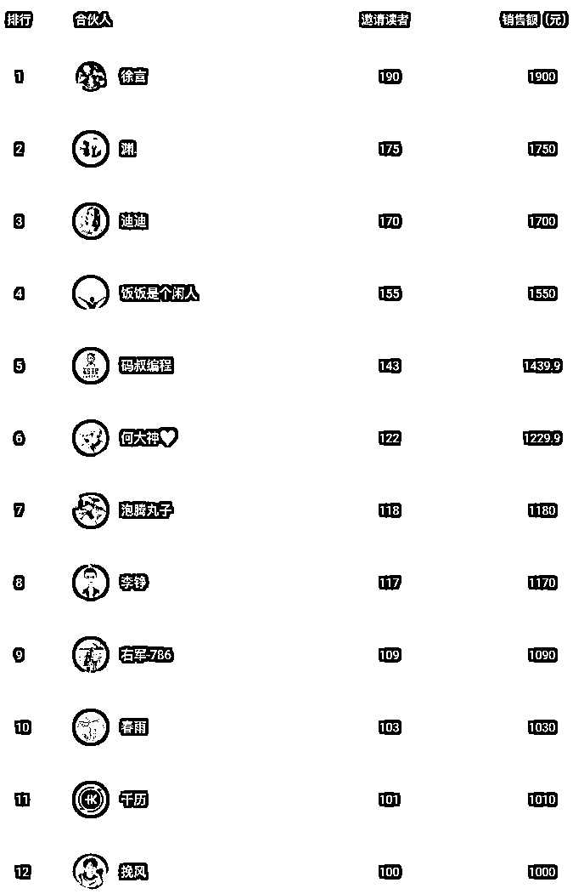
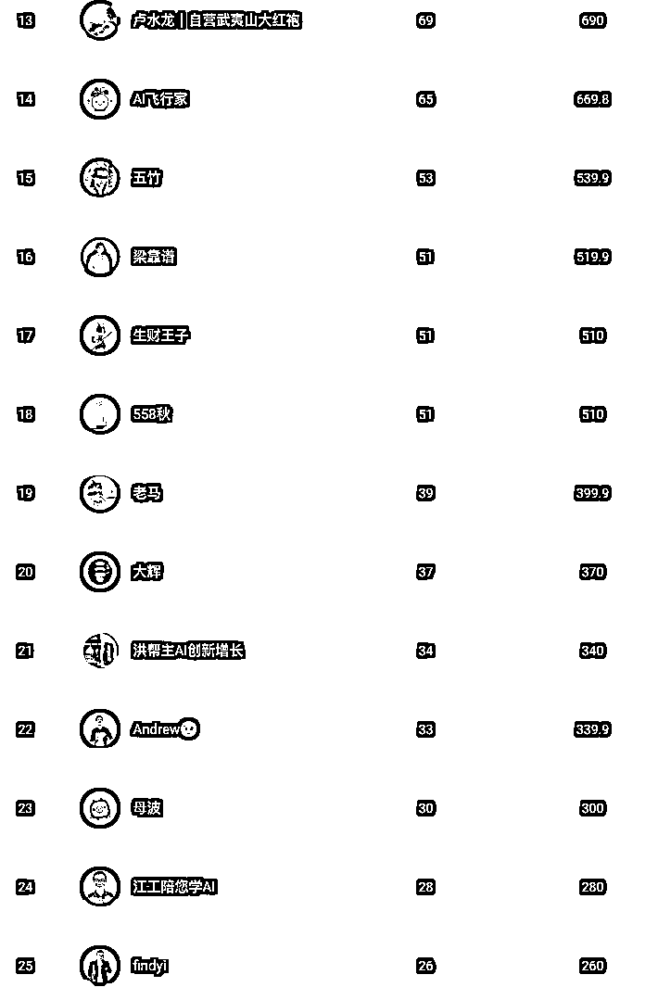
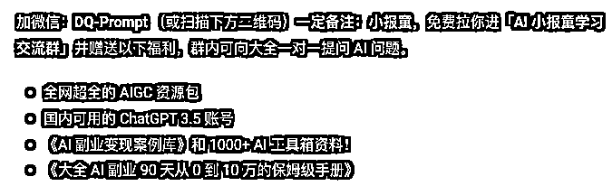
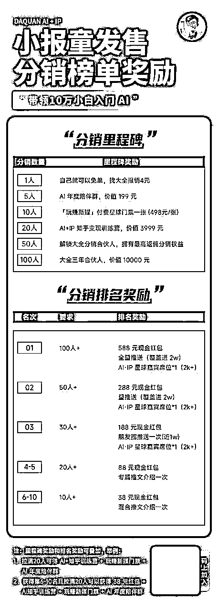
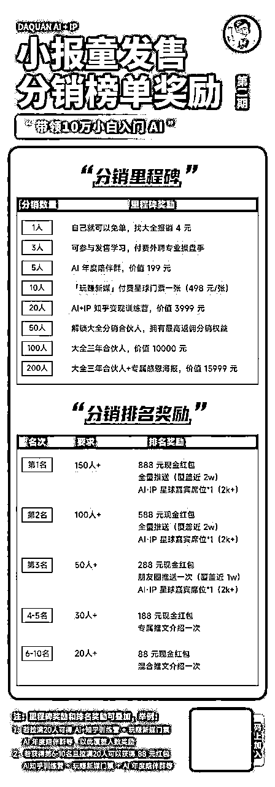
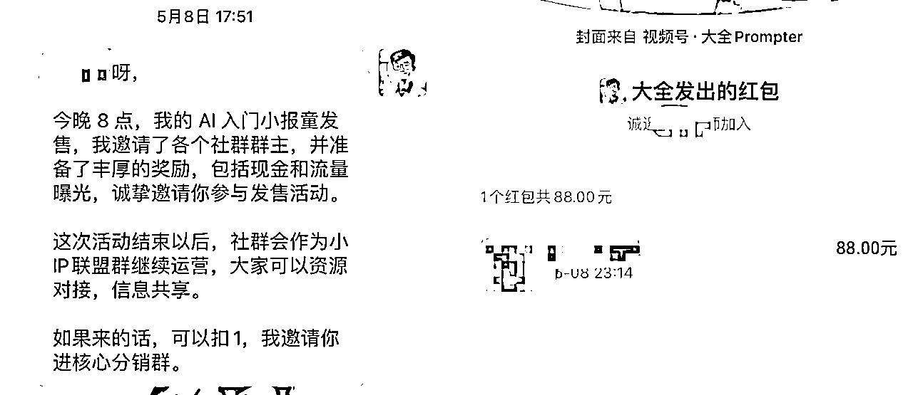

# 订阅 3500+，GMV 近 10 万的小报童发售复盘

> 来源：[https://eqsdsj0h4eo.feishu.cn/docx/DqOBdxYfOowFxkxZmOzcUT9gnxf](https://eqsdsj0h4eo.feishu.cn/docx/DqOBdxYfOowFxkxZmOzcUT9gnxf)

大家好，我是大全，90 后宝爸，BAT 大厂架构师，AI 万人航海教练，入局 AI 90 天到月入 10 万 AI 自媒体博主，全网 3 万粉，付费用户 5000+，半年内副业变现近 40 万。

5 月中旬，做了一场小报童发售，两周多订阅人数突破 3500+，GMV 将近 10 万，目前小册还在猛增，今天我就把这个过程复盘一下。

复盘前先说一下，就是小册一定是引流品，不是为了赚钱，所以打榜期间 10 元为主，重在后端的高阶产品承接，但是整个发售阶段，也不能亏钱，把握好尺度。

小册还有一个目的是扩大自己的知名度，有很多小伙伴认识我，就是因为这次小册发售，而且发售小册，一次要把所有的资源全部用上，一定要一次把流量击穿。

对了，这里特别要感谢这次我的幕后操盘手，水龙老师，把握了我整个发售的关键节点，而且还帮忙出来很多的物料，否则也无法取得这次 3500+订阅的成绩。

通过这个小册复盘你将收获什么？

1、如何设计爆款小册？

2、小册如何定位？

3、小册如何发售？

# 一、小册发售数据

1、小报童订阅 3500+，整体 GMV 近 10万，成交 10 个 3999 元合伙人。

2、超过 239 人参与分销小报童，持续两周在朋友圈刷屏，提高个人 IP 知名度。

1、 50 人卖出了 10 份+小报童。

2、12 人卖出了 100 份+小报童。

3、获得超过 2000 付费私域流量，创建了 4 个小报童陪伴群。

# 二、整体发售时间节点

## 一）时间节点

1 月 15 日， AI 破局审核通过，排队待发售中。

1 月 15 号 - 5 月 4 号 3 个月小册自己推销售 500+。

5 月 2 日 ，22:13 分决定找水龙预约小册发售事宜，并创建分销 KOL 群，合伙人内部先抢跑

5 月 6 日，和水龙电话沟通小册发售，并邀请水龙操盘。

5 月 7 日，设计大红包打榜奖励机制，做到一次击穿

5 月 8 日，内测开始，并每天邀请 50 个 KOL 入群，建立了 150 人的分销群

5 月 8 日，找徐言， 洋哥，右军，朱胜，生财王子，江工等，我付费的合伙人大咖，预约社群和朋友圈宣传

5 月 8 日，下午正式邀请洋哥，右军，饭饭，码叔嘉宾入群，开始以大红包的形式开启内测发售。

5 月 13 日，内测发售结束，订阅量破 2000 份，颁发第一阶段奖品。

5 月 14 日，正式发售准备，持续每天邀请50 KOL 入群，水龙也帮忙邀请了50 KOL， 最终建立 305 人分销群。

5 月 15 日，正式开始发售，并邀请，靠谱，老马嘉宾入群，开始以大红包的形式开启正式发售。

## 二）订阅增量情况

1.  5 月 9 日，内测销售第 1 天，订阅破 1000 份

1.  5 月10 日，内测销售第 2 天，订阅破 1300 份

1.  5 月11 日，内测销售第 3 天，订阅破 1500 份

1.  5 月12 日，内测销售第 4 天，订阅破 1600 份

1.  5 月13 日，内测销售第 5 天，订阅破 2000 份

1.  5 月16 日，正式销售第 1 天，订阅破 2300 份

1.  5 月17 日，正式销售第 2 天，订阅破 2600 份

1.  5 月18 日，正式销售第 3 天，订阅破 2700 份

1.  5 月19 日，正式销售第 4 天，订阅破 2800 份

1.  5 月20 日，正式销售第 5 天，订阅破 2900 份

1.  5 月21 日，正式销售第 6 天，订阅破 3000 份

1.  5 月22 日，正式销售第 7 天，订阅破 3500 份

# 三、整体发售关键节点复盘

### 一）发售前小册准备

#### 1、小册名字

目前发现容易吸引用户的小册，都是针对小白入群，而且还有就是对于有变现能力的小册，尤为受欢迎，所以小册名字叫“xx 入门到变现”，是一个比较好的名字。

还有名字中不要有太多让人难懂的概念，比如我最开始叫 “AI 提示词”，后来发现好多小伙伴连提示词是啥都不知道，就更加不可能购买你的小册了。

#### 2、准备好钩子

小册的目的是为了引流到私域，那么就不是为了赚钱，所以钩子一定要留好，而且要针对自己的小册目标人群留钩子，这样更加容易吸引用户加好友。

我们来看看我的 AI 入门的小册钩子：

我为什么有这些福利呢，第一学 AI 的小伙伴，第一需要的就是工具，而且国内使用 GPT3.5 非常难，所有我这里赠送，就有很多小伙伴急需，而且就算是这个账号的价值也值小册 10 元的成本啦。

还有就是发售期间，单独发一个钩子的文章置顶，这样转化效率会高很多，钩子文章里面只有赠送的内容，以及留两个微信号，因为发售期间加的人特别多，一个微信很容易被限制加入。

#### 3、准备好分销 SOP

发售前还有一个非常重要的时间，就是你的分销 SOP，里面讲清楚你的专栏做什么的，大家如何分销，这里需要详细的操作步骤，因为很多小伙伴都没有接触过小报童，

还有就是最重要的分销话术，包括内容思维导图，别人认可你小册的截图，最后就是分销话术，话术尽可能的简洁，一次只说一个痛点，如果说的太多，反而用户无法抓住重点，最终放弃购买。

分销 SOP 如下，可参考： （已打马赛克）

#### 4、准备打榜海报

我这里因为有一个内测海报和正式发售海报，所以有两张：

大家看我的打榜海报，可以看到一些小技巧，这里简单说下。

##### 1）把分销里程碑以及分销排名奖励分开

这样的好处是，可以刺激更多人参与打榜，因为如果只有分销排名奖励，那么最多只有 10 个人获得，但是分销里程碑就不一样，只要你分销数量达到了，就可以领取，理论上是不限制人数的。

##### 2）里程碑奖励设计技巧：

1.  里程碑奖励主要以虚拟产品为主。

1.  里程碑设置需要两倍往上叠加，幅度不要太大。

1.  需要有新用户一单报销裂变，这样订阅的用户有冲动分销，我这里有很多分销一点的用户，就是这个作用。

1.  舍得付出，产品要足够吸引人，比如我的年度陪伴群，知乎训练营，甚至价值万元的三年合伙人产品。最终打榜会发现，很多的小伙伴都是冲着这几个产品来分销的，特别是我的三年合伙人，有 12 个小伙伴达标分销了 100+，这也是整个小报童打榜史上最罕见的现象。

1.  里程碑奖励可叠加，即等级高的奖励，默认包含等级低的奖品。

##### 3）分销奖励排名设计：

1.  这里主要是现金奖励为主，还有就是曝光和荣誉。

1.  奖金按照每 10 人对应 50 元奖金参考，可参考吉利奖金：888,588.288,188,88

1.  名词排名一定要有人数要求，否则最终小报童收入无法支撑奖金。

1.  奖金可设置阶梯奖励，阶梯奖励的话，各个阶段金额设置可少一些，如果预计可分销 5000 以上的，可以加大奖励。

#### 5、发售软文

需要提前几天准备推广软文，这个软文可以发到公众号，也可以用到最后的社群分享，软文包括自己的成长经历，入局 Ai 自媒体心理路程，以及为什么写这个小册，小册的价值等等。

这里有一个小技巧，就是软文可以分为两种结尾，一种是正常结尾，这样就是一个 IP 文章，还有一个就是小册推广结尾，这样就是软文，这样的好处，在于有些群主接受软文，有些则不太能接受。

软文如下，大家可以跳转查看： （已经打马赛克）

#### 6、邀请 KOL

##### 1）成员组成：

1.  翻看自己的通讯录，找自己要好的朋友

1.  自己的合伙人群以及陪伴群

1.  其他打榜期间认识的分销能力强的 KOL

1.  自己付费加入群的群主，已经付费加入合伙人中销售能力强的。

##### 2）邀请技巧

其实主要就是私聊一个一个邀请，不要怕麻烦，这样把诚意拉满，邀请的时候，直接表明你的目的，你的小册，以及打榜和各种福利，让对方一目了然。

邀约小技巧：

1、就是主动给对方报销小册，这样让对方至少了解你的小册，认可之后，才会用心推荐。

2、对于你比较看重的 KOL，觉得不好邀请，则可以发一个 88 元的大红包，来邀请，要懂得人情世故，这样大佬也更加愿意帮你。

##### 3）欢迎语

每邀请一位 KOL，都需要有欢迎语，这样给到对方被重视的感觉，从而会更加认真的分销，对于一些稍有名气的小伙伴，可以加一些 KOL 的介绍在里面，当你的贵人来啦，则需要更加的隆重一些，讲讲贵人对你的帮助等和大红包。

#### 7、邀约嘉宾

发售提前一周和助阵嘉宾讨论发售细节，尝试获得资源，包括朋友圈以及社群分享，社群分享内容就是之前准备阶段的软文即可。

分享阶段尽量保证每天都有安排，包括周末，做到一个持续性，我一天最多的一次分享了 9 个群，还是比较累的，后来因为太忙，借助了我的合伙人小楠制作的群分享 RPA，倒是减轻了不少任务，当然最重要的一些嘉宾的群，还是使用手动分享最好，以免出岔子。

说到 RPA，我再说一点，就是这次小报童，每天有几百个用户来加我，如果手动处理的话，就非常耗时间，好在这次也有我的合伙人小楠的 RPA，他帮我制作了一个自动加好友、打招呼并且拉群的机器人，非常好用，也推荐给大家来使用。

发售当天可邀约嘉宾进入，增强士气，记住贵人不可贱用，在你邀请满 200 KOL左右，准备开始发售的时候，才邀请加入，并要热烈欢迎，发大红包。

邀请嘉宾还有一个好处是，可以让群里其他小伙伴更加认可你，因为很多人都和你不熟悉，但是有大佬坐镇，他们也会更加的卖力打榜，这样可以有更多在大佬面前曝光展示的机会。

### 二）发售中小技巧

#### 1、活动预热

就是在发售前一天，可以进行预热说最近要搞大事情，吊大家的胃口，预热的效果比直接发的效果好很多。

我的文案参考（参考水龙老师）：

最近，大全会搞一个个人大事件活动。

参与的朋友一定能赚不少钱。

感兴趣的，点个赞或扣 1，我私信你。

#### 2、每天收集发售素材

发售期间可以搜索朋友圈文案，好的文案可以给一定的红包奖励，这样激发大家写文案的积极性，因为用户视角写的文案，更加容易产生共鸣。

而且每天及时收集好的文案，汇总到飞书文档，或者群聊天记录，方便大家查阅最新文案。

#### 3、带头发朋友圈

打榜期间每天带头发朋友圈内容，发的内容参考如下：

1.  分销小册文案，每天带头发文案。

1.  晒分销群进来的大佬。

1.  晒小册里程碑订单数。

1.  晒小册中写的内容。

1.  发个人IP成长经历内容。

1.  发大佬帮你推文的截图宣传。

#### 4、阶段性奖金

这里可以设置小册分销里程碑奖励，比如 1000，1500，2000 订阅等，到了 1000 可以给订阅者 88 元红包，给邀请人 66 元红包。

这样可以在接近里程碑数的时候，激发小伙伴的发圈的动力，不过也无法避免的有投机取巧的用户。

#### 5、报喜

在获得里程碑订阅的时候，比如 1000,1500等，可以去一些合伙人群里报喜，这样再次扩大自己的势能，让更多的人知道你的这次发售活动，从而参与进来，特别是大 IP 会在特定的节点，助你一波。

报喜注意事项，需要有自己的复盘内容，取得这个成绩的心得，让别人看到之后会有收获。

#### 6、激活陪伴群

在有小伙伴加你的时候，就可以快速建立陪伴群了，而且需要激活陪伴群，让新来的小伙伴成为你的分销小伙伴。

我这里其实就有大量分销一单用户，就是这个的效果，而且我还有一些意外收获发现新的销售强的，直接分销 50 多单的。

还有一个技巧就是，返现的 4 元，最好是在群里进行，这样大家看到这个返现，更有分销的冲动。

我的文案参考：

欢迎各位 来到大全小报童交流群[庆祝]，群公告领取福利。

❗小报童目前在发售期，欢迎参与分销，CPS为60%，分销首单额外补贴4元，可以加入分销核心群～

为大家提供分销流程和素材： （已经打马赛克）

#### 7、榜单公布

这一点需要注意，榜单公布需要技巧，就是一般前几天不要公布，让大家只有冲榜，过两天可以给 3-20 名的榜单，前 3 不要给，因为这样会给后面小伙伴压力，让他们放弃冲榜。

在打榜快结束的 1-2 天，这可以把公开完整榜单，让大家自由冲榜，最后两天一般都是大家疯狂冲榜的时间。

还有一个小技巧，就是要去不断提醒一些小伙伴，比如哪些人还有多少单可以获得什么奖励，可以私聊，也可以群内艾特对应小伙伴。

还可以激榜，就是可以说谁谁快要超过谁谁的，打榜快结束的时候，非常有效果，这样可以让两位同时冲榜，会有奇效。

# 四、总结

最后再说几点关于小报童产品的思考。

1.  小 IP 最适合的产品，通过 60% 佣金，可以达到快速的裂变，快速扩大影响力。

1.  小册内容一定要超价值交付，保持必要的更新频率，并交付好小册交流群。

1.  需要有自己的三阶/ 四阶产品体系，10 元小册是非常好的宣传产品，快速积累认可的付费用户。

这次小报童发售，其实有很多不敢想的，比如水龙最开始给我订的 3000 的订阅，我说不可能，他们最厉害的也才刚过 4000，我怎么可能到 3000 啊，结果最终全力以赴之下，做到了 3500+的订阅。

最开始水龙让我邀请 300的 kol，我也在想怎么可能，邀请 100 个人，都够呛，结果经过两周每天不懈努力邀请，最终做到了 306 位 kol。

本来想着最终有 1000 加我微信就好了，结果到最后将近 2000 的小伙伴加我的微信，转化率达到了 60% 左右。

大全其实打造 IP，这一路经历非常多的第一次，第一次公开课，第一次群发售，第一次视频直播发产品，第一次浪潮式发售小册，好多好多的第一次。

但坚定了 IP 之路，有些事情必须去做，即使再难，慢慢的我发现，真正的敌人是内心的恐惧和犹豫，只要你坚持做自己，会遇到越来越多的惊喜。