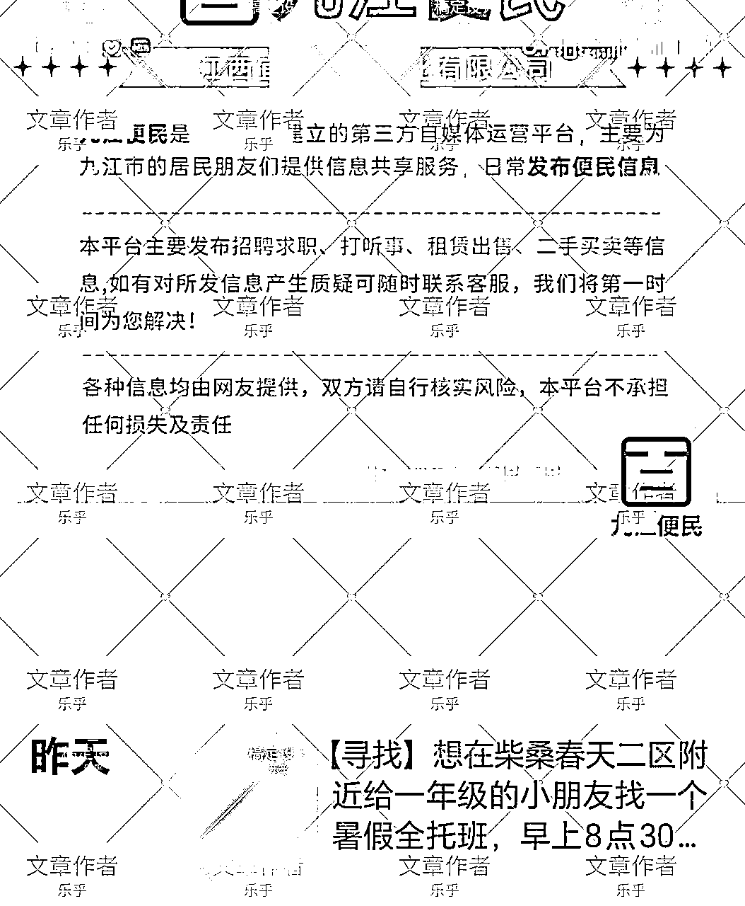

# 做一个城市圈主，普通人也能副业月入过万

> 来源：[https://hx0exm7xfp9.feishu.cn/docx/DuqXdrtAxoBvUTxZSxPc0J42nRL](https://hx0exm7xfp9.feishu.cn/docx/DuqXdrtAxoBvUTxZSxPc0J42nRL)

现在的圈子文化/社群文化非常盛行，做一个活跃，有信任度的圈子，能够极大地实现个人的时间自由和工作自由。比如做学校里的校园墙，大量社群的群主。

今天要分享的，也是这种情况，但它可能可以帮一大批普通人，实现财务/经济收入。做的方法也很简单，有执行力➕有热心就可以了，内向的人更好。

一，发现商机

我从学校里毕业后，依然在承担着学校里最大墙的运营工作。同时，寻找更多的变现渠道和提升收入的方法。

我加入了很多全国校园墙群，校园自媒体创业群，大家对毕业后运营一个校园墙的前景，并不看好。同时，机缘巧合之下，我在一年前关注了下面这个墙号。刚开始我并不觉得它能做起来。

现在这个墙，每天投稿有100条左右，主理人并不会很忙，广告达到了15条左右。一条广告收取50元，每天平均收入在500元以上。而且你要知道，做这个事情，可以一遍喝着水果茶，一遍看着电影做，这个简直是很多人梦寐以求的工作了！

这样的便民微信号（墙墙），每天的工作就是转发好友来稿和商家朋友圈推广。日常投稿，免费；服务好居民，取得好口碑。广告一条50～300元，招兼职一条50～120元。在一些城市核心区域，粉丝粘性比较好，还可以收取更高的费用。

目前这个墙墙号，他说这些信息是19个号连续发的，广告也是19个号连续打的。一个人做19个号，相当是一份全职工作了。现在这个墙墙主估计还没有做自己的业务，做了收费应该会更高。现在的微信私域，很值钱。

按照广州的人数1882.7万人，至少需要1883个微信号才能灌满，全国还有各大城市和人口，这个墙墙业务，需求量是巨大的。

然后，这样的墙墙号，是怎么做起来呢？我在前面发表的文章， ，可以做参考学习。

二，起号流程

在那篇文章里，说到区域圈子，主要以某一所学校为关系纽带，建立起来的墙号，现在再进行拓展，以某一区域，某一行业，某一兴趣为纽带，也是同样的道理。

以某一区域为中心，比如天河便民（墙墙），渝中便民（墙墙），余杭便民（墙墙）。这些类型的墙墙号，可以专门帮人发布「兼职求职」，「打听事」，「租赁出售」，「二手买卖」，「失物招领」等。好友来投稿信息，免手续费，同时在朋友圈评论区展示回复，也会加强对墙墙的依赖和认可。建立好信任后，再发布广告。还有后面可以做一些业务，比如同城CP聚会，升学/技能提升等。

（1）需要设备：

①一台正常使用的二手手机；

②一个正常使用的微信号；

③工作/生活有一定的闲暇时间。

（2）前期，怎么吸引人来加入？就是通过小红书/视频号/抖音，进行同城引流，引到同一个微信上，聚集起人流来。方法：找同城搭子，同城游玩，同城打听，同城二手买卖，都是很好的引流方法。后期区域圈主的概念成熟，可以直接说是某某街道，某某社区等便民墙。

（3）引流后，需要对墙墙号进行运营，吸引人来投稿，建立信任关系。方法：①关注同城信息，在朋友圈进行更新；②学习高校校园墙，搬运一些本地高校校园墙投稿；③服务当地居民，前期不接广告。后面有一定投稿量了，再考虑运营变现，长期墙号运营会更好；④可以多转发一些区域内「打听事」「二手买卖」「失物招领」类的投稿，吸引微信好友的关注和积累认可；⑤持续从外部引流，并发起一些活动，点赞抽中可以全家人收获礼品等。

（4）接下来，当墙墙号有了粉丝基础，并且持续运营一段时间后，就可以接广告了。一条广告按千人5～50元来收，一个万人的微信号，广告一条报价50～500元不等。目前选择的这个墙墙，他可能还没做业务，所以收费比较低。如果自己有稳定收入的业务，收费会高很多。比如发布学历提升，招聘工厂长期工等。

后面做成熟了，可以把广告收费统一定价，这样能收获比较多长期合作的商家。

（5）补充。一个人，前期做2～5个号不难，可以全职做，时间自由。号做好后，广告收费需要提高一些。最好后面发展自己的业务，这样不会太被广告波动影响。然后越是核心的区域，越需要重视。缺点是很难进行公司运营，需要找多个号，进行投入，另外墙墙号广告收费透明，不利于对员工形成信息差。对于个体实操的优点，就是工作上比较受人尊重，时间上比较自由，服务别人，也收获回报。

然后，墙墙号建议对民众投稿免费，用心服务当地居民，赢得好名声；另外，对商家收取高额广告费，因为自己的信誉好，转化率较高，所以收费可以贵一些，广告的频率可以少一些。

三，未来设想：

墙墙号能够做起来，是基于很强的人情味和微信朋友圈的使用频率。现代人，可以不用其他软件，但不能不使用微信。另外，城市个体有比较多的人，生活孤独，所以希望有一个区域内部生活互助圈，可以求助，发布咨询，交友，帮人答疑等。墙墙号是一个很不错的工具，比如某某街道便民墙，某某（区）便民。

所以这份工作，需要千千万万个普通人来做。后面越发展，越成熟后，会有法律法规填补空缺，进行规范这一行业的准入和运行。比如报备运营主体，日常投稿需规范等。

四，常见问题：

①用Ai大规模替代，可以吗？

Ai能够增加工作效率，服务时长，但是还是缺少人情味。除非是单纯当做工具来使用，不会很难被Ai完全取代。一个越有信任度，人情味的墙，越难以被取代。另外，Ai好像还不能帮微信自动回复后，再发布到朋友圈上。

②用公司大规模做，可以吗？

需要准备一定的资金，前期要进行大量的人力，办公场所投入。在一线以上城市，一般城市核心区域，很有机会。但是怎么形成公司化运营，团队化协作，目前还没有数。

③私域流量越来越值钱，所以墙墙号会越来越值钱？

这个不敢肯定。因为未来的政策并不明显，目前这一区域，社会市场是基本空白的。是会形成某一些大公司，还是以各个个体的方式进行运作，还不可知。私域流量越来越值钱，这是现在的趋势。核心地段，核心区域的流量，需要重视。

④为什么人们不爱用微博/小红书来进行讨论，而要用墙墙号？

①区域封闭性，信任感；②人情味，被人服务，有种安全感；③投稿可能可以得到准确，一手的答复；④微信朋友圈观看频率高。

⑤你为什么不自己做？

我自己在做学校校园墙，正准备向城市核心区域前进。这是一块崭新的市场和业务。

⑥你为什么愿意分享出来？

我不知道怎么做更好，凭借我个人的力量，很难把这个事情做起来，并且在全国占据优势。我没有这种经验，所以把我看到的商机分享给普通人，也为了帮助普通人。如果你成功了，或者做的过程中遇到什么问题，也可以跟我交流学习。我做过多个学校的校园墙，所以比较有做圈子的经验。