# 普通人如何制作自己的数字人带货视频

> 来源：[https://ovumyiw67u1.feishu.cn/docx/ZIQSdEEbQoqn4sxIbA5ciUYSnlh](https://ovumyiw67u1.feishu.cn/docx/ZIQSdEEbQoqn4sxIbA5ciUYSnlh)

# 前言

嗨，大家好，我是RIO

作为AI爱好者，说两句真心话

今天分享主题是数字人+视频号带货

这也是本人第三次航海的复盘

本来这次航海主要目的是训练真人出镜的种草能力

教练把上游选品与下游代播佣金结算的资源都提供了

学员只要按要求录视频就好

但我到了第7天还是决定下船退出了

原因是跟我的"能用机器绝不真人"原则相悖，航海要求真人实拍

而且看到好多“空调清洗剂”“调味酱”圈友视频后，心想一窝蜂去做这些品，也不会有什么甜头

很有可能忙活半个月，只收获一个“影帝影后”奖状

但我这7天的航海主要在思考

有没有可能虚拟一个“我”，去替我去演呢？我要他怎么演他就怎么演

一旦平台跳验证，可以扫自己的脸，平台拿我没办法

好处在于

1、口播稿，随时可以改，不用费脑子记

2、语音语调，可以按需要调整，不用废嗓子

3、矩阵化，同个造型可以搭配不同音频视频，生成多个原创视频

4、成本可控，不用买服装道具，不用买拍摄器材，不用买绿幕，只需一台N卡电脑

最近一个利用数字人技术获取大量流量的案例——黄宏生院长，圈友发在风向标里，证明了我的想法

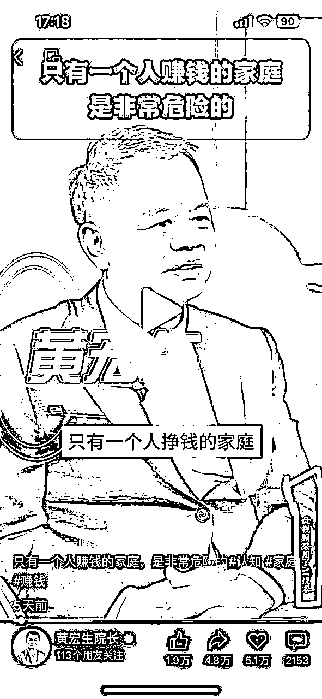

他们团队通过AI数字人技术，给他做了非常多的矩阵，做了很多不同场景的数字人分身，做了近20个账号，流量过亿。而且明确的变现路径，评论区引导进橱窗卖课，这种比较适合做IP做矩阵。

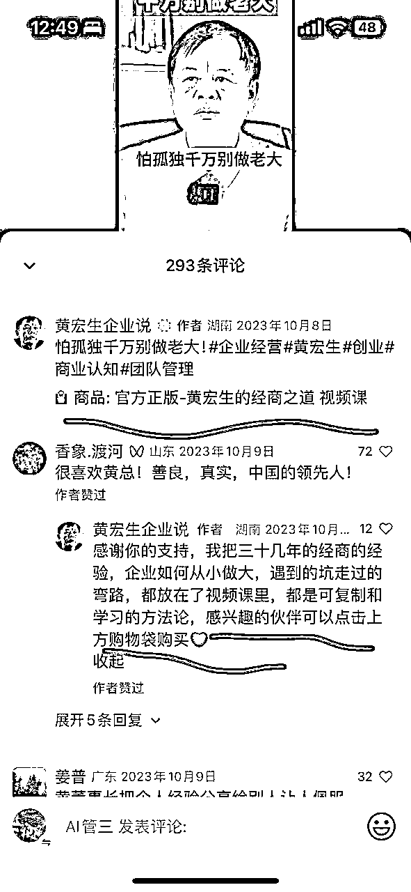

要做数字人，有很多付费软件，最近剪映开放了新功能，算业界良心，单个形象 49元/月

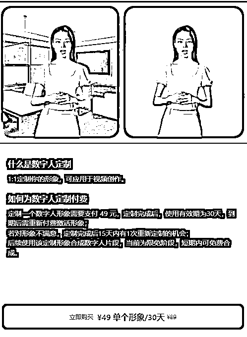

但是，我们秉承着“能不花钱绝对不付费”原则，尝试去找其他路子

看能不能做出一个“完美”的数字人

为什么说完美，因为之前版本这些工具或多或少都有破绽

一直都不敢拿出来，因为一眼AI了

但最近重新研究了一下，发现AI有重大突破

解决了几个大难题

1、肢体动作不受限制，不会影响脸部与唇部

2、语音有情绪了，听不出机器味道

3、生成时间减少了，算法有优化

截止现在2024年5月27日，能从各位大佬收集了以下工具：

抠图去背景--- Cutie

例如抠图去背景，以前能难抠的肢体动作，现在动态识别，你只需抠好第一帧

换脸---ROPE

例如换脸，以前人脸被遮了他无法换，导致某几个帧没换，很容易穿帮，现在都克服了

文本生成音频---GPT-SoVITS

例如文本生成音频，以前是没情感的朗读，现在可以复制语气语调

语音克隆--- clone-voice

例如语音克隆，训练集很高要求，但现在只需要10秒的音频，就能克隆你的音色

音频驱动视频---MuseTalk

例如音频驱动视频，时不时嘴瓢了，嘴打不开，现在可以调整了，还跑得比较快

这都是可跑的科技，看看我一步一步做出自己的数字人

看着最终效果，看的出来哪个是原视频，哪个是数字人么

# 拆解原视频

①、首先从抖音下载视频、我用的是IDM，喜欢那种“看到即所得”的感觉

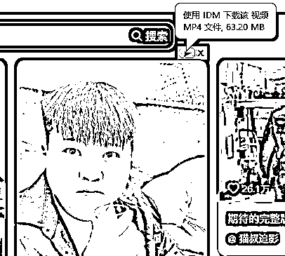

②、导入剪映，建议买会员，有些功能很值得买，常用的是镜头智能分割、 导出文本，超清画质，变老

我们需要

1、口播稿：语音转成文字，

2、仅保留人像的镜头

3、产品切片

③、把人抠出来，建议一个个镜头处理处理比较好，因为这个软件镜头一旦切换就报错

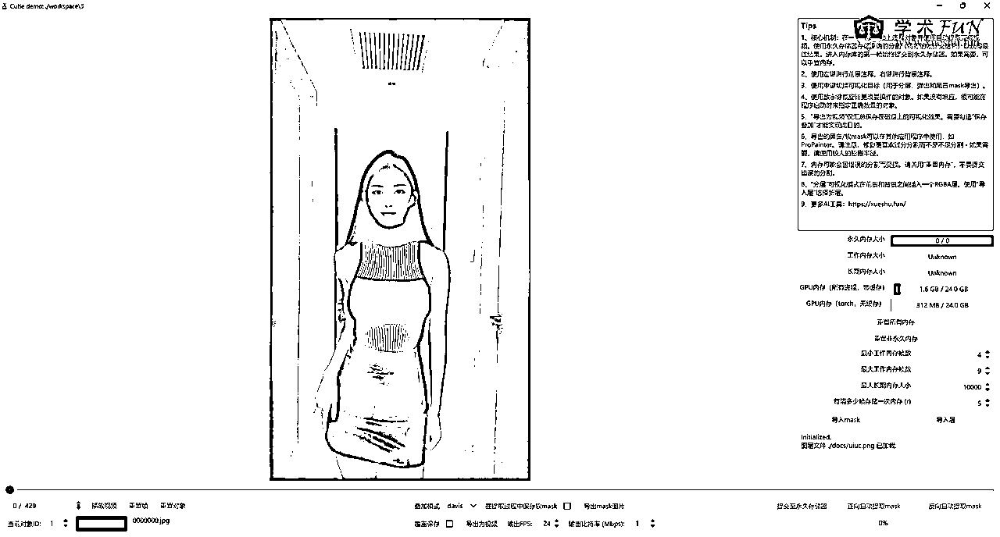

④、换人脸，记得把高清开上

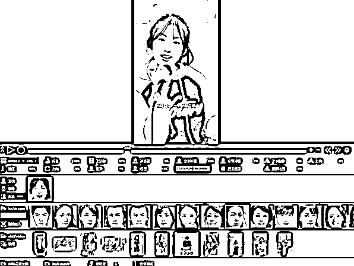

# 文本生成音频

①、口播稿去洗稿，最近看新说唱多了，我喜欢让GPT改写成短句而且要押韵

②、下载喜欢的腔调大模型，最好选一个你熟悉的

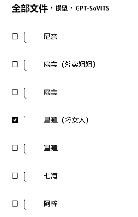

③、选一句带劲的音频做参考做语气语调

④、导入模型与参考语气，输入自己想要的文案

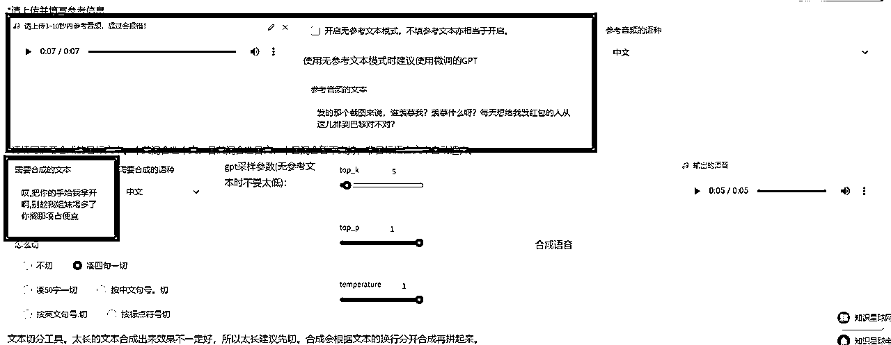

⑤、导入自己的声音文件，使用以声音-->声音模式，导入④生成的音频，结果得到了 你的声音用她的语气说的文案

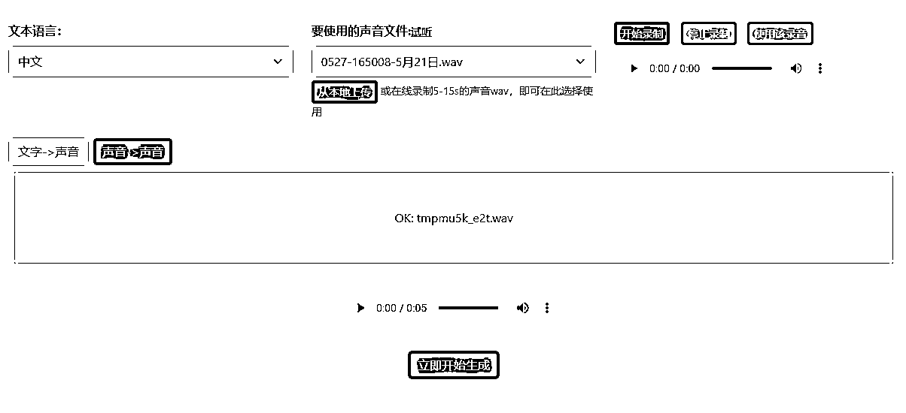

# 生成口播视频

①、把抠好的人像视频与音频导入回剪映，需要更换背景可以更换背景，这里需要一边听音频一边对齐音视频，技巧点在于，举手指的时候刚好是关键词的地方，比较有感觉

②、基于对musetalk尿性了解，尽量使用短视频，小步迭代比较靠谱，单独某段生成不好可以重新生成，切割方法可以用到剪映的 “以时间区域导出视频”

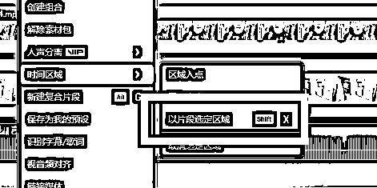

③、一开始用几秒的音频试试，看看口型张够不够大，不够可以调参数，之后可以配合PRA，分段导入跑程序，通常安排在晚上跑，明天起来有可用的素材

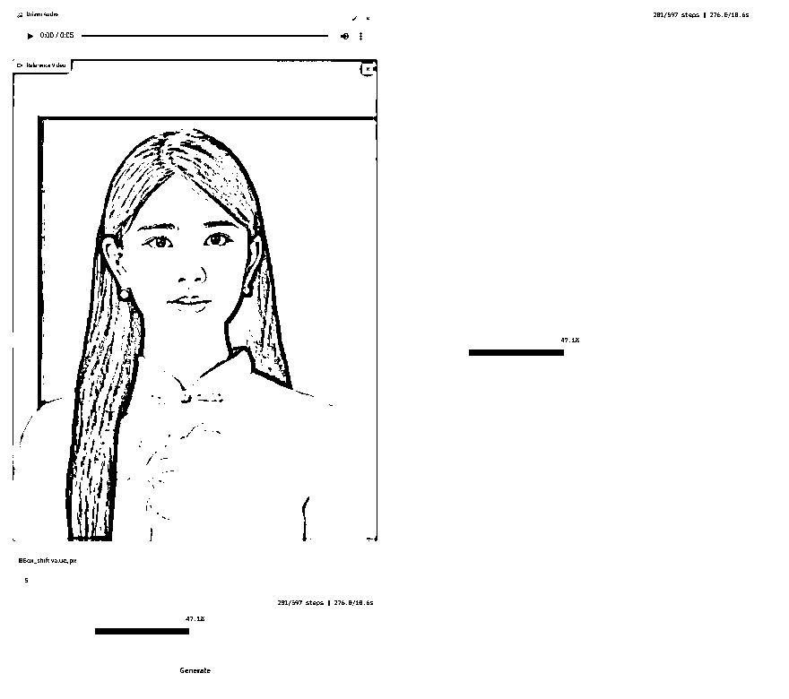

④、把这些片段都导回剪映，然后加上超清，加上字幕，加变老，拼接火车头与产品切片，就完成啦

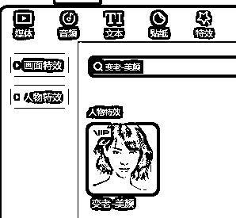

# 说在最后

简单的说，一个视频

人脸是自己的

语音是自己的

文案是自己的

背景是自己的

衣服是别人的

动作是别人的

明白了没？

当然最好买个绿幕

拍自己动作与衣服

成本如何？

生成视频的成本取决你的电脑的显卡

不用年费，不受时长限制

看到有人教人用付费的平台做数字人

还看到有人拿这些技术来割韭菜的

作为AI武器研究所成员，表示很生气

想不明白，免费的没人用，都跑去送人头

