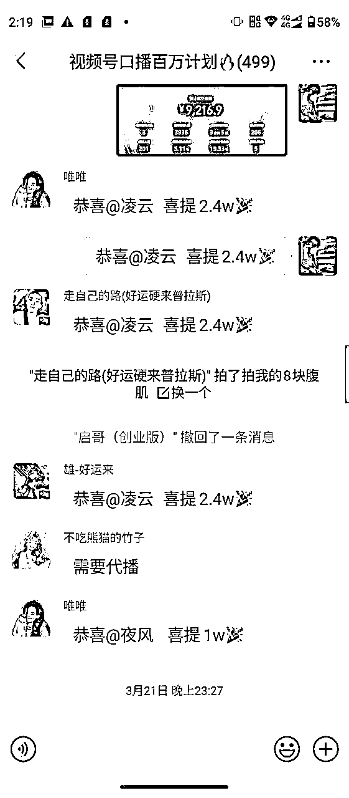

# 裸辞all in视频号带货，入局2个月打出12w+佣金

> 来源：[https://jght4vza92.feishu.cn/docx/EMKKdBcYQoCVNnxi8HJcw3FSnqd](https://jght4vza92.feishu.cn/docx/EMKKdBcYQoCVNnxi8HJcw3FSnqd)

各位生财圈友好，我是夜风，今年4月刚加入生财的一枚普通小白。从一开始的混沌懵懂、四处观望，到躬身入局全职all in视频号。前后总共一个半月打出20W+的销售额，获得了12W+的佣金，相当于之前一年的工资，这是1个多月前的我完全不敢想的。感谢生财，感谢亦仁大佬提供的如此好的平台，这么多优质的项目，以及最重要的，生财所包含的真诚利他的思想，才让我一路上结识了这么多的小伙伴，得到了那么多大佬的真诚帮助和建议，最终终于在视频号上拿到了一点小小的结果。走出了属于自己的路。

此时此刻，在去往上海的高铁上，敲下这些文字，把自己从小白到入门的这段心路历程做一个记录，也把这两个月自己对项目积累的一点点经验分享出来。生财最吸引我的，不止是里面繁多且深入的项目，更是生财真诚利他的氛围。作为一个刚入局且all in的新人，记录的同时也希望能给其他新进生财的小伙伴一点鼓舞：在生财，只要你用心，人人都可以赚到钱。也希望后面也可以像其他大佬一样，真诚利他，以一灯传诸灯，直至万灯长明。

以下是部分结果数据：

# 一、低谷挣扎的人生

## 1.跌跌撞撞的创业路

本人今年29，奔三大龄青年一枚。作为山河四省的一员，家里近乎全员体制内。如果没有意外，我应该会继承家里的衣钵，考上小镇公务员，端住这份铁饭碗，延续家里的体制内生涯，在小镇里度过平淡且安稳的一生。

但我一直是家里最不听话的那个，如果像父辈一样在小镇里过着数十年如一日的日子，那我感觉我的人生还未开始就已经结束了。我一直觉得我的人生，如果每天过得都一样的话，那活3W多天和活1天好像没什么区别。

所以从大学开始，我就不断的尝试。做过借贷宝拉新（app拉新）、游戏工作室（外挂自动打金）、劳务派遣（酒店小时工外包和寒暑假工）等等项目。渐渐的财务独立，租了个小办公室，招了几十个代理，开始招人往酒店、电子厂送人，也在校园里也打出了一些名气，最高的一个月月入13W，那时候感觉未来是明朗的，确定的。也觉得我的人生会跟收入一样，蒸蒸日上，也觉得这会是我一辈子的事业。

天不遂人愿，因为上游的劳务公司跑路（当时没有劳务派遣执照，所以只能挂靠其他公司，从他们那结款），资金链断裂，所幸积蓄刚好足以覆盖亏损。于是作为一个学生，我又回到了原来的轨道，安安稳稳度过了在校的最后一年。

## 2.跨专业进入互联网

毕业后，我那股爱折腾的劲又上来了。我坚信互联网是未来的方向，于是即使念了4年的金融也还是毫不犹豫的从零开始进入了互联网行业。于是，在同学都考去银行、税务等机关单位工作的时候，我压根没去参加那些国考省考，孤身一人跑到上海入职了一家互联网公司。现在想想，可能是源于我潜意识里对体制内的抗拒吧，也可能单纯的只是想去看看更大的世界，去更多的地方。

于是身为一个文科生的我硬生生的冲入了互联网的世界，作为一个连ctrlC、ctrlV什么意思都不懂的小白，我只能从最基层的客服干起，一点点积累经验。

同期的同学，不论是在银行的，还是考了公务员的，都是既稳定又体面。我离开了所有人都想让我走的那条路，转头选择了一条前途未卜的路。但当时的我并没有感觉沮丧和不适，因为我相信我的选择，也知道那不是我想要的生活。

于是便开始了三年的积累，2年换了三个职业。从客服转岗到运营，再从运营转岗到产品经理。从上海，到杭州再到成都。随着一次次跳槽，我的薪资也水涨船高。渐渐的从基层客服薪水只有同学的一半，再到是同学的两倍以上。于是我慢慢的也相信了一个道理：有时候，慢一点，比较快。

但工作几年后，大环境影响，涨薪趋于停滞，身边的人一波一波的离开，似乎只剩下更加内卷的工作，并时刻祈祷着不要在下次的裁员名单上。我不喜欢这种被人掌控的日子，于是我先一步，把公司给开了。于是在某个阳光明媚的早晨，在最后一次赶完方案后，我递上了辞呈。像之前的很多次一样，从零开始，踏上了新的旅程。

## 3.跳出公司，我变成了一颗韭菜

离职后的第一件事先躺平了两个月，把之前加的班、熬的夜都补回来。休息好过后，随之而来的便是铺天盖地的焦虑：接下来的日子该怎么办？我该何去何从？

于是就开始了疯狂找项目的过程。当时的我还不知道生财，找项目的渠道就是抖音、知乎这些平台。毫无疑问，在磨刀霍霍的几大“知识付费平台”找项目，被割肯定是逃不开的命运。

当时做的第一个项目是抖音上刷到的TK视频带货，付完费后得到的一切就是一个300字左右的文档、2段模糊的3分钟去重视频，以及一台破破烂烂的内置了VPN的5手iPhone6，老师也是从付费前的秒回变成了随缘回复。虽然开头不太顺利，不过好歹也算开始了，靠着较强的执行力和谷歌，一周也看到了一点成效，带出去了几百刀的产品，让我觉得不靠公司谋生似乎也不是不行。

但好景不长，按照文档上粗糙的去重手法，没发几天就触发了大量违规，账号直接被永封，佣金也锁死在里面。咨询分配的老师，发现他企微已离职，投诉到工商局发现连公司地址都不是真实的，这时我终于意识到，我好像被当成韭菜割了。

刚开始做的项目，还没起步，便半路夭折。记得后面还一时兴起找了下，当时那个TK的王老师，现在已经改名为法律顾问李主任，可能赶着去收割下一波韭菜了吧。

TK之后，在一天天调研的过程中，又发现了一个快手无人直播项目。最终选好了零食赛道，花上千块买了一堆软件，播了一个月，卖出去一份臭豆腐，最终收益3块2。之后又尝试了许多项目，都是白白当了韭菜，也浪费了自己的时间和精力。一度陷入迷茫和自我怀疑：我到底是不是这块料。但就在这时候，转机出现了......

## 4.初识生财，转机的到来

很巧，就在这个时候，我和生财的缘分开始了。一开始知道生财，是去年12月份看到朋友分享的一篇文章《生财有术最短的一篇精华》，很短，但是每一句话都让我感触很深，尤其是里面的“利他是最大的利己”让我感触最为深刻。当时迷茫的我，迫切的需要一盏指路明灯，一个方向。

因为这篇文章，我去请教我这个朋友，知道了他原来是生财两年的老圈友，也是进入生财之后辞职创业，现在小红书带货项目也做的风生水起，比不上大佬，但收入也比上班高了几倍不止。他对生财的推崇备至。让我越发的感到好奇，到底是什么样的人和圈子能有这么大的吸引力？

出于被多次割韭菜的谨慎，且近半年没有收入，手头确实有点拮据。于是这次我没有立刻付费，而是先问朋友借了账号，进去看看这是一个什么样的组织。当真正进来后，我被震惊了，我发现里面即使时免费分享的一个个项目，都比我在外面看到的更加详尽，更加完整。尝试链接到的一些大佬也真诚的为我答疑解惑。我也深深的感受到生财真诚利他的精神。

借着朋友的账号，开始了每天疯狂的找项目，每一个好像都能让我达成月入百万的梦想，小红书电商，二手书，手机卡...于是，我不停地选择，不停地尝试，引流卖出去几张手机卡后，也从之前的几块收益涨到了了几百块的收益，但是我抛弃了月入近2W的工作，最后的目标只是一周能赚几百块钱吗？

于是，我没有再盲目尝试项目了，而是去一篇篇翻看生财的精华文章，然后就看到了我第一篇关于视频号的文章。

看完了收益和操作的过程，我感觉这个适合我做，因为早期我也尝试做过视频号，但没成功，再加上都说视频号是风口，我想试试，于是便大胆链接了一下大佬。和孟总聊完过后，我就确定要深耕视频号，不再去分散精力同时做一堆项目，而是把宝压在我觉得最有希望的赛道上，决心只挖一条道，宽一米，深一千米。然后就开始了我的视频号征程......

## 5.选定赛道，all in视频号

很多人应该都知道今年视频号是风口，前面也说了其实我很早之前也就入局过，并且尝试做了一个月视频号，但自己实拍没流量，开播也卖不出去，一点都找不到门路，也就不了了之。

这次既然决定all in视频号，报完之后，我前两天什么都没干，只是单纯的把手册来回看了几遍，了解基本操作后，我就花1天时间找亲戚朋友注册了5个视频号，报名上课的时候是2月份中旬，在当时正值过年。于是在2月17日，我开始了对视频号的第二次尝试。

记得那天剪视频剪到早上4点多，睡了不到2个小时就开播，因为按经验来说中老年人一般醒的早，要抓住最大的第一波流量。运气比较好，第一次发视频就小爆了一下，看到销售额和播放量一直在涨，激动的完全没有了困意，直接坐起来开始继续剪视频、补视频。

可惜因为经验不足，碰到异常没有及时处理，导致最后流量正好的时候违规下播，痛失几千块，但是也终于首次体会到在互联网上赚钱的滋味。

新的方法首次开播就有了收获，这大大坚定了我在视频号上耕耘的决心。

尝到甜头后，再看到群里天天爆单的消息，更是一刻都不敢睡觉了，总感觉睡觉是一种罪过。作为刚开始接触视频号的小白，每天不是在问问题，就是在问问题的路上，还好群里的伙伴和孟总看到都会及时回复，也使得我对视频号的认识一点点的加深。

理解了视频号口播带货的逻辑，流量浪费的也少了，之后的每一天都是3点睡、6点起，一天睡不到3个小时，甚至更少。但黄天不负有心人，我的直播数据也是与日俱增，从一天3000、5000、8000，再到突然爆单，一次赚了2W+，兴奋的不得了，也终于体会了一把日入过万的快感。慢慢的，我也成了群里的老人，也像当时其他朋友帮助我一样，帮新来的小白解答一些刚起步的疑惑。

再到后来，掌握了规律后，慢慢的稳定一天有几千的产出，日积月累之下，发现10天已经赚了3W了。于是孟总让我在群里进行一下分享，虽然比不过其他日入几W，10几W+的大佬，但也算是在群里有了一点点名气。

于是就在这样一天天平平淡淡的几百几千里，在新号老号的死了救、救了死之间，4月20号我迎来了我的首次大爆单。

关于这次爆单，主要是因为当时群里出现了一个最近新出的爆品，急救毯，对，就是下面这个像塑料布的玩意。

这个品刚出来的几天群里就有很多人卖了大几万的销售额，于是我感觉嗅到了熟悉的味道——爆品的味道。后来又去仔细观察了广场上正在爆的直播间后，最后我发现我错了，这个应该是最近现象级的爆品。

这个品完美的契合了老年人害怕灾难，防患于未然的特点。而且一下单就是5件10件的买，恨不得给家里人都备上一件。于是我半夜看到，觉立马就不睡了，披上衣服起身就开始剪视频。毕竟爆品的寿命一般都很短，时间不等人。第二天一早就开始发，果然很多都跑的不错。

于是已经困的半梦半醒的我立马精神了，马上起床开始拉时长，第一个24小时过去，打出了1W6的成交额，佣金大概有8000多点。

如果是一个月前的我，那一天赚7-8000可能已经满足了，但是以我连续打了一个多月的经验来说，我觉得这个品的潜力远远不止这些，跟群里大家动辄10W、20W的销售额比还是差的太多了，于是我立马找到群里的实拍大佬合作，谈好分成比例，要到了优先素材，于是在多方面的因素下，接下来才有了一场gmv10W+，佣金6W+的大爆。

日常卖几千需要的是坚持，而一场大爆，就需要天时地利人和才能碰上一场了，有了好的品（天时），好的素材（地利），加上自己执行力拉满(人和)，才终于打出了单场10W+的成绩。好的爆品靠碰，而及时跟进则要有足够的执行力，否则也只能看着白花花的银子从身边流走。

遇到一个爆品不容易，等风来，等风来，有时候风来了不努力去抓住，那可能错过了就真的是错过了！果然，这个品在大爆了几天后，违规率逐渐升高，慢慢也变得无人问津。

在此想起亦仁大佬的另一篇文章：

就这样，慢慢的一个多月也累计达到了20W+的销售额，拿到了12W+的佣金(都是佣金50%-70%的品)，在家两个月就赚到了上班一年的收入。

后来回头复盘，总觉得很多事情都是冥冥之中自有安排，感谢朋友发的文章让我知道生财，因为生财找到新的项目，也链接到了一群一起努力的小伙伴，最终让项目得以跑通，也让我重新在创业的路上，迈出了第一步。进入生财，应该是我目前为止做的最对的一个决定。

自从进入生财后，一路上受到了那么多人的帮助，生财的真诚利他，是我最喜欢生财的特质。所以我也把自己的一些实操方法，以及实践过程中发现的一些提高效率的方法，分享出来给大家参考借鉴，如果能对大家有一点帮助，那会是我很开心的事。

# 二、【视频号口播带货】实战逻辑

目前两个多月的实操摸索下来，自己理解的视频号素人直播带货的逻辑总结为三句话——账号为基础，素材为核心，直播促转化。

## 第一，账号为基础

首先，账号为基础，越多越好。

目前是一个人可以注册并实名5个微信号，实名2个视频号，视频号就是你直播的子弹，当你每天最少5个号一起发，坚持一星期，是不是能做到爆一场。玩转自媒体，不得不承认要拼概率。而只要爆一场，就有可能是过万的收益。所以前期的账号准备，也就是储备子弹很重要，这也是后续要持续扩充的地方之一。

## 第二，素材为核心

其次，素材很重要，甚至是重中之重。

素材是你一切流量的来源，也是你拉爆视频的起点，选对了好素材，好脚本，也就基本奠定了一场直播的胜机。视频号上表现力好的实拍大佬经常一场拿到10W+的GMV，甚至10W+的佣金；而表现力不太好的朋友，也可以选择搬运去重，这也是视频号规则不完善时期的红利之一。

除了实拍大神，目前搬运大佬也在单月10W+俱乐部成员中占很大比例，毕竟原视频是爆过的素材，既然爆过，那他肯定是有爆的“基因”在的。所以大家可以根据自己的经验和表现力，选择不同的路径。当然鼓励大家原创，收益肯定更高就是了。

## 第三，直播促转化

最后，流量的承接。

视频号的视频与直播之间是相辅相成，平台来的流量一旦承接的好，质量达标，那平台就会给你推来更大的流量。同时也会带动短视频的数据提升，而视频数据提升，又会给直播带来更好的流量，一旦整体链路打通，整体就会呈现一种螺旋上升的态势。

值得注意的是，直播只是流量的承接与转化，整体重要，但不是最重要的一环，只要勇敢去说，对着话术一直念就好了。因为通过视频进你直播间的，都是被视频洗过一遍的，大部分已经有购买意愿，你的作用只是帮一部分有点犹豫的大妈大爷再推一把。

## 第四，注意事项

拉时长是真的有用，有流量的时候，请你一定坚持下去！视频号是一个有一定概率的地方，发一个视频，爆或不爆，有时候看账号、看时间，也看这条视频的命运。如果视频爆了，请一定不要轻易放弃。坚持拉时长、坚持补视频、把流量榨干！在补的过程中，这条视频可能会拉起其他视频，让整体的流量再上一个台阶，GMV也会跟着水涨船高。

# 三、【视频号带货】基本操作

此部分仅面向对视频号还不太了解，且不清楚基本逻辑的小伙伴。如果你已经摸索过平台了，可以直接跳到【提效方法论】

## 第一步：如何选素材及找对标

一场直播能不能打爆，首先品和素材很重要，那么如何尽快的跟上爆品，吃到肉呢？

首先，自己去打造一款爆品的难度比较高，一般刚入行的人很难靠自己去打造出一款爆品，这个过程中对时间，精力，金钱成本都会很高。如果自己拿不准，那要尽快的跟上成功者的脚步。

其次，平时要经常刷直播广场，看到哪些品卖的好，然后看一下他发的什么视频，什么框架。如果数据不错不管是翻拍还是直接搬运，切记动作要快！一个好素材出来了，搬得快吃肉，搬得慢吃土。平时一定要养成多刷直播广场的好习惯。

不管是抖音还是视频号，近期内新做起来的帐号才更具有代表性，因为越是近期起来的账号，内容和手法都是最新的，你这时候去模仿去抄才更容易出结果。

## 第二步：如何剪辑

目前我的方法是搬运混剪为主，也在往实拍方向去转，混剪的方式其实都大同小异。

剪辑工程图如下，主要就是加画中画、变速、贴纸、镜像，等等。大家应该都能看得懂。

建议大家后面都往实拍方向发展，随着平台的不断完善，搬运混剪的路也会越来越难走，实拍的收益也会更高。

## 第三步：如何直播

虽然是视频号直播带货，但口播连怼玩法直播反而是最简单的一步了。因为咱们不是专业做直播带货的，只是做短视频引流到直播成交。用户只要通过视频对你这个品感兴趣，进直播间也只是为了下单而已，直播的好坏也只是转化率上下几个点的浮动而已，因此不用对直播有太大压力，对着话术念就好。

当然直播中也有几点注意事项：

1.  直播间一定要有人在，否则容易被判定违规直接下播，并且可能连橱窗都封掉，不给一丝赚钱的机会。看着视频在跑但不能直播赚钱可能是人生最痛苦的事了。

1.  不要一直不说话，也容易被判定为录播及无人，结果同上。

1.  注意一些违禁词，说的太频繁，一样会被封。

总而言之，直播没有什么难度，对着已经爆的直播间扒下来的话术一直念就好，不出错就是胜利。

# 四、【视频号带货】提效方法论

下面是我自己在这一个月的实操当中，总结出的一些提高效率的经验，与一起在视频号上前进的伙伴们，共勉！

## 第一，账号溯源，做好数据分析

做好数据分析，很重要！（表已经贴在下面了，嫌费事的同学也可以找我要哈）

因为之前在互联网公司做产品经理，经常涉及到团队和项目管理工作，所以就把所有号的数据、归属、状态等，整理成了一个表格，提高了不少效率。表格图大致如下：

做这个表呢，主要是出于以下几个原因：

*   1.是方便定位账号状态，很快就能选出次日可打、可用的账号。哪些号刚打完要冷却？哪些号出过成绩但有段时间没开播了，有可能有爆的潜力，一目了然。

*   2.是一眼就清楚各个账号是否异常，并且备注了实名人、卡归属等账号信息，出问题能迅速定位到对应实名人、对应微信号、对应授权企业去解决，提升了账号解决速度，最大限度不影响直播效果。

*   3.是方便数据分析，根据不同号的出单结果，所适合的品快速做好账号定位，比如有的号打A品可以，打别的就不行。也通过这个方法筛出了我的天选号，20个号里这一个号占总GMV的一半多。有的号很久没播了，碰碰运气说不定能爆一场。

## 第二，找准重心，把控运营节奏

运营配合也很重要！

因为我嗓子一直不好，没办法长时间说，所以会请代播来帮我播，自己做好幕后补视频、热场、控评和辅助的工作。就看数据补视频，及时通知主播现在流量大小，方便主播及时修改对应场景话术。并且在流量大的时候开启水军大法，辅助主播逼单。

多用长处，少用短处。如果你某处问题很大且很难提高，除了花大代价和时间去提升自己的短处，也可以通过一些方法去规避这个短处，也能达到一样的效果。当然这也导致我代播费用可能是最高的一项成本，一个月干出去小1W，代播费算重资产了。有能力的伙伴可以自己播哈！如果实在播不了的，也可以请代播顶着，不过要算好成本及ROI，避免亏钱。

# 五、天赋不够，努力来凑

视频号是个要拼命的平台，想入局视频号，肝不好的需要自备护肝片。我属于是那种犟脾气，相信别人能做到的我也一定行。我坚信天赋不够，努力来凑，于是才有后来每天剪到凌晨4点、6点，没躺两个小时一看数据不错，又起来开直播，一天睡不到3个小时。也是靠这个信念支撑，最后终于拿到一点小小的结果。有时候也不得不感叹一句：有个好的社群氛围确实重要！因为你看到别人都在赚钱的时候，总会有种睡觉是一种罪过之感。

最后，再次感谢生财有术，感谢亦仁大佬提供了这么好的平台，让我通过有效的途径遇到了有结果的人，成就了我的折腾之路！也要感谢孟总的陪伴和支持，未来还要与孟总一起，在生财的平台向更好的我们进发。也祝愿大家都找到自己的方向，在生财这个满是金矿的星球，挖到属于自己的第一桶金！2024，一起暴富！