# 《生财新人指南》2024版

> 来源：[https://mkfwp3u79v.feishu.cn/docx/EftvdA6K3oyEHNx24uvczhUNn6G](https://mkfwp3u79v.feishu.cn/docx/EftvdA6K3oyEHNx24uvczhUNn6G)

# 前言

各位圈友好呀，这里是七小。

我在2022.07.09加入生财，进入星球后，看到琳琅满目的帖子，即使是我这个曾经专门做知识管理的学习博主，也感觉是眼花缭乱，让人头疼。 生财的内容，太丰富了，让人挑花眼了，哈哈。

于是我想着，我自己有这个问题，大概其他新圈友，也会有类似的问题。要不，我就边看边做整理吧，既是方便自己学习，也能帮助后来的新圈友，更快的上手生财。 于是我在生财里，做了十几份整合贴，也被大家送了【生财课代表】的称号。

在生财待了两年多，23年的时候参与了【友人带】的项目，做圈友们做新人引导。到24年做418拉新的中台指挥官，也接触了大量的新圈友。 我发现22-24年，三期的时间，其实新朋友问的问题，都大差不差的，看来新人的问题，其实就是固定的那些问题。

于是我在想：能不能汇编一份更丰富的《生财新人指南》，把大家会关心的那些问题，都能在一份文档里找到答案？一劳永逸的，降低新圈友的融入生财有术的成本呢？

于是，就有了这篇帖子。

这个帖子的内容逻辑是这样的：

我个人在生财待了两年，我自己的成长顺序是：认知提升——技能学习——项目拆解——项目实战。

第一阶段，认知提升，先看大量的帖子，了解赚钱、创业是怎么一回事，补充理论知识

第二阶段，技能学习，有了理论之后，开始补技能，从【只是知道理论】，到【能够做到一部分】

第三阶段，项目拆解，结合具体的项目案例，去深刻理解第一阶段的理论知识，从只是懂单一环节的赚钱知识，到知道如何打通赚钱的全链路，脑子里能策划出一套赚钱的项目方案。

第四阶段，脑子里既有第三阶段学会的项目实施方案了，又有第二阶段技能的操作技能了，那就下场实干！去市场上，面对真实的客户，去赚钱！

这个顺序，应该对多数圈友适用，所以这个帖子的前半部分，是关于：

认知提升—— 一、生财认知

技能学习—— 三、技能学习

项目拆解—— 四、项目拆解

项目实战—— 五、正反馈小项目

PS：为了对新人友好些，技能学习和项目实战板块，我挑选都是确定性高的，只要你投入足够的时间，95%以上的概率都能学会的东西。 你可以从这些事情开始练手，培养信心。 后续再去接触不确定高的，需要一定的经验积累、悟性才能掌握的东西。

直奔赚钱而去的路径，按这个顺序学，就可以了。但是大家在赚钱路上，还会出现很多其他的问题。

比如最常见的心态问题，焦虑、迷茫、浮躁、恐惧、孤独... 于是还得给大家补充：

二、心态卡点，帮大家突破情绪、心态上的卡点。

然后，在大家按这个顺序的操作过程中，会发现： 天天看帖子，只跟信息这种死物打交道，一方面是感觉不得劲呀，看久了会烦，觉得没意思。另一方面会感觉很多困惑还是没得到解决，情绪上的很多卡点还是难以突破。

然后你会领悟到：很多问题，还是得通过链接人，向优秀的人请教，与志同道合的朋友互相交流、互相鼓舞，补充能量，才能得到解决的。

于是你就需要：

六、社交链接指南 ，学会线上与其他圈友链接。

七、生财线下聚会指南，学会发起聚会，线下去召集同频的朋友。

除了我个人给的【生财使用指南/成长经验】之外，生财星球里，还有很多圈友，分享了他们的使用经验，他们的成长故事，对于各位也是有非常大的参考价值的。

你可以在：

八、圈友成长故事，看看其他圈友在生财几年的成长轨迹。

九、如何用好生财有术？ 听听各位生财师兄师姐的过来人经验。

当你对生财了解的够多之后，你可能会有新的问题： 除了生财星球外，咱们还有哪些东西可以学习的呀？

除了星球里的东西外，其实生财还做了很多电子书和课程，你在这里可以看到。

十、生财电子书

十一、生财自研课

等到你上面这一堆内容都了解完了，你大概会和我一样有这个想法：亦仁牛逼！生财牛逼！

你会想知道：这么厉害的组织，到底是怎么一步步发展起来的呀？ 亦仁老大是怎么构思这个社群的呢？

对此感兴趣的人，不止你一个人，很多圈友也感兴趣，于是本文还给大家整理了：

十二、生财发展历程

十三、关于生财有术的星球问答

以上，就是这个文档的内容逻辑了。 希望能帮助大家~

祝大家在生财玩的开心，咱们一起生财有术！

生财课代表 七小

2024.06.21 留

# 一、生财认知

## 《聊聊高认知穷人》

文章信息：@粥左罗 2023-08-30 点赞762

文章链接：https://wx.zsxq.com/dweb2/index/topic_detail/188514248245852

内容目录：

一、高认知穷人？抱歉，不存在

二、道理都懂的人往往是最不懂的人

三、知而不行，是为不知

四、很多人在很多事上都有很多头头是道的认知，但没在要赚钱的事上做到足够深的认知

五、你学到的高认知，是别人的高认知，不是你的高认知

内容概述：

1.高认知穷人不存在：所谓的高认知穷人实际上是表面上看似高认知，实际上并没有深刻理解和内化这些认知。

2.道理都懂的人最不懂：很多人自认为道理都懂，但在实际应用中却无法做到知行合一，认知深度不足。

3.认知的深度与专注度决定财富：在某一领域内拥有深厚的认知和专注力，才是成功和赚钱的关键。

4.高认知需要实践转化：学到的高认知必须通过实践转化为自己的，才能真正具备深刻和有效的认知。

## 《关于赚钱的108条金句》

文章信息：@浅笑 2024-02-21 点赞191

文章链接：https://wx.zsxq.com/dweb2/index/topic_detail/411142812154218

内容目录：

金句启发分享（1-108）

内容概述：

作者整理了关于赚钱的108条金句，查看原文感受更佳哦~

## 《亦仁说在生财人人都有赚百万的机会,看完这篇【信息差】万字整合贴,你会明白这句话的》

文章信息：@七小 2023-06-09 点赞372

文章链接：https://wx.zsxq.com/dweb2/index/topic_detail/584418112441444

内容目录：

一、信息差之道

1)信息差获利准则

2)套利思维

二、信息差之法

1)怎么挖掘商机?

2)怎么利用信息差赚钱?

3)什么样的信息差可以多赚钱/赚大钱?

4)信息差赚一波快钱后,应该做什么?

三、信息差之术

四、七小对信息差的总结

五、风向标

六、信息差拓展

1)认知差

2)资源差

七、信息差之器

1)大数据平台

2)航海工具包

八、尾言碎碎念

内容概述：

一篇整合贴，了解【信息差】

## 《刘大猫分享：如何通过正道务实赚钱》

文章信息：@亦仁 2019-07-10 点赞277

文章链接：https://wx.zsxq.com/dweb2/index/topic_detail/844145528214122

内容目录：

一、多数人只要把小事做好就最接近赚他能赚的大钱

二、不赔等于赚钱，少赔也等于赚钱

三、认清楚自己人生阶段，财富阶段

内容概述：

1.越早赚钱越好，大学时赚到第一桶金，成功概率更大。

2.成功关键在于做好小事，不要追求宏大项目。

3.在不利的经济阶段，不亏或少亏也是一种成功。

4.认清自己的年龄和财富阶段，制定合适的赚钱策略。

## 《低调的极简创业致富之道》

文章信息：@低调哥 2022-05-02 点赞483

文章链接：https://wx.zsxq.com/dweb2/index/topic_detail/585244142288214

内容目录：

一、快速致富靠时代红利的信息差

二、做普通人的生意更赚钱

三、好大哥=好项目

四、从我自己做到别人做

五、模式决定天花板

内容概述：

1.利用时代红利和信息差赚钱，找到红利行业和信息差，通过信息差贩卖快速致富。

2.服务普通人群更容易赚钱，定位认知比自己低的客户，赚取更大市场份额。

3.一个好大哥等于一个好项目，通过时间、金钱和感情的重注，建立关系获取稳定项目。

4.从亲自上阵转向管理和分配，把项目拆解成SOP，找到合适的人执行，实现规模化发展。

5.初期靠信息差，发展靠团队管理，扩展靠模式创新，通过多元化提升项目利润。

## 《如何判断自己的创业项目好不好？》

文章信息：@刘小排 2021-04-28 点赞335

文章链接：https://wx.zsxq.com/dweb2/index/topic_detail/182844115125482

内容目录：

一、如何判断自己的产品好不好？

二、这套方法的底层逻辑是什么？

三、如何判断自己的创业项目好不好？

内容概述：

1.判断产品好坏：不要问客户“好不好”，而是问“你买不买”，并观察客户是否愿意立即购买和推荐给朋友。

2.底层逻辑：采用“skin in the game”原则，决策人要有与结果绑定的代价，真实可信。

3.判断创业项目：比“你觉得项目好不好？”更有效的问题是“你愿意辞职和我一起创业吗？”，只有项目同时满足热爱、可执行和被需要三个条件，才是好项目。

## 《什么是网感？---暨互联网创业劝退宝典，》

文章信息：@杨涛 2022-07-15 点赞1674

文章链接：https://wx.zsxq.com/dweb2/index/topic_detail/212844112882181

内容目录：

工具思维

构建优质信息源库

利用工具获取优质信息

爬虫技术

搜索能力与关键词敏感

真实需求和伪需求的辨别能力

流量感知和获取能力

好奇心与钻研能力

数据敏感与异常值识别

渠道敏感与流量获取

产品敏感与需求预判

成本意识

产品形态与场景敏感

包装能力

产品手册思维

客户需求推送

线上线下意识

变现方式敏感

生活中的网感

羊毛意识

运营思维

团队意识

杠杆与矩阵思维

耐受度与低成本试错

逆向思维

抄作业能力

规则意识

对抗意识

像素级抄袭与拆解能力

学力与学习能力

软硬件敏感

信息和素材的储存与分类

科学上网

内容敏感与创作能力

翻译能力

会玩梗与亚文化理解

创造亚文化

逃离知识的诅咒

BD能力

抓热点与风控意识

谈资意识

IP和影响力意识

提前布局与存量管理

亲密关系的建立

私域敏感

复利与多平台运作

抱大腿与向上生长

优质圈子

贵人杠杆意识

内容概述：

1.网感是对互联网信息的敏感度，能够快速判断信息的真伪和价值。

2.工具思维：将各种平台视为工具，而非项目的全部，灵活运用以获取流量和展示内容。

3.构建优质信息源库：通过专业网站、工具、群组等，建立并不断优化信息源库，确保信息全面且有优先级。

4.高效搜索与关键词敏感：掌握搜索引擎使用技巧，敏感捕捉关键词，高效获取和甄别信息。

5.利用工具获取信息：熟练使用数据分析平台、监测工具和其他资源，快速找到所需的优质信息。

6.辨别真实与伪需求：通过用户搜索行为和反馈，精准识别用户的真实需求，优化内容和产品策略。

7.流量感知与获取：理解流量构成，掌握公域、私域和商域流量的获取与分发方法，具备付费投放和长尾营销思维。

8.好奇心与钻研精神：对新信息、新工具和新方法保持好奇心，深入钻研，持续学习和提升。

9.数据与渠道敏感：关注数据中的异常值，识别潜在机会，灵活运用渠道资源，精准获取目标流量。

10.产品与需求预判：对产品形态、使用场景和用户需求有敏感度，提前预判市场趋势，优化产品设计和营销策略。

## 《如何构建个人商业知识体系》

文章信息：@徐宿 2024-02-02 点赞90

文章链接：https://wx.zsxq.com/dweb2/index/topic_detail/811412828844882

内容目录：

一、成事的本质

二、赚钱的本质

三、生财有术的价值

四、知识体系的本质

五、构建个人商业知识体系的方法

六、验证知识体系的价值

七、地图不等于疆域

内容概述：

1.成事的关键在于理解并凑齐因果关系。成功的行为需要匹配的原因和条件，违逆因果则难以成事。

2.交易的成功源于超价互换，即提供的价值高于成本。要理解并解决交易中的各种障碍，创造有利的交易条件。

3.生财有术提供了大量确定性结果案例，通过分析这些案例，可以构建有效的商业知识体系，提高成功概率。

4.知识体系是基于因果关系构建的思维投影，理解世界观和方法论，提炼知识的真实价值。

5.构建个人商业知识体系的方法：

*   外接大脑：使用笔记本、思维导图等工具，减轻记忆负担，专注思考因果关系。

*   确定主题：选择想要构建的领域，搜集优质信息素材。

*   捕捉信息：细化并拆分信息，独立理解每个知识碎片。

*   思考价值：通过分类、主体和关系三个维度思考知识的价值。

*   压缩词语：将长句压缩成短词，便于记忆和应用。

*   纳入体系：持续提炼和内化知识，构建完善的知识体系。

6.通过实践验证知识体系的效果，实操中不断调整和完善，提高实际应用能力。

7.知识体系是世界的投影，实际应用中还需执行和创造真实成果，实操才是验证知识价值的关键。

## 《思路详解：如何为某个细分领域用户提供产品，并赚钱》

文章信息：@明白(晚9点半睡觉) 2020-05-15 点赞177

文章链接：https://wx.zsxq.com/dweb2/index/topic_detail/548824821414424

内容目录：

一、项目模式浅析

二、项目深入拆解

三、项目改进

四、最后总结

内容概述：

1.项目模式：把某个细分领域的产品集中起来，卖给用户，赚取佣金。

2.需求分析：选出符合用户需求的产品，并提供购买理由，用户才可能买单。

3.产品供应链：从现有平台选品，省去开发成本，初期可用微信群和文档展示产品。

4.流量获取：引流需结合用户需求和购买理由，吸引用户关注，才能促成购买。

5.营销策略：通过低价、减少决策成本、帮助用户发现新商品等方式，传达产品价值。

6.变现方式：用户通过链接下单，获取佣金奖励，信任建立后可扩展至社群和知识付费。

7.实操总结：明确购买理由，开发产品并吸引用户，实现变现，灵活应对不同问题，逐步优化。

## 《又看了100+精华帖,又一篇万字长文,这次我建立了[项目知识体系]》

文章信息：@七小 2022-11 点赞290

文章链接：https://wx.zsxq.com/dweb2/index/topic_detail/584255224121544

内容目录：

零、前言

一、项目地图:项目有什么?

二、项目公式:205个项目命名有什么规律?

三、生财风向标:为什么风向标是赚钱密码?

四、项目变迁:用【虚拟资料项目】带你看...

五、收入方式:都是赚钱,兼职、副业、创...

六、蓝海挖掘:如何挖掘一个蓝海项目?

七、项目挖掘:如何通过关键词来挖掘项目?

八、项目挑选:怎么找到一个适合自己的项...

九、项目判断:怎么判断项目行不行?

十、项目验证:怎么做项目的MVP?

十一、项目执行:如何把精华帖中的项目落...

十二、项目放弃:我们是如何错失赚钱项目...

1)赚钱项目的最初模样,是没有存在感的

2)赚到1块钱是正反馈,只赚到10W块是...

十三、尾言碎碎念

内容概述：

一篇完整的项目知识管理体系，推荐阅读原文

# 二、心态卡点

## 《思考了4个月，用万字长文，盘点阻碍我赚钱的18个认知误区！》

文章信息：@七小 2023-03-07 点赞344

文章链接：https://wx.zsxq.com/dweb2/index/topic_detail/412815841541248

内容目录：

一、项目：为什么找不到适合你的项目？

1）想复杂了

2）格局小了

3）既要又要

二、启动：为什么你迟迟没有开始行动？

1）缺乏自信

2）耗在学习

三、坚持：为什么你会半途而废？

1）认知不够

2）动力不够

四、结果：为什么你的付出没有对等的回报？

1）自恋自嗨

2）道德包袱

五、尾言碎碎念

内容概述：

1.找不到适合自己项目的原因

2.看到项目自己一直拖延的原因

3.做项目半途而废的原因

4.付出回报不成正比的原因

## 《亦仁提到的，生财圈友存在的19个负面情绪，或许可以这样解决》

文章信息：@七小 2023-03-09 点赞167

文章链接：https://wx.zsxq.com/dweb2/index/topic_detail/181584454214142

内容目录：

一、信息

1）希望有赚钱知识体系

2）信息乱七八糟

3）信息量太大，看完帖之后很焦虑，干脆长期不打开星球

4）信息太多了，无法分辨好坏，看完后消化不了

5）星球里面的很多信息根本看不懂，也不知道在讲什么

6）文章太长了，根本看不完

二、自信心与自尊心

1）感觉自己没有任何优势，怀疑自己赚不到钱

2）不相信自己能赚到很多钱

3）试了一段时间，觉得自己是傻逼，什么都不会，活该赚不到钱

4）不敢发帖，我的东西很浅，还是别发了吧，免得被人笑话

三、社交链接

1）不敢添加大佬，感觉不知道怎么说话，担心说错话，也无法提供价值

2）小白毫无存在感

3）都是一帮割韭菜的人在发帖

四、面对困难

1）经常会被一些具体的问题卡住，也不好意思去问别人

2）做一个项目，遇到几十上百个具体的问题，也不会搜索，也没人问，太难了，直接放弃

3）有没有高手，能手把手带着做？

五、疲劳与担忧

1）每天上班太累了，回到家只想刷抖音，不想做任何尝试

2）晚上加班，周末休息，没有时间做副业，但中年危机，又很焦虑，该怎么办

3）要是选错项目了，会浪费很多时间和资金，还不如不动

内容概述：

生财圈友19个负面情绪解决方法

## 《新手创业者 12 大心理障碍和自救指南》

文章信息：@小冯妮儿 2023-02-16 点赞67

文章链接：https://wx.zsxq.com/dweb2/index/topic_detail/214821888488281

内容目录：

一、不知道自己到底适不适合创业，怎么破？

二、创业不知道怎么样选方向，不知道自己的优势，怎么破？

三、决定创业但是家里人不支持，怎么破？

四、不想让亲戚朋友知道自己创业，怎么破？

五、觉得别人都是大神，自己干啥啥不会，怎么破？

六、干了一段时间，发现自己一事无成内心低落，怎么破？

七、不敢链接大佬，遇到问题不敢问，也不知道问谁，怎么破？

八、不敢卖，害怕没人买，害怕别人说风凉话，怎么破？

九、一直得不到正反馈，不知道是不是该坚持，怎么破？

十、干了好久赚不到钱，内心很焦虑，怎么破？

十一、很难自律，怎么破？

十二、隔段时间就发现心态彻底崩了，怎么破？

内容概述：

创业老司机在新手村时候的各种心理障碍，以及是如何自救的

## 《自己独自做项目，如何消除内耗、焦虑》

文章信息：@木婉 2023-05-25 点赞171

文章链接：https://wx.zsxq.com/dweb2/index/topic_detail/412284521525458

内容目录：

一、什么是内耗、焦虑?

二、为什么会出现内耗、焦虑?

三、怎么去解决内耗、焦虑?

1) 学会制造“垃圾'

2) 允许自己的失败

3) 给自己制定容易的目标

具体做法

人生的核心是什么?

四、总结

第一个，抛弃失败情绪。

第二个，一定要认识到情绪是

内容概述：

在生财收获最大的是开阔了眼界，以及随之而来的焦虑。

可能你会疑惑，为什么焦虑也是收获，我能从这个收获中学到什么，怎么才能让焦虑成为我的动力呢？那么，你可以接着看下去。

本篇的核心思想：情绪——思想——行动

亦任大佬说过，焦虑是好事，是能促使你向上的动力。

而且，有焦虑是一件很正常的事情，他也天天焦虑，他所 知道的身价几十亿的老板也天天焦虑，这个时代，不焦虑是不正常的。

并不是罗振宇贩卖焦虑，也不是互联网贩卖焦虑，而是，你只要想成长，想赚钱，想要突破现状，必然是会感受到痛苦。

## 《以焦虑为常态，如何在3月航海中赚到第一块美金》

文章信息：@小雨 2024-05-06 点赞387

文章链接：https://wx.zsxq.com/dweb2/index/topic_detail/1522448128515282

内容目录：

一、前言

二、航海成绩

三、 自我介绍

四、心路历程

五、航海中遇到的问题

六、基于以上问题，我做了哪些动作

七、航海收获

八、致谢

高光时刻在这里:给“像我一样的新人”如何使用生财和小航海的tips

内容概述：

这个贴子写了我从刚加入生财到现在的心路历程、航海过程中的心态和行动变化以及关于短剧剪辑的一些小tips。适合刚加入生财的新人阅读，如文中有主旨方面的偏差，也请新老人对此批评指正。让我们和焦虑做朋友，在生财成长，做闪闪发光的自己。

## 《我是怎么从低谷走出来的？》

文章信息：@郭晓文 2023-06-13 点赞237

文章链接：https://wx.zsxq.com/dweb2/index/topic_detail/412254481412848

内容目录：

一、认清自己，勇敢下场

二、好的圈子，可以让自己更快的起步

三、活成一道激光

四、主动输出

五、写在最后

六、往期精华文章

内容概述：

我在这篇文章里面和大家分享了两年多以前，我作为一个「挤在星巴克里面的，无业的年轻人」的经历。

今天，就和大家分享一下我是怎么从低谷里走出来的吧。

没有捷径，没有普通人遥不可及的操作，只有一步步血与泪的教训。

希望，能给仍处于困境中的小伙伴一些力量。

## 《我是如何成功摆脱焦虑的》

文章信息：@老爷爷的呼啸成长 2021-08-19 点赞536

文章链接：https://wx.zsxq.com/dweb2/index/topic_detail/218548221842111

内容目录：

第一段 发病

第二段 诊断

第三段 疗法

第四段 病愈

内容概述：

从2019年10月加入生财的第一天起，我的焦虑就没有停止过，心头始终交织着兴奋、沮丧、烦躁、恐惧、怀疑和迷茫各种负面情绪，直到上个月，才成功摆脱。说说我是怎么治好的，希望能帮到你。

## 《抑郁焦虑——通过情绪问题走向内在的英雄之路》

文章信息：@乔治同学 2021-12-07 点赞36

文章链接：https://wx.zsxq.com/dweb2/index/topic_detail/818812845558252

内容目录：

启程--苦难的成就

启蒙--改变的方式

考验--探索之路

回程--应用工具

内容概述：

个人对处理情绪和内在探索有些经验，希望有小小帮助。给大家缓解焦虑、做个心理按摩

分三个版本阅读，任君选择，浓淡随意：

1、5分钟---Mini版，应用工具（适合已处在不良情绪中的圈友）请直接看第四章

2、15分钟---Pro版，核心内容（适合想快速了解的圈友） 请直接看三、四章

3、25分钟---Pro max版，全文（适合空闲时间较多或想体系化了解的圈友）包含更多个人经历

## 《解除焦虑最好的方式，是把眼前的具体的事情做好！》

文章信息：@安夏 2023-02-17 点赞252

文章链接：https://wx.zsxq.com/dweb2/index/topic_detail/181548514112422

内容目录：

1.有时候，我们会被迫走进丛林

2.持续摸索，不要放弃

3.没有绝对正确和完美的选择，没有人是不会犯错的

4.不管做何选择，都要保证自己能立于不败之地！

5.你是真的想要对方的意见，还是在逃避自己做决定的责任

6.对抗焦虑，最好的办法是做具体的事情

7.何以生财，唯有实战！

内容概述：

文章通过作者安夏的视角，分享了如何在面临压力和焦虑时，通过具体行动和正确心态来解决问题和改善状况

## 《为什么你进了「生财有术」，还是赚不到钱?》

文章信息：@刘小排 2021-07-09 点赞864

文章链接：https://wx.zsxq.com/dweb2/index/topic_detail/185255552411582

内容目录：

1.觉察你心中的Filter

2.也许赚钱对你不那么重要

3.好了，我已经认识自己了，但是我还是想改变。怎么破？

4.总结

内容概述：

一个正常人，进了「生财有术」，动手认真操作的话，不可能赚不到钱。

什么，你是正常人，却没赚到钱？

那再读一遍刚才那句话，你是不是看漏了一个重点前提——“动手认真操作的话”。

问题来了，为什么你不愿意“动手认真操作”呢？

因为你心中的Filter太多。

# 三、技能学习

## 【视频批量生产】如何 1 天自动生产 10000 个爆款书单视频？

文章信息：@痴海 2022/06/14 点赞349

文章链接：https://wx.zsxq.com/dweb2/index/topic_detail/585114851821414

内容目录：

1：视频书单号流量核心策略

2：爆款书单号 SOP 流程

3：如何 1 天自动生成 1W 个爆款书单视频

内容概述：

做短视频流量最核心的策略之一就是：用数量对抗算法

需要批量准备画面文字、画面配图、BGM，用技术解决批量生产视频的问题

三个精髓内容：

*   用数量对抗算法不确定性

*   用火过的内容拆解爆款

*   用技术解决重复且枯燥的事

## 【高效信息搜集】

文章信息：@我来 2022-05-25 08:12 点赞283、

文章链接：https://t.zsxq.com/xaPAE

内容目录：

1、如何0代码爬虫？

2、如何定义自己要解决的问题

3、常用的信息搜集渠道有哪些？都有什么特点？

4、如何向别人求助？

内容概述：信息，是不确定性的衡量。如果我们能搜集到更多想要的目标信息，不确定性就会减少。所以自己一直比较关注如何高效地信息搜集，把这四年关于【高效信息搜集】的思考与经验写了一篇文章。期待和大家一起交流这一块。

## 【做课指南】分析了17W网课数据后，总结我的「知识付费行业观察」与「知识付费入行方法论」

文章信息：@七小 2022-12-23 18:07 点赞193

内容链接：https://t.zsxq.com/qPkLw

内容目录：

一、平台上线时间对比

二、腾讯课堂与学浪的营收规模/课程数量对比

三、腾讯课堂和学浪的课程类目与营收排序

四、现在学浪上赛道情况如何？

1）10倍增长空间的赛道

2）赛道四象限分析

五、如何入局知识付费分一杯羹？

1）普通人如何自己做一门课？

2）流量：课程有了，怎么搞流量？

3）产品体系：除了课程外，还可以做哪些知识产品？

4）分销：打不过就加入，如何分销大平台的课程？

## 【做课指南】如何把你的经验、技能做成网课/训练营【出课指南】

文章信息：@小蚁 2021/07/02 点赞205

文章链接：https://wx.zsxq.com/dweb2/index/topic_detail/185228844414482

内容目录：

1.如何选题

2.课程定位【人们付费是希望得到结果，不是为了涨知识】

3.如何设计课程内容【提高课程交付感的8个实战Tips】

4.打造MVP，小范围测试的出课步骤【1个月内，把课做出来！】

5.知识付费必考题：价值观

内容概述：

普通人如果有成功经验，真的能切实帮到人的技能，在知识付费的赛道赚钱是不难的。

有的人困在：东西都在脑子里，磨了半年一年都没把课磨出来。

下面我总结了一些做课程/训练营的经验，希望能帮到大家

## 【社群运营技巧】4 年时间，100 个付费社群运营小技巧

文章信息：@芷蓝 2021/09/03 点赞110

文章链接：https://wx.zsxq.com/dweb2/index/topic_detail/218512258121221

内容目录：

如何减少微信群里的“信息噪音”？

怎样为你的社群制作一个专属 SOP？

怎么才能让你的社群生产好内容？

怎样快速复制别人家的社群运营套路为己所用？

做付费社群运营，有哪些钱不能省？

怎样玩好“社群三感”？

怎么增加社群用户的交付感？出张卷子，考考他！

提高社群活跃度有哪些隐藏技巧？

如何运营你的社群 KOL？

内容概述：

作为一个自由职业者，不知不觉中，已经把生财当做一个自己成长&复盘的地方，每次有新的小感悟，赚到一点小钱，实践出一点小技巧，都会想到来生财跟大家“显摆”一下。

我真觉得做自媒体，分享的并不一定是“经验”，也可以是一种“记录”，记录自己在路上，在成长的路上，在赚钱的路上，而生财有术，在我意识里就是这条路。

OK，进入正题，继续为大家分享社群运营中的实操小技巧，这次依然是十条小技巧

## 【选品方法】手把手教你如何选出月入上万的单品

文章信息：@Lissa Tam 2021/09/24 点赞87

文章链接：https://wx.zsxq.com/dweb2/index/topic_detail/418844255255488

内容目录：

1.产品初选

2.市场调研

3.用户需求分析

4.确定产品方案

内容概述：

本文主要和大家分享一下，这样的产品我是怎么选出来的，对于像我这样小资金、无供应链资源的卖家来说，如何选出适合自己的产品。

目前市面上做产品的方法，主要是三个大方向：1.现货；2.产品优化；3.产品创新。

根据我自身情况，我开局时选择的是产品组合玩法。很费事，但是适合低成本快速测试，跑通流程。

## 【AI绘画】

https://scys.com/view/docx/PkbRdjt2AoD9t0xWeBfcLipanAe

## 【选品特训】

https://scys.com/view/docx/CjIkdgRP3o27MfxPqwnc2lAunff

## 【剪辑特训】

https://scys.com/view/docx/IeBrdyLmso2KHIxBb1Sc0fI9nwc

## 【资料整理】

https://scys.com/view/docx/CZOmdV7FLoqDC4xAqtxcXuQqneg

## 【个人优势挖掘】

https://scys.com/view/docx/Aliwd3blHoMbESxxCORcJAMPnZd

## 【RPA提效】

https://scys.com/view/docx/Onl7dyK2vosOPuxVq3mcCXqtnbc

# 四、项目拆解

## 【赚钱兵器库】如何通过分析成功案例，帮自己建立赚钱清单

文章信息：@ 明白（晚9点半睡觉） 2020-04-11 点赞288

文章链接：https://t.zsxq.com/0cqZ9cn1q

内容目录：

《如何通过分析成功案例，帮自己建立赚钱清单》

每个赚钱案例，都能通过以下 4 个方面，整理出相应的清单，分别是「需求」「流量」「营销」「变现」。

一、需求

1 、what？（这个产品满足了用户什么需求？）

2、 why？（用户为什么会有这个需求？）

3 、how to？（如何将需求做成产品？）

（1）产品在什么平台，用什么形式呈现的？

（2）产品有什么功能？

二、流量

1 、what？（产品流量从哪里来？）

如何知道这个产品的流量获取方式？

（1）搜索：在百度、谷歌、微信等各大平台搜索产品名字，会看到一些相关信息，然后从中分析，看它是靠内容营销，还是 SEO，还是投广告。

（2）试用产品：有些产品，是靠自身增长机制，这个需要你自己试用一下才知道。

比如，老带新、裂变，分享朋友圈等。

（3）看行业拆解：如果产品比较火，必然有自媒体写复盘、拆解的文章，查看这个，就更省力。

2 、why？（为什么选择这种流量获取方式？）

3 、how to？（具体是如何操作的？）

三、营销

1 、what？（产品如何做营销？）

2 、why？（产品为什么用这种营销方式？）

3 、how to（无）

四、变现

1 、what？（产品如何变现？）

2、 why（为什么用这种变现方式？）？

内容概述：

遇到任何事情，快速拓展到“如何赚钱”上，养成这样的思维习惯，拆解赚钱案例的底层原理，每个赚钱案例都通过 4 个方面（需求、流量、营销、变现）整理出相应的清单，积累「变现清单」，锻炼「商业思维」。

## 【项目挖掘方法】十一个步骤让你快速挖掘月入十万赚钱项目

文章信息：@郭耀天 2020-05-10 点赞145

文章链接：https://t.zsxq.com/0c3gOKMpu

内容目录：

五分钟发现一个赚钱的项目：

第一：打开任意一个互联网平台

第二：找广告模式与内容结构模式

第三：通过联系方式找到同行对手，搜索更多信息

第四：根据关键词行业找到更多的同行与客户

第五：观察同行的规模，存活时间

第六：预估这个项目的营收与利润

第七：找到你想做的模式对应的对手，复制他

第八：成为他的客户或者是合作伙伴

第九：预算成本，复制开启属于自己的项目

第十：复制升级优化

第十一：批量化操作，放大操作

内容概述：

发现和找到赚钱项目并不难，任意打开平台后研究广告模式与内容结构，找到同行后搜集信息了解交付模式，锁定项目后调研行业的赚钱模式，研究和确定项目规模、周期，预估营收与利润，复制对手的模式，付费深入了解同行，预算成本后复刻，升级优化，最终批量化生产。

## 【用数据选品】如何找到有强烈需求的准蓝海产品，提高投产比？

文章信息：@甜瓜 2020/11/08 点赞 219

文章链接：https://wx.zsxq.com/dweb2/index/topic_detail/582244441154154

内容目录：

一、如何选品：理性维度和感性维度

二、产品从哪里来

1、从用户需求中来

2、从同行竞品中来

3、从专家咨询中来

4、从现有产品中来

内容概述：

做蓝海项目的核心在于选品。理清如何选品以及产品从哪里来的原理，然后打开电脑开始动手执行。能动手去搜索的人很少，能动手去实践的人就更少了；实践和认知绝对是两回事儿，知道不一定能做到。

## 【个人IP玩法】全职自媒体 5 年，我沉淀下了一张个人 IP 经营图谱

文章信息：​@芷蓝 2022/07/01 点赞157

文章链接：​https://wx.zsxq.com/mweb/views/topicdetail/topicdetail.html?topic_id=184544124541822

内容目录：​

一.​同一个领域，如何找到有竞争力的差异化定位？（定位篇）

​1、同定位，多标签

2、多尝试，找需求

3、做复盘，深思考

二.打造个人 IP 应该输出哪几类内容？（内容篇）

1、实操型内容

2、认知型内容

3、专业内容

三.怎么打造一套个人 IP 变现课程？（产品篇）

1：选课题

2：列提纲

3：写课稿

4：萃取核心理论

四.学会借力，才是升级个人 IP 的高级玩法（流量篇）

1.向人借力

2.向话题借力

3.向品牌借力

五.流量裂变的2个基础要素是什么？（流量篇）

1、物质奖励

2、精神爽点

六.如何优化你的内容选题逻辑？（内容篇）

1.反认知

2.做细分

3.换视角

4.做系列

七.如何用内容经营你的个人 IP？（内容篇）

1.成功的个人 IP 有什么用？

2.经营个人 IP 的2个误区

3.构成个人 IP 的 3 大要素是什么？

八.实用类课程有什么好处？（产品篇）

九.你得给自己设定一个“ip敌人”（内容篇）

十.到底什么才是内容？（内容篇）

十一.你的内容有联动，你的IP才能持续火（内容篇）

1.为什么要做内容联动性？

2.什么是内容的联动性？

3.怎么做内容联动性？

十二.一个好问题就是一套好课程！（产品篇）

1、蓝海选题

2、四大模块

3、上架课程

十三.不赚钱，也要做产品！（产品篇）

十四.从0开始打造个人IP先要做什么？（定位篇）

十五.定位不是标签，也不是身份（定位篇）

十六.有调性没价值是假 IP，有价值没调性是傻 IP（定位篇）

1.个人 IP 里的价值是什么？

2.个人 IP 里的调性是什么？

3.IP 是卖出来的

4.一开始没人买怎么办？

十七.个人 IP 别做知识号，要做成长号！（定位篇）

十八.流量=被稀释的干货（内容篇）

十九.无课程，不做 IP（产品篇）

1.不同阶段

2.不同种类

二十.个人IP陷阱：手里没货千万别定营销技能（定位篇）

二十一.跑通一个副业就能做个人IP？（变现篇）

内容概述：

个人IP的五个步骤：定位→内容→流量→产品→变现

从上述五个步骤以此介绍关于IP的系统框架

## 【关键词挖掘】聊一聊 Google 关键词挖掘需求的方法

文章信息：@​三林 2022/10/21 点赞91

文章链接：​https://wx.zsxq.com/mweb/views/topicdetail/topicdetail.html?topic_id=212458515158211

内容目录：​

​一、如何通过关键词找需求?

1.1 围绕目标战地(平台)去挖掘相关词

1.2 搜索量高低=可量化需求强弱

1.3 从搜索词出发的产品研发选择

1.4 搜索量评判的不止是核心母词，更是一组词

1.5 关注竞争，小型创业者勿扎堆在热门赛道

二、关键词挖掘需求-工具篇:

2.1 如何挖掘长尾词:拓词工具

2.2 如何得到精准搜索量数据?

2.3 如何快速得到谷歌的联想词

2.4 如何得到谷歌搜索结果中:用户关注的问题?

三、最后总结一下

​

内容概述：

关于Google的关键词搜索方法，以及辅助搜索工具

## 【商机挖掘】每个持续投放的广告背后，都是一个巨大的市场机会

文章信息：@黄亮 2018/08/22 点赞111

文章链接：https://wx.zsxq.com/mweb/views/topicdetail/topicdetail.html?topic_id=15488885541422

内容目录：

一、好奇心

二、看他都做了什么渠道的投放

三、看他投放的量大不大

四、看他是否持续投放

五、加他们的客服聊，探究更多细节

六、大胆假设，整理收集到的素材，综合判断这生意到底是赚钱还是不赚钱

内容概述：

现在互联网上信息太多了，如果什么都留意看的话，脑袋就不够用了，但是有一类信息，一定要特别留意看，那就是广告，一个能持续投放广告的业务，一定是赚钱的，不赚钱的那些都死了。

## 【精华帖落地】手把手带你把一篇精华帖转化成可执行的 SOP，抓住下次来临的红利

文章信息：​@郭晓文 2023/02/03 262

文章链接：​https://wx.zsxq.com/mweb/views/topicdetail/topicdetail.html?topic_id=412885122428148

内容目录：​

​一、为什么不实操?

二、如何减少不确定性?

三、手把手教你，怎么形成一套蹭热点的SOP

1、怎么发现值得操作的热点?

2、项目拆解

3、改公众号名称

（1）、注册公众号

（2）、根据热点改名字

4、留存用户&高频发文

（1）、找到可以搬运的干货贴

（2）、用美编助手修改并发布文章

5、优化排名

6、项目变现

7、沉淀私域&沉淀话术

8、项目放大

四、写在最后

​

内容概述：

“大部分新手迟迟不下场，就是因为对新手来说，做一个项目的「不确定性」太多了……

而人又是天生害怕不确定性的。

这种对不确定性的恐惧，会一次次的把你劝退。

今天的文章，就是一次带着大家，把一个项目的不确定性降低的过程演示。

如果你是一个搞钱新手，下次遇到感兴趣的项目复盘精华帖，不妨用这个方法，把那个项目的不确定性降低。

对新手来说，用正确的方法把精华帖反复读，比多读几篇精华帖，更重要。”

这一篇文章就教你把“精华帖”转化成sop！

# 五、正反馈小项目

## 【项目认知-技术赚钱实践指南】

文章信息：@乔帮主 2023/06/02 点赞 407

文章链接：https://wx.zsxq.com/dweb2/index/topic_detail/814482818521122

内容目录：

前言：关于技术赚钱的本质

一、技术人的18个认知觉醒

二、30个商业赚钱的思考

三、10个需求挖掘

四、5大热门赚钱技术

五、5大技术类赚钱项目

内容概述：

信息的搜集、整理、分析是一个非常重要的核心技能（本质也是资料整理的能力），要说什么是赚钱的必修技能，那资料整理这项能力肯定榜上有名。

资料整理在工作效能、人生成长、商业变现（资料引流、技能变现、IP打造）方面发挥着重要价值。而只要有价值的地方就能有价格，就能赚钱。

生财的知识星球内容库、航海资料库，是一个有着巨大价值的宝藏知识库。我们可以凭借资料整理这项核心技能，在这个蕴含着大量宝藏的知识库中挖呀挖呀挖！

今天索性把我笔记内容（精选的300篇文章），以及基于这300篇文章而整理的这篇《技术赚钱实践指南》跟大家分享出来。

## 【AI图片说话项目】七天如何快速变现

文章信息：@百钞 2023/06/28 点赞 359

文章链接：https://wx.zsxq.com/dweb2/index/topic_detail/181115424885842

内容目录：

一、怎么做?

1、文案内容

2、人物形象

3、视频制作

二、变现方式

1、收徒变现

2、电商带货

3、小程序变现

三、碎碎念

早就是优势

内容概述：

本着利他的原则,今天来分享1个超级适合小白的AI项目,目前自己也在跑,跑出来数据还不错,第3天就变现了

299。这个项目市面上有很多种叫法,AI数字人,图片说话,图片数字人等等。名字不重要。

今天这篇内容不仅有教程,也有我自己的一些思考,欢迎大家一起探讨交流呀。希望这个分享的不仅仅是项目,也

可以触发你的一些思考。毕竟躬身入局比什么都重要。

## 【小红书宠物赛道】一个月工资顶一年

文章信息：@虾饼 2023/06/21 点赞 159

文章链接：https://wx.zsxq.com/dweb2/index/topic_detail/814445882821442

内容目录：

一、自我介绍

二、宠物赛道情况

1、萌宠 难度：5 星

2、吃播 难度：3 星

3、科普 难度：2 星

三、实操流程

1、账号装修

2、内容来源

3、创作流程

（1）、找选题

（2）、定封面

（3）、定图片内容

（4）、定文案

四、变现方向

1、如何提高接广率

2、推广合作流程

（1）、合作形式

（2）、如何报价

（3）、结款

内容概述：

宠物赛道越来越卷了，那除了头部大 V 外，素人还能做起来吗？

不知道大家有没有发现，很多的红海赛道细分之后，就又是一个新的蓝海。我在小红书做宠物科普博主之前，就是一个毫无基础的新人，在小红书做宠物赛道也只是因为热爱分享。

所以在刚开始起号时，仅仅是利用闲暇时间去蹭爆款标题，发笔记试试水，没想到一个月就积累了近千粉。慢慢的我就开始专职做宠物科普博主，接广告推广变现了。现在，我单月的收入比我之前一年的收入还高，这也是我当时不敢想的。

而对于素人来说，宠物科普就是一个机会比较大的蓝海类目。相比萌宠、吃播赛道，宠物科普难度比较低，适合小白入局，而且起号成功之后不仅仅可以只做科普，也可以做同类型的矩阵号去引流卖货。

今天，和大家分享我做小红书宠物科普博主的一些经验和实操，希望对大家有帮助。

## 【生财精华掘金秘诀】大二纯小白快速上手副业项目两周变现1w+

文章信息：@苏大强 2023/06/02 点赞 376

文章链接：https://wx.zsxq.com/dweb2/index/topic_detail/214482818455881

内容目录：

一、首次听闻 立即执行

1、事情起因

2、说干就干

3、极速闭环

二、迭代优化 迎来爆发

1、持续学习

2、更新迭代

3、爆发增长

三、持续盈利 感悟复盘

1、执行为王

2、先抄再超

3、积攒经验 提升能力

四、感恩生财和前辈

内容概述：

一位互联网小白，刚加入生财的大二学生。5月17号，在刷到圈友发的天涯精华帖之后，决定下场实践，第一次上手互联网项目，没想到迅速赚到钱，两周收入1W+！本次文章的分享为我的全实战经验。

## 【小红书资料引流+快团团社群团购】新手也能在20天赚回门票钱

文章信息：@郑州房产·文豪 2022/11/22 点赞 250

文章链接：https://wx.zsxq.com/dweb2/index/topic_detail/214522142848881

内容目录：

一、自我介绍及战绩

1、自我介绍

2、斩获战绩

二、在生财的心路历程

1、如何与生财结缘

2、在生财的迷茫与焦虑

3、疫情当下给大家的建议

三、反思觉悟进行实操

1、自我进行深度反思

2、开始紧跟航海进行实操

3、对圈友们力所能及的帮助

四、找项目抄同行

1、如何找合适的项目

2、拒绝拖延开始践行

3、思路的延伸

五、项目如何实施

1、怎么做

2、如何找寻学习资料

3、如何在小红书发爆品

4、引流的一些方法

5、半自动微信成交

6、抖音快手平台玩法

7、问题处理

问题一

问题二

六、朋友圈营销转化

1、朋友圈转化小技巧

2、设置标签进行群发

3、文件转化小技巧

内容概述：

本文将给大家分享保姆级“小红书引流+快团团社群团购”全攻略，小白也能全复制的教程，真正的新手也能在20天赚回门票！

文档里是我实操过程的经历及技巧，也希望能够帮助疫情下正处于迷茫的生财圈友们。

## 【基于生财风向标，承接找书项】6天变现2400，适合小白的上手项目

文章信息：@飞掌柜 2023/07/10 点赞 155

文章链接：https://wx.zsxq.com/dweb2/index/topic_detail/211514142888851

内容目录：

一、项目背景

1、项目来源

2、项目收费

二、项目实操

1、找书渠道

2、豆瓣

3、Z站

4、无名图书

5、搜索方式

6、怎么知道SSID或ISBN？

7、转换格式

8、整理归档

9、书籍发送

10、机器人找书

三、项目收益

1、合作方式

2、机构合作

3、收益分析

4、市场机会

5、合伙共创

内容概述：

受到付费电子书这条风向标的启发，我最近接了找书项目的单子，6天变现了2400，感谢圈友启发，类似这样的风向标生财有很多，今天我把实操经验分享出来。

## 【微头条讲故事】第一个月内赚到1000+？

文章信息：@Tao 2021/08/13 点赞 119

文章链接：https://wx.zsxq.com/dweb2/index/topic_detail/218545252512241

内容目录：

一、定位

1、看专业能力。

2、看变现模式。

二、模仿

1、模仿谁呢?

2、模仿什么呢?

A账号命名

B选题

C开头

D叙述方法

3、二次创作

三、原创怎么找素材?

四、怎么提高微头条单价?

五、关于怎么提高写作能力,言念想说的话

1、提高认知和审美。

2、坚持。

内容概述：

关于怎么写爆文，怎么选领域，怎么找素材，怎么二次创作，怎么提高写作水平等等，都会在这篇文章里说清楚。

只要你执行力够强，一步一步按照我说的去做，第一个月内，收入提升1000+不是问题。至于能走多远，这就要看你自己了。

为什么我敢说得这么笃定？因为之前我带了几个毫无经验的同学，都是让他们这么做的，个个达到了这个水平。相信执行力够好的圈友，也能达到

## 【婴儿奶粉批发】6个月从0-85万利润

文章信息：@宝哥 2023/05/16 点赞 212

文章链接：https://wx.zsxq.com/dweb2/index/topic_detail/412824848285128

内容目录：

一、婴幼儿奶粉行业发展现状及趋势分析

二、引流的3种方法

三、收到奶粉怎么追溯查询真伪

四、奶粉为什么带内码，还需要押金？

五、售后问题

六、审核下单

七、窜货罚款问题（重点）

八、变现方法

内容概述：

抖音直播间不间断播放“胎教音乐”，这类账号可以如何变现呢？

以“免费领全套胎音乐”为诱饵，吸引粉丝进群，再设置钩子“加好友可进孕妈交流群/福利羊毛群”，并通过@强提醒引导粉丝加微信进入私域。

过程逻辑顺畅且操作简单，0成本，0门槛。每天引流100+宝妈粉到微信，一个月多能卖8000箱。

不仅变现路径清晰，市场也非常大非常可观，只要有新生儿宝宝出生，宝宝喝奶粉，奶粉就可以一直卖。而且高复购，高利润。

利润的主要来源是有的母婴奶粉都是按照厂家标的零售价卖，宝妈买到手300-400多一罐， 但实际上拿货价才100多块钱，中间有很大的收益。

只要找到合适的买家，就不愁变现。大家可能会担心货源问题，本篇文章一律讲清楚。

## 【拼多多短视频带货】大一学生如何通过拼多多短视频带货3个月变现4.6w

文章信息：@梦宸 2023/05/16 点赞 393

文章链接：https://wx.zsxq.com/dweb2/index/topic_detail/181488824141442

内容目录：

一、如何发现商机

二、拼多多短视频的前景

三、账号的准备

四、带货门槛

五、如何获得带货奖励资格

六、如何选品

七、如何寻找高质量素材

八、最后总结

内容概述：

我从13岁开始接触网赚到现在20岁，有7年的互联网经验，去年开始入局了拼多多短视频带货赛道

拼多多短视频带货的优势就是门槛低、适合新手小白、容易矩阵起号

今天我也会把整个项目的玩法流程手把手教给大家

## 【大四学生撸货——小白月入4k+】

文章信息：@熊自由 2023/04/11 点赞 22

文章链接：https://wx.zsxq.com/dweb2/index/topic_detail/181458542245512

内容目录：

一、撸货的成果

二、撸货的四大要素

三、实操指南

四、收获与避坑

内容概述：

今天来分享一篇，我在学校里怎么通过撸货稳定月入4k+的文章。

内容包含：撸货的门槛成本、实操指南、优势和我对撸货的认知。

它是超适合互联网新人做基本盘的项目~稳定变现胜过千言万语....

# 六、社交破圈链接指南

## 【经营 人脉】如何高效连接并经营你的人脉资源

文章信息：@百川 2019-07-19 点赞83

文章链接：https://wx.zsxq.com/dweb2/index/topic_detail/544841282858444

内容目录：

1.好友验证如何发起？

2.不合格的自我介绍存在哪些问题？

3.那到底应该如何真诚的介绍自己呢？

4.如何让别人愿意和你交流与连接？

5.经营并建立关系的长久连接关系？

6.去刻意练习自己的人脉连接和经营能力。

内容概述：

1、说清楚在哪里看到的，和来意，再发起好友验证；

2、简洁和有价值的展现自己的自我介绍；

3、做事之前多站在别人的角度思考和如何利人；

4、学到了要感谢，赚到了就要教人，播种善因；

5、了解自己的短板，并刻意练习。

## 【破圈方法】普通人如何破圈成长

文章信息：@光合 2021/04/14 点赞663

文章链接：​​https://wx.zsxq.com/mweb/views/topicdetail/topicdetail.html?topic_id=582512458582144

内容目录：​

​一、人生是不断破圈的过程和结果

​二、破圈靠高阶输出能力

三、输出的起手式：成为一道激光

四、输出讲究四门功课：读、听、写、说

五、破圈的三个加速器：利他、主动、花钱

1、真诚利他

2、高度主动

3、忍痛花钱

六、最后再说几句

内容概述：

关于普通人破圈成长分享三个金句：（具体内容一定要去看，概述再清晰，不如亲自体会一遍）

1.破圈靠高阶输出能力，高阶输出能力靠在自己擅长的细分领域里有压倒性的时间投入，然后是日拱一卒的读、听、写、说四门功课反复淬炼，再去落地执行，在行动的过程中持续精进。

2.人生是不断破圈的过程和结果，但是破圈并非最终目的。

3.人与人之间的根本差距，是知行合一的差距

共勉！

## 【让自己值得被帮】什么样的人值得帮

文章信息：@​郑小焦 2022/09/09 点赞303

文章链接：​https://wx.zsxq.com/mweb/views/topicdetail/topicdetail.html?topic_id=415558251848818

内容目录：​

一、如何判断对方能帮我?

二、自己值得帮

三、被拒绝了怎么办

四、如何让自己持续被帮?

1.了解他的目标

2.真诚领情向前进

3.不亚于任何人的努力

4.及时反馈进度

5.完成他的目标

​

内容概述：

​求助=对方帮得了+自己值得帮

不管帮助其他人，还是请求别人帮助自己，都要记住，只有你自己是贵人，才会遇见贵人，愿意回馈，愿意一起前进，那样才可能产生联系！

## 【破圈链接】生财破圈链接方法论

文章信息：@​七小 2022/11/04 点赞134

文章链接：​https://wx.zsxq.com/dweb2/index/topic_detail/812451824442882

内容目录：​

一、【破圈】普通人如何破圈成长？

1）为什么要破圈？

2）别的圈子凭什么让你破？

3）普通人破圈有什么方法？

二、【链接】普通人如何链接贵人获得快速成长？

1）如何向牛人寻求帮助？

2）如何链接牛人？

3）如何进行初次有效交流？

4）日常链接要注意什么？

​

内容概述：

生财里关于破圈链接的文章整合贴

# 七、生财线下聚会指南

## 【官方 | 生财有术 | 线下聚会组局官手册】

文章信息：@生财有术官方

文章链接：

内容目录：

1.聚会简介

2.聚会筹备

3.聚会流程

内容概述：

本文为生财官方对线下聚会组局官的指南手册，是每个组局官的必看内容。

## 【生财线下聚会手册（圈友经验整合版）】

文章信息：@七小

文章链接：

内容目录：

一、只活跃在线上就足够了吗？

二、为什么你得参加一次线下聚会？

三、组局官要做些什么？

四、嘉宾分享

五、参与者行动指南

六、高端局筹备SOP

内容概述：

本文为生财官线下聚会组局官手册的最详细版本，可以说是事无巨细把线下组局这件事说明白了。

## 【为什么要参加线下局甚至组局？关于生财线下局的33个认知】

文章信息：@逍遥 2024/03/20 点赞 40

文章链接：https://wx.zsxq.com/dweb2/index/topic_detail/1522455414142482

内容概述：

本文主要是作者分享的33个关于线下局认知，相信能给到还未参加过线下局的新人一些启示。

## 【都来组局！新手组局官的经验分享】

文章信息：@胖虎 2024/04/18 点赞 16

文章链接：https://wx.zsxq.com/dweb2/index/topic_detail/1522515225824442

内容目录：

1.组局第一步，查看手册

2.跟有经验的人学习

3.提前沟通，了解圈友

4.信息同步，群内预热

5.首次组局，邀请熟人

6.主题分享局，内容是核心

7.自我介绍，深入挖掘

8.注意时间

内容概述：

第一次当组局官，从新手的角度，分享的八点注意事项，对新手组局官肯定会有帮助！

## 【组局11场，2场失败：我的组局心得】

文章信息：@罗卜 2024/01/12 点赞 35

文章链接：https://wx.zsxq.com/dweb2/index/topic_detail/211424448152811

内容目录：

1.为什么只想参与活动

2.组局2场失败的原因会有哪些

3.组局是什么

4.为什么要组局

5.组局者和参与者区别

6.举办活动的几个要素

7.9场活动的主题分享

内容概述：

本文从如何选题、如何找场地、如何固定时间组局、等分享作者的组局体验。

## 【线下组局SOP全流程文档分享】

文章信息：@来来 2023/05/16 点赞 56

文章链接：https://wx.zsxq.com/dweb2/index/topic_detail/814211181441812

内容目录：

1、SOP【组局官】

2、选址【确认山舍】

3、TODO【组局官】

3.1、每周二21点开始，22点结束

3.2、每周五22点开始，0点结束

3.3、物料准备

3.4、达到和布置现场（第一次流程）

4、收支表【组局官】

5、开局规则

6、自我介绍

内容概述：

本文分享了作者在线下组局后总结而成的SOP流程，从组局前到组局中，每个环节都有细说，值得想要去组局的新人去学习。

## 【新手组局必看：户外运动组局的保姆级复盘指南】

文章信息：@柏芝Besses 2024/02/26 点赞 29

文章链接：https://wx.zsxq.com/dweb2/index/topic_detail/211151228181211

内容目录：

1.活动前

2.活动中

3.活动后

4.风险预判

5.加分项

内容概述：

因为个人平时爱好户外运动，因此组了一个户外徒步局，趁热打铁，给大家分享一下，户外徒步线下局，”从活动前到活动后如何从0-1准备？“”有天气和路线小意外怎么办？“等等问题。

## 【组局启示录：如何在生财有术的组局中开拓思维视野】

文章信息：@罗卜 2024/04/18 点赞 19

文章链接：https://wx.zsxq.com/dweb2/index/topic_detail/4844588528815528

内容目录：

1.为什么要参加局

2.组局的五个核心问题

2.1活动目的

2.2活动主题

2.3活动对象

2.4活动创意

2.5预算控制

3.为什么要组局

3.1发起组局

3.2位置选择

3.3组局人数

3.4时间选择

3.5消费事项

3.6话题选择

3.7注意事项

4.组局前后变化

5.组局的收获

6.印象深刻组局经历

7.组局中最想感谢的人

8.组局总结

内容概述：

想必在生财都听过这么一句“线上聊千遍，线下见一面”，作者在这篇文章中分享了自己加入生财一年，参加大大小小的线下聚会从中获取到的一些经验。

## 【聚力前行：我在生财有术通过组局得到的蜕变】

文章信息：@胖大宁 2024/04/18 点赞 47

文章链接：https://wx.zsxq.com/dweb2/index/topic_detail/2855288242245821

内容目录：

一，是什么让“生财有术”成为我人生的转折点？

二，作为组局官，经常组局我收获到了什么？

三，组局，连接人与机遇的桥梁

四，为何我如此执着于组局？

五，印象最深刻的一次组局：那场改变我命运的聚会

六，最想感谢的人：那些在背后默默支持我的圈友们

七，组局，让世界因我们而不同

内容概述：

作者组了13次山西同城线下的聚会，想知道她是怎么通过组局找到我的小天地，发现生财的秘诀，并且让自己的价值像火箭一样飙升的吗？那来听听她的故事，涨涨你的经验吧！

## 【527浙江四线城市航海组局分享 | 个人整理sop&复盘总结】

文章信息：@捷西很能吃 2023/06/30 点赞 7

文章链接：https://wx.zsxq.com/dweb2/index/topic_detail/814442551585812

内容目录：

一、 基本信息

二、 场地物料筹备

三、 流程&环节

四、 规则说明

五、 个人复盘&总结

内容概述：

这篇文章分享了身处四线城市的作者线下组局经历，内容具体且详实。

# 八、圈友成长故事

## 【跨境电商】我是如何在生财有术赚到第一桶金的

文章信息：@seven 2020/05/5 点赞 294

文章链接：https://wx.zsxq.com/mweb/views/topicdetail/topicdetail.html?topic_id=118824515241122

内容目录：

一，赚到第一桶金的详细经过

二，可能对读者有一些些价值的资源和信息

三，这次赚钱给我带来的心得体会

内容概述：

本文是我分享的一篇关于如何在生财有术赚到第一桶金的经历。文章中，我介绍了自己如何通过探索和学习，最终成功赚到第一桶金的过程。我分享了自己在进入“生财有术”的星球后，如何选择赚钱方向，并通过跨界学习、写作、试错等方式不断提升自己的能力和技能。同时，我也分享了在学习过程中遇到的困难以及如何克服这些困难的经验。希望这篇文章能够对你在赚钱道路上有所启发和帮助。

## 【圈友收获】聊聊我在生财有术的这一年

文章信息：@吴大白 2021/04/10 点赞 203

文章链接：https://wx.zsxq.com/mweb/views/topicdetail/topicdetail.html?topic_id=414584424825448

内容目录：

一、初遇生财有术和亦仁

二、来自金钱直接的收益

三、来自认知层面的提升

1、关于长期主义

2、关于金钱观

3、关于自我提升（自律）

四、来自创业思维的改变

1、关于决策层面

2、关于团队成长

3、关于输入输出

五、对于生财有术的感触与建议

内容概述：

开始接触生财的时候是我到目前为止创业路上最大的转折点之一，刚好把国内抖音的业务暂停掉，并且自己参与投资开发的一个社交APP也因为风投失败（疫情缘故）而以惨败告终。那时候正打算全力all in跨境电商，所以迫切的想拓展一下自己的圈子和认知。

生财是我目前见到最有温度和质量的一个社群，在生财待了近一年，让我受益匪浅，不论是金钱还是视野。

## 【生财成长故事】进生财四个月，变现 23W，11 枚龙珠，数位贵人相助，99 年的我是怎么做到的

文章信息：@魔音 morin 2021/04/27 点赞 200

文章链接：https://wx.zsxq.com/mweb/views/topicdetail/topicdetail.html?topic_id=215122454828441

内容目录：

一、为什么要写这些变现项目

龙珠：6W

培训演讲：6K

分销生财：2K

投资套利: 14W

社群和咨询：3W

分享输出的小提示

二、为什么要写这些贵人

范米索：“入我地界，守我之规”

张五哥：“一个伯乐与他的千里马们”

小蚁： “更好的人生和更好的世界，他义无反顾的选择了后者”

李自然：一个坚持下去的理由

瓜藤：“绝处逢生，归来便是王者”

胭脂王——“一念天堂，一念地狱”

我的仰慕者们：“从我会变得勇敢，勇敢的冲破囚栏；到我已变得勇敢，勇敢的冲向黑暗”

与人链接的小提示

三、很高兴在生财遇见你

内容概述：

我是那个99年的没毕业、没学历、没工作、没工资的魔音，相信你们进来这几天是不是有一种瞠目结舌的感觉，觉得信息量十分爆炸，觉得自己所有的文章都想看，所有的活动都想参加？于是瞬间引发了自己不想错过一切的焦虑心理？

讲述自己四个月以来，在“财”和“人”方面的双重收获，意在告诉各位新老朋友，新旧身份、知名度、社会地位、年龄、性别、经历、性格、出身及背景都不能成为你阻止自己前行和安慰自己的借口，不要给自己从内心设限

## 【生财破圈成长】沉浸于生财 2 年 3 个月，分享我的破圈成长之路

文章信息：@郑小焦 2021/10/27 点赞 223

文章链接：https://wx.zsxq.com/mweb/views/topicdetail/topicdetail.html?topic_id=185551824122882

内容目录：

一、空白期：小透明初入生财

二、成长期：从迷茫焦虑到聚焦

三、进阶期：在新项目中逐渐开悟

四、破圈期：感谢生财，共同成长

内容概述：

这一年来从“焦虑转为聚焦”的成长、月收入翻10倍的收获和总结，同在生财滋养，

努力不一定会成功，但是人们更愿意帮助努力的人，这是线性成长转变成跳跃性成长的门槛。你的努力被别人欣赏，有人愿意拉你一把，那就是跳跃性成长。

要尽早打造属于自己的成功案例。成功的经历能帮助你更好的成功，让自己有做成事的自信，也给别人一个相信你能成事的理由，这是做事的基础。

## 【医生IP变现】博士医生打造个人 IP，通过互联网副业纯收入超过两百万

文章信息：@梁靠谱 2021/12/02 点赞 570

文章链接：https://wx.zsxq.com/mweb/views/topicdetail/topicdetail.html?topic_id=818818244224822

内容目录：

一、从小学到博士，23年读书改变命运。

二、不甘平凡稳定，主动寻觅副业。

三、凭借人品红利，启动成功。

四、遭遇瓶颈，但获得了第一次增长。

五、因为贵人和超级节点，获得了第二次增长。

六、启动视频号，获得第三次增长。

七、通过醒醒进入生财，初进生财的迷茫和破解。

八、在生财获得的机会和第四次生长。

九、关于未来的第五次增长。

十、最后想说的一些话。

内容概述：

一个三甲医院的主治医师。几年前上研究生，拿国家补助一千/月，夜班费五十/个，两年前毕业工作，月薪不到一万，但我今年在互联网上的副业纯收入超过了两百万。

人的一生追求的当然不能仅仅是钱，但是要有维持尊严的生活，能够没有阻碍的工作，希望我们每个人都能够慷慨、能够爽朗、能够独立。

## 【生财课代表】《加入生财的第145天，成功召唤神龙亦仁！分享我在生财破圈成长的心路历程》

文章信息：@七小

文章链接：https://t.zsxq.com/DHxwU

内容目录：

一、回顾我的追星之路

二、我是如何破圈的?

1.  社交混圈心法

1.  破圈链接方法论

1.  我是如何当课代表的?

1.  寄语

三、加入生财之前，我是什么样的?

四、加入生财之后，赚钱成长的四个阶段

1.  第一阶段：赚钱认知

1.  第二阶段：赚钱技能

1.  第三阶段：案例商拆

1.  第四阶段：项目实战

1.  现在的我是什么样的?

1.  两点感想分享给大家

五、尾言

## 【生财大学生】《生财一年，让我实现十倍增长的八个关键节点》

文章信息：@小鹅 2024-/04/18 点赞 1159

文章链接：https://t.zsxq.com/lBk5K

内容目录：

1.学会算账，透过数据看本质

2.think less，do more

3.降低自己的ego，学会求助

4.10x is easier than 2x

5.发挥个人优势

6.线下聚会是生财有术最有灵魂和价值的板块

7.年轻医生，该多主刀，还是该多问诊？

8.时间，是最大的壁垒

内容概述：

大家现在觉得很多东西不重要，是因为大家都还很年轻

但修短随化，终期于尽

站在一个十年二十年的角度去看，挣钱一定是我们短期最重要的事情

站在一个很长的维度去看，

我最想要的是：

健康，快乐，选择的自由，内心的平静

## 【航海全勤者】《扬帆正当时：小白的生财之旅，一年成就月入十万的梦想》

文章信息：@张波 2024/04/02 点赞 1218

文章链接：https://wx.zsxq.com/dweb2/index/topic_detail/2855814521842281

内容目录：

一、自我介绍

二、心路历程

三、项目梳理

四、时间管理

五、航海历程

内容概述：

自从我踏入生财的旅程以来，回顾过往，我总共参与了五次航海活动。起初由于对航海的不熟悉，我参与的次数较为有限。随着每次参加航海项目，我的能力得到了显著提升，我开始更加积极地参与到更多的航海中去。

尽管在某些航海中，我的打卡和互动表现可能不尽如人意，但我始终坚持不懈，将每一次航海的经验与星球中的精华帖子相结合。我不仅在理论上学习，更重要的是，我努力将所学知识应用于实际项目中，确保每一次的学习都能够落地。

## 【生财复盘】《一个职场中年人到生财的转变》

文章信息：@光年 2020/06/07 点赞 88

文章链接：https://articles.zsxq.com/id_pfq64ocno712.html

内容目录：

一、个人简介和加入生财的契机

二、进生财1个半月都做了什么

三、个人从焦虑到行动到复盘的心路历程

四、个人对于同样寻求副业职场人的建议

五、可提供资源和需求资源

内容概述：

加入生财有术星球1个半月了，在学习吸收，也在摸索实践。

觉得应该做一下复盘和总结，相当于一个汇报，也给有同样情况的星球朋友们做个参考。

## 【生财老圈友】《身体残疾卧床 3 年，我在人生最低谷加入生财有术，有哪些成长？》

文章信息：@明白 2023/10/23 点赞 1347

文章链接：https://wx.zsxq.com/dweb2/index/topic_detail/411581151454258

内容目录：

一、17岁的那场病，我觉得这辈子完了

二、我不懂电脑，毕业却做了程序员

三、百度找神药治病，我的一场噩梦

四：病情加重，命运的齿轮开始转动

五、人生最难熬的 3 年

六、关注李笑来，我开始了成长之路

七、我第一次靠知识赚到钱

八、我在互联网获得第一桶金

九、病情严重的 3 年，我是如何熬过来的？

十、我火箭成长的一年

十一、日更公众号，我的一个新征程

十二、日更是一场修心之路

十三、来到杭州，我开始了新的旅程

十四、我找亦仁做了 7 龙珠的咨询

十五、一个新的创业方向

十六、找到合伙人，未来一路同行

十七、一定要守护心中的希望

内容概述：

我在互联网上赚钱的所有知识、技能、思维、经验，朋友、贵人，

都是从生财里学到、练会的、认识的。

# 九、如何用好生财有术？

## 【生财官方使用指南】

## 【赚钱思维】在生财有术，普通人如何从 0 到 1，培养赚钱思维

文章信息：@明白 2019/04/20 点赞 265

文章链接：https://wx.zsxq.com/mweb/views/topicdetail/topicdetail.html?topic_id=544484848241154

内容目录：

普通人如何培养在生财有术，培养赚钱能力？

1、开眼

2、复制（模仿）

3、贯通（改进）

内容概述：

* 1 开眼（多看）

* 2 复制（模仿）

* 3 贯通（改进）

上面 3 步，是培养赚钱能力的一个大框架，大家按照这个思路练习，能加快成功速度。

## 【生财使用指南】生财有术赚钱内容的正确打开方式

文章信息：@Caoz 2020/04/26 点赞769

文章链接：https://wx.zsxq.com/mweb/views/topicdetail/topicdetail.html?topic_id=118825281442242

内容目录：

赚钱的商机是个拼图游戏。

内容概述：

赚钱的商机是个拼图游戏。

很多碎片，散落在各处，一一拾取，一一甄别，延后延续思考，辅以搜索，谨慎地拼凑出完整的逻辑和模式。

老胡分享的日赚千万的淘客文章就是一次拼图的过程。

对于伸手党来说，每个碎片都无法实操，学着累，觉得是割智商税。

但如果耐心的玩拼图游戏，习惯从面包屑中找线索，去拼凑商业逻辑，这里是金矿。

## 【龙珠文创作】如何写出精华帖，龙珠源源不断？

文章信息：@旺小哥 2020/07/17 点赞123

文章链接：https://wx.zsxq.com/mweb/views/topicdetail/topicdetail.html?topic_id=548848144218414

内容目录：

一、选题参考

二、内容结构

三 、加分项

内容概述：

陆续从前到后翻了30篇的精华帖，整理出除了官方和嘉宾之外的每篇精华帖的内容范围，结构和我觉得突出的亮点。我整理了30条龙珠帖后发现的规律和感受。

## 【生财使用指南】这样学习“生财有术”，效果事半功倍

文章信息：@老黄牛 2020/10/10 点赞199

文章链接：https://wx.zsxq.com/mweb/views/topicdetail/topicdetail.html?topic_id=815528444181812

内容目录：

1、通过“拆解案例”“连接自身”更高效地学习和落地

2、6个拆解案例

3、通过案例拆解，改进线下实体店运营模式，实现弯道超车

内容概述：

1、本文涉及的方法有：【信息要视觉化】【贪便宜引流法】【抽奖助手引流】【跨平台无货源 】【卖产品就是卖图片】 【电子锁替代前台】 【实体店加微信】

2、看生财案例，不需要从头到尾背熟或全部模仿。而是拆解案例里提到方法，运用到自己优势或实际中，因地制宜。

3、肌肉增长需要大量的刻意训练来刺激肌纤维的生长，而从拆解到连接，也需要多次练习，而且要主动思考，主动“建立和自己的联系”。

## 【生财使用指南】【生财指南书】如何在生财赚回门票钱---生财SOP基础版

文章信息：@沐文 2020/11/20 点赞215

文章链接：https://wx.zsxq.com/mweb/views/topicdetail/topicdetail.html?topic_id=182282588222412

内容目录：

一、定位

二、生财精华火药库

三、启动执行

四、同频交流

五、0到1的全纪录

六、输出-手握龙珠

内容概述：

在一个高价值的社群（生财有术）参与和操作了多个项目后，最大的感触就是凡事必有规律，凡事也必有可复制成功的经验，也遇到很多人上来就问“XXX这个你是怎么做的”，其实类似的问题我在星球的帖子上、在社群中都有过比较详细的说明和步骤，所以我觉得“授人以鱼不如授人以渔”，每一个人解答一遍不如将自己得到这些的方法和规律告知大家，最起码可以让很多人少走一些弯路。

## 【生财使用指南】普通人如何从生财2312篇精华帖内容里找到合适自己的内容并变现？

文章信息：@魔音 morin 2021/01/17 点赞149

文章链接：https://wx.zsxq.com/mweb/views/topicdetail/topicdetail.html?topic_id=815825845284182

内容目录：

获取信息

筛选信息

链接信息

信息变为己有

注意事项

内容概述：

这篇文章我就把这一条路的每一步都拆解出来，我会用我自己的数据和案例作为例子告诉大家遇到价值信息如何提炼。每个别人的案例和经验都是一条又一条的鱼，而别人的方法和心得则是渔具，这套方法本质是如何把这些全部变成自己的思维，也可以理解为是生产渔具的机器。

赚钱是一种结果，本质是信息不对称的结果，所以学会提炼信息的能力就显得十分重要。一个有价值的信息从你没接触开始，到你通过它得到结果，这中间有很长的一段路要走。

## 【生财使用指南】如何通过 7 个生财点打通生财思路

文章信息：@沐文 2021/03/10 点赞213

文章链接：https://wx.zsxq.com/mweb/views/topicdetail/topicdetail.html?topic_id=215818422882151

内容目录：

一、项目开启的初始：标签、信息

二、搜索

三、拆解

四、整合

五、执行

六、复盘

七、输出

内容概述：

以上刚刚讲到的每一个点，每一个词都可以成为一个生财点，都能成为我们生财路上的深挖点，甚至互相之间串联起来，都可以成为生财服务，都有可能成为生财点子。大家不管是做什么领域的，通过自己的标签、关键词梳理，然后搜索获取信息（思路），进而拆解、整合，就能得到一个较为完整的SOP，按照优化产品、流量、转化率去执行，就能更快的接近成功，而后的复盘、输出会为我们下一次成功打好基础。

生财点，其实不缺，缺的是有心人。

## 【老圈友建议】在生财不仅仅做到知新，更要做到自知

文章信息：@茅矛 2021/04/04 点赞99

文章链接：https://wx.zsxq.com/mweb/views/topicdetail/topicdetail.html?topic_id=182428215844452

内容目录：

一、首先理解生财可以给到你什么？

二、在生财不仅仅做到知新，更要做到自知

三、不仅要看，还要有行动，从总结分享开始，走向龙珠大佬的第一步

四、快速破圈，找准自己的定位和方向，开启知行合一的路径。

内容概述：

无论是生财的新圈友还是曾经的迷茫者大可按照以下这个步骤去按部就班的开展自己在生财的各种行为和动作：

1、把自己当成一块海绵，通过生财的各种索引和标签，吸取各种精华的要点（这个过程可能会带来一定的焦虑感，不过适当的焦虑也可以成为一种不错的动力）；

2、通过评论、社群、各种线下的链接，和生财圈友产生足够的交互（甚至是阅读精华，谈自己的理解和计划也是一种好的交互方式）；

3、通过各种信息的比对和链接，明确自己的状态和定位，定义适合自己的路径；

4、发自己在生财的第一次分享，不用在意一些负面的评价，听取那些善意的意见，不断修正自己的动作（当然，不能是没有思考、没有价值的白开水，一定是来自思考的沉淀）；

5、找师兄、找同路人、找上手的项目，把吸收到的知识转变到实践中去；

6、不指望一次到位，不断修正，不断精进，平常心，积极前行。。

## 【新人指南】杨涛：走心版生财有术新人使用手册

文章信息：@杨涛 2021/04/18 点赞 983

文章链接：https://wx.zsxq.com/mweb/views/topicdetail/topicdetail.html?topic_id=182455545444112

内容目录：

一、自我介绍

二、正文

1.内容端

新手村: 品读精华帖，尝试分享，提问，回答圈友问题，可以关注“亦仁的收藏夹”栏目，

上征途: 持续输出，参与共读营，复盘有术等栏目，收获龙珠碎片，

终极试炼: 通过分享，拿到精华，获得第一颗龙珠，

2.资源端

新手村: 参与航海，见面会，加入生财线上志愿者团队，

上征途: 努力成为夜话官，线下聚会分享者，

终极试炼: 生财有术私董会，成为生财有术团队一员（可联系ninekid自荐），

3.执行端

新手村: 共读营，日更营，打卡营等，

上征途: 小航海，大航海，收入翻倍打卡，

终极试炼: 组织航海，训练营等，输出项目和生财有术合作，

三、结尾

内容概述：

一直认为，90%的圈友对生财有术的利用率不会超过10%，入宝山空手归，这是让人很忧伤的一件事情，今天，我就从一名生财有术职业玩家的角度，和大家详细解说一下生财有术正确的打开方式，希望对各位圈友有所启发。

## 【碎片信息利用】如何将生财的碎片信息拼凑成完整的商业模式，抓住视频号带货的红利？

文章信息：@郭晓文 2022/05/10 点赞555

文章链接：https://wx.zsxq.com/mweb/views/topicdetail/topicdetail.html?topic_id=415414444481858

内容目录：

一、为什么要做视频号带货

二、从当前实操情况看机会在哪里

三、达人端玩法--操作细节

1.找到视频号上的蓝海品

2.在其他平台找到这个蓝海品的爆款视频并做二次剪辑

3.上架产品

4.搭建好账号的变现路径

5.起号并发布尽可能多的视频

四、写在最后

内容概述：

今天这个帖子，是基于曹大这个观点衍生出来的。在生财有术这里，或者很多举似场合里，你会发现赚钱的商机是个拼图游戏，很多面包眉，很多碎片，真的，假的，有价值的，误导的，散落在各处，需要你一一拾取，一一甄别，然后延伸思考，辅以搜索，谨慎的拼凑出完整的逻辑和模式。]

没独立做过项目的新手，可能没办法自己完成拼图的过程所以，我斗胆尝试做了一次拼图，希望这个拼图的过程，能对你[如何使用生财有术]上有所启发。

## 【赚钱知识体系】看了 100+ 精华帖后，我梳理了一套赚钱的知识体系（超全新人指南！）

文章信息：@七小 2022/07/28 点赞 266

文章链接：https://wx.zsxq.com/mweb/views/topicdetail/topicdetail.html?topic_id=585181424514444

内容目录：

一、前言

二、赚钱的本质是什么？

1.赚钱这件事到底是什么？

2.赚钱就是卖东西，那么能卖什么？

3.赚钱和筛选项目有什么关系？

4.别人为什么要从你这里买东西，让你赚钱？

5.赚钱和圈层有什么关系？

6.赚钱和信用有什么关系？

7.如何赚更多的钱？

8.看了很多精华贴，为什么还是赚不到钱？

三、赚钱，是一场打怪升级的游戏

1.第一阶段：摸索

2.第二阶段：放大，差异，壁垒

3.第三阶段：稳定、转型

4.贯穿全程：

四、赚钱，是一场拼图游戏

1.定位

2.流量

3.产品

4.转化

5.其他

五、其他内容主题合集

1.生财新人指南

2.龙珠规则

3.利他价值观

4.消除赚钱焦虑

5.长短期、快慢钱、赚钱值钱

六、尾言碎碎念

内容概述：

这篇文章对我而言是一座里程碑，它标志着我赚钱的知识体系初步成型了。当初我给自己定下的目标，理论部分已经实现大半了。一句话总结: 视野打开了，思路清晰了，信心坚定了！

## 【生财小白痛点】大哥说我精华帖没用户思维？一气之下，我分析了 40W 评论数据！挖掘出了生财小白的 7 个痛点问题！

文章信息：@七小 2022/09/02 点赞 204

文章链接：https://wx.zsxq.com/mweb/views/topicdetail/topicdetail.html?topic_id=184442281252542

内容目录：

—、搜索采集与数据分析

1）搜索目标信息

2）采集目标信息

3）关键词查询阅读

4）痛点需求分析

二、七个痛点的总结与解决

①内容阅读问题：内容太多，阅读压力大，看不过来了，希望内容能分类、订阅

②实操落地问题：进来好久但没赚到钱，觉得内容不够实操，不知如何下手，希望能有内容分级

③对比焦虑问题：和优秀的圈友比较，越对比越自卑焦虑

④踩坑避坑问题：大佬成功经验难以复制，希望能有更多可学习的避坑经验

⑤浮躁切换问题：项目看的眼花缭乱，自己变得浮躁了，项目不停换

⑥三无人员问题：作为无资源、无产品、无能力的三无人员，不知道如何用好生财有术

⑦链接圈友问题：链接不到圈友，感觉自己游离在圈子外

三、番外篇：当一名合格的成年人

内容概述：

文章第一部分偏硬核，适合懂爬虫技术、数据分析的朋友仔细看，不懂的圈友学习思路即可，不用懂操作。关心

痛点问题的圈友，重点看第二部分就行。

## 【生财风向标】风向标：如何把握我们的赚钱势能

文章信息：@沐文 2023/02/06 点赞 66

文章链接：https://wx.zsxq.com/mweb/views/topicdetail/topicdetail.html?topic_id=181551442541112

内容目录：

一、常态势能风向（时间点）

二、动态势能风向（时间点）

三、大势

四、把握风向

1.梳理时间点，结合业务线

2.横向分析需求

3.垂直打破上下游

4.关注商业广告，逢平台必找规则说明发布窗口

5、多次尝试，刻意练习

内容概述：

风向（热点、政策、趋势、节点、时间）--需求--内容（流量）--产品--转化率--赚钱，其中在风向之后有诸多的变量因素，会将这个势能放大或者缩小，大部分的势能窗口期往往很小，机会稍纵即逝，只有个别风向势能有可能成为现象级的存在，站在这个口子上，跟对人做对事，猪就起飞了。

# 十、生财电子书

## 《人生亏钱指南》

赚钱很难，守钱更难。如何在赚钱的路上少走弯路，少亏点钱？

我们在生财有术的会员日中发起了这个活动，征集了大家在创业路上遇到的亏钱经历。最终汇总成了这份 9w+ 字的《人生亏钱指南》。

希望这本亏钱指南，能为你的人生风控提供帮助。

## 《亦仁益语》《亦仁百问百答》

这里收录了亦仁在赚钱思路、生财有术价值观、人生感悟等模块的思考，希望对你有所启发。

## 《赚钱高手建议》

真正赚到钱的人，会给到你哪些行之有效的赚钱建议？

2021 年，我们邀请了各行各业的资深前辈，结合自己的行业、过往经验等，分享他们的生财建议。

虽然已过 3 年，这里的很多思路仍然有效。

## 《生财日历》

生财有术社群出品的《生财日历》系列产品，一起每天「钱近」一小步。

# 十一、生财自研课

## 《生财思维课》

## 《生财有术项目精选》

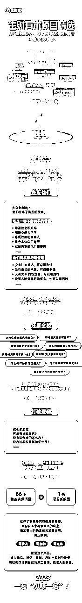

## 《生财 365 问：像赚钱高手一样行动和思考》

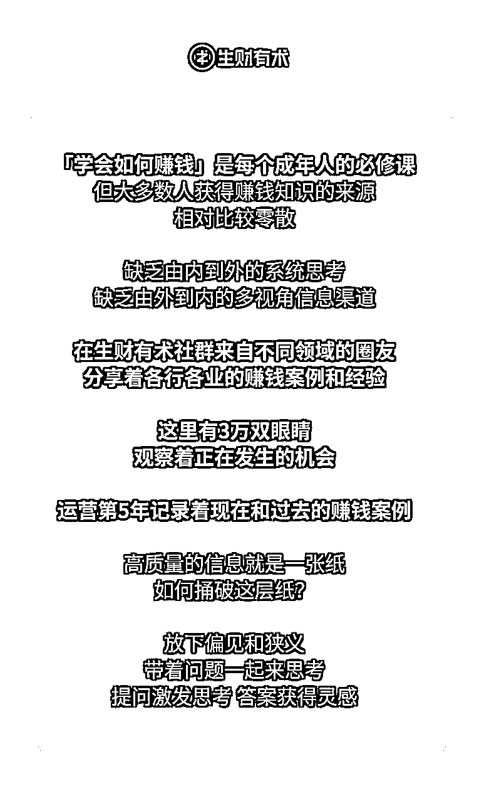

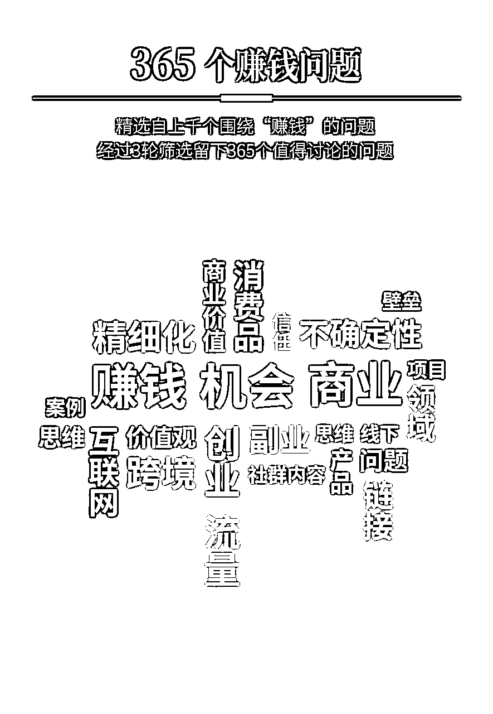

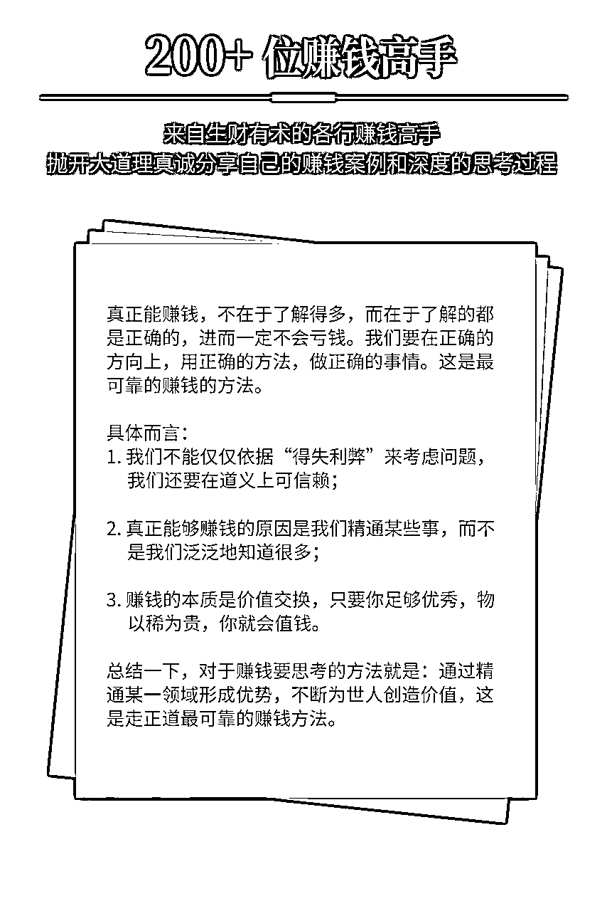

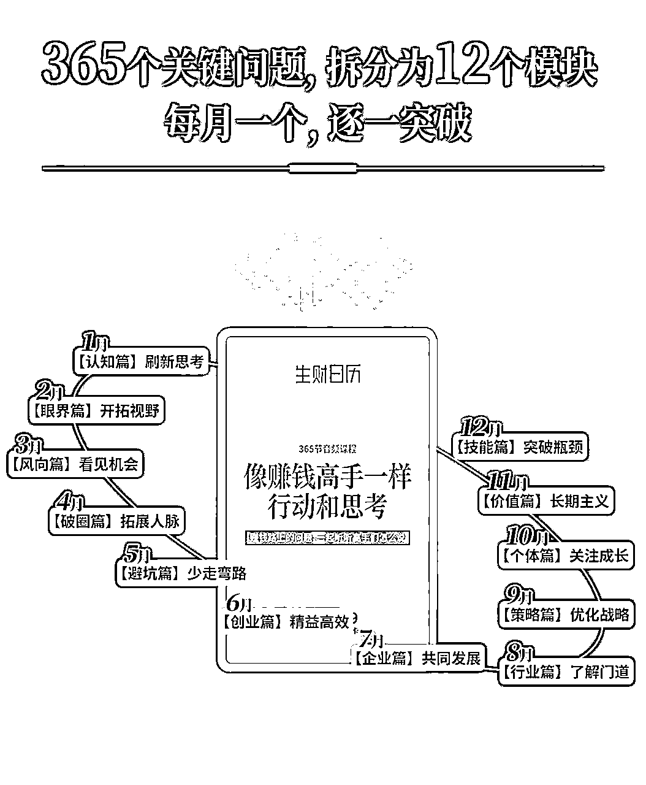

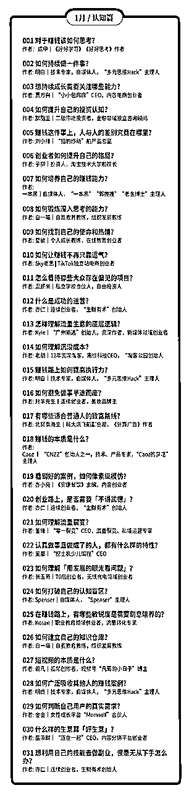

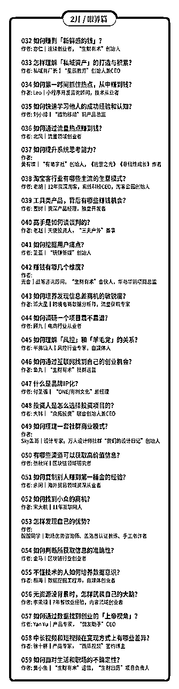

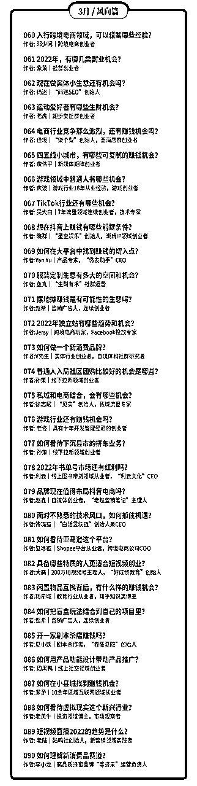

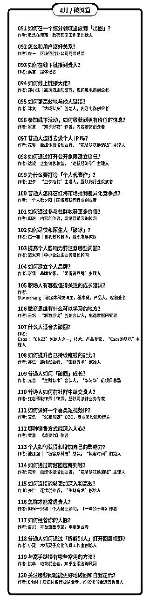

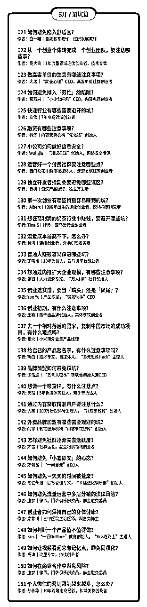

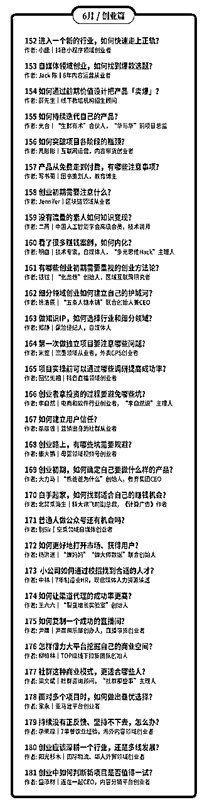

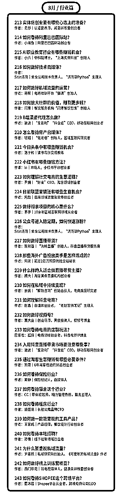

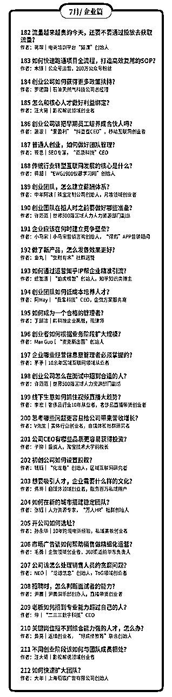

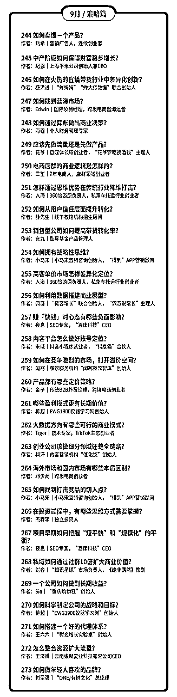

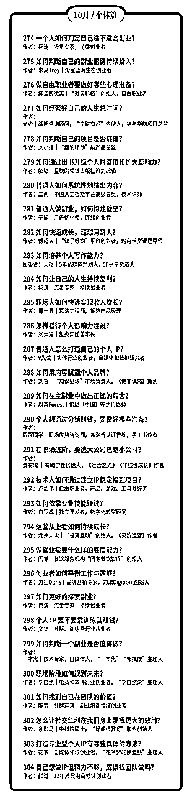

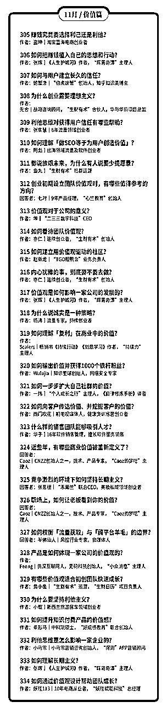

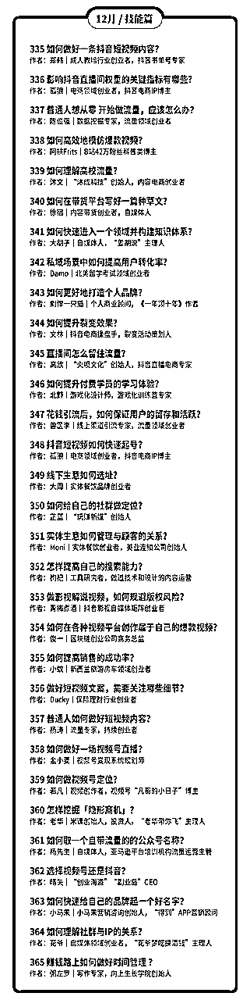

## 《抖音商业 IP 航海实操课》

# 十二、生财发展历程

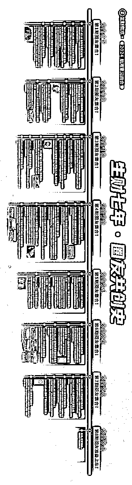

## 生财有术第三期-2020.4

【第四期续费】

对于老会员，大家付费加入生财有术，肯定有满意的，也肯定有不满意的，都很正常。

满意的圈友，我相信你大概率会续费，毕竟 4.18 晚上 20:00，生财有术的价格从持续了近一年的 1865 元/年下调到三位数的价格，加上续费还有 8 折优惠，几百块的价格买生财有术，恨不得喊一句，”老板，给我包十年！”。

不过，这个三位数的价格应该会昙花一现，因为今年仍然是阶梯涨价（每满 X00 人加入价格涨 100 元），还是得拼手速，很可能 8:01 分价格就会飚上去了。

希望今年知识星球的服务器不会卡。

如果你还是担心自己忘记，找我或者鱼丸（ yuwan840 ) 拉你到预约群里，加一层提醒。

对第三期不满意的圈友，先说声抱歉，招待不周让你体验不好了。不管续不续费，都欢迎来向我吐槽，我心理很强大，可以用力吐槽。虽然有些吐槽我不一定改，但每一个吐槽我都会认真看。

【龙珠特殊福利】

龙珠是第三期开始的一个玩法，用于感谢所有为生财有术社群做出贡献的圈友，现在龙珠市场交易价大概在 1000 多一颗，有些圈友手握十几颗龙珠。

除了给龙珠圈友的很多福利外，比如闭门会专享、龙珠俱乐部邀请、会员日特权等等，今天新增另外一个福利：

每有一颗龙珠，可以兑换第四期生财有术门票一张，上不封顶。

兑换时间：从现在开始到 4 月15 日，找鱼丸即可。

【联合推荐】

另外有一件事请大家帮忙

如果你觉得生财有术不错，对你有帮助，正好你还有一些流量，可能是不少粉丝的公众号、可能是几万个私域好友、也可能是有很多互联网相关的群，而你也打算向他们推荐生财有术，那么请在评论区留下你的联系方式，或者私下联系我和鱼丸，我可能可以给你提供一些支持。

如果你想推荐几个好朋友在 4.18 加入生财有术，别忘了用你的推荐链接，我给你留了 20% 的推荐赏金，因为当天是周六，互联网人出去浪的一天，最好提前拉个第四期抢票小群。

但是，想多提一点，推荐给别人的前提是你真的认可生财有术，觉得有价值，切记不要为了赚推荐赏金而去骚扰到别人，这不是生财有术的价值观，生财有术，也生财有道。

非常期待每一位圈友，能够从自己的角度给朋友提一些真实反馈，好还是不好，优缺点，诚实告之。

三年的持续运营和精耕细作，我对于社群的价值还是非常有信心的。

对了，我们近期也会给每一位圈友发一份第三期的成绩汇报单，算给大家汇报下生财有术第三期的一些成果，注意查收。

就这样，4.18 ，星球再会。

## 生财有术第四期-2021.4

1，生财有术第四期期终交付清单

【1】第四期生财有术1000+精华合集

【2】生财有术项目库001-009

【3】大航海计划实战日志&复盘

【4】小航海计划实战日志&复盘

【5】龙珠

第四期龙珠权益清单

第四期龙珠圈友

【6】线下见面会&生财夜话嘉宾分享

【7】12期会员日合集

【8】加入生财有术你赚到钱了没？

还有其他不少探索，比如：

亦仁的收藏夹持续更新中；

给每位圈友赠送了一本生财日历；

组织了万人生财日历共读营；

组织了线上运营团队大家一起玩；

公众号免费推荐了几十位圈友；

发起了生财收入翻倍Flag计划；

帮助不少圈友对接了一些资源；

生财CP正在内测中；

。。。

以上，便是一个不完美的生财有术第四期，请各位圈友打个分？

2，生财有术项目库全新发布

随着生财有术内容越来越多，查找信息和寻找资源变的很复杂，我相信，这不仅是我的痛点，也是你的痛点。

所以，我一直想上线一个项目库，以项目的形式，对内容、资源、圈友、讨论进行一个新的整合。

花了一个月时间，我让团队整理出来了项目库的雏形，本来还想着等再成熟一点对外发布，不过想到一句话，“如果在发布一个产品的时候，不觉得有一点尴尬，那你的产品已经发布晚了”，于是，今天把这个1.0的版本，先发布出来分享给大家，还很简陋，也希望大家提点建议。

现在一共上线了9期项目，每个项目精选了几十篇精华干货，且会持续更新。之后每周会按照上线3-9个项目左右的频率，预计一年后，我们会有100+项目列表，应该几乎会覆盖主流互联网的玩法了，想想还是挺刺激。

上线只是第一步，之后我们会做哪些事？

招募项目内容线上运营成员，一起维护项目库中的内容，保持最新、最干、最清晰；

开启项目库精华共读，以一个主题开始，带着大家一起共读某个领域的道和术，一边学习一边实战，还能交到同频的朋友；

启动项目库内容挖掘活动，很多项目，生财有术未必有合适的实操内容，没关系，我们可以通过小航海等形式，一起来生产优质的精华内容；

项目库资源对接，基于主题的资源对接变成了现实，也可以让大家有更深度更垂直的交流；

对项目库产品进一步升级，可以根据收入空间、所需技能、项目阶段等进一步筛选，快速找到适合自己的项目。

。。。

这一切，应该才刚刚开始。

3，生财有术贵人计划上线

从2021年1月1号开始，所有在生财有术第一次获得龙珠（非转让非赞助）的圈友，除了自己获得的龙珠外，还可以获得三枚龙珠碎片的分配权，我称之为贵人龙珠碎片。

这三枚龙珠碎片，将用于感谢我们的贵人。

第一个贵人：引你入生财有术之人。

我们常说，认识一个人，打开一扇门，很多时候，这扇门，可能是命运改变之门，我们应当感谢他们。

另外两个贵人，可能是帮你融入生财有术星球，可能是某一篇文章让你获得了意外的启发，也可能是给你一些小提醒，还可能夜话中的一番话对你帮助很大。。。

我们每个人的生命中，都会遇到这样的生财有术贵人，所以，请在本帖以提交作业的形式，告诉我，在你获得第一颗龙珠的路上，谁，以什么方式，帮助到了你？每个人最多可以提交三个候选人，并请详细说明原因。

审核通过后，碎片将发给对应的贵人；审核失败（我认为在获得龙珠这件事上，对方并没有帮到你），有且有一次修改机会，再次审核失败，视为自动放弃碎片赠予机会。

所有在2021年第一次获得龙珠的圈友，均可以参与本贵人计划。

## 生财有术第五期-2022.4

亦仁对对第五期生财有术的感受

用一个词，来描述我对生财有术第五期的感受，会是什么？

一上午，想来想去，觉得是：

「太多了」。

人太多了，内容太多了，信息太多了，认识的人太多了，需要了解的项目太多了，想要的东西太多了，希望给的太多了。

如果没有人去喊停，这种不断「增多」的欲望，会把所有人卷进来。

生财有术要控制住自己想要不断变大增多的本能欲望，不要觉得自己无所不能，不要觉得自己很牛逼，聚焦在帮助一小部分人，解决一小部分问题，赚一小部分钱。

知易行难，现在也许是个时间点，做难而正确的事情。

生财有术想要解决什么问题呢？

这有点和使命相关。

生财团队这几年下来，倒是慢慢有了自己的一些使命。

但我不想在星球谈太多使命愿景的相关东西，有点虚，喊口号也没什么实际意义，不如切切实实的想想，我们到底如何帮生财有术圈友多赚点钱，比如，先赚个20倍门票，在产品和服务上花时间、下功夫，这个比较实在，也有价值。

目前，生财有术已经有了一套内容、产品和服务的体系。

我来展开讲讲。

首先，是对于赚钱真正有帮助的内容，提升赚钱认知，获取赚钱情报，了解执行细节。

这个体现为生财有术精华帖。

很多人由于信息焦虑，不怎么看精华帖，挺可惜。

我的赚钱认知提升，主要还是从一篇又一篇实战总结出来的精华帖中获得，来自于各行各业的人的总结，每个人的切入点不一样，学习都角度也不一样。

## 生财有术第六期的交付和成绩单-2023.3

正式给大家汇报一下，整个生财有术第六期的交付和成绩单。

首先，感谢近 10000 名铁杆圈友，在我还没交第六期成绩单的时候，就直接续费让我“免考”通过了。

但是，我还是要给所有的圈友，来一个正式的第六期交付汇报，也欢迎所有的圈友继续提出优化建议，帮助我和小伙伴们第七期向前突破。

前方慢慢进入到一个全新又陌生的领域，这样体量的社群该如何运营，如何更好的服务圈友，有很多新的问题和挑战，既有压力又感觉刺激，不过我想，只要有一颗想带着更多圈友多赚钱的初心，持续迭代，有错就改，挨打立正，最终可能也不会差到哪里去。

废话少说，先上数据。

一、精华帖

第六期一共新增了 500+ 篇精华帖，其中 208 篇为生财团队小伙伴约稿。

生财有术星球已经形成难能可贵的利他分享氛围，大家愿意把自己的干货都分享出来，非常感谢所有乐于分享真诚分享的圈友。

另外一方面，可能跟很多人的想法不一样，官方约稿占比其实也挺高，生财团队的小伙伴和我一起，过去一年，一共沟通了 2000 多位圈友，挖掘值得在星球分享的内容，最终形成了 200 多篇精华帖。

我每周要开的最重要的一个会，就是星球分享的选题会。

二、风向标

风向标是第六期的黑马，后起发力，现在已经成为很多圈友必看的栏目。

整个第六期，我们一起共创了 13000+ 条风向标，我从中评选出了 2000+ 条具体的赚钱机会。如果要说商业思维提升最快的方式是什么，熟读这 2000 条风向标，搞清楚这些是怎么赚钱的，可能会比星球的 99% 以上的人还要懂赚钱。

三、航海实战

何以生财，唯有实战。

为了让更多人参与，让更多的选题出现，第六期航海在去年 6 月份进行了一个大改版，中间还经历了内外的很多质疑声音，幸好从结果看，这次改版被证明是对的。

第六期一共进行 82 场航海实战，累计带领 1.2W+ 人、共 4.3W+ 人次下场实战

累计 1530+ 志愿者人次和 140+ 领队人次参与航海运营；

累计上线 75 份航海实战手册，平均每份 3-5W 字；

累计约稿了 600+ 场航海高手分享

累计沉淀 9600+ 篇实战问答；

累计沉淀 30W+ 份航海实战日志，产出 1W 份实战成绩单和 5500+ 份成长故事

看到越来越多的圈友通过航海取得突破，从赚小钱到赚大钱，我和团队都非常有成就感。

四、线上&线下活动

第六期线下活动搞的不多，今年过年后，才能逐步的开始组织各种线下活动。

2 月份的航海同城小局在 40+ 城市开放，共进行 98 场线下小聚，累计 534 人参与

这周末举办的生财有术 2023 全国见面会，也有共计 1000+ 人参与；

另外共进行 12 场会员日，超过 1.6W+ 人次参与。

五、会员服务

不得不提一下会员服务，看到数据，只想说，鱼丸真不容易。

统计了一下，整个第六期，鱼丸共与 18559 位圈友产生服务对话， 发送 88W+ 条信息，回复 69W+ 条圈友信息。

我经常收到反馈说，鱼丸真的非常体贴，经常记得不经意说过的一些话，提过的一些需求，知道了，这一期结束给鱼丸加鸡腿。

六、精华索引工具

在第六期开始时，生财上线精华帖索引工具 2.0 ，据说现在已经成为很多圈友的第三大搜索引擎，赚钱遇到问题，来搜一搜，基本都有。

另外，最近小伙伴们还为第六期 10000+ 篇主题帖（其中资源对接 3500+ 条，问题求助 2300+ 条）和往期共 3917 篇精华帖完善标题和标签，可以点击置顶帖里面的链接去感受下现在刷精华的感觉

以上，就是第六期我和生财团队交出的成绩单。

当然，除了做的好的地方，也有一些地方没做到，比如，上一期开始时提到的我的生财笔记，我发现要去深入调研一个项目，花的时间比我想象的要多很多，正好看到风向标里面的信息越来越多，价值越来越大，对我的生财笔记替代性很强，而且我平均每天几乎要花一个多小时才能评完所有风向标，所剩时间无几，权衡利弊，最终放弃了这个专栏，感到很抱歉，感谢各位圈友的不杀之恩。

凡是过往，皆为序章。

新一期生财有术已经开启，更多精彩故事，我们第七期见！

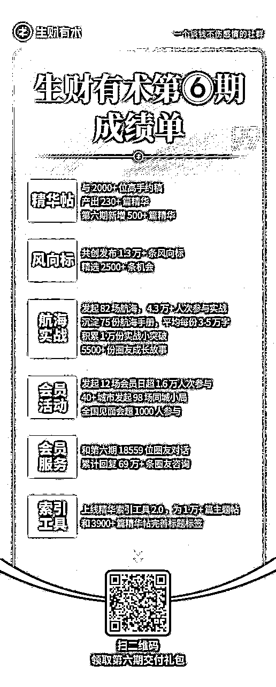

## 第七期生财有术交付总结-2024.3

开始之前，我想先感谢近 70% 已经续费的圈友，你们在我没有分享新一期我们将往哪里走的前提下，就给出了无条件的续费支持，让我有更大的勇气和力量，去做一些新的突破和尝试。

到了生财有术第七年，其实产品和服务已经基本稳定，按理来说，不应该再主动追求“变”，而应该稳住“不变”，抓住机会持续放大，这才是一个正常理性创业者应该做的事。

而且，这么多年确实沉淀了很多“不变”，精华帖、风向标、航海实战等这些都是不变的价值，做好这些，就已经算不错了，对圈友来讲，这张门票的投资性价比可能就不算低。

但我经常问自己，现在的生财有术真的能够帮助到更多普通人赚到更多钱，实现大家想要的自由了吗？真的是我理想中要的东西吗？还有哪些地方要进化可以帮助到大家更轻松、更体面、更低成本、更开心的达成目标？答案是：革命尚未成功，同志仍需努力。

要变，主动求变。

不过既然是进化，肯定有成功，也会有失败，而且失败的概率还不低，就像我们赚钱所做的大多数尝试一样，常常失败，偶尔成功，这是人生常态。

所以，以下进化的想法，是我对于未来生财有术演变方向的一些设想，但能不能做到还依赖生财团队和很多圈友一起努力，也希望大家预期调低一些，如果我们能在第七期结束的时候，做到其中的一些，我自己就觉得这一年还不错了，你觉得呢？

普通人想赚钱，赚大钱，持续赚大钱，谈何容易，每个拿到结果的人，都是一路过关斩将过来的，对于我们大多数普通人来说：

一缺少看懂商业底层逻辑的认知；

二缺少能转化为赚钱机会的信息；

三缺少真刀真枪下场实战的勇气；

四缺少解决具体问题的经验技能；

五缺少同频真诚互帮互助的战友。

围绕这些点，生财有术前六期做了很多事情，也有一些取得了成绩，新的一期，我还想试试下面这些事。

一、上线一套生财思维认知课

随着生财有术的破圈，吸引到了一些基础还比较弱的圈友，对于商业的理解不太够，思维模式和认知还没有改变过来，包括有一些老圈友，一直在实践，缺少体系的整理和总结，而想赚钱，要先学会会赚钱人的思维方式和方法论。

所以这一期，我想制作上线一套生财思维认知课，提炼上千位拿到结果圈友的思维认知，跟上他们的思考方式，可以帮助我们少走很多弯路少踩不少坑。

二、升级生财内容索引站

去年上线的近两个亿字的索引站，沉淀了大量有价值的信息，可惜的是，做的分类整理不太够，导致很多价值没有更好的被挖掘出来。我希望将生财索引站真正的打造成为创业领域的第一搜索引擎，降低大家信息获取成本，这一期将尝试组织建立上百个垂直细分主题专栏，让每个人都能轻松快速地找到自己想看的资料。

三、升级风向标模块

将风向标从信息的共创分享，变成更有体系的挖掘和拆解，尝试风向标领读领教，让信息可以更快的转变成落地的项目，比如 24 小时风向标落地快闪，让更多人可以参与其中。

四、升级航海模块

将生财整体的交付变成平均两个月一次的航海活动，不管是想阅读精华、参与实战、链接交流，都可以在航海中找到一群人一起。

尝试生财AI，AI导师、AI航海教练、AI鱼丸、AI亦仁等，让个性化的反馈更及时更专业。

尝试建立垂直航海进阶圈子，让航海教练们可以一起合力共建课程共享价值，让通过航海取得结果希望进一步深耕的圈友，可以进一步交流与合作放大。

五、加强同频圈友的链接

让愿意服务帮助更多其他圈友的圈友浮现出来，帮助他们建立IP输出影响力，成为生财的大小节点，同城、职业、技能、身份、阶段等各个维度，都有相应的圈友愿意组织活动和小圈子，带着大家一起学一起赚一起玩。

六、生财产品孵化对外

风向标产品化，航海产品化，生财思维课产品化，资源对接产品化，不同的产品独立帮助不同阶段的用户。让愿意深度参与的圈友，可以一起把这些产品变成自己的事业，将有价值的产品分享给更多人。

七、上线资源对接小程序

让几万名圈友的高价值资源，在一个信任的环境中高效流动与连接。

八、打造出一个高信任的航海家俱乐部

在航海家俱乐部中启动探索，建立合作孵化的框架与龙珠参与机制，让更多有能力、有想法、深度认同生财有术的圈友各自发挥优势，贡献能够被合理评估与认可，短期可快速启动，长期可持续发展，让航海家俱乐部成为生财有术有结果圈友的最有归属感的圈子。

九、成立生财社区基金

小投快帮，帮助有价值的想法从0到1，提供资源帮助项目落地和放大，并反哺帮助生财更多圈友走出第一步。

以上，是我对于第七期玩法的一些设想。

当然，想总是容易的，做起来是很难的，单靠我和生财有术团队肯定无法完成这些事情，也欢迎更多的圈友一起参与进来，完成这些有趣好玩又有价值的事情。

## 第八期权益解读

以下来自生财有术创始人亦仁，发布的帖子内容：

截止到 29 号晚 20:00，已经有超过 7000 位圈友，在生财有术第八期开放还不到 24 小时就完成了续费。

感谢这么多伙伴，在我还没公布第八期将有什么新变化时，就愿意坚定地支持，感谢各位！

生财有术现在有哪些进行中的交付，大家都是亲身体验过的，我又做了一张权益海报，请大家点击附图查阅，如果你有朋友想了解生财有术，也可以把这张海报转给他。

不过今天，我重点想和大家聊聊，生财有术接下来要带着大家往哪里走，这是过去的一年，我一直在思考的战略问题。

我认为，作为生财有术星主，我最重要的事情，不是去追热点搞流量，不是去做IP，不是去直播，不是去优化交付细节，不是去组织更多的大会，而是找到一个适合我们的战略方向，让我们这群人，可以在下一个七年，越活越好：钱越赚越多，人越来越幸福。

现在已经有一些想法，并且大多数都在落地中了，借着这个机会也和大家再分享下。

第一个，要变成更垂直化的生财有术

不垂直就没有深度，没有深度，就只能赚一点很短期的钱。我希望带着大家都能够朝着 10 倍以上的空间出发，所以生财有术必须得垂直化，并且在第七期已经做了很多尝试。

某些正在发生的趋势，比如，视频号、小红书、抖音、AI产品、TikTok、出海等方向下，我们会深度的将案例、情报、课程、航海、圈子、资源等整合，帮助大家一站式获取到自己想要的。

第二个，为圈友提供不同的产品和服务

生财有术有两类典型用户，一类经验不多，想做个副业，赚一点小钱，他们的目标是先找到正反馈。另一类是跟着生财已经有过多次实战，也已经选定了深耕的方向和项目，他们的目标是放大结果，保住胜利的果实。

所以，围绕这两类用户，航海也会有改变，朝着两个方向去迭代：让新手上手更容易，让老手可以持续专注并获得高手支持。

包括航海家俱乐部，在下一年也会持续迭代，变成从生财成长起来的老手、高手和老板们的核心根据地。

第三个，深度打造生财同城生态

如果说第七期生财有术加强了同城圈友的连接，那么下一年，将朝着让同城的圈友更高效连接的目标出发，希望在每个核心城市，都能让你找到不少深度同频的伙伴。

包括在各个城市举办航海线下场、同城大咖线下众筹课、城市志愿者体系、同城合伙人体系等，这些都将是会去尝试的方向。

第四个，扩大圈友的孵化

在第七期，我开始尝试做孵化和投资，投了 50 个左右的微天使，5个大天使，虽然数量不多，也没什么大成绩，但过程中拿到很多有价值的体感和反馈。

第八期，圈友的孵化和投资将进一步扩大。

包括组织操盘手对接大会、IP孵化和打造、微天使、大天使、联合办公、路演日等。

甚至于，我已经将生财有术下一个七年的愿景更新为：

通过孵化和投资，成为 1000 家圈友初创企业的股东，带动 10 万新增就业。

孵化和投资，我是完全的新手，我也非常理解过程中的各种困难，但我相信这个事情巨大的价值，帮助优秀的圈友从0到1并从1到10，值得花七年以及更久的时间去做。

硅谷有个YC孵化器，我希望再过几年，中国也有个很牛逼的孵化器，它的名字叫 SC孵化器。

计划总是赶不上变化，但当我的愿景变得更大之后，其他问题就都不是什么大问题了，有的只是持续稳定地前进。这一路，期待与你一起同行。

对于一个付费社群，七年可以说是已经走了很远的路了，大多数同时开始做的社群都销声匿迹了。但对于一个想帮助更多年轻人建立和扩大自己的生意的社群，对于希望成为 1000 位圈友的联合创业伙伴的社群来说，我觉得，这一切，才刚刚开始。

扬帆正当时，下一个七年。

## 第八期权益海报

# 十三、关于生财有术的星球问答

## 怎么介绍/推生财-2022

1.  不感兴趣很正常，真正对赚钱感兴趣的只是少部分人；

1.  “这是一个有很多赚钱信息的地方”，如果这句话不能让对方感兴趣，说再多也没有太多作用；

1.  对方不是不理解，只是不符合对方的信念和逻辑；

1.  圈子要升级，尽量远离对信息不够开放的人，特别与钱相关的信息，长期来看，这些人没什么太大的好运气；

1.  我如何看待开放？本质上是连接。让外界的各种信息可以连接到你，让你的信息可以被外部连接到；

1.  连接越多，发生质变的可能性就越大，越容易有意外的超级好运发生；

1.  一个人封闭在自己的小圈子，既不去了解和接受外部信息，特别是离钱近的信息，也不对外表达和分享，特别是开放空间的表达和分享，基本上可以预测，他的收入变化很小，可能通过勤奋努力能够从月薪几千到几万；

1.  但很难真正的产生财富质变，从几十万到几百万到几千万，这种事情在封闭的人身上很低很低的概率发生；

1.  你可以环顾下，你注意到的那些财富跃迁的人，是不是很开放、乐于分享的人？

1.  开放与乐于分享增加了成事的概率，努力和执行也需要，但从长期来看，产生本质区别的，往往是前者。

1.  再往前看一步，为什么连接带来价值？

1.  我们赚来的钱，基本上是因为我们给这个世界创造了价值增量，被分配了一部分；

1.  从经济学角度来说，交易产生价值。而对于交易来说，本质上是交换；

1.  大规模交换的前提是大规模的连接，之后才产生了交易的可能；

1.  所以，让外部的信息和自己连接上，让自己的信息更大规模外部显现，开放出去接口，可以让更多信息更快的连接上，从而产生了价值创造的可能，从而产生财富跃迁的可能；

1.  我的意外好运来自哪里？2017年初，有两件事很重要：加入了曹大的星球，开始写公众号，之后突然生长出了生财有术；

1.  所以，对于离钱近的信息极度开放，增加公开表达分享，此两点，将大大增加我们财富跃迁到下一个数量级的可能。

## 拉新如何解释生财的优势-2022

1.  与哪些人在一起，比去哪里更重要，如果是我，当然是与能付高价愿付高价的人在一起；

1.  重要的不是有多少资讯和信息，而是消化吸收了多少，然后带来的真正改变是什么，最后体现在财富上面的增加是多少，以及这个社群是不是也是这个思考逻辑和做事方式，并以此作为团队的目标；

1.  生财有术今年重点不是堆内容，而是实干，帮助每个人找到自己的实战路线，抱团行动，下场去干，知行合一，避免眼高手低，目前的实战体系的积累：大航海、小航海、mini航海、实战日、志愿者团队、船长、实战氛围、高手教练、项目选择和判断、情报源；

1.  市面上大部分项目和信息的源头，可能是从几个圈子流出去的，生财有术是其中比较重要的一个；

1.  生财有术社群里面圈友真诚、空杯、开放、利他、平等、实干的价值观，短期影响可能看不见，长期影响对赚钱的帮助会很大，坚定的相信并践行这些价值观，赚钱的事情会越来越稳，而在这个圈子，因为看见就有机会相信；

1.  星主对于项目、信息、实战方向的判断，起着不小的作用，今年我向上看向内聊，出去特别是出海看更多机会，并以项目如何做的形式分享出来；

1.  被动接受信息的人，都被锁在了信息茧房里，学习与赚钱都需要主动获取信息，当你想主动获取信息时，生财有术是一个1亿3000万字的赚钱词典；

## 生财的长期目标是普通人还是老板-2022

问题质量非常高，可以可以。

结合生财有术自己的优势，以及对方对自己的改变欲望，生财有术交付侧重会在这类人身上：

有强烈赚钱欲望的普通人。

这些人像干柴，一点就能成为烈火，还能燎原带动更多人。

## 生财有数的大道是什么-2022

大道至简，这些大道理我们小学的时候就都听过，只是我们听的太多，习以为常而忽略了，反而被一些标新立异的概念和逻辑所吸引。

在我眼里，真正的大道都是如下面这样的：

诚信，本分，物美价廉，对用户好，对团队好，对合作伙伴好，赚取合理利润，多让利，注重产品，持续创新，保持长期健康。

## 重新开始不做生财亦仁要做什么-2022

我可能会选择去做一个海外工具网站吧，闷声发财那种。

依据是：

1.  海外竞争要小很多，国内太卷了，政策风险也大，做大了有不安全感。

1.  回归我的老本行，做海外工具，我知道怎么挖掘需求，怎么和客户沟通，怎么做产品，怎么设计收费模式，怎么引流，怎么投放等，在我的舒适区。

1.  海外工具站有一定的壁垒，不是小个体或者小团队可以轻易复制的，能活的比较滋润，做的好的工具站，一年也能有上亿利润，而且进可攻融资成为SaaS独角兽，退可守赚钱闷声发财。

1.  海外还是非常依赖谷歌的搜索流量，短期没什么大的危机，做好了工具站，能力可以迁移到下一个工具需求再来一遍。

## 生财的危机有哪些-2022

危机可能有几个：政策、破圈、人员筛选、信息和链接质量、内容产品化、方法论沉淀、团队培养、我、组织分配等。

现在对我来说，最难而正确的决定恐怕就是第六期能不能大胆提价，将人数规模控制下来，进一步做好筛选，来提升信息和链接质量，进而提升成功案例率，风险是人数和收入会大幅下滑。

很多事情知道容易，难的是知行合一。

## 如何看待生财遍地是成功案例-2022

如果把赚到钱定义为成功案例，那么生财有术的成功案例率，确实比一般群体要高很多（但也不是遍地都是），我认为高很多的原因是：

1.  生财有术付费社群的机制，把更容易成功的人筛选了出来，就像清华北大，通过高考机制，筛出来的都是最容易成事的人；

1.  垂直付费社群内的人与项目、人与资源、人与人的连接效率更高，更容易产生成功案例；

1.  成功案例会催生更多的成功案例，就像学霸会影响更多身边人成为学霸一样；

1.  生财有术的运营会帮助一部分人更快的拿到结果，比如大航海小航海，可以规模化的帮一些赚到钱；

1.  大家的注意力在知识星球这种产品形态里会被聚焦在在信息流里面，会让人感觉成功案例遍地都是；

1.  成功案例如果有可复制性，那么就不算一剂春药，大部分生财有术的成功案例，都具有可复制性，听话照做，大概率能产生差不多的效果。

1.  不必仰望也不必俯视成功案例，平视即可，取长补短，拿来有价值的为我所用，最终让自己变成一个成功案例。

## 公司招人吗-2022

最近正在策划下一个会员日（2.18）的活动，主题可能是：

生财有术春季项目与人才连麦会。

生财有术团队也会作为其中参与方之一，期望招募优秀人才。

还在策划中，有兴趣的点个赞，人多就搞。

## 从0-1航海亦仁的建议-2022

1.  航海中选到的项目，路一定是通的，都有大量在平台赚到钱的人，不需要我们去颠覆创新，我们需要去做的是找到合适的对象抄作业，挤进去分一杯羹，所以不要怀疑犹豫，坚定执行；

1.  在新的领域，大量的坑还是会重新踩一遍，哪怕你在自己的行业和领域是高手，早点通过行动踩完所有的坑早点赚到大钱；

1.  如果大多数新手选择了A，你最好绕道而行或者有不一样的做法，如果你已经有了一些经验的话；

1.  最好的下场时间不是航海开船之后，而是现在立刻马上，完成账号的注册，看一篇定位相关的文章，拍一个视频或者去选一个品；

1.  没有适合自己的项目，只有你想调整自己适合哪个项目，如果你不知道，那就随便选一个开始，积累的赚钱能力是通用的；

1.  什么项目都不容易，都比想象的更难一点，还好我们有一群一起突破的人，会让我们不会那么孤单，而且这其中有学霸，可以让我们抄作业；

1.  赚钱是一个复杂能力，从不会到赚到钱应该放在半年到一年比较合理，好消息是一旦突破后，之后这个能力就永远长在你身上了；

1.  照着做就能赚到钱的项目，大多数时候是个坏项目，你需要加一点东西进去才行；

1.  我们都不是高手，但将每天遇到的问题和怎么解决的方法分享出来，就可以帮助到很多同行人；

1.  重要的不是每天投入很长时间，能投入当然更好但那不太现实，而是每天都投入一点时间，保持我们的注意力在解决具体的问题上，做具体赚钱的事情上；

1.  完成航海作业只是底线，你肯定有更高的标准和要求，如果你有一颗想赚大钱的心；

1.  能在一条船上同时航海的人，都是巨大的缘分，尽所能去帮助彼此，航海结束后，会收获比赚到钱更有价值的东西；

1.  任何问题，问之前至少先搜索十分钟，实在没找到答案再提问。

## 生财项目失效了吗?-2022

市场上有一种说法，生财有术里面分享赚钱的方法都是快要失效的；请问亦仁您认同这个观点吗，您怎么看？一个项目出来，刚开始的玩法，等到自己开始实操，发现玩法已经变了，在去问发帖子的人，需要付费学习，这个玩法迭代太快了怎么办？

如果你能找到比生财有术更快分享更真诚分享的地方，也可以告诉我。

从来没有人无缘无故的把自己的赚钱方法分享出来，因为生财有术有一些氛围和机制，大家可以相对开放和真诚的聊一些自己赚钱的东西，仅此而已，不要抱太高的赚钱救命稻草的预期。

看分享的时候，重点看逻辑，看项目是否能跑通，看机会和空间，然后自己去组合出新的玩法出来，不看具体的方法。

## 生财营销话术怎么设计-7点干货-2022

其实这不是一个营销话术的话题，而是一套产品如何从0到1的话题，涉及的面很广，很难三言两语立刻让你理解。

我给你7个方向，方便你学习和思考，也是借题发挥和所有生财有术圈友分享了。

1.  换位思考洞察用户需求

充分沟通，站在客户的立场和角度，理解用户的需求，这是他购买的最真实的理由。

需求不对，靠冲动和新鲜感带来的消费都不长久，总有一天客户会醒悟，大骂一句被忽悠了。

1.  基于用户需求设计话术/产品

什么叫产品？

万物皆产品，只要能满足需求。

一套话术，一段文案，一个眼神，一个电话，一篇文章，一个课程，一个商品，一个咨询，一个关心，一套方法论，一本书，一次交谈，一个回答，一个社群，一本日历，一套方案等等。

以上皆是产品，只要能解决对方的问题。

从这个角度，我们说创业要有自己的产品，是不是感觉创业容易多了？

1.  给客户完整解法不让用户思考

客户的所有顾虑和疑问你都已经考虑到，并提前体现在产品上，或者提前告诉他。

把客户想成是一个脾气暴躁的、没有耐心的、智商不高的、贪心虚荣的一个人。

在这个客户说之前，你就满足了他的需求，你的成交转化率自然就上去了。

1.  产品专业性稳定性便捷性的介绍

产品本身好之外，还需要专业的呈现，也就是价值包装，让用户能清晰的感知到，这产品太好了，这特么就是我想要的，众里寻她千百度，快说，多少钱？

1.  用自己的短期利益让出换取客户的长期价值

你以为上面你想到的别人想不到做不到吗？太天真。

让出一部分你的利润，以让人舒服的方式转让给客户，满足客户被照顾、专属待遇、占了便宜、有面子等感受，最终成为你的铁杆客户。

想想豪车毒老纪的例子。

1.  真实真诚不以成交为目的，而以帮助用户解决问题为目的，恰好你的产品非常精准的满足了用户需求

如果你定位做一个销售，那客户永远是你的对立面，客户和你的利益之间的博弈永远存在，要么你多花要么我少赚。

换个视角，定位成这个问题的解决专家，这个问题分为四大类三十六小类，每类最好的解法是这样这样，你的这个问题属于哪一类，我推荐你去买隔壁的什么，我的这个产品对于后面三类的，如果你有需要来找我。

你听了感觉怎么样？

客户是不断成长的，未来他有需求第一时间会想到你。

就像有一些老板要加生财有术，我说的很明白：老板，生财有术主要是讲赚钱方法，定位就是术，讲的是如何找项目、做项目，如何赚到十万、百万、千万，你现在的体量建议听混沌的课，我也在听，帮助挺大。你不差钱，那也买生财有术，就当随便看看了解大家目前在玩啥。

1.  整个成交体验中，让客户充分的超预期，给出部分利益和合适的体面的理由让客户转介绍

记住一个点，没有几个人是为了赚一点分销费用帮你转介绍。

所有转介绍的前提是，你的产品过硬且超预期。在此前提下，给出用户帮你介绍的利益和思路。

这里面的思维要从「用户思维」转成「用户的用户思维」，这可以帮你更快的达成转介绍。

没有人想当一个赚朋友钱的人，但我们都想当一个帮朋友忙的人。

说了这么多，你会觉得这事不简单，甚至有点难，但是难却正确，才是你的核心竞争力，对不对？加油吧。

## 生财如何在众多社群中特别-2021

每个社群都要有自己的特色。

说实话，现在很多社群都在抄生财有术作业，从发售到内容到活动到实战到线下到组织形式，甚至文案、配色、规则都直接抄，最后卷的我只想放弃生财有术很多独创的有意思的玩法。

简单的抄作业，真的没意思。

不一样，对我很重要。

但生财有术终究还是会很不一样，它会有自己一条独特的路要走。

## 日历裂变群的多个提问-2021

沐文¹:

1、非常想了解一下：亦仁老板创业四年多以来，是如何让自己和团队始终“保持初心”

有没有每天都坚持在做事情呢？一些小事情，但是在你看来非常好，也非常值得坚持下来的~

亦仁:

初心是想带着大家赚钱，在这个过程中，我的目标和大家的目标是一致的，我带大家赚到钱，短期和长期我都可以赚到更多的钱。所以保持初心对我来说并不是一件困难的事情，也不用说告诫自己去不要忘记初心。

我很少坚持去做一件事情，我觉得一件事情如果说要去坚持，是很难真正的长期做下去的，而是应该选一件最顺应自己心意的事情来做，充分的了解自己的长处和优处，规避短处，然后选一件自己最擅长最喜欢的做的事，就一直做下去了。

我从大学开始就很喜欢赚钱，也喜欢研究赚钱，然后分享赚钱的事情对我来说是一件乐趣，所以就一直做下来了。

沐文¹:

2、亦仁老板可以说对很多行业的认知都非常高，没有做过一个行业，但是会对这个行业的信息格外敏感，例如：抖音、快手、视频号等等，看你在星球发的帖子都非常“有信息时效”也很贴近“项目热点”，是如何刻意练习成的？还是有一个信息筛选库

亦仁:

底层逻辑都是相通的，当建立起自己的思维模型之后，不断的去追寻更本质的模型是什么，这些更本质的模型可以帮助你更好地理解这个世界，类似马斯克说的第一性原理。

所以在思考一个问题的时候，要不断的往上去抽象，抽到最本质的层面，这个层面可以帮助你更好的去理解很多事情。

沐文¹:

3、“收藏夹”已经上线一个月的时间，内容已经非常充实了，我非常想了解一下这个“收藏夹”的相关数据，打开率之类的，想看一下短平快的碎化信息，大家的使用程度

亦仁:

收藏夹是我非常喜欢的栏目，但是目前的数据不太好，每一个帖子大概只有几百个人看，我觉得主要是知识星球产品和这个栏目不太匹配，继续运营一段时间后，可能会换一种形式。

沐文¹:

4、2020年4月到现在，生财可以说发送了非常大的一个改变，无论线上还是线下

例如大航海之后的小航海计划，例如线下见面会后的同城夜话，都是一个模块的迭代和递进

这是原计划在内的，还是在执行中获得思路及时迭代进去的？

亦仁老板是如何看待：以使命驱动的执行路径本身的迭代的？（就是如何及时把路径上的关节去迭代、优化）

亦仁:

很多东西是在一边做的过程中一边想到去迭代的，并不是一开始就规划出了很多清晰的玩法和活动。但是对于要解决的问题，我倒是十分清晰的，并且一直在想更本质的问题是什么，不要被一些表面的问题遮住双眼，找到最本质的问题，然后去不断的设计，更贴合用户体验的方案，收集反馈，再迭代再去设计。

如何能够持续不断的去迭代？我觉得归根到底，是你对这件事情的热爱。

如果没有那么热爱，那至少要给自己不断的正反馈，让自己赚到钱，让自己获得影响力。

做一件事应之前一定要想清楚这件事情在长期你想要获得什么。

自己的开心才是真正的长期动力。

沐文¹:

5、亦仁老板喜欢玩游戏吗？现在生财“游戏化”非常重，很有趣，感觉是一个爱玩游戏的人设计的社群。

亦仁:

不太会玩游戏，主要是觉得玩游戏很浪费时间。

确实融入了很多游戏化的设计，我觉得与人打交道，一定要顺应人性，不要去与人性对抗。

同时要能够充分的理解和接受人的贪嗔痴，并且站在一个更高的视角去想，如何让人更好的成长和发展，以顺着他们能够接受的方式去帮助他们。

## 亦仁想影响那些人 想达到什么结果-2021

好问题，我就不长篇大论，简单说一下。

1.在你心目中，你最主要想影响到的圈友是哪部分？哪类人?你期望对这些人达到的具体的影响效果是怎样的？

主要想帮助80%的还没赚到第一个一百万的圈友。

希望帮助他们：建立信心，开始行动，获得正反馈，持续扩大收益，成为榜样，继续向下传递。

2.哪些人能出来影响？如何让这些人的影响力持续的输出？

生财团队，志愿者团队，生财有术嘉宾，龙珠圈友，各种榜样，普通圈友等，共同出力。

这些人影响力持续输出的关键点，不在于激励他们输出影响力，而在于持续的有新的榜样成长出来，这些人继续带动更多人。

看到别人在努力利他，会有更多人加入进来，哪怕中途有一些人离开。

3.这些人的影响方式和内容如何最有效的到达到目标群体？以及这些内容和方式的价值如何再更多的转化？

如何最有效在我看来，根源在内容和项目，以及组织的设计能够推动这些内容和项目被吸收、被尝试，进而真正帮助到大部分人「改变」并「赚到钱」。

组织设计的源头在于组织的激励机制，因为这是一个使命愿景价值观都足够清晰的事情，激励机制考验的是格局和心力，我也正在慢慢修炼和突破。

## @杨涛：生财的模式是你拍脑袋做出来的吗-2021

涛哥提到生财有术很多有意思有价值的想法和玩法，看似好像都是我脑袋一拍，然后就出来了，没有非常体系的规划，缺少计划性，团队没那么适应，涛哥问我是不是这样。

我说是，也不是。

从形式上来看，很多事情看起来都是这样的。

但实际上，不是。

我思考问题，几乎所有的时间都在思考最不确定的部分。

因为长期思考商业模式、产品、运营、机制等，我凭经验和直觉基本可以非常快速定位到哪个点，是当下确定性最低而又非常影响全局的部分，然后在那个点上反复琢磨和思考，不断推翻和重建。

甚至有时候，在团队来看，亦仁有拖延症。

但是关键不确定的点一旦想通了，整个事情的推进就会势如破竹，感觉特别顺，没遇到什么门槛一样。

确定性高的部分，哪怕我自己团队搞不定，只要愿意付出的成本足够高，也都能找到合适的解决方案，那就不需要把非常宝贵的时间资源投入去思考这些确定性高的。

比如，最近有圈友找我反馈，说感觉最近生财有术内容质量有点不如从前，我回复收到了，也感谢反馈，但我并不会因此立刻就去解决这个问题，因为短期内容质量提升在我的眼里，是一个确定性很高的事情，我有很强的经验和信心来提升这块，那反而不急。

反而是，长期内容的心智建立、生产机制设计、激励模式、利益共同体、内容商品化、内容分发模式等等，这些不确定性的模块，没有人会代替你去想，要更早的想清楚。

做社群，还是要多想少做。

## 2021年让生财收入翻一倍-2021

结论：先解决系统性风险，收入翻倍知识时间问题

做哪三件最重要的事情，可以让生财有术2021年的收入翻一倍？

这个问题我也想过，脑海里也有清晰的思路和明确的打法，不过说实话，这不是我最近考虑的主要问题，只要生财团队踏实做事，把握好节奏和心态，收入翻倍是迟早的事情，即使今年做不到，明年、后年也有机会（凡尔赛仁）。

查理.芒格说：“如果我知道我会死在哪儿，那我一辈子都不会去那里。”

上次也有人问我，生财有术面临的最大风险是什么？以及应对方案是什么？

这个问题比生财有术如何赚到翻倍的收入更有价值，我花点时间在此帖来慢慢更新下，先点赞吧。

第一个风险：政策风险。

只要是与内容相关的产品，特别是涉及到UGC，很容易踩雷，包括生财有术社群本身和知识星球APP，考虑到有两次这样的先例，再来一次也是有概率的。

说下我的应对思路：

1.  将大部分会员同时备份到微信好友上，包括鼓励添加鱼丸好友，以及我的个人号，目前生财有术的CRM也在开发中，也希望大家及时将微信与星球账号绑定，关键时刻，可以联系到大家。

1.  对于涉灰涉黑等内容，绝不留情，第一次删帖警告，第二次直接踢出，这不仅仅是价值观问题，而是生死线问题。

也成立了线上小分队，现在有上百人的规模，有问题的内容，可以非常快的发现和处理。

1.  对于星球历史内容做了一些备份，以防不时之需，希望这一刻不要到来。

1.  想办法与政府做一些接触，解释清楚我们社群在做的事情，在大的方向上，比如创业、副业等，是与政策一致的，同时邀请政府的一些官员（如果可能的话），来星球和线下活动，了解我们在做的事情，不求政府政策倾斜，只求努力沟通不被误解。

1.  更多的赋能给一些认真做事的圈友小伙伴，在能力范围内，且认真做事的圈友需要一些冷启动流量和支持的时候，我们可以没有利益诉求的去帮他们。即使未来生财有术出了政策问题，在那些小伙伴的帮助下，还有机会再次起来。

1.  认真踏实的经营好生财有术这个品牌，爱惜自己的羽毛，赚该赚的钱，不赚不该赚的钱，让品牌的势能足够强，同时低调做事，不让名气超过自己的实力。即使有一天，载体出问题，需求在，信任在，杀不死的只会使它更强大。

1.  与@wulujia吴老师进行更多的沟通，特别是风控上请求更多的指导。

第二个风险：社群人数增加带来的各种问题。

（待更新）

第三个风险：由我带来的各种风险。

（待更新）

第四个风险：价值提供出问题。

（待更新）

## 刚加入生财，怎么看精华文-2020

点击右上方搜索，选择日期，可以选择日期找精华。

另外，正好给一些处于焦虑期的新圈友精华阅读建议。

不要有强迫症一定从第一篇开始看，也不要有强迫症一定要看完所有精华，看的太多会焦虑和迷茫，从最近的几篇开始看，信息价值可能更高。

看到一些思路后，开始自己去尝试，一边尝试一遍搜索解决问题，然后逐步输出你的尝试过程到星球，只要你执行力强，愿意总结，这个星球的高手们是很愿意指点与帮助的，这样可以更高效的去尝试，进入一个正循环。

尝试方向错了怎么办？

没有关系，经验是相通的，在一件事上收获的赚钱经验对另外一件事也有帮助，何况赚钱这件事也没那么复杂，犯了几次错后，就会进入到一个赚钱的新境界。

什么新境界？

赚钱无非就是产品、流量、变现而已。

卖什么产品？

流量怎么来？

怎么卖给他们？

有了这些框架，再抓大放小，查漏补缺，找到适合自己的赚钱事情，离赚钱就真的不远了。

## 生财组织主阵地在哪儿-2020

主要阵地就在星球。

唯一官方群是龙珠俱乐部，邀请制，会逐步邀请有龙珠的圈友进群交流。

## 航海家推荐书单-2020

龙珠俱乐部给你推荐的赚钱书单。

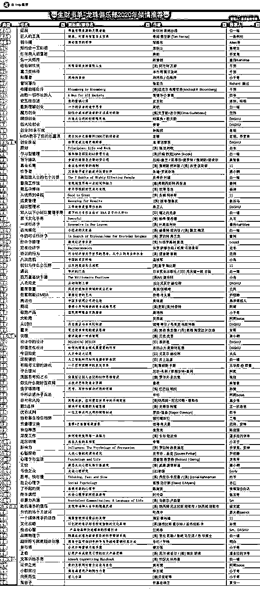

## 星球适合什么人以及技术人的一些问题-2019

我的关注点在于做一个持续产生被动收入的产品，所以本星球可能讨论产品、软件多一些，但这不是重点，不做产品，也可以持续稳定的产生很多很多收入，最近这一期很多人发的介绍和经历已经证明了这一点。

我不建议你做自媒体，也不建议你去找人开发程序，不太适合你。

给你一个小建议，将每个人的自我介绍都看一遍，然后找一个已经赚到钱并且TA的方法在你的能力范围之内，主动去勾搭请教，发红包、请吃饭。

被拒绝没事，很正常，真诚的主动是法宝，给别人发消息没收到回复也非常正常，大佬都很忙，再多发几遍，总是能逮到大佬空的时间。

## 到期不续费，之前的内容还能看吗-2019

前面的内容都可以看。