# 巧用【阿米巴模式】无成本创业，操盘多个项目均实现利润百万的心路历程复盘！

> 来源：[https://j1wajodf8qq.feishu.cn/docx/EwhLdFonFoxLuBxjuZUcBxNonxd](https://j1wajodf8qq.feishu.cn/docx/EwhLdFonFoxLuBxjuZUcBxNonxd)

# 一、前言：

大家好我是一尘学长，一名深耕大学生市场的连续创业者。

之前分享过如何通过承接上游资源利用大学生团队实现年利润300万。

在星球发布资源对接帖承接线上项目，高价值发挥大学生兼职群体的作用，3年利润300w+的方法论

昨天低调哥在生财航海家分享了阿米巴模式的玩法，我是一名阿米巴模式的受益者，亦仁老大问我有什么落地的例子吗？

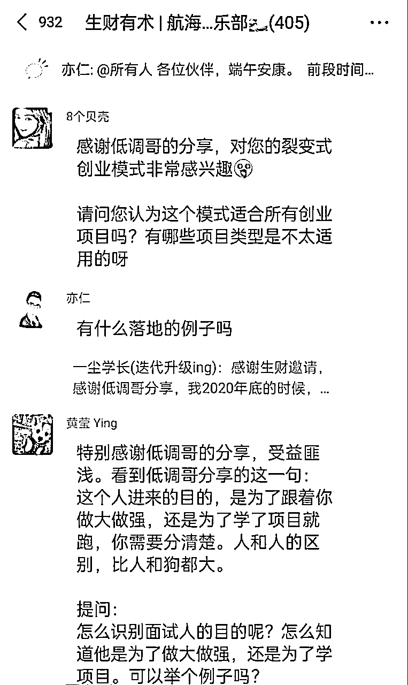

今天我来详细分享一下我用这个模式的感受，通过阿米巴模式在线下做大学生本地生活服务实现年入300万+，线上做了：百度答题项目和小红书K12引流项目，均实现单个项目营收百万+。

阿米巴模式我用了3年多，也通过自己的实操把这个模式迭代了3次，我个人觉得阿米巴模式对我这种没钱、没人、没资源的草根创业者是极其友好的，尤其是今年市场整体行情好像都不太好，这个模式用的好可以实现无成本创业。

通过这个模式我成功的带着20多位阿米巴合伙人实现了月入过万，也实现了自己从打工仔到保时捷车主的华丽转变。

接下来我将以深度拆解自己使用这个模式的心路历程复盘，来为大家浅浅的做个分享。

全文1万字，没有任何贩卖焦虑，没有任何吹牛让人不适环节，只有对自己的深度剖析，大家可以放心观阅。

# 二、了解阿米巴模式，勇敢尝试

## 1）因为生财，了解阿米巴模式

20年我还是一名大学时期开始创业的小白，在20年4/18加入生财之前做的是大学生市场+劳务派遣工作。

20年的时候口罩时期对我做的行业影响很大，春季没开学我直接原地毕业，那时候工作也不好找，我就索性选择了在学校附近租了个房子，继续做大学生市场。

因为没钱、没人、没资源外加口罩一直反复，我就想找个低成本创业的方法，最好能让我无成本创业，当年11月份我在生财看到了低调哥分享的精华文章：《资深创业老司机传授抱大腿的方法论》。

https://wx.zsxq.com/dweb2/index/topic_detail/582282125424214

当时觉得低调哥挺有趣的，就链接了一下，然后付费学习了阿米巴模式。

阿米巴模式的简介：

阿米巴是来自大自然的一种变形虫。

这种虫子的最大特点是，可以随着外界的变化不断的调整自己，从而适应不断变化的环境。

阿米巴的经营管理模式是由日本的企业家稻盛和夫所创立的。

其核心理念是将企业划分为若干个小的团体，通过独立核算制运作，在这个团体中培养具备经营者意识的领导人，从而实现全员参与经营的参与型经营。

阿米巴模式的特点：

1)每个阿米巴合伙人都是老板，自主经营、以结果为导向

2）独立核算每个阿米巴小团体都能清晰的根据数据了解自己的情况

3）阿米巴模式鼓励全员参与经营，可以很好的提升员工的工作积极性和主动性

阿米巴模式的优点：

1）可以快速培养人才，帮你快速放大你的业务

2）可以客观的衡量每个阿米巴团队的贡献

3）可以实现数字化和精细化的管理，方便修正你或者团队的方向

4）启动成本低、利润增加，对创业初期来说非常友好

5）可以有效的传递市场压力

6）灵活性很强，可以适应很多场景

阿米巴模式的缺点：

1）阿米巴经营后期要精细化管理，后期对信息化和精细化的要求会越来越高

2）对阿米巴成员的意识和理念要求比较高，要做团队文化

3）对阿米巴合伙人有一定的要求、要侧重对人才的筛选

阿米巴模式发展的理念：

以人为本、要为阿米巴成员提供成长和发展的支持

阿米巴模式的适用场景：

1）你跑通了0-1，且你的经营模式可复制（比如：IP+销售+产品，小闭环）

2）你的变现模式是健康的

## 2）做阿米巴模式前我的个人背景情况

16年进入大学，发现大学天地广阔，萌生想赚钱的想法。

17年大二，开始尝试创业，选择了当时爆火的劳务派遣，为了能给我招聘到的同学做服务，我寒暑假期间进了5次电子厂和同学们同吃同住。

到大三开始在学校有了一些口碑，有人跟着我做代理，跑通了校园单个业务的闭环，也开始做其他的产品变现。

这一年寒假我也刚好赶上了一波风口赚了小几十万，大四上学期买了辆奔驰C，想着用这个车跑其他学校的市场，搞一下势能然后开始起飞，也投入了很多资金去打各个学校的市场，但是寒假刚开始的时候口罩来了，直接把我的梦想击碎了，把这几年赚的都赔了回去。

20年9月份再开学的时候，我原有的代理基本上都毕业了或者准备考研找工作，我陷入了无人可用的尴尬局面。

虽然做了几年劳务，但是除了赚了点小钱，其他的啥积累也没有做。

为了能更好的在学校开展工作，我拿出了最后仅有的积蓄和朋友一起投了一个学校的店。但是由于没有打点好关系，刚开学就因为被同行举报而被学校处罚关店一个月，最终导致关店又赔了个血本无归。

至此，我又真正回到了啥也没有的时候。

唯一值得庆幸的是加入了生财，那时候生财每周还有夜话，虽然聊的内容和我的行业没有什么关系，但是我相信以后会用的上的，所以基本上有空的周末都会去参加学习。

总结一下：

1.  通过勤奋+卖苦力，赚了一点小钱，但是对商业模式和体系一窍不通。（不想靠体力赚钱）

1.  想做团队，但是无将可用，小代理有几个但是啥也不会，我就是一个救火队员。（想搭建个能打的团队）

1.  连续两次扩张都失败了+口罩时期不稳定，想走低成本创业路线。（兜里没钱）

1.  劳务变现单一且脆弱，看天吃饭，寒暑假工出发地-途径地-到达地任一环节有疫情，直接就凉了，需要有一个灵活的好模式来应对多变的市场。（想做更多的项目，风险对冲）

1.  想要快速整合学校的资源，做自己的IP实现一鱼多吃、多元化变现，打造自己的商业闭环。（尝试做积累）

结合阿米巴模式的特性和我受众群体特性（大学生），我当下的情况完美契合。

在我看来阿米巴模式是特别灵活且极具韧性的一个经营模式，于是我决定在线下大学生市场开始尝试阿米巴模式。

# 三、阿米巴的线下实操：如何通过阿米巴模式低成本放大我的校园业务？

## 1）第一个坑：阿米巴合伙人没做筛选

初入社会的我，未经挫折很天真，别人说什么我就信什么

你说要加入团队一起创业，OK那就直接来，你说你有流量或者项目我们可以合作，那我必然坦诚相待。

这样做的结果是什么呢？

轻易就加入团队的小伙伴，执行力不行、甚至毫无积极性，明明是你要和我一起创业，弄得我得求着你去做事，这样的团队，完全不是我想要的。

没有经过筛选的合作商和同行，各种套取我的信息然后挖我的墙角背刺我。

这哪里是创业，这明明是给自己找不自在。

吃过亏的我开始反思这个问题，为什么我找的人就这么抽象？

为啥我的合作商只会在蜜月期的时候好好做交付，后面就开始以损害团队名誉来中饱私囊了？

是我运气不好吗？这些抽象的人都让我遇见了？

深思以后，才明白筛选大于培养

那为啥最开始不做付费筛选呢？

原因如下：

1.学校没有人搞过这种模式，学生也没有付费意识；

2.我不自信，我不知道能交付大家什么。

我也深度反思了，为啥我的合伙人这么差劲，我找的合作伙伴为啥总是背刺我？

思来想去我总结了以下几点原因：

1.  很多人加入团队只是抱着试试看的态度来的，他们只是想来试试看，或者说换个地方摆烂。而我却是在为这件事拼命。

1.  这批阿米巴合伙人都是因为表面利益聚集在这的，大家观念不同，我谁都管控不了

前期蜜月期没过的时候还好，后面合作的交付做的很差。

但是他们没有损失，伤害的都是我的信任，这让我特别难受。

1.  没有契约精神，学习完我的东西后，他们可以跟别人合作，然后反向内卷我

没有契约精神，和你谈好的价位，后面他会压你的价，逼你妥协，你不给他就和别人合作。

1.  大家都是半路出家的，对这个团队没有认同感

除了我这边会维护团队名声，去用心做团队的建设，其他的团队都只会想消耗团队的名声去赚更多的钱。

1.  真诚利他在不对的人面前就是傻叉

有一个团队打着合作的幌子，来我这把我的所有模式和玩法套完以后，快速抄袭我的模式和渠道自己单干了，培养了一个很牛的同行，他打着退伍大学生+老兵创业的旗号，狠狠的给我上了一课。

虽然涌现了很多棘手的问题，但是我也没有更好的选择。

我决定继续做阿米巴模式，要做外部项目合伙人+内部团队核心项目负责人，来进一步节省我的时间，然后做出我的团队IP和文化，打造一支属于我自己的高战斗力团队。

针对上面这些问题，我开始逐个打补丁。

## 2）阿米巴模式第一次迭代

吃过一次亏以后我痛定思痛，打死了我心里那些天真的想法。

我决定加大筛选力度，来保证大家对我足够认同，也开始尝试通过做团队文化来保证团队的凝聚力和战斗力。

打着能一起赚钱又能一块进步的招聘口号，加上我的口碑还不错，很快我的团队就得到了大量学弟学妹们的青睐。

为了保证我不在同一个地方摔倒俩次，我开始尝试付费合伙人模式。

### 1.付费筛选合伙人

这里罗列一下我当时说服我自己收费的原因，有以下几点：

1.  愿意对自己身上投资，愿意为自己的成长付费的用户本身就比绝大多数的免费用户优秀

免费的用户里面太多光想青年，光打嘴炮并不行动，付费的最起码愿意对自己投资。

1.  对我足够认可，只有真金白银的投票才是真实的认可

不看你说什么，只看你做什么，说话好听的太多了，我对你的态度取决于你对我的态度。

1.  给我一个名正言顺去给你定目标、追过程、要结果的身份

免费用户不动的时候，我无法鞭策他，他自己都放弃自己，我又凭什么要做那种恶心自己又为难别人的事。当时带那些不收费代理，我得求着他干活，他总觉得自己是来打工的，收费后的他会主动找我要成长，区别很大。

1.  合伙人的费用能够覆盖我后续做团队文化和团建的费用

就这样，我推出了我的第一期核心训练营，1288/年，通过层层面试和筛选，我拥有了一个8人的核心小分队，这8个人有3个还是先进来，赚够学费后再交的，所以在最开始的时候，真正付费的就5人。

人员招聘够以后，我开始物色场地，后面要谈合作+开会总得有一个办公的场地吧。

### 2.申请学校的创业场地

本着能少花钱，就绝不花钱的理念，我开始物色高性价比的场地，最后发现最香的场地居然是学校的创业空间。

用创业的场地不仅不花钱，还能得到学校的一些资源扶持和指导，然后我同步申请了大学生的创业补贴，每年还有1万多的场地收入。

这样下来，创业最硬核的人工和场地成本在我阿米巴+学校创业园的操作下，不仅一分钱没花甚至还能每年给我提供几万块钱的现金。

人招完了，场地也有了，是不是该大干一场了？

不，还有一个重要的问题需要解决。

## 3）如何保证培养好的核心负责人不会跑？

辛辛苦苦培养的合伙人，要是跑了岂不是给别人做了嫁衣？

这个情况我想很多做市场的小伙伴都深有感触

我做人力的时候饱受其害，总是有公司会以高价挖走我的代理和客户。

这次我一定不会再给别人做嫁衣了。

我的应对做法是：

帮合伙人去搭建他们的小团队+做团队文化建设。

接下来主要讲讲文化建设。

### 做团队文化

既然半路出家的不容易出认可，那我也不用之前人力的公司名称了，新名新气象。

1.先成立了新的校园工作室-星尘校园工作室

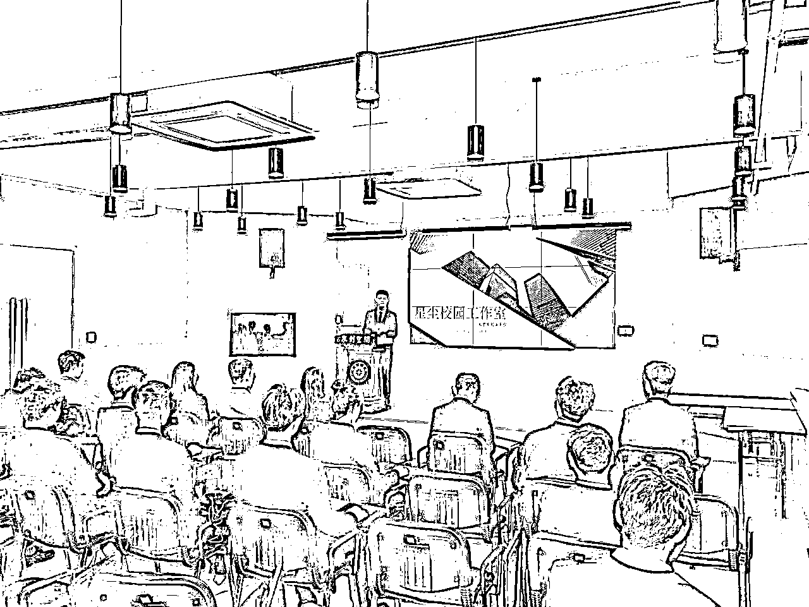

2.增加团队辨识度：所有人统一改昵称为xx学长，谢谢学姐，保证我们的昵称一致性，方便大家去辨认

3.为了从根本上解决人员流失问题，我开始针对大学生的特质去做对应的团队文化建设。

跟他们分享思维成长的内容，还有读书分享：

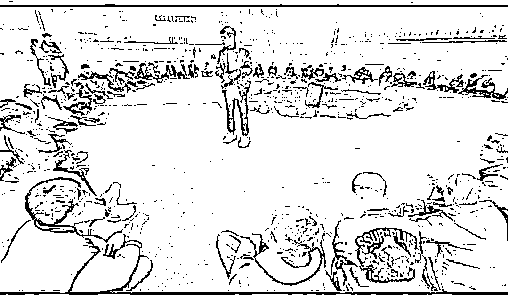

不仅我自己分享，优秀的小伙伴也安排上分享，来增加大家的参与感：

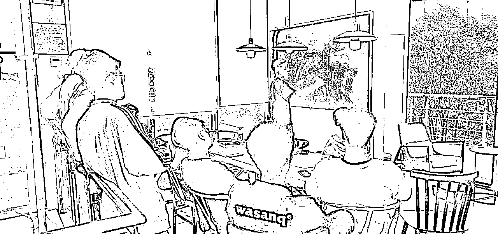

借助现金流游戏，通过和大家一起做游戏来发现大家的问题，拉近合伙人之间的距离，磨合团队（现金流游戏是郑州生财夜话的时候跟着圈友路哥学的）：

团队整体文化建设有了，针对核心负责人，我也会做相应的文化建设。

1.感同身受，矛盾转移

只有他开始带人了，他才能理解我的一些做法。

管理第一步，转移矛盾，永远不站在团队矛盾的对立面。

他的小团队里那些可爱的学弟学妹追着他要干活，他是无法拒绝的，但是如果我强压着他干活，会激发我们俩之间的矛盾。这在一定程度上避免了，我俩之间爆发矛盾，他负气出走的情况。

2.做培训积累，也防一手小人

人是我协助你招聘到你团队里的，我会积累招聘经验，同时我的生态位是比你高的，你可以跑，但是你不太能带着你下面的成员跑，你跑了他们就有机会升上来了。或者说你人格魅力很强，团队也带走了，那我再找个负责人和团队替代你。

校园业务都是销售类工作，没有太大的差异性。同样的如果是其他类型的线下公司就更简单了，给负责人招聘员工，员工属于公司，而不属于负责人，当负责人有足够能力时，协助他开分公司即可。

3.渠道管控

渠道是我对接的，整个团队的能量一定会大于你个人，这个渠道你是用不了的，新渠道你需要磨合，你确定你能干的过我？

4.强大的生态位支撑

我是本地区的校园市场天花板，生态位是实力决定的，渠道、服务、培训模式、文化建立、都是影响因素，很多人跑无非是因为渠道价格，我都无成本创业了，还有谁的价格能卷的过我？

5.只有我做大学生全域变现

我走的无成本创业模式，我的成本足够低；

我用的阿米巴模式，我的人足够多；

我背靠生财，我的信息足够牛，我接触到的线上小项目足够多。

大多数人都没法解决人员、项目、成本的问题，让我以这种模式解决掉了。

所以他们只有单个板块，而我有线上线下多个业务板块，我可能个别板块的业务打不过你，但是我业务多啊，你会因为一棵树去放弃一整个森林吗？

综上所述：我做劳务的时候，总是被挖代理，但是使用阿米巴走无成本创业以后，就没有再出现过被挖人的情况了。

## 4）大学生本地生活服务的项目闭环搭建完成

一切准备就绪后，由我带着选拔上来的负责人，去对接好相关的资源，并带着他跑通项目的基础闭环整理出基础的SOP流程，剩下的玩法升级和模式迭代就交给各个项目板块的负责人，我只负责指导即可。

就这样我花了半年的时间，快速搭建起来一个大学生本地生活服务的业务盘，成功实现了我的校园业务闭环。

开学季做包车到校服务、在车上就开始宣传，卖电子产品+校园卡（流量卡）、接着推驾校+周末影院+节假日周边旅游、平时再推推吃喝玩乐、考研考证，到学期结束以寒暑假工和返乡大巴车结尾。

平时再对接一些生财圈友的业务，完美实现了一个流量多次变现的目标。

线下合伙人反馈好评如潮（截图展示部分反馈内容，佐证一下所言非虚）

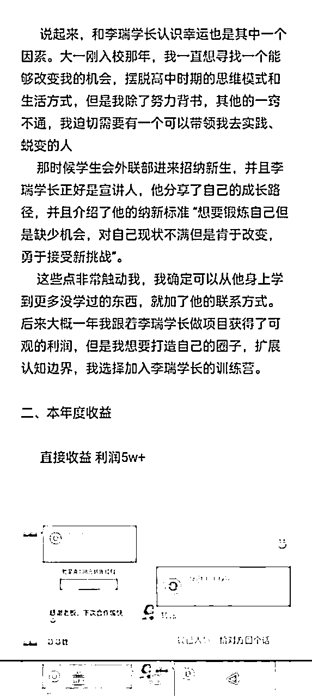

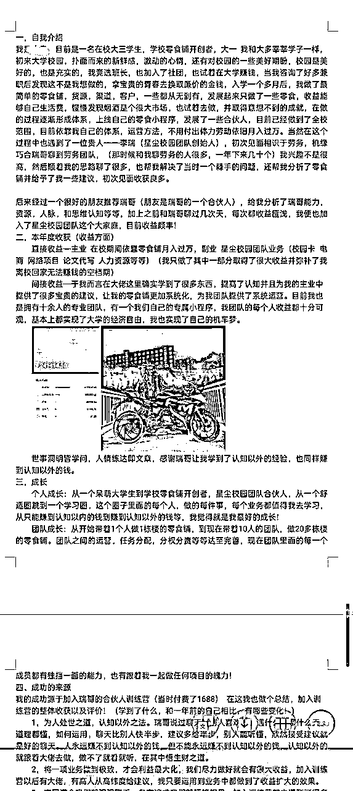

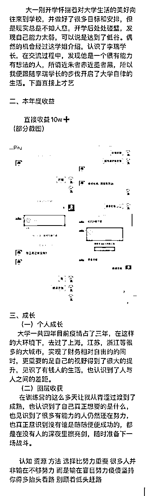

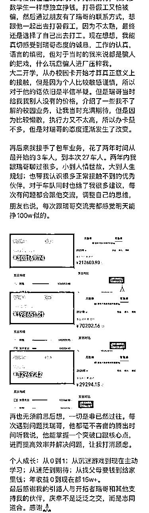

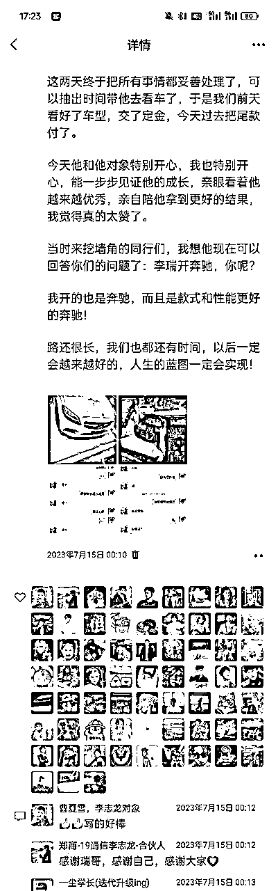

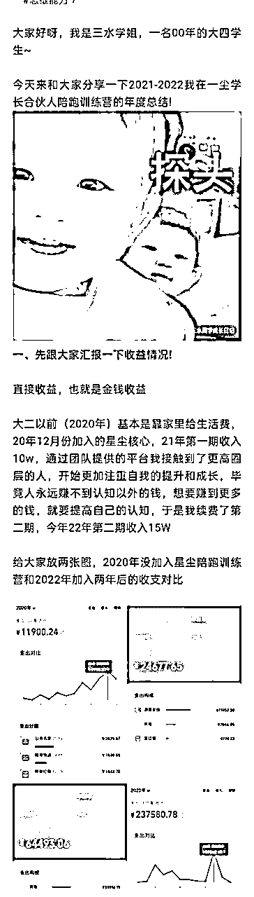

22年以后又加入了撸货+茅台预约项目，就这样一支能稳定收入300w的校园团队横空出世。

从18 岁大一进入大学，到22岁大四毕业，很多我们学校的小伙伴都被一条龙服务过，而我就是那条龙。

# 四、阿米巴模式的线上迭代

线下做的好好的，为啥突然又开始往线上走了呢？

主观原因：我不想只吃老本，我想去立新功，一个学校的市场天花板太低了，我想去更广阔的天地中实现我的梦想，也想看看这个模式能否应用到别的领域。

客观原因：我的合伙人们随着不断的成长，水涨船高的需要更多的利润空间以及更优质的资源，所以我不得不提前去更高的战场上为他们开辟一片新天地，去尝试更多的不可能。

## 1）闲鱼电商

都说闲鱼是所有电商小白的新手村，22年7月份，我开始带着选拔过的阿米巴合伙人埋头干闲鱼，项目来源依旧是生财，找的随心哥报名了闲鱼二手机的训练营。

选了10个负责人，我亲自下场，做了一个月的闲鱼，公众号日记连更30天。最终取得的成绩并没有达到我想要的结果。

只有我用2个账号实现了月入3000，另一个负责人实现了月入1500，其他的几个人成绩惨不忍睹。

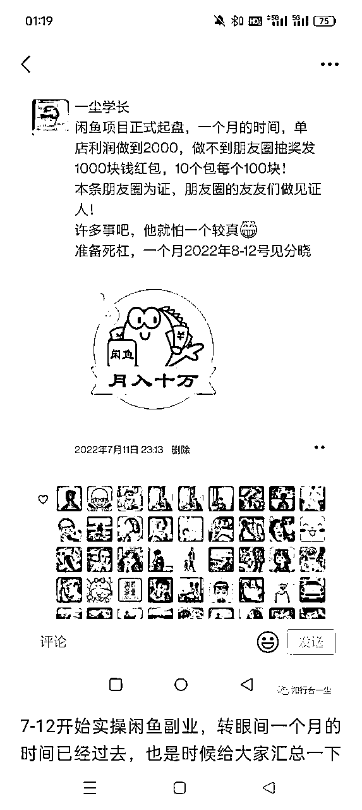

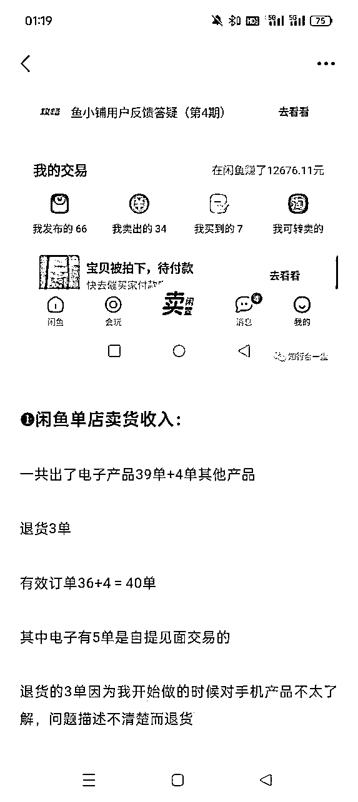

百战百胜的线下校园合伙人在线上就不行了

经过这个事我才发现我的一个误区：阿米巴合伙人的能力不能迁移。

换句话来说，我当时根据某些特质筛选的合伙人他只在某些特定的方面优秀。线下能打不代表来线上还能打，A项目能做，其他类型的B项目就没法做了。

如果我想要在更多的领域有一席之地，那我可能需要更多的各色各样的阿米巴合伙人。

同样的，这些合伙人，我还得能为他们提供服务，不然那不就成割韭菜了？

于是我开始尝试做线上大学生合伙人，针对那些在校创业或者是做大学生市场的群体，把我的玩法和模式教给他们。

就这样我在2022年12月底招聘了第一批线上阿米巴合伙人，收费1880/年，开始测试各个大学不同的环境下的变现方法。

但是这样其实就出现了一个新的问题：

这些线上合伙人只有做我的项目时，才会为我产生收益，我给他的经验指导产生的利润虽然有我参与，但是产出却与我无关。

如果只为了赚这几万块钱的合伙人费用，那投产比也太低了。

我当时想到的办法是，那就多找一些我的项目来做，刚好12月份AI 横空出世。

基于AI 我将一个小项目做了结合，打响了线上的第一枪。

## 2）百度答题

这个项目是百度旗下的问答项目，22年9月份的时候测过一次，那时候受技术的限制，单人每天产出20-30，因为产出太低，这个项目当时被我给pass了。

22年12月AI横空出世，我们思考到可以用AI采集答案来回答问题，如果能把这个项目做成培训项目，那我是不是可以赚点线上合伙人的利润。

说干就干，我发朋友圈收费199内测20个学员，安排一个阿米巴合伙人带队实操。当时给这个合伙人的权益是：底薪1000+最高权限的项目分佣。

实操2周后第一批的内测学员全员上岸。

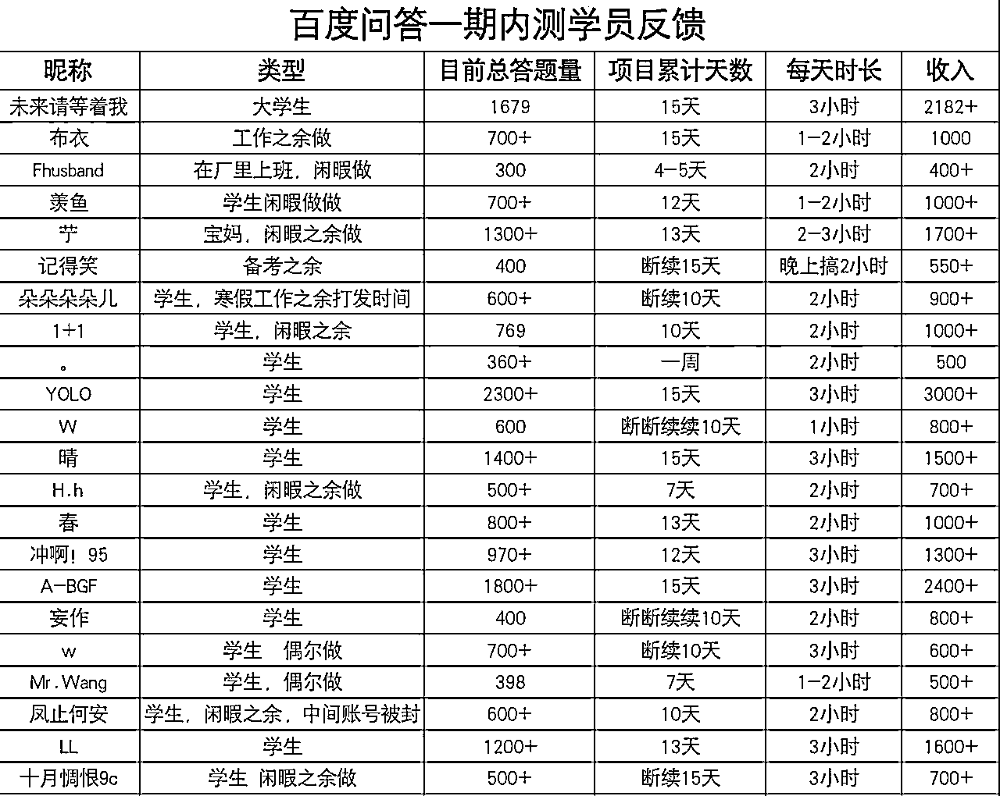

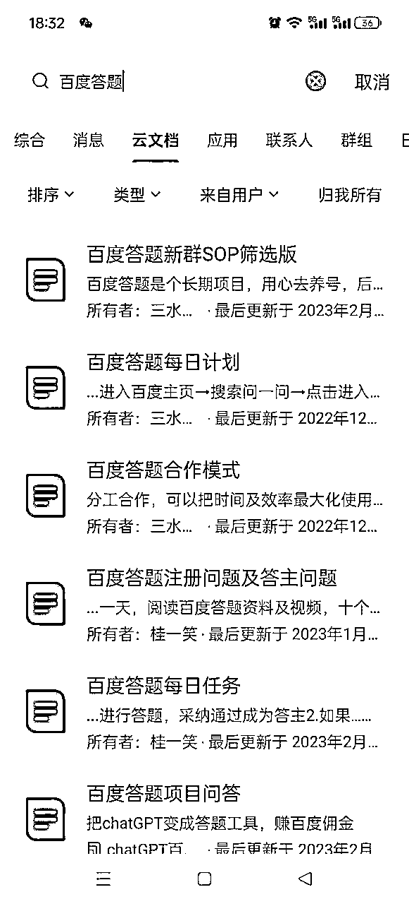

就这样负责人着手做项目sop和培训答疑文档，合伙人群同步信息开始拉分销群。

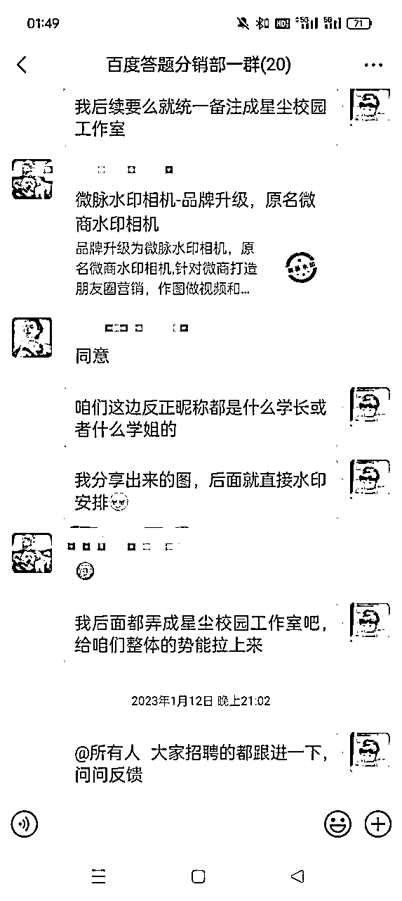

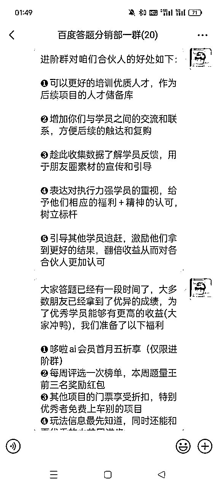

借助阿米巴的合伙人，我快速的以299-399的价格卖爆了这个项目，一共做了5期，培训营收近百万，带着3000+学员实现了副业月入过千，中途还在生财的社群运营航海中分享了一波社群发售经验。

这次小项目取得的成功，是我在线上拿到了第一波的正反馈，在一定程度上解决了培养的线上合伙人的收益与我无关的问题，给我进军线上打了一剂强心针。

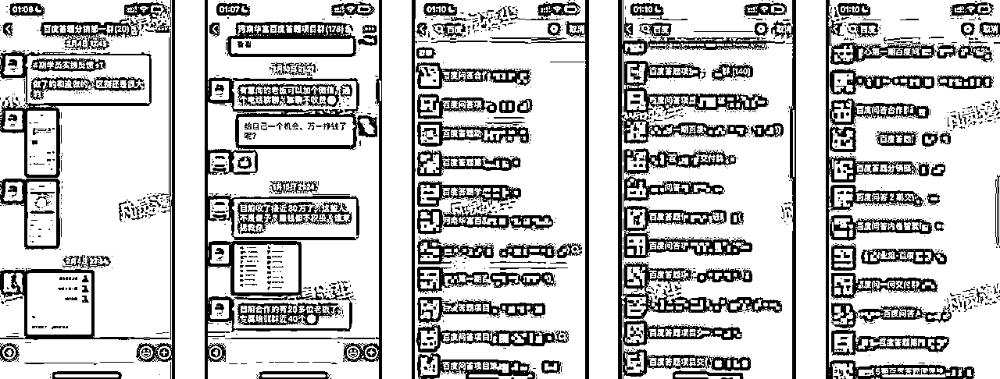

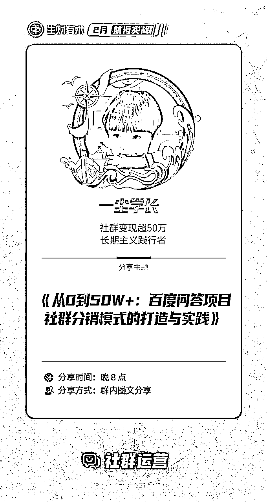

美中不足的是：

1.培训收益不多，这个项目没有后端收益；

2.刚进入互联网，我没有积累的意识和动作，比如说用星球承接这些流量，导致很多流量浪费；

3.项目门槛太低，我发售到第五期的时候市面上已经有了很多同行，问一问的生态就有点扛不住了，2023年3月份收益开始下滑，我做完当期收尾后，就停止了这个项目的培训。

做完这个项目，让我觉得，线上阿米巴合伙人的模式也是大有可为的，只要我能找到合适的线上项目即可，最好是还有后端收益。

于是我又开始了新的一轮找项目......

## 3）小红书K12引流

3月的时候我去参加生财，经过筛选和测试我盯上了引流相关的业务。

选择做流量的原因也很简单：

启动成本低、正反馈来的快、天花板相对较高、而且有积累。

23年那会小红书和视频号特别的火爆，我先后测了视频号的国学直播引流和小红书图文引流。

整体途径是：送资料、引流、然后把流量卖给有需要的甲方。

视频号率先取得了好成绩。

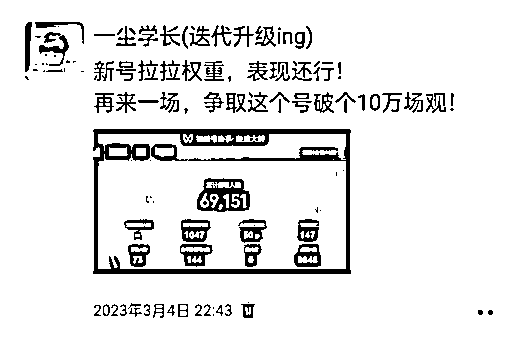

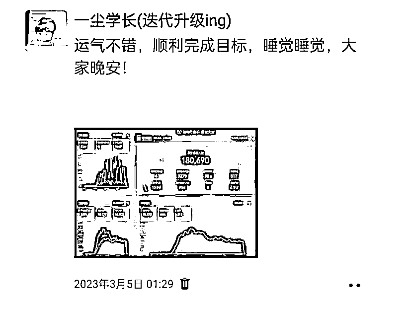

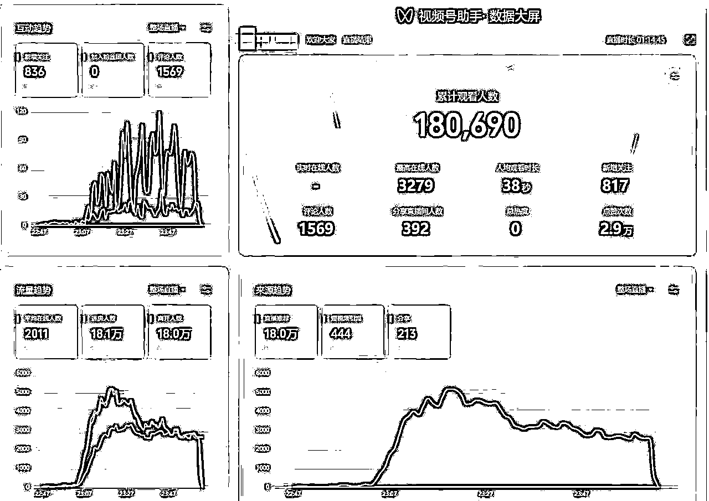

一场直播引流了2000+人，变现了大几万块钱，但是后续在深度对接的过程中，感觉这个有点擦小边，可能容易出问题，就把这个项目砍了。

然后就开始重点测试小红书上的引流。

开始是儿童绘本赛道的引流、流量不错，但是天花板太低；

接着测了旅游赛道的流量，没有做起来，和甲方谈的也没有很愉快。

3月份的时候在生财的线下见面会上，我的合伙人凡灵逸尘通过chatGPT链接了一个北京的圈友，5月份的时候他联系我的合伙人凡灵说有过千万的预算，问我们有没有兴趣测小红书K12的引流，他可以先打测试的预付款。

就这样机缘巧合下，我们开始了小红书K12引流的项目实操。

我还是依旧发动我的合伙人，开始进军小红书，做了三个月成功斩获3万私域（这个企微系统是流量中转的，没有对应的运营，所以后续删除的比较多）。

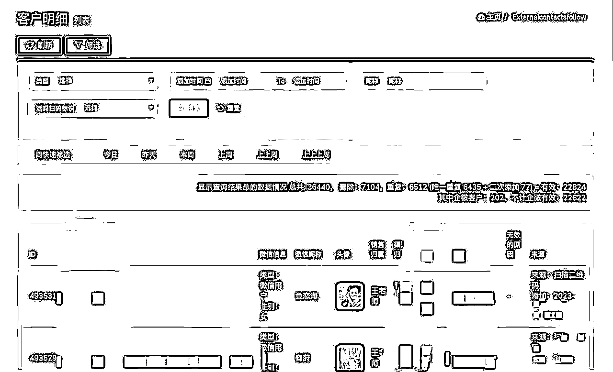

营收百万（个户和公户各走了一些，开始没有税务的概念，生财圈友宁培哥提醒后，开始走对公账户正常开票缴税）

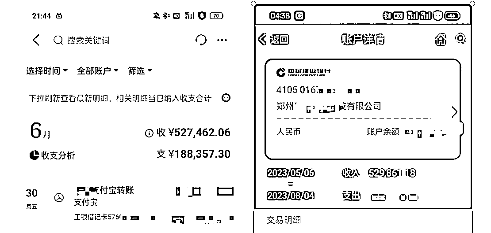

带着很多线上合伙人实现了单周收入过万，这让我觉得很赞！

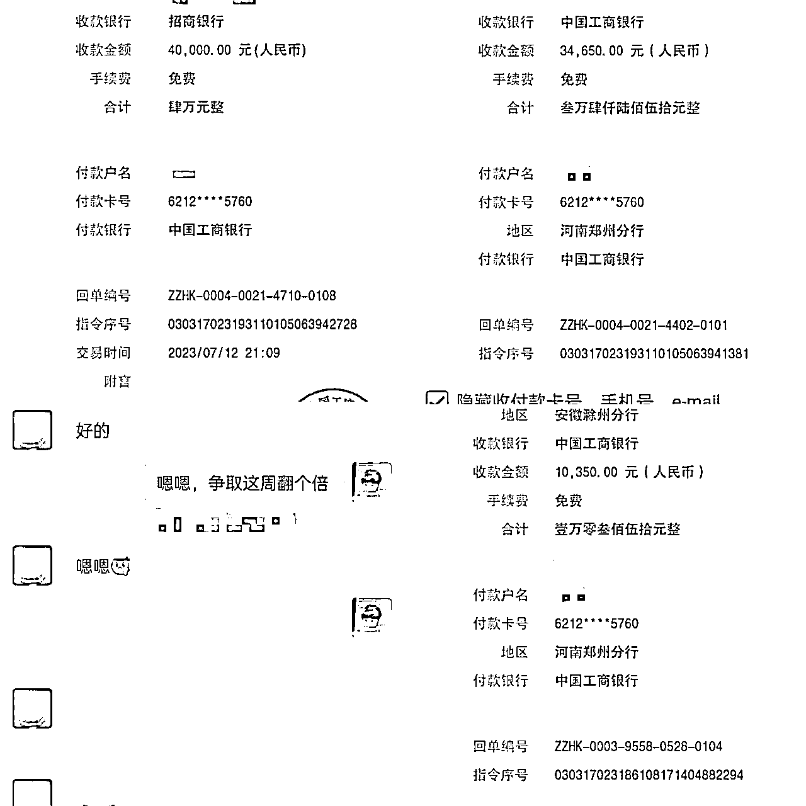

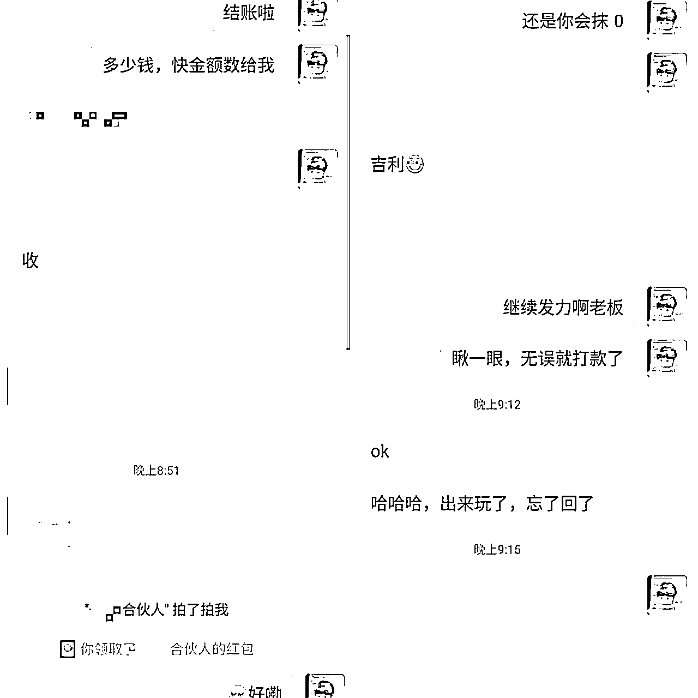

由于没有做数据留存，图片大多来自朋友圈

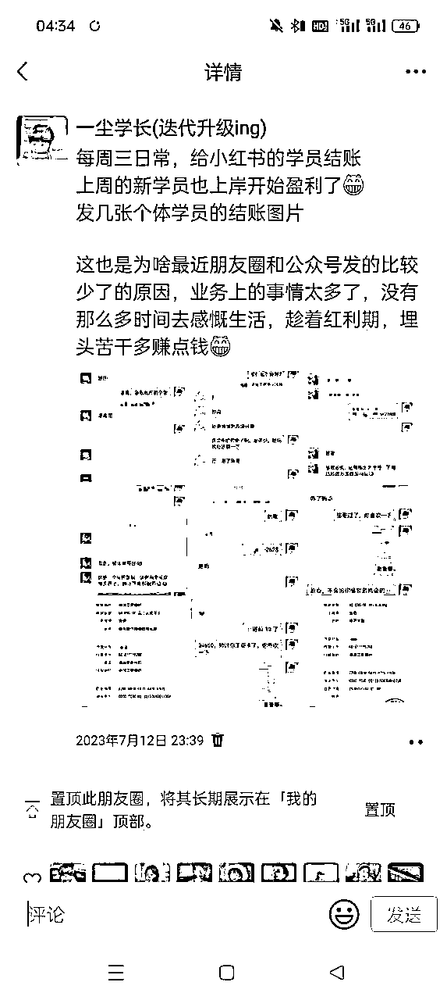

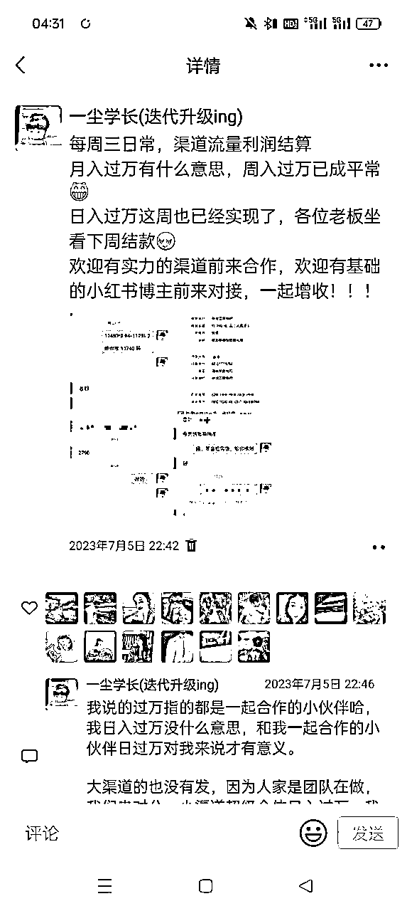

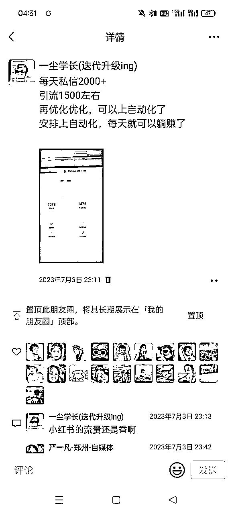

在这个过程中我们解决了很多小红书引流方面的问题，这里篇幅有限我不过多去赘述，具体内容可以看我合伙人前一段时间发的小红书引流复盘精华帖：https://t.zsxq.com/8ucrO

幸福来的很快，往往也去的很快，9月开学季后流量开始下滑，10月份小红书平台开始频繁的调整规则和玩法，我们的收入开始断崖式下滑。

同时很多阿米巴合伙人开始转战别的项目，这是我没有办法阻拦的。

因为大家是合作关系，不是隶属关系，我不给他们发工资，自然也不能要求他们陪我做不赚钱的事，但是我当时又没有办法突破这个困局，所以后续这个项目便潦草结束。

虽然最后没有继续做下去，但是我们也积累了一些其他的能力，比如企微和个微承接流量的模式和玩法，以及如何通过一些手段打标签等等，整体来说达到了锻炼我做流量能力的要求。

通过这个项目，也让我切实的认识到了我这个阶段做纯阿米巴模式的弊端。

它能够很快的资源整合，让我能快速的把这些跟我水平实力差不多的人整合到我的团队里，让他们跟我一块去打市场、打江山。

但是只依靠这个模式，我很难实现从 10 到100。

短期单个项目，只要超过了合伙人整体的水平，需要我们花费时间和精力去深耕攻坚的时候，可能是不行的。

我不准许大家跟着我不赚钱，所以我开始痛定思痛，做线下直营+线上阿米巴模式。

技术性问题由线下实操团队攻克，线上阿米巴团队可以协助我快速拉势能抢占生态位，去放大体量。

## 4）小红书商单

23年底我们开始了小红书商单项目的测试，这次我摆脱了以往的路径依赖，选择了公司化直营。

招聘员工、深耕一个领域、搭建配套的拍摄场景、批量上账号，做优质的内容，接品牌方的推广，收益很不错，但是万粉优质账号的要求太高了，投入也比较大，一般的合伙人做不了。

针对这个情况我又做了门槛较低的千粉商单，但是千粉商单也很卷，我的小伙伴一个人控50个号，单人月收入也就2万元左右，我整体评估了一下，除了能赚点小钱好像没有什么大的积累，便没有尝试去用阿米巴模式大量放大。

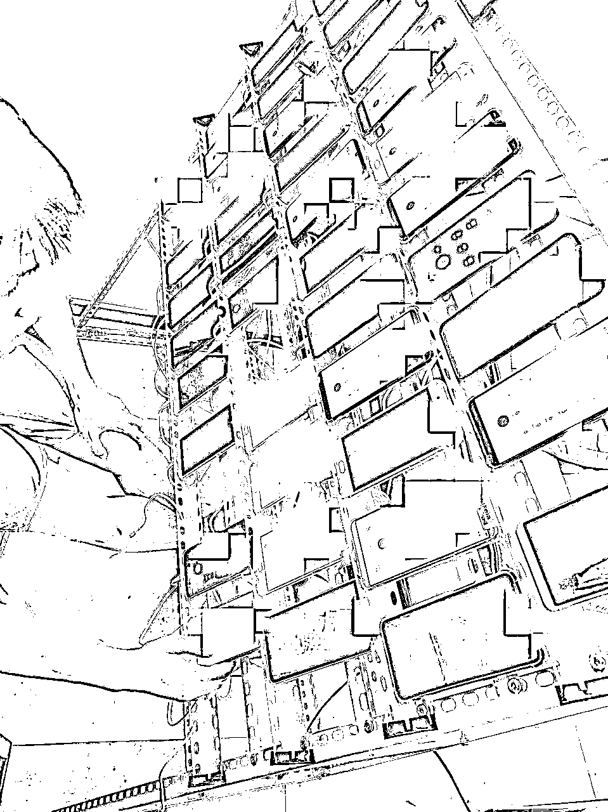

通过这一系列的项目实操，不断的找项目、测新项目让我觉得这样下去也不是一个长久之计，于是我又开始了新的一轮思考。

怎么用阿米巴模式搭建一个长期稳定有积累的业务盘？

带着这个问题，我参加了今年3月份参加航海家杭州见面会，和很多圈友交流，得到了一些答案，我把这些答案汇总成一句话，大意是：

如果光是你给阿米巴合伙人赋能，是很累的，可以前期给合伙人赋能，后续一定要需要合伙人反向给你赋能的。最好是这群合伙人能给你的业务赋能，做增长。

能明白意思，但是不知道该如何具体的去执行。

5月份的时候好兄弟七小来郑州找我，我和他聊到合伙人的交付问题，向他吐槽之前的阿米巴交付模式做的我有点累，因为是我在不断的为他们赋能，而不是他们在给我共同搭建。

然后七小告诉我，我缺少必要的案例积累，如果能一份案例多次使用，就不会那么累了。另外我需要更加聚焦在一个领域，这样才能更好的实现互相赋能共建生态。

这一下让我豁然开朗：

健康的生态应该就是我在做我自己的事情，顺带着给大家赋能，给大家同步新的玩法即可。

那就找一个我擅长的领域，我身边朋友都在做的领域，最终我重新把这个领域定在了：大学生的全域变现上。

线下做大学生本地生活流量变现、线上分享这个模式和玩法、线上为线下赋能，吸引同样的人加入我，我只需要升级我自己的玩法同步给他们即可。

不同大学不同玩法，每一个大学市场的合伙人，都是我的一个案例，当案例库足够大的时候，并且能持续更新的时候，这积累不就做起来了？而且合伙人会给我持续的赋能。

而且我还能做个大学生态，比如说：我侧重项目变现、七小侧重小助手变现、挽歌侧重社群变现，都是在大学生的群体中去做变现，那这不就互相赋能上了？

而且我吸引的大多是在大学做项目的群体，他们很多都有自己的项目，这样我是根本不缺项目的。

线下做样板，线上公域复制，全域流量变现。

而且我个人又特别喜欢和年轻人交流，因为我坚信：年轻人是国家的未来，掌握了年轻人就掌握了未来！

阿米巴模式不仅适合放大自己的业务，也能很好的利用阿米巴做的积累，去做人才孵化

## 5）用阿米巴模式积累的经验做孵化

在阿米巴模式的积累下，我积累了很多项目实操的成功案例，挖掘了许多有高执行力的优秀人才，案例看的多了，我便具备了一些项目拆解能力和人才挖掘and人才培养能力。

浅浅地举两个例子：随机分享，合伙人营收百万

在小红书K12引流项目开展的过程中，圈友发的有一个天涯神贴的小项目进入了我的视野，这个小项目和当时做的百度答题很相似，同样的这个项目没有很强的积累性，我很看好这个小项目，就把这个项目资料和玩法发到了合伙人群里，鼓励大家去入场实操。

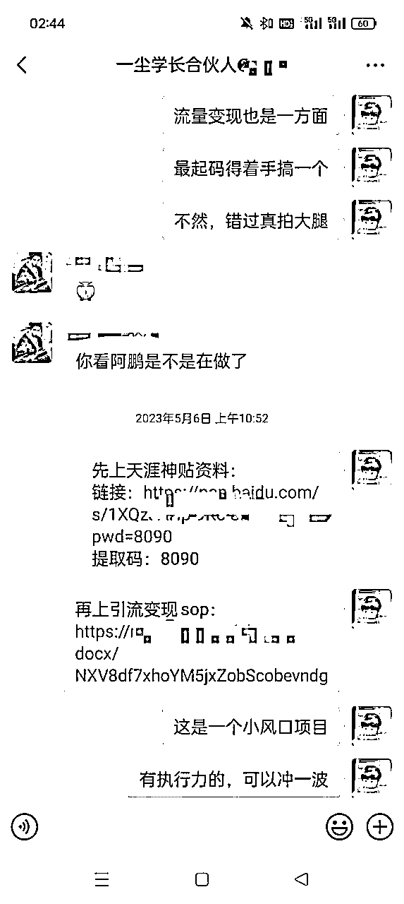

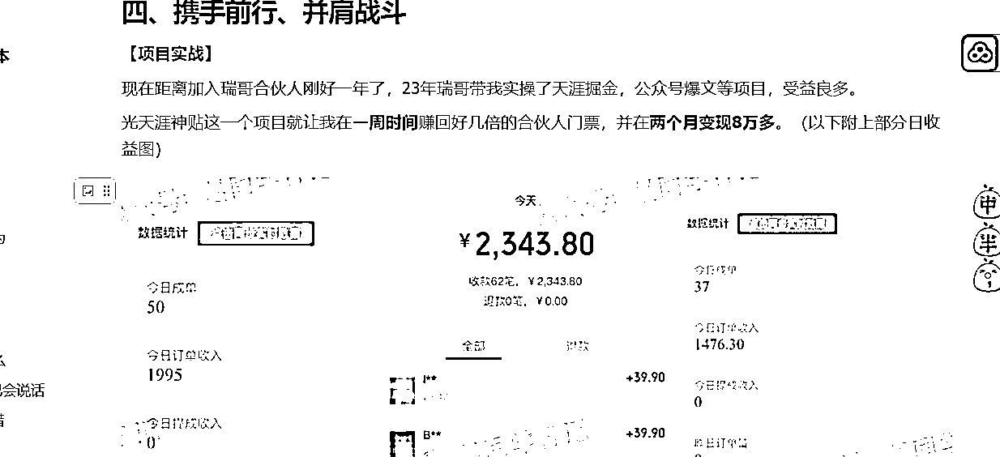

没想到只是这个小小的举动，让多位合伙人通过这个项目实现了月入过万，3名合伙人通过这个小项目实现了5万+收入，更有一位合伙人通过整合这个项目的流量，变现百万！

原本我是想自己操盘这个业务的，但是那两天忙不过来，于是我就想着，能不能把这个玩法教给别人，看到生财社群有个大学生在聊这个项目，就把我的一些对这个项目的玩法和模式无偿分享给他了。

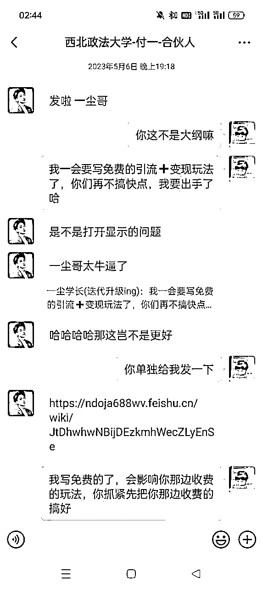

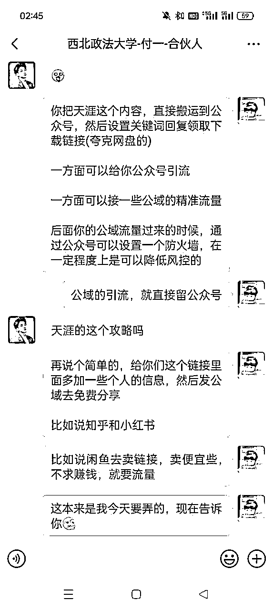

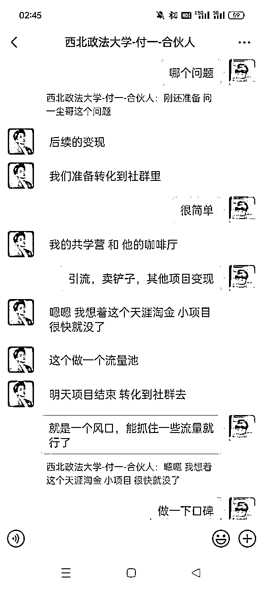

他通过这个项目带着上千人实操，发的文章还拿到了生财的精华。

当然种善因的结善果

我因此得到了一个认可我的合伙人、一个龙珠碎片（好像是有）、和一个优秀的年轻人成为了好朋友。

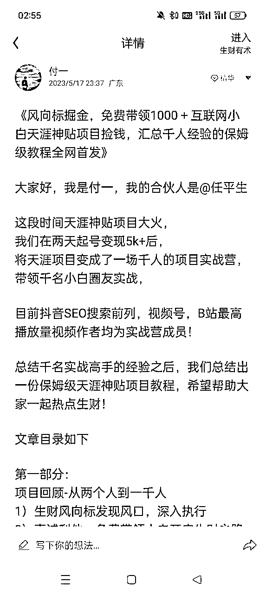

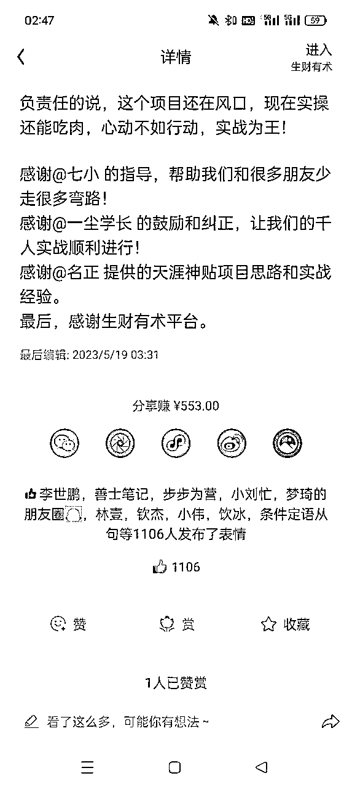

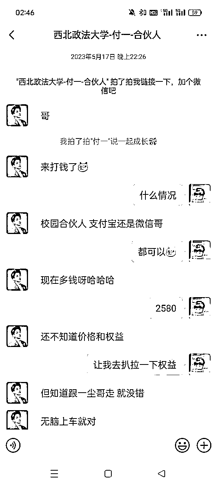

后面6月底的时候，由于这个善缘我又促成了天涯神贴的二次变现。

天涯神贴的流量群体和国学的流量群体重合度很高，恰好我有个大学生合伙人在做国学流量的变现，我就拉了个对接群，一方面帮助这群做天涯流量的圈友进行二次变现，一方面帮助合伙人创收。

同样的美中不足的是：我没有深度参与这件事，只是促成这件事的合作，最终合伙人利用这波流量实现了百万的巨额变现

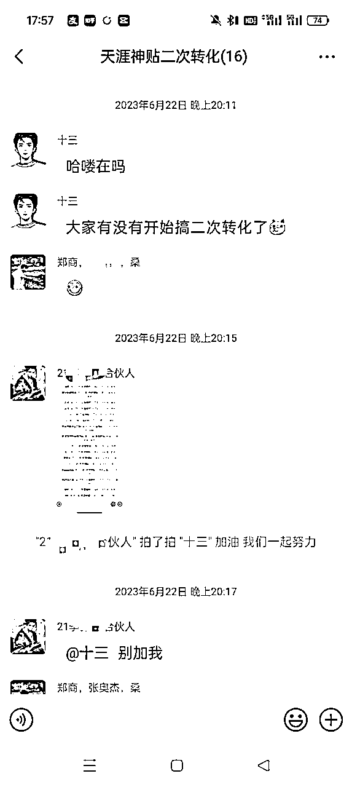

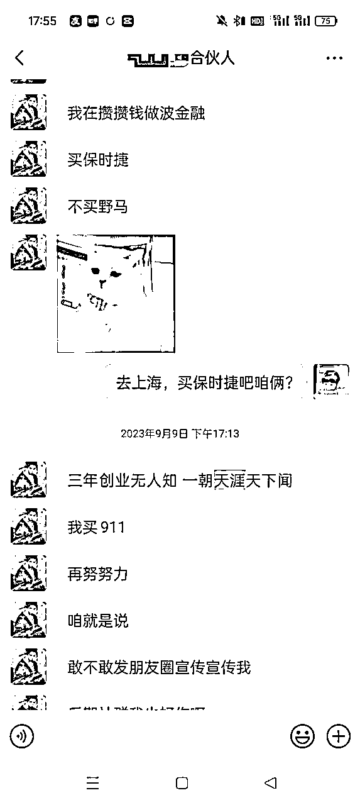

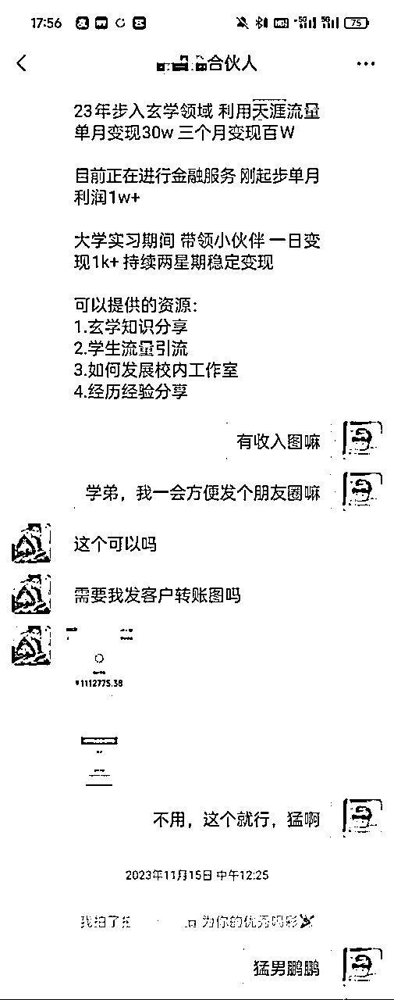

PS：这个合伙人03年的，年轻人真的有无限可能

案例2.最近爆火的视频号带货，推荐合伙人入局，月入20万

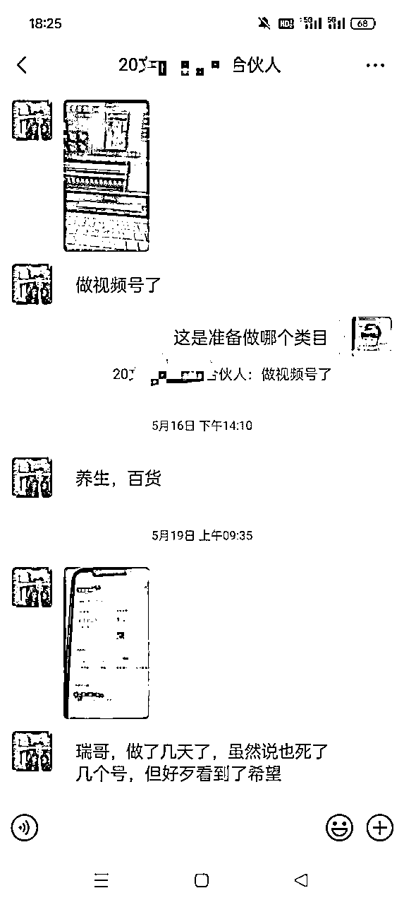

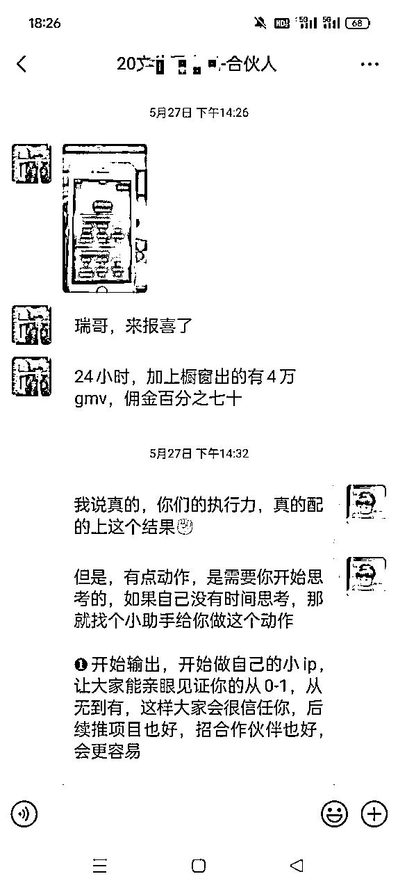

做项目的人没有太多空泛的交流，每次都是具体问题的解决和答疑

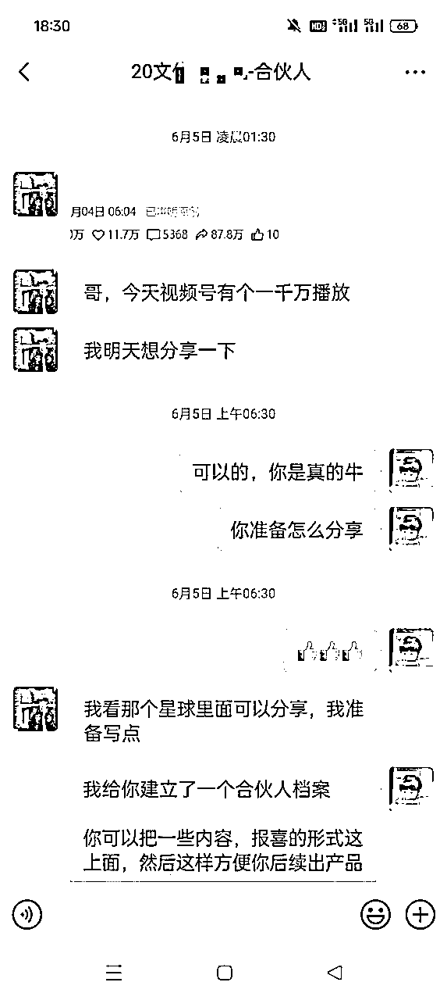

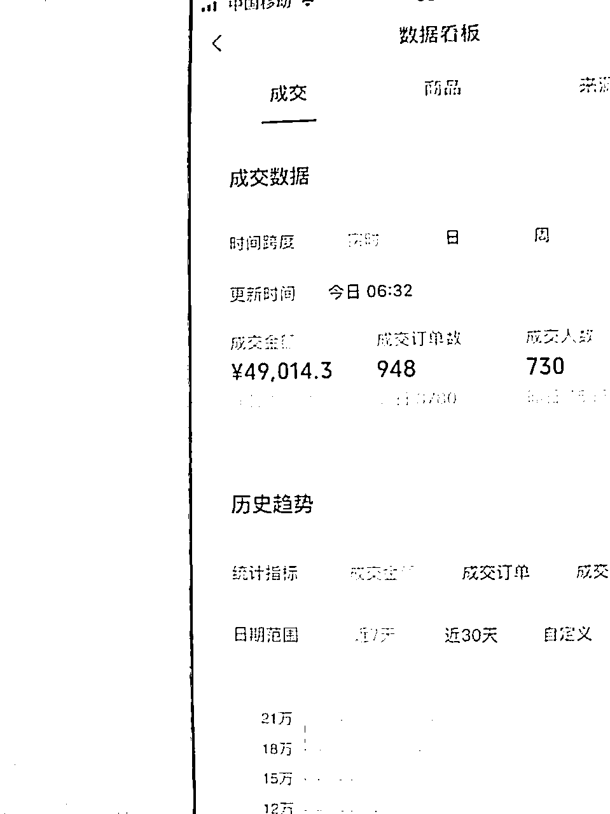

每一个合伙人都是另一个我，他们测出来的很多项目，都会给我同步进度，他们对我足够认可，都愿意和我去分享实操的细节，阿米巴合伙人的反向赋能已经初步实现。

# 五、实操后我对阿米巴模式的看法

## 1）阿米巴模式的优势：

1.这是一个可以低成本开启你创业之旅的模式

就像上文章中聊到的那样，我通过这个模式结合大学生的特性在线上实现了无成本创业，搭建起一个相对稳定的大学生本地生活服务的基本盘。

因为成本足够低，我便立在了不败之地，主动权在我，先胜而后战。

因为成本足够低，我可以大量试错直到取得一个我比较满意的结果。

因为成本足够低，我可以做很重的交付，达到良币驱逐劣币的效果。

因为成本足够低，我可以定长期战略，一步一个脚印的去走可持续发展的道路。

因为成本足够低，我的动作不会变形，疫情那两年同行觉得超级卷、频频爆雷消亡，我觉得前景异常的广阔，最终逆势增长，胜者为王。

2.这是一个多方共赢的模式

对我来说，这是一个无成本创业模式，实现了我的创业梦，对我的很多合伙人来说，这个模式同样也给了他们很多机会，我们一起成长一起赚钱，我们一起做大蛋糕、舍满取半。

3.这是一个相对聚焦的模式

没有办公成本，更没有那些琐碎的烦心事，彼此之间没有那么重的羁绊，你可以选择任何一种你喜欢的模式去做你的事情，这对我这种不是很喜欢花时间和精力去做社交的人来说，很赞。

4.这是一个能长期去做的模式

阿米巴的模式是会随着发起人的能力增长不断迭代升级的，在我看来他是具备一定的积累能力的。

项目上：跑通一个闭环然后快速可以用复制放大

人才上：会积累一群优秀的人才在你身边，抱团取暖一起跨越周期，前面你为他们赋能，后面他们给你反馈+反向赋能，他们不仅能做我的项目，我也能做他们的项目。

个人成长上：我会与各式各样的人深度业务链接，这些经验和案例都会收录到我的信息库，随着信息的积累我的成长会越来越快

## 2）阿米巴模式的劣势：

1.需要你有一定的个人能力和魅力，能结合IP去做更好

你最好有一定的做项目、选项目的能力，模式初期的时候，你需要有人跟随你，而你需要给他们一些不错的正反馈，来做案例做积累做模型。

2.阿米巴合伙人不像员工那样，无法束缚，不具备攻坚克难的能力，做不了反馈来的很慢的事情

像我刚开始做的时候，短期做不了超出能力范围的事情，大家都很吃反馈，反馈太慢。

3.受管理者的能力影响。阿米巴合伙人的综合实力不会超过发起人

前期肯定是你要给阿米巴的合伙人进行赋能的，换句话说前期你招聘不来比你强的人才，当然这个在创业初期什么模式好像都招聘不来比自己强大很多的人才。

4.需要你有迭代能力，不断的针对自己遇见的情况去迭代升级这个模式

合伙人的能力不会迁移，有人走有人来也是常态，这个模式就是要不断的去升级迭代你的能力，你的圈子，你的合伙人，这样你才会越来越好。

综上所述：

阿米巴的前期是需要我们给他们赋能的，可能这个赋能在这个项目上是完全没有收入产出的，但是战线拉长去看，这些合伙人就像我的无数个分身一样，他们后续会持续给我反馈给我反向赋能的。

最直观的来说，因为前期的关系存在，他们在跑通项目后是乐于给我分享给我反馈的，同样的从业务入手难度的方面来说，我是完全有能力去复制这些合伙人的业务的，甚至我最终可以把这些合伙人的产品整合起来，做成一个能互相赋能的生态。

阿米巴模式充满了脆弱性，因为不像公司化那样稳定，但是正是因为如此，他又具备了很多反脆弱性可以对抗很多的黑天鹅事件。

把时间拉长去看，如果不是只看一个项目周期，这个模式还是很有趣的。

更重要的是阿米巴模式的理念：和我的人生理念是高度一致的，以人为本、真诚、利他

发正心、持正念、行正道、得正果

# 六、总结

整体而言，我这几年做错了很多动作，走了很多弯路。

比如说之前没有积累意识，更没有积累的动作，少了很多案例；

比如说因为写文能力差，所以很少输出，没有很好的吃到表达者的红利；

比如思维认知有限，不知道很多时候可以深度合作，比如天涯的项目，如果我去深度参与操盘，而不是仅仅做头口指导和协助，这个项目应该会做的更大更好。

当然也没有那么多如果，很庆幸我一直在往前走，一直在迭代自己，目前的我能力依旧十分有限，用阿米巴模式只做到了百万体量，用直营+阿米巴模式可能会有望做到千万体量。

如果这方面有更牛的大佬，期待您的指教，也欢迎对这个模式有兴趣的小伙伴来交流探讨。

以上就是我这3年阿米巴模式的经验和感触。

上面的每一步动作，每一次迭代、都离不开生财，别人创业是摸着石头过河，我是摸着生财圈友过河。

尤其是我在做大学生本地生活时期，通过生财了解线上的知识为线下赋能，对很多线下的同行进行了一波降维打击，现在又能利用线下的反馈反作线上的培训，我的商业模式再次闭环开始正向增长。

在这里我由衷的向生财以及亦仁大大表达真挚的感谢，祝生财越来越好。

也想向圈友朋友们说：背靠生财，用好生财提供的平台，真的能够生财。